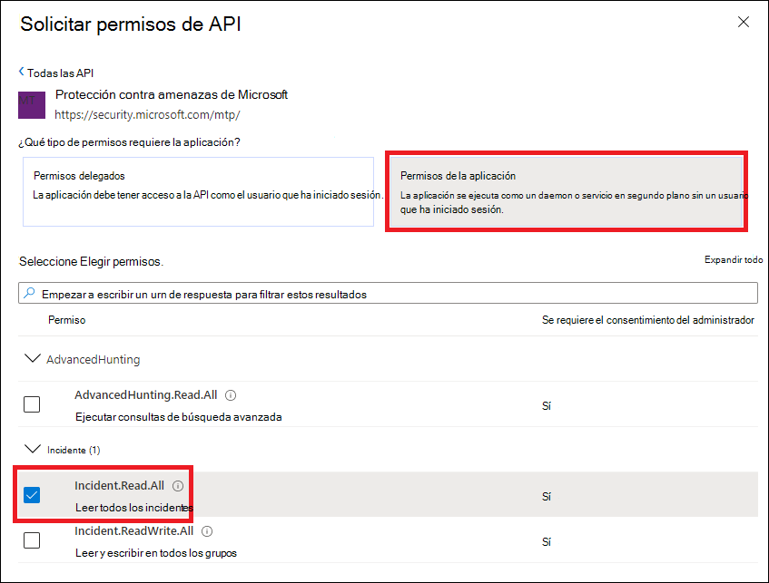
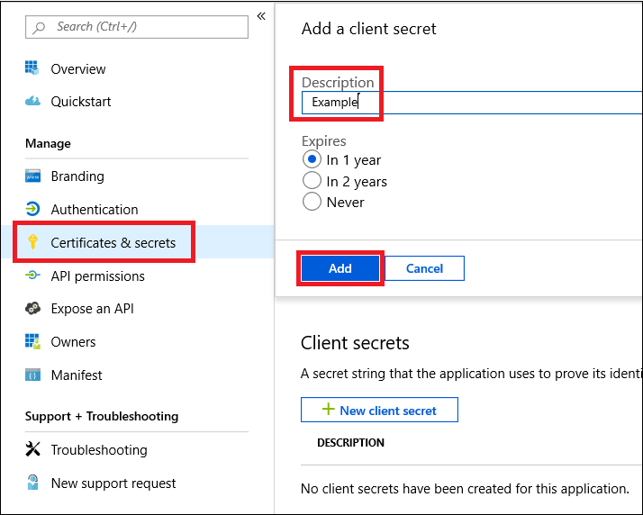

# <a name="create-an-app-to-access-microsoft-threat-protection-without-a-user"></a>Crear una aplicación para obtener acceso a Microsoft Threat Protection sin un usuario

[!INCLUDE [Microsoft 365 Defender rebranding](../includes/microsoft-defender.md)]


**Se aplica a:**
- Protección contra amenazas de Microsoft

>[!IMPORTANT] 
>Parte de la información se refiere a un producto prelanzamiento que puede modificarse de forma sustancial antes de su lanzamiento comercial. Microsoft makes no warranties, express or implied, with respect to the information provided here.

En esta página se describe cómo crear una aplicación para obtener acceso mediante programación a Microsoft Threat Protection sin un usuario. Si necesita acceso mediante programación a la protección contra amenazas de Microsoft en nombre de un usuario, vea [Get Access With User context](api-create-app-user-context.md). Si no está seguro de qué acceso necesita [, consulte Introducción](api-access.md).

Microsoft Threat Protection expone gran parte de sus datos y acciones a través de un conjunto de API de programación. Estas API le ayudarán a automatizar los flujos de trabajo y la innovación en función de las capacidades de Microsoft Threat Protection. El acceso a la API requiere la autenticación OAuth 2.0. Para obtener más información, vea [flujo de código de autorización de OAuth 2,0](https://docs.microsoft.com/azure/active-directory/develop/active-directory-v2-protocols-oauth-code).

En general, deberá realizar los siguientes pasos para usar las API:
- Cree una aplicación de Azure Active Directory (Azure AD).
- Obtenga un token de acceso con esta aplicación.
- Use el token para acceder a la API de Microsoft Threat Protection.

En este artículo se explica cómo crear una aplicación de Azure AD, obtener un token de acceso a la protección contra amenazas de Microsoft y validar el token.

## <a name="create-an-app"></a>Crear una aplicación

1. Inicie sesión en [Azure](https://portal.azure.com) con un usuario que tenga el rol de **administrador global** .

2. Navegue a registros de aplicaciones de **Azure Active Directory**  >  **App registrations**  >  **nuevo registro**. 

   

3. En el formulario de registro, elija un nombre para la aplicación y, a continuación, seleccione **registrar**.

4. Para habilitar la aplicación para que acceda a la protección contra amenazas de Microsoft y asignarle permisos, en la página de la aplicación, seleccione **permisos de API**  >  **Agregar**API de permisos  >  **mi organización usa** >, escriba **protección contra amenazas de Microsoft**y, a continuación, seleccione protección contra amenazas de **Microsoft**.

   > [!NOTE]
   > La protección contra amenazas de Microsoft no aparece en la lista original. Debe empezar a escribir su nombre en el cuadro de texto para ver aparezca.

   

   - Seleccione **permisos de aplicación** > elija los permisos relevantes para su escenario, por ejemplo, **Incident. Read. All**y, a continuación, seleccione **Agregar permisos**.

   

    >[!NOTE]
    >Debe seleccionar los permisos relevantes para su escenario, **' leer todos los incidentes '** es solo un ejemplo. Para determinar qué permiso necesita, consulte la sección **permisos** en la API que le interesa llamar.

5. Seleccione **conceder consentimiento**.

     > [!NOTE]
     > Cada vez que agregue un permiso, debe seleccionar **conceder consentimiento** para que el nuevo permiso surta efecto.

    

6. Para agregar un secreto a la aplicación, seleccione **certificados & secretos**, agregue una descripción al secreto y, a continuación, seleccione **Agregar**.

    > [!NOTE]
    > Después de seleccionar **Agregar**, seleccione **copiar el valor de secreto generado**. No podrá recuperar este valor después de salir.

    

7. Anote el identificador de la aplicación y el identificador de inquilino. En la página de la aplicación, vaya a **información general** y copie lo siguiente.

   

8. **Solo para los asociados de Microsoft Threat Protection**. [Siga las instrucciones que se indican aquí](https://docs.microsoft.com/microsoft-365/security/mtp/api-partner-access). Configure la aplicación para que sea multiinquilino (disponible en todos los inquilinos tras el consentimiento). Esto es **necesario** para aplicaciones de terceros (por ejemplo, si crea una aplicación que se va a ejecutar en el inquilino de varios clientes). Esto **no es necesario** si crea un servicio que solo desea ejecutar en su espacio empresarial (por ejemplo, si crea una aplicación para su propio uso que solo interactúe con sus propios datos). Para configurar la aplicación para que sea multiinquilino:

    - Vaya a **autenticación**y agregue https://portal.azure.com como el **URI de redireccionamiento**.

    - En la parte inferior de la página, en **tipos de cuenta admitidos**, seleccione las **cuentas de cualquier** consentimiento de la aplicación del directorio de la organización para la aplicación multiempresa.

    Necesita que su aplicación se apruebe en cada inquilino donde vaya a usarla. Esto se debe a que la aplicación interactúa con la protección contra amenazas de Microsoft en nombre de su cliente.

    Usted (o su cliente si está escribiendo una aplicación de terceros) necesita seleccionar el vínculo de consentimiento y aprobar la aplicación. El consentimiento debe realizarse con un usuario que tenga privilegios administrativos en Active Directory.

    El vínculo de consentimiento se compone de la siguiente manera: 

    ```
    https://login.microsoftonline.com/common/oauth2/authorize?prompt=consent&client_id=00000000-0000-0000-0000-000000000000&response_type=code&sso_reload=true
    ```

    Donde 00000000-0000-0000-0000-000000000000 se reemplaza por el identificador de la aplicación.


**Realiza!** Se ha registrado correctamente una aplicación. Vea los siguientes ejemplos para la adquisición y validación de tokens.

## <a name="get-an-access-token"></a>Obtener un token de acceso

Para obtener más información sobre los tokens de Azure AD, vea el [tutorial de Azure ad](https://docs.microsoft.com/azure/active-directory/develop/active-directory-v2-protocols-oauth-client-creds).

### <a name="use-powershell"></a>Usar PowerShell

```
# That code gets the App Context Token and save it to a file named "Latest-token.txt" under the current directory
# Paste below your Tenant ID, App ID and App Secret (App key).

$tenantId = '' ### Paste your tenant ID here
$appId = '' ### Paste your Application ID here
$appSecret = '' ### Paste your Application key here

$resourceAppIdUri = 'https://api.security.microsoft.com'
$oAuthUri = "https://login.windows.net/$TenantId/oauth2/token"
$authBody = [Ordered] @{
    resource = "$resourceAppIdUri"
    client_id = "$appId"
    client_secret = "$appSecret"
    grant_type = 'client_credentials'
}
$authResponse = Invoke-RestMethod -Method Post -Uri $oAuthUri -Body $authBody -ErrorAction Stop
$token = $authResponse.access_token
Out-File -FilePath "./Latest-token.txt" -InputObject $token
return $token
```

### <a name="use-c"></a>Usar C#:

El siguiente código se probó con Nuget Microsoft. IdentityModel. clients. ActiveDirectory 3.19.8.

1. Cree una nueva aplicación de consola.
1. Instale Nuget [Microsoft. IdentityModel. clients. ActiveDirectory](https://www.nuget.org/packages/Microsoft.IdentityModel.Clients.ActiveDirectory/).
1. Agregue lo siguiente:

    ```
    using Microsoft.IdentityModel.Clients.ActiveDirectory;
    ```

1. Copie y pegue el código siguiente en la aplicación (no olvide actualizar las tres variables: ```tenantId, appId, appSecret``` ):

    ```
    string tenantId = "00000000-0000-0000-0000-000000000000"; // Paste your own tenant ID here
    string appId = "11111111-1111-1111-1111-111111111111"; // Paste your own app ID here
    string appSecret = "22222222-2222-2222-2222-222222222222"; // Paste your own app secret here for a test, and then store it in a safe place! 

    const string authority = "https://login.windows.net";
    const string wdatpResourceId = "https://api.security.microsoft.com";

    AuthenticationContext auth = new AuthenticationContext($"{authority}/{tenantId}/");
    ClientCredential clientCredential = new ClientCredential(appId, appSecret);
    AuthenticationResult authenticationResult = auth.AcquireTokenAsync(wdatpResourceId, clientCredential).GetAwaiter().GetResult();
    string token = authenticationResult.AccessToken;
    ```


### <a name="use-python"></a>Usar Python 

```
import json
import urllib.request
import urllib.parse

tenantId = '00000000-0000-0000-0000-000000000000' # Paste your own tenant ID here
appId = '11111111-1111-1111-1111-111111111111' # Paste your own app ID here
appSecret = '22222222-2222-2222-2222-222222222222' # Paste your own app secret here

url = "https://login.windows.net/%s/oauth2/token" % (tenantId)

resourceAppIdUri = 'https://api.securitycenter.windows.com'

body = {
    'resource' : resourceAppIdUri,
    'client_id' : appId,
    'client_secret' : appSecret,
    'grant_type' : 'client_credentials'
}

data = urllib.parse.urlencode(body).encode("utf-8")

req = urllib.request.Request(url, data)
response = urllib.request.urlopen(req)
jsonResponse = json.loads(response.read())
aadToken = jsonResponse["access_token"]
```
### <a name="use-curl"></a>Usar rizo

> [!NOTE]
> El siguiente procedimiento presupone que doblez para Windows ya está instalado en el equipo.

1. Abra un símbolo del sistema y establezca CLIENT_ID en el identificador de la aplicación de Azure.
1. Establezca CLIENT_SECRET en el secreto de la aplicación de Azure.
1. Establezca TENANT_ID el identificador de inquilino de Azure del cliente que quiera usar su aplicación para acceder a la protección contra amenazas de Microsoft.
1. Ejecute el siguiente comando:

```
curl -i -X POST -H "Content-Type:application/x-www-form-urlencoded" -d "grant_type=client_credentials" -d "client_id=%CLIENT_ID%" -d "scope=https://securitycenter.onmicrosoft.com/windowsatpservice/.default" -d "client_secret=%CLIENT_SECRET%" "https://login.microsoftonline.com/%TENANT_ID%/oauth2/v2.0/token" -k
```

Recibirá una respuesta con el siguiente formato:

```
{"token_type":"Bearer","expires_in":3599,"ext_expires_in":0,"access_token":"eyJ0eXAiOiJKV1QiLCJhbGciOiJSUzI1NiIsIn <truncated> aWReH7P0s0tjTBX8wGWqJUdDA"}
```

## <a name="validate-the-token"></a>Validar el token

Asegúrese de que obtuvo el token correcto:

1. Copie y pegue el token que obtuvo en el paso anterior en [JWT](https://jwt.ms) para poder descodificarlo.
1. Validar que obtiene una notificación de ' roles ' con los permisos deseados
1. En la siguiente imagen, puede ver un token descodificado adquirido de una aplicación con ```Incidents.Read.All``` ```Incidents.ReadWrite.All``` y ```AdvancedHunting.Read.All``` permisos:


## <a name="use-the-token-to-access-microsoft-threat-protection-api"></a>Usar el token para acceder a la API de protección contra amenazas de Microsoft

1. Elija la API que desea usar. Para obtener más información, consulte [API admitidas de Microsoft Threat Protection](api-supported.md).

2. Establezca el encabezado Authorization en la solicitud HTTP que envía a "Bearer {token}" (Bearer es el esquema de autorización).

3. La fecha de expiración del token es una hora. Puede enviar más de una solicitud con el mismo token.

A continuación, se muestra un ejemplo de cómo enviar una solicitud para obtener una lista de incidentes **con C#**: 

```
    var httpClient = new HttpClient();

    var request = new HttpRequestMessage(HttpMethod.Get, "https://api.security.microsoft.com/api/incidents");

    request.Headers.Authorization = new AuthenticationHeaderValue("Bearer", token);

    var response = httpClient.SendAsync(request).GetAwaiter().GetResult();

    // Do something useful with the response
```

## <a name="related-topics"></a>Temas relacionados
- [Acceso a las API de Microsoft Threat Protection](api-access.md)
- [Acceso a Microsoft Threat Protection con contexto de aplicación](api-create-app-web.md)
- [Acceso a Microsoft Threat Protection con contexto de usuario](api-create-app-user-context.md)
