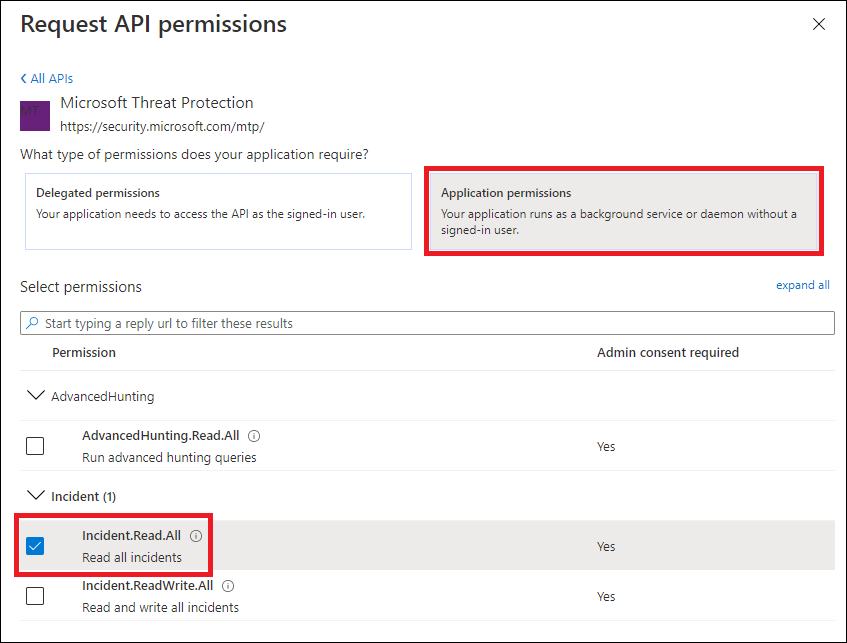

# <a name="hello-world-for-microsoft-threat-protection-rest-api"></a><span data-ttu-id="dcb6a-104">Hello World para la API de REST de protección contra amenazas de Microsoft</span><span class="sxs-lookup"><span data-stu-id="dcb6a-104">Hello World for Microsoft Threat Protection REST API</span></span> 

<span data-ttu-id="dcb6a-105">**Se aplica a:**</span><span class="sxs-lookup"><span data-stu-id="dcb6a-105">**Applies to:**</span></span>
- <span data-ttu-id="dcb6a-106">Protección contra amenazas de Microsoft</span><span class="sxs-lookup"><span data-stu-id="dcb6a-106">Microsoft Threat Protection</span></span>

>[!IMPORTANT] 
><span data-ttu-id="dcb6a-107">Parte de la información se refiere a un producto prelanzamiento que puede modificarse de forma sustancial antes de su lanzamiento comercial.</span><span class="sxs-lookup"><span data-stu-id="dcb6a-107">Some information relates to prereleased product which may be substantially modified before it's commercially released.</span></span> <span data-ttu-id="dcb6a-108">Microsoft makes no warranties, express or implied, with respect to the information provided here.</span><span class="sxs-lookup"><span data-stu-id="dcb6a-108">Microsoft makes no warranties, express or implied, with respect to the information provided here.</span></span>


## <a name="get-incidents-using-a-simple-powershell-script"></a><span data-ttu-id="dcb6a-109">Obtener incidentes con un script de PowerShell simple</span><span class="sxs-lookup"><span data-stu-id="dcb6a-109">Get incidents using a simple PowerShell script</span></span>

### <a name="how-long-it-takes-to-go-through-this-example"></a><span data-ttu-id="dcb6a-110">¿Cuánto tiempo se tarda en completar este ejemplo?</span><span class="sxs-lookup"><span data-stu-id="dcb6a-110">How long it takes to go through this example?</span></span>
<span data-ttu-id="dcb6a-111">Solo se llevan a cabo 5 minutos en dos pasos:</span><span class="sxs-lookup"><span data-stu-id="dcb6a-111">It only takes 5 minutes done in two steps:</span></span>
- <span data-ttu-id="dcb6a-112">Registro de la aplicación</span><span class="sxs-lookup"><span data-stu-id="dcb6a-112">Application registration</span></span>
- <span data-ttu-id="dcb6a-113">Usar ejemplos: solo requiere copiar o pegar un script de PowerShell corto</span><span class="sxs-lookup"><span data-stu-id="dcb6a-113">Use examples: only requires copy/paste of a short PowerShell script</span></span>

### <a name="do-i-need-a-permission-to-connect"></a><span data-ttu-id="dcb6a-114">¿Necesito un permiso para conectarse?</span><span class="sxs-lookup"><span data-stu-id="dcb6a-114">Do I need a permission to connect?</span></span>
<span data-ttu-id="dcb6a-115">Para la etapa de registro de aplicaciones, debe tener un rol de **administrador global** en el espacio empresarial de Azure Active Directory (Azure ad).</span><span class="sxs-lookup"><span data-stu-id="dcb6a-115">For the Application registration stage, you must have a **Global administrator** role in your Azure Active Directory (Azure AD) tenant.</span></span>

### <a name="step-1---create-an-app-in-azure-active-directory"></a><span data-ttu-id="dcb6a-116">Paso 1: crear una aplicación en Azure Active Directory</span><span class="sxs-lookup"><span data-stu-id="dcb6a-116">Step 1 - Create an App in Azure Active Directory</span></span>

1. <span data-ttu-id="dcb6a-117">Inicie sesión en [Azure](https://portal.azure.com) con su usuario de **administrador global** .</span><span class="sxs-lookup"><span data-stu-id="dcb6a-117">Log on to [Azure](https://portal.azure.com) with your **Global administrator** user.</span></span>

2. <span data-ttu-id="dcb6a-118">Navegue a registros de aplicaciones de **Azure Active Directory**  >  **App registrations**  >  **nuevo registro**.</span><span class="sxs-lookup"><span data-stu-id="dcb6a-118">Navigate to **Azure Active Directory** > **App registrations** > **New registration**.</span></span> 

   

3. <span data-ttu-id="dcb6a-120">En el formulario de registro, elija un nombre para la aplicación y, a continuación, seleccione **registrar**.</span><span class="sxs-lookup"><span data-stu-id="dcb6a-120">In the registration form, choose a name for your application and then select **Register**.</span></span>

4. <span data-ttu-id="dcb6a-121">Permita que su aplicación tenga acceso a ATP de Microsoft defender y asígnele el permiso **leer todas las incidencias** :</span><span class="sxs-lookup"><span data-stu-id="dcb6a-121">Allow your Application to access Microsoft Defender ATP and assign it **Read all incidents** permission:</span></span>

   - <span data-ttu-id="dcb6a-122">En la página de la aplicación, seleccione **permisos de API**  >  **Agregar**API de permisos  >  **mi organización usa** > escriba **Microsoft Threat Protection** y seleccione en **protección contra amenazas de Microsoft**.</span><span class="sxs-lookup"><span data-stu-id="dcb6a-122">On your application page, select **API Permissions** > **Add permission** > **APIs my organization uses** > type **Microsoft Threat Protection** and select on **Microsoft Threat Protection**.</span></span>

   >[!NOTE]
   ><span data-ttu-id="dcb6a-123">La protección contra amenazas de Microsoft no aparece en la lista original.</span><span class="sxs-lookup"><span data-stu-id="dcb6a-123">Microsoft Threat Protection does not appear in the original list.</span></span> <span data-ttu-id="dcb6a-124">Debe empezar a escribir su nombre en el cuadro de texto para ver aparezca.</span><span class="sxs-lookup"><span data-stu-id="dcb6a-124">You need to start writing its name in the text box to see it appear.</span></span>

   

   - <span data-ttu-id="dcb6a-126">Elija **permisos de aplicación**  >  **Incident. Read. All** > seleccione en **Agregar permisos**</span><span class="sxs-lookup"><span data-stu-id="dcb6a-126">Choose **Application permissions** > **Incident.Read.All** > Select on **Add permissions**</span></span>

   

   >[!IMPORTANT]
   ><span data-ttu-id="dcb6a-128">Debe seleccionar los permisos correspondientes.</span><span class="sxs-lookup"><span data-stu-id="dcb6a-128">You need to select the relevant permissions.</span></span> 

     <span data-ttu-id="dcb6a-129">Por ejemplo,</span><span class="sxs-lookup"><span data-stu-id="dcb6a-129">For instance,</span></span>

     - <span data-ttu-id="dcb6a-130">Para determinar qué permiso necesita, consulte la sección **permisos** en la API que le interesa llamar.</span><span class="sxs-lookup"><span data-stu-id="dcb6a-130">To determine which permission you need, please look at the **Permissions** section in the API you are interested to call.</span></span>

5. <span data-ttu-id="dcb6a-131">Seleccione **conceder consentimiento de administrador**</span><span class="sxs-lookup"><span data-stu-id="dcb6a-131">Select **Grant admin consent**</span></span>

    - >[!NOTE]
      > <span data-ttu-id="dcb6a-132">Cada vez que agregue permisos, deberá seleccionar activar **concesión de consentimiento** para que el nuevo permiso surta efecto.</span><span class="sxs-lookup"><span data-stu-id="dcb6a-132">Every time you add permission you must select on **Grant consent** for the new permission to take effect.</span></span>

    

6. <span data-ttu-id="dcb6a-134">Agregue un secreto a la aplicación.</span><span class="sxs-lookup"><span data-stu-id="dcb6a-134">Add a secret to the application.</span></span>

    - <span data-ttu-id="dcb6a-135">Seleccione **certificados & secretos**, agregue Descripción al secreto y seleccione **Agregar**.</span><span class="sxs-lookup"><span data-stu-id="dcb6a-135">Select **Certificates & secrets**, add description to the secret and select **Add**.</span></span>

    >[!IMPORTANT]
    > <span data-ttu-id="dcb6a-136">Después de seleccionar **Agregar**, **copie el valor de secreto generado**.</span><span class="sxs-lookup"><span data-stu-id="dcb6a-136">After selecting **Add**, **copy the generated secret value**.</span></span> <span data-ttu-id="dcb6a-137">No podrá recuperar después de salir.</span><span class="sxs-lookup"><span data-stu-id="dcb6a-137">You won't be able to retrieve after you leave!</span></span>

    

7. <span data-ttu-id="dcb6a-139">Anote el identificador de la aplicación y el identificador de su espacio empresarial:</span><span class="sxs-lookup"><span data-stu-id="dcb6a-139">Write down your application ID and your tenant ID:</span></span>

   - <span data-ttu-id="dcb6a-140">En la página de la aplicación, vaya a **información general** y copie lo siguiente:</span><span class="sxs-lookup"><span data-stu-id="dcb6a-140">On your application page, go to **Overview** and copy the following:</span></span>

   


<span data-ttu-id="dcb6a-142">Realiza!</span><span class="sxs-lookup"><span data-stu-id="dcb6a-142">Done!</span></span> <span data-ttu-id="dcb6a-143">Ha registrado correctamente una aplicación.</span><span class="sxs-lookup"><span data-stu-id="dcb6a-143">You have successfully registered an application.</span></span>

### <a name="step-2---get-a-token-using-the-app-and-use-this-token-to-access-the-api"></a><span data-ttu-id="dcb6a-144">Paso 2: obtenga un token con la aplicación y use este token para obtener acceso a la API.</span><span class="sxs-lookup"><span data-stu-id="dcb6a-144">Step 2 - Get a token using the App and use this token to access the API.</span></span>

-   <span data-ttu-id="dcb6a-145">Copie el script siguiente en PowerShell ISE o en un editor de texto y guárdelo como "**Get-Token.ps1**"</span><span class="sxs-lookup"><span data-stu-id="dcb6a-145">Copy the script below to PowerShell ISE or to a text editor, and save it as "**Get-Token.ps1**"</span></span>
-   <span data-ttu-id="dcb6a-146">Al ejecutar este script, se generará un token y se guardará en la carpeta de trabajo con el nombre "**Latest-token.txt**".</span><span class="sxs-lookup"><span data-stu-id="dcb6a-146">Running this script will generate a token and will save it in the working folder under the name "**Latest-token.txt**".</span></span>

```
# That code gets the App Context Token and save it to a file named "Latest-token.txt" under the current directory
# Paste below your Tenant ID, App ID and App Secret (App key).

$tenantId = '' ### Paste your tenant ID here
$appId = '' ### Paste your Application ID here
$appSecret = '' ### Paste your Application secret here

$resourceAppIdUri = 'https://api.security.microsoft.com'
$oAuthUri = "https://login.windows.net/$TenantId/oauth2/token"
$authBody = [Ordered] @{
    resource = "$resourceAppIdUri"
    client_id = "$appId"
    client_secret = "$appSecret"
    grant_type = 'client_credentials'
}
$authResponse = Invoke-RestMethod -Method Post -Uri $oAuthUri -Body $authBody -ErrorAction Stop
$token = $authResponse.access_token
Out-File -FilePath "./Latest-token.txt" -InputObject $token
return $token
```

-   <span data-ttu-id="dcb6a-147">Comprobación de la validez:</span><span class="sxs-lookup"><span data-stu-id="dcb6a-147">Sanity Check:</span></span><br>
<span data-ttu-id="dcb6a-148">Ejecute el script.</span><span class="sxs-lookup"><span data-stu-id="dcb6a-148">Run the script.</span></span><br>
<span data-ttu-id="dcb6a-149">En el explorador, vaya a: https://jwt.ms/</span><span class="sxs-lookup"><span data-stu-id="dcb6a-149">In your browser go to: https://jwt.ms/</span></span> <br>
<span data-ttu-id="dcb6a-150">Copie el token (el contenido del archivo de Latest-token.txt).</span><span class="sxs-lookup"><span data-stu-id="dcb6a-150">Copy the token (the content of the Latest-token.txt file).</span></span><br>
<span data-ttu-id="dcb6a-151">Pegar en el cuadro superior.</span><span class="sxs-lookup"><span data-stu-id="dcb6a-151">Paste in the top box.</span></span><br>
<span data-ttu-id="dcb6a-152">Busque la sección "roles".</span><span class="sxs-lookup"><span data-stu-id="dcb6a-152">Look for the "roles" section.</span></span> <span data-ttu-id="dcb6a-153">Buscar el ```Incidents.Read.All``` rol.</span><span class="sxs-lookup"><span data-stu-id="dcb6a-153">Find the ```Incidents.Read.All``` role.</span></span><br>
<span data-ttu-id="dcb6a-154">El ejemplo siguiente es de una aplicación que tiene ```Incidents.Read.All``` ```Incidents.ReadWrite.All``` permisos y ```AdvancedHunting.Read.All``` .</span><span class="sxs-lookup"><span data-stu-id="dcb6a-154">The below example is from an app that has ```Incidents.Read.All```, ```Incidents.ReadWrite.All``` and ```AdvancedHunting.Read.All``` permissions.</span></span>


### <a name="lets-get-the-incidents"></a><span data-ttu-id="dcb6a-156">¡ Permite obtener los incidentes!</span><span class="sxs-lookup"><span data-stu-id="dcb6a-156">Lets get the Incidents!</span></span>

-   <span data-ttu-id="dcb6a-157">El siguiente script usará **Get-Token.ps1** para acceder a la API y se actualizarán los incidentes por última vez en pasadas 48 horas.</span><span class="sxs-lookup"><span data-stu-id="dcb6a-157">The script below will use **Get-Token.ps1** to access the API and will get the incidents last updated in past 48 hours.</span></span>
-   <span data-ttu-id="dcb6a-158">Guarde este script en la misma carpeta en la que guardó el script anterior **Get-Token.ps1**.</span><span class="sxs-lookup"><span data-stu-id="dcb6a-158">Save this script in the same folder you saved the previous script **Get-Token.ps1**.</span></span> 
-   <span data-ttu-id="dcb6a-159">La secuencia de comandos es un archivo JSON con los datos en la misma carpeta que los scripts.</span><span class="sxs-lookup"><span data-stu-id="dcb6a-159">The script a json file with the data in the same folder as the scripts.</span></span>

```
# Returns Incidents last updated in the past 48 hours.

$token = ./Get-Token.ps1       #run the script Get-Token.ps1  - make sure you are running this script from the same folder of Get-Token.ps1

# Get Incidents from the last 48 hours. Make sure you have incidents in that time frame.
$dateTime = (Get-Date).ToUniversalTime().AddHours(-48).ToString("o")

# The URL contains the type of query and the time filter we created above
$url = "https://api.security.microsoft.com/api/incidents?$filter=lastUpdateTime+ge+$dateTime"

# Set the WebRequest headers
$headers = @{ 
    'Content-Type' = 'application/json'
    'Accept' = 'application/json'
    'Authorization' = "Bearer $token"
}

# Send the webrequest and get the results. 
$response = Invoke-WebRequest -Method Get -Uri $url -Headers $headers -ErrorAction Stop

# Extract the incidents from the results. 
$incidents =  ($response | ConvertFrom-Json).value | ConvertTo-Json -Depth 99

# Get string with the execution time. We concatenate that string to the output file to avoid overwrite the file
$dateTimeForFileName = Get-Date -Format o | foreach {$_ -replace ":", "."}    

# Save the result as json
$outputJsonPath = "./Latest Incidents $dateTimeForFileName.json"     

Out-File -FilePath $outputJsonPath -InputObject $incidents 
```

<span data-ttu-id="dcb6a-160">Ya ha terminado.</span><span class="sxs-lookup"><span data-stu-id="dcb6a-160">You're all done!</span></span> <span data-ttu-id="dcb6a-161">Acaba de realizar correctamente:</span><span class="sxs-lookup"><span data-stu-id="dcb6a-161">You have just successfully:</span></span>
-   <span data-ttu-id="dcb6a-162">Creado y registrado y aplicación</span><span class="sxs-lookup"><span data-stu-id="dcb6a-162">Created and registered and application</span></span>
-   <span data-ttu-id="dcb6a-163">Permiso concedido para que la aplicación Lea las alertas</span><span class="sxs-lookup"><span data-stu-id="dcb6a-163">Granted permission for that application to read alerts</span></span>
-   <span data-ttu-id="dcb6a-164">Conectado a la API</span><span class="sxs-lookup"><span data-stu-id="dcb6a-164">Connected the API</span></span>
-   <span data-ttu-id="dcb6a-165">Se usó un script de PowerShell para devolver los incidentes creados en las últimas 48 horas</span><span class="sxs-lookup"><span data-stu-id="dcb6a-165">Used a PowerShell script to return incidents created in the past 48 hours</span></span>


## <a name="related-topic"></a><span data-ttu-id="dcb6a-166">Tema relacionado</span><span class="sxs-lookup"><span data-stu-id="dcb6a-166">Related topic</span></span>
- [<span data-ttu-id="dcb6a-167">Acceso a las API de Microsoft Threat Protection</span><span class="sxs-lookup"><span data-stu-id="dcb6a-167">Access the Microsoft Threat Protection APIs</span></span>](api-access.md)
- [<span data-ttu-id="dcb6a-168">Acceso a Microsoft Threat Protection con contexto de aplicación</span><span class="sxs-lookup"><span data-stu-id="dcb6a-168">Access  Microsoft Threat Protection with application context</span></span>](api-create-app-web.md)
- [<span data-ttu-id="dcb6a-169">Acceso a Microsoft Threat Protection con contexto de usuario</span><span class="sxs-lookup"><span data-stu-id="dcb6a-169">Access  Microsoft Threat Protection with user context</span></span>](api-create-app-user-context.md)
