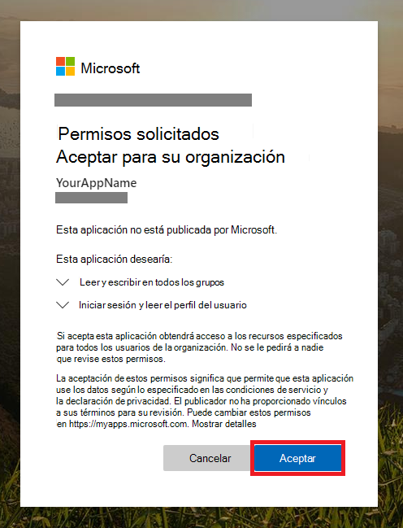

# <a name="partner-access-through-microsoft-365-defender-apis"></a><span data-ttu-id="d02f9-104">Acceso de asociados a través de las API de Microsoft 365 defender</span><span class="sxs-lookup"><span data-stu-id="d02f9-104">Partner access through Microsoft 365 Defender APIs</span></span>

[!INCLUDE [Microsoft 365 Defender rebranding](../includes/microsoft-defender.md)]


<span data-ttu-id="d02f9-105">**Se aplica a:**</span><span class="sxs-lookup"><span data-stu-id="d02f9-105">**Applies to:**</span></span>
- <span data-ttu-id="d02f9-106">Microsoft 365 defender</span><span class="sxs-lookup"><span data-stu-id="d02f9-106">Microsoft 365 Defender</span></span>

>[!IMPORTANT] 
><span data-ttu-id="d02f9-107">Parte de la información se refiere a un producto prelanzamiento que puede modificarse de forma sustancial antes de su lanzamiento comercial.</span><span class="sxs-lookup"><span data-stu-id="d02f9-107">Some information relates to prereleased product which may be substantially modified before it's commercially released.</span></span> <span data-ttu-id="d02f9-108">Microsoft makes no warranties, express or implied, with respect to the information provided here.</span><span class="sxs-lookup"><span data-stu-id="d02f9-108">Microsoft makes no warranties, express or implied, with respect to the information provided here.</span></span>


<span data-ttu-id="d02f9-109">En esta página se describe cómo crear una aplicación de AAD para obtener acceso mediante programación a Microsoft 365 defender en nombre de sus clientes.</span><span class="sxs-lookup"><span data-stu-id="d02f9-109">This page describes how to create an AAD application to get programmatic access to Microsoft 365 Defender on behalf of your customers.</span></span>

<span data-ttu-id="d02f9-110">Microsoft 365 defender expone gran parte de sus datos y acciones a través de un conjunto de API de programación.</span><span class="sxs-lookup"><span data-stu-id="d02f9-110">Microsoft 365 Defender exposes much of its data and actions through a set of programmatic APIs.</span></span> <span data-ttu-id="d02f9-111">Estas API le ayudarán a automatizar los flujos de trabajo y la innovación en función de las capacidades de Microsoft 365 defender.</span><span class="sxs-lookup"><span data-stu-id="d02f9-111">Those APIs will help you automate work flows and innovate based on Microsoft 365 Defender capabilities.</span></span> <span data-ttu-id="d02f9-112">El acceso a la API requiere la autenticación OAuth 2.0.</span><span class="sxs-lookup"><span data-stu-id="d02f9-112">The API access requires OAuth2.0 authentication.</span></span> <span data-ttu-id="d02f9-113">Para obtener más información, vea [flujo de código de autorización de OAuth 2,0](https://docs.microsoft.com/azure/active-directory/develop/active-directory-v2-protocols-oauth-code).</span><span class="sxs-lookup"><span data-stu-id="d02f9-113">For more information, see [OAuth 2.0 Authorization Code Flow](https://docs.microsoft.com/azure/active-directory/develop/active-directory-v2-protocols-oauth-code).</span></span>

<span data-ttu-id="d02f9-114">En general, deberá realizar los siguientes pasos para usar las API:</span><span class="sxs-lookup"><span data-stu-id="d02f9-114">In general, you’ll need to take the following steps to use the APIs:</span></span>
- <span data-ttu-id="d02f9-115">Cree una aplicación **de AAD multiinquilino** .</span><span class="sxs-lookup"><span data-stu-id="d02f9-115">Create a **multi-tenant** AAD application.</span></span>
- <span data-ttu-id="d02f9-116">Obtenga autorización (consentimiento) por parte del administrador del cliente para que su aplicación tenga acceso a los recursos de Microsoft 365 defender que necesita.</span><span class="sxs-lookup"><span data-stu-id="d02f9-116">Get authorized (consent) by your customer administrator for your application to access Microsoft 365 Defender resources it needs.</span></span>
- <span data-ttu-id="d02f9-117">Obtenga un token de acceso con esta aplicación.</span><span class="sxs-lookup"><span data-stu-id="d02f9-117">Get an access token using this application.</span></span>
- <span data-ttu-id="d02f9-118">Use el token para obtener acceso a la API de Microsoft 365 defender.</span><span class="sxs-lookup"><span data-stu-id="d02f9-118">Use the token to access Microsoft 365 Defender API.</span></span>

<span data-ttu-id="d02f9-119">Los siguientes pasos, que le guían cómo crear una aplicación de AAD, obtener un token de acceso a Microsoft 365 defender y validar el token.</span><span class="sxs-lookup"><span data-stu-id="d02f9-119">The following steps with guide you how to create an AAD application, get an access token to Microsoft 365 Defender and validate the token.</span></span>

## <a name="create-the-multi-tenant-app"></a><span data-ttu-id="d02f9-120">Crear la aplicación multiinquilino</span><span class="sxs-lookup"><span data-stu-id="d02f9-120">Create the multi-tenant app</span></span>

1. <span data-ttu-id="d02f9-121">Inicie sesión en su [inquilino de Azure](https://portal.azure.com) con un usuario que tenga un rol de **administrador global** .</span><span class="sxs-lookup"><span data-stu-id="d02f9-121">Log on to your [Azure tenant](https://portal.azure.com) with user that has **Global Administrator** role.</span></span>

2. <span data-ttu-id="d02f9-122">Navegue a registros de aplicaciones de **Azure Active Directory**  >  **App registrations**  >  **nuevo registro**.</span><span class="sxs-lookup"><span data-stu-id="d02f9-122">Navigate to **Azure Active Directory** > **App registrations** > **New registration**.</span></span> 

   

3. <span data-ttu-id="d02f9-124">En el formulario de registro:</span><span class="sxs-lookup"><span data-stu-id="d02f9-124">In the registration form:</span></span>

    - <span data-ttu-id="d02f9-125">Elija un nombre para la aplicación.</span><span class="sxs-lookup"><span data-stu-id="d02f9-125">Choose a name for your application.</span></span>

    - <span data-ttu-id="d02f9-126">Tipos de cuenta admitidos: cuentas en cualquier directorio de la organización.</span><span class="sxs-lookup"><span data-stu-id="d02f9-126">Supported account types - accounts in any organizational directory.</span></span>

    - <span data-ttu-id="d02f9-127">URI de redireccionamiento-tipo: Web, URI: https://portal.azure.com</span><span class="sxs-lookup"><span data-stu-id="d02f9-127">Redirect URI - type: Web, URI: https://portal.azure.com</span></span>

    


4. <span data-ttu-id="d02f9-129">Permita que su aplicación tenga acceso a Microsoft 365 defender y asígnela con el conjunto mínimo de permisos necesarios para completar la integración.</span><span class="sxs-lookup"><span data-stu-id="d02f9-129">Allow your Application to access Microsoft 365 Defender and assign it with the minimal set of permissions required to complete the integration.</span></span>

   - <span data-ttu-id="d02f9-130">En la página de la aplicación, haga clic en **permisos de API**  >  **Agregar API de permisos**  >  **mi organización usa** > escriba **Microsoft 365 defender** y haga clic en **Microsoft 365 defender**.</span><span class="sxs-lookup"><span data-stu-id="d02f9-130">On your application page, click **API Permissions** > **Add permission** > **APIs my organization uses** > type **Microsoft 365 Defender** and click on **Microsoft 365 Defender**.</span></span>

   >[!NOTE]
   ><span data-ttu-id="d02f9-131">Microsoft 365 defender no aparece en la lista original.</span><span class="sxs-lookup"><span data-stu-id="d02f9-131">Microsoft 365 Defender does not appear in the original list.</span></span> <span data-ttu-id="d02f9-132">Debe empezar a escribir su nombre en el cuadro de texto para ver aparezca.</span><span class="sxs-lookup"><span data-stu-id="d02f9-132">You need to start writing its name in the text box to see it appear.</span></span>

   
   
   ### <a name="request-api-permissions"></a><span data-ttu-id="d02f9-134">Solicitar permisos de API</span><span class="sxs-lookup"><span data-stu-id="d02f9-134">Request API permissions</span></span>

   <span data-ttu-id="d02f9-135">Para determinar qué permiso necesita, consulte la sección **permisos** en la API que le interesa llamar.</span><span class="sxs-lookup"><span data-stu-id="d02f9-135">To determine which permission you need, please look at the **Permissions** section in the API you are interested to call.</span></span> 

   <span data-ttu-id="d02f9-136">En el siguiente ejemplo, usaremos el permiso **"leer todos los incidentes"** :</span><span class="sxs-lookup"><span data-stu-id="d02f9-136">In the following example we will use **'Read all incidents'** permission:</span></span>

   <span data-ttu-id="d02f9-137">Seleccione incidentes de permisos de la **aplicación**  >  **. Read. All** > haga clic en **Agregar permisos**</span><span class="sxs-lookup"><span data-stu-id="d02f9-137">Choose **Application permissions** > **Incidents.Read.All** > Click on **Add permissions**</span></span>

   


5. <span data-ttu-id="d02f9-139">Haga clic en **conceder consentimiento**</span><span class="sxs-lookup"><span data-stu-id="d02f9-139">Click **Grant consent**</span></span>

    >[!NOTE]
    ><span data-ttu-id="d02f9-140">Cada vez que agregue permisos, deberá hacer clic en **conceder consentimiento** para que el nuevo permiso surta efecto.</span><span class="sxs-lookup"><span data-stu-id="d02f9-140">Every time you add permission you must click on **Grant consent** for the new permission to take effect.</span></span>

    

6. <span data-ttu-id="d02f9-142">Agregue un secreto a la aplicación.</span><span class="sxs-lookup"><span data-stu-id="d02f9-142">Add a secret to the application.</span></span>

    - <span data-ttu-id="d02f9-143">Haga clic en **certificados & secretos** , agregue Descripción al secreto y haga clic en **Agregar**.</span><span class="sxs-lookup"><span data-stu-id="d02f9-143">Click **Certificates & secrets** , add description to the secret and click **Add**.</span></span>

    >[!IMPORTANT]
    > <span data-ttu-id="d02f9-144">Después de seleccionar **Agregar** , **copie el valor de secreto generado**.</span><span class="sxs-lookup"><span data-stu-id="d02f9-144">After selecting **Add** , **copy the generated secret value**.</span></span> <span data-ttu-id="d02f9-145">No podrá recuperar después de salir.</span><span class="sxs-lookup"><span data-stu-id="d02f9-145">You won't be able to retrieve after you leave!</span></span>

    

7. <span data-ttu-id="d02f9-147">Anote el identificador de la aplicación:</span><span class="sxs-lookup"><span data-stu-id="d02f9-147">Write down your application ID:</span></span>

   - <span data-ttu-id="d02f9-148">En la página de la aplicación, vaya a **información general** y copie lo siguiente:</span><span class="sxs-lookup"><span data-stu-id="d02f9-148">On your application page, go to **Overview** and copy the following:</span></span>

   

8. <span data-ttu-id="d02f9-150">Agregue la aplicación al inquilino del cliente.</span><span class="sxs-lookup"><span data-stu-id="d02f9-150">Add the application to your customer's tenant.</span></span>

    <span data-ttu-id="d02f9-151">Necesita que su aplicación esté aprobada en cada inquilino de cliente donde tenga previsto usarla.</span><span class="sxs-lookup"><span data-stu-id="d02f9-151">You need your application to be approved in each customer tenant where you intend to use it.</span></span> <span data-ttu-id="d02f9-152">Esto se debe a que la aplicación interactúa con la aplicación de Microsoft 365 defender en nombre de su cliente.</span><span class="sxs-lookup"><span data-stu-id="d02f9-152">This is because your application interacts with Microsoft 365 Defender application on behalf of your customer.</span></span>

    <span data-ttu-id="d02f9-153">Un usuario con **administrador global** del inquilino del cliente debe hacer clic en el vínculo de consentimiento y aprobar la aplicación.</span><span class="sxs-lookup"><span data-stu-id="d02f9-153">A user with **Global Administrator** from your customer's tenant need to click the consent link and approve your application.</span></span>

    <span data-ttu-id="d02f9-154">El vínculo de consentimiento tiene el siguiente formato:</span><span class="sxs-lookup"><span data-stu-id="d02f9-154">Consent link is of the form:</span></span>

    ```
    https://login.microsoftonline.com/common/oauth2/authorize?prompt=consent&client_id=00000000-0000-0000-0000-000000000000&response_type=code&sso_reload=true
    ```

    <span data-ttu-id="d02f9-155">Donde 00000000-0000-0000-0000-000000000000 debe reemplazarse con el identificador de la aplicación</span><span class="sxs-lookup"><span data-stu-id="d02f9-155">Where 00000000-0000-0000-0000-000000000000 should be replaced with your Application ID</span></span>

    <span data-ttu-id="d02f9-156">Después de hacer clic en el vínculo de consentimiento, inicie sesión con el administrador global del espacio empresarial del cliente y consienta la aplicación.</span><span class="sxs-lookup"><span data-stu-id="d02f9-156">After clicking on the consent link, login with the Global Administrator of the customer's tenant and consent the application.</span></span>

    

    <span data-ttu-id="d02f9-158">Además, tendrá que pedir al cliente su identificador de inquilino y guardarlo para usarlo en el futuro al adquirir el token.</span><span class="sxs-lookup"><span data-stu-id="d02f9-158">In addition, you will need to ask your customer for their tenant ID and save it for future use when acquiring the token.</span></span>

- <span data-ttu-id="d02f9-159">**Realiza!**</span><span class="sxs-lookup"><span data-stu-id="d02f9-159">**Done!**</span></span> <span data-ttu-id="d02f9-160">Se ha registrado correctamente una aplicación.</span><span class="sxs-lookup"><span data-stu-id="d02f9-160">You have successfully registered an application!</span></span> 
- <span data-ttu-id="d02f9-161">Vea los siguientes ejemplos para la adquisición y validación de tokens.</span><span class="sxs-lookup"><span data-stu-id="d02f9-161">See examples below for token acquisition and validation.</span></span>

## <a name="get-an-access-token-examples"></a><span data-ttu-id="d02f9-162">Obtener ejemplos de tokens de acceso:</span><span class="sxs-lookup"><span data-stu-id="d02f9-162">Get an access token examples:</span></span>

>[!NOTE]
> <span data-ttu-id="d02f9-163">Para obtener el token de acceso en nombre de su cliente, use el identificador de inquilino del cliente en las siguientes adquisiciones de token.</span><span class="sxs-lookup"><span data-stu-id="d02f9-163">To get access token on behalf of your customer, use the customer's tenant ID on the following token acquisitions.</span></span>

<br><span data-ttu-id="d02f9-164">Para obtener más información sobre el token de AAD, consulte el [tutorial de AAD](https://docs.microsoft.com/azure/active-directory/develop/active-directory-v2-protocols-oauth-client-creds) .</span><span class="sxs-lookup"><span data-stu-id="d02f9-164">For more details on AAD token, refer to [AAD tutorial](https://docs.microsoft.com/azure/active-directory/develop/active-directory-v2-protocols-oauth-client-creds)</span></span>

### <a name="using-powershell"></a><span data-ttu-id="d02f9-165">Mediante PowerShell</span><span class="sxs-lookup"><span data-stu-id="d02f9-165">Using PowerShell</span></span>

```
# That code gets the App Context Token and save it to a file named "Latest-token.txt" under the current directory
# Paste below your Tenant ID, App ID and App Secret (App key).

$tenantId = '' ### Paste your tenant ID here
$appId = '' ### Paste your Application ID here
$appSecret = '' ### Paste your Application key here

$resourceAppIdUri = 'https://api.security.microsoft.com'
$oAuthUri = "https://login.windows.net/$TenantId/oauth2/token"
$authBody = [Ordered] @{
    resource = "$resourceAppIdUri"
    client_id = "$appId"
    client_secret = "$appSecret"
    grant_type = 'client_credentials'
}
$authResponse = Invoke-RestMethod -Method Post -Uri $oAuthUri -Body $authBody -ErrorAction Stop
$token = $authResponse.access_token
Out-File -FilePath "./Latest-token.txt" -InputObject $token
return $token
```

### <a name="using-c"></a><span data-ttu-id="d02f9-166">Mediante C#:</span><span class="sxs-lookup"><span data-stu-id="d02f9-166">Using C#:</span></span>

><span data-ttu-id="d02f9-167">El siguiente código se probó con Nuget Microsoft. IdentityModel. clients. ActiveDirectory</span><span class="sxs-lookup"><span data-stu-id="d02f9-167">The below code was tested with Nuget Microsoft.IdentityModel.Clients.ActiveDirectory</span></span>

- <span data-ttu-id="d02f9-168">Crear una nueva aplicación de consola</span><span class="sxs-lookup"><span data-stu-id="d02f9-168">Create a new Console Application</span></span>
- <span data-ttu-id="d02f9-169">Instalar Nuget [Microsoft. IdentityModel. clients. ActiveDirectory](https://www.nuget.org/packages/Microsoft.IdentityModel.Clients.ActiveDirectory/)</span><span class="sxs-lookup"><span data-stu-id="d02f9-169">Install Nuget [Microsoft.IdentityModel.Clients.ActiveDirectory](https://www.nuget.org/packages/Microsoft.IdentityModel.Clients.ActiveDirectory/)</span></span>
- <span data-ttu-id="d02f9-170">Agregue lo siguiente con</span><span class="sxs-lookup"><span data-stu-id="d02f9-170">Add the below using</span></span>

    ```
    using Microsoft.IdentityModel.Clients.ActiveDirectory;
    ```

- <span data-ttu-id="d02f9-171">Copie/pegue el código siguiente en la aplicación (no olvide actualizar las 3 variables: ```tenantId, appId, appSecret``` )</span><span class="sxs-lookup"><span data-stu-id="d02f9-171">Copy/Paste the below code in your application (do not forget to update the 3 variables: ```tenantId, appId, appSecret```)</span></span>

    ```
    string tenantId = "00000000-0000-0000-0000-000000000000"; // Paste your own tenant ID here
    string appId = "11111111-1111-1111-1111-111111111111"; // Paste your own app ID here
    string appSecret = "22222222-2222-2222-2222-222222222222"; // Paste your own app secret here for a test, and then store it in a safe place! 

    const string authority = "https://login.windows.net";
    const string mtpResourceId = "https://api.security.microsoft.com";

    AuthenticationContext auth = new AuthenticationContext($"{authority}/{tenantId}/");
    ClientCredential clientCredential = new ClientCredential(appId, appSecret);
    AuthenticationResult authenticationResult = auth.AcquireTokenAsync(mtpResourceId, clientCredential).GetAwaiter().GetResult();
    string token = authenticationResult.AccessToken;
    ```


### <a name="using-curl"></a><span data-ttu-id="d02f9-172">Uso de rizo</span><span class="sxs-lookup"><span data-stu-id="d02f9-172">Using Curl</span></span>

> [!NOTE]
> <span data-ttu-id="d02f9-173">El siguiente procedimiento supone que el doblez para Windows ya está instalado en el equipo</span><span class="sxs-lookup"><span data-stu-id="d02f9-173">The below procedure supposed Curl for Windows is already installed on your computer</span></span>

- <span data-ttu-id="d02f9-174">Abrir una ventana de comandos</span><span class="sxs-lookup"><span data-stu-id="d02f9-174">Open a command window</span></span>
- <span data-ttu-id="d02f9-175">Establecer CLIENT_ID en el identificador de la aplicación de Azure</span><span class="sxs-lookup"><span data-stu-id="d02f9-175">Set CLIENT_ID to your Azure application ID</span></span>
- <span data-ttu-id="d02f9-176">Establecer CLIENT_SECRET en el secreto de la aplicación de Azure</span><span class="sxs-lookup"><span data-stu-id="d02f9-176">Set CLIENT_SECRET to your Azure application secret</span></span>
- <span data-ttu-id="d02f9-177">Establecer TENANT_ID en el identificador de inquilino de Azure del cliente que desea usar la aplicación para acceder a la aplicación Microsoft 365 defender</span><span class="sxs-lookup"><span data-stu-id="d02f9-177">Set TENANT_ID to the Azure tenant ID of the customer that wants to use your application to access Microsoft 365 Defender application</span></span>
- <span data-ttu-id="d02f9-178">Ejecute el siguiente comando:</span><span class="sxs-lookup"><span data-stu-id="d02f9-178">Run the below command:</span></span>

```
curl -i -X POST -H "Content-Type:application/x-www-form-urlencoded" -d "grant_type=client_credentials" -d "client_id=%CLIENT_ID%" -d "scope=https://api.security.microsoft.com.default" -d "client_secret=%CLIENT_SECRET%" "https://login.microsoftonline.com/%TENANT_ID%/oauth2/v2.0/token" -k
```

<span data-ttu-id="d02f9-179">Obtendrá una respuesta del formulario:</span><span class="sxs-lookup"><span data-stu-id="d02f9-179">You will get an answer of the form:</span></span>

```
{"token_type":"Bearer","expires_in":3599,"ext_expires_in":0,"access_token":"eyJ0eXAiOiJKV1QiLCJhbGciOiJSUzI1NiIsIn <truncated> aWReH7P0s0tjTBX8wGWqJUdDA"}
```

## <a name="validate-the-token"></a><span data-ttu-id="d02f9-180">Validar el token</span><span class="sxs-lookup"><span data-stu-id="d02f9-180">Validate the token</span></span>

<span data-ttu-id="d02f9-181">Comprobación de la validez para asegurarse de que obtuvo un token correcto:</span><span class="sxs-lookup"><span data-stu-id="d02f9-181">Sanity check to make sure you got a correct token:</span></span>

- <span data-ttu-id="d02f9-182">Copiar/pegar en [JWT](https://jwt.ms) el token que se obtiene en el paso anterior para poder descodificarlo</span><span class="sxs-lookup"><span data-stu-id="d02f9-182">Copy/paste into [JWT](https://jwt.ms) the token you get in the previous step in order to decode it</span></span>
- <span data-ttu-id="d02f9-183">Validar que obtiene una notificación de ' roles ' con los permisos deseados</span><span class="sxs-lookup"><span data-stu-id="d02f9-183">Validate you get a 'roles' claim with the desired permissions</span></span>
- <span data-ttu-id="d02f9-184">En la captura de pantalla siguiente, puede ver un token descodificado adquirido de una aplicación con varios permisos para Microsoft 365 defender:</span><span class="sxs-lookup"><span data-stu-id="d02f9-184">In the screenshot below, you can see a decoded token acquired from an Application with multiple permissions to Microsoft 365 Defender:</span></span>
- <span data-ttu-id="d02f9-185">La notificación "TID" es el identificador de inquilino al que pertenece el token.</span><span class="sxs-lookup"><span data-stu-id="d02f9-185">The "tid" claim is the tenant ID the token belongs to.</span></span>


## <a name="use-the-token-to-access-microsoft-365-defender-api"></a><span data-ttu-id="d02f9-187">Usar el token para obtener acceso a la API de Microsoft 365 defender</span><span class="sxs-lookup"><span data-stu-id="d02f9-187">Use the token to access Microsoft 365 Defender API</span></span>

- <span data-ttu-id="d02f9-188">Elija la API que desea usar para obtener más información, vea compatibilidad de las [API de Microsoft 365 defender](api-supported.md)</span><span class="sxs-lookup"><span data-stu-id="d02f9-188">Choose the API you want to use, for more information, see [Supported Microsoft 365 Defender APIs](api-supported.md)</span></span>
- <span data-ttu-id="d02f9-189">Establecer el encabezado Authorization en la solicitud HTTP que envía a "Bearer {token}" (Bearer es el esquema de autorización)</span><span class="sxs-lookup"><span data-stu-id="d02f9-189">Set the Authorization header in the Http request you send to "Bearer {token}" (Bearer is the Authorization scheme)</span></span>
- <span data-ttu-id="d02f9-190">La fecha de expiración del token es 1 hora (puede enviar más de una solicitud con el mismo token)</span><span class="sxs-lookup"><span data-stu-id="d02f9-190">The Expiration time of the token is 1 hour (you can send more then one request with the same token)</span></span>

- <span data-ttu-id="d02f9-191">Ejemplo de envío de una solicitud para obtener una lista de incidentes **con C#**</span><span class="sxs-lookup"><span data-stu-id="d02f9-191">Example of sending a request to get a list of incidents **using C#**</span></span> 
    ```
    var httpClient = new HttpClient();

    var request = new HttpRequestMessage(HttpMethod.Get, "https://api.security.microsoft.com/api/incidents");

    request.Headers.Authorization = new AuthenticationHeaderValue("Bearer", token);

    var response = httpClient.SendAsync(request).GetAwaiter().GetResult();

    // Do something useful with the response
    ```

## <a name="related-topics"></a><span data-ttu-id="d02f9-192">Temas relacionados</span><span class="sxs-lookup"><span data-stu-id="d02f9-192">Related topics</span></span> 

- [<span data-ttu-id="d02f9-193">Acceso a las API de Microsoft 365 defender</span><span class="sxs-lookup"><span data-stu-id="d02f9-193">Access the Microsoft 365 Defender APIs</span></span>](api-access.md)
- [<span data-ttu-id="d02f9-194">Acceso a Microsoft 365 defender con contexto de aplicación</span><span class="sxs-lookup"><span data-stu-id="d02f9-194">Access  Microsoft 365 Defender with application context</span></span>](api-create-app-web.md)
- [<span data-ttu-id="d02f9-195">Acceso a Microsoft 365 defender con contexto de usuario</span><span class="sxs-lookup"><span data-stu-id="d02f9-195">Access  Microsoft 365 Defender with user context</span></span>](api-create-app-user-context.md)
