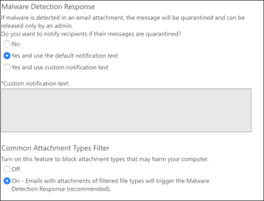
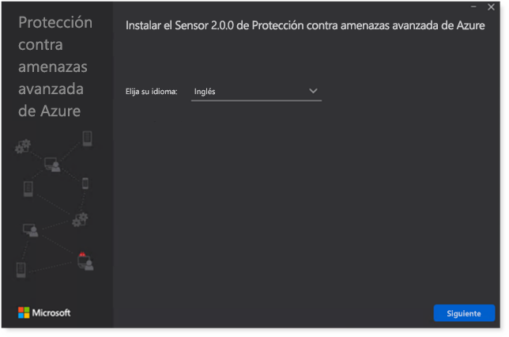

# Configuración de los pilares de 365 defender de Microsoft para el entorno de prueba o el entorno piloto

[!INCLUDE [Microsoft 365 Defender rebranding](../includes/microsoft-defender.md)]

**Se aplica a:**
- Microsoft 365 Defender

La creación de un entorno de prueba de Microsoft 365 defender o un entorno piloto y su implementación es un proceso de tres fases:

| [Fase 1: preparación](prepare-mtpeval.md) | [Fase 2: configurar](setup-mtpeval.md) | Fase 3: incorporada |  [Volver a la guía piloto](mtp-pilot.md) |
|--|--|--|--|
|| |*Ya está aquí.* | |

Actualmente se encuentra en la fase de configuración.

La preparación es fundamental para todas las implementaciones correctas. En este artículo, se le guiará en los puntos que debe tener en cuenta a la hora de preparar la implementación de Microsoft defender para el punto de conexión.

## Pilares de 365 defender de Microsoft
Microsoft 365 defender consta de cuatro pilares. Aunque un pilar ya puede proporcionar valor a la seguridad de su organización de red, la habilitación de los cuatro pilares de Microsoft 365 defender dará mayor valor a su organización.

Esta sección le guiará para configurar:
-   Microsoft Defender para Office 365
-   Microsoft Defender for Identity 
-   Microsoft Cloud App Security
-   Microsoft Defender para punto de conexión

## Configurar Microsoft defender para Office 365

>[!NOTE]
>Omita este paso si ya ha habilitado defender para Office 365. 

Hay un módulo de PowerShell denominado analizador de configuración de la *protección contra amenazas avanzada de Office 365 (Orca)* que ayuda a determinar algunas de estas opciones. Cuando se ejecuta como administrador en su espacio empresarial, Get-ORCAReport le ayudará a generar una evaluación de la configuración de protección contra correo electrónico no deseado, anti-phish y otros mensajes. Puede descargar este módulo desde https://www.powershellgallery.com/packages/ORCA/ . 

1. Vaya a la Directiva de administración de amenazas [& cumplimiento del centro de cumplimiento de Office 365](https://protection.office.com/homepage)  >  **Threat management**  >  **Policy**.

   
 
2. Haga clic en **anti-phishing**, seleccione **crear** y rellene el nombre y la descripción de la Directiva. Haga clic en **Siguiente**.

   

   > [!NOTE]
   > Edite su Directiva antiphishing avanzada en Microsoft defender para Office 365. Cambiar el **umbral de suplantación de identidad avanzado** a **2-agresivo**.

3. Haga clic en el menú desplegable **Agregar condición** y seleccione su dominio o dominios como dominio del destinatario. Haga clic en **Siguiente**.

   
 
4. Revise la configuración. Haga clic en **crear esta directiva** para confirmar. 

   
 
5. Seleccione **datos adjuntos seguros** y seleccione la opción **Activar ATP para SharePoint, OneDrive y Microsoft Teams** .

   

6. Haga clic en el icono + para crear una nueva Directiva de datos adjuntos seguros, aplíquela como dominio del destinatario en sus dominios. Haga clic en **Guardar**.

   
 
7. A continuación, seleccione la directiva **vínculos seguros** y, a continuación, haga clic en el icono de lápiz para editar la directiva predeterminada.

8. Asegúrese de que la opción no **realizar seguimiento cuando los usuarios hagan clic en vínculos seguros** no esté seleccionada, mientras que el resto de las opciones están seleccionadas. Vea [configuración de vínculos seguros](https://docs.microsoft.com/microsoft-365/security/office-365-security/recommended-settings-for-eop-and-office365-atp) para obtener más información. Haga clic en **Guardar**. 

   

9. A continuación, seleccione la directiva **antimalware** , seleccione la opción predeterminada y elija el icono de lápiz.

10. Haga clic en **configuración** y seleccione **sí y use el texto de notificación predeterminado** para habilitar la **respuesta de detección de malware**. Active el **filtro tipos de datos adjuntos comunes** en. Haga clic en **Guardar**.

    
  
11. Vaya a [Office 365 Security & cumplimiento del centro](https://protection.office.com/homepage)  >  **Search**  >  de **Auditoría** búsqueda y active la auditoría.

    

12. Integración de Microsoft defender para Office 365 con Microsoft defender para el punto de conexión. Vaya a [Office 365 Security & cumplimiento](https://protection.office.com/homepage)  >  del centro de **Administración de amenazas**  >  **Explorer** y seleccione **Microsoft defender for Endpoint Settings** en la esquina superior derecha de la pantalla. En el cuadro de diálogo defender para conexión de extremo, Active **conectar con Microsoft defender para el extremo**.

    

## Configurar Microsoft defender para identidad

>[!NOTE]
>Omita este paso si ya ha habilitado Microsoft defender para identidad

1. Vaya a [Microsoft 365 Security Center](https://security.microsoft.com/info) > seleccione **más recursos**  >  **Microsoft defender para identidad**.

   

2. Haga clic en **crear** para iniciar el Asistente de Microsoft defender para identidad. 

   

3. Elija **proporcionar un nombre de usuario y una contraseña para conectar con el bosque de Active** Directory.  

   

4. Escriba sus credenciales locales de Active Directory. Puede ser cualquier cuenta de usuario que tenga acceso de lectura a Active Directory.

   

5. A continuación, seleccione **descargar la configuración del sensor** y transferir el archivo a su controlador de dominio.

   

6. Ejecute Microsoft defender para la configuración del sensor de identidad y comience a seguir el asistente.

   
 
7. Haga clic en **siguiente** en el tipo de implementación de sensor.

   
 
8. Copie la clave de acceso porque tiene que escribirla a continuación en el asistente.

   
 
9. Copie la clave de acceso en el asistente y haga clic en **instalar**. 

   

10. Enhorabuena, ha configurado correctamente Microsoft defender para identidad en el controlador de dominio.

    
 
11. En la sección [Microsoft defender for Identity](https://go.microsoft.com/fwlink/?linkid=2040449) Settings, seleccione * * Microsoft defender for Endpoint * * y, a continuación, active la opción de alternancia. Haga clic en **Guardar**. 

    

>[!NOTE]
>Windows Defender ATP ha cambiado de marca como Microsoft defender para el punto de conexión. Los cambios de personalización de marca en todos nuestros portales se están implementando para lograr coherencia.

## Configurar Microsoft Cloud App Security

>[!NOTE]
>Omita este paso si ya ha habilitado Microsoft Cloud App Security. 

1. Vaya a [Microsoft 365 Security Center](https://security.microsoft.com/info)  >  **más recursos**  >  **Microsoft Cloud App Security**.

   

2. En la información solicitada para integrar Microsoft defender para identidad, seleccione **Habilitar Microsoft defender para la integración de datos de identidad**.
  
   

   > [!NOTE]
   > Si no ve este mensaje, puede significar que ya se ha habilitado Microsoft defender para la integración de datos de identidad. Sin embargo, si no está seguro, póngase en contacto con su administrador de TI para confirmarlo. 

3. Vaya a **configuración**, active el botón de alternancia **de Microsoft defender para integración de identidades** y, a continuación, haga clic en **Guardar**. 

   
   
   > [!NOTE]
   > En el caso de los nuevos Microsoft defender para instancias de identidad, este cambio de integración se activa automáticamente. Confirme que se haya habilitado Microsoft defender para la integración de identidad antes de continuar con el paso siguiente.
 
4. En configuración de detección en la nube, seleccione **Microsoft defender for Endpoint Integration** y, a continuación, habilite la integración. Haga clic en **Guardar**.

   

5. En configuración de detección en la nube, seleccione **enriquecimiento de usuario** y, a continuación, habilite la integración con Azure Active Directory.

   

## Configurar Microsoft defender para el punto de conexión

>[!NOTE]
>Omita este paso si ya ha habilitado Microsoft defender para el punto de conexión.

1. Vaya a [Microsoft 365 Security Center](https://security.microsoft.com/info)  >  **más recursos**  >  **centro de seguridad de Microsoft defender**. Haga clic en **Open** (Abrir).

   
 
2. Siga el Asistente de Microsoft defender para extremo. Haga clic en **Siguiente**. 

   

3. Elija en función de la ubicación de almacenamiento de datos preferida, la Directiva de retención de datos, el tamaño de la organización y las características de vista previa.

   
   
   > [!NOTE]
   > No puede cambiar algunos de los valores, como la ubicación de almacenamiento de datos, más adelante. 

   Haga clic en **Siguiente**. 

4. Haga clic en **continuar** y se aprovisionará su Microsoft defender para inquilino de punto de conexión.

   

5. Incorpore los puntos de conexión a través de directivas de grupo, Microsoft Endpoint Manager o mediante la ejecución de un script local a Microsoft defender para el punto de conexión. Para simplificar, esta guía usa el script local.

6. Haga clic en **Descargar paquete** y copie el script de incorporación en los extremos.

   

7. En el punto de conexión, ejecute el script de incorporación como administrador y elija Y. 

   

8. Enhorabuena, ha incorporado el primer punto de conexión.

   

9. Copie y pegue la prueba de detección desde el Asistente de Microsoft defender para extremo.

   

10. Copie el script de PowerShell en un símbolo del sistema con privilegios elevados y ejecútelo. 

    

11. Seleccione **empezar a usar Microsoft defender para el extremo** desde el asistente.

    
 
12. Visite el [centro de seguridad de Microsoft defender](https://securitycenter.windows.com/). Vaya a **configuración** y, a continuación, seleccione **características avanzadas**. 

    

13. Active la integración con **Microsoft defender para identidad**.  

    

14. Active la integración con la **inteligencia sobre amenazas de Office 365**.

    

15. Active la integración con **Microsoft Cloud App Security**.

    

16. Desplácese hacia abajo y haga clic en **Guardar preferencias** para confirmar las nuevas integraciones.

    

## Iniciar el servicio de Microsoft 365 Defender

>[!NOTE]
>A partir del 1 de junio de 2020, Microsoft habilita automáticamente las características de Microsoft 365 defender para todos los inquilinos elegibles. Consulte este [artículo de la comunidad tecnológica de Microsoft sobre la elegibilidad de licencias](https://techcommunity.microsoft.com/t5/security-privacy-and-compliance/microsoft-threat-protection-will-automatically-turn-on-for/ba-p/1345426) para obtener más información. 

Vaya al [centro de seguridad 365 de Microsoft](https://security.microsoft.com/homepage). Vaya a **configuración** y, a continuación, seleccione **Microsoft 365 defender**.

  

Para obtener una guía más completa, consulte [Activar Microsoft 365 defender](mtp-enable.md). 

¡Enhorabuena! Acaba de crear su entorno de prueba de Microsoft 365 defender o un entorno piloto. Ahora puede familiarizarse con la interfaz de usuario de Microsoft 365 defender. Vea lo que puede aprender de la siguiente guía interactiva de Microsoft 365 defender y sepa cómo usar cada panel para las tareas de la operación de seguridad diaria.

>[!VIDEO https://aka.ms/MTP-Interactive-Guide]

A continuación, puede simular un ataque y ver cómo las capacidades cruzadas del producto detectan, crean alertas y responden automáticamente a un ataque de archivos no deseados en un extremo.

## Paso siguiente
|[Fase de simulación de ataques](mtp-pilot-simulate.md) | Ejecute la simulación de ataques para su entorno piloto de Microsoft 365 defender.
|:-------|:-----|
