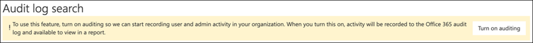
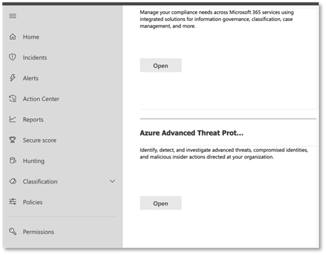
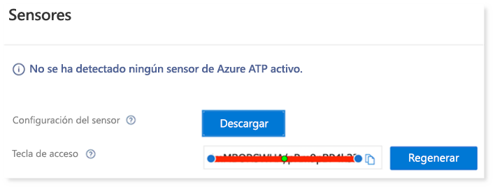
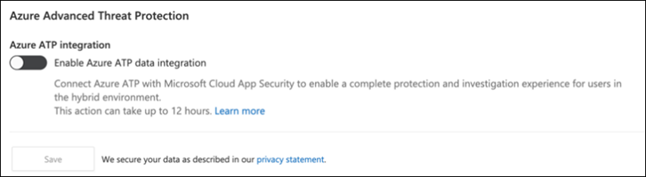

# Configuración de los pilares de 365 defender de Microsoft para el entorno de prueba o el entorno pilotoConfigure Microsoft 365 Defender pillars for your trial lab or pilot environment

[!INCLUDE [Microsoft 365 Defender rebranding](../includes/microsoft-defender.md)]

**Se aplica a:****Applies to:**
- Microsoft 365 DefenderMicrosoft 365 Defender

La creación de un entorno de prueba de Microsoft 365 defender o un entorno piloto y su implementación es un proceso de tres fases:Creating a Microsoft 365 Defender trial lab or pilot environment and deploying it is a three-phase process:

 
<table border="0" width="100%" align="center">
  <tr style="text-align:center;">
    <td align="center" style="width:25%; border:0;" >
      <a href= "https://docs.microsoft.com/microsoft-365/security/mtp/prepare-mtpeval?view=o365-worldwide"> 
        
       Fase 1: preparación </a>Phase 1: Prepare </a> 
    </td>
     <td align="center">
      <a href="https://docs.microsoft.com/microsoft-365/security/mtp/setup-mtpeval?view=o365-worldwide">
        
       Fase 2: configuración </a>Phase 2: Setup </a> 
    </td>
    <td align="center" bgcolor="#d5f5e3">
      <a href="https://docs.microsoft.com/microsoft-365/security/mtp/config-mtpeval?view=o365-worldwide">
        
       Fase 3: configurar & incorporado </a>Phase 3: Configure & Onboard </a> 
</td>
  </tr>
</table>

Actualmente se encuentra en la fase de configuración.You're currently in the configuration phase.

La preparación es fundamental para todas las implementaciones correctas.Preparation is key to any successful deployment. En este artículo, se le guiará en los puntos que debe tener en cuenta a la hora de preparar la implementación de Microsoft defender para el punto de conexión.In this article, you'll be guided on the points you'll need to consider as you prepare to deploy Microsoft Defender for Endpoint.

## Pilares de 365 defender de MicrosoftMicrosoft 365 Defender pillars
Microsoft 365 defender consta de cuatro pilares.Microsoft 365 Defender consists of four pillars. Aunque un pilar ya puede proporcionar valor a la seguridad de su organización de red, la habilitación de los cuatro pilares de Microsoft 365 defender dará mayor valor a su organización.Although one pillar can already provide value to your network organization's security, enabling the four Microsoft 365 Defender pillars will give your organization the most value.

Esta sección le guiará para configurar:This section will guide you to configure:
-   Microsoft Defender para Office 365Microsoft Defender for Office 365
-   Microsoft Defender for IdentityMicrosoft Defender for Identity 
-   Microsoft Cloud App SecurityMicrosoft Cloud App Security
-   Microsoft Defender para punto de conexiónMicrosoft Defender for Endpoint

## Configurar Microsoft defender para Office 365Configure Microsoft Defender for Office 365

>[!NOTE]
>Omita este paso si ya ha habilitado defender para Office 365.Skip this step if you've already enabled Defender for Office 365. 

Hay un módulo de PowerShell denominado analizador de configuración de la *protección contra amenazas avanzada de Office 365 (Orca)* que ayuda a determinar algunas de estas opciones.There's a PowerShell Module called the *Office 365 Advanced Threat Protection Recommended Configuration Analyzer (ORCA)* that helps determine some of these settings. Cuando se ejecuta como administrador en su espacio empresarial, Get-ORCAReport le ayudará a generar una evaluación de la configuración de protección contra correo electrónico no deseado, anti-phish y otros mensajes.When run as an administrator in your tenant, get-ORCAReport will help generate an assessment of the anti-spam, anti-phish, and other message hygiene settings. Puede descargar este módulo desde https://www.powershellgallery.com/packages/ORCA/ .You can download this module from https://www.powershellgallery.com/packages/ORCA/. 

1. Vaya a la Directiva de administración de amenazas [& cumplimiento del centro de cumplimiento de Office 365](https://protection.office.com/homepage)  >  **Threat management**  >  **Policy**.Navigate to [Office 365 Security & Compliance Center](https://protection.office.com/homepage) > **Threat management** > **Policy**.

   
 
2. Haga clic en **anti-phishing** , seleccione **crear** y rellene el nombre y la descripción de la Directiva.Click **Anti-phishing** , select **Create** and fill in the policy name and description. Haga clic en **Siguiente**.Click **Next**.

   

   > [!NOTE]
   > Edite su Directiva antiphishing avanzada en Microsoft defender para Office 365.Edit your Advanced anti-phishing policy in Microsoft Defender for Office 365. Cambiar el **umbral de suplantación de identidad avanzado** a **2-agresivo**.Change **Advanced Phishing Threshold** to **2 - Aggressive**.

3. Haga clic en el menú desplegable **Agregar condición** y seleccione su dominio o dominios como dominio del destinatario.Click the **Add a condition** drop-down menu and select your domain(s) as recipient domain. Haga clic en **Siguiente**.Click **Next**.

   
 
4. Revise la configuración.Review your settings. Haga clic en **crear esta directiva** para confirmar.Click **Create this policy** to confirm. 

   
 
5. Seleccione **datos adjuntos seguros** y seleccione la opción **Activar ATP para SharePoint, OneDrive y Microsoft Teams** .Select **Safe Attachments** and select the **Turn on ATP for SharePoint, OneDrive, and Microsoft Teams** option.

   

6. Haga clic en el icono + para crear una nueva Directiva de datos adjuntos seguros, aplíquela como dominio del destinatario en sus dominios.Click the + icon to create a new safe attachment policy, apply it as recipient domain to your domains. Haga clic en **Guardar**.Click **Save**.

   
 
7. A continuación, seleccione la directiva **vínculos seguros** y, a continuación, haga clic en el icono de lápiz para editar la directiva predeterminada.Next, select the **Safe Links** policy, then click the pencil icon to edit the default policy.

8. Asegúrese de que la opción no **realizar seguimiento cuando los usuarios hagan clic en vínculos seguros** no esté seleccionada, mientras que el resto de las opciones están seleccionadas.Make sure that the **Do not track when users click safe links** option is not selected, while the rest of the options are selected. Vea [configuración de vínculos seguros](https://docs.microsoft.com/microsoft-365/security/office-365-security/recommended-settings-for-eop-and-office365-atp) para obtener más información.See [Safe Links settings](https://docs.microsoft.com/microsoft-365/security/office-365-security/recommended-settings-for-eop-and-office365-atp) for details. Haga clic en **Guardar**.Click **Save**. 

   

9. A continuación, seleccione la directiva **antimalware** , seleccione la opción predeterminada y elija el icono de lápiz.Next select the **Anti-malware** policy, select the default, and choose the pencil icon.

10. Haga clic en **configuración** y seleccione **sí y use el texto de notificación predeterminado** para habilitar la **respuesta de detección de malware**.Click **Settings** and select **Yes and use the default notification text** to enable **Malware Detection Response**. Active el **filtro tipos de datos adjuntos comunes** en.Turn the **Common Attachment Types Filter** on. Haga clic en **Guardar**.Click **Save**.

    
  
11. Vaya a [Office 365 Security & cumplimiento del centro](https://protection.office.com/homepage)  >  **Search**  >  de **Auditoría** búsqueda y active la auditoría.Navigate to [Office 365 Security & Compliance Center](https://protection.office.com/homepage) > **Search** > **Audit log search** and turn Auditing on.

    

12. Integración de Microsoft defender para Office 365 con Microsoft defender para el punto de conexión.Integrate Microsoft Defender for Office 365 with Microsoft Defender for Endpoint. Vaya a [Office 365 Security & cumplimiento](https://protection.office.com/homepage)  >  del centro de **Administración de amenazas**  >  **Explorer** y seleccione **Microsoft defender for Endpoint Settings** en la esquina superior derecha de la pantalla.Navigate to [Office 365 Security & Compliance Center](https://protection.office.com/homepage) > **Threat management** > **Explorer** and select **Microsoft Defender for Endpoint Settings** on the upper right corner of the screen. En el cuadro de diálogo defender para conexión de extremo, Active **conectar con Microsoft defender para el extremo**.In the Defender for Endpoint connection dialog box, turn on **Connect to Microsoft Defender for Endpoint**.

    

## Configurar Microsoft defender para identidadConfigure Microsoft Defender for Identity

>[!NOTE]
>Omita este paso si ya ha habilitado Microsoft defender para identidadSkip this step if you've already enabled Microsoft Defender for Identity

1. Vaya a [Microsoft 365 Security Center](https://security.microsoft.com/info) > seleccione **más recursos**  >  **Microsoft defender para identidad**.Navigate to [Microsoft 365 Security Center](https://security.microsoft.com/info) > select **More Resources** > **Microsoft Defender for Identity**.

   

2. Haga clic en **crear** para iniciar el Asistente de Microsoft defender para identidad.Click **Create** to start the Microsoft Defender for Identity wizard. 

   

3. Elija **proporcionar un nombre de usuario y una contraseña para conectar con el bosque de Active** Directory.Choose **Provide a username and password to connect to your Active Directory forest**.  

   

4. Escriba sus credenciales locales de Active Directory.Enter your Active Directory on-premises credentials. Puede ser cualquier cuenta de usuario que tenga acceso de lectura a Active Directory.This can be any user account that has read access to Active Directory.

   

5. A continuación, seleccione **descargar la configuración del sensor** y transferir el archivo a su controlador de dominio.Next, choose **Download Sensor Setup** and transfer file to your domain controller.

   

6. Ejecute Microsoft defender para la configuración del sensor de identidad y comience a seguir el asistente.Execute the Microsoft Defender for Identity Sensor Setup and begin following the wizard.

   
 
7. Haga clic en **siguiente** en el tipo de implementación de sensor.Click **Next** at the sensor deployment type.

   
 
8. Copie la clave de acceso porque tiene que escribirla a continuación en el asistente.Copy the access key because you need to enter it next in the Wizard.

   
 
9. Copie la clave de acceso en el asistente y haga clic en **instalar**.Copy the access key into the Wizard and click **Install**. 

   

10. Enhorabuena, ha configurado correctamente Microsoft defender para identidad en el controlador de dominio.Congratulations, you've successfully configured Microsoft Defender for Identity on your domain controller.

    
 
11. En la sección [Microsoft defender for Identity](https://go.microsoft.com/fwlink/?linkid=2040449) Settings, seleccione \* \* Microsoft defender for Endpoint \* \* y, a continuación, active la opción de alternancia.Under the [Microsoft Defender for Identity](https://go.microsoft.com/fwlink/?linkid=2040449) settings section, select \*\*Microsoft Defender for Endpoint \*\*, then turn on the toggle. Haga clic en **Guardar**.Click **Save**. 

    

>[!NOTE]
>Windows Defender ATP ha cambiado de marca como Microsoft defender para el punto de conexión.Windows Defender ATP has been rebranded as Microsoft Defender for Endpoint. Los cambios de personalización de marca en todos nuestros portales se están implementando para lograr coherencia.Rebranding changes across all of our portals are being rolled out the for consistency.

## Configurar Microsoft Cloud App SecurityConfigure Microsoft Cloud App Security

>[!NOTE]
>Omita este paso si ya ha habilitado Microsoft Cloud App Security.Skip this step if you've already enabled Microsoft Cloud App Security. 

1. Vaya a [Microsoft 365 Security Center](https://security.microsoft.com/info)  >  **más recursos**  >  **Microsoft Cloud App Security**.Navigate to [Microsoft 365 Security Center](https://security.microsoft.com/info) > **More Resources** > **Microsoft Cloud App Security**.

   

2. En la información solicitada para integrar Microsoft defender para identidad, seleccione **Habilitar Microsoft defender para la integración de datos de identidad**.At the information prompt to integrate Microsoft Defender for Identity, select **Enable Microsoft Defender for Identity data integration**.
  
   

   > [!NOTE]
   > Si no ve este mensaje, puede significar que ya se ha habilitado Microsoft defender para la integración de datos de identidad.If you don’t see this prompt, it might mean that your Microsoft Defender for Identity data integration has already been enabled. Sin embargo, si no está seguro, póngase en contacto con su administrador de TI para confirmarlo.However, if you are not sure, contact your IT Administrator to confirm. 

3. Vaya a **configuración** , active el botón de alternancia **de Microsoft defender para integración de identidades** y, a continuación, haga clic en **Guardar**.Go to **Settings** , turn on the **Microsoft Defender for Identity integration** toggle, then click **Save**. 

   
   
   > [!NOTE]
   > En el caso de los nuevos Microsoft defender para instancias de identidad, este cambio de integración se activa automáticamente.For new Microsoft Defender for Identity instances, this integration toggle is automatically turned on. Confirme que se haya habilitado Microsoft defender para la integración de identidad antes de continuar con el paso siguiente.Confirm that your Microsoft Defender for Identity integration has been enabled before you proceed to the next step.
 
4. En configuración de detección en la nube, seleccione **Microsoft defender for Endpoint Integration** y, a continuación, habilite la integración.Under the Cloud discovery settings, select **Microsoft Defender for Endpoint integration** , then enable the integration. Haga clic en **Guardar**.Click **Save**.

   

5. En configuración de detección en la nube, seleccione **enriquecimiento de usuario** y, a continuación, habilite la integración con Azure Active Directory.Under Cloud discovery settings, select **User enrichment** , then enable the integration with Azure Active Directory.

   

## Configurar Microsoft defender para el punto de conexiónConfigure Microsoft Defender for Endpoint

>[!NOTE]
>Omita este paso si ya ha habilitado Microsoft defender para el punto de conexión.Skip this step if you've already enabled Microsoft Defender for Endpoint.

1. Vaya a [Microsoft 365 Security Center](https://security.microsoft.com/info)  >  **más recursos**  >  **centro de seguridad de Microsoft defender**.Navigate to [Microsoft 365 Security Center](https://security.microsoft.com/info) > **More Resources** > **Microsoft Defender Security Center**. Haga clic en **Open** (Abrir).Click **Open**.

   
 
2. Siga el Asistente de Microsoft defender para extremo.Follow the Microsoft Defender for Endpoint wizard. Haga clic en **Siguiente**.Click **Next**. 

   

3. Elija en función de la ubicación de almacenamiento de datos preferida, la Directiva de retención de datos, el tamaño de la organización y las características de vista previa.Choose based on your preferred data storage location, data retention policy, organization size, and opt-in for preview features.

   
   
   > [!NOTE]
   > No puede cambiar algunos de los valores, como la ubicación de almacenamiento de datos, más adelante.You cannot change some of the settings, like data storage location, afterwards. 

   Haga clic en **Siguiente**.Click **Next**. 

4. Haga clic en **continuar** y se aprovisionará su Microsoft defender para inquilino de punto de conexión.Click **Continue** and it will provision your Microsoft Defender for Endpoint tenant.

   

5. Incorpore los puntos de conexión a través de directivas de grupo, Microsoft Endpoint Manager o mediante la ejecución de un script local a Microsoft defender para el punto de conexión.Onboard your endpoints through Group Policies, Microsoft Endpoint Manager or by running a local script to Microsoft Defender for Endpoint. Para simplificar, esta guía usa el script local.For simplicity, this guide uses the local script.

6. Haga clic en **Descargar paquete** y copie el script de incorporación en los extremos.Click **Download package** and copy the onboarding script to your endpoint(s).

   

7. En el punto de conexión, ejecute el script de incorporación como administrador y elija Y.On your endpoint, run the onboarding script as Administrator and choose Y. 

   

8. Enhorabuena, ha incorporado el primer punto de conexión.Congratulations, you've onboarded your first endpoint.

   

9. Copie y pegue la prueba de detección desde el Asistente de Microsoft defender para extremo.Copy-paste the detection test from the Microsoft Defender for Endpoint wizard.

   

10. Copie el script de PowerShell en un símbolo del sistema con privilegios elevados y ejecútelo.Copy the PowerShell script to an elevated command prompt and run it. 

    

11. Seleccione **empezar a usar Microsoft defender para el extremo** desde el asistente.Select **Start using Microsoft Defender for Endpoint** from the Wizard.

    
 
12. Visite el [centro de seguridad de Microsoft defender](https://securitycenter.windows.com/).Visit the [Microsoft Defender Security Center](https://securitycenter.windows.com/). Vaya a **configuración** y, a continuación, seleccione **características avanzadas**.Go to **Settings** and then select **Advanced features**. 

    

13. Active la integración con **Microsoft defender para identidad**.Turn on the integration with **Microsoft Defender for Identity**.  

    

14. Active la integración con la **inteligencia sobre amenazas de Office 365**.Turn on the integration with **Office 365 Threat Intelligence**.

    

15. Active la integración con **Microsoft Cloud App Security**.Turn on integration with **Microsoft Cloud App Security**.

    

16. Desplácese hacia abajo y haga clic en **Guardar preferencias** para confirmar las nuevas integraciones.Scroll down and click **Save preferences** to confirm the new integrations.

    

## Iniciar el servicio de Microsoft 365 DefenderStart the Microsoft 365 Defender service

>[!NOTE]
>A partir del 1 de junio de 2020, Microsoft habilita automáticamente las características de Microsoft 365 defender para todos los inquilinos elegibles.Starting June 1, 2020, Microsoft automatically enables Microsoft 365 Defender features for all eligible tenants. Consulte este [artículo de la comunidad tecnológica de Microsoft sobre la elegibilidad de licencias](https://techcommunity.microsoft.com/t5/security-privacy-and-compliance/microsoft-threat-protection-will-automatically-turn-on-for/ba-p/1345426) para obtener más información.See this [Microsoft Tech Community article on license eligibility](https://techcommunity.microsoft.com/t5/security-privacy-and-compliance/microsoft-threat-protection-will-automatically-turn-on-for/ba-p/1345426) for details. 

Vaya al [centro de seguridad 365 de Microsoft](https://security.microsoft.com/homepage).Go to [Microsoft 365 Security Center](https://security.microsoft.com/homepage). Vaya a **configuración** y, a continuación, seleccione **Microsoft 365 defender**.Navigate to **Settings** and then select **Microsoft 365 Defender**.

  

Para obtener una guía más completa, consulte [Activar Microsoft 365 defender](mtp-enable.md).For a more comprehensive guidance, see [Turn on Microsoft 365 Defender](mtp-enable.md). 

¡Enhorabuena!Congratulations! Acaba de crear su entorno de prueba de Microsoft 365 defender o un entorno piloto.You've just created your Microsoft 365 Defender trial lab or pilot environment! Ahora puede familiarizarse con la interfaz de usuario de Microsoft 365 defender.Now you can familiarize yourself with the Microsoft 365 Defender user interface! Vea lo que puede aprender de la siguiente guía interactiva de Microsoft 365 defender y sepa cómo usar cada panel para las tareas de la operación de seguridad diaria.See what you can learn from the following Microsoft 365 Defender interactive guide and know how to use each dashboard for your day-to-day security operation tasks.

>[!VIDEO https://aka.ms/MTP-Interactive-Guide]

A continuación, puede simular un ataque y ver cómo las capacidades cruzadas del producto detectan, crean alertas y responden automáticamente a un ataque de archivos no deseados en un extremo.Next, you can simulate an attack and see how the cross product capabilities detect, create alerts, and automatically respond to a fileless attack on an endpoint.

## Paso siguienteNext step
|  [Fase de simulación de ataquesAttack simulation phase](mtp-pilot-simulate.md) | Ejecute la simulación de ataques para su entorno piloto de Microsoft 365 defender.Run the attack simulation for your Microsoft 365 Defender pilot environment.
|:-------|:-----|
