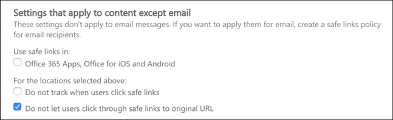
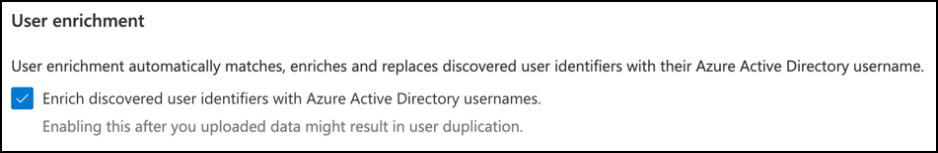

# Configurar los pilares de Microsoft 365 Defender para su entorno de prueba o piloto

[!INCLUDE [Microsoft 365 Defender rebranding](../includes/microsoft-defender.md)]

**Se aplica a:**
- Microsoft 365 Defender

Crear un entorno de prueba o piloto de Microsoft 365 Defender e implementarlo es un proceso de tres fases:

| [Fase 1: Preparar](prepare-mtpeval.md) | [Fase 2: Configurar](setup-mtpeval.md) | Fase 3: Incorporación |  [Volver al libro de juegos piloto](mtp-pilot.md) |
|--|--|--|--|
|| |*¡Estás aquí!* | |

Actualmente se encuentra en la fase de configuración.

La preparación es clave para una implementación correcta. En este artículo, se te guiará sobre los puntos que debes tener en cuenta a medida que te preparas para implementar Microsoft Defender para Endpoint.

## Pilares de Microsoft 365 Defender
Microsoft 365 Defender consta de cuatro pilares. Aunque un pilar ya puede proporcionar valor a la seguridad de su organización de red, habilitar los cuatro pilares de Microsoft 365 Defender dará a su organización el máximo valor.

Esta sección le guiará a configurar:
-   Microsoft Defender para Office 365
-   Microsoft Defender for Identity 
-   Microsoft Cloud App Security
-   Microsoft Defender para punto de conexión

## Configurar Microsoft Defender para Office 365

>[!NOTE]
>Omita este paso si ya ha habilitado Defender para Office 365. 

Hay un módulo de PowerShell denominado Analizador de configuración recomendado de Protección contra amenazas *avanzada (ORCA) de Office 365* que ayuda a determinar algunas de estas opciones de configuración. Cuando se ejecuta como administrador en su espacio empresarial, get-ORCAReport le ayudará a generar una evaluación de la configuración de higiene de mensajes, antiphishing y contra correo no deseado. Puede descargar este módulo desde https://www.powershellgallery.com/packages/ORCA/ . 

1. Vaya a La directiva de administración de amenazas del Centro & seguridad de [Office 365.](https://protection.office.com/homepage)  >    >  

   
 
2. Haga **clic en Anti-phishing,** seleccione **Crear** y rellene el nombre y la descripción de la directiva. Haga clic en **Siguiente**.

   

   > [!NOTE]
   > Edite la directiva contra suplantación de identidad avanzada en Microsoft Defender para Office 365. Cambie **el umbral de suplantación de** identidad avanzada a **2: agresivo.**

3. Haga clic **en el menú desplegable Agregar** una condición y seleccione los dominios como dominio del destinatario. Haga clic en **Siguiente**.

   
 
4. Revisa la configuración. Haga **clic en Crear esta directiva** para confirmar. 

   
 
5. Seleccione **Datos adjuntos** seguros y seleccione **la opción Activar ATP para SharePoint, OneDrive y Microsoft Teams.**

   

6. Haga clic en el icono + para crear una nueva directiva de datos adjuntos seguros y aplíquela como dominio de destinatario a sus dominios. Haga clic en **Guardar**.

   
 
7. A continuación, seleccione la **directiva de vínculos** seguros y, a continuación, haga clic en el icono de lápiz para editar la directiva predeterminada.

8. Asegúrese de que la **opción No realizar seguimiento cuando** los usuarios hacen clic en vínculos seguros no está seleccionada, mientras que el resto de las opciones están seleccionadas. Consulte [la configuración de vínculos seguros](https://docs.microsoft.com/microsoft-365/security/office-365-security/recommended-settings-for-eop-and-office365-atp) para obtener más información. Haga clic en **Guardar**. 

   

9. A continuación, **seleccione la directiva antimalware,** seleccione la predeterminada y elija el icono de lápiz.

10. Haga **clic en** Configuración y seleccione Sí y use el texto de notificación **predeterminado** para habilitar la respuesta **de detección de malware.** Activar el **filtro de tipos comunes de datos adjuntos.** Haga clic en **Guardar**.

    
  
11. Vaya a la búsqueda del registro de auditoría del Centro de & seguridad y cumplimiento de [Office 365](https://protection.office.com/homepage)y  >    >   active la auditoría.

    

12. Integre Microsoft Defender para Office 365 con Microsoft Defender para Endpoint. Vaya al Explorador de administración de amenazas del Centro de seguridad & Cumplimiento de [Office 365](https://protection.office.com/homepage)y seleccione Microsoft Defender para Configuración de puntos de conexión en la esquina superior  >    >   derecha de la pantalla.  En el cuadro de diálogo Conexión de Defender para extremo, active **Conectar a Microsoft Defender para Endpoint.**

    

## Configurar Microsoft Defender para la identidad

>[!NOTE]
>Omita este paso si ya ha habilitado Microsoft Defender para Identity

1. Vaya al [Centro de seguridad de Microsoft 365](https://security.microsoft.com/info) > más **recursos** de Microsoft Defender  >  **para identidad.**

   

2. Haga **clic en** Crear para iniciar el Asistente de Microsoft Defender para identidades. 

   

3. Elija **Proporcionar un nombre de usuario y una contraseña para conectarse al bosque de Active Directory.**  

   

4. Escriba sus credenciales locales de Active Directory. Puede ser cualquier cuenta de usuario que tenga acceso de lectura a Active Directory.

   

5. A continuación, **elija Descargar configuración del sensor** y transferir el archivo al controlador de dominio.

   

6. Ejecuta Microsoft Defender para la configuración del sensor de identidad y empieza a seguir el asistente.

   
 
7. Haz **clic en Siguiente** en el tipo de implementación del sensor.

   
 
8. Copie la tecla de acceso porque tiene que escribirla a continuación en el Asistente.

   
 
9. Copie la clave de acceso en el Asistente y haga clic en **Instalar**. 

   

10. Enhorabuena, ha configurado correctamente Microsoft Defender para Identity en el controlador de dominio.

    
 
11. En la [sección Configuración de Microsoft Defender](https://go.microsoft.com/fwlink/?linkid=2040449) para identidad, selecciona **Microsoft Defender para punto de conexión **y, a continuación, activa el botón de alternancia. Haga clic en **Guardar**. 

    

>[!NOTE]
>Windows Defender se ha cambiado el nombre de ATP como Microsoft Defender para Endpoint. El cambio de marca de los cambios en todos nuestros portales se está implantando para mantener la coherencia.

## Configurar Microsoft Cloud App Security

>[!NOTE]
>Omita este paso si ya ha habilitado Microsoft Cloud App Security. 

1. Vaya al [Centro de seguridad de Microsoft 365](https://security.microsoft.com/info)Más  >  **recursos** de  >  **Microsoft Cloud App Security.**

   

2. En el símbolo del sistema de información para integrar Microsoft Defender for Identity, seleccione **Habilitar Microsoft Defender para la integración de datos de identidad.**
  
   

   > [!NOTE]
   > Si no ve este mensaje, puede significar que la integración de datos de Microsoft Defender para Identidad ya está habilitada. Sin embargo, si no está seguro, póngase en contacto con el administrador de TI para confirmarlo. 

3. Vaya a **Configuración,** active el botón de alternancia de **integración** de Microsoft Defender para identidad y, a continuación, haga clic en **Guardar.** 

   
   
   > [!NOTE]
   > Para las nuevas instancias de Microsoft Defender para identidad, este botón de alternancia de integración se activa automáticamente. Confirme que la integración de Microsoft Defender para identidades se ha habilitado antes de continuar con el paso siguiente.
 
4. En la configuración de detección de nube, **selecciona Microsoft Defender para la integración** de puntos de conexión y, a continuación, habilita la integración. Haga clic en **Guardar**.

   

5. En Configuración de detección de nube, seleccione **Enriquecimiento de usuarios** y, a continuación, habilite la integración con Azure Active Directory.

   

## Configurar Microsoft Defender para endpoint

>[!NOTE]
>Omita este paso si ya ha habilitado Microsoft Defender para Endpoint.

1. Vaya al [Centro de seguridad de Microsoft 365](https://security.microsoft.com/info)Más  >  **recursos** del  >  **Centro de seguridad de Microsoft Defender.** Haga clic en **Open** (Abrir).

   
 
2. Sigue el Asistente de Microsoft Defender para puntos de conexión. Haga clic en **Siguiente**. 

   

3. Elija en función de la ubicación de almacenamiento de datos preferida, la directiva de retención de datos, el tamaño de la organización y la participación en las características de vista previa.

   
   
   > [!NOTE]
   > No puede cambiar algunas de las opciones de configuración, como la ubicación de almacenamiento de datos, más adelante. 

   Haga clic en **Siguiente**. 

4. Haz **clic en Continuar** y aprovisionará el inquilino de Microsoft Defender para Endpoint.

   

5. Incorpore los puntos de conexión a través de directivas de grupo, Microsoft Endpoint Manager o mediante la ejecución de un script local en Microsoft Defender para Endpoint. Por motivos de simplicidad, esta guía usa el script local.

6. Haz **clic en Descargar paquete** y copia el script de incorporación en tus puntos de conexión.

   

7. En el punto de conexión, ejecuta el script de incorporación como administrador y elige Y. 

   

8. Enhorabuena, ha incorporado su primer punto de conexión.

   

9. Copiar y pegar la prueba de detección desde el Asistente de Microsoft Defender para puntos de conexión.

   

10. Copie el script de PowerShell en un símbolo del sistema con privilegios elevados y ejecutarlo. 

    

11. Selecciona **Empezar a usar Microsoft Defender para Endpoint** en el Asistente.

    
 
12. Visite el Centro [de seguridad de Microsoft Defender.](https://securitycenter.windows.com/) Vaya a **Configuración** y, a continuación, seleccione **Características avanzadas.** 

    

13. Active la integración con **Microsoft Defender para Identity.**  

    

14. Active la integración con inteligencia **de amenazas de Office 365.**

    

15. Active la integración con **Microsoft Cloud App Security.**

    

16. Desplácese hacia abajo y haga **clic en Guardar** preferencias para confirmar las nuevas integraciones.

    

## Iniciar el servicio de Microsoft 365 Defender

>[!NOTE]
>A partir del 1 de junio de 2020, Microsoft habilita automáticamente las características de Microsoft 365 Defender para todos los inquilinos elegibles. Consulta este [artículo de Microsoft Tech Community sobre la elegibilidad de licencias](https://techcommunity.microsoft.com/t5/security-privacy-and-compliance/microsoft-threat-protection-will-automatically-turn-on-for/ba-p/1345426) para obtener más información. 

Vaya al [Centro de seguridad de Microsoft 365.](https://security.microsoft.com/homepage) Vaya a **Configuración** y, a continuación, **seleccione Microsoft 365 Defender.**

  

Para obtener una guía más completa, [vea Activar Microsoft 365 Defender.](mtp-enable.md) 

¡Enhorabuena! Acaba de crear el entorno piloto o el entorno de prueba de Microsoft 365 Defender. Ahora puede familiarizarse con la interfaz de usuario de Microsoft 365 Defender. Vea lo que puede aprender de la siguiente guía interactiva de Microsoft 365 Defender y sepa cómo usar cada panel para sus tareas diarias de operación de seguridad.

>[!VIDEO https://aka.ms/MTP-Interactive-Guide]

A continuación, puedes simular un ataque y ver cómo las funcionalidades entre productos detectan, crean alertas y responden automáticamente a un ataque sin archivos en un punto de conexión.

## Paso siguiente
|[Fase de simulación de ataques](mtp-pilot-simulate.md) | Ejecute la simulación de ataques para su entorno piloto de Microsoft 365 Defender.
|:-------|:-----|
