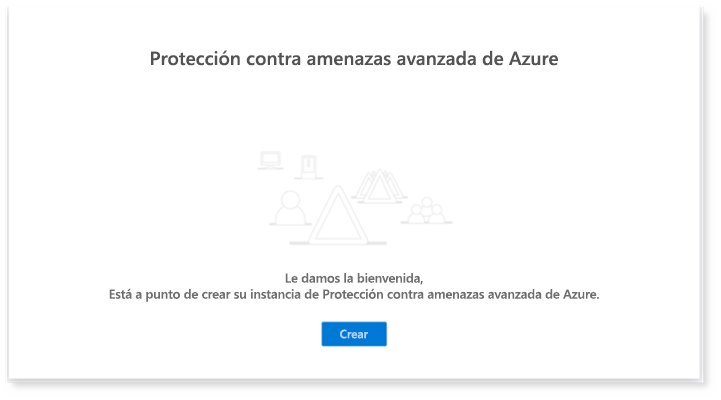

# Configurar los pilares de la protección contra amenazas de Microsoft para el entorno de prueba o el entorno piloto

[!INCLUDE [Microsoft 365 Defender rebranding](../includes/microsoft-defender.md)]

**Se aplica a:**
- Protección contra amenazas de Microsoft

La creación de un entorno piloto o un laboratorio de pruebas de Microsoft Threat Protection y su implementación es un proceso de tres fases:

 
<table border="0" width="100%" align="center">
  <tr style="text-align:center;">
    <td align="center" style="width:25%; border:0;" >
      <a href= "https://docs.microsoft.com/microsoft-365/security/mtp/prepare-mtpeval?view=o365-worldwide"> 
        
       Fase 1: preparación </a> 
    </td>
     <td align="center">
      <a href="https://docs.microsoft.com/microsoft-365/security/mtp/setup-mtpeval?view=o365-worldwide">
        
       Fase 2: configuración </a> 
    </td>
    <td align="center" bgcolor="#d5f5e3">
      <a href="https://docs.microsoft.com/microsoft-365/security/mtp/config-mtpeval?view=o365-worldwide">
        
       Fase 3: configurar & incorporado </a> 
</td>
  </tr>
</table>

Actualmente se encuentra en la fase de configuración.

La preparación es fundamental para todas las implementaciones correctas. En este artículo, se le guiará en los puntos que necesitará tener en cuenta a la hora de prepararse para implementar ATP de Microsoft defender.

## Pilares de la protección contra amenazas de Microsoft
La protección contra amenazas de Microsoft consta de cuatro pilares. Aunque un pilar ya puede proporcionar valor a la seguridad de su organización de red, la habilitación de los cuatro pilares de la protección contra amenazas de Microsoft dará mayor valor a su organización.

Esta sección le guiará para configurar:
-   Protección contra amenazas avanzada de Office 365
-   Azure Advanced Threat Protection 
-   Microsoft Cloud App Security
-   Protección contra amenazas avanzada de Microsoft Defender

## Configuración de la protección contra amenazas avanzada de Office 365

>[!NOTE]
>Omita este paso si ya ha habilitado la protección contra amenazas avanzada de Office 365. 

Hay un módulo de PowerShell denominado analizador de configuración de la *protección contra amenazas avanzada de Office 365 (Orca)* que ayuda a determinar algunas de estas opciones. Cuando se ejecuta como administrador en su espacio empresarial, Get-ORCAReport le ayudará a generar una evaluación de la configuración de protección contra correo electrónico no deseado, anti-phish y otros mensajes. Puede descargar este módulo desde https://www.powershellgallery.com/packages/ORCA/ . 

1. Vaya a la Directiva de administración de amenazas [& cumplimiento del centro de cumplimiento de Office 365](https://protection.office.com/homepage)  >  **Threat management**  >  **Policy**.

   
 
2. Haga clic en **anti-phishing ATP**, seleccione **crear** y rellene el nombre y la descripción de la Directiva. Haga clic en **Siguiente**.

   

   > [!NOTE]
   > Edite la Directiva antiphishing de ATP avanzada. Cambiar el **umbral de suplantación de identidad avanzado** a **2-agresivo**.

3. Haga clic en el menú desplegable **Agregar condición** y seleccione su dominio o dominios como dominio del destinatario. Haga clic en **Siguiente**.

   
 
4. Revise la configuración. Haga clic en **crear esta directiva** para confirmar. 

   
 
5. Seleccione **datos adjuntos seguros de ATP** y seleccione la opción **Activar ATP para SharePoint, OneDrive y Microsoft Teams** .

   

6. Haga clic en el icono + para crear una nueva Directiva de datos adjuntos seguros, aplíquela como dominio del destinatario en sus dominios. Haga clic en **Guardar**.

   
 
7. A continuación, seleccione la Directiva de **vínculos seguros ATP** y haga clic en el icono de lápiz para editar la directiva predeterminada.

8. Asegúrese de que la opción no **realizar seguimiento cuando los usuarios hagan clic en vínculos seguros** no esté seleccionada, mientras que el resto de las opciones están seleccionadas. Vea [configuración de vínculos seguros](https://docs.microsoft.com/microsoft-365/security/office-365-security/recommended-settings-for-eop-and-office365-atp) para obtener más información. Haga clic en **Guardar**. 

   

9. A continuación, seleccione la directiva **antimalware** , seleccione la opción predeterminada y elija el icono de lápiz.

10. Haga clic en **configuración** y seleccione **sí y use el texto de notificación predeterminado** para habilitar la **respuesta de detección de malware**. Active el **filtro tipos de datos adjuntos comunes** en. Haga clic en **Guardar**.

    
  
11. Vaya a [Office 365 Security & cumplimiento del centro](https://protection.office.com/homepage)  >  **Search**  >  de**Auditoría** búsqueda y active la auditoría.

    

12. Integrar Office 365 ATP con Microsoft defender ATP. Vaya a [Office 365 Security & cumplimiento](https://protection.office.com/homepage)  >  del centro de**Administración de amenazas**  >  **Explorer** y seleccione **WDATP configuración** en la esquina superior derecha de la pantalla. En el cuadro de diálogo conexión ATP de Microsoft defender, Active **conectarse a ATP de Windows**.

    

## Configurar la protección contra amenazas avanzada de Azure

>[!NOTE]
>Omita este paso si ya ha habilitado la protección contra amenazas avanzada de Azure

1. Vaya a [Microsoft 365 Security Center](https://security.microsoft.com/info) > seleccione **más recursos**  >  **Azure Advanced Threat Protection**.

   

2. Haga clic en **crear** para iniciar el Asistente de Azure Advanced Threat Protection. 

   

3. Elija **proporcionar un nombre de usuario y una contraseña para conectar con el bosque de Active**Directory.  

   

4. Escriba sus credenciales locales de Active Directory. Puede ser cualquier cuenta de usuario que tenga acceso de lectura a Active Directory.

   

5. A continuación, seleccione **descargar la configuración del sensor** y transferir el archivo a su controlador de dominio.

   

6. Ejecute la configuración del sensor ATP de Azure y comience a seguir el asistente.

   
 
7. Haga clic en **siguiente** en el tipo de implementación de sensor.

   
 
8. Copie la clave de acceso porque tiene que escribirla a continuación en el asistente.

   
 
9. Copie la clave de acceso en el asistente y haga clic en **instalar**. 

   

10. Enhorabuena, ha configurado correctamente la protección contra amenazas avanzada de Azure en el controlador de dominio.

    
 
11. En la sección configuración de ATP de Azure [Azure](https://go.microsoft.com/fwlink/?linkid=2040449) , seleccione **ATP de Windows Defender**y, a continuación, active la alternancia. Haga clic en **Guardar**. 

    

>[!NOTE]
>Windows Defender ATP ha cambiado de marca como ATP de Microsoft defender. Los cambios de personalización de marca en todos nuestros portales se están implementando para lograr coherencia.

## Configurar Microsoft Cloud App Security

>[!NOTE]
>Omita este paso si ya ha habilitado Microsoft Cloud App Security. 

1. Vaya a [Microsoft 365 Security Center](https://security.microsoft.com/info)  >  **más recursos**  >  **Microsoft Cloud App Security**.

   

2. En la solicitud de información para integrar ATP de Azure, seleccione **Habilitar la integración de datos de ATP de Azure**.
  
   

   > [!NOTE]
   > Si no aparece este mensaje, puede significar que ya se ha habilitado la integración de datos de ATP de Azure. Sin embargo, si no está seguro, póngase en contacto con su administrador de TI para confirmarlo. 

3. Vaya a **configuración**, active el botón de alternancia **integración de ATP de Azure** y haga clic en **Guardar**. 

   
   
   > [!NOTE]
   > Para las nuevas instancias de ATP de Azure, este cambio de integración se activa automáticamente. Confirme que la integración de ATP de Azure se haya habilitado antes de continuar con el paso siguiente.
 
4. En la configuración de detección en la nube, seleccione **integración de Microsoft defender ATP**y, a continuación, habilite la integración. Haga clic en **Guardar**.

   

5. En configuración de detección en la nube, seleccione **enriquecimiento de usuario**y, a continuación, habilite la integración con Azure Active Directory.

   

## Configurar la protección contra amenazas avanzada de Microsoft defender

>[!NOTE]
>Omita este paso si ya ha habilitado la protección contra amenazas avanzada de Microsoft defender.

1. Vaya a [Microsoft 365 Security Center](https://security.microsoft.com/info)  >  **más recursos**  >  **centro de seguridad de Microsoft defender**. Haga clic en **Open** (Abrir).

   
 
2. Siga el Asistente para la protección contra amenazas avanzada de Microsoft defender. Haga clic en **Siguiente**. 

   

3. Elija en función de la ubicación de almacenamiento de datos preferida, la Directiva de retención de datos, el tamaño de la organización y las características de vista previa.

   
   
   > [!NOTE]
   > No puede cambiar algunos de los valores, como la ubicación de almacenamiento de datos, más adelante. 

   Haga clic en **Siguiente**. 

4. Haga clic en **continuar** y se aprovisionará el inquilino ATP de Microsoft defender.

   

5. Incorpore los puntos de conexión a través de directivas de grupo, Microsoft Endpoint Manager o mediante la ejecución de un script local a ATP de Microsoft defender. Para simplificar, esta guía usa el script local.

6. Haga clic en **Descargar paquete** y copie el script de incorporación en los extremos.

   

7. En el punto de conexión, ejecute el script de incorporación como administrador y elija Y. 

   

8. Enhorabuena, ha incorporado el primer punto de conexión.

   

9. Copie-pegue la prueba de detección desde el Asistente para ATP de Microsoft defender.

   

10. Copie el script de PowerShell en un símbolo del sistema con privilegios elevados y ejecútelo. 

    

11. Seleccione **empezar a usar ATP de Microsoft defender** desde el asistente.

    
 
12. Visite el [centro de seguridad de Microsoft defender](https://securitycenter.windows.com/). Vaya a **configuración** y, a continuación, seleccione **características avanzadas**. 

    

13. Active la integración con la **protección contra amenazas avanzada de Azure**.  

    

14. Active la integración con la **inteligencia sobre amenazas de Office 365**.

    

15. Active la integración con **Microsoft Cloud App Security**.

    

16. Desplácese hacia abajo y haga clic en **Guardar preferencias** para confirmar las nuevas integraciones.

    

## Iniciar el servicio de Protección contra amenazas de Microsoft

>[!NOTE]
>A partir del 1 de junio de 2020, Microsoft habilita automáticamente las características de protección contra amenazas de Microsoft para todos los inquilinos elegibles. Consulte este [artículo de la comunidad tecnológica de Microsoft sobre la elegibilidad de licencias](https://techcommunity.microsoft.com/t5/security-privacy-and-compliance/microsoft-threat-protection-will-automatically-turn-on-for/ba-p/1345426) para obtener más información. 

Vaya al [centro de seguridad 365 de Microsoft](https://security.microsoft.com/homepage). Vaya a **configuración** y, a continuación, seleccione **protección contra amenazas de Microsoft**.

  

Para obtener una guía más completa, consulte [activar la protección contra amenazas de Microsoft](mtp-enable.md). 

¡Enhorabuena! Acaba de crear su entorno de prueba de Microsoft Threat Protection o un entorno piloto. Ahora puede familiarizarse con la interfaz de usuario de Microsoft Threat Protection. Vea lo que puede aprender de la siguiente guía interactiva de Microsoft Threat Protection y sepa cómo usar cada panel para las tareas de la operación de seguridad diaria.

>[!VIDEO https://aka.ms/MTP-Interactive-Guide]

A continuación, puede simular un ataque y ver cómo las capacidades cruzadas del producto detectan, crean alertas y responden automáticamente a un ataque de archivos no deseados en un extremo.

## Paso siguiente
|  [Fase de simulación de ataques](mtp-pilot-simulate.md) | Ejecute la simulación de ataques para su entorno piloto de Microsoft Threat Protection.
|:-------|:-----|
