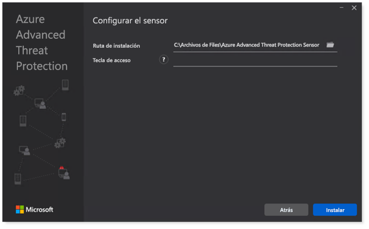

# Configurar los pilares de la protección contra amenazas de Microsoft para el entorno de prueba o el entorno pilotoConfigure Microsoft Threat Protection pillars for your trial lab or pilot environment

[!INCLUDE [Microsoft 365 Defender rebranding](../includes/microsoft-defender.md)]

**Se aplica a:****Applies to:**
- Protección contra amenazas de MicrosoftMicrosoft Threat Protection

La creación de un entorno piloto o un laboratorio de pruebas de Microsoft Threat Protection y su implementación es un proceso de tres fases:Creating a Microsoft Threat Protection trial lab or pilot environment and deploying it is a three-phase process:

 
<table border="0" width="100%" align="center">
  <tr style="text-align:center;">
    <td align="center" style="width:25%; border:0;" >
      <a href= "https://docs.microsoft.com/microsoft-365/security/mtp/prepare-mtpeval?view=o365-worldwide"> 
        
       Fase 1: preparación </a>Phase 1: Prepare </a> 
    </td>
     <td align="center">
      <a href="https://docs.microsoft.com/microsoft-365/security/mtp/setup-mtpeval?view=o365-worldwide">
        
       Fase 2: configuración </a>Phase 2: Setup </a> 
    </td>
    <td align="center" bgcolor="#d5f5e3">
      <a href="https://docs.microsoft.com/microsoft-365/security/mtp/config-mtpeval?view=o365-worldwide">
        
       Fase 3: configurar & incorporado </a>Phase 3: Configure & Onboard </a> 
</td>

  </tr>
</table>

Actualmente se encuentra en la fase de configuración.You're currently in the configuration phase.

La preparación es fundamental para todas las implementaciones correctas.Preparation is key to any successful deployment. En este artículo, se le guiará en los puntos que necesitará tener en cuenta a la hora de prepararse para implementar ATP de Microsoft defender.In this article, you'll be guided on the points you'll need to consider as you prepare to deploy Microsoft Defender ATP.

## Pilares de la protección contra amenazas de MicrosoftMicrosoft Threat Protection pillars
La protección contra amenazas de Microsoft consta de cuatro pilares.Microsoft Threat Protection consists of four pillars. Aunque un pilar ya puede proporcionar valor a la seguridad de su organización de red, la habilitación de los cuatro pilares de la protección contra amenazas de Microsoft dará mayor valor a su organización.Although one pillar can already provide value to your network organization's security, enabling the four Microsoft Threat Protection pillars will give your organization the most value.
 
  

Esta sección le guiará para configurar:This section will guide you to configure:
-   Protección contra amenazas avanzada de Office 365Office 365 Advanced Threat Protection
-   Azure Advanced Threat ProtectionAzure Advanced Threat Protection 
-   Microsoft Cloud App SecurityMicrosoft Cloud App Security
-   Protección contra amenazas avanzada de Microsoft DefenderMicrosoft Defender Advanced Threat Protection

## Configuración de la protección contra amenazas avanzada de Office 365Configure Office 365 Advanced Threat Protection
>[!NOTE]
>Omita este paso si ya ha habilitado la protección contra amenazas avanzada de Office 365.Skip this step if you've already enabled Office 365 Advanced Threat Protection. 

Hay un módulo de PowerShell denominado analizador de configuración de la *protección contra amenazas avanzada de Office 365 (Orca)* que ayuda a determinar algunas de estas opciones.There's a PowerShell Module called the *Office 365 Advanced Threat Protection Recommended Configuration Analyzer (ORCA)* that helps determine some of these settings. Cuando se ejecuta como administrador en su espacio empresarial, Get-ORCAReport le ayudará a generar una evaluación de la configuración de protección contra correo electrónico no deseado, anti-phish y otros mensajes.When run as an administrator in your tenant, get-ORCAReport will help generate an assessment of the anti-spam, anti-phish, and other message hygiene settings. Puede descargar este módulo desde https://www.powershellgallery.com/packages/ORCA/ .You can download this module from https://www.powershellgallery.com/packages/ORCA/. 

1. Vaya a la Directiva de administración de amenazas [& cumplimiento del centro de cumplimiento de Office 365](https://protection.office.com/homepage)  >  **Threat management**  >  **Policy**.Navigate to [Office 365 Security & Compliance Center](https://protection.office.com/homepage) > **Threat management** > **Policy**.
  
 
2. Haga clic en **anti-phishing ATP**, seleccione **crear** y rellene el nombre y la descripción de la Directiva.Click **ATP anti-phishing**, select **Create** and fill in the policy name and description. Haga clic en **Siguiente**.Click **Next**.
  

>[!NOTE]
>Edite la Directiva antiphishing de ATP avanzada.Edit your Advanced ATP anti-phishing policy. Cambiar el **umbral de suplantación de identidad avanzado** a **2-agresivo**.Change **Advanced Phishing Threshold** to **2 - Aggressive**.
 

3. Haga clic en el menú desplegable **Agregar condición** y seleccione su dominio o dominios como dominio del destinatario.Click the **Add a condition** drop-down menu and select your domain(s) as recipient domain. Haga clic en **Siguiente**.Click **Next**.
  
 
4. Revise la configuración.Review your settings. Haga clic en **crear esta directiva** para confirmar.Click **Create this policy** to confirm. 
  
 
5. Seleccione **datos adjuntos seguros de ATP** y seleccione la opción **Activar ATP para SharePoint, OneDrive y Microsoft Teams** .Select **ATP Safe attachments** and select the **Turn on ATP for SharePoint, OneDrive, and Microsoft Teams** option.  
  

6. Haga clic en el icono + para crear una nueva Directiva de datos adjuntos seguros, aplíquela como dominio del destinatario en sus dominios.Click the + icon to create a new safe attachment policy, apply it as recipient domain to your domains. Haga clic en \*\*Guardar \*\*.Click **Save**.
  
 
7. A continuación, seleccione la Directiva de **vínculos seguros ATP** y haga clic en el icono de lápiz para editar la directiva predeterminada.Next, select the **ATP Safe Links** policy, then click the pencil icon to edit the default policy.

8. Asegúrese de que la opción no **realizar seguimiento cuando los usuarios hagan clic en vínculos seguros** no esté seleccionada, mientras que el resto de las opciones están seleccionadas.Make sure that the **Do not track when users click safe links** option is not selected, while the rest of the options are selected. Vea [configuración de vínculos seguros](https://docs.microsoft.com/microsoft-365/security/office-365-security/recommended-settings-for-eop-and-office365-atp) para obtener más información.See [Safe Links settings](https://docs.microsoft.com/microsoft-365/security/office-365-security/recommended-settings-for-eop-and-office365-atp) for details. Haga clic en \*\*Guardar \*\*.Click **Save**. 
  

9. A continuación, seleccione la directiva **antimalware** , seleccione la opción predeterminada y elija el icono de lápiz.Next select the **Anti-malware** policy, select the default, and choose the pencil icon.

10. Haga clic en **configuración** y seleccione **sí y use el texto de notificación predeterminado** para habilitar la **respuesta de detección de malware**.Click **Settings** and select **Yes and use the default notification text** to enable **Malware Detection Response**. Active el **filtro tipos de datos adjuntos comunes** en.Turn the **Common Attachment Types Filter** on. Haga clic en \*\*Guardar \*\*.Click **Save**.
   
  
11. Vaya a [Office 365 Security & cumplimiento del centro](https://protection.office.com/homepage)  >  **Search**  >  de**Auditoría** búsqueda y active la auditoría.Navigate to [Office 365 Security & Compliance Center](https://protection.office.com/homepage) > **Search** > **Audit log search** and turn Auditing on.  
  

12. Integrar Office 365 ATP con Microsoft defender ATP.Integrate Office 365 ATP with Microsoft Defender ATP. Vaya a [Office 365 Security & cumplimiento](https://protection.office.com/homepage)  >  del centro de**Administración de amenazas**  >  **Explorer** y seleccione **WDATP configuración** en la esquina superior derecha de la pantalla.Navigate to [Office 365 Security & Compliance Center](https://protection.office.com/homepage) > **Threat management** > **Explorer** and select **WDATP Settings** on the upper right corner of the screen. En el cuadro de diálogo conexión ATP de Microsoft defender, Active **conectarse a ATP de Windows**.In the Microsoft Defender ATP connection dialog box, turn on **Connect to Windows ATP**.
  

## Configurar la protección contra amenazas avanzada de AzureConfigure Azure Advanced Threat Protection
>[!NOTE]
>Omita este paso si ya ha habilitado la protección contra amenazas avanzada de AzureSkip this step if you've already enabled Azure Advanced Threat Protection

1. Vaya a [Microsoft 365 Security Center](https://security.microsoft.com/info) > seleccione **más recursos**  >  **Azure Advanced Threat Protection**.Navigate to [Microsoft 365 Security Center](https://security.microsoft.com/info) > select **More Resources** > **Azure Advanced Threat Protection**.
  

2. Haga clic en **crear** para iniciar el Asistente de Azure Advanced Threat Protection.Click **Create** to start the Azure Advanced Threat Protection wizard. 
   

3. Elija **proporcionar un nombre de usuario y una contraseña para conectar con el bosque de Active**Directory.Choose **Provide a username and password to connect to your Active Directory forest**.  
  

4. Escriba sus credenciales locales de Active Directory.Enter your Active Directory on-premises credentials. Puede ser cualquier cuenta de usuario que tenga acceso de lectura a Active Directory.This can be any user account that has read access to Active Directory.
  

5. A continuación, seleccione **descargar la configuración del sensor** y transferir el archivo a su controlador de dominio.Next, choose **Download Sensor Setup** and transfer file to your domain controller. 
  

6. Ejecute la configuración del sensor ATP de Azure y comience a seguir el asistente.Execute the Azure ATP Sensor Setup and begin following the wizard.
   
 
7. Haga clic en **siguiente** en el tipo de implementación de sensor.Click **Next** at the sensor deployment type.
   
 
8. Copie la clave de acceso porque tiene que escribirla a continuación en el asistente.Copy the access key because you need to enter it next in the Wizard.
  
 
9. Copie la clave de acceso en el asistente y haga clic en **instalar**.Copy the access key into the Wizard and click **Install**. 
   

10. Enhorabuena, ha configurado correctamente la protección contra amenazas avanzada de Azure en el controlador de dominio.Congratulations, you've successfully configured Azure Advanced Threat Protection on your domain controller.
  
 
11. En la sección configuración de ATP de Azure [Azure](https://go.microsoft.com/fwlink/?linkid=2040449) , seleccione **ATP de Windows Defender**y, a continuación, active la alternancia.Under the [Azure Azure ATP](https://go.microsoft.com/fwlink/?linkid=2040449) settings section, select **Windows Defender ATP**, then turn on the toggle. Haga clic en \*\*Guardar \*\*.Click **Save**. 
  

>[!NOTE]
>Windows Defender ATP ha cambiado de marca como ATP de Microsoft defender.Windows Defender ATP has been rebranded as Microsoft Defender ATP. Los cambios de personalización de marca en todos nuestros portales se están implementando para lograr coherencia.Rebranding changes across all of our portals are being rolled out the for consistency.

## Configurar Microsoft Cloud App SecurityConfigure Microsoft Cloud App Security
>[!NOTE]
>Omita este paso si ya ha habilitado Microsoft Cloud App Security.Skip this step if you've already enabled Microsoft Cloud App Security. 

1. Vaya a [Microsoft 365 Security Center](https://security.microsoft.com/info)  >  **más recursos**  >  **Microsoft Cloud App Security**.Navigate to [Microsoft 365 Security Center](https://security.microsoft.com/info) > **More Resources** > **Microsoft Cloud App Security**.
  

2. En la solicitud de información para integrar ATP de Azure, seleccione **Habilitar la integración de datos de ATP de Azure**.At the information prompt to integrate Azure ATP, select **Enable Azure ATP data integration**. 
   

>[!NOTE]
>Si no aparece este mensaje, puede significar que ya se ha habilitado la integración de datos de ATP de Azure.If you don’t see this prompt, it might mean that your Azure ATP data integration has already been enabled. Sin embargo, si no está seguro, póngase en contacto con su administrador de TI para confirmarlo.However, if you are not sure, contact your IT Administrator to confirm. 

3. Vaya a **configuración**, active el botón de alternancia **integración de ATP de Azure** y haga clic en **Guardar**.Go to **Settings**, turn on the **Azure ATP integration** toggle, then click **Save**. 
  
>[!NOTE]
>Para las nuevas instancias de ATP de Azure, este cambio de integración se activa automáticamente.For new Azure ATP instances, this integration toggle is automatically turned on. Confirme que la integración de ATP de Azure se haya habilitado antes de continuar con el paso siguiente.Confirm that your Azure ATP integration has been enabled before you proceed to the next step.
 
4. En la configuración de detección en la nube, seleccione **integración de Microsoft defender ATP**y, a continuación, habilite la integración.Under the Cloud discovery settings, select **Microsoft Defender ATP integration**, then enable the integration. Haga clic en \*\*Guardar \*\*.Click **Save**.
Click save.](../../media/mtp-eval-56.png)  

5. En configuración de detección en la nube, seleccione **enriquecimiento de usuario**y, a continuación, habilite la integración con Azure Active Directory.Under Cloud discovery settings, select **User enrichment**, then enable the integration with Azure Active Directory.
  

## Configurar la protección contra amenazas avanzada de Microsoft defenderConfigure Microsoft Defender Advanced Threat Protection
>[!NOTE]
>Omita este paso si ya ha habilitado la protección contra amenazas avanzada de Microsoft defender.Skip this step if you've already enabled Microsoft Defender Advanced Threat Protection.

1. Vaya a [Microsoft 365 Security Center](https://security.microsoft.com/info)  >  **más recursos**  >  **centro de seguridad de Microsoft defender**.Navigate to [Microsoft 365 Security Center](https://security.microsoft.com/info) > **More Resources** > **Microsoft Defender Security Center**. Haga clic en **Open** (Abrir).Click **Open**.
   
 
2. Siga el Asistente para la protección contra amenazas avanzada de Microsoft defender.Follow the Microsoft Defender Advanced Threat Protection wizard. Haga clic en **Siguiente**.Click **Next**. 
   

3. Elija en función de la ubicación de almacenamiento de datos preferida, la Directiva de retención de datos, el tamaño de la organización y las características de vista previa.Choose based on your preferred data storage location, data retention policy, organization size, and opt-in for preview features. 
 Click next when you're done selecting.](../../media/mtp-eval-60.png)  
>[!NOTE]
>No puede cambiar algunos de los valores, como la ubicación de almacenamiento de datos, más adelante.You cannot change some of the settings, like data storage location, afterwards. 
 

Haga clic en **Siguiente**.Click **Next**. 

4. Haga clic en **continuar** y se aprovisionará el inquilino ATP de Microsoft defender.Click **Continue** and it will provision your Microsoft Defender ATP tenant.
   

5. Incorpore los puntos de conexión a través de directivas de grupo, Microsoft Endpoint Manager o mediante la ejecución de un script local a ATP de Microsoft defender.Onboard your endpoints through Group Policies, Microsoft Endpoint Manager or by running a local script to Microsoft Defender ATP. Para simplificar, esta guía usa el script local.For simplicity, this guide uses the local script.

6. Haga clic en **Descargar paquete** y copie el script de incorporación en los extremos.Click **Download package** and copy the onboarding script to your endpoint(s).  
   

7. En el punto de conexión, ejecute el script de incorporación como administrador y elija Y.On your endpoint, run the onboarding script as Administrator and choose Y.
   

8. Enhorabuena, ha incorporado el primer punto de conexión.Congratulations, you've onboarded your first endpoint.  
   

9. Copie-pegue la prueba de detección desde el Asistente para ATP de Microsoft defender.Copy-paste the detection test from the Microsoft Defender ATP wizard.
   

10. Copie el script de PowerShell en un símbolo del sistema con privilegios elevados y ejecútelo.Copy the PowerShell script to an elevated command prompt and run it. 
   

11. Seleccione **empezar a usar ATP de Microsoft defender** desde el asistente.Select **Start using Microsoft Defender ATP** from the Wizard.
   
 
12. Visite el [centro de seguridad de Microsoft defender](https://securitycenter.windows.com/).Visit the [Microsoft Defender Security Center](https://securitycenter.windows.com/). Vaya a **configuración** y, a continuación, seleccione **características avanzadas**.Go to **Settings** and then select **Advanced features**. 
   

13. Active la integración con la **protección contra amenazas avanzada de Azure**.Turn on the integration with **Azure Advanced Threat Protection**.  
   

14. Active la integración con la **inteligencia sobre amenazas de Office 365**.Turn on the integration with **Office 365 Threat Intelligence**.
   

15. Active la integración con **Microsoft Cloud App Security**.Turn on integration with **Microsoft Cloud App Security**.
   

16. Desplácese hacia abajo y haga clic en **Guardar preferencias** para confirmar las nuevas integraciones.Scroll down and click **Save preferences** to confirm the new integrations.
   

## Iniciar el servicio de Protección contra amenazas de MicrosoftStart the Microsoft Threat Protection service
>[!NOTE]
>A partir del 1 de junio de 2020, Microsoft habilita automáticamente las características de protección contra amenazas de Microsoft para todos los inquilinos elegibles.Starting June 1, 2020, Microsoft automatically enables Microsoft Threat Protection features for all eligible tenants. Consulte este [artículo de la comunidad tecnológica de Microsoft sobre la elegibilidad de licencias](https://techcommunity.microsoft.com/t5/security-privacy-and-compliance/microsoft-threat-protection-will-automatically-turn-on-for/ba-p/1345426) para obtener más información.See this [Microsoft Tech Community article on license eligibility](https://techcommunity.microsoft.com/t5/security-privacy-and-compliance/microsoft-threat-protection-will-automatically-turn-on-for/ba-p/1345426) for details. 
 

Vaya al [centro de seguridad 365 de Microsoft](https://security.microsoft.com/homepage).Go to [Microsoft 365 Security Center](https://security.microsoft.com/homepage). Vaya a **configuración** y, a continuación, seleccione **protección contra amenazas de Microsoft**.Navigate to **Settings** and then select **Microsoft Threat Protection**.
   

Para obtener una guía más completa, consulte [activar la protección contra amenazas de Microsoft](mtp-enable.md).For a more comprehensive guidance, see [Turn on Microsoft Threat Protection](mtp-enable.md). 

¡Enhorabuena!Congratulations! Acaba de crear su entorno de prueba de Microsoft Threat Protection o un entorno piloto.You've just created your Microsoft Threat Protection trial lab or pilot environment! Ahora puede familiarizarse con la interfaz de usuario de Microsoft Threat Protection.Now you can familiarize yourself with the Microsoft Threat Protection user interface! Vea lo que puede aprender y cómo usar cada panel para las tareas de la operación de seguridad diaria: [Microsoft Threat Protection Interactive Guide](https://aka.ms/MTP-Interactive-Guide).See what you can learn from and know how to use each dashboard for your day-to-day security operation tasks: [Microsoft Threat Protection interactive guide](https://aka.ms/MTP-Interactive-Guide).

A continuación, puede simular un ataque y ver cómo las capacidades cruzadas del producto detectan, crean alertas y responden automáticamente a un ataque de archivos no deseados en un extremo.Next, you can simulate an attack and see how the cross product capabilities detect, create alerts, and automatically respond to a fileless attack on an endpoint.

## Paso siguienteNext step
|  [Fase de simulación de ataquesAttack simulation phase](mtp-pilot-simulate.md) | Ejecute la simulación de ataques para su entorno piloto de Microsoft Threat Protection.Run the attack simulation for your Microsoft Threat Protection pilot environment.
|:-------|:-----|
