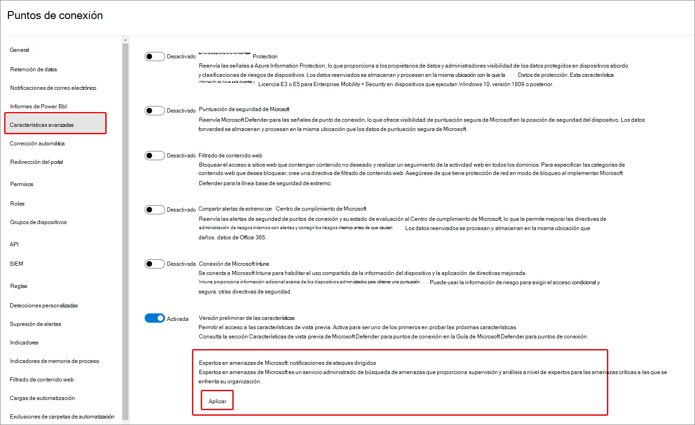
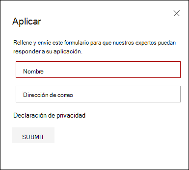
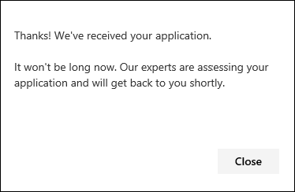
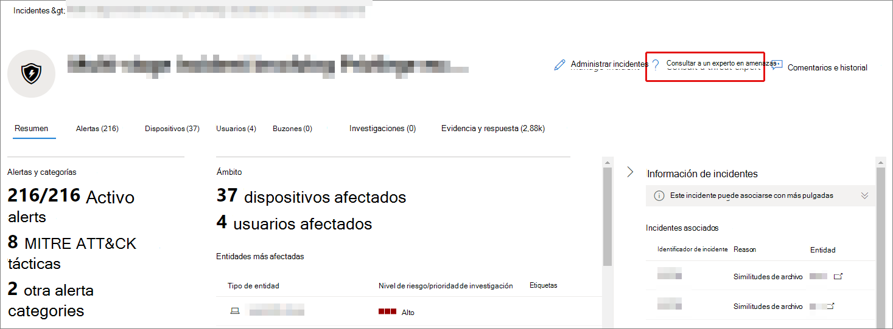
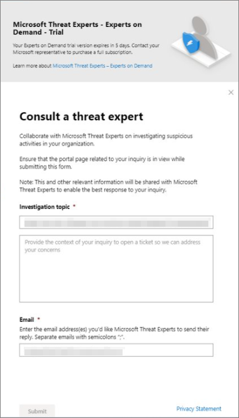

# Configurar y administrar las capacidades de Microsoft Threat Experts a través de Microsoft 365 DefenderConfigure and manage Microsoft Threat Experts capabilities through Microsoft 365 Defender

[!INCLUDE [Microsoft 365 Defender rebranding](../includes/microsoft-defender.md)]

**Se aplica a:****Applies to:**

- [Microsoft 365 DefenderMicrosoft 365 Defender](https://go.microsoft.com/fwlink/?linkid=2118804)
- [Microsoft Defender para punto de conexiónMicrosoft Defender for Endpoint](https://go.microsoft.com/fwlink/p/?linkid=2154037)

[!INCLUDE [Prerelease](../includes/prerelease.md)]

## Antes de empezarBefore you begin

> [!IMPORTANT]
> Antes de aplicar, asegúrese de analizar los requisitos de elegibilidad para el servicio de búsqueda de amenazas administradas de Microsoft Threat Experts – Targeted Attack Notifications con el proveedor de servicios técnicos de Microsoft y el equipo de cuenta.Before you apply, make sure to discuss the eligibility requirements for the Microsoft Threat Experts – Targeted Attack Notifications managed threat hunting service with your Microsoft Technical Service provider and account team.

Para recibir notificaciones de ataque dirigidas, tendrás que implementar Microsoft 365 Defender con dispositivos inscritos.To receive targeted attack notifications, you'll need to have Microsoft 365 Defender deployed with devices enrolled. A continuación, envíe una aplicación a través del portal M365 para Expertos en amenazas de Microsoft: Notificaciones de ataques dirigidos.Then, submit an application through the M365 portal for Microsoft Threat Experts - Targeted Attack Notifications.

Póngase en contacto con su equipo de cuenta o representante de Microsoft para suscribirse a Expertos en amenazas de Microsoft: expertos a petición.Contact your account team or Microsoft representative to subscribe to Microsoft Threat Experts - Experts on Demand. Expertos a petición le permite consultar con nuestros expertos en amenazas sobre cómo proteger su organización de detecciones y adversarias relevantes.Experts on Demand lets you consult with our threat experts on how to protect your organization from relevant detections and adversaries.

## Aplicar para expertos en amenazas de Microsoft: servicio de notificaciones de ataques dirigidosApply for Microsoft Threat Experts - Targeted Attack Notifications service

Si ya tienes Microsoft Defender para Endpoint y Microsoft 365 Defender, puedes solicitar Expertos en amenazas de Microsoft: notificaciones de ataques dirigidos a través de su portal de Microsoft 365 Defender.If you already have Microsoft Defender for Endpoint and Microsoft 365 Defender, you can apply for Microsoft Threat Experts – Targeted Attack Notifications through their Microsoft 365 Defender portal.  Las notificaciones de ataques dirigidos le proporcionan información y análisis especiales que le ayudarán a identificar las amenazas más críticas para su organización, de modo que pueda responder a ellas rápidamente.Targeted attack notifications grant you special insight and analysis to help identify the most critical threats to your organization, so you can respond to them quickly.

1. En el panel de navegación, ve a Configuración > Endpoints > General > Características avanzadas > Expertos en amenazas de Microsoft: Notificaciones **de ataques dirigidos.**From the navigation pane, go to **Settings > Endpoints > General > Advanced features > Microsoft Threat Experts - Targeted Attack Notifications**.

2. Seleccione **Aplicar**.Select **Apply**.

    

3. Escriba su nombre y dirección de correo electrónico para que Microsoft pueda ponerse en contacto con usted sobre su aplicación.Enter your name and email address so that Microsoft can contact you about your application.

    

4. Lea la [declaración de privacidad](https://privacy.microsoft.com/en-us/privacystatement)y, a continuación, seleccione **Enviar** cuando haya terminado.Read the [privacy statement](https://privacy.microsoft.com/en-us/privacystatement), then select **Submit** when you're done. Recibirá un correo electrónico de bienvenida una vez que se apruebe la aplicación.You'll receive a welcome email once your application is approved.

    

5. Después de recibir el correo electrónico de bienvenida, empezarás a recibir automáticamente notificaciones de ataques dirigidos.After you receive your welcome email, you'll automatically start receiving targeted attack notifications.

6. Puede comprobar su estado visitando Configuración > **endpoints > General > Características avanzadas**.You can verify your status by visiting **Settings > Endpoints > General > Advanced features**. Una vez aprobado, el botón de alternancia Expertos en amenazas de **Microsoft-** Notificación de ataque dirigido estará visible y se **activará .**Once approved, the **Microsoft Threat Experts - Targeted Attack Notification** toggle will be visible and switched **On**.

## Dónde verás las notificaciones de ataques dirigidos de expertos en amenazas de MicrosoftWhere you'll see the targeted attack notifications from Microsoft Threat Experts

Puedes recibir una notificación de ataque dirigida de expertos en amenazas de Microsoft a través de los siguientes medios:You can receive targeted attack notification from Microsoft Threat Experts through the following mediums:

- Página incidentes del portal de  Microsoft 365 DefenderThe Microsoft 365 Defender portal's **Incidents** page
- Panel de alertas del portal  de Microsoft 365 DefenderThe Microsoft 365 Defender portal's **Alerts** dashboard
- API de alerta [de](https://docs.microsoft.com/windows/security/threat-protection/microsoft-defender-atp/get-alerts) OData y API de [REST](https://docs.microsoft.com/windows/security/threat-protection/microsoft-defender-atp/pull-alerts-using-rest-api)OData alerting [API](https://docs.microsoft.com/windows/security/threat-protection/microsoft-defender-atp/get-alerts) and [REST API](https://docs.microsoft.com/windows/security/threat-protection/microsoft-defender-atp/pull-alerts-using-rest-api)
- [Tabla DeviceAlertEvents](https://docs.microsoft.com/windows/security/threat-protection/microsoft-defender-atp/advanced-hunting-devicealertevents-table) en búsqueda avanzada[DeviceAlertEvents](https://docs.microsoft.com/windows/security/threat-protection/microsoft-defender-atp/advanced-hunting-devicealertevents-table) table in Advanced hunting
- La bandeja de entrada, si decides enviarte notificaciones de ataque dirigidas por correo electrónico.Your inbox, if you choose to have targeted attack notifications sent to you via email. Consulta [Crear una regla de notificación de correo electrónico a](#create-an-email-notification-rule) continuación.See [Create an email notification rule](#create-an-email-notification-rule) below.

### Crear una regla de notificación de correo electrónicoCreate an email notification rule

Puede crear reglas para enviar notificaciones por correo electrónico para los destinatarios de notificaciones.You can create rules to send email notifications for notification recipients. Para obtener información completa, consulta  [Configurar las notificaciones de alerta para](https://docs.microsoft.com/windows/security/threat-protection/microsoft-defender-atp/configure-email-notifications) crear, editar, eliminar o solucionar problemas de notificación de correo electrónico.For full details, see  [Configure alert notifications](https://docs.microsoft.com/windows/security/threat-protection/microsoft-defender-atp/configure-email-notifications) to create, edit, delete, or troubleshoot email notification.

## Ver notificaciones de ataques dirigidosView targeted attack notifications

Empezarás a recibir una notificación de ataque dirigida de expertos en amenazas de Microsoft en tu correo electrónico después de configurar el sistema para recibir una notificación por correo electrónico.You'll start receiving targeted attack notification from Microsoft Threat Experts in your email after you have configured your system to receive email notification.

1. Seleccione el vínculo del correo electrónico para ir al contexto de alerta correspondiente en el panel etiquetado con **expertos en amenazas.**Select the link in the email to go to the corresponding alert context in the dashboard tagged with **Threat experts**.

2. En la **página** Alertas, seleccione el mismo tema de alerta que el que recibió en el correo electrónico, para ver más detalles.From the **Alerts** page, select the same alert topic as the one you received in the email, to view further details.

## Suscribirse a expertos en amenazas de Microsoft: expertos a peticiónSubscribe to Microsoft Threat Experts - Experts on Demand

Si ya eres cliente de Microsoft Defender para endpoint, puedes ponerse en contacto con tu representante de Microsoft para suscribirte a Expertos en amenazas de Microsoft: expertos a petición.If you're already a Microsoft Defender for Endpoint customer, you can contact your Microsoft representative to subscribe to Microsoft Threat Experts - Experts on Demand.

## Consulte a un experto en amenazas de Microsoft sobre actividades de ciberseguridad sospechosas en su organizaciónConsult a Microsoft threat expert about suspicious cybersecurity activities in your organization

Puede ponerse en contacto con expertos en amenazas de Microsoft desde el portal de Microsoft 365 Defender.You can contact Microsoft Threat Experts from inside the Microsoft 365 Defender portal. Los expertos pueden ayudarle a comprender las amenazas complejas y las notificaciones de ataque dirigidas.Experts can help you understand complex threats and targeted attack notifications. Asociate con expertos para obtener más detalles sobre alertas e incidentes, o consejos sobre cómo controlar el riesgo.Partner with experts for further details about alerts and incidents, or advice on handling compromise. Obtenga información sobre el contexto de inteligencia de amenazas descrito por el panel del portal.Gain insight into the threat intelligence context described by your portal dashboard.

> [!NOTE]
>
> - Actualmente, no se admiten las consultas de alerta relacionadas con los datos de inteligencia de amenazas personalizados de la organización.Alert inquiries related to your organization's customized threat intelligence data are not currently supported. Consulte con el equipo de operaciones de seguridad o respuesta a incidentes para obtener más información.Consult with your security operations or incident response team for details.
> - Debe tener el  permiso Administrar la configuración de seguridad en el Centro de seguridad en el portal de Microsoft 365 Defender para enviar una consulta a través del formulario Consultar **a un** experto en amenazas.You need to have the **Manage security settings in Security Center** permission in the Microsoft 365 Defender portal to submit an inquiry through the **Consult a threat expert** form.

1. Vaya a la página del portal relacionada con la información que le gustaría investigar: por ejemplo, **Device**, **Alert** o **Incident**.Navigate to the portal page related to the information that you'd like to investigate: for example, **Device**, **Alert**, or **Incident**. Asegúrese de que la página del portal relacionada con la consulta esté en vista antes de enviar una solicitud de investigación.Make sure that the portal page related to your inquiry is in view before you send an investigation request.

2. En el menú superior, seleccione **? Consulte a un experto en amenazas**.From the top menu, select **? Consult a threat expert**.

    

    Se abrirá una pantalla desplegable.A flyout screen will open.

    El encabezado indicará si está en una suscripción de prueba o una suscripción completa a Expertos en amenazas de Microsoft: suscripción a petición de expertos.The header will indicate if you are on a trial subscription, or a full Microsoft Threat Experts - Experts on-Demand subscription.

    

    El **campo Tema** investigación ya se rellenará con el vínculo a la página correspondiente para la solicitud.The **Investigation topic** field will already be populated with the link to the relevant page for your request.

3. En el siguiente campo, proporcione información suficiente para proporcionar a los expertos en amenazas de Microsoft suficiente contexto para iniciar la investigación.In the next field, provide enough information to give the Microsoft Threat Experts enough context to start the investigation.

4. Escriba la dirección de correo electrónico que desea usar para que se corresponda con los expertos en amenazas de Microsoft.Enter the email address that you'd like to use to correspond with Microsoft Threat Experts.

> [!NOTE]
> Si desea realizar un seguimiento del estado de los casos de Expertos a petición a través del Centro de servicios de Microsoft, comunicarse con el administrador técnico de cuentas.If you would like to track the status of your Experts on Demand cases through Microsoft Services Hub, reach out to your technical account manager.

Vea este vídeo para obtener una introducción rápida al Centro de servicios de Microsoft.Watch this video for a quick overview of the Microsoft Services Hub.

> [!VIDEO https://www.microsoft.com/videoplayer/embed/RE4pk9f]

## Temas de investigación de ejemploSample investigation topics

### Información de alertaAlert information

- Vimos un nuevo tipo de alerta para un binario vivo fuera de la tierra.We saw a new type of alert for a living-off-the-land binary. Podemos proporcionar el identificador de alerta.We can provide the alert ID. ¿Puede decirnos más acerca de esta alerta y cómo podemos investigarla aún más?Can you tell us more about this alert and how we can investigate it further?
- Hemos observado dos ataques similares, que intentan ejecutar scripts de PowerShell malintencionados pero generan alertas diferentes.We've observed two similar attacks, which both try to execute malicious PowerShell scripts but generate different alerts. Una es "Línea de comandos sospechosa de PowerShell" y la otra es "Se detectó un archivo malintencionado en función de la indicación proporcionada por O365".One is "Suspicious PowerShell command line" and the other is "A malicious file was detected based on indication provided by O365". ¿Cuál es la diferencia?What is the difference?
- Recibimos una alerta impar hoy sobre un número anormal de inicios de sesión con errores desde el dispositivo de un usuario de perfil alto.We received an odd alert today about an abnormal number of failed logins from a high profile user’s device. No podemos encontrar más pruebas para estos intentos.We can't find any further evidence for these attempts. ¿Cómo puede Microsoft 365 Defender ver estos intentos?How can Microsoft 365 Defender see these attempts? ¿Qué tipo de inicios de sesión se están supervisando?What type of logins are being monitored?
- ¿Puede dar más contexto o información sobre la alerta: "Se observó un comportamiento sospechoso por parte de una utilidad del sistema"?Can you give more context or insight about the alert, "Suspicious behavior by a system utility was observed"?
- Observé una alerta titulada "Creación de reglas de reenvío/redireccionamiento".I observed an alert titled "Creation of forwarding/redirect rule". Creo que la actividad es benigna.I believe the activity is benign. ¿Me puede decir por qué recibí una alerta?Can you tell me why I received an alert?

### Posible peligro de máquinaPossible machine compromise

- ¿Puede explicar por qué vemos un mensaje o alerta de "Proceso desconocido observado" en muchos dispositivos de nuestra organización?Can you help explain why we see a message or alert for "Unknown process observed" on many devices in our organization? Agradecemos cualquier entrada para aclarar si este mensaje o alerta está relacionado con actividad malintencionada.We appreciate any input to clarify whether this message or alert is related to malicious activity.
- ¿Puede ayudar a validar un posible compromiso en el siguiente sistema, que data de la semana pasada?Can you help validate a possible compromise on the following system, dating from last week? Se comporta de forma similar a una detección de malware anterior en el mismo sistema hace seis meses.It's behaving similarly as a previous malware detection on the same system six months ago.

### Detalles de inteligencia de amenazasThreat intelligence details

- Se detectó un correo electrónico de suplantación de identidad (phishing) que entregaba un documento malintencionado de Word a un usuario.We detected a phishing email that delivered a malicious Word document to a user. El documento provocó una serie de eventos sospechosos, que desencadenaron varias alertas para una familia de malware determinada.The document caused a series of suspicious events, which triggered multiple alerts for a particular malware family. ¿Tiene información sobre este malware?Do you have any information on this malware? Si es así, ¿puede enviarnos un vínculo?If yes, can you send us a link?
- Recientemente vimos una entrada de blog sobre una amenaza dirigida a nuestra industria.We recently saw a blog post about a threat that is targeting our industry. ¿Puede ayudarnos a comprender qué protección proporciona Microsoft 365 Defender contra este actor de amenazas?Can you help us understand what protection Microsoft 365 Defender provides against this threat actor?
- Recientemente hemos observado una campaña de suplantación de identidad realizada en nuestra organización.We recently observed a phishing campaign conducted against our organization. ¿Puede decirnos si se ha dirigido específicamente a nuestra empresa o vertical?Can you tell us if this was targeted specifically to our company or vertical?

### Comunicaciones de alerta de expertos en amenazas de MicrosoftMicrosoft Threat Experts’ alert communications

- ¿Puede su equipo de respuesta a incidentes ayudarnos a solucionar la notificación de ataque dirigida que tenemos?Can your incident response team help us address the targeted attack notification that we got?
- Recibimos esta notificación de ataque dirigido por parte de expertos en amenazas de Microsoft.We received this targeted attack notification from Microsoft Threat Experts. No tenemos nuestro propio equipo de respuesta a incidentes.We don’t have our own incident response team. ¿Qué podemos hacer ahora y cómo podemos contener el incidente?What can we do now, and how can we contain the incident?
- Hemos recibido una notificación de ataque dirigida de expertos en amenazas de Microsoft.We received a targeted attack notification from Microsoft Threat Experts. ¿Qué datos nos puede proporcionar que podamos transmitir a nuestro equipo de respuesta a incidentes?What data can you provide to us that we can pass on to our incident response team?

> [!NOTE]
> Microsoft Threat Experts es un servicio administrado de búsqueda de amenazas y no un servicio de respuesta a incidentes.Microsoft Threat Experts is a managed threat hunting service and not an incident response service. Sin embargo, los expertos pueden realizar una transición sin problemas de la investigación a los servicios del Equipo de detección y respuesta (DART) de Microsoft Cybersecurity Solutions Group (CSG), cuando sea necesario.However, the experts can seamlessly transition the investigation to Microsoft Cybersecurity Solutions Group (CSG)'s Detection and Response Team (DART) services, when necessary. También puede optar por interactuar con su propio equipo de respuesta a incidentes para solucionar problemas que requieren una respuesta a incidentes.You can also opt to engage with your own incident response team to address issues that requires an incident response.

## EscenarioScenario

### Recibir un informe de progreso sobre la consulta de búsqueda administradaReceive a progress report about your managed hunting inquiry

La respuesta de los expertos en amenazas de Microsoft variará según la consulta.The response from Microsoft Threat Experts will vary according to your inquiry. Por lo general, recibirá una de las siguientes respuestas:You'll generally receive one of the following responses:

- Se necesita más información para continuar con la investigaciónMore information is needed to continue with the investigation
- Se necesita un archivo o varios ejemplos de archivos para determinar el contexto técnicoA file or several file samples are needed to determine the technical context
- La investigación requiere más tiempoInvestigation requires more time
- La información inicial era suficiente para concluir la investigaciónInitial information was enough to conclude the investigation

Si un experto solicita más información o muestras de archivos, es fundamental responder rápidamente para mantener la investigación en movimiento.If an expert requests more information or file samples, it's crucial to respond quickly to keep the investigation moving.

## Vea tambiénSee also

- [Información general sobre Expertos en amenazas de MicrosoftMicrosoft Threat Experts overview](microsoft-threat-experts.md)
