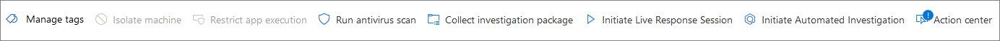
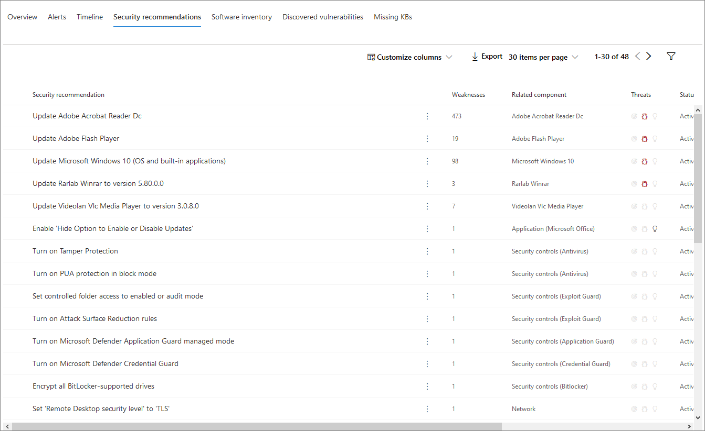

# Página de Perfil de dispositivoDevice profile page

El portal de seguridad 365 de Microsoft proporciona páginas de Perfil de dispositivo para que pueda evaluar rápidamente el estado y el estado de los dispositivos de la red.The Microsoft 365 security portal provides you with device profile pages, so you can quickly assess the health and status of devices on your network.

> [!IMPORTANT]
> La página de Perfil de dispositivo puede aparecer ligeramente diferente en función de si el dispositivo está inscrito en ATP de Microsoft defender, en ATP de Azure o en ambas.The device profile page may appear slightly different, depending on whether the device is enrolled in Microsoft Defender ATP, Azure ATP, or both.

Si el dispositivo está inscrito en ATP de Microsoft defender, también puede usar la página Perfil de dispositivo para realizar algunas tareas de seguridad comunes.If the device is enrolled in Microsoft Defender ATP, you can also use the device profile page to perform some common security tasks.

## Navegación por la página de Perfil de dispositivoNavigating the device profile page

La página de perfil se divide en varias secciones generales.The profile page is broken up into several broad sections.

La barra lateral (1) enumera los detalles básicos sobre el dispositivo.The sidebar (1) lists basic details about the device.

El área de contenido principal (2) contiene pestañas que se pueden alternar para ver distintos tipos de información sobre el dispositivo.The main content area (2) contains tabs that you can toggle through to view different kinds of information about the device.

Si el dispositivo está inscrito en ATP de Microsoft defender, también verá una lista de acciones de respuesta (3).If the device is enrolled in Microsoft Defender ATP, you will also see a list of response actions (3). Las acciones de respuesta le permiten realizar tareas comunes relacionadas con la seguridad.Response actions allow you to perform common security-related tasks.

## -Sidebar

Junto al área de contenido principal de la página de perfil del dispositivo se encuentra la barra lateral.Beside the main content area of the device profile page is the sidebar.

La barra lateral muestra el nombre completo y el nivel de exposición del dispositivo.The sidebar lists the device's full name and exposure level. También se proporciona información básica importante en subsecciones pequeñas que se pueden alternar abiertas o cerradas, por ejemplo:It also provides some important basic information in small subsections which can be toggled open or closed, such as:

* **Etiquetas** : cualquier ATP de Microsoft defender, ATP de Azure o etiquetas personalizadas asociadas con el dispositivo.**Tags** - Any Microsoft Defender ATP, Azure ATP, or custom tags associated with the device. Las etiquetas de Azure ATP no se pueden editar.Tags from Azure ATP are not editable.
* **Información de seguridad** : incidentes abiertos y alertas activas.**Security info** - Open incidents and active alerts. Los dispositivos inscritos en ATP de Microsoft defender también mostrarán el nivel de exposición y el nivel de riesgo.Devices enrolled in Microsoft Defender ATP will also display exposure level and risk level.

> [!TIP]
> El nivel de exposición está relacionado con la medida en que el dispositivo cumple con las recomendaciones de seguridad, mientras que el nivel de riesgo se calcula en función de una serie de factores, incluidos los tipos y la gravedad de las alertas activas.Exposure level relates to how much the device is complying with security recommendations, while risk level is calculated based on a number of factors, including the types and severity of active alerts.

* **Detalles del dispositivo** : dominio, so, marca de tiempo para cuando se ha visto el dispositivo por primera vez, direcciones IP y recursos.**Device details** - Domain, OS, timestamp for when the device was first seen, IP addresses, resources. Los dispositivos inscritos en Microsoft defender ATP también muestran el estado de mantenimiento.Devices enrolled in Microsoft Defender ATP also display health state. Los dispositivos inscritos en ATP de Azure mostrarán el nombre SAM y una marca de hora para cuando se creó el dispositivo por primera vez.Devices enrolled in Azure ATP will display SAM name and a timestamp for when the device was first created.
* **Actividad de red** : marcas de tiempo para la primera y última vez que el dispositivo se ve en la red.**Network activity** - Timestamps for the first time and last time the device was seen on the network.
* **Datos del directorio** (*solo para dispositivos inscritos en ATP de Azure*): marcas [UAC](https://docs.microsoft.com/windows/security/identity-protection/user-account-control/user-account-control-overview) , [SPN](https://docs.microsoft.com/windows/win32/ad/service-principal-names)y pertenencias a grupos.**Directory data** (*only for devices enrolled in Azure ATP*) - [UAC](https://docs.microsoft.com/windows/security/identity-protection/user-account-control/user-account-control-overview) flags, [SPNs](https://docs.microsoft.com/windows/win32/ad/service-principal-names), and group memberships.

## Acciones de respuestaResponse actions

Las acciones de respuesta ofrecen una forma rápida de defenderse y analizar las amenazas.Response actions offer a quick way to defend against and analyze threats.

> [!IMPORTANT]
> * [Las acciones de respuesta](https://docs.microsoft.com/windows/security/threat-protection/microsoft-defender-atp/respond-machine-alerts) solo están disponibles si el dispositivo está inscrito en ATP de Microsoft defender.[Response actions](https://docs.microsoft.com/windows/security/threat-protection/microsoft-defender-atp/respond-machine-alerts) are only available if the device is enrolled in Microsoft Defender ATP.
> * Los dispositivos inscritos en ATP de Microsoft defender pueden mostrar diferentes números de acciones de respuesta según el sistema operativo del dispositivo y el número de versión.Devices that are enrolled in Microsoft Defender ATP may display different numbers of response actions, based on the device's OS and version number.

Las acciones disponibles en la página de Perfil de dispositivo incluyen:Actions available on the device profile page include:

* **Administrar etiquetas** : actualiza las etiquetas personalizadas que hayas aplicado a este dispositivo.**Manage tags** - Updates custom tags you have applied to this device.
* **Aislar dispositivo** : aísla el dispositivo de la red de su organización y conserva la conexión con la protección contra amenazas avanzada de Microsoft defender.**Isolate device** - Isolates the device from your organization's network while keeping it connected to Microsoft Defender Advanced Threat Protection. Puede elegir permitir que se ejecuten Outlook, Teams y Skype empresarial mientras el dispositivo está aislado, con fines de comunicación.You can choose to allow Outlook, Teams, and Skype for Business to run while the device is isolated, for communication purposes.
* **Centro de actividades** : ver el estado de las acciones enviadas.**Action center** - View the status of submitted actions. Solo está disponible si ya se ha seleccionado otra acción.Only available if another action has already been selected.
* **Restringir la ejecución** de la aplicación: evita que se ejecuten las aplicaciones que Microsoft no ha firmado.**Restrict app execution** - Prevents applications that are not signed by Microsoft from running.
* **Ejecutar detección de virus** : actualiza las definiciones de antivirus de Windows Defender y ejecuta inmediatamente un examen de antivirus.**Run antivirus scan** - Updates Windows Defender Antivirus definitions and immediately runs an antivirus scan. Elija entre análisis rápido o análisis completo.Choose between Quick scan or Full scan.
* **Recopilar el paquete de investigación** : recopila información sobre el dispositivo.**Collect investigation package** - Gathers information about the device. Una vez completada la investigación, puede descargarla.When the investigation is completed, you can download it.
* **Iniciar sesión de respuesta activa** : carga un shell remoto en el dispositivo para [investigaciones de seguridad en profundidad](https://docs.microsoft.com/windows/security/threat-protection/microsoft-defender-atp/live-response).**Initiate Live Response Session** - Loads a remote shell on the device for [in-depth security investigations](https://docs.microsoft.com/windows/security/threat-protection/microsoft-defender-atp/live-response).
* **Iniciar investigación automatizada** : [investiga y corrige](https://docs.microsoft.com/microsoft-365/security/office-365-security/office-365-air)automáticamente las amenazas.**Initiate automated investigation** - Automatically [investigates and remediates threats](https://docs.microsoft.com/microsoft-365/security/office-365-security/office-365-air). Aunque puede desencadenar de forma manual investigaciones automáticas para que se ejecuten desde esta página, [algunas directivas de alertas](https://docs.microsoft.com/microsoft-365/compliance/alert-policies?view=o365-worldwide#default-alert-policies) desencadenan investigaciones automáticas por su cuenta.Although you can manually trigger automated investigations to run from this page, [certain alert policies](https://docs.microsoft.com/microsoft-365/compliance/alert-policies?view=o365-worldwide#default-alert-policies) trigger automatic investigations on their own.
* **Centro de actividades** : muestra información sobre las acciones de respuesta que se están ejecutando actualmente.**Action center** - Displays information about any response actions that are currently running.

## Sección TabulacionesTabs section

Las fichas de Perfil de dispositivo permiten alternar entre una introducción a los detalles de seguridad del dispositivo y las tablas que contienen una lista de alertas.The device profile tabs allow you to toggle through an overview of security details about the device, and tables containing a list of alerts.

Los dispositivos inscritos en ATP de Microsoft defender también mostrarán pestañas que incluyen una escala de tiempo, una lista de recomendaciones de seguridad, un inventario de software, una lista de vulnerabilidades descubiertas y los KB (actualizaciones de seguridad) que faltan.Devices enrolled in Microsoft Defender ATP will also display tabs that feature a timeline, a list of security recommendations, a software inventory, a list of discovered vulnerabilities, and missing KBs (security updates).

### Ficha Información generalOverview tab

La pestaña predeterminada es **información general**.The default tab is **Overview**. Proporciona una visión rápida del hecho de seguridad más importante sobre el dispositivo.It provides a quick look at the most important security fact about the device.

Aquí puede ver rápidamente las alertas activas del dispositivo y cualquier usuario que haya iniciado sesión en ese momento.Here, you can get a quick look at the device's active alerts, and any currently logged on users.

Si el dispositivo está inscrito en ATP de Microsoft defender, también verá el nivel de riesgo del dispositivo y los datos disponibles en las evaluaciones de seguridad.If the device is enrolled in Microsoft Defender ATP, you will also see the device's risk level and any available data on security assessments. Las evaluaciones de seguridad describen el nivel de exposición del dispositivo, proporcionan recomendaciones de seguridad y enumeran el software afectado y las vulnerabilidades detectadas.The security assessments describe the device's exposure level, provide security recommendations, and list affected software and discovered vulnerabilities.

### Ficha AlertasAlerts tab

La pestaña **alertas** contiene una lista de las alertas que se han generado en el dispositivo, tanto de ATP de Azure como de ATP de Microsoft defender.The **Alerts** tab contains a list of alerts that have been raised on the device, from both Azure ATP and Microsoft Defender ATP.

Puede personalizar el número de elementos mostrados, así como qué columnas se muestran para cada elemento.You can customize the number of items displayed, as well as which columns are displayed for each item. El comportamiento predeterminado es enumerar treinta elementos por página.The default behavior is to list thirty items per page.

Las columnas de esta pestaña incluyen información sobre la gravedad de la amenaza que desencadenó la alerta, así como el estado, el estado de investigación y a quién se ha asignado la alerta.The columns in this tab include information on the severity of the threat that triggered the alert, as well as status, investigation state, and who the alert has been assigned to.

La columna *entidades afectadas* se refiere al dispositivo (entidad) cuyo perfil está viendo actualmente, además de otros dispositivos de la red que se ven afectados.The *impacted entities* column refers to the device (entity) whose profile you are currently viewing, plus any other devices in your network that are affected.

Al seleccionar un elemento de esta lista, se abrirá un control flotante que contiene todavía más información sobre la alerta seleccionada.Selecting an item from this list will open a flyout containing even more information about the selected alert.

Esta lista se puede filtrar por gravedad, estado o a quién se ha asignado la alerta.This list can be filtered by severity, status, or who the alert has been assigned to.

### Ficha escala de tiempoTimeline tab

La ficha **escala de tiempo** incluye un gráfico cronológico interactivo de todos los eventos que se producen en el dispositivo.The **Timeline** tab includes an interactive, chronological chart of all events raised on the device. Moviendo el área resaltada del gráfico a la izquierda o a la derecha, puede ver los eventos durante distintos períodos de tiempo.By moving the highlighted area of the chart left or right, you can view events over different periods of time. También puede elegir un intervalo de fechas personalizado en el menú desplegable entre el gráfico interactivo y la lista de eventos.You can also choose a custom range of dates from the dropdown menu in between the interactive chart and the list of events.

Debajo del gráfico hay una lista de eventos para el intervalo de fechas seleccionado.Below the chart is a list of events for the selected range of dates.

El número de elementos mostrados y las columnas de la lista se pueden personalizar.The number of items displayed and the columns on the list can both be customized. Las columnas predeterminadas muestran el tiempo del evento, el usuario activo, el tipo de acción, las entidades (procesos) y la información adicional sobre el evento.The default columns list the event time, active user, action type, entities (processes), and additional information about the event.

Al seleccionar un elemento de esta lista, se abrirá un control flotante que muestra un gráfico de entidades de evento, donde se muestran los procesos primarios y secundarios implicados en el evento.Selecting an item from this list will open a flyout displaying an Event entities graph, showing the parent and child processes involved in the event.

La lista se puede filtrar por el tipo específico de evento; por ejemplo, eventos de registro o eventos de pantalla inteligente.The list can be filtered by the specific kind of event; for example, Registry events or Smart Screen Events.

La lista también se puede exportar a un archivo CSV, para su descarga.The list can also be exported to a CSV file, for download. Aunque el archivo no está limitado por el número de eventos, el intervalo de tiempo máximo que puede elegir para exportar es de siete días.Although the file is not limited by number of events, the maximum time range you can choose to export is seven days.

### Ficha recomendaciones de seguridadSecurity recommendations tab

La ficha **recomendaciones de seguridad** enumera las acciones que puede realizar para proteger el dispositivo.The **Security recommendations** tab lists actions you can take to protect the device. Al seleccionar un elemento de esta lista, se abrirá un control flotante donde puede obtener instrucciones sobre cómo aplicar la recomendación.Selecting an item on this list will open a flyout where you can get instructions on how to apply the recommendation.

Como en las pestañas anteriores, el número de elementos que se muestran por página, así como las columnas que están visibles, se pueden personalizar.As with the previous tabs, the number of items displayed per page, as well as which columns are visible, can be customized.

La vista predeterminada incluye columnas que detallan las debilidades de seguridad tratadas, la amenaza asociada, el componente o software relacionado con la amenaza, entre otros.The default view includes columns that detail the security weaknesses addressed, the associated threat, the related component or software affected by the threat, and more. Los elementos se pueden filtrar por el estado de la recomendación.Items can be filtered by the recommendation's status.

### Inventario de softwareSoftware inventory

La ficha **inventario de software** enumera el software instalado en el dispositivo.The **Software inventory** tab lists software installed on the device.

La vista predeterminada muestra el proveedor de software, el número de versión instalado, el número de debilidades de software conocidos, la información sobre amenazas, el código de producto y las etiquetas.The default view displays the software vendor, installed version number, number of known software weaknesses, threat insights, product code, and tags. El número de elementos mostrados y las columnas que se muestran pueden personalizarse.The number of items displayed and which columns are displayed can both be customized.

Al seleccionar un elemento de esta lista, se abre un control flotante que contiene más detalles sobre el software seleccionado, así como la ruta de acceso y la marca de tiempo de la última vez que se encontró el software.Selecting an item from this list opens a flyout containing more details about the selected software, as well as the path and timestamp for the last time the software was found.

Esta lista se puede filtrar por código de producto.This list can be filtered by product code.

### Ficha vulnerabilidades detectadasDiscovered vulnerabilities tab

En la ficha **vulnerabilidades detectadas** se muestran las vulnerabilidades y los puntos débiles comunes (CVE) que pueden afectar al dispositivo.The **Discovered vulnerabilities** tab lists any Common Vulnerabilities and Exploits (CVEs) that may affect the device.

La vista predeterminada muestra la gravedad de CVE, la puntuación de vulnerabilidad común (CVS), el software relacionado con el CVE, Cuándo se publicó el CVE, Cuándo se actualizó por última vez el CVE y las amenazas asociadas con el CVE.The default view lists the severity of the CVE, the Common Vulnerability Score (CVS), the software related to the CVE, when the CVE was published, when the CVE was last updated, and threats associated with the CVE.

Como en las pestañas anteriores, se puede personalizar el número de elementos que se muestran y las columnas que son visibles.As with the previous tabs, the number of items displayed and which columns are visible can be customized.

Al seleccionar un elemento de esta lista, se abrirá un control flotante que describe el CVE.Selecting an item from this list will open a flyout that describes the CVE.

### KB faltantesMissing KBs

La ficha **KB que falta** muestra una lista de las actualizaciones de Microsoft que aún no se han aplicado al dispositivo.The **Missing KBs** tab lists any Microsoft Updates that have yet to be applied to the device. Los "KB" en cuestión son [artículos de Knowledge Base](https://support.microsoft.com/help/242450/how-to-query-the-microsoft-knowledge-base-by-using-keywords-and-query) que describen estas actualizaciones; por ejemplo, [KB4551762](https://support.microsoft.com/help/4551762/windows-10-update-kb4551762).The "KBs" in question are [Knowledge Base articles](https://support.microsoft.com/help/242450/how-to-query-the-microsoft-knowledge-base-by-using-keywords-and-query) which describe these updates; for example, [KB4551762](https://support.microsoft.com/help/4551762/windows-10-update-kb4551762).

La vista predeterminada enumera el boletín que contiene las actualizaciones, la versión del sistema operativo, los productos afectados, CVE dirección, el número de KB y las etiquetas.The default view lists the bulletin containing the updates, OS version, products affected, CVEs addressed, the KB number, and tags.

Se puede personalizar el número de elementos que se muestran por página y qué columnas se muestran.The number of items displayed per page and which columns are displayed can be customized.

Al seleccionar un elemento, se abrirá un control flotante que se vincula a la actualización.Selecting an item will open a flyout that links to the update.

## Temas relacionadosRelated topics

* [Introducción a la Protección contra amenazas de MicrosoftMicrosoft Threat Protection overview](microsoft-threat-protection.md)
* [Habilitar la Protección contra amenazas de MicrosoftTurn on Microsoft Threat Protection](mtp-enable.md)
* [Investigar entidades en dispositivos usando la respuesta activaInvestigate entities on devices, using live response](https://docs.microsoft.com/windows/security/threat-protection/microsoft-defender-atp/live-response)
* [Investigación y respuesta automatizadas (AIR) en Office 365Automated investigation and response (AIR) in Office 365](https://docs.microsoft.com/microsoft-365/security/office-365-security/office-365-air)
