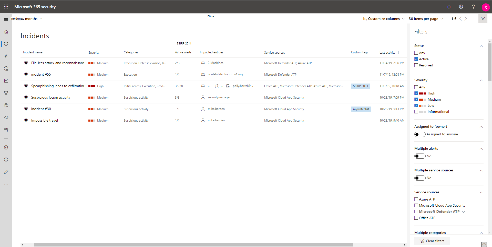

# Priorizar incidentes en Microsoft 365 defenderPrioritize incidents in Microsoft 365 Defender

[!INCLUDE [Microsoft 365 Defender rebranding](../includes/microsoft-defender.md)]

**Se aplica a:****Applies to:**
- Microsoft 365 defenderMicrosoft 365 Defender

Microsoft 365 defender aplica análisis de correlación y agrega todas las alertas y investigaciones relacionadas de distintos productos en un incidente.Microsoft 365 Defender applies correlation analytics and aggregates all related alerts and investigations from different products into one incident. Microsoft 365 defender también desencadena alertas únicas en actividades que solo se pueden identificar como malintencionadas dado la visibilidad de un extremo a otro que Microsoft 365 defender tiene en toda la población y en el conjunto de productos.Microsoft 365 Defender also triggers unique alerts on activities that can only be identified as malicious given the end-to-end visibility that Microsoft 365 Defender has across the entire estate and suite of products. Al hacerlo, Microsoft 365 defender narra la historia de ataque más amplio, lo que permite a un analista de operaciones de seguridad comprender y tratar amenazas complejas en toda la organización.By doing so, Microsoft 365 Defender narrates the broader attack story, allowing a security operations analyst to understand and deal with complex threats across the organization.

La **cola de incidentes** muestra un conjunto de incidentes que se han marcado desde diferentes dispositivos, usuarios y buzones de correo.The **Incidents queue** shows a collection of incidents that were flagged from across devices, users, and mailboxes. Le ayuda a ordenar los incidentes para asignar prioridades y crear una decisión de respuesta de ciberseguridad fundamentada.It helps you sort through incidents to prioritize and create an informed cybersecurity response decision.

 

De forma predeterminada, la cola del centro de seguridad 365 de Microsoft muestra los incidentes que se han visto en los últimos 30 días.By default, the queue in the Microsoft 365 security center displays incidents seen in the last 30 days. El incidente más reciente se encuentra en la parte superior de la lista, por lo que puede verlo primero.The most recent incident is at the top of the list so you can see it first.

La cola de incidentes expone columnas personalizables que le proporcionan visibilidad en diferentes características del incidente o las entidades que contiene.The incident queue exposes customizable columns that give you visibility into different characteristics of the incident or the contained entities. Esto le ayudará a tomar una decisión informada sobre la priorización de incidentes para controlar.This helps you make an informed decision regarding prioritization of incidents to handle.

Para obtener más visibilidad de un vistazo, la denominación automática de incidentes genera nombres de incidente en función de atributos de alerta, como el número de puntos de conexión afectados, los usuarios afectados, los orígenes de detección o las categorías.For additional visibility at a glance, automatic incident naming generates incident names based on alert attributes such as the number of endpoints affected, users affected, detection sources, or categories. Esto le permite comprender rápidamente el ámbito del incidente.This allows you to quickly understand the scope of the incident.

Por ejemplo: *incidente de varias fases en varios puntos de conexión que han sido notificados por varios orígenes.*For example: *Multi-stage incident on multiple endpoints reported by multiple sources.*

> [!NOTE]
> Los incidentes que existían antes de la implementación de la asignación automática de nombres de incidentes no tendrán su nombre cambiado.Incidents that existed prior the rollout of automatic incident naming will not have their name changed.

La cola de incidentes también expone varias opciones de filtrado, que cuando se aplican, le permiten realizar un amplio barrido de todos los incidentes existentes en su entorno o decidir centrarse en un escenario o amenaza específicos.The incident queue also exposes multiple filtering options, that when applied, enable you to perform a broad sweep of all existing incidents in your environment, or decide to focus on a specific scenario or threat. Aplicar filtros en la cola de incidentes puede ayudar a determinar qué incidente requiere atención inmediata.Applying filters on the incident queue can help determine which incident requires immediate attention. 

## Filtros disponiblesAvailable filters

### Asignado aAssigned to
Puede elegir mostrar las alertas que están asignadas a usted o a las administradas por automatización.You can choose to show alerts that are assigned to you or those handled by automation.

### CategoríasCategories
Elija categorías para centrarse en tácticas, técnicas o componentes de ataque específicos que se ven.Choose categories to focus on specific tactics, techniques, or attack components seen. 

### ClasificaciónClassification
Filtre las incidencias según las clasificaciones establecidas de las alertas relacionadas.Filter incidents based on the set classifications of the related alerts. Los valores incluyen alertas verdaderas, falsas alertas o no establecidas.The values include true alerts, false alerts, or not set.

### Confidencialidad de datosData sensitivity
Algunos ataques tienen por objetivo extraer datos confidenciales o importantes.Some attacks focus on targeting to exfiltrate sensitive or valuable data. Al aplicar un filtro para ver si hay datos confidenciales implicados en el incidente, puede determinar rápidamente si la información confidencial se ha visto comprometida y así dar prioridad a estos incidentes.By applying a filter to see if sensitive data is involved in the incident, you can quickly determine if sensitive information has potentially been compromised and prioritize addressing those incidents.

>[!NOTE]
>Solo se aplica si se ha activado Microsoft Information Protection. Only applicable if Microsoft Information Protection is turned on.

### Grupo de dispositivosDevice group
Filtra por grupos de dispositivos definidos.Filter by defined device groups.

### Estado de investigaciónInvestigation state
Filtrar incidentes por el estado de la investigación automatizada.Filter incidents by the status of automated investigation. 

### Varias categoríasMultiple categories 
Puede elegir ver solo los incidentes que se han asignado a varias categorías y, por lo tanto, puede causar más daño.You can choose to see only incidents that have mapped to multiple categories  and can thus potentially cause more damage. 

### Múltiples orígenes del servicioMultiple service sources 
Filtrar solo para ver incidentes que contengan alertas de diferentes orígenes (Microsoft defender para extremo, Microsoft Cloud App Security, Microsoft defender para identidad, Microsoft defender para Office 365).Filter to only see incidents that contain alerts from different sources (Microsoft Defender for Endpoint, Microsoft Cloud App Security, Microsoft Defender for Identity, Microsoft Defender for Office 365).

### Plataforma de sistema operativoOS platform
Limitar la vista de cola de incidentes por sistema operativo.Limit the incident queue view by operating system.

### Orígenes del servicioService sources
Al elegir un origen específico, puede concentrarse en los incidentes que contienen al menos una alerta del origen seleccionado.By choosing a specific source, you can focus on incidents that contain at least one alert from that chosen source. 

### SeveritySeverity
La gravedad de un incidente indica el impacto que puede tener en los activos.The severity of an incident is indicative of the impact it can have on your assets. Cuanto mayor sea la gravedad, mayor será el impacto y, por lo general, se requerirá la atención más inmediata.The higher the severity, the bigger the impact and typically requires the most immediate attention. 

### EstadoStatus
Puede limitar la lista de incidentes que se muestra en función de su estado para ver cuáles están activos o resueltos.You can choose to limit the list of incidents shown based on their status to see which ones are active or resolved.

>[!IMPORTANT]
>Los filtros de clasificación, grupo de dispositivos, estado de investigación y plataforma de SO solo están disponibles actualmente en la versión preliminar pública.The Classification, Device group, Investigation state, and OS platform filters are currently only available in public preview.

## Siguientes pasosNext steps
Una vez que haya determinado qué incidente tiene mayor prioridad, puede seguir investigando.After you've determined which incident requires the highest priority, you can proceed to do further investigative work on an incident.
- [Investigar incidentesInvestigate incidents](investigate-incidents.md)

## Recursos adicionalesSee also
- [Información general sobre incidentesIncidents overview](incidents-overview.md)
- [Investigar incidentesInvestigate incidents](investigate-incidents.md)
- [Administrar incidentesManage incidents](manage-incidents.md)
