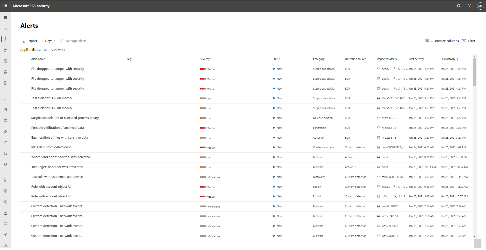

# Investigar alertas en Microsoft 365 Defender

[!INCLUDE [Microsoft 365 Defender rebranding](../includes/microsoft-defender.md)]

**Se aplica a:**
- Microsoft 365 Defender

[!INCLUDE [Prerelease](../includes/prerelease.md)]

Las alertas son la base de todos los incidentes e indican la aparición de eventos malintencionados o sospechosos en su entorno. Las alertas suelen formar parte de un ataque más amplio y proporcionan fragmentos de pistas sobre un incidente.

En Microsoft 365 Defender, las alertas relacionadas se agregan juntas para formar incidentes. Los incidentes siempre proporcionarán el contexto más amplio de un ataque, pero la investigación de alertas puede ser valiosa cuando se requiere un análisis más profundo. 

## Uso de páginas de alerta en investigaciones

En la pestaña Alertas de cualquier página de incidentes, la selección de una alerta le lleva a las páginas de alerta individuales. Una página de alerta se compone de tres secciones: activos afectados, artículo de alerta y el panel de detalles.

A lo largo de una página de alerta, puede seleccionar el icono de tres puntos (**...**) junto a cualquier entidad para que pueda ver acciones disponibles como abrir la página de activos específica o realizar pasos de corrección específicos.

### Analizar activos afectados
La sección activos afectados enumera buzones, dispositivos y usuarios afectados por esta alerta. Al seleccionar cualquiera de las tarjetas de activos, se rellena el panel lateral de detalles con información, incluidas otras alertas que se produjeron relacionadas con los activos, si las hubiera.

### Seguimiento del rol de una alerta en el artículo de alerta
El artículo de alerta muestra todos los activos o entidades relacionados con la alerta en una vista de árbol de proceso. La alerta del título es la que está en foco cuando se aterriza por primera vez en la página de la alerta seleccionada. Los activos del artículo de alerta se pueden expandir y hacer clic. Proporcionan información adicional y aceleran la respuesta, ya que permiten realizar acciones directamente en el contexto de la página de alerta. 

> [!NOTE]
> La sección de artículo de alerta puede contener más de una alerta, con alertas adicionales relacionadas con el mismo árbol de ejecución que aparecen antes o después de la alerta seleccionada.

### Ver más información de alerta en el panel de detalles

El panel de detalles muestra los detalles de la alerta seleccionada al principio, con detalles y acciones relacionadas con ella. Si selecciona cualquiera de los activos o entidades afectados en el artículo de alerta, el panel de detalles cambia para proporcionar información contextual y acciones para el objeto seleccionado.

Una vez que haya seleccionado una entidad de interés, el panel de detalles cambia para mostrar información sobre el tipo de entidad seleccionada, información histórica cuando está disponible y opciones para realizar acciones en esta entidad directamente desde la página de alerta.

### Administrar alertas

Una vez que haya terminado de investigar las alertas, puede volver a la alerta con la que empezó, marcar el estado de la alerta como Resuelto y clasificarla como alerta False o Alerta True. Clasificar alertas ayuda a ajustar el producto para proporcionar alertas más verdaderas y menos falsas.

> [!NOTE]
> Una forma de administrar alertas mediante el uso de etiquetas. La funcionalidad de etiquetado de Microsoft Defender para Office 365 se está implantando de forma incremental y se encuentra actualmente en versión preliminar.  
> Actualmente, los nombres de etiqueta modificados solo se aplican a las alertas *creadas después de* la actualización. Las alertas que se generaron antes de la modificación no reflejarán el nombre de la etiqueta actualizada. 

## Administrar la cola de alertas unificada

Al seleccionar Alertas en Incidentes & alertas en el panel de navegación del centro de seguridad de Microsoft 365, se llega a la cola de alertas unificada. Las alertas de diferentes soluciones de seguridad de Microsoft como Microsoft Defender para endpoint, Microsoft Defender para Office 365 y Microsoft 365 Defender aparecen en esta sección. 

La cola De alertas muestra una lista de alertas que se marcaron en la red. De forma predeterminada, la cola muestra alertas vistas en los últimos 30 días. Las alertas más recientes se muestran en la parte superior de la lista, lo que le ayudará a ver primero las alertas más recientes.

> [!NOTE]
> En el momento del inicio, la cola de alertas unificadas solo tendrá 7 días de alertas de Microsoft Defender para Office 365 disponibles. La cola seguirá compilando con el tiempo. Si necesita realizar una triage alerts antes del inicio de la cola de alertas unificadas, use la cola de alertas en el [Centro de seguridad y cumplimiento](https://protection.office.com/viewalerts).

En la navegación superior, puede:

- Aplicar filtros
- Personalizar columnas para agregar o quitar columnas
- Exportar datos

También puede filtrar alertas según diferentes criterios:

- Severity
- Estado
- Categoría
- Origen de detección
- Policy
- Activos afectados
- Primera actividad
- Última actividad

Para iniciar una investigación sobre un incidente, lea [Investigar incidentes en Microsoft 365 Defender](investigate-incidents.md)
## Vea también

- [Información general sobre incidentes](incidents-overview.md)
- [Investigar incidentes](investigate-incidents.md)
- [Administrar incidentes](manage-incidents.md)
