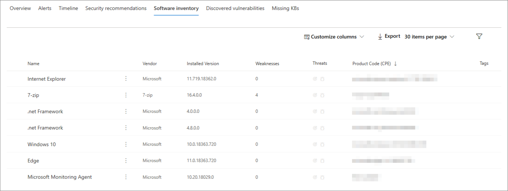
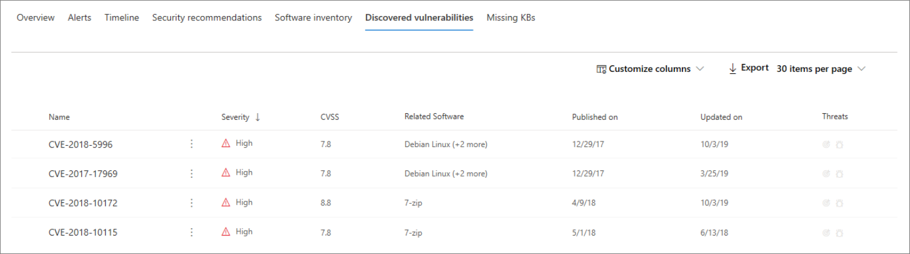
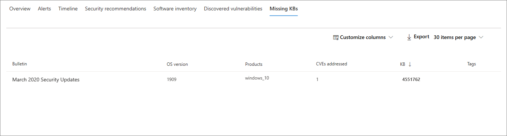

# Página de perfil de equipo

El portal de seguridad 365 de Microsoft proporciona páginas de Perfil de equipo, para que pueda evaluar el estado y el estado de los dispositivos de la red. Cada página de Perfil de la máquina contiene una gran cantidad de información sobre el dispositivo.

Puede revisar información detallada sobre el software que se está ejecutando, las alertas y eventos de seguridad pasados y presentes, y buscar vínculos a revisiones de software relevantes.

También puede usar el perfil del equipo para realizar tareas comunes relacionadas con la seguridad y revisar rápidamente los detalles básicos del dispositivo.

## Navegación por la página de Perfil de la máquina

La página de perfil del equipo se divide en tres secciones.

El área de contenido principal (1) contiene siete pestañas que puede alternar para ver distintos tipos de información sobre el equipo.

La barra lateral (2) enumera los detalles básicos sobre el equipo.

También hay acciones de respuesta disponibles en un encabezado (3) antes de las secciones de barra lateral y contenido principal. Puede usar las acciones de este encabezado para realizar tareas comunes relacionadas con la seguridad.

## Sección Tabulaciones

Las pestañas de Perfil de equipo permiten alternar información general sobre la seguridad de la máquina y tablas que contienen una lista de alertas, una escala de tiempo, una lista de recomendaciones de seguridad, un inventario de software, una lista de vulnerabilidades detectadas y que faltan. KB (actualizaciones de seguridad).

### Ficha Información general

La pestaña predeterminada es **información general**. Proporciona una visión rápida del hecho de seguridad más importante sobre el dispositivo.

Aquí puede encontrar un gráfico del nivel de riesgo del dispositivo y las alertas activas, cualquier usuario que haya iniciado sesión, una lista breve de los usuarios más frecuentes y las evaluaciones de seguridad que detallan el nivel de exposición del dispositivo, las recomendaciones de seguridad, el software afectado y vulnerabilidades detectadas.

### Ficha Alertas

La ficha **alertas** contiene una lista de las alertas que se han notificado en el dispositivo.

Puede personalizar el número de elementos mostrados, así como qué columnas se muestran para cada elemento. El comportamiento predeterminado es enumerar 30 elementos por página y tener 11 columnas activadas para mostrar.

Las columnas de esta pestaña incluyen información sobre la gravedad de la amenaza que desencadenó la alerta, así como el estado, el estado de investigación y quién, si se ha asignado a algún usuario la alerta.

La columna *entidades afectadas* se refiere a la máquina (entidad) cuyo perfil está viendo actualmente, además de otros equipos de la red que se ven afectados.

Al seleccionar un elemento de esta lista, se abrirá un vínculo a la alerta seleccionada.

Esta lista se puede filtrar por gravedad, estado o asignada.

### Ficha escala de tiempo

La pestaña **escala de tiempo** incluye un gráfico interactivo e cronológico de eventos provocados en el dispositivo. Moviendo el área resaltada del gráfico, puede ver los eventos en intervalos de tiempo diferentes. También puede escribir un intervalo de fechas personalizado.

Debajo del gráfico hay una lista de eventos para el intervalo de fechas seleccionado.

El número de elementos mostrados y las columnas de la lista se pueden personalizar. Las columnas predeterminadas muestran el tiempo del evento, el usuario activo, el tipo de acción, las entidades (procesos) y la información adicional sobre el evento.

Al seleccionar un elemento de la lista, se abrirá un control flotante que muestra un gráfico de entidades de evento, que muestra los procesos primarios y secundarios que desencadenó el evento.

Esta lista se puede filtrar por el tipo específico de evento; por ejemplo, eventos de registro o eventos de pantalla inteligente.

### Ficha recomendaciones de seguridad

La ficha **recomendaciones de seguridad** enumera las acciones que puede realizar para proteger el dispositivo. Al seleccionar un elemento de esta lista, se abrirá un control flotante donde puede obtener instrucciones sobre cómo aplicar la recomendación.

Como con las pestañas anteriores, se puede personalizar el número de elementos que se muestran por página y qué columnas son visibles.

La vista predeterminada incluye columnas que detallan las debilidades de seguridad tratadas, la amenaza asociada, el componente o software relacionado con la amenaza, entre otros. Los elementos se pueden filtrar por el estado de la recomendación.

### Inventario de software

La ficha **inventario de software** enumera el software instalado en el dispositivo.

La vista predeterminada muestra el proveedor de software, el número de versión instalado, el número de debilidades de software conocidos, la información sobre amenazas, el código de producto y las etiquetas. El número de elementos mostrados y las columnas que se muestran pueden personalizarse.

Al seleccionar un elemento de esta lista, se abre un control flotante que contiene más detalles sobre el software seleccionado, así como la ruta de acceso y la marca de tiempo de la última vez que se encontró el software.

Esta lista se puede filtrar por código de producto.

### Ficha vulnerabilidades detectadas

En la ficha **vulnerabilidades detectadas** se muestran las vulnerabilidades y los puntos débiles comunes (CVE) que pueden afectar al dispositivo.

La vista predeterminada muestra la gravedad de CVE, la puntuación de vulnerabilidad común (CVS), el software relacionado con el CVE, Cuándo se publicó el CVE, Cuándo se actualizó por última vez el CVE y las amenazas asociadas con el CVE.

Como en las pestañas anteriores, se puede personalizar el número de elementos que se muestran y las columnas que son visibles.

Al seleccionar un elemento de esta lista, se abrirá un control flotante que describe el CVE.

### KB faltantes

La ficha **KB que falta** muestra una lista de las actualizaciones de Microsoft que aún no se han aplicado al equipo. Los "KB" en cuestión son [artículos de Knowledge Base](https://support.microsoft.com/help/242450/how-to-query-the-microsoft-knowledge-base-by-using-keywords-and-query) que describen estas actualizaciones; por ejemplo, [KB4551762](https://support.microsoft.com/help/4551762/windows-10-update-kb4551762).

La vista predeterminada enumera el boletín que contiene las actualizaciones, la versión del sistema operativo, los productos afectados, CVE dirección, el número de KB y las etiquetas.

Se puede personalizar el número de elementos que se muestran por página y qué columnas se muestran.

Al seleccionar un elemento, se abrirá un control flotante que se vincula a la actualización.

## -

Junto al área de contenido principal de la página de perfil del equipo se encuentra la barra lateral.

La barra lateral proporciona información básica importante en subsecciones pequeñas que se pueden alternar abrir o cerrar:

* **Etiquetas** : todas las etiquetas asociadas con el dispositivo
* **Información de seguridad** : incidentes abiertos, alertas activas, nivel de exposición y nivel de riesgo
* **Detalles de dispositivo** : dominio, sistema operativo, grupo de activos, estado de mantenimiento, sensibilidad de datos y direcciones IP
* **Actividad de red** : marcas de tiempo de la primera vez y última vez que el dispositivo se ve en la red

En esta sección también se incluye el nombre y el nivel de exposición del dispositivo, y un icono para indicar si está activo actualmente en la red.

## Acciones de respuesta

Las acciones de respuesta ofrecen una forma rápida de defenderse y analizar las amenazas.

Las acciones de respuesta disponibles para usted incluyen:

* **Administrar etiquetas** : actualiza las etiquetas personalizadas que hayas aplicado a este dispositivo.
* **Aislar** : aísla el equipo de la red de la organización y manteniéndolo conectado a la protección contra amenazas avanzada de Microsoft defender. Puede optar por permitir que Outlook, Microsoft Teams y Skype empresarial se ejecuten mientras el equipo está aislado, con fines de comunicación.
* **Restringir la ejecución** de la aplicación: evita que se ejecuten las aplicaciones que Microsoft no ha firmado.
* **Ejecutar detección de virus** : actualiza las definiciones de antivirus de Windows Defender y ejecuta inmediatamente un examen de antivirus. Elija entre análisis rápido o análisis completo.
* **Recopilar el paquete de investigación** : recopila información sobre el equipo. Una vez completada la investigación, puede descargarla.
* **Iniciar sesión de respuesta activa** : carga un shell remoto en el equipo para [investigaciones de seguridad en profundidad](https://docs.microsoft.com/windows/security/threat-protection/microsoft-defender-atp/live-response).
* **Iniciar investigación automatizada** : [investiga y corrige](https://docs.microsoft.com/microsoft-365/security/office-365-security/office-365-air)automáticamente las amenazas. Aunque puede desencadenar de forma manual investigaciones automáticas para que se ejecuten desde esta página, [algunas directivas de alertas](https://docs.microsoft.com/microsoft-365/compliance/alert-policies?view=o365-worldwide#default-alert-policies) desencadenan investigaciones automáticas por su cuenta.
* **Centro de actividades** : ver el estado de las acciones enviadas. Solo está disponible si ya se ha seleccionado otra acción.

## Temas relacionados

* [Introducción a la Protección contra amenazas de Microsoft](microsoft-threat-protection.md)
* [Habilitar la Protección contra amenazas de Microsoft](mtp-enable.md)
* [Investigar entidades en equipos que usan la respuesta activa](https://docs.microsoft.com/windows/security/threat-protection/microsoft-defender-atp/live-response)
* [Investigación y respuesta automatizadas (AIR) en Office 365](https://docs.microsoft.com/microsoft-365/security/office-365-security/office-365-air)
