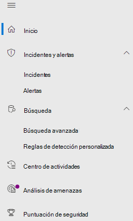
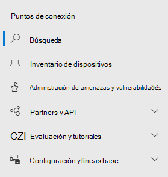

# Microsoft Defender para puntos de conexión en el Centro de seguridad de Microsoft 365Microsoft Defender for Endpoint in the Microsoft 365 security center

[!INCLUDE [Microsoft 365 Defender rebranding](../includes/microsoft-defender.md)]

[!INCLUDE [Prerelease](../includes/prerelease.md)]

**Se aplica a:****Applies to:**

- [Microsoft 365 DefenderMicrosoft 365 Defender](https://go.microsoft.com/fwlink/?linkid=2118804)
- [Microsoft Defender para punto de conexiónMicrosoft Defender for Endpoint](https://go.microsoft.com/fwlink/p/?linkid=2146631)
- [Microsoft Defender para Office 365Microsoft Defender for Office 365](https://go.microsoft.com/fwlink/?linkid=2148715)

El centro de seguridad mejorado de [Microsoft 365](overview-security-center.md) combina funciones de seguridad que protegen, detectan, investigan y responden a las amenazas de correo electrónico, colaboración, identidad [https://security.microsoft.com](https://security.microsoft.com) y dispositivo.The improved [Microsoft 365 security center](overview-security-center.md) at [https://security.microsoft.com](https://security.microsoft.com) combines security capabilities that protect, detect, investigate, and respond to email, collaboration, identity, and device threats. Este centro de seguridad reúne la funcionalidad de los portales de seguridad de Microsoft existentes, incluido el Centro de seguridad de Microsoft Defender y el Centro de seguridad & cumplimiento de Office 365.This security center brings together functionality from existing Microsoft security portals, including Microsoft Defender Security Center and the Office 365 Security & Compliance center.

Si está familiarizado con el Centro de seguridad de Microsoft Defender, este artículo le ayudará a describir algunos de los cambios y mejoras en el Centro de seguridad de Microsoft 365 mejorado.If you're familiar with the Microsoft Defender Security Center, this article helps describe some of the changes and improvements in the improved Microsoft 365 security center. Sin embargo, hay algunos elementos nuevos y actualizados que debe tener en cuenta.However there are some new and updated elements to be aware of.

Históricamente, el Centro [de seguridad de Microsoft Defender](https://docs.microsoft.com/windows/security/threat-protection/microsoft-defender-atp/portal-overview) ha sido el hogar de Microsoft Defender para Endpoint.Historically, the [Microsoft Defender Security Center](https://docs.microsoft.com/windows/security/threat-protection/microsoft-defender-atp/portal-overview) has been the home for Microsoft Defender for Endpoint. Los equipos de seguridad empresariales lo han usado para supervisar y ayudar a responder a las alertas de posible actividad avanzada de amenazas persistentes o infracciones de datos.Enterprise security teams have used it to monitor and help responding to alerts of potential advanced persistent threat activity or data breaches. Para ayudar a reducir el número de portales, el Centro de seguridad de Microsoft 365 será el hogar para supervisar y administrar la seguridad en sus identidades, datos, dispositivos, aplicaciones e infraestructura de Microsoft.To help reduce the number of portals, the Microsoft 365 security center will be the home for monitoring and managing security across your Microsoft identities, data, devices, apps, and infrastructure.

Microsoft Defender para puntos de conexión en el Centro de seguridad de Microsoft 365 admite la concesión de acceso a proveedores de servicios de seguridad [administrados (MSSP)](https://docs.microsoft.com/windows/security/threat-protection/microsoft-defender-atp/grant-mssp-access) del mismo modo que se concede acceso en el Centro de seguridad de [Microsoft Defender.](mssp-access.md)Microsoft Defender for Endpoint in the Microsoft 365 security center supports [granting access to managed security service providers (MSSPs)](https://docs.microsoft.com/windows/security/threat-protection/microsoft-defender-atp/grant-mssp-access) in the same way [access is granted in the Microsoft Defender security center](mssp-access.md).

> [!IMPORTANT]
> Lo que se ve en el Centro de seguridad de Microsoft 365 depende de las suscripciones actuales.What you see in the Microsoft 365 security center depends on your current subscriptions. Por ejemplo, si no tiene una licencia para Microsoft Defender para Office 365, no se mostrará la sección colaboración de & correo electrónico.For example, if you don't have a license for Microsoft Defender for Office 365, then the Email & Collaboration section will not be shown.

Echa un vistazo al Centro de seguridad de Microsoft 365 mejorado: [https://security.microsoft.com](https://security.microsoft.com) .Take a look at the improved Microsoft 365 security center: [https://security.microsoft.com](https://security.microsoft.com).

Obtenga más información sobre las ventajas: [Información general del Centro de seguridad de Microsoft 365](overview-security-center.md)Learn more about the benefits: [Overview of the Microsoft 365 security center](overview-security-center.md)

## Qué ha cambiadoWhat's changed

Esta tabla es una referencia rápida de los cambios entre el Centro de seguridad de Microsoft Defender y el Centro de seguridad de Microsoft 365.This table is a quick reference of the changes between the Microsoft Defender Security Center and the Microsoft 365 security center.

### Alertas y accionesAlerts and actions

|**Área****Area**  |**Descripción del cambio****Description of change**  |
|---------|---------|
| [Alertas de & incidentesIncidents & alerts](incidents-overview.md)  | En el Centro de seguridad de Microsoft 365, puede administrar incidentes y alertas en todos los puntos de conexión, el correo electrónico y las identidades.In the Microsoft 365 security center, you can manage incidents and alerts across all of your endpoints, email, and identities. Hemos convergido la experiencia para ayudarle a encontrar eventos relacionados más fácilmente.We've converged the experience to help you find related events more easily. Para obtener más información, vea [Información general sobre incidentes.](incidents-overview.md)For more information, see [Incidents Overview](incidents-overview.md).   |
| [BúsquedaHunting](advanced-hunting-overview.md)  |  La modificación de reglas de detección personalizadas creadas en Microsoft Defender para Endpoint para incluir tablas de identidad y correo electrónico las mueve automáticamente a Microsoft 365 Defender.Modifying custom detection rules created in Microsoft Defender for Endpoint to include identity and email tables automatically moves them to Microsoft 365 Defender. Sus alertas correspondientes también aparecerán en Microsoft 365 Defender.Their corresponding alerts will also appear in Microsoft 365 Defender. Para obtener más información sobre estos cambios, lea [Migrar reglas de detección personalizadas.](advanced-hunting-migrate-from-mdatp.md#migrate-custom-detection-rules)For more details about these changes, read [Migrate custom detection rules](advanced-hunting-migrate-from-mdatp.md#migrate-custom-detection-rules). La `DeviceAlertEvents` tabla de búsqueda avanzada no está disponible en Microsoft 365 Defender.The `DeviceAlertEvents` table for advanced hunting isn't available in Microsoft 365 Defender. Para consultar información de alerta específica del dispositivo en Microsoft 365 Defender, puede usar las tablas y para dar cabida a incluso más información de un conjunto diverso `AlertInfo` `AlertEvidence` de orígenes.To query device-specific alert information in Microsoft 365 Defender, you can use the `AlertInfo` and `AlertEvidence` tables to accommodate even more information from a diverse set of sources. Crea la siguiente consulta relacionada con dispositivos siguiendo [las consultas de escritura sin DeviceAlertEvents](advanced-hunting-migrate-from-mdatp.md#write-queries-without-devicealertevents).Craft your next device-related query by following [Write queries without DeviceAlertEvents](advanced-hunting-migrate-from-mdatp.md#write-queries-without-devicealertevents).|
|[Centro de accionesAction center](mtp-action-center.md)    | Enumera las acciones pendientes y completadas que se realizaron después de investigaciones automatizadas y acciones de corrección.Lists pending and completed actions that were taken following automated investigations and remediation actions. Anteriormente, el Centro de actividades del Centro de seguridad de Microsoft Defender enumeraba las acciones pendientes y completadas para las acciones de corrección realizadas solo en dispositivos, mientras que las investigaciones automatizadas enumeraban alertas y estado.Formerly, the Action center in the Microsoft Defender Security Center listed pending and completed actions for remediation actions taken on devices only, while Automated investigations listed alerts and status. En el centro de seguridad mejorado de Microsoft 365, el Centro de actividades reúne acciones de corrección e investigaciones en correo electrónico, dispositivos y usuarios, todo ello en una ubicación.In the  improved Microsoft 365 security center, the Action center brings together remediation actions and investigations across email, devices, and users—all in one location.  |
| [Análisis de amenazasThreat analytics](threat-analytics.md) |  Se ha movido a la parte superior de la barra de navegación para facilitar la detección y el uso.Moved to the top of the navigation bar for easier discovery and use. Ahora se incluye información sobre amenazas para los puntos de conexión y el correo electrónico y la colaboración.Now includes threat information for both endpoints and email and collaboration.    |

### Puntos de conexiónEndpoints

|**Área****Area**  |**Descripción del cambio****Description of change**  |
|---------|---------|
|BúsquedaSearch   |  En lugar de estar en el encabezado, la barra de búsqueda de Microsoft Defender para puntos de conexión se mueve en la sección Puntos de conexión.Instead of being in the heading, Microsoft Defender for Endpoint search bar is moving under the Endpoints section. Puede seguir buscando dispositivos, archivos, usuarios, direcciones URL, IP, vulnerabilidades, software y recomendaciones.You can continue to search for devices, files, users, URLs, IPs, vulnerabilities, software, and recommendations.  |
|[PanelDashboard](https://docs.microsoft.com/windows/security/threat-protection/microsoft-defender-atp/security-operations-dashboard)   |  Este es el panel de operaciones de seguridad.This is your security operations dashboard. Consulta información general sobre cuántas alertas activas se desencadenaron, qué dispositivos están en riesgo, qué usuarios están en riesgo y nivel de gravedad para alertas, dispositivos y usuarios.See an overview of how many active alerts were triggered, which devices are at risk, which users are at risk, and severity level for alerts, devices, and users. También puedes ver si algún dispositivo tiene problemas con el sensor, el estado general del servicio y cómo se detectaron alertas no resueltas.You can also see if any devices have sensor issues, your overall service health, and how any unresolved alerts were detected. |
|Inventario de dispositivosDevice inventory | Sin cambios.No changes. |
|[Administración de amenazas y vulnerabilidadesVulnerability management](https://docs.microsoft.com/windows/security/threat-protection/microsoft-defender-atp/next-gen-threat-and-vuln-mgt)    |    El nombre se acorte para que quepa en el panel de navegación.Name was shortened to fit in the navigation pane. Es lo mismo que la sección de administración de amenazas y vulnerabilidades, con todas las páginas debajo.It's the same as the threat and vulnerability management section, with all the pages underneath.     |
| Partners y APIPartners and APIs | Sin cambios.No changes. |
| Evaluaciones & tutorialesEvaluations & tutorials    |     Nuevas capacidades de aprendizaje y pruebas.New testing and learning capabilities.     |
| Administración de la configuraciónConfiguration management   |  Sin cambios.No changes.  |

> [!NOTE]
> **La investigación y corrección automáticas** ahora forman parte de los incidentes.**Automatic investigation and remediation** is now a part of  incidents. Puede ver eventos automatizados de investigación y corrección en la **pestaña Investigación >** incidentes.You can see Automated  investigation and remediation events in the **Incident > Investigation** tab.

### Acceso e informesAccess and reporting

|**Área****Area**  |**Descripción del cambio****Description of change**  |
|---------|---------|
| InformesReports  | Consulta informes de puntos de conexión y correo electrónico & colaboración, incluida la protección contra amenazas, el estado y el cumplimiento del dispositivo y los dispositivos vulnerables.See reports for endpoints and email & collaboration, including Threat protection, Device health and compliance, and Vulnerable devices. |
| SaludHealth  |  Actualmente, hay vínculos a la página "Estado del servicio" en el [Centro de administración de Microsoft 365.](https://admin.microsoft.com/)Currently links out to the "Service health" page in the [Microsoft 365 admin center](https://admin.microsoft.com/). |
| ConfiguraciónSettings |  Administre la configuración del Centro de seguridad de Microsoft 365, Microsoft 365 Defender, Puntos de conexión, colaboración de & correo electrónico, identidades y detección de dispositivos.Manage your settings for the Microsoft 365 security center, Microsoft 365 Defender, Endpoints, Email & collaboration, Identities, and Device discovery.   |

## Capacidades y navegación de seguridad de Microsoft 365Microsoft 365 security navigation and capabilities

La navegación izquierda o la barra de inicio rápido serán familiares.The left navigation, or quick launch bar, will look familiar. Sin embargo, hay algunos elementos nuevos y actualizados en este centro de seguridad.However, there are some new and updated elements in this security center.

### Incidentes y alertasIncidents and alerts

Reúne la administración de incidentes y alertas en el correo electrónico, los dispositivos y las identidades.Brings together incident and alert management across your email, devices, and identities. La página de alerta proporciona un contexto completo a la alerta mediante la combinación de señales de ataque para crear una historia detallada.The alert page provides full context to the alert by combining attack signals to construct a detailed story. Ahora, una nueva experiencia unificada reúne una vista coherente de las alertas en todas las cargas de trabajo.A new, unified experience now brings together a consistent view of alerts across workloads. Puede realizar una triage, investigar y tomar medidas eficaces rápidamente.You can quickly triage, investigate, and take effective action.

- [Más información sobre incidentesLearn more about incidents](incidents-overview.md)
- [Más información sobre la administración de alertasLearn more about managing alerts](investigate-alerts.md)

### BúsquedaHunting

Busque de forma proactiva amenazas, malware y actividad malintencionada en los puntos de conexión, buzones de Office 365 y mucho más mediante consultas de [búsqueda avanzada.](advanced-hunting-overview.md)Proactively search for threats, malware, and malicious activity across your endpoints, Office 365 mailboxes, and more by using [advanced hunting queries](advanced-hunting-overview.md). Estas consultas eficaces se pueden usar para localizar y revisar indicadores y entidades de amenazas conocidas y potenciales.These powerful queries can be used to locate and review threat indicators and entities for both known and potential threats.

[Las reglas de](custom-detection-rules.md) detección personalizadas se pueden crear a partir de consultas de búsqueda avanzada para ayudarle a observar de forma proactiva los eventos que pueden ser un indicador de la actividad de infracción y de los dispositivos mal configurados.[Custom detection rules](custom-detection-rules.md) can be built from advanced hunting queries to help you proactively watch for events that might be indicative of breach activity and misconfigured devices.

### Centro de accionesAction center

El Centro de acción muestra las investigaciones creadas por la investigación automatizada y las capacidades de respuesta.Action center shows you the investigations created by automated investigation and response capabilities. Esta recuperación automática y automática en Microsoft 365 Defender puede ayudar a los equipos de seguridad respondiendo automáticamente a eventos específicos.This automated, self-healing in Microsoft 365 Defender can help security teams by automatically responding to specific events.

[Más información sobre el Centro de actividadesLearn more about the Action center](mtp-action-center.md)

### Análisis de amenazasThreat Analytics

Obtener inteligencia de amenazas de investigadores expertos en seguridad de Microsoft.Get threat intelligence from expert Microsoft security researchers. Análisis de amenazas ayuda a los equipos de seguridad a ser más eficientes al enfrentarse a amenazas emergentes.Threat Analytics helps security teams be more efficient when facing emerging threats. Análisis de amenazas incluye:Threat Analytics includes:

- Detecciones y mitigaciones relacionadas con el correo electrónico de Microsoft Defender para Office 365.Email-related detections and mitigations from Microsoft Defender for Office 365. Esto se suma a los datos del punto de conexión que ya están disponibles en Microsoft Defender para Endpoint.This is in addition to the endpoint data already available from Microsoft Defender for Endpoint.
- Vista de incidentes relacionados con las amenazas.Incidents view related to the threats.
- Experiencia mejorada para identificar y usar rápidamente la información que se puede usar en los informes.Enhanced experience for quickly identifying and using actionable information in the reports.

Puede acceder al análisis de amenazas desde la barra de navegación superior izquierda del Centro de seguridad de Microsoft 365 o desde una tarjeta de panel dedicada que muestre las principales amenazas para su organización.You can access threat analytics either from the upper left navigation bar in the Microsoft 365 security center, or from a dedicated dashboard card that shows the top threats for your organization.

Obtenga más información sobre cómo realizar [un seguimiento y responder a las amenazas emergentes con análisis de amenazas](https://docs.microsoft.com/microsoft-365/security/mtp/threat-analytics)Learn more about how to [track and respond to emerging threats with threat analytics](https://docs.microsoft.com/microsoft-365/security/mtp/threat-analytics)

### Sección Puntos de conexiónEndpoints section

Ver y administrar la seguridad de los puntos de conexión de la organización.View and manage the security of endpoints in your organization. Si ha usado el Centro de seguridad de Microsoft Defender, le será familiar.If you've used the Microsoft Defender Security Center, it will look familiar.

### Acceso e informesAccess and reports

Ver informes, cambiar la configuración y modificar roles de usuario.View reports, change your settings, and modify user roles.

### Conexiones de API SIEMSIEM API connections

Si usas la [API DE SIEM de Defender para endpoint,](/windows/security/threat-protection/microsoft-defender-atp/enable-siem-integration.md)puedes seguir haciendo esto.If you use the [Defender for Endpoint SIEM API](/windows/security/threat-protection/microsoft-defender-atp/enable-siem-integration.md), you can continue to do so. Hemos agregado nuevos vínculos en la carga de la API que apuntan a la página de alerta o a la página de incidentes en el portal de seguridad de Microsoft 365.We’ve added new links on the API payload that point to the alert page or the incident page in the Microsoft 365 security portal. Los nuevos campos de API incluyen LinkToMTP e IncidentLinkToMTP.New API fields include LinkToMTP and IncidentLinkToMTP. Para obtener más información, vea Redirigir cuentas de Microsoft Defender para Endpoint al Centro de [seguridad de Microsoft 365.](/microsoft-365/security/mtp/microsoft-365-security-mde-redirection.md)For more information, see [Redirecting accounts from Microsoft Defender for Endpoint to the Microsoft 365 security center](/microsoft-365/security/mtp/microsoft-365-security-mde-redirection.md).

### Alertas de correo electrónicoEmail alerts

Puedes seguir usando alertas de correo electrónico para Defender para Endpoint.You can continue to use email alerts for Defender for Endpoint. Hemos agregado nuevos vínculos en los correos electrónicos que apuntan a la página de alerta o a la página de incidentes en el Centro de seguridad de Microsoft 365.We've added new links in the emails that point to the alert page or the incident page in the Microsoft 365 security center. Para obtener más información, vea Redirigir cuentas de Microsoft Defender para Endpoint al Centro de [seguridad de Microsoft 365.](/microsoft-365/security/mtp/microsoft-365-security-mde-redirection.md)For more information, see [Redirecting accounts from Microsoft Defender for Endpoint to the Microsoft 365 security center](/microsoft-365/security/mtp/microsoft-365-security-mde-redirection.md).

## Información relacionadaRelated information

- [Centro de seguridad de Microsoft 365Microsoft 365 security center](overview-security-center.md)
- [Microsoft Defender para puntos de conexión en el Centro de seguridad de Microsoft 365Microsoft Defender for Endpoint in the Microsoft 365 security center](microsoft-365-security-center-mde.md)
- [Redirigir cuentas de Microsoft Defender para endpoint al Centro de seguridad de Microsoft 365Redirecting accounts from Microsoft Defender for Endpoint to the Microsoft 365 security center](microsoft-365-security-mde-redirection.md)
