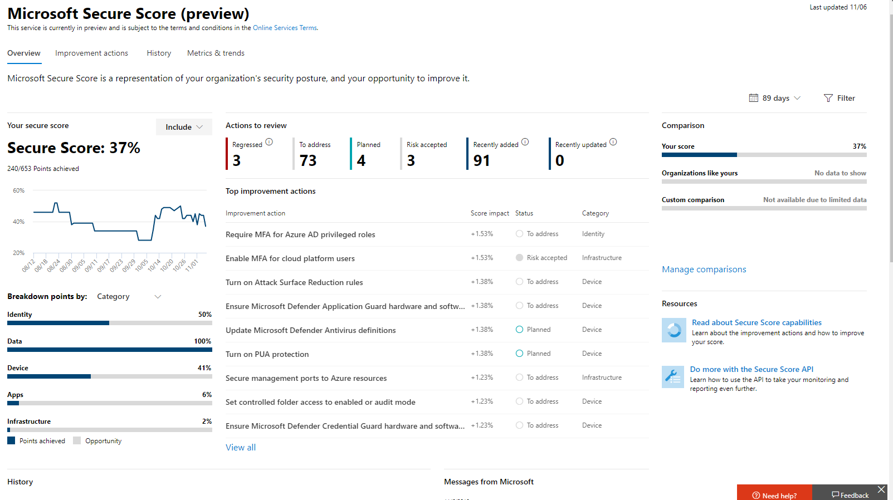

# Puntuación segura de Microsoft (versión preliminar)

>[!IMPORTANT]
>Parte de la información se refiere a un producto prelanzamiento que puede modificarse de forma sustancial antes de su lanzamiento comercial. Microsoft makes no warranties, express or implied, with respect to the information provided here.

La calificación segura de Microsoft es una medida de la postura de seguridad de una organización, con un número más alto que indica que se han realizado más acciones de mejora. Puede encontrarse en https://security.microsoft.com/securescore el [centro de seguridad de Microsoft 365](overview-security-center.md).

Seguir las recomendaciones de puntuación de seguridad puede proteger a su organización de las amenazas. Desde un panel centralizado en el centro de seguridad de Microsoft 365, las organizaciones pueden supervisar y trabajar en la seguridad de las identidades, los datos, las aplicaciones, los dispositivos y la infraestructura de Microsoft 365.

La puntuación segura ayuda a las organizaciones a:  

* Informe sobre el estado actual de la postura de seguridad de la organización.
* Mejorar su postura de seguridad proporcionando detección, visibilidad, orientación y control.  
* Comparar con benchmarks y establecer indicadores clave de rendimiento (KPI).

Las organizaciones obtienen acceso a las sólidas visualizaciones de métricas y tendencias, la integración con otros productos de Microsoft, la puntuación con organizaciones similares y mucho más. La puntuación también puede reflejar Cuándo las soluciones de terceros han tratado las acciones recomendadas.

Además, puede obtener acceso a sus recomendaciones y puntuaciones a través de la [API de Microsoft Graph](https://www.microsoft.com/security/partnerships/graph-security-api). Obtenga información sobre el [tipo de recurso de puntuación segura](https://go.microsoft.com/fwlink/?linkid=2092996).

## Cómo funciona

Se le proporcionan puntos para configurar las características de seguridad recomendadas, realizar tareas relacionadas con la seguridad o resolver la acción de mejora con una aplicación o software de terceros, o una mitigación alternativa. Algunas acciones de mejora solo proporcionan puntos cuando se completan completamente y otras proporcionan puntos parciales si se completan para algunos dispositivos o usuarios. Si no puede o no desea activar una de las acciones de mejora, puede optar por aceptar el riesgo o el riesgo restante.

Le mostramos el conjunto completo de posibles mejoras, independientemente de la licencia, para que pueda comprender los procedimientos recomendados de seguridad y mejorar su puntuación. La postura absoluta de seguridad se representa mediante calificación segura, que permanece igual independientemente de las licencias de producto que posea la organización. Tenga en cuenta que la seguridad debe sopesarse con facilidad de uso y no todas las recomendaciones pueden funcionar en su entorno.

La puntuación se actualiza en tiempo real para reflejar la información que se presenta en las páginas de acciones de visualización y de mejora. La puntuación segura también se sincroniza diariamente para recibir datos del sistema sobre los puntos alcanzados para cada acción.

### Cómo se puntuan las acciones de mejora

Cada acción de mejora merece 10 puntos o menos. La mayoría se puntuan de una manera binaria: Si implementa la acción de mejora, como crear una nueva Directiva o activar una configuración específica, obtendrá un 100% de los puntos. Para otras acciones de mejora, los puntos se dan como un porcentaje de la configuración total. Por ejemplo, si los Estados de acción de mejora obtienen 30 puntos al proteger a todos los usuarios con la autenticación multifactor y solo tiene 5 de 100 usuarios totales protegidos, se le asignará una puntuación parcial de unos 2 puntos (5 protegidos/100 en total * 30 máx PTS = puntuación parcial de 2 PTO).

### Productos incluidos en la puntuación segura

Actualmente hay recomendaciones para Microsoft 365 (incluido Exchange Online), Azure AD, ATP de Microsoft, ATP de Azure y seguridad de aplicaciones en la nube. Pronto estarán disponibles recomendaciones para otros productos de seguridad. Las recomendaciones no cubren todas las superficies de ataque asociadas con cada producto, pero son una buena línea de base. También puede marcar las acciones de mejora como cubiertas por un tercero o una mitigación alternativa.

## Permisos necesarios

Para tener permiso de acceso a la puntuación segura de Microsoft, debe tener asignado uno de los siguientes roles en Azure Active Directory.

### Lectura y escritura de roles

Con acceso de lectura y escritura, puede realizar cambios e interactuar directamente con la calificación segura. También puede asignar acceso de solo lectura a otros usuarios.

* Administrador global
* Administrador de seguridad
* Administrador de Exchange
* Administrador de SharePoint
* Administrador de la cuenta

### Solo lectura roles

Con acceso de solo lectura, no es posible editar el estado ni las notas para una acción de mejora, editar zonas de puntuación ni editar comparaciones personalizadas.

* Administrador del servicio de asistencia
* Administrador de usuarios
* Administrador de servicios
* Lector de seguridad
* Operador de seguridad
* Lector global

### API de Graph

Para obtener acceso a la API de Graph, debe tener uno de los siguientes ámbitos además de un rol:

* Ámbito securityevents. Read. All (para roles de solo lectura)
* Ámbito securityevents. ReadWrite. All (para roles de lectura y escritura)

## Obtener visibilidad de la postura de seguridad

Para ayudarle a la información que necesita con mayor rapidez, las acciones de mejora de Microsoft se organizan en grupos:

* Identity (cuentas de Azure AD & roles)
* Datos (Microsoft Information Protection)
* Dispositivo (ATP de Microsoft defender)
* Aplicación (aplicaciones de correo electrónico y nube, incluidos Office 365 y Microsoft Cloud App Security)
* Infraestructura (no hay acciones de mejora por ahora)

>[!NOTE]
>En la versión más reciente de la puntuación segura de Microsoft, se ha lanzado un modelo de resultados mejorado que ha hecho que la puntuación segura de Microsoft sea incompatible temporalmente con la puntuación segura de la identidad y la API de Graph. [Ver detalles](microsoft-secure-score-preview.md#incompatibility-with-identity-secure-score-and-graph-api)

En la página información general sobre la calificación segura de Microsoft, puede ver cómo se dividen los puntos entre estos grupos y qué puntos están disponibles. La página de información general también es la ubicación para obtener una vista completa de la puntuación total, la tendencia histórica de la puntuación segura con comparaciones de los bancos de pruebas y las acciones de mejora ordenadas por prioridad que se pueden realizar para mejorar la puntuación.

 *figura 1: Página de introducción a la calificación segura de Microsoft*

## Tomar medidas para mejorar su puntuación

La ficha **acciones de mejora** enumera las recomendaciones de seguridad que se redirigen a posibles superficies de ataque, junto con su estado (para dirigir, planear, aceptar el riesgo, resolver a través de terceros, resuelto a través de mitigación alternativa y completada). Puede buscar, filtrar y agrupar todas las acciones de mejora.  

### Porcentaje

La clasificación se basa en el número de puntos restantes que quedan para lograr, la dificultad de implementación, el impacto del usuario y la complejidad. Las acciones de mejora con mayor jerarquía tienen un gran número de puntos que quedan con problemas, impacto en el usuario y complejidad.

### Ver detalles de la acción de mejora

Al seleccionar una acción de mejora específica, aparece un elemento flotante de página completa.  

 *figura 2: ejemplo de control flotante de acción de mejora*

Para completar la acción, tiene algunas opciones:

* Seleccione **administrar** para ir a la pantalla de configuración y realizar el cambio. A continuación, obtendrá los puntos que merece la acción, visible en el vuelo hacia fuera. Generalmente, los puntos tardan unas 24 horas en actualizarse.

* Seleccione **compartir** para copiar el vínculo directo a la acción de mejora o elija la plataforma para compartir el vínculo, por ejemplo, correo electrónico, Microsoft Teams, Microsoft Planner o ServiceNow. La selección de ServiceNow le permitirá crear un vale de cambio que será visible en ServiceNow y en la Página principal del centro de seguridad de Microsoft 365. Para obtener más información, consulte [Microsoft 365 Security Center and ServiceNow Integration](tickets.md).

### Elegir un estado de acción de mejora

Elija los Estados y anote las notas específicas para la acción de mejora. Los statues que puede seleccionar son los siguientes:

* **Para solucionarlo** , debe reconocer que la acción de mejora es necesaria y planificar para solucionarla en algún momento posterior. Este estado también se aplica a las acciones que se detectan como parcialmente, pero que no se completan completamente.
* **Planificado** : hay planes concretos en su ubicación para completar la acción de mejora.
* **Riesgo aceptado** : la seguridad siempre debe sopesarse con la facilidad de uso y no todas las recomendaciones funcionarán para su entorno. En ese caso, puede optar por aceptar el riesgo, o el riesgo restante, y no activar la acción de mejora. No se le proporcionarán puntos, pero la acción ya no será visible en la lista de acciones de mejora. Puede ver esta acción en el historial o deshacerla en cualquier momento.
* **Resuelto a través de terceros** y **resuelto a través de mitigación alternativa** : la acción de mejora ya se ha tratado con una aplicación o un software de terceros o con una herramienta interna. Obtendrá los puntos que merece la acción, de modo que su puntuación refleje mejor su postura de seguridad general. Si un tercero o una herramienta interna ya no cubre el control, puede elegir otro Estado. Tenga en cuenta que Microsoft no tendrá visibilidad sobre la integridad de la implementación si la acción de mejora se marca como cualquiera de estos Estados.

#### Acciones de mejora de la administración de amenazas & vulnerabilidad

Para las acciones de mejora en la categoría "dispositivo", no podrá elegir los Estados. En su lugar, se le dirigirá a la [recomendación de seguridad asociada & Vulnerability Management (TVM)](https://docs.microsoft.com/windows/security/threat-protection/microsoft-defender-atp/tvm-security-recommendation) en el [centro de seguridad de Microsoft defender](https://docs.microsoft.com/windows/security/threat-protection/microsoft-defender-atp/use) para tomar medidas. La excepción que elija y justifique que escriba será específica de ese portal y no estará presente en el portal de calificación segura de Microsoft.

#### Acciones de mejora completadas

Las acciones de mejora tienen el estado "completado" una vez que se han logrado todos los puntos posibles para la acción de mejora. Las acciones de mejora completadas se confirman a través de datos de Microsoft y no podrá cambiar el estado.

### Evaluar la información y revisar el impacto del usuario

La sección **de un vistazo** le dirá la categoría, los ataques que puede proteger y el producto.

El **impacto del usuario** muestra lo que los usuarios experimentarán si se le aplica la acción de mejora y **los usuarios afectados** muestran quién la experimentará.

### Implementar la acción de mejora

En la sección **implementación** se muestran los requisitos previos, paso a paso para completar la acción de mejora, el estado de implementación actual de la acción de mejora y cualquier otro vínculo más información.

Requisitos previos será cualquier licencia que deba obtenerse o acciones que deban realizarse antes de que se solucione la acción de mejora. Asegúrese de que tiene suficientes plazas en la licencia para completar la acción de mejora y de que esas licencias se aplican a los usuarios necesarios.  

## Realizar un seguimiento del historial de puntuación y cumplir los objetivos

Puede ver un gráfico de la puntuación de su organización con el tiempo en la ficha **historial** . debajo del gráfico hay una lista de todas las acciones realizadas en el intervalo de tiempo seleccionado y sus atributos, como puntos y categoría resultantes. Puede personalizar un intervalo de fechas y filtrar por categoría.

En la ficha **métricas & tendencias** , hay varios gráficos y gráficos para proporcionar más visibilidad sobre las tendencias y establecer los objetivos. Puede establecer el intervalo de fechas para toda la página de visualizaciones. Las visualizaciones incluyen:

* **La zona de puntuación segura** , personalizada en función de los objetivos de la organización y las definiciones de los intervalos de puntuación buenos, correctos y no válidos.
* **Tendencia de regresión** : escala de tiempo de puntos que se han regresivo debido a cambios en la configuración, el usuario o el dispositivo.  
* **Tendencia de comparación** : cómo se compara la puntuación segura de la organización con las otras personas a lo largo del tiempo. Esta vista puede incluir líneas que representan la media de puntuación de organizaciones con recuento de asientos similar y una vista de comparación personalizada que puede establecer.
* **Tendencia de aceptación de riesgos** : escala de tiempo de acciones mejoradas marcadas como "riesgo aceptado".
* **Cambios de puntuación** : el número de puntos alcanzados, los puntos Recon regresión, junto con el cambio de puntuación subsiguiente, en el intervalo de fechas especificado.

## Conocimiento de riesgos

La puntuación segura de Microsoft es un resumen numérico de su postura de seguridad en función de las configuraciones del sistema, el comportamiento del usuario y otras medidas relacionadas con la seguridad; no es una medida absoluta de la probabilidad de que se infrinja el sistema o sus datos. En su lugar, representa en qué medida ha adoptado controles de seguridad en su entorno de Microsoft, lo que puede ayudar a compensar el riesgo de infracciones. Ningún servicio en línea está completamente inmune a las infracciones de seguridad y la puntuación segura no se debe interpretar como una garantía contra la infracción de seguridad de ninguna manera.

## Novedades 

Para convertir la puntuación segura de Microsoft en un mejor representante de su postura de seguridad, hemos realizado algunos cambios. Para obtener información sobre los cambios planeados, consulte [¿qué viene con la puntuación segura de Microsoft?](microsoft-secure-score-whats-coming.md).

### Incompatibilidad con la puntuación segura de la identidad y la API de Graph

En la versión más reciente de la puntuación segura de Microsoft, se ha lanzado un modelo de resultados mejorado. Estos cambios permiten una vista más flexible y precisa de la postura de seguridad. Sin embargo, estas actualizaciones han hecho que la puntuación segura de Microsoft sea incompatible temporalmente con la puntuación segura de identidad y la API de Graph.

En el tiempo, la calificación de identidad segura y la API de Graph adoptarán el nuevo modelo de calificación. Hasta entonces, los clientes verán las diferencias en los resultados indicados por la puntuación segura de Microsoft, la puntuación segura de identidad y la API de Graph. Lamentamos las molestias y los motivos para garantizar que estas experiencias sean más compatibles en el futuro.

### Abril de 2020

#### Se agregaron acciones de mejora de Azure Active Directory

- No permitir a los usuarios conceder consentimiento a las aplicaciones no administradas (actualmente disponibles en la versión de lanzamiento)

#### Se agregaron acciones de mejora de protección contra amenazas avanzada de Azure

- Deshabilitar el servicio de cola de impresión en controladores de dominio
- Modificar las delegaciones Kerberos no seguras para impedir la suplantación
- Proteger y administrar contraseñas de administración local con los intervalos de Microsoft
- Reducir el riesgo de ruta de movimiento lateral a las entidades confidenciales
- Eliminación de cuentas latentes de grupos confidenciales
- Quitar atributos del historial SID no seguro de entidades
- Resolver atributos de cuenta no segura
- Detener la exposición de credenciales de texto no cifrado
- Detener la comunicación de protocolos heredados
- Detener el uso de cifrado débil

#### Compatibilidad con las recomendaciones de seguridad de la amenaza ATP de Microsoft defender & Vulnerability Management (TVM)

Todas las recomendaciones de seguridad emitidas suministradas por TVM ya están disponibles.

### Enero a 2020 de marzo

#### Interfaz y funciones actualizadas

* Todas las nuevas métricas y vistas de tendencias para CISO y discusiones de nivel de liderazgo
* Nuevas formas de realizar un seguimiento y evaluar su puntuación
* Mejor seguimiento y comprensión de las regresiones de puntuación
* Filtrar, etiquetar, buscar y agrupar las acciones de mejora
* Administrar hacia sus metas futuras mediante proyecciones de puntuación y acciones planeadas
* Y mucho más.

#### Se quitaron las acciones de mejora "sin puntuar" y "revisión"

Uno de los principios de la puntuación segura es que la puntuación debe estar estandarizada y ser fácil de relacionar con. Las acciones de mejora que no se pueden medir o realizar acciones han causado confusión. Una calificación segura de Microsoft solo tiene sentido cuando cada recomendación puede tener un efecto claro en la puntuación. Las acciones de mejora no puntuadas no se pueden medir y las acciones de mejora de revisión no se miden en el mismo estándar que otras acciones de mejora.

Por estos motivos, todas las acciones de mejora que no se hayan puntuado o requerían una cadencia de revisión se han eliminado temporalmente. No es necesario realizar ninguna acción en su parte.

#### Simplificación del sistema de punto

Para estandarizar puntos en varias experiencias, se ha actualizado el total de puntos de acción de mejora de la puntuación segura para que merezca 10 puntos o menos. Es necesario ser más coherente en el respire ancho de los controles de seguridad que tenemos hoy y los que se van a agregar en el futuro. Si bien se trata de un cambio significativo y verá los totales de los puntos de colocación, no habrá cambios en su postura de seguridad.

## Queremos conocer su opinión

Si tiene algún problema, háganoslo saber mediante la publicación de la comunidad de [seguridad, privacidad & cumplimiento](https://techcommunity.microsoft.com/t5/Security-Privacy-Compliance/bd-p/security_privacy) . Estamos supervisando la comunidad y le proporcionaremos ayuda.
