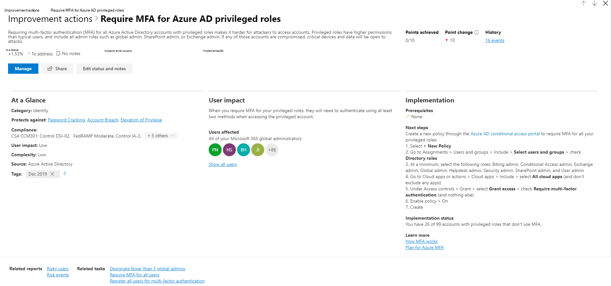

# Puntuación segura de Microsoft (versión preliminar)Microsoft Secure Score (preview)

>[!IMPORTANT]
>Parte de la información se refiere a un producto prelanzamiento que puede modificarse de forma sustancial antes de su lanzamiento comercial.Some information relates to prereleased product which may be substantially modified before it's commercially released. Microsoft makes no warranties, express or implied, with respect to the information provided here.Microsoft makes no warranties, express or implied, with respect to the information provided here.

La calificación segura de Microsoft es una medida de la postura de seguridad de una organización, con un número más alto que indica que se han realizado más acciones de mejora.Microsoft Secure Score is a measurement of an organization's security posture, with a higher number indicating more improvement actions taken. Puede encontrarse en https://security.microsoft.com/securescore el centro de seguridad de Microsoft 365.It can be found at https://security.microsoft.com/securescore in the Microsoft 365 security center.

Seguir las recomendaciones de puntuación de seguridad puede proteger a su organización de las amenazas.Following the Security Score recommendations can protect your organization from threats. Desde un panel centralizado en el centro de seguridad de Microsoft 365, las organizaciones pueden supervisar y trabajar en la seguridad de las identidades, los datos, las aplicaciones, los dispositivos y la infraestructura de Microsoft 365.From a centralized dashboard in the Microsoft 365 security center, organizations can monitor and work on the security of their Microsoft 365 identities, data, apps, devices, and infrastructure.

La puntuación segura ayuda a las organizaciones a:Secure Score helps organizations:  

* Informe sobre el estado actual de la postura de seguridad de la organización.Report on the current state of the organization's security posture.
* Mejorar su postura de seguridad proporcionando detección, visibilidad, orientación y control.Improve their security posture by providing discoverability, visibility, guidance, and control.  
* Comparar con benchmarks y establecer indicadores clave de rendimiento (KPI).Compare with benchmarks and establish key performance indicators (KPIs).

Las organizaciones obtienen acceso a las sólidas visualizaciones de métricas y tendencias, la integración con otros productos de Microsoft, la puntuación con organizaciones similares y mucho más.Organizations gain access to robust visualizations of metrics and trends, integration with other Microsoft products, score comparison with similar organizations, and much more. La puntuación también puede reflejar Cuándo las soluciones de terceros han tratado las acciones recomendadas.The score can also reflect when third-party solutions have addressed recommended actions.

Además, puede obtener acceso a sus recomendaciones y puntuaciones a través de la [API de Microsoft Graph](https://www.microsoft.com/security/partnerships/graph-security-api).Additionally, you can access your recommendations and score through the [Microsoft Graph API](https://www.microsoft.com/security/partnerships/graph-security-api). Obtenga información sobre el [tipo de recurso de puntuación segura](https://go.microsoft.com/fwlink/?linkid=2092996).Learn about the [Secure Score resource type](https://go.microsoft.com/fwlink/?linkid=2092996).

## FuncionamientoHow it works

Se le proporcionan puntos para configurar las características de seguridad recomendadas, realizar tareas relacionadas con la seguridad o resolver la acción de mejora con una aplicación o software de terceros.You are given points for configuring recommended security features, performing security-related tasks, or addressing the improvement action with a third-party application or software. Algunas acciones de mejora solo proporcionan puntos cuando se completan completamente y otras proporcionan puntos parciales si se completan para algunos dispositivos o usuarios.Some improvement actions only give points when fully completed, and some give partial points if they are completed for some devices or users. Si no puede o no desea activar una de las acciones de mejora, puede optar por aceptar el riesgo o el riesgo restante.If you cannot or do not want to enact one of the improvement actions, you can choose to accept the risk or the remaining risk.

Le mostramos el conjunto completo de posibles mejoras, independientemente de la licencia, para que pueda comprender los procedimientos recomendados de seguridad y mejorar su puntuación.We show you the full set of possible improvements, regardless of license, so you can understand security best practices and improve your score. La postura absoluta de seguridad se representa mediante calificación segura, que permanece igual independientemente de las licencias de producto que posea la organización.Your absolute security posture is represented by Secure Score, which stays the same no matter what product licenses your organization owns. Tenga en cuenta que la seguridad debe sopesarse con facilidad de uso y no todas las recomendaciones pueden funcionar en su entorno.Keep in mind that security should be balanced with usability, and not every recommendation can work for your environment.

La puntuación se actualiza en tiempo real para reflejar la información que se presenta en las páginas de acciones de visualización y de mejora.Your score is updated in real time to reflect the information presented in the visualizations and improvement action pages. La puntuación segura también se sincroniza diariamente para recibir datos del sistema sobre los puntos alcanzados para cada acción.Secure Score also syncs daily to receive system data about your achieved points for each action.

### Cómo se puntuan las acciones de mejoraHow improvement actions are scored

Cada acción de mejora merece 10 puntos o menos.Each improvement action is worth 10 points or less. La mayoría se puntuan de una manera binaria: Si implementa la acción de mejora, como crear una nueva Directiva o activar una configuración específica, obtendrá un 100% de los puntos.Most are scored in a binary fashion — if you implement the improvement action, like create a new policy or turn on a specific setting, you get 100% of the points. Para otras acciones de mejora, los puntos se dan como un porcentaje de la configuración total.For other improvement actions, points are given as a percentage of the total configuration. Por ejemplo, si los Estados de acción de mejora obtienen 30 puntos al proteger a todos los usuarios con la autenticación multifactor y solo tiene 5 de 100 usuarios totales protegidos, se le asignará una puntuación parcial de unos 2 puntos (5 protegidos/100 en total \* 30 máx PTS = puntuación parcial de 2 PTO).For example, if the improvement action states you get 30 points by protecting all your users with multi-factor authentication and you only have 5 of 100 total users protected, you would be given a partial score of around 2 points (5 protected / 100 total \* 30 max pts = 2 pts partial score).

### Productos incluidos en la puntuación seguraProducts included in Secure Score

Actualmente hay recomendaciones para Microsoft 365 (como SharePoint Online, Exchange Online, OneDrive para la empresa, Microsoft Information Protection, etc.), Azure AD, ATP de Microsoft defender y Cloud App Security.Currently there are recommendations for Microsoft 365 (including SharePoint Online, Exchange Online, OneDrive for Business, Microsoft Information Protection, and more), Azure AD, Microsoft Defender ATP, and Cloud App Security. Pronto estarán disponibles recomendaciones para otros productos de seguridad.Recommendations for other security products are coming soon. Las recomendaciones no cubren todas las superficies de ataque asociadas con cada producto, pero son una buena línea de base.The recommendations will not cover all the attack surfaces associated with each product, but they are a good baseline. También puede marcar las acciones de mejora como cubiertas por un tercero.You can also mark the improvement actions as covered by a third party.

## Permisos necesariosRequired permissions

Para tener permiso de acceso a la puntuación segura de Microsoft, debe tener asignado uno de los siguientes roles en Azure Active Directory.To have permission to access Microsoft Secure Score, you must be assigned one of the following roles in Azure Active Directory.

### Lectura y escritura de rolesRead and write roles

Con acceso de lectura y escritura, puede realizar cambios e interactuar directamente con la calificación segura.With read and write access, you can make changes and directly interact with Secure Score. También puede asignar acceso de solo lectura a otros usuarios.You can also assign read-only access to other users.

* Administrador globalGlobal administrator
* Administrador de seguridadSecurity administrator
* Administrador de ExchangeExchange administrator
* Administrador de SharePointSharePoint administrator
* Administrador de la cuentaAccount administrator

### Solo lectura rolesRead-only roles

Con acceso de solo lectura, no es posible editar el estado ni las notas para una acción de mejora, editar zonas de puntuación ni editar comparaciones personalizadas.With read-only access, you are not able to edit status or notes for an improvement action, edit score zones, or edit custom comparisons.

* Administrador del servicio de asistenciaHelpdesk administrator
* Administrador de usuariosUser administrator
* Administrador de serviciosService administrator
* Lector de seguridadSecurity reader
* Operador de seguridadSecurity operator
* Lector globalGlobal reader

### API de GraphGraph API

Para obtener acceso a la API de Graph, debe tener uno de los siguientes ámbitos además de un rol:To access the Graph API, you need to have one of the following scopes in addition to a role:

* Ámbito securityevents. Read. All (para roles de solo lectura)SecurityEvents.Read.All (for read-only roles)
* Ámbito securityevents. ReadWrite. All (para roles de lectura y escritura)SecurityEvents.ReadWrite.All (for read and write roles)

## Obtener visibilidad de la postura de seguridadGain visibility into your security posture

Para ayudarle a la información que necesita con mayor rapidez, las acciones de mejora de Microsoft se organizan en grupos:To help you the information you need more quickly, Microsoft improvement actions are organized into groups:

* Identity (cuentas de Azure AD & roles)Identity (Azure AD accounts & roles)
* Datos (Microsoft Information Protection)Data  (Microsoft Information Protection)
* Dispositivo (no hay acciones de mejora por ahora)Device (no improvement actions for now)
* Aplicación (aplicaciones de correo electrónico y nube, incluidos Office 365 y Microsoft Cloud App Security)App (email and cloud apps, including Office 365 and Microsoft Cloud App Security)
* Infraestructura (no hay acciones de mejora por ahora)Infrastructure (no improvement actions for now)

En la página información general sobre la calificación segura de Microsoft, puede ver cómo se dividen los puntos entre estos grupos y qué puntos están disponibles.In the Microsoft Secure Score overview page, you can see how points are split between these groups and what points are available. La página de información general también es la ubicación para obtener una vista completa de la puntuación total, la tendencia histórica de la puntuación segura con comparaciones de los bancos de pruebas y las acciones de mejora ordenadas por prioridad que se pueden realizar para mejorar la puntuación.The overview page is also the place to get an all-up view of the total score, historical trend of your secure score with benchmark comparisons, and prioritized improvement actions that can be taken to improve your score.

puntuación segura*figura 1: Página de introducción a la calificación segura de Microsoft*
*Figure 1: Microsoft Secure Score overview page*

## Tomar medidas para mejorar su puntuaciónTake action to improve your score

La ficha acciones de mejora muestra las recomendaciones de seguridad que abordan las posibles superficies de ataque, junto con su estado (completado, planeado, riesgo aceptado, tercero y dirección de la empresa).The improvement actions tab lists the security recommendations that address possible attack surfaces, along with their status (completed, planned, risk accepted, third party, and to address). Puede buscar, filtrar y agrupar todas las acciones de mejora.You can search, filter, and group all the improvement actions.  

### PorcentajeRanking

La clasificación se basa en el número de puntos restantes que quedan para lograr, la dificultad de implementación, el impacto del usuario y la complejidad.Ranking is based on the number of remaining points left to achieve, implementation difficulty, user impact, and complexity. Las acciones de mejora con mayor jerarquía tienen un gran número de puntos que quedan con problemas, impacto en el usuario y complejidad.The highest ranked improvement actions have a large number of points remaining with low difficulty, user impact, and complexity.

### AccionesActions

Al seleccionar una acción de mejora específica, aparece un elemento flotante de página completa.When you select a specific improvement action, a full page flyout appears.  

de control flotante de acción de mejora*figura 2: ejemplo de control flotante de acción de mejora*
*Figure 2: Improvement action flyout example*

Para completar la acción, tiene algunas opciones:To complete the action, you have a few options:

* Seleccione **administrar** para ir a la pantalla de configuración y realizar el cambio.Select **Manage** to go the configuration screen and make the change. A continuación, obtendrá los puntos que merece la acción, visible en el vuelo hacia fuera. Generalmente, los puntos tardan unas 24 horas en actualizarse.You will then gain the points that the action is worth, visible in the fly out. Points generally take about 24 hours to update.

* Seleccione **compartir** para copiar el vínculo directo a la acción de mejora o elija la plataforma para compartir el vínculo, por ejemplo, correo electrónico, Microsoft Teams, Microsoft Planner o ServiceNow.Select **Share** to copy the direct link to the improvement action, or choose the platform to share the link such as email, Microsoft Teams, Microsoft Planner, or ServiceNow. La selección de ServiceNow le permitirá crear un vale de cambio que será visible en ServiceNow y en la Página principal del centro de seguridad de Microsoft 365.Selecting ServiceNow will let you create a change ticket which will be visible in ServiceNow and the Microsoft 365 security center home. Para obtener más información, consulte [Microsoft 365 Security Center and ServiceNow Integration](tickets.md).To learn more, see [Microsoft 365 Security Center and ServiceNow integration](tickets.md).

* Seleccione **Editar estado y notas** para editar los Estados manuales o registrar las notas específicas para la acción de mejora.Select **Edit status and notes** to edit any manual statuses or record notes specific to the improvement action. Puede filtrar o agrupar por los Estados en la pestaña acciones de mejora. Los statues que puede seleccionar son los siguientesYou can filter or group by the statuses in the improvement actions tab. The statues you can select are the following

    * **Para solucionarlo** , debe reconocer que la acción de mejora es necesaria y planificar para solucionarla en algún momento posterior.**To address** — You recognize that the improvement action is necessary and plan to address it at some point in the future. Este estado también se aplica a las acciones que se detectan como parcialmente, pero que no se completan completamente.This state also applies to actions which are detected as partially, but not fully completed.
    * **Planificado** : hay planes concretos en su ubicación para completar la acción de mejora.**Planned** — There are concrete plans in place to complete the improvement action.
    * **Riesgo aceptado** : la seguridad siempre debe sopesarse con la facilidad de uso y no todas las recomendaciones funcionarán para su entorno.**Risk accepted** — Security should always be balanced with usability, and not every recommendation will work for your environment. En ese caso, puede optar por aceptar el riesgo, o el riesgo restante, y no activar la acción de mejora.When that is the case, you can choose to accept the risk, or the remaining risk, and not enact the improvement action. No se le proporcionarán puntos, pero la acción ya no será visible en la lista de acciones de mejora.You will not be given any points, but the action will no longer be visible in the list of improvement actions. Puede ver esta acción en el historial o deshacerla en cualquier momento.You can view this action in history or undo it at any time.
    * **Resolver a través de terceros** : la acción de mejora ya ha sido tratada por un software o una aplicación de terceros.**Resolve through third party** — The improvement action has already been addressed by a third-party application or software. Obtendrá los puntos que merece la acción, de modo que su puntuación refleje mejor su postura de seguridad general.You will gain the points that the action is worth, so your score better reflects your overall security posture. Si un tercero ya no cubre el control, puede elegir otro Estado.If a third party no longer covers the control, you can choose another status. Tenga en cuenta que Microsoft no tendrá visibilidad sobre la integridad de la implementación si la acción de mejora se ha marcado como resuelta a través de tercerosPlease keep in mind, Microsoft will have no visibility into the completeness of implementation if the improvement action is marked as resolved through third party

### Requisitos previosPrerequisites

Requisitos previos en la sección implementación, enumerará las licencias que se deben obtener o las acciones que deben realizarse antes de que se solucione la acción de mejora.Prerequisites in the Implementation section will list any licenses that need to be obtained or actions that need to be completed before the improvement action is addressed. Asegúrese de que tiene suficientes plazas en la licencia para completar la acción de mejora y de que esas licencias se aplican a los usuarios necesarios.Make sure you have enough seats in your license to complete the improvement action and that those licenses are applied to the necessary users.  

## Realizar un seguimiento del historial de puntuación y cumplir los objetivosTrack your score history and meet goals

Puede ver un gráfico de la puntuación de su organización con el tiempo en la ficha **historial** . debajo del gráfico hay una lista de todas las acciones realizadas en el intervalo de tiempo seleccionado y sus atributos, como puntos y categoría resultantes.You can view a graph of your organization's score over time in the **History** tab. Below the graph is a list of all the actions taken in the selected time range and their attributes, such as resulting points and category. Puede personalizar un intervalo de fechas y filtrar por categoría.You can customize a date range and filter by category.

En la ficha **métricas & tendencias** , hay varios gráficos y gráficos para proporcionar más visibilidad sobre las tendencias y establecer los objetivos.In the **Metrics & trends** tab, there are several graphs and charts to give you more visibility into trends and set goals. Puede establecer el intervalo de fechas para toda la página de visualizaciones.You can set the date range for the whole page of visualizations. Las visualizaciones incluyen:The visualizations include:

* **La zona de puntuación segura** , personalizada en función de los objetivos de la organización y las definiciones de los intervalos de puntuación buenos, correctos y no válidos.**Your Secure Score zone** — Customized based on your organization's goals and definitions of good, okay, and bad score ranges.
* **Tendencia de regresión** : escala de tiempo de puntos que se han regresivo debido a cambios en la configuración, el usuario o el dispositivo.**Regression trend** — A timeline of points that have regressed due to configuration, user, or device changes.  
* **Tendencia de comparación** : cómo se compara la puntuación segura de la organización con las otras personas a lo largo del tiempo.**Comparison trend** — How your organization's Secure Score compares to others' over time. Esta vista puede incluir líneas que representan la media de puntuación de organizaciones con recuento de asientos similar y una vista de comparación personalizada que puede establecer.This view can include lines representing the score average of organizations with similar seat count and a custom comparison view that you can set.
* **Tendencia de aceptación de riesgos** : escala de tiempo de acciones mejoradas marcadas como "riesgo aceptado".**Risk acceptance trend** — Timeline of improvement actions marked as "risk accepted."
* **Cambios de puntuación** : número de puntos alcanzados, puntos de regresión o nuevas acciones agregados, junto con el cambio de puntuación subsiguiente en el intervalo de fechas especificado.**Score changes** — The number of points achieved, points regressed, or new actions added, along with the subsequent score change, in the specified date range.

## Conocimiento de riesgosRisk awareness

La puntuación segura de Microsoft es un resumen numérico de su postura de seguridad en función de las configuraciones del sistema, el comportamiento del usuario y otras medidas relacionadas con la seguridad; no es una medida absoluta de la probabilidad de que se infrinja el sistema o sus datos.Microsoft Secure Score is a numerical summary of your security posture based on system configurations, user behavior and other security related measurements; it is not an absolute measurement of how likely your system or data will be breached. En su lugar, representa en qué medida ha adoptado controles de seguridad en su entorno de Microsoft, lo que puede ayudar a compensar el riesgo de infracciones.Rather, it represents the extent to which you have adopted security controls in your Microsoft environment which can help offset the risk of being breached. Ningún servicio en línea está completamente inmune a las infracciones de seguridad y la puntuación segura no se debe interpretar como una garantía contra la infracción de seguridad de ninguna manera.No online service is completely immune from security breaches, and secure score should not be interpreted as a guarantee against security breach in any manner.

## NovedadesWhat's new? 

Para convertir la puntuación segura de Microsoft en un mejor representante de su postura de seguridad, hemos realizado algunos cambios.To make Microsoft Secure Score a better representative of your security posture, we have made some changes. Para obtener información sobre los cambios planeados, consulte [¿qué viene con la puntuación segura de Microsoft?](microsoft-secure-score-whats-coming.md).To learn about planned changes, see [What's coming in Microsoft Secure Score?](microsoft-secure-score-whats-coming.md).

### 21 de abril de 2020April 21st 2020

#### Se agregaron acciones de mejora de Azure Active DirectoryAdded Azure Active Directory improvement action

- No permitir a los usuarios conceder consentimiento a las aplicaciones no administradas (actualmente disponibles en la versión de lanzamiento)Do not allow users to grant consent to unmanaged applications (currently available in released version)

#### Se agregaron acciones de mejora de protección contra amenazas avanzada de AzureAdded Azure Advanced Threat Protection improvement actions

- Deshabilitar el servicio de cola de impresión en controladores de dominioDisable Print spooler service on domain controllers
- Modificar las delegaciones Kerberos no seguras para impedir la suplantaciónModify unsecure Kerberos delegations to prevent impersonation
- Proteger y administrar contraseñas de administración local con los intervalos de MicrosoftProtect and manage local admin passwords with Microsoft LAPS
- Reducir el riesgo de ruta de movimiento lateral a las entidades confidencialesReduce lateral movement path risk to sensitive entities
- Eliminación de cuentas latentes de grupos confidencialesRemove dormant accounts from sensitive groups
- Quitar atributos del historial SID no seguro de entidadesRemove unsecure SID history attributes from entities
- Resolver atributos de cuenta no seguraResolve unsecure account attributes
- Detener la exposición de credenciales de texto no cifradoStop clear text credentials exposure
- Detener la comunicación de protocolos heredadosStop legacy protocols communication
- Detener el uso de cifrado débilStop weak cipher usage

#### Compatibilidad con las recomendaciones de seguridad de la amenaza ATP de Microsoft defender & Vulnerability Management (TVM)Support for Microsoft Defender ATP Threat & Vulnerability Management (TVM) security recommendations

Todas las recomendaciones de seguridad emitidas suministradas por TVM ya están disponibles.All released security recommendations supplied by TVM are now available.

### Enero a 2020 de marzoJanuary - March 2020

#### Interfaz y funciones actualizadasUpdated interface and functionality

* Todas las nuevas métricas y vistas de tendencias para CISO y discusiones de nivel de liderazgoAll new metrics and trends views for CISO and lead level discussions
* Nuevas formas de realizar un seguimiento y evaluar su puntuaciónNew ways to track and benchmark your score
* Mejor seguimiento y comprensión de las regresiones de puntuaciónBetter tracking and understanding for score regressions
* Filtrar, etiquetar, buscar y agrupar las acciones de mejoraFilter, tag, search, and group your improvement actions
* Administrar hacia sus metas futuras mediante proyecciones de puntuación y acciones planeadasManage towards your future goals using score projections and planned actions
* Y mucho más.And more!

#### Se quitaron las acciones de mejora "sin puntuar" y "revisión"Removed "not scored" and "review" improvement actions

Uno de los principios de la puntuación segura es que la puntuación debe estar estandarizada y ser fácil de relacionar con.One of the principles of Secure Score is that the score should be standardized and easy to relate to. Las acciones de mejora que no se pueden medir o realizar acciones han causado confusión.Having improvement actions that are not measurable or actionable has been causing confusion. Una calificación segura de Microsoft solo tiene sentido cuando cada recomendación puede tener un efecto claro en la puntuación.One Microsoft Secure Score only makes sense when every recommendation can have a clear effect on the score. Las acciones de mejora no puntuadas no se pueden medir y las acciones de mejora de revisión no se miden en el mismo estándar que otras acciones de mejora.Not scored improvement actions are not measurable, and review improvement actions are not measured to the same standard as other improvement actions.

Por estos motivos, todas las acciones de mejora que no se hayan puntuado o requerían una cadencia de revisión se han eliminado temporalmente.For these reasons, all improvement actions that were not scored or required a review cadence have been temporarily removed. No es necesario realizar ninguna acción en su parte.No action is needed on your part.

#### Simplificación del sistema de puntoSimplification of the point system

Para estandarizar puntos en varias experiencias, se ha actualizado el total de puntos de acción de mejora de la puntuación segura para que merezca 10 puntos o menos.To standardize points across multiple experiences, each Secure Score improvement action point total has been updated to be worth 10 points or less. Es necesario ser más coherente en el respire ancho de los controles de seguridad que tenemos hoy y los que se van a agregar en el futuro.It is necessary be more consistent across the wide breather of security controls that we have today and ones that we will be adding in the future. Si bien se trata de un cambio significativo y verá los totales de los puntos de colocación, no habrá cambios en su postura de seguridad.While this is a significant change and you will see a drop in point totals, there will be no change to your security posture.

## Queremos conocer su opiniónWe want to hear from you

Si tiene algún problema, háganoslo saber mediante la publicación de la comunidad de [seguridad, privacidad & cumplimiento](https://techcommunity.microsoft.com/t5/Security-Privacy-Compliance/bd-p/security_privacy) .If you have any issues, please let us know by posting in the [Security, Privacy & Compliance](https://techcommunity.microsoft.com/t5/Security-Privacy-Compliance/bd-p/security_privacy) community. Estamos supervisando la comunidad y le proporcionaremos ayuda.We're monitoring the community and will provide help.
