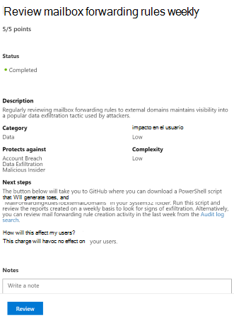

# Puntuación de seguridad de MicrosoftMicrosoft Secure Score

La calificación segura de Microsoft es una medida de la postura de seguridad de una organización, con un número más alto que indica que se han realizado más acciones de mejora.Microsoft Secure Score is a measurement of an organization's security posture, with a higher number indicating more improvement actions taken. Seguir las recomendaciones de puntuación de seguridad puede proteger a su organización de las amenazas.Following the Security Score recommendations can protect your organization from threats. Desde un panel centralizado en el centro de seguridad de Microsoft 365, las organizaciones pueden supervisar y trabajar en la seguridad de las identidades, los datos, las aplicaciones, los dispositivos y la infraestructura de Microsoft 365.From a centralized dashboard in the Microsoft 365 security center, organizations can monitor and work on the security of their Microsoft 365 identities, data, apps, devices, and infrastructure.

La puntuación segura ayuda a las organizaciones a:Secure Score helps organizations:

* Informe sobre el estado actual de la postura de seguridad de la organización.Report on the current state of the organization's security posture.
* Mejorar su postura de seguridad proporcionando detección, visibilidad, orientación y control.Improve their security posture by providing discoverability, visibility, guidance, and control.  
* Comparar con benchmarks y establecer indicadores clave de rendimiento (KPI).Compare with benchmarks and establish key performance indicators (KPIs).

Las organizaciones obtienen acceso a las sólidas visualizaciones de métricas y tendencias, la integración con otros productos de Microsoft, la puntuación con organizaciones similares y mucho más.Organizations gain access to robust visualizations of metrics and trends, integration with other Microsoft products, score comparison with similar organizations, and much more. La puntuación también puede reflejar Cuándo las soluciones de terceros han tratado las acciones recomendadas.The score can also reflect when third-party solutions have addressed recommended actions.

Además, puede obtener acceso a sus recomendaciones y puntuaciones a través de la [API de Microsoft Graph](https://www.microsoft.com/security/partnerships/graph-security-api).Additionally, you can access your recommendations and score through the [Microsoft Graph API](https://www.microsoft.com/security/partnerships/graph-security-api). Obtenga información sobre el [tipo de recurso de puntuación segura](https://go.microsoft.com/fwlink/?linkid=2092996).Learn about the [Secure Score resource type](https://go.microsoft.com/fwlink/?linkid=2092996).

## FuncionamientoHow it works

Se le proporcionan puntos para configurar las características de seguridad recomendadas, realizar tareas relacionadas con la seguridad (como ver informes) o solucionar la acción de mejora con una aplicación o un software de terceros.You are given points for configuring recommended security features, performing security-related tasks (such as viewing reports), or addressing the improvement action with a third-party application or software. Algunas acciones de mejora solo proporcionan puntos cuando se completan completamente y otras proporcionan puntos parciales si se completan para algunos dispositivos o usuarios.Some improvement actions only give points when fully completed, and some give partial points if they are completed for some devices or users.

Le mostramos el conjunto completo de posibles mejoras, independientemente de la licencia, para que pueda comprender los procedimientos recomendados de seguridad y mejorar su puntuación.We show you the full set of possible improvements, regardless of license, so you can understand security best practices and improve your score. La postura absoluta de seguridad se representa mediante calificación segura, que permanece igual independientemente de las licencias de producto que posea la organización.Your absolute security posture is represented by Secure Score, which stays the same no matter what product licenses your organization owns. Tenga en cuenta que la seguridad debe sopesarse con facilidad de uso y no todas las recomendaciones pueden funcionar en su entorno.Keep in mind that security should be balanced with usability, and not every recommendation can work for your environment.

La puntuación se actualiza en tiempo real para reflejar la información que se presenta en las páginas de acciones de visualización y de mejora.Your score is updated in real time to reflect the information presented in the visualizations and improvement action pages. La puntuación segura también se sincroniza diariamente para recibir datos del sistema sobre los puntos alcanzados para cada acción.Secure Score also syncs daily to receive system data about your achieved points for each action.

### Cómo se puntuan las acciones de mejoraHow improvement actions are scored

La mayoría se puntuan de una manera binaria: Si implementa la acción de mejora, como crear una nueva Directiva o activar una configuración específica, obtendrá un 100% de los puntos.Most are scored in a binary fashion — if you implement the improvement action, like create a new policy or turn on a specific setting, you get 100% of the points. Para otras acciones de mejora, los puntos se dan como un porcentaje de la configuración total.For other improvement actions, points are given as a percentage of the total configuration. Por ejemplo, si los Estados de acción de mejora obtienen 30 puntos al proteger a todos los usuarios con la autenticación multifactor y solo tiene 5 de 100 usuarios totales protegidos, se le asignará una puntuación parcial de unos 2 puntos (5 protegidos/100 en total \* 30 máx PTS = puntuación parcial de 2 PTO).For example, if the improvement action states you get 30 points by protecting all your users with multi-factor authentication and you only have 5 of 100 total users protected, you would be given a partial score of around 2 points (5 protected / 100 total \* 30 max pts = 2 pts partial score).

### Productos incluidos en la puntuación seguraProducts included in Secure Score

Actualmente hay recomendaciones para Office 365 (como SharePoint Online, Exchange Online, OneDrive para la empresa, Microsoft Information Protection, etc.), Azure AD y Cloud App Security.Currently there are recommendations for Office 365 (including SharePoint Online, Exchange Online, OneDrive for Business, Microsoft Information Protection, and more), Azure AD, and Cloud App Security. Pronto estarán disponibles recomendaciones para otros productos de seguridad, como ATP de Azure y ATP de Microsoft defender.Recommendations for other security products, like Azure ATP and Microsoft Defender ATP, are coming soon. Las recomendaciones no cubren todas las superficies de ataque asociadas con cada producto, pero son una buena línea de base.The recommendations will not cover all the attack surfaces associated with each product, but they are a good baseline. También puede marcar las acciones de mejora como cubiertas por un tercero.You can also mark the improvement actions as covered by a third party.

## Permisos necesariosRequired permissions

Para tener permiso de acceso a la puntuación segura de Microsoft, debe tener asignado uno de los siguientes roles en Azure Active Directory.To have permission to access Microsoft Secure Score, you must be assigned one of the following roles in Azure Active Directory.

### Lectura y escritura de rolesRead and write roles

Con acceso de lectura y escritura, puede realizar cambios e interactuar directamente con la calificación segura.With read and write access, you can make changes and directly interact with Secure Score. También puede asignar acceso de solo lectura a otros usuarios.You can also assign read-only access to other users.

* Administrador globalGlobal administrator
* Administrador de seguridadSecurity administrator
* Administrador de ExchangeExchange administrator
* Administrador de SharePointSharePoint administrator
* Administrador de la cuentaAccount administrator

### Solo lectura rolesRead-only roles

Con acceso de solo lectura, no es posible editar el estado ni las notas para una acción de mejora, editar zonas de puntuación ni editar comparaciones personalizadas.With read-only access, you are not able to edit status or notes for an improvement action, edit score zones, or edit custom comparisons.

* Administrador del servicio de asistenciaHelpdesk administrator
* Administrador de usuariosUser administrator
* Administrador de serviciosService administrator
* Lector de seguridadSecurity reader
* Operador de seguridadSecurity operator
* Lector globalGlobal reader

### API de GraphGraph API

Para obtener acceso a la API de Graph, debe tener uno de los siguientes ámbitos además de un rol:To access the Graph API, you need to have one of the following scopes in addition to a role:

* Ámbito securityevents. Read. All (para rol de solo lectura)SecurityEvents.Read.All (for read-only role)
* Ámbito securityevents. ReadWrite. All (para funciones de lectura y escritura)SecurityEvents.ReadWrite.All (for read and write role)

## Obtener visibilidad de la postura de seguridadGain visibility into your security posture

Para ayudarle a la información que necesita con mayor rapidez, las acciones de mejora de Microsoft se organizan en grupos:To help you the information you need more quickly, Microsoft improvement actions are organized into groups:

* Identity (cuentas de Azure AD & roles)Identity (Azure AD accounts & roles)
* Datos (Microsoft Information Protection)Data  (Microsoft Information Protection)
* Dispositivo (no hay acciones de mejora por ahora)Device (no improvement actions for now)
* Aplicación (aplicaciones de correo electrónico y nube, incluidos Office 365 y Microsoft Cloud App Security)App (email and cloud apps, including Office 365 and Microsoft Cloud App Security)
* Infraestructura (no hay acciones de mejora por ahora)Infrastructure (no improvement actions for now)

En la página información general sobre la calificación segura de Microsoft, puede ver cómo se dividen los puntos entre estos grupos y qué puntos están disponibles.In the Microsoft Secure Score overview page, you can see how points are split between these groups and what points are available. La página de información general también es la ubicación para obtener una vista completa de la puntuación total, la tendencia histórica de la puntuación segura con comparaciones de los bancos de pruebas y las acciones de mejora ordenadas por prioridad que se pueden realizar para mejorar la puntuación.The overview page is also the place to get an all-up view of the total score, historical trend of your secure score with benchmark comparisons, and prioritized improvement actions that can be taken to improve your score.

puntuación segura*figura 1: Página de introducción a la calificación segura de Microsoft*
*Figure 1: Microsoft Secure Score overview page*

## Tomar medidas para mejorar su puntuaciónTake action to improve your score

La ficha acciones de mejora enumera las recomendaciones de seguridad que se redirigen a posibles superficies de ataque, junto con su estado (completado, no completado, resuelto a través de terceros y omitidos).The improvement actions tab lists the security recommendations that address possible attack surfaces, along with their status (completed, not completed, resolved through third party, and ignored). Puede buscar, filtrar y agrupar todas las acciones de mejora.You can search, filter, and group all the improvement actions.

### PorcentajeRanking

La clasificación se basa en el número de puntos restantes que quedan para lograr, la dificultad de implementación, el impacto del usuario y la complejidad.Ranking is based on the number of remaining points left to achieve, implementation difficulty, user impact, and complexity. Las acciones de mejora con mayor jerarquía tienen un gran número de puntos que quedan con problemas, impacto en el usuario y complejidad.The highest ranked improvement actions have a large number of points remaining with low difficulty, user impact, and complexity.

### AccionesActions

La puntuación segura de Microsoft no realiza un seguimiento de las acciones etiquetadas como [no puntuadas].Actions labeled as [Not Scored] are not tracked by Microsoft Secure Score. Puede seguir realizando acciones pero su finalización no afectará a su calificación.You can still take action but completing them will not affect your score. Si una acción hace un seguimiento de la puntuación segura de Microsoft en el futuro y ya la ha completado, la puntuación segura reflejará automáticamente el cambio.If an action becomes tracked by Microsoft Secure Score in the future and you have already completed it, your secure score will automatically reflect the change.

Cuando se selecciona una acción de mejora específica, aparece una volar hacia fuera.When you select a specific improvement action, a fly out appears. Para completar la acción, tiene algunas opciones:To complete the action, you have a few options:

1. Seleccione **Ver configuración** para ir a la pantalla de configuración y realizar el cambio.Select **View settings** to go the configuration screen and make the change. A continuación, puede obtener los puntos que merece la acción, visible en la parte superior de la volando. Los puntos pueden tardar hasta 24 horas en actualizarse.You then gain the points that the action is worth, visible at the top of the fly out. Points may take up to 24 hours to update.

2. Seleccione **resolver a través de terceros** porque la acción de mejora ya ha sido tratada por una aplicación o software de terceros.Select **Resolve through third party** because the improvement action has already been addressed by a third-party application or software. Usted obtiene los puntos que merece la acción, de modo que la puntuación segura refleje mejor su postura de seguridad general.You gain the points that the action is worth, so your secure score better reflects your overall security posture. Si un tercero ya no cubre el control, puede marcar la acción de mejora como no completada.If a third party no longer covers the control, you can mark the improvement action as not complete. Tenga en cuenta que Microsoft no tiene ninguna visibilidad sobre si se han cumplido los requisitos de puntuación si la acción de mejora se ha marcado como resuelta a través de terceros.Keep in mind, Microsoft has no visibility into whether the score requirements have been met if the improvement action is marked as resolved through third party.

3. Seleccione **omitir** porque decidió aceptar el riesgo y no pasar la acción de mejora.Select **Ignore** because you have decided to accept the risk and not enact the improvement action. Una vez que ignore una acción de mejora, se reducirá el número total de puntos de calificación seguros que puede lograr.Once you ignore an improvement action, the total number of secure score points you can achieve is reduced. Puede ver esta acción en el historial o deshacerla en cualquier momento.You can view this action in history or undo it at any time.

4. Seleccione **revisar** porque la acción de mejora requiere que Revise regularmente una parte del entorno para obtener y conservar puntos.Select **Review** because the improvement action requires you to regularly review a part of your environment to gain and retain points. Por ejemplo, las reglas de reenvío de buzones deben revisarse cada semana para asegurarse de que los datos no se están exfiltrando desde la red.For example, mailbox forwarding rules should be reviewed on a weekly basis to make sure data is not being exfiltrated from your network. No es necesario realizar ningún cambio, pero se debe realizar una acción.You do not need to make any changes, but an action will need to be performed. Si revisa las reglas con regularidad, recibirá los puntos.If you regularly review the rules, you will receive the points. Si no es así, se reduce el resultado.If not, the score is reduced.

 

*Figuras 2 & 3: controles flotantes de acciones de mejora**Figures 2 & 3: Improvement action flyouts*

## Supervisar las mejoras a lo largo del tiempoMonitor improvements over time

Puede ver un gráfico de la puntuación de su organización con el tiempo en la ficha **historial** . debajo del gráfico hay una lista de todas las acciones realizadas en el intervalo de tiempo seleccionado y sus atributos, como puntos y categoría resultantes.You can view a graph of your organization's score over time in the **History** tab. Below the graph is a list of all the actions taken in the selected time range and their attributes, such as resulting points and category. Puede personalizar un intervalo de fechas y filtrar por categoría.You can customize a date range and filter by category.

## Conocimiento de riesgosRisk awareness

La puntuación segura de Microsoft es un resumen numérico de la postura de seguridad en función de las configuraciones del sistema, el comportamiento del usuario y otras medidas relacionadas con la seguridad; no es una medida absoluta de la probabilidad de que se infrinja el sistema o sus datos.Microsoft Secure Score is a numerical summary of your security posture based on system configurations, user behavior and other security-related measurements; it is not an absolute measurement of how likely your system or data will be breached. En su lugar, representa en qué medida ha adoptado controles de seguridad en su entorno de Microsoft, lo que puede ayudar a compensar el riesgo de infracciones.Rather, it represents the extent to which you have adopted security controls in your Microsoft environment which can help offset the risk of being breached. Ningún servicio en línea está completamente inmune a las infracciones de seguridad y la puntuación segura no se debe interpretar como una garantía contra la infracción de seguridad de ninguna manera.No online service is completely immune from security breaches, and secure score should not be interpreted as a guarantee against security breach in any manner.

## ¿Hay alguna novedad?What's new?

Para hacer que Microsoft califique de forma segura sea un mejor representante de su postura de seguridad, hemos realizado algunos cambios.To make Microsoft Secure Score a better representative of your security posture we have made some changes. Para obtener información sobre los cambios planeados, consulte [¿qué viene con la puntuación segura de Microsoft?](microsoft-secure-score-whats-coming.md)To learn about planned changes, see [What's coming in Microsoft Secure Score?](microsoft-secure-score-whats-coming.md)

### Enero a 2020 de marzoJanuary - March 2020

#### Compatibilidad con los valores predeterminados de seguridad para acciones de mejora de Azure ADSupporting security defaults for Azure AD improvement actions

La calificación segura de Microsoft actualizará las acciones de mejora para admitir los [valores predeterminados de seguridad en Azure ad](https://docs.microsoft.com/azure/active-directory/fundamentals/concept-fundamentals-security-defaults), que facilitan la protección de la organización con opciones de seguridad preconfiguradas para ataques comunes.Microsoft Secure Score will be updating improvement actions to support [security defaults in Azure AD](https://docs.microsoft.com/azure/active-directory/fundamentals/concept-fundamentals-security-defaults), which make it easier to help protect your organization with pre-configured security settings for common attacks.

Afectará a las siguientes acciones de mejora:It will affect the following improvement actions:

- Asegurarse de que todos los usuarios puedan completar la autenticación multifactor para el acceso seguroEnsure all users can complete multi-factor authentication for secure access
- Requerir MFA para roles administrativosRequire MFA for administrative roles
- Habilitar la Directiva para bloquear la autenticación heredadaEnable policy to block legacy authentication

#### Se quitaron las acciones de mejora que no cumplen las expectativas para una medición fiable o no proporcionan una representación útil de la postura de seguridadRemoved improvement actions that don't meet expectations for reliable measurement or don't provide a useful representation of security posture

Para asegurarse de que la puntuación segura de Microsoft es significativa y que cada acción de mejora es medible y confiable, se quitan las siguientes acciones de mejora.To ensure that the Microsoft Secure Score is meaningful and that every improvement action is measurable and reliable, we are removing the following improvement actions.

- Almacenar documentos de usuario en OneDrive para la empresaStore user documents in OneDrive for Business
- Configurar las directivas de datos adjuntos seguros de Office 365 ATPSet up Office 365 ATP Safe Attachment policies
- Configurar vínculos seguros de Office 365 para comprobar direcciones URLSet up Office 365 Safe Links to verify URLs
- No permitir la delegación de buzonesDo not allow mailbox delegation
- Permitir vínculos de uso compartido de invitados anónimos para sitios y documentosAllow anonymous guest sharing links for sites and docs
- Activar la consola de Cloud App SecurityTurn on Cloud App Security Console
- Configurar el tiempo de expiración de los vínculos de uso compartido externoConfigure expiration time for external sharing links
- Activar la grabación de datos de auditoríaTurn on audit data recording
- Descubra aplicaciones de TI de instantáneas arriesgadas y no compatiblesDiscover risky and non-compliant shadow IT applications
- Revisión de permisos & bloquear aplicaciones de OAuth arriesgadas conectadas a su entornoReview permissions & block risky OAuth applications connected to your environment
- Configurar el control de versiones en las bibliotecas de documentos de SharePoint OnlineSet up versioning on SharePoint online document libraries
- Eliminar o bloquear cuentas no usadas en los últimos 30 díasDelete/block accounts not used in last 30 days
- Designar menos de 5 administradores globalesDesignate fewer than 5 global admins

#### Acciones de mejora "sin puntuar" quitadasRemoved "not scored" improvement actions

Uno de los principios de la puntuación segura es que la puntuación debe estar estandarizada y ser fácil de relacionar con.One of the principles of Secure Score is that the score should be standardized and easy to relate to. Las acciones de mejora que no se pueden medir o realizar acciones han causado confusión.Having improvement actions that are not measurable or actionable has been causing confusion. La puntuación segura de Microsoft solo tiene sentido cuando cada recomendación puede tener un efecto claro en la puntuación.Microsoft Secure Score only makes sense when every recommendation can have a clear effect on the score. Las acciones de mejora no puntuadas no se pueden medir.Not scored improvement actions are not measurable.  

Por estos motivos, se han eliminado todas las acciones de mejora que no se han puntuado.For these reasons, all improvement actions that were not scored have been removed. No es necesario realizar ninguna acción en su parte.No action is needed on your part.

#### Acciones de mejora de dispositivo quitadasRemoved device improvement actions

Después de una evaluación de las acciones de mejora de la categoría del dispositivo de puntuación segura de Microsoft, se determinó que esas acciones evalúan actualmente el estado de la Directiva y no el estado de configuración de los dispositivos.After an evaluation of the Microsoft Secure Score device category of improvement actions, it was determined that those actions currently assess the policy state and not the configuration state of devices. Dado que la configuración está directamente ligada a la postura de seguridad, las acciones de dispositivo existentes se determinaron para no representar completamente la postura organizativa.Since configuration is directly tied to security posture, the existing device actions were determined to not fully represent organizational posture.  Se quitarán las acciones actuales de la categoría de dispositivos mientras trabajamos para proporcionar un conjunto de recomendaciones que usen directamente datos de diagnóstico para representar de forma más completa la seguridad del dispositivo.We will be removing the current actions in the device category as we work to provide a set of recommendations which directly use diagnostic data to more fully represent device security posture.

Se han quitado las siguientes acciones de mejora:The following improvement actions have been removed:

- Habilitar la administración de dispositivos móviles de Microsoft IntuneEnable Microsoft Intune Mobile Device Management
- Crear una directiva de cumplimiento de Microsoft Intune para AndroidCreate a Microsoft Intune Compliance Policy for Android
- Crear una directiva de cumplimiento de Microsoft Intune para Android para trabajarCreate a Microsoft Intune Compliance Policy for Android for Work
- Crear una directiva de protección de aplicaciones de Microsoft Intune para AndroidCreate a Microsoft Intune App Protection Policy for Android
- Crear una directiva de protección de aplicaciones de Microsoft Intune para iOSCreate a Microsoft Intune App Protection Policy for iOS
- Marcar dispositivos sin directiva de cumplimiento de Microsoft Intune asignada como no compatibleMark devices with no Microsoft Intune Compliance Policy assigned as not compliant
- Crear una directiva de cumplimiento de Microsoft Intune para iOSCreate a Microsoft Intune Compliance Policy for iOS
- Crear una directiva de cumplimiento de Microsoft Intune para macOSCreate a Microsoft Intune Compliance Policy for macOS
- Crear una directiva de cumplimiento de Microsoft Intune para WindowsCreate a Microsoft Intune Compliance Policy for Windows
- Crear un perfil de configuración de Microsoft Intune para AndroidCreate a Microsoft Intune Configuration Profile for Android
- Crear un perfil de configuración de Microsoft Intune para Android para trabajarCreate a Microsoft Intune Configuration Profile for Android for Work
- Crear un perfil de configuración de Microsoft Intune para macOSCreate a Microsoft Intune Configuration Profile for macOS
- Crear un perfil de configuración de Microsoft Intune para iOSCreate a Microsoft Intune Configuration Profile for iOS
- Crear un perfil de configuración de Microsoft Intune para WindowsCreate a Microsoft Intune Configuration Profile for Windows
- Habilitar la detección de jailbreak mejorada en Microsoft IntuneEnable enhanced jailbreak detection in Microsoft Intune
- Requerir que todos los dispositivos sean revisados, tengan antivirus y firewalls habilitadosRequire all devices to be patched, have anti-virus, and firewalls enabled
- Habilitar la integración de ATP de Windows Defender en Microsoft IntuneEnable Windows Defender ATP integration into Microsoft Intune
- Crear una directiva de Windows Information Protection para Microsoft IntuneCreate a Microsoft Intune Windows Information Protection Policy
- Requerir que todos los dispositivos tengan configuraciones de seguridad avanzadaRequire all devices to have advanced security configurations
- Revisar semanalmente el informe de dispositivos bloqueadosReview blocked devices report weekly

#### Actualizaciones de acciones de mejora de MFAMFA improvement action updates

Para reflejar la necesidad de las empresas de garantizar la máxima seguridad al aplicar las directivas que funcionan con su negocio, la calificación segura de Microsoft ha quitado tres acciones de mejora centradas en la autenticación multifactor y ha agregado dos.To reflect the need for businesses to ensure the upmost security while applying policies that work with their business, Microsoft Secure Score has removed three improvement actions centered around multi-factor authentication, and added two.

Se quitaron las acciones de mejora:Removed improvement actions:

- Registrar todos los usuarios para la autenticación multifactorRegister all users for multi-factor authentication
- Requerir MFA para todos los usuariosRequire MFA for all users
- Requerir MFA para los roles privilegiados de Azure ADRequire MFA for Azure AD privileged roles

Se agregaron acciones de mejora:Added improvement actions:

- Asegurarse de que todos los usuarios puedan completar la autenticación multifactor para el acceso seguroEnsure all users can complete multi-factor authentication for secure access
- Requerir MFA para roles administrativosRequire MFA for administrative roles

 Estas nuevas acciones de mejora requieren el registro de los usuarios o administradores para la autenticación multifactor (MFA) en el directorio y el establecimiento del conjunto adecuado de directivas que se adapten a las necesidades de la organización.These new improvement actions require registering your users or admins for multi-factor authentication (MFA) across your directory and establishing the right set of policies that fit your organizational needs. El objetivo principal es tener flexibilidad a la vez que se asegura de que todos los usuarios y administradores puedan autenticarse con varios factores o solicitudes de verificación de identidad basadas en riesgos.The main goal is have flexibility while ensuring all your users and admins can authenticate with multiple factors or risk-based identity verification prompts. Esto puede tener la forma de tener varias directivas que apliquen decisiones en el ámbito o establecer los valores predeterminados de seguridad (desde el 16 de marzo) que permitan a Microsoft decidir cuándo debe desafiar a los usuarios para MFA.That can take the form of having multiple policies that apply scoped decisions, or setting security defaults (coming March 16th) that let Microsoft decide when to challenge users for MFA.

#### Se quitaron las acciones de mejora de revisiónRemoved "review" improvement actions

Uno de los principios de la puntuación segura es que la puntuación debe estar estandarizada y ser fácil de relacionar con.One of the principles of Secure Score is that the score should be standardized and easy to relate to. Las acciones de mejora que no se pueden medir o realizar acciones han causado confusión.Having improvement actions that are not measurable or actionable has been causing confusion. Una calificación segura de Microsoft solo tiene sentido cuando cada recomendación puede tener un efecto claro en la puntuación.One Microsoft Secure Score only makes sense when every recommendation can have a clear effect on the score. Revisión las acciones de mejora no se miden en el mismo estándar que otras acciones de mejora.Review improvement actions are not measured to the same standard as other improvement actions.  

Por estos motivos, todas las acciones de mejora que requerían una cadencia de revisión se han eliminado temporalmente.For these reasons, all improvement actions that required a review cadence have been temporarily removed. No es necesario realizar ninguna acción en su parte.No action is needed on your part.

### Versión preliminar de las característicasPreview features

Las siguientes características se incluirán en la [versión preliminar](microsoft-secure-score-preview.md):The following features will be included in the [preview release](microsoft-secure-score-preview.md):

* Todas las nuevas métricas y vistas de tendencias para CISO y discusiones de nivel de liderazgoAll new metrics and trends views for CISO and lead level discussions
* Nuevas formas de realizar un seguimiento y evaluar su puntuaciónNew ways to track and benchmark your score
* Mejor seguimiento y supervisión de regresiones de puntuaciónBetter tracking and monitoring for score regressions
* Filtrar, etiquetar, buscar y agrupar las acciones de mejoraFilter, tag, search, and group your improvement actions
* Administrar hacia sus metas futuras mediante proyecciones de puntuación y acciones planeadasManage towards your future goals using score projections and planned actions
* Simplificación del sistema de puntosSimplification of the points system
* Y mucho más.And more!

## Queremos conocer su opiniónWe want to hear from you

Si tiene algún problema, háganoslo saber mediante la publicación de la comunidad de [seguridad, privacidad & cumplimiento](https://techcommunity.microsoft.com/t5/Security-Privacy-Compliance/bd-p/security_privacy) .If you have any issues, please let us know by posting in the [Security, Privacy & Compliance](https://techcommunity.microsoft.com/t5/Security-Privacy-Compliance/bd-p/security_privacy) community. Estamos supervisando la comunidad y le proporcionaremos ayuda.We're monitoring the community and will provide help.
