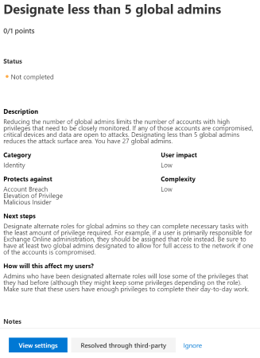

# Puntuación de seguridad de Microsoft

La calificación segura de Microsoft es una medida de la postura de seguridad de una organización, con un número más alto que indica que se han realizado más acciones de mejora. Seguir las recomendaciones de puntuación de seguridad puede proteger a su organización de las amenazas. Desde un panel centralizado en el centro de seguridad de Microsoft 365, las organizaciones pueden supervisar y trabajar en la seguridad de las identidades, los datos, las aplicaciones, los dispositivos y la infraestructura de Microsoft 365.

La puntuación segura ayuda a las organizaciones a:

* Informe sobre el estado actual de la postura de seguridad de la organización.
* Mejorar su postura de seguridad proporcionando detección, visibilidad, orientación y control.  
* Comparar con benchmarks y establecer indicadores clave de rendimiento (KPI).

Las organizaciones obtienen acceso a las sólidas visualizaciones de métricas y tendencias, la integración con otros productos de Microsoft, la puntuación con organizaciones similares y mucho más. La puntuación también puede reflejar Cuándo las soluciones de terceros han tratado las acciones recomendadas.

Además, puede obtener acceso a sus recomendaciones y puntuaciones a través de la [API de Microsoft Graph](https://www.microsoft.com/security/partnerships/graph-security-api). Obtenga información sobre el [tipo de recurso de puntuación segura](https://go.microsoft.com/fwlink/?linkid=2092996).

## Cómo funciona

Se le proporcionan puntos para configurar las características de seguridad recomendadas, realizar tareas relacionadas con la seguridad (como ver informes) o solucionar la acción de mejora con una aplicación o un software de terceros. Algunas acciones de mejora solo proporcionan puntos cuando se completan completamente y otras proporcionan puntos parciales si se completan para algunos dispositivos o usuarios.

Le mostramos el conjunto completo de posibles mejoras, independientemente de la licencia, para que pueda comprender los procedimientos recomendados de seguridad y mejorar su puntuación. La postura absoluta de seguridad se representa mediante calificación segura, que permanece igual independientemente de las licencias de producto que posea la organización. Tenga en cuenta que la seguridad debe sopesarse con facilidad de uso y no todas las recomendaciones pueden funcionar en su entorno.

La puntuación se actualiza en tiempo real para reflejar la información que se presenta en las páginas de acciones de visualización y de mejora. La puntuación segura también se sincroniza diariamente para recibir datos del sistema sobre los puntos alcanzados para cada acción.

### Cómo se puntuan las acciones de mejora

La mayoría se puntuan de una manera binaria: Si implementa la acción de mejora, como crear una nueva Directiva o activar una configuración específica, obtendrá un 100% de los puntos. Para otras acciones de mejora, los puntos se dan como un porcentaje de la configuración total. Por ejemplo, si los Estados de acción de mejora obtienen 30 puntos al proteger a todos los usuarios con la autenticación multifactor y solo tiene 5 de 100 usuarios totales protegidos, se le asignará una puntuación parcial de unos 2 puntos (5 protegidos/100 en total * 30 máx PTS = puntuación parcial de 2 PTO).

### Productos incluidos en la puntuación segura

Actualmente hay recomendaciones para Office 365 (como SharePoint Online, Exchange Online, OneDrive para la empresa, Microsoft Information Protection, etc.), Azure AD y Cloud App Security. Pronto estarán disponibles recomendaciones para otros productos de seguridad, como ATP de Azure y ATP de Microsoft defender. Las recomendaciones no cubren todas las superficies de ataque asociadas con cada producto, pero son una buena línea de base. También puede marcar las acciones de mejora como cubiertas por un tercero.

## Permisos necesarios

Para tener permiso de acceso a la puntuación segura de Microsoft, debe tener asignado uno de los siguientes roles en Azure Active Directory.

### Lectura y escritura de roles

Con acceso de lectura y escritura, puede realizar cambios e interactuar directamente con la calificación segura. También puede asignar acceso de solo lectura a otros usuarios.

* Administrador global
* Administrador de seguridad
* Administrador de Exchange
* Administrador de SharePoint
* Administrador de la cuenta

### Solo lectura roles

Con acceso de solo lectura, no es posible editar el estado ni las notas para una acción de mejora, editar zonas de puntuación ni editar comparaciones personalizadas.

* Administrador del servicio de asistencia
* Administrador de usuarios
* Administrador de servicios
* Lector de seguridad
* Operador de seguridad
* Lector global

### API de Graph

Para obtener acceso a la API de Graph, debe tener uno de los siguientes ámbitos además de un rol:

* Ámbito securityevents. Read. All (para rol de solo lectura)
* Ámbito securityevents. ReadWrite. All (para funciones de lectura y escritura)

## Obtener visibilidad de la postura de seguridad

Para ayudarle a la información que necesita con mayor rapidez, las acciones de mejora de Microsoft se organizan en grupos:

* Identity (cuentas de Azure AD & roles)
* Datos (Microsoft Information Protection)
* Dispositivo (no hay acciones de mejora por ahora)
* Aplicación (aplicaciones de correo electrónico y nube, incluidos Office 365 y Microsoft Cloud App Security)
* Infraestructura (no hay acciones de mejora por ahora)

En la página información general sobre la calificación segura de Microsoft, puede ver cómo se dividen los puntos entre estos grupos y qué puntos están disponibles. La página de información general también es la ubicación para obtener una vista completa de la puntuación total, la tendencia histórica de la puntuación segura con comparaciones de los bancos de pruebas y las acciones de mejora ordenadas por prioridad que se pueden realizar para mejorar la puntuación.

puntuación segura*figura 1: Página de introducción a la calificación segura de Microsoft*

## Tomar medidas para mejorar su puntuación

La ficha acciones de mejora enumera las recomendaciones de seguridad que se redirigen a posibles superficies de ataque, junto con su estado (completado, no completado, resuelto a través de terceros y omitidos). Puede buscar, filtrar y agrupar todas las acciones de mejora.

### Porcentaje

La clasificación se basa en el número de puntos restantes que quedan para lograr, la dificultad de implementación, el impacto del usuario y la complejidad. Las acciones de mejora con mayor jerarquía tienen un gran número de puntos que quedan con problemas, impacto en el usuario y complejidad.

### Acciones

La puntuación segura de Microsoft no realiza un seguimiento de las acciones etiquetadas como [no puntuadas]. Puede seguir realizando acciones pero su finalización no afectará a su calificación. Si una acción hace un seguimiento de la puntuación segura de Microsoft en el futuro y ya la ha completado, la puntuación segura reflejará automáticamente el cambio.

Cuando se selecciona una acción de mejora específica, aparece una volar hacia fuera. Para completar la acción, tiene algunas opciones:

1. Seleccione **Ver configuración** para ir a la pantalla de configuración y realizar el cambio. A continuación, puede obtener los puntos que merece la acción, visible en la parte superior de la volando. Los puntos pueden tardar hasta 24 horas en actualizarse.

2. Seleccione **resolver a través de terceros** porque la acción de mejora ya ha sido tratada por una aplicación o software de terceros. Usted obtiene los puntos que merece la acción, de modo que la puntuación segura refleje mejor su postura de seguridad general. Si un tercero ya no cubre el control, puede marcar la acción de mejora como no completada. Tenga en cuenta que Microsoft no tiene ninguna visibilidad sobre si se han cumplido los requisitos de puntuación si la acción de mejora se ha marcado como resuelta a través de terceros.

3. Seleccione **omitir** porque decidió aceptar el riesgo y no pasar la acción de mejora. Una vez que ignore una acción de mejora, se reducirá el número total de puntos de calificación seguros que puede lograr. Puede ver esta acción en el historial o deshacerla en cualquier momento.

4. Seleccione **revisar** porque la acción de mejora requiere que Revise regularmente una parte del entorno para obtener y conservar puntos. Por ejemplo, las reglas de reenvío de buzones deben revisarse cada semana para asegurarse de que los datos no se están exfiltrando desde la red. No es necesario realizar ningún cambio, pero se debe realizar una acción. Si revisa las reglas con regularidad, recibirá los puntos. Si no es así, se reduce el resultado.

 

*Figuras 2 & 3: controles flotantes de acciones de mejora*

## Supervisar las mejoras a lo largo del tiempo

Puede ver un gráfico de la puntuación de su organización con el tiempo en la ficha **historial** . debajo del gráfico hay una lista de todas las acciones realizadas en el intervalo de tiempo seleccionado y sus atributos, como puntos y categoría resultantes. Puede personalizar un intervalo de fechas y filtrar por categoría.

## Conocimiento de riesgos

La puntuación segura de Microsoft es un resumen numérico de la postura de seguridad en función de las configuraciones del sistema, el comportamiento del usuario y otras medidas relacionadas con la seguridad; no es una medida absoluta de la probabilidad de que se infrinja el sistema o sus datos. En su lugar, representa en qué medida ha adoptado controles de seguridad en su entorno de Microsoft, lo que puede ayudar a compensar el riesgo de infracciones. Ningún servicio en línea está completamente inmune a las infracciones de seguridad y la puntuación segura no se debe interpretar como una garantía contra la infracción de seguridad de ninguna manera.

## Novedades

Para hacer que Microsoft califique de forma segura sea un mejor representante de su postura de seguridad, hemos realizado algunos cambios.

Para obtener información sobre los cambios planeados, consulte [¿qué viene con la puntuación segura de Microsoft?](microsoft-secure-score-whats-coming.md)

### Marzo de 2020

#### Compatibilidad con los valores predeterminados de seguridad para acciones de mejora de Azure AD

La calificación segura de Microsoft actualizará las acciones de mejora para admitir los [valores predeterminados de seguridad en Azure ad](https://docs.microsoft.com/azure/active-directory/fundamentals/concept-fundamentals-security-defaults), que facilitan la protección de la organización con opciones de seguridad preconfiguradas para ataques comunes.

Afectará a las siguientes acciones de mejora:

- Asegurarse de que todos los usuarios puedan completar la autenticación multifactor para el acceso seguro
- Requerir MFA para roles administrativos
- Habilitar la Directiva para bloquear la autenticación heredada

#### Se quitaron las acciones de mejora que no cumplen las expectativas para una medición fiable o no proporcionan una representación útil de la postura de seguridad

Para asegurarse de que la puntuación segura de Microsoft es significativa y que cada acción de mejora es medible y confiable, se quitan las siguientes acciones de mejora.

- Almacenar documentos de usuario en OneDrive para la empresa
- Configurar las directivas de datos adjuntos seguros de Office 365 ATP
- Configurar vínculos seguros de Office 365 para comprobar direcciones URL
- No permitir la delegación de buzones
- Permitir vínculos de uso compartido de invitados anónimos para sitios y documentos
- Activar la consola de Cloud App Security
- Configurar el tiempo de expiración de los vínculos de uso compartido externo
- Activar la grabación de datos de auditoría
- Descubra aplicaciones de TI de instantáneas arriesgadas y no compatibles
- Revisión de permisos & bloquear aplicaciones de OAuth arriesgadas conectadas a su entorno
- Configurar el control de versiones en las bibliotecas de documentos de SharePoint Online
- Eliminar o bloquear cuentas no usadas en los últimos 30 días
- Designar menos de 5 administradores globales

#### Acciones de mejora "sin puntuar" quitadas

Uno de los principios de la puntuación segura es que la puntuación debe estar estandarizada y ser fácil de relacionar con. Las acciones de mejora que no se pueden medir o realizar acciones han causado confusión. La puntuación segura de Microsoft solo tiene sentido cuando cada recomendación puede tener un efecto claro en la puntuación. Las acciones de mejora no puntuadas no se pueden medir.  

Por estos motivos, se han eliminado todas las acciones de mejora que no se han puntuado. No es necesario realizar ninguna acción en su parte.

#### Acciones de mejora de dispositivo quitadas

Después de una evaluación de las acciones de mejora de la categoría del dispositivo de puntuación segura de Microsoft, se determinó que esas acciones evalúan actualmente el estado de la Directiva y no el estado de configuración de los dispositivos. Dado que la configuración está directamente ligada a la postura de seguridad, las acciones de dispositivo existentes se determinaron para no representar completamente la postura organizativa.  Se quitarán las acciones actuales de la categoría de dispositivos mientras trabajamos para proporcionar un conjunto de recomendaciones que usen directamente datos de diagnóstico para representar de forma más completa la seguridad del dispositivo.

Se han quitado las siguientes acciones de mejora:

- Habilitar la administración de dispositivos móviles de Microsoft Intune
- Crear una directiva de cumplimiento de Microsoft Intune para Android
- Crear una directiva de cumplimiento de Microsoft Intune para Android para trabajar
- Crear una directiva de protección de aplicaciones de Microsoft Intune para Android
- Crear una directiva de protección de aplicaciones de Microsoft Intune para iOS
- Marcar dispositivos sin directiva de cumplimiento de Microsoft Intune asignada como no compatible
- Crear una directiva de cumplimiento de Microsoft Intune para iOS
- Crear una directiva de cumplimiento de Microsoft Intune para macOS
- Crear una directiva de cumplimiento de Microsoft Intune para Windows
- Crear un perfil de configuración de Microsoft Intune para Android
- Crear un perfil de configuración de Microsoft Intune para Android para trabajar
- Crear un perfil de configuración de Microsoft Intune para macOS
- Crear un perfil de configuración de Microsoft Intune para iOS
- Crear un perfil de configuración de Microsoft Intune para Windows
- Habilitar la detección de jailbreak mejorada en Microsoft Intune
- Requerir que todos los dispositivos sean revisados, tengan antivirus y firewalls habilitados
- Habilitar la integración de ATP de Windows Defender en Microsoft Intune
- Crear una directiva de Windows Information Protection para Microsoft Intune
- Requerir que todos los dispositivos tengan configuraciones de seguridad avanzada
- Revisar semanalmente el informe de dispositivos bloqueados

#### Actualizaciones de acciones de mejora de MFA

Para reflejar la necesidad de las empresas de garantizar la máxima seguridad al aplicar las directivas que funcionan con su negocio, la calificación segura de Microsoft ha quitado tres acciones de mejora centradas en la autenticación multifactor y ha agregado dos.

Se quitaron las acciones de mejora:

- Registrar todos los usuarios para la autenticación multifactor
- Requerir MFA para todos los usuarios
- Requerir MFA para los roles privilegiados de Azure AD

Se agregaron acciones de mejora:

- Asegurarse de que todos los usuarios puedan completar la autenticación multifactor para el acceso seguro
- Requerir MFA para roles administrativos

 Estas nuevas acciones de mejora requieren el registro de los usuarios o administradores para la autenticación multifactor (MFA) en el directorio y el establecimiento del conjunto adecuado de directivas que se adapten a las necesidades de la organización. El objetivo principal es tener flexibilidad a la vez que se asegura de que todos los usuarios y administradores puedan autenticarse con varios factores o solicitudes de verificación de identidad basadas en riesgos. Esto puede tener la forma de tener varias directivas que apliquen decisiones en el ámbito o establecer los valores predeterminados de seguridad (desde el 16 de marzo) que permitan a Microsoft decidir cuándo debe desafiar a los usuarios para MFA.

#### Se quitaron las acciones de mejora de revisión

Uno de los principios de la puntuación segura es que la puntuación debe estar estandarizada y ser fácil de relacionar con. Las acciones de mejora que no se pueden medir o realizar acciones han causado confusión. Una calificación segura de Microsoft solo tiene sentido cuando cada recomendación puede tener un efecto claro en la puntuación. Revisión las acciones de mejora no se miden en el mismo estándar que otras acciones de mejora.  

Por estos motivos, todas las acciones de mejora que requerían una cadencia de revisión se han eliminado temporalmente. No es necesario realizar ninguna acción en su parte.

### Versión preliminar de las características

Las siguientes características se incluirán en la [versión preliminar](microsoft-secure-score-preview.md):

* Todas las nuevas métricas y vistas de tendencias para CISO y discusiones de nivel de liderazgo
* Nuevas formas de realizar un seguimiento y evaluar su puntuación
* Mejor seguimiento y supervisión de regresiones de puntuación
* Filtrar, etiquetar, buscar y agrupar las acciones de mejora
* Administrar hacia sus metas futuras mediante proyecciones de puntuación y acciones planeadas
* Simplificación del sistema de puntos
* Y mucho más.

## Queremos conocer su opinión

Si tiene algún problema, háganoslo saber mediante la publicación de la comunidad de [seguridad, privacidad & cumplimiento](https://techcommunity.microsoft.com/t5/Security-Privacy-Compliance/bd-p/security_privacy) . Estamos supervisando la comunidad y le proporcionaremos ayuda.
