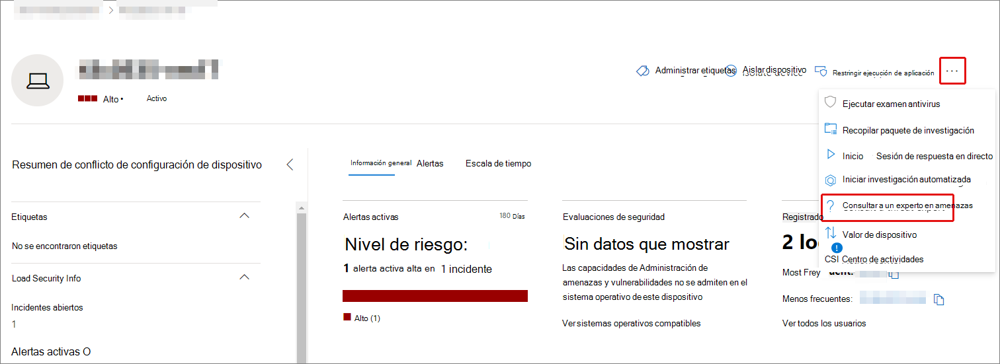
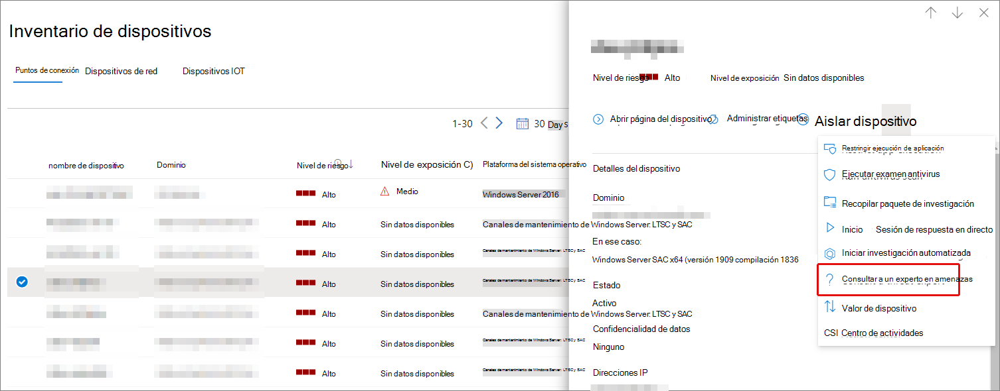
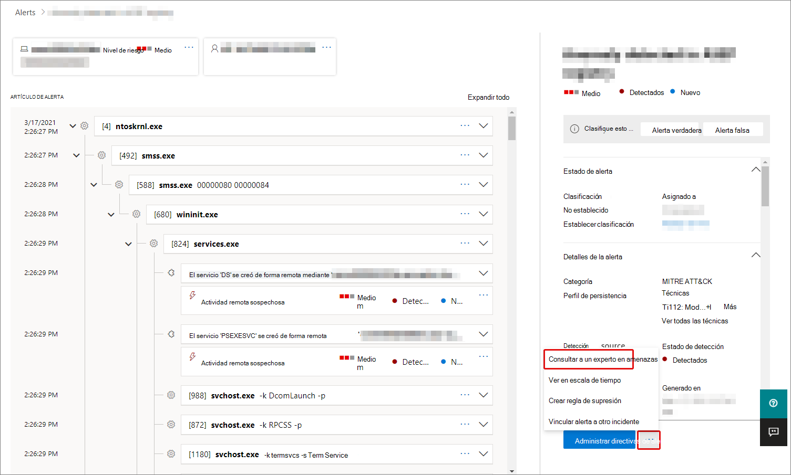

# Expertos en amenazas de Microsoft en Microsoft 365 introducciónMicrosoft Threat Experts in Microsoft 365 overview

[!INCLUDE [Microsoft 365 Defender rebranding](../includes/microsoft-defender.md)]

**Se aplica a:****Applies to:**

- [Microsoft 365 DefenderMicrosoft 365 Defender](https://go.microsoft.com/fwlink/?linkid=2118804)
- [Microsoft Defender para punto de conexiónMicrosoft Defender for Endpoint](https://go.microsoft.com/fwlink/p/?linkid=2154037)

[!INCLUDE [Prerelease](../includes/prerelease.md)]

Expertos en amenazas de Microsoft: las notificaciones de ataque dirigidos son un servicio de búsqueda de amenazas administrado.Microsoft Threat Experts - Targeted Attack Notifications is a managed threat hunting service. Una vez que apliques y te acepten, recibirás notificaciones de ataques dirigidos de expertos en amenazas de Microsoft, para que no te pierdas las amenazas críticas a tu entorno.Once you apply and are accepted, you'll receive targeted attack notifications from Microsoft threat experts, so you won't miss critical threats to your environment. Estas notificaciones le ayudarán a proteger los puntos de conexión, el correo electrónico y las identidades de su organización.These notifications will help you protect your organization's endpoints, email, and identities.
Expertos en amenazas de Microsoft: expertos a petición te permiten obtener consejos de expertos sobre las amenazas a las que se enfrenta tu organización.Microsoft Threat Experts – Experts on Demand lets you get expert advice about threats your organization is facing. Puede buscar ayuda sobre las amenazas a las que se enfrenta su organización.You can reach out for help on threats your organization is facing. Está disponible como servicio de suscripción.It's available as a subscription service.

## Aplicar para Expertos en amenazas de Microsoft: notificaciones de ataques dirigidosApply for Microsoft Threat Experts – Targeted Attack Notifications

> [!IMPORTANT]
> Antes de aplicar, asegúrese de analizar los requisitos de elegibilidad para Expertos en amenazas de Microsoft: notificaciones de ataque dirigidas con su proveedor de servicios técnicos de Microsoft y el equipo de cuenta.Before you apply, make sure to discuss the eligibility requirements for Microsoft Threat Experts – Targeted Attack Notifications  with your Microsoft Technical Service provider and account team.

Si ya tienes Microsoft Defender para Endpoint y Microsoft 365 Defender, puedes solicitar Expertos en amenazas de Microsoft: Notificaciones de ataques dirigidos a través de su portal de Microsoft 365 Defender.If you already have Microsoft Defender for Endpoint and Microsoft 365 Defender, you can apply for Microsoft Threat Experts – Targeted Attack Notifications through their Microsoft 365 Defender portal. Vaya a **Configuración > Endpoints > General > Advanced features > Expertos en amenazas de Microsoft – Targeted Attack Notifications** y seleccione **Aplicar**.Go to **Settings > Endpoints > General > Advanced features > Microsoft Threat Experts – Targeted Attack Notifications**, and select **Apply**. Consulte [Configure Expertos en amenazas de Microsoft capabilities para](./configure-microsoft-threat-experts.md) obtener una descripción completa.See [Configure Microsoft Threat Experts capabilities](./configure-microsoft-threat-experts.md) for a full description.

Una vez que la aplicación esté aprobada, empezarás a recibir notificaciones de ataques dirigidos siempre que los expertos en amenazas detecten una amenaza para el entorno.Once your application is approved, you'll start receiving targeted attack notifications whenever Threat Experts detect a threat to your environment.

## Suscribirse a Expertos en amenazas de Microsoft: expertos a peticiónSubscribe to Microsoft Threat Experts - Experts on Demand

Póngase en contacto con su representante de Microsoft para suscribirse a Expertos a petición.Contact your Microsoft representative to subscribe to Experts on Demand.  Consulte [Configure Expertos en amenazas de Microsoft capabilities para](./configure-microsoft-threat-experts.md) obtener información completa.See [Configure Microsoft Threat Experts capabilities](./configure-microsoft-threat-experts.md) for full details.

## Recibir notificación de ataque dirigidoReceive targeted attack notification

La Expertos en amenazas de Microsoft de notificación de ataques dirigidos proporciona una búsqueda proactiva de las amenazas más importantes para la red.The Microsoft Threat Experts – Targeted Attack Notification capability provides proactive hunting for the most important threats to your network. Nuestros expertos en amenazas buscan intrusiones adversarias humanas, ataques con teclado y ataques avanzados, como el ciberespionaje.Our threat experts hunt for human adversary intrusions, hands-on-keyboard attacks, and advanced attacks, such as cyberespionage. Estas notificaciones se mostrarán como una nueva alerta.These notifications will show up as a new alert. El servicio de búsqueda administrada incluye:The managed hunting service includes:

- Supervisión y análisis de amenazas, reducción del tiempo de espera y el riesgo para su empresaThreat monitoring and analysis, reducing dwell time and the risk to your business
- Inteligencia artificial entrenada por el cazador para descubrir y apuntar tanto a ataques conocidos como a amenazas emergentesHunter-trained artificial intelligence to discover and target both known attacks and emerging threats
- Identificación de los riesgos más pertinentes, lo que ayuda a los SOC a maximizar su eficaciaIdentification of the most pertinent risks, helping SOCs maximize their effectiveness
- Ayuda a seleccionar los compromisos y proporcionar todo el contexto que se pueda entregar rápidamente para habilitar una respuesta rápida de SOC.Help scoping compromises and providing as much context as can be quickly delivered to enable a swift SOC response.

## Colaborar con expertos a peticiónCollaborate with experts on demand

También puede ponerse en contacto con expertos en amenazas de Microsoft directamente dentro del portal de seguridad de Microsoft 365, para obtener una respuesta rápida y precisa a las amenazas.You can also contact Microsoft threat experts from directly inside the Microsoft 365 security portal, for a swift and accurate threat response.  Los expertos pueden proporcionar información para comprender mejor las complejas amenazas que puede enfrentar su organización.Experts can provide insight to better understand the complex threats your organization may face.  Consulte a un experto para:Consult an expert to:

- Recopilar información adicional sobre alertas e incidentes, incluidas las causas raíz y el ámbitoGather additional information on alerts and incidents, including root causes and scope
- Obtener claridad en dispositivos, alertas o incidentes sospechosos y obtener los pasos siguientes si se enfrenta a un atacante avanzadoGain clarity into suspicious devices, alerts, or incidents and get next steps if faced with an advanced attacker
- Determinar riesgos y protecciones disponibles relacionadas con actores de amenazas, campañas o técnicas emergentes de atacantesDetermine risks and available protections related to threat actors, campaigns, or emerging attacker techniques

La opción consultar **a un experto en amenazas** está disponible en varios lugares del portal:The option to **Consult a threat expert** is available in several places throughout the portal:

- <i>**Menú acciones de página de dispositivo**</i><i>**Device page actions menu**</i> 

- <i>**Menú desplegable de página de inventario de dispositivos**</i><i>**Device inventory page flyout menu**</i> 

- <i>**Menú desplegable de página de alertas**</i><i>**Alerts page flyout menu**</i> 

- <i>**Menú acciones de la página Incidentes**</i><i>**Incidents page actions menu**</i> 

- <i>**Página de inventario de incidentes**</i><i>**Incidents inventory page**</i> 

> [!NOTE]
> Si tienes asignada la suscripción de soporte técnico premier Office 365 tu licencia de Microsoft Defender, puedes realizar un seguimiento del estado de los casos de Expertos a petición a través de Microsoft Services Hub.If you have Premier Support subscription mapped to your Microsoft Defender for Office 365 license, you can track the status of your Experts on Demand cases through Microsoft Services Hub.

Vea este vídeo para obtener una introducción rápida al Centro de servicios de Microsoft.Watch this video for a quick overview of the Microsoft Services Hub.

> [!VIDEO https://www.microsoft.com/videoplayer/embed/RE4pk9f]

## Consulte tambiénSee also

- [Configurar Expertos en amenazas de Microsoft funcionalidadesConfigure Microsoft Threat Experts capabilities](./configure-microsoft-threat-experts.md)
