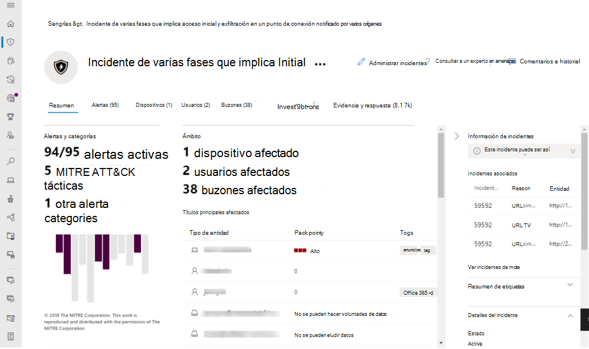
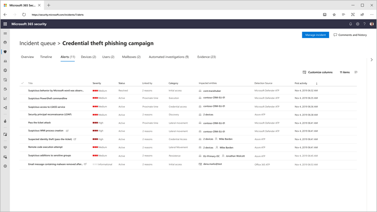

# Protección contra amenazas de MicrosoftMicrosoft Threat Protection

**Se aplica a:****Applies to:**
- Protección contra amenazas de MicrosoftMicrosoft Threat Protection

La protección contra amenazas de Microsoft es un conjunto de aplicaciones de defensa de la empresa, previa y posterior, unificada que se integra de forma nativa en los extremos, la identidad, el correo electrónico y las aplicaciones para detectar, prevenir, investigar y responder automáticamente a los ataques sofisticados.Microsoft Threat Protection is a unified pre and post breach enterprise defense suite that natively integrates across endpoint, identity, email, and applications to detect, prevent, investigate and automatically respond to sophisticated attacks.  

Con la solución integrada de protección contra amenazas de Microsoft, los profesionales de seguridad pueden unir las señales de amenaza que reciben cada uno de estos productos y determinar el alcance completo y el impacto de la amenaza; Cómo entró en el entorno, qué se ve afectado y cómo afecta actualmente a la organización.With the integrated Microsoft Threat Protection solution, security professionals can stitch together the threat signals that each of these products receive and determine the full scope and impact of the threat; how it entered the environment, what it's affected, and how it's currently impacting the organization. Microsoft Threat Protection realiza acciones automáticas para impedir o detener el ataque y Autocorregir los buzones de correo, los extremos y las identidades de usuario afectados.Microsoft Threat Protection takes automatic action to prevent or stop the attack and self-heal affected mailboxes, endpoints, and user identities.  

Microsoft Threat Protection Suite protege:Microsoft Threat Protection suite protects: 
- **Extremos con Microsoft defender ATP** -Microsoft defender ATP es una plataforma de punto de conexión unificada para la protección preventiva, la detección tras infracción, la investigación automatizada y la respuesta.**Endpoints with Microsoft Defender ATP** - Microsoft Defender ATP is a unified endpoint platform for preventative protection, post-breach detection, automated investigation, and response. 
- **Correo electrónico y colaboración con office 365 ATP** -Office 365 ATP protege a su organización frente a amenazas malintencionadas que plantean mensajes de correo electrónico, vínculos (URL) y herramientas de colaboración.**Email and collaboration with Office 365 ATP** - Office 365 ATP safeguards your organization against malicious threats posed by email messages, links (URLs) and collaboration tools. 
- **Identidades con Azure ATP y Azure ad Identity Protection** -Azure ATP usa señales de Active Directory para identificar, detectar e investigar amenazas avanzadas, identidades comprometidas y acciones de Insider malintencionadas dirigidas a la organización.**Identities with Azure ATP and Azure AD Identity Protection** - Azure ATP uses Active Directory signals to identify, detect, and investigate advanced threats, compromised identities, and malicious insider actions directed at your organization. 
- **Aplicaciones con Microsoft Cloud App Security** : Microsoft Cloud App Security es una solución completa de SaaS cruzadas que ofrece visibilidad profunda, controles de datos seguros y una mejor protección contra amenazas para las aplicaciones en la nube.**Applications with Microsoft Cloud App security** - Microsoft Cloud App security is a comprehensive cross-SaaS solution bringing deep visibility, strong data controls, and enhanced threat protection to your cloud apps. 

La única capa de productos cruzados de Microsoft Threat Protection aumenta los componentes de conjunto de programas individuales a:Microsoft Threat Protection's unique cross-product layer augments the individual suite components to:
- Ayudar a proteger contra ataques y coordinar respuestas defensivas en la serie a través del uso compartido de señales y acciones automatizadasHelp protect against attacks and coordinate defensive responses across the suite through signal sharing and automated actions
- Agregue un comentario a toda la historia del ataque a través de alertas de productos, comportamientos y contexto para los equipos de seguridad mediante la incorporación de datos sobre alertas, eventos sospechosos y activos afectados a ' incidentes '.Narrate the full story of the attack across product alerts, behaviors, and context for security teams by joining data on alerts, suspicious events and impacted assets to 'incidents'
- Automatizar la respuesta a la intromisión mediante la activación de la autorreparación para los activos afectados mediante la corrección automatizada.Automate response to compromise by triggering self-healing for impacted assets through automated remediation
- Permitir que los equipos de seguridad realicen una búsqueda de amenazas detallada y eficaz en los datos de la oficina y el punto de conexiónEnable security teams to perform detailed and effective threat hunting across endpoint and Office data

  
Incidente entre productos (Introducción)Cross-product incident (Overview)

 
Todas las alertas relacionadas en los productos de la Suite están relacionadas entre sí en un solo incidente (vista de alertas)All related alerts across the suite products correlated together into a single incident (alerts view)

 
Búsqueda basada en consultas sobre los datos de correo electrónico sin procesar de los extremosQuery-based hunting on top of email and endpoint raw data

Entre las características para varios productos de la protección contra amenazas de Microsoft se incluyen:Microsoft Threat Protection cross-product features include: 
- **Panel único de productos cruzados de Glass** -central permite ver toda la información sobre detecciones, activos afectados, acciones automatizadas tomadas y pruebas relacionadas en una única cola y un solo panel en [Security.Microsoft.com](https://security.microsoft.com).**Cross-product single pane of glass** - Central view all information for detections, impacted assets, automated actions taken, and related evidence in a single queue and a single pane in [security.microsoft.com](https://security.microsoft.com). 
- **Cola de incidentes combinados** : para ayudar a los profesionales de la seguridad a centrarse en lo que es crítico garantizar que el ámbito del ataque completo, los activos afectados y las acciones de corrección automatizadas se agrupen y se exponen de manera oportuna.**Combined incidents queue** - To help security professionals focus on what is critical by ensuring the full attack scope, impacted assets and automated remediation actions are grouped together and surfaced in a timely manner. 
- **Respuesta automática a amenazas** : la información de amenazas críticas se comparte en tiempo real entre los productos de Microsoft Threat Protection para ayudar a detener la progresión de un ataque.**Automatic response to threats** - Critical threat information is shared in real time between the Microsoft Threat Protection products to help stop the progression of an attack. Por ejemplo, si se detecta un archivo malintencionado en un extremo protegido por ATP de Microsoft defender, se indicará a Office 365 ATP que examine y quite el archivo de todos los mensajes de correo electrónico.For example, if a malicious file is detected on an endpoint protected by Microsoft Defender ATP, it will instruct Office 365 ATP to scan and remove the file from all e-mail messages. El paquete de seguridad completo de Microsoft 365 bloqueará el archivo a la vista.The file will be blocked on sight by the entire Microsoft 365 security suite.
- **Recuperación automática de dispositivos comprometedores, identidades de usuario y buzones de correo** : la protección contra amenazas de Microsoft utiliza acciones y guías automáticas con alimentación de AI para volver a corregir los activos afectados a un estado seguro.**Self-healing for compromised devices, user identities, and mailboxes** - Microsoft Threat Protection uses AI-powered automatic actions and playbooks to remediate impacted assets back to a secure state. La protección contra amenazas de Microsoft aprovecha las capacidades de corrección automáticas de los productos de la Suite para asegurarse de que todos los activos afectados relacionados con un incidente se corrigen automáticamente siempre que sea posible.Microsoft Threat Protection leverages automatic remediation capabilities of the suite products to ensure all impacted assets related to an incident are automatically remediated where possible.
- **Búsqueda de amenazas entre productos** : los equipos de seguridad pueden aprovechar su exclusivo conocimiento de la organización para buscar signos de peligro mediante la creación de sus propias consultas personalizadas sobre los datos sin procesar recopilados por los distintos productos de protección.**Cross-product threat hunting** - Security teams can leverage their unique organizational knowledge to hunt for signs of compromise by creating their own custom queries over the raw data collected by the various protection products. La protección contra amenazas de Microsoft proporciona acceso basado en consultas a 30 días de señales históricas sin procesar y datos de alerta en los datos de los extremos y de la oficina de ATP de Office 365.Microsoft Threat Protection provides query-based access to 30 days of historic raw signals and alert data across endpoint and Office 365 ATP data. 

<h2>Servicios de protección contra amenazas de Microsoft
Microsoft Threat Protection services
</h2>
<table><tr><td>
<b><a href="https://docs.microsoft.com/windows/security/threat-protection/microsoft-defender-atp/microsoft-defender-advanced-threat-protection"><b>Protección contra amenazas avanzada de Microsoft defender</b>

<b><a href="https://docs.microsoft.com/windows/security/threat-protection/microsoft-defender-atp/microsoft-defender-advanced-threat-protection"><b>Microsoft Defender Advanced Threat Protection</b>
</a></td>
<td>
<b><a href="https://docs.microsoft.com/office365/securitycompliance/office-365-atp"><b>Protección contra amenazas avanzada de Office 365</b>

<b><a href="https://docs.microsoft.com/office365/securitycompliance/office-365-atp"><b>Office 365 Advanced Threat Protection</b>
</a></td>
<td>
<b><a href="https://docs.microsoft.com/azure-advanced-threat-protection/"><b>Protección contra amenazas avanzada de Azure</b></a>

<b><a href="https://docs.microsoft.com/azure-advanced-threat-protection/"><b>Azure Advanced Threat Protection</b></a>
</td>
<td>
<b><a href="https://docs.microsoft.com/cloud-app-security/"><b>Microsoft Cloud App Security</b></a>

<b><a href="https://docs.microsoft.com/cloud-app-security/"><b>Microsoft Cloud App Security</b></a>
</td>
</tr>
</table>
 

## IntroducciónGet started
Los clientes con una licencia de Microsoft 365 E5 o equivalente pueden usar la Protección contra amenazas de Microsoft.Customers with a Microsoft 365 E5 or equivalent license can use Microsoft Threat Protection. Para empezar, habilite el servicio en el centro de seguridad 365 de Microsoft en [Security.Microsoft.com](https://security.microsoft.com).To begin, enable the service in the Microsoft 365 security center at [security.microsoft.com](https://security.microsoft.com). Para obtener más información, lea:For more information, read:
- [Requisitos de licenciaLicensing requirements](prerequisites.md#licensing-requirements)
- [Habilitar la Protección contra amenazas de MicrosoftTurn on Microsoft Threat Protection](mtp-enable.md)
