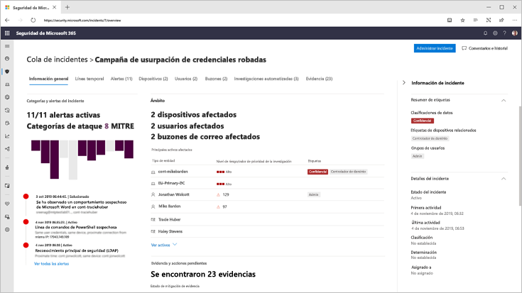
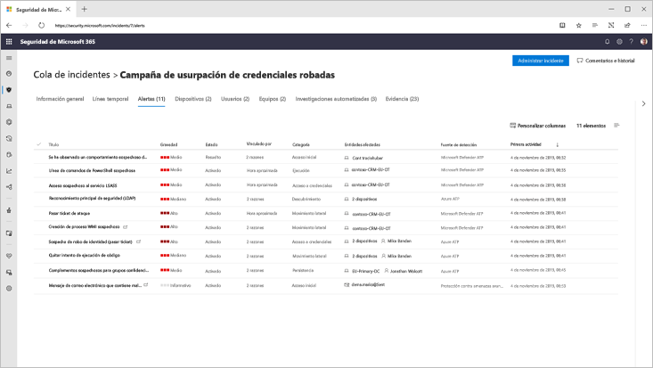
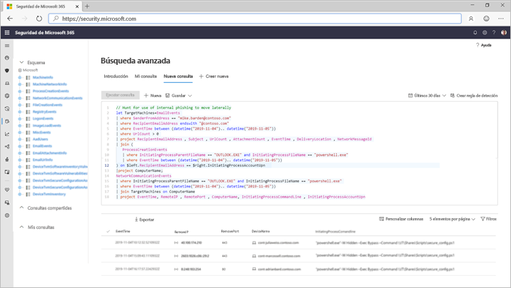

# Protección contra amenazas de Microsoft

**Se aplica a:**
- Protección contra amenazas de Microsoft

[!include[Prerelease information](prerelease.md)]

La protección contra amenazas de Microsoft es un conjunto de aplicaciones de defensa de la empresa, previa y posterior, unificada que se integra de forma nativa en los extremos, la identidad, el correo electrónico y las aplicaciones para detectar, prevenir, investigar y responder automáticamente a los ataques sofisticados.  

Con la solución integrada de protección contra amenazas de Microsoft, los profesionales de seguridad pueden unir las señales de amenaza que reciben cada uno de estos productos y determinar el alcance completo y el impacto de la amenaza; Cómo entró en el entorno, qué se ve afectado y cómo afecta actualmente a la organización. Microsoft Threat Protection realiza acciones automáticas para impedir o detener el ataque y Autocorregir los buzones de correo, los extremos y las identidades de usuario afectados.  

Microsoft Threat Protection Suite protege: 
- **Extremos con Microsoft defender ATP** -Microsoft defender ATP es una plataforma de punto de conexión unificada para la protección preventiva, la detección tras infracción, la investigación automatizada y la respuesta. 
- **Correo electrónico y colaboración con office 365 ATP** -Office 365 ATP protege a su organización frente a amenazas malintencionadas que plantean mensajes de correo electrónico, vínculos (URL) y herramientas de colaboración. 
- **Identidades con Azure ATP y Azure ad Identity Protection** -Azure ATP usa señales de Active Directory para identificar, detectar e investigar amenazas avanzadas, identidades comprometidas y acciones de Insider malintencionadas dirigidas a la organización. 
- **Aplicaciones con Microsoft Cloud App Security** : Microsoft Cloud App Security es una solución completa de SaaS cruzadas que ofrece visibilidad profunda, controles de datos seguros y una mejor protección contra amenazas para las aplicaciones en la nube. 

La única capa de productos cruzados de Microsoft Threat Protection aumenta los componentes de conjunto de programas individuales a:
- Ayudar a proteger contra ataques y coordinar respuestas defensivas en la serie a través del uso compartido de señales y acciones automatizadas
- Agregue un comentario a toda la historia del ataque a través de alertas de productos, comportamientos y contexto para los equipos de seguridad mediante la incorporación de datos sobre alertas, eventos sospechosos y activos afectados a ' incidentes '.
- Automatizar la respuesta a la intromisión mediante la activación de la autorreparación para los activos afectados mediante la corrección automatizada.
- Permitir que los equipos de seguridad realicen una búsqueda de amenazas detallada y eficaz en los datos de la oficina y el punto de conexión

  
Incidente entre productos (Introducción)

 
Todas las alertas relacionadas en los productos de la Suite están relacionadas entre sí en un solo incidente (vista de alertas)

 
Búsqueda basada en consultas sobre los datos de correo electrónico sin procesar de los extremos

Entre las características para varios productos de la protección contra amenazas de Microsoft se incluyen: 
- **Panel único de productos cruzados de Glass** -central permite ver toda la información sobre detecciones, activos afectados, acciones automatizadas tomadas y pruebas relacionadas en una única cola y un solo panel en [Security.Microsoft.com](https://security.microsoft.com). 
- **Cola de incidentes combinados** : para ayudar a los profesionales de la seguridad a centrarse en lo que es crítico garantizar que el ámbito del ataque completo, los activos afectados y las acciones de corrección automatizadas se agrupen y se exponen de manera oportuna. 
- **Respuesta automática a amenazas** : la información de amenazas críticas se comparte en tiempo real entre los productos de Microsoft Threat Protection para ayudar a detener la progresión de un ataque. Por ejemplo, si se detecta un archivo malintencionado en un extremo protegido por ATP de Microsoft defender, se indicará a Office 365 ATP que examine y quite el archivo de todos los mensajes de correo electrónico. El paquete de seguridad completo de Microsoft 365 bloqueará el archivo a la vista.
- **Recuperación automática de dispositivos comprometedores, identidades de usuario y buzones de correo** : la protección contra amenazas de Microsoft utiliza acciones y guías automáticas con alimentación de AI para volver a corregir los activos afectados a un estado seguro. La protección contra amenazas de Microsoft aprovecha las capacidades de corrección automáticas de los productos de la Suite para asegurarse de que todos los activos afectados relacionados con un incidente se corrigen automáticamente siempre que sea posible.
- **Búsqueda de amenazas entre productos** : los equipos de seguridad pueden aprovechar su exclusivo conocimiento de la organización para buscar signos de peligro mediante la creación de sus propias consultas personalizadas sobre los datos sin procesar recopilados por los distintos productos de protección. La protección contra amenazas de Microsoft proporciona acceso basado en consultas a 30 días de señales históricas sin procesar y datos de alerta en los datos de los extremos y de la oficina de ATP de Office 365. 

<h2>Servicios de protección contra amenazas de Microsoft
</h2>
<table><tr><td>
<b><a href="https://docs.microsoft.com/windows/security/threat-protection/microsoft-defender-atp/microsoft-defender-advanced-threat-protection"><b>Protección contra amenazas avanzada de Microsoft defender</b>
</a></td>
<td>
<b><a href="https://docs.microsoft.com/office365/securitycompliance/office-365-atp"><b>Protección contra amenazas avanzada de Office 365</b>
</a></td>
<td>
<b><a href="https://docs.microsoft.com/azure-advanced-threat-protection/"><b>Protección contra amenazas avanzada de Azure</b></a>
</td>
<td>
<b><a href="https://docs.microsoft.com/cloud-app-security/"><b>Microsoft Cloud App Security</b></a>
</td>
</tr>
</table>
 

## Introducción
Los clientes con una licencia de Microsoft 365 E5 o equivalente pueden usar la protección contra amenazas de Microsoft. Para empezar, habilite el servicio en el centro de seguridad 365 de Microsoft en [Security.Microsoft.com](https://security.microsoft.com). Para obtener más información, lea:
- [Requisitos de licencia](prerequisites.md#licensing-requirements)
- [Activar la protección contra amenazas de Microsoft](mtp-enable.md)
