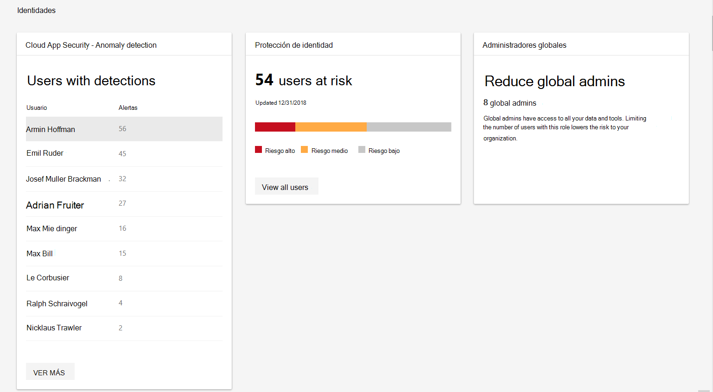

# Supervisión e informes de identidades en el centro de seguridad de Microsoft 365Identity monitoring and reporting in the Microsoft 365 security center

Supervisar las identidades de su organización y realizar un seguimiento de comportamientos sospechosos o arriesgados.Monitor the identities in your organization and keep track of suspicious or risky behaviors. En la categoría **identidades** de los **informes**, puede realizar un seguimiento de lo siguiente:In the **Identities** category of **Reports**, you can track:

* Usuarios con la mayor cantidad de anomalías detectadasUsers with the most detected anomalies
* Número de usuarios que, según las directivas de acceso condicional, se encuentran en situación de riesgoHow many users are reported at risk by conditional access policies
* Número de administradores globales en la organizaciónThe number of global admins in your org

Para los usuarios con detecciones específicas, puede explorar la alerta específica e investigar en el centro de seguridad de Microsoft defender.For users with specific detections, you can explore the specific alert and investigate in Microsoft Defender Security Center. Las detecciones incluyen anomalías como, por ejemplo, los usuarios que inician sesión desde ubicaciones desconocidas.Detections include anomalies such as users who sign in from unfamiliar locations.

Para obtener un conjunto completo de eventos de riesgo, vea [eventos de riesgo de Azure Active Directory](https://docs.microsoft.com/azure/active-directory/reports-monitoring/concept-risk-events).For a complete set of risk events, see [Azure Active Directory risk events](https://docs.microsoft.com/azure/active-directory/reports-monitoring/concept-risk-events).
