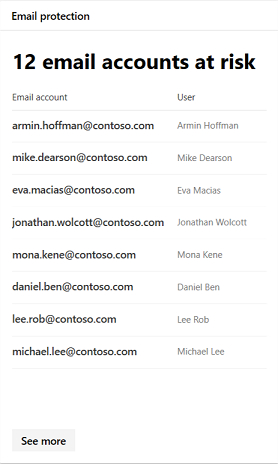

# Supervisión y generación de informes de aplicaciones en el centro de seguridad de Microsoft 365

[!INCLUDE [Microsoft 365 Defender rebranding](../includes/microsoft-defender.md)]

Estos informes proporcionan más información sobre cómo se usan las aplicaciones en la nube en la organización. Incluye distintos tipos de aplicaciones, su nivel de riesgo y alertas.

## Supervisión de cuentas de correo electrónico en peligro

La **protección de correo electrónico** muestra las cuentas de correo electrónico en riesgo. Puede seleccionar una cuenta para investigar con más detalle en el centro de seguridad de Microsoft defender.

## Supervisar los permisos de aplicación concedidos por los usuarios

**Cloud App Security: aplicaciones de OAuth** enumera las aplicaciones descubiertas por Cloud App Security a las que los usuarios han concedido permisos. El catálogo de riesgos de Cloud App Security incluye más de 16.000 aplicaciones que se evalúan con más de 70 factores de riesgo.

Los factores de riesgo comienzan a partir de información general, como el editor de la aplicación. A continuación, se desplaza a medidas y controles de seguridad, por ejemplo, si la aplicación admite el cifrado en reposo o proporciona un registro de auditoría de la actividad de los usuarios.

## Supervisar las cuentas de usuario de aplicación de nube

**Cuentas de aplicación de nube para revisión** enumera las cuentas que pueden requerir atención.

## Comprender qué aplicaciones en la nube se usan

Las **aplicaciones en la nube detectadas (categorías)** muestran qué tipos de aplicaciones se usan en la organización. Se vincula al panel de detección en la nube de Cloud App Security. Para obtener más información, consulte [Inicio rápido: trabajar con aplicaciones detectadas](https://docs.microsoft.com/cloud-app-security/discovered-apps).  

## Supervisar dónde acceden los usuarios a las aplicaciones en la nube

Las **ubicaciones de actividad de aplicación de nube** muestran dónde los usuarios están accediendo a las aplicaciones en la nube.

## Supervisión del estado de las cargas de trabajo de la infraestructura

**Estado** de la infraestructura muestra alertas de estado de mantenimiento para cargas de trabajo de infraestructura en el centro de seguridad de Azure.

El centro de seguridad de Azure proporciona administración de seguridad unificada y protección contra amenazas avanzada a través de cargas de trabajo locales y en la nube. Puede recopilar, buscar y analizar datos de seguridad de diferentes orígenes, incluidos firewalls y otras soluciones de asociados.

Para obtener más información, vea la [documentación del centro de seguridad de Azure](https://docs.microsoft.com/azure/security-center/).

