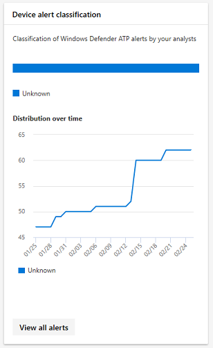

# <a name="device-monitoring-and-reporting-in-the-microsoft-365-security-center"></a><span data-ttu-id="e5fff-104">Supervisión e informes de dispositivos en el Centro de seguridad de Microsoft 365</span><span class="sxs-lookup"><span data-stu-id="e5fff-104">Device monitoring and reporting in the Microsoft 365 security center</span></span>

[!INCLUDE [Microsoft 365 Defender rebranding](../includes/microsoft-defender.md)]


<span data-ttu-id="e5fff-105">Mantenga los dispositivos seguros, actualizados y detecte posibles amenazas en el Centro de seguridad de Microsoft 365.</span><span class="sxs-lookup"><span data-stu-id="e5fff-105">Keep your devices secure, up-to-date, and spot potential threats in the Microsoft 365 security center.</span></span>

## <a name="view-device-alerts"></a><span data-ttu-id="e5fff-106">Ver alertas de dispositivo</span><span class="sxs-lookup"><span data-stu-id="e5fff-106">View device alerts</span></span>

<span data-ttu-id="e5fff-107">Obtén alertas actualizadas sobre la actividad de infracción y otras amenazas en tus dispositivos desde Microsoft Defender para puntos de conexión (disponible con una licencia E5).</span><span class="sxs-lookup"><span data-stu-id="e5fff-107">Get up-to-date alerts about breach activity and other threats on your devices from Microsoft Defender for Endpoint (available with an E5 license).</span></span> <span data-ttu-id="e5fff-108">El Centro de seguridad de Microsoft 365 supervisa estas alertas de forma eficaz en un nivel alto mediante el flujo de trabajo que prefiera.</span><span class="sxs-lookup"><span data-stu-id="e5fff-108">Microsoft 365 security center effectively monitors these alerts at a high level using your preferred workflow.</span></span>

### <a name="monitor-high-impact-alerts"></a><span data-ttu-id="e5fff-109">Supervisar alertas de alto impacto</span><span class="sxs-lookup"><span data-stu-id="e5fff-109">Monitor high-impact alerts</span></span>

<span data-ttu-id="e5fff-110">Cada alerta de Microsoft Defender para puntos de conexión tiene una gravedad correspondiente (alta, media, baja o informativo).</span><span class="sxs-lookup"><span data-stu-id="e5fff-110">Each Microsoft Defender for Endpoint alert has a corresponding severity (high, medium, low, or informational).</span></span> <span data-ttu-id="e5fff-111">Indica un posible impacto en la red si se deja desatendida.</span><span class="sxs-lookup"><span data-stu-id="e5fff-111">It indicates potential impact to your network if left unattended.</span></span>  

<span data-ttu-id="e5fff-112">Usa la **tarjeta de gravedad de alerta de dispositivo** para centrarse específicamente en las alertas que son más graves y pueden requerir respuesta inmediata.</span><span class="sxs-lookup"><span data-stu-id="e5fff-112">Use the **Device alert severity** card to focus specifically on alerts that are more severe and might require immediate response.</span></span> <span data-ttu-id="e5fff-113">Desde esta tarjeta, puede ver más información en el portal del Centro de seguridad de Microsoft Defender.</span><span class="sxs-lookup"><span data-stu-id="e5fff-113">From this card, you can view more information on the Microsoft Defender Security Center portal.</span></span>


### <a name="understand-sources-of-alerts"></a><span data-ttu-id="e5fff-115">Comprender los orígenes de alertas</span><span class="sxs-lookup"><span data-stu-id="e5fff-115">Understand sources of alerts</span></span>

<span data-ttu-id="e5fff-116">Microsoft Defender para endpoint aprovecha los datos de una amplia gama de sensores de seguridad y orígenes de inteligencia para generar alertas.</span><span class="sxs-lookup"><span data-stu-id="e5fff-116">Microsoft Defender for Endpoint leverages data from a broad range of security sensors and intelligence sources to generate alerts.</span></span> <span data-ttu-id="e5fff-117">Por ejemplo, puede usar información de detección del Antivirus de Microsoft Defender y antimalware de terceros.</span><span class="sxs-lookup"><span data-stu-id="e5fff-117">For example, it can use detection information from Microsoft Defender Antivirus and third-party antimalware.</span></span> <span data-ttu-id="e5fff-118">También puede usar su propia inteligencia de amenazas personalizada proporcionada a través de la API de servicio web.</span><span class="sxs-lookup"><span data-stu-id="e5fff-118">It can also use your own custom threat intelligence provided through the web service API.</span></span>

<span data-ttu-id="e5fff-119">La **tarjeta de orígenes de detección** de alertas de dispositivo muestra la distribución de alertas por origen.</span><span class="sxs-lookup"><span data-stu-id="e5fff-119">The **Device alert detection** sources card shows the distribution of alerts by source.</span></span> <span data-ttu-id="e5fff-120">Realizar un seguimiento de la actividad relacionada con determinados orígenes, especialmente los orígenes personalizados.</span><span class="sxs-lookup"><span data-stu-id="e5fff-120">Track activity related to certain sources, particularly your custom sources.</span></span> <span data-ttu-id="e5fff-121">También puedes usar la tarjeta para centrarte en las alertas procedentes de sensores que no están configurados para bloquear automáticamente la actividad malintencionada o los componentes.</span><span class="sxs-lookup"><span data-stu-id="e5fff-121">You can also use the card to focus on alerts coming from sensors that aren't configured to automatically block malicious activity or components.</span></span>


<span data-ttu-id="e5fff-123">Desde esta tarjeta, puede ver más información en el portal del Centro de seguridad de Microsoft Defender.</span><span class="sxs-lookup"><span data-stu-id="e5fff-123">From this card, you can view more information on the Microsoft Defender Security Center portal.</span></span>

### <a name="understand-the-types-of-threats-that-trigger-alerts"></a><span data-ttu-id="e5fff-124">Comprender los tipos de amenazas que desencadenan alertas</span><span class="sxs-lookup"><span data-stu-id="e5fff-124">Understand the types of threats that trigger alerts</span></span>

<span data-ttu-id="e5fff-125">Microsoft Defender para endpoint ordena cada alerta en una categoría que representa una determinada etapa de la cadena de ataques o el tipo de componente de amenaza.</span><span class="sxs-lookup"><span data-stu-id="e5fff-125">Microsoft Defender for Endpoint sorts each alert into a category representing a certain stage in the attack chain or type of threat component.</span></span> <span data-ttu-id="e5fff-126">Por ejemplo, una actividad de amenaza detectada puede clasificarse como "movimiento lateral" para indicar que se ha intentado llegar a otros dispositivos de la red.</span><span class="sxs-lookup"><span data-stu-id="e5fff-126">For example, a detected threat activity might be categorized as "lateral movement" to indicate there was an attempt to reach other devices on the network.</span></span> <span data-ttu-id="e5fff-127">Es probable que la actividad se haya producido después de que los atacantes obtuvieron una posición inicial.</span><span class="sxs-lookup"><span data-stu-id="e5fff-127">The activity has likely occurred after attackers gained an initial foothold.</span></span> <span data-ttu-id="e5fff-128">Cuando se detecta, un componente de amenaza puede clasificarse ampliamente como malware o específicamente como un tipo de amenaza específico.</span><span class="sxs-lookup"><span data-stu-id="e5fff-128">When detected, a threat component might be classified broadly as malware or specifically as a specific threat type.</span></span> <span data-ttu-id="e5fff-129">Los detalles incluyen ransomware, robo de credenciales u otros tipos de software malintencionado o no deseado.</span><span class="sxs-lookup"><span data-stu-id="e5fff-129">Specifics include ransomware, credential stealing, or other types of malicious or unwanted software.</span></span>

<span data-ttu-id="e5fff-130">La **tarjeta categorías de amenazas de** dispositivo muestra la distribución de alertas en estas categorías.</span><span class="sxs-lookup"><span data-stu-id="e5fff-130">The **Device threat categories** card shows the distribution of alerts into these categories.</span></span> <span data-ttu-id="e5fff-131">Use esta información para identificar la actividad de amenazas, como los intentos de robo de credenciales, que suelen tener un mayor impacto que los intentos de ingeniería social.</span><span class="sxs-lookup"><span data-stu-id="e5fff-131">Use this information to identify threat activity, such as credential theft attempts, that usually have higher impact than social engineering attempts.</span></span> <span data-ttu-id="e5fff-132">También puede supervisar amenazas potencialmente destructivas como ransomware.</span><span class="sxs-lookup"><span data-stu-id="e5fff-132">You can also to monitor for potentially destructive threats like ransomware.</span></span>


### <a name="monitor-active-alerts"></a><span data-ttu-id="e5fff-134">Supervisar alertas activas</span><span class="sxs-lookup"><span data-stu-id="e5fff-134">Monitor active alerts</span></span>

<span data-ttu-id="e5fff-135">La **tarjeta de estado de alerta** de dispositivo indica el número de alertas que no se han resuelto y que pueden requerir atención.</span><span class="sxs-lookup"><span data-stu-id="e5fff-135">The **Device alert status** card indicates the number of alerts that haven't been resolved and may require attention.</span></span> <span data-ttu-id="e5fff-136">Desde esta tarjeta, puede ver más información en el portal del Centro de seguridad de Microsoft Defender.</span><span class="sxs-lookup"><span data-stu-id="e5fff-136">From this card, you can view more information on the Microsoft Defender Security Center portal.</span></span>


### <a name="monitor-classification-of-resolved-alerts"></a><span data-ttu-id="e5fff-138">Supervisar la clasificación de alertas resueltas</span><span class="sxs-lookup"><span data-stu-id="e5fff-138">Monitor classification of resolved alerts</span></span>

<span data-ttu-id="e5fff-139">Al resolver una alerta de Microsoft Defender para puntos de conexión, el personal de seguridad puede especificar si se ha comprobado una alerta como:</span><span class="sxs-lookup"><span data-stu-id="e5fff-139">When resolving a Microsoft Defender for Endpoint alert, your security staff can specify whether an alert has been verified as:</span></span>

* <span data-ttu-id="e5fff-140">Una alerta real que identifica la actividad de infracción real o los componentes de amenaza</span><span class="sxs-lookup"><span data-stu-id="e5fff-140">A true alert that identifies actual breach activity or threat components</span></span>
* <span data-ttu-id="e5fff-141">Una alerta falsa que ha detectado actividad normal incorrectamente</span><span class="sxs-lookup"><span data-stu-id="e5fff-141">A false alert that has incorrectly detected normal activity</span></span>

<span data-ttu-id="e5fff-142">La **tarjeta de clasificación de alertas** de dispositivo muestra si las alertas resueltas se han clasificado como alertas verdaderas o falsas.</span><span class="sxs-lookup"><span data-stu-id="e5fff-142">The **Device alert classification** card shows whether your resolved alerts have been classified as true or false alerts.</span></span> <span data-ttu-id="e5fff-143">Desde esta tarjeta, puede ver más información en el portal del Centro de seguridad de Microsoft Defender.</span><span class="sxs-lookup"><span data-stu-id="e5fff-143">From this card, you can view more information on the Microsoft Defender Security Center portal.</span></span>

<span data-ttu-id="e5fff-144">Nota: En algunos casos, la información de clasificación no está disponible para determinadas alertas.</span><span class="sxs-lookup"><span data-stu-id="e5fff-144">Note: In some cases, classification information is unavailable for certain alerts.</span></span>



### <a name="monitor-determination-of-resolved-alerts"></a><span data-ttu-id="e5fff-146">Supervisar la determinación de alertas resueltas</span><span class="sxs-lookup"><span data-stu-id="e5fff-146">Monitor determination of resolved alerts</span></span>

<span data-ttu-id="e5fff-147">Además de clasificar si una alerta es verdadera o falsa durante la resolución, el personal de seguridad puede proporcionar una determinación.</span><span class="sxs-lookup"><span data-stu-id="e5fff-147">Along with classifying whether an alert is true or false during resolution, your security staff can provide a determination.</span></span> <span data-ttu-id="e5fff-148">Una determinación indica el tipo de actividad normal o malintencionada que se encontró al validar la alerta.</span><span class="sxs-lookup"><span data-stu-id="e5fff-148">A determination indicates the type of normal or malicious activity that was found while validating the alert.</span></span>

<span data-ttu-id="e5fff-149">La **tarjeta de determinación de alertas** de dispositivo muestra la determinación proporcionada para cada alerta.</span><span class="sxs-lookup"><span data-stu-id="e5fff-149">The **Device alert determination** card shows the determination provided for each alert.</span></span>

* <span data-ttu-id="e5fff-150">**APT:** amenaza persistente avanzada, que indica que la actividad detectada o el componente de amenaza forma parte de una infracción sofisticada diseñada para obtener una posición en la red afectada.</span><span class="sxs-lookup"><span data-stu-id="e5fff-150">**APT**: advanced persistent threat, indicating that the detected activity or threat component is part of a sophisticated breach designed to gain a foothold in the affected network</span></span>  
* <span data-ttu-id="e5fff-151">**Malware:** código o archivo malintencionado</span><span class="sxs-lookup"><span data-stu-id="e5fff-151">**Malware**: malicious file or code</span></span>
* <span data-ttu-id="e5fff-152">**Personal de seguridad:** actividad normal realizada por el personal de seguridad</span><span class="sxs-lookup"><span data-stu-id="e5fff-152">**Security personnel**: normal activity performed by security staff</span></span>
* <span data-ttu-id="e5fff-153">**Pruebas de seguridad:** actividad o componentes diseñados para simular amenazas reales y se espera que activen sensores de seguridad y generen alertas</span><span class="sxs-lookup"><span data-stu-id="e5fff-153">**Security testing**: activity or components designed to simulate actual threats and expected to trigger security sensors and generate alerts</span></span>
* <span data-ttu-id="e5fff-154">**Software no deseado:** aplicaciones y otro software que no se consideran malintencionados, pero que infringen la directiva o estándares de uso aceptables.</span><span class="sxs-lookup"><span data-stu-id="e5fff-154">**Unwanted software**: apps and other software that are not considered malicious, but otherwise violate policy or acceptable use standards</span></span>
* <span data-ttu-id="e5fff-155">**Otros:** cualquier otra determinación que no se encuentra dentro de los tipos proporcionados</span><span class="sxs-lookup"><span data-stu-id="e5fff-155">**Others**: any other determination that doesn't fall under the provided types</span></span>

<span data-ttu-id="e5fff-156">Desde esta tarjeta, puede ver más información en el Centro de seguridad de Microsoft Defender.</span><span class="sxs-lookup"><span data-stu-id="e5fff-156">From this card, you can view more information in Microsoft Defender Security Center.</span></span>


### <a name="understand-which-devices-are-at-risk"></a><span data-ttu-id="e5fff-158">Comprender qué dispositivos están en riesgo</span><span class="sxs-lookup"><span data-stu-id="e5fff-158">Understand which devices are at risk</span></span>

<span data-ttu-id="e5fff-159">**La protección de** dispositivos muestra el nivel de riesgo para los dispositivos.</span><span class="sxs-lookup"><span data-stu-id="e5fff-159">**Device protection** shows the risk level for devices.</span></span> <span data-ttu-id="e5fff-160">El nivel de riesgo se basa en factores como el tipo y la gravedad de las alertas en el dispositivo.</span><span class="sxs-lookup"><span data-stu-id="e5fff-160">The risk level is based on factors such as the type and severity of alerts on the device.</span></span>


## <a name="monitor-and-report-status-of-intune-managed-devices"></a><span data-ttu-id="e5fff-162">Supervisar y notificar el estado de los dispositivos administrados por Intune</span><span class="sxs-lookup"><span data-stu-id="e5fff-162">Monitor and report status of Intune-managed devices</span></span>

<span data-ttu-id="e5fff-163">Los siguientes informes contienen datos de dispositivos inscritos en Intune.</span><span class="sxs-lookup"><span data-stu-id="e5fff-163">The following reports contain data from devices enrolled in Intune.</span></span> <span data-ttu-id="e5fff-164">No se incluyen los datos de dispositivos no inscritos.</span><span class="sxs-lookup"><span data-stu-id="e5fff-164">Data from unenrolled devices isn't included.</span></span> <span data-ttu-id="e5fff-165">Solo los administradores globales pueden ver estas tarjetas.</span><span class="sxs-lookup"><span data-stu-id="e5fff-165">Only Global Administrators can view these cards.</span></span>

<span data-ttu-id="e5fff-166">Los datos del dispositivo inscritos en Intune incluyen:</span><span class="sxs-lookup"><span data-stu-id="e5fff-166">Intune enrolled device data includes:</span></span>

* <span data-ttu-id="e5fff-167">Cumplimiento de dispositivos</span><span class="sxs-lookup"><span data-stu-id="e5fff-167">Device compliance</span></span>
* <span data-ttu-id="e5fff-168">Dispositivos con malware activo</span><span class="sxs-lookup"><span data-stu-id="e5fff-168">Devices with active malware</span></span>
* <span data-ttu-id="e5fff-169">Tipos de malware en dispositivos</span><span class="sxs-lookup"><span data-stu-id="e5fff-169">Types of malware on devices</span></span>
* <span data-ttu-id="e5fff-170">Malware en dispositivos</span><span class="sxs-lookup"><span data-stu-id="e5fff-170">Malware on devices</span></span>
* <span data-ttu-id="e5fff-171">Dispositivos con detecciones de malware</span><span class="sxs-lookup"><span data-stu-id="e5fff-171">Devices with malware detections</span></span>
* <span data-ttu-id="e5fff-172">Usuarios con detecciones de malware</span><span class="sxs-lookup"><span data-stu-id="e5fff-172">Users with malware detections</span></span>

### <a name="monitor-device-compliance"></a><span data-ttu-id="e5fff-173">Supervisar el cumplimiento de dispositivos</span><span class="sxs-lookup"><span data-stu-id="e5fff-173">Monitor device compliance</span></span>

<span data-ttu-id="e5fff-174">**El cumplimiento de** dispositivos muestra cuántos dispositivos inscritos en Intune cumplen con las directivas de configuración.</span><span class="sxs-lookup"><span data-stu-id="e5fff-174">**Device compliance** shows how many devices that are enrolled in Intune comply with configuration policies.</span></span>


### <a name="discover-devices-with-malware-detections"></a><span data-ttu-id="e5fff-176">Detectar dispositivos con detecciones de malware</span><span class="sxs-lookup"><span data-stu-id="e5fff-176">Discover devices with malware detections</span></span>

<span data-ttu-id="e5fff-177">**Las detecciones de malware de** dispositivo proporcionan el número de dispositivos inscritos en Intune con malware que no se ha resuelto por completo.</span><span class="sxs-lookup"><span data-stu-id="e5fff-177">**Device malware detections** provide the number of Intune enrolled devices with malware that hasn't been fully resolved.</span></span> <span data-ttu-id="e5fff-178">La falta de resolución puede deberse a acciones pendientes, un reinicio, un examen completo, acciones manuales del usuario o si la acción de corrección no se completó correctamente.</span><span class="sxs-lookup"><span data-stu-id="e5fff-178">A lack of resolution can be because of pending actions, a restart, a full scan, manual user actions, or if the remediation action was not successfully completed.</span></span>


### <a name="understand-the-types-of-malware-detected"></a><span data-ttu-id="e5fff-180">Comprender los tipos de malware detectados</span><span class="sxs-lookup"><span data-stu-id="e5fff-180">Understand the types of malware detected</span></span>

<span data-ttu-id="e5fff-181">**Los tipos de malware en dispositivos** muestran diferentes tipos de malware que se han detectado en dispositivos inscritos en Intune.</span><span class="sxs-lookup"><span data-stu-id="e5fff-181">**Types of malware on devices** show different kinds of malware that have been detected on devices enrolled in Intune.</span></span> <span data-ttu-id="e5fff-182">Puede investigar cada tipo en el Centro de seguridad de Microsoft 365.</span><span class="sxs-lookup"><span data-stu-id="e5fff-182">You can investigate each type in the Microsoft 365 security center.</span></span>


### <a name="understand-the-specific-malware-detected-on-your-devices"></a><span data-ttu-id="e5fff-184">Comprender el malware específico detectado en los dispositivos</span><span class="sxs-lookup"><span data-stu-id="e5fff-184">Understand the specific malware detected on your devices</span></span>

<span data-ttu-id="e5fff-185">**El malware de los** dispositivos proporciona una lista del malware específico detectado en los dispositivos.</span><span class="sxs-lookup"><span data-stu-id="e5fff-185">**Malware on devices** provides a list of the specific malware detected on your devices.</span></span>


### <a name="understand-which-devices-have-the-most-malware"></a><span data-ttu-id="e5fff-187">Comprender qué dispositivos tienen más malware</span><span class="sxs-lookup"><span data-stu-id="e5fff-187">Understand which devices have the most malware</span></span>

<span data-ttu-id="e5fff-188">**Los dispositivos con detecciones de** malware muestran qué dispositivos tienen más detecciones de malware.</span><span class="sxs-lookup"><span data-stu-id="e5fff-188">**Devices with malware detections** show which devices have the most malware detections.</span></span> <span data-ttu-id="e5fff-189">en el Centro de seguridad de Microsoft 365, puede investigar si el malware está activo, quién usa el dispositivo y su estado de administración en Intune.</span><span class="sxs-lookup"><span data-stu-id="e5fff-189">in the Microsoft 365 security center, you can investigate whether malware is active, who uses the device, and its management status in Intune.</span></span>


### <a name="understand-which-users-have-devices-with-the-most-malware"></a><span data-ttu-id="e5fff-191">Comprender qué usuarios tienen dispositivos con más malware</span><span class="sxs-lookup"><span data-stu-id="e5fff-191">Understand which users have devices with the most malware</span></span>

<span data-ttu-id="e5fff-192">**Los usuarios con detecciones de malware** muestran los usuarios con dispositivos que tenían la mayoría de las detecciones de malware.</span><span class="sxs-lookup"><span data-stu-id="e5fff-192">**Users with malware detections** show users with devices that had the most malware detections.</span></span> <span data-ttu-id="e5fff-193">En el Centro de seguridad de Microsoft 365, puede ver cuántos dispositivos se asignan a cada usuario y más información sobre cada dispositivo y el tipo de malware.</span><span class="sxs-lookup"><span data-stu-id="e5fff-193">In the Microsoft 365 security center, you can see how many devices are assigned to each user and more information about each device and the type of malware.</span></span>


## <a name="monitor-and-manage-attack-surface-reduction-rule-deployment-and-detections"></a><span data-ttu-id="e5fff-195">Supervisar y administrar la implementación y las detecciones de reglas de reducción de superficie de ataque</span><span class="sxs-lookup"><span data-stu-id="e5fff-195">Monitor and manage attack surface reduction rule deployment and detections</span></span>

<span data-ttu-id="e5fff-196">Las reglas de Reducción de superficie de ataque [(ASR)](https://docs.microsoft.com/windows/security/threat-protection/microsoft-defender-atp/attack-surface-reduction) ayudan a evitar acciones y aplicaciones que suelen usar malware que busca vulnerabilidades de seguridad para infectar dispositivos.</span><span class="sxs-lookup"><span data-stu-id="e5fff-196">[Attack Surface Reduction (ASR) rules](https://docs.microsoft.com/windows/security/threat-protection/microsoft-defender-atp/attack-surface-reduction) help prevent actions and apps that are typically used by exploit-seeking malware to infect devices.</span></span> <span data-ttu-id="e5fff-197">Estas reglas controlan cuándo y cómo se pueden ejecutar los archivos ejecutables.</span><span class="sxs-lookup"><span data-stu-id="e5fff-197">These rules control when and how executables can run.</span></span> <span data-ttu-id="e5fff-198">Por ejemplo, puede impedir que JavaScript o VBScript inicien un archivo ejecutable descargado, bloqueen llamadas API Win32 de macros de Office o bloqueen procesos que se ejecuten desde unidades USB.</span><span class="sxs-lookup"><span data-stu-id="e5fff-198">For example, you can prevent JavaScript or VBScript from launching a downloaded executable, block Win32 API calls from Office macros, or block processes that run from USB drives.</span></span>


<span data-ttu-id="e5fff-200">La tarjeta **Reglas de reducción de la superficie expuesta a ataques** ofrece información general sobre la implementación de reglas en los dispositivos.</span><span class="sxs-lookup"><span data-stu-id="e5fff-200">The **Attack surface reduction rules** card provides an overview of the deployment of rules across your devices.</span></span>

<span data-ttu-id="e5fff-201">La barra superior de la tarjeta muestra el número total de dispositivos que se encuentran en los siguientes modos de implementación:</span><span class="sxs-lookup"><span data-stu-id="e5fff-201">The top bar on the card shows the total number of devices that are in the following deployment modes:</span></span>

* <span data-ttu-id="e5fff-202">**Modo de bloqueo:** dispositivos con al menos una regla configurada para bloquear la actividad detectada</span><span class="sxs-lookup"><span data-stu-id="e5fff-202">**Block mode**: devices with at least one rule configured to block detected activity</span></span>
* <span data-ttu-id="e5fff-203">**Modo auditoría:** dispositivos sin reglas establecidas para bloquear la actividad detectada, pero tiene al menos una regla configurada para auditar la actividad detectada.</span><span class="sxs-lookup"><span data-stu-id="e5fff-203">**Audit mode**: devices with no rules set to block detected activity, but has at least one rule set to audit detected activity</span></span>  
* <span data-ttu-id="e5fff-204">**Desactivado:** dispositivos con todas las reglas ASR desactivadas</span><span class="sxs-lookup"><span data-stu-id="e5fff-204">**Off**: devices with all ASR rules turned off</span></span>

<span data-ttu-id="e5fff-205">La parte inferior de esta tarjeta muestra la configuración por regla en los dispositivos.</span><span class="sxs-lookup"><span data-stu-id="e5fff-205">The lower part of this card shows settings by rule across your devices.</span></span> <span data-ttu-id="e5fff-206">Cada barra indica el número de dispositivos que están configurados para bloquear, auditar o tener la regla completamente desactivada.</span><span class="sxs-lookup"><span data-stu-id="e5fff-206">Each bar indicates the number of devices that are set to block, audit detection, or have the rule completely turned off.</span></span>

### <a name="view-asr-detections"></a><span data-ttu-id="e5fff-207">Ver detecciones de ASR</span><span class="sxs-lookup"><span data-stu-id="e5fff-207">View ASR detections</span></span>

<span data-ttu-id="e5fff-208">Para ver información detallada sobre las detecciones de reglas ASR en la red, selecciona **Ver** detecciones en la tarjeta de reglas de reducción **de superficie de ataque.**</span><span class="sxs-lookup"><span data-stu-id="e5fff-208">To view detailed information about ASR rule detections in your network, select **View detections** on the **Attack surface reduction rules** card.</span></span> <span data-ttu-id="e5fff-209">Se **abrirá la pestaña** Detecciones en la página del informe detallado.</span><span class="sxs-lookup"><span data-stu-id="e5fff-209">The **Detections** tab in the detailed report page will open.</span></span>


<span data-ttu-id="e5fff-211">El gráfico de la parte superior de la página muestra las detecciones a lo largo del tiempo apilando las detecciones que se bloquearon o auditó.</span><span class="sxs-lookup"><span data-stu-id="e5fff-211">The chart at the top of the page shows detections over time stacking detections that were either blocked or audited.</span></span> <span data-ttu-id="e5fff-212">En la tabla de la parte inferior se muestran las detecciones más recientes.</span><span class="sxs-lookup"><span data-stu-id="e5fff-212">The table at the bottom lists the most recent detections.</span></span> <span data-ttu-id="e5fff-213">Use la siguiente información de la tabla para comprender la naturaleza de las detecciones:</span><span class="sxs-lookup"><span data-stu-id="e5fff-213">Use the following information on the table to understand the nature of the detections:</span></span>

* <span data-ttu-id="e5fff-214">**Archivo detectado:** el archivo, normalmente un script o documento, cuyo contenido desencadenó la actividad de ataque sospechosa</span><span class="sxs-lookup"><span data-stu-id="e5fff-214">**Detected file**: the file, typically a script or document, whose contents triggered the suspected attack activity</span></span>
* <span data-ttu-id="e5fff-215">**Regla:** nombre que describe las actividades de ataque que la regla está diseñada para capturar.</span><span class="sxs-lookup"><span data-stu-id="e5fff-215">**Rule**: name describing the attack activities the rule is designed to catch.</span></span> <span data-ttu-id="e5fff-216">Leer sobre las reglas ASR existentes</span><span class="sxs-lookup"><span data-stu-id="e5fff-216">Read about existing ASR rules</span></span>
* <span data-ttu-id="e5fff-217">**Aplicación de** origen: la aplicación que cargó o ejecutó el contenido que desencadena la actividad de ataque sospechosa.</span><span class="sxs-lookup"><span data-stu-id="e5fff-217">**Source app**: the application that loaded or executed content triggering the suspected attack activity.</span></span> <span data-ttu-id="e5fff-218">Podría ser una aplicación legítima, como un explorador web, una aplicación de Office o una herramienta del sistema como PowerShell</span><span class="sxs-lookup"><span data-stu-id="e5fff-218">It could be a legitimate application, such as web browser, an Office application, or a system tool like PowerShell</span></span>
* <span data-ttu-id="e5fff-219">**Publisher:** el proveedor que publicó la aplicación de origen</span><span class="sxs-lookup"><span data-stu-id="e5fff-219">**Publisher**: the vendor that released the source app</span></span>

### <a name="review-device-asr-rule-settings"></a><span data-ttu-id="e5fff-220">Revisar la configuración de la regla ASR del dispositivo</span><span class="sxs-lookup"><span data-stu-id="e5fff-220">Review device ASR rule settings</span></span>

<span data-ttu-id="e5fff-221">En la página **Informe de reglas de reducción de** superficie de ataque, ve a la **pestaña** Configuración para revisar la configuración de la regla para dispositivos individuales.</span><span class="sxs-lookup"><span data-stu-id="e5fff-221">In the **Attack surface reduction rules** report page, go to the **Configuration** tab to review rule settings for individual devices.</span></span> <span data-ttu-id="e5fff-222">Selecciona un dispositivo para obtener información detallada sobre si cada regla está en modo de bloqueo, modo auditoría o desactivada por completo.</span><span class="sxs-lookup"><span data-stu-id="e5fff-222">Select a device to get detailed information about whether each rule is in block mode, audit mode, or turned off entirely.</span></span>


<span data-ttu-id="e5fff-224">Microsoft Intune proporciona funcionalidad de administración para las reglas de ASR.</span><span class="sxs-lookup"><span data-stu-id="e5fff-224">Microsoft Intune provides management functionality for your ASR rules.</span></span> <span data-ttu-id="e5fff-225">Si quieres actualizar la configuración, selecciona Introducción en **Configurar** dispositivos en la pestaña para abrir la administración de dispositivos en Intune. </span><span class="sxs-lookup"><span data-stu-id="e5fff-225">If you want to update your settings, select **Get started** under **Configure devices** in the tab to open device management on Intune.</span></span>

### <a name="exclude-files-from-asr-rules"></a><span data-ttu-id="e5fff-226">Excluir archivos de reglas ASR</span><span class="sxs-lookup"><span data-stu-id="e5fff-226">Exclude files from ASR rules</span></span>

<span data-ttu-id="e5fff-227">El Centro de seguridad de Microsoft 365 recopila los nombres de los archivos que puede que desee excluir de las detecciones mediante reglas de reducción de superficie de ataque. [](https://docs.microsoft.com/windows/security/threat-protection/microsoft-defender-atp/enable-attack-surface-reduction#exclude-files-and-folders-from-asr-rules)</span><span class="sxs-lookup"><span data-stu-id="e5fff-227">Microsoft 365 security center collects the names of the [files you might want to exclude](https://docs.microsoft.com/windows/security/threat-protection/microsoft-defender-atp/enable-attack-surface-reduction#exclude-files-and-folders-from-asr-rules) from detections by attack surface reduction rules.</span></span> <span data-ttu-id="e5fff-228">Al excluir archivos, puedes reducir las detecciones de falsos positivos e implementar con más confianza reglas de reducción de superficie de ataque en modo de bloqueo.</span><span class="sxs-lookup"><span data-stu-id="e5fff-228">By excluding files, you can reduce false positive detections and more confidently deploy attack surface reduction rules in block mode.</span></span>

<span data-ttu-id="e5fff-229">Las exclusiones se administran en Microsoft Intune, pero el Centro de seguridad de Microsoft 365 proporciona una herramienta de análisis que le ayudará a comprender los archivos.</span><span class="sxs-lookup"><span data-stu-id="e5fff-229">The exclusions are managed on Microsoft Intune, but Microsoft 365 security center provides an analysis tool to help you understand the files.</span></span> <span data-ttu-id="e5fff-230">Para empezar a recopilar archivos para exclusión, ve a la pestaña Agregar **exclusiones** en la página informe de reglas de **reducción de superficie de** ataque.</span><span class="sxs-lookup"><span data-stu-id="e5fff-230">To start collecting files for exclusion, go to the **Add exclusions** tab in the **Attack surface reduction rules** report page.</span></span>

>[!NOTE]  
><span data-ttu-id="e5fff-231">La herramienta analiza las detecciones por todas las reglas de reducción de superficie de ataque, pero solo algunas [reglas admiten exclusiones.](https://docs.microsoft.com/windows/security/threat-protection/microsoft-defender-atp/troubleshoot-asr)</span><span class="sxs-lookup"><span data-stu-id="e5fff-231">The tool analyzes detections by all attack surface reduction rules, but [only some rules support exclusions](https://docs.microsoft.com/windows/security/threat-protection/microsoft-defender-atp/troubleshoot-asr).</span></span>


<span data-ttu-id="e5fff-233">En la tabla se enumeran todos los nombres de archivo detectados por las reglas de reducción de superficie de ataque.</span><span class="sxs-lookup"><span data-stu-id="e5fff-233">The table lists all the file names detected by your attack surface reduction rules.</span></span> <span data-ttu-id="e5fff-234">Puedes seleccionar archivos para revisar el impacto de excluirlos:</span><span class="sxs-lookup"><span data-stu-id="e5fff-234">You can select files to review the impact of excluding them:</span></span>

* <span data-ttu-id="e5fff-235">Número de detecciones menos</span><span class="sxs-lookup"><span data-stu-id="e5fff-235">How many fewer detections</span></span>
* <span data-ttu-id="e5fff-236">Cuántos dispositivos menos informan de las detecciones</span><span class="sxs-lookup"><span data-stu-id="e5fff-236">How many fewer devices report the detections</span></span>

<span data-ttu-id="e5fff-237">Para obtener una lista de los archivos seleccionados con sus rutas de acceso completas para exclusión, seleccione **Obtener rutas de exclusión.**</span><span class="sxs-lookup"><span data-stu-id="e5fff-237">To get a list of the selected files with their full paths for exclusion, select **Get exclusion paths**.</span></span>

<span data-ttu-id="e5fff-238">Los registros de la regla ASR Bloquear robo de credenciales del subsistema de autoridad de seguridad **local de Windows (lsass.exe)** capturan la aplicación de **origenlsass.exe**.</span><span class="sxs-lookup"><span data-stu-id="e5fff-238">Logs for the ASR rule **Block credential stealing from the Windows local security authority subsystem (lsass.exe)** capture the source app **lsass.exe**.</span></span> <span data-ttu-id="e5fff-239">Es un archivo del sistema normal, pero capturado como el archivo detectado.</span><span class="sxs-lookup"><span data-stu-id="e5fff-239">It is a normal system file, but captured as the detected file.</span></span> <span data-ttu-id="e5fff-240">Como resultado, la lista generada de rutas de exclusión incluirá este archivo.</span><span class="sxs-lookup"><span data-stu-id="e5fff-240">As a result, the generated list of exclusion paths will include this file.</span></span> <span data-ttu-id="e5fff-241">Para excluir el archivo que desencadenó esta regla en lugar **delsass.exe,** usa la ruta de acceso a la aplicación de origen en lugar del archivo detectado.</span><span class="sxs-lookup"><span data-stu-id="e5fff-241">To exclude the file that triggered this rule instead of **lsass.exe**, use the path to the source app instead of the detected file.</span></span>

<span data-ttu-id="e5fff-242">Para localizar la aplicación de [](https://docs.microsoft.com/windows/security/threat-protection/microsoft-defender-atp/advanced-hunting) origen, ejecute la siguiente consulta de búsqueda avanzada para esta regla específica (identificada por el identificador de regla 9e6c4e1f-7d60-472f-ba1a-a39ef669e4b2):</span><span class="sxs-lookup"><span data-stu-id="e5fff-242">To locate the source app, run the following [advanced hunting query](https://docs.microsoft.com/windows/security/threat-protection/microsoft-defender-atp/advanced-hunting) for this specific rule (identified by rule ID 9e6c4e1f-7d60-472f-ba1a-a39ef669e4b2):</span></span>

```kusto
DeviceEvents
| where Timestamp > ago(7d)
| where ActionType startswith "Asr"
| where AdditionalFields contains "9e6c4e1f-7d60-472f-ba1a-a39ef669e4b2"
| project InitiatingProcessFolderPath, InitiatingProcessFileName
```

#### <a name="check-files-for-exclusion"></a><span data-ttu-id="e5fff-243">Comprobar los archivos para la exclusión</span><span class="sxs-lookup"><span data-stu-id="e5fff-243">Check files for exclusion</span></span>

<span data-ttu-id="e5fff-244">Antes de excluir un archivo de ASR, te recomendamos que inspecciones el archivo para determinar si realmente no es malintencionado.</span><span class="sxs-lookup"><span data-stu-id="e5fff-244">Before excluding a file from ASR, we recommend that you inspect the file to determine if it's indeed not malicious.</span></span>

<span data-ttu-id="e5fff-245">Para revisar un archivo, use la página [de información del archivo](https://docs.microsoft.com/windows/security/threat-protection/microsoft-defender-atp/investigate-files) en el Centro de seguridad de Microsoft Defender.</span><span class="sxs-lookup"><span data-stu-id="e5fff-245">To review a file, use the [file information page](https://docs.microsoft.com/windows/security/threat-protection/microsoft-defender-atp/investigate-files) on Microsoft Defender Security Center.</span></span> <span data-ttu-id="e5fff-246">La página proporciona información sobre la prevalencia y la relación de detección del antivirus VirusTotal.</span><span class="sxs-lookup"><span data-stu-id="e5fff-246">The page provides prevalence information and the VirusTotal antivirus detection ratio.</span></span> <span data-ttu-id="e5fff-247">También puede usar la página para enviar el archivo para un análisis detallado.</span><span class="sxs-lookup"><span data-stu-id="e5fff-247">You can also use the page to submit the file for deep analysis.</span></span>

<span data-ttu-id="e5fff-248">Para localizar un archivo detectado en el Centro de seguridad de Microsoft Defender, busque todas las detecciones de ASR mediante la siguiente consulta de búsqueda avanzada:</span><span class="sxs-lookup"><span data-stu-id="e5fff-248">To locate a detected file in Microsoft Defender Security Center, search for all ASR detections using the following advanced hunting query:</span></span>

```kusto
MiscEvents
| where EventTime > ago(7d)
| where ActionType startswith "Asr"
| project FolderPath, FileName, SHA1, InitiatingProcessFolderPath, InitiatingProcessFileName, InitiatingProcessSHA1
```

<span data-ttu-id="e5fff-249">Use **SHA1** o **InitiatingProcessSHA1** en los resultados para buscar el archivo mediante la barra de búsqueda universal en el Centro de seguridad de Microsoft Defender.</span><span class="sxs-lookup"><span data-stu-id="e5fff-249">Use the **SHA1** or the **InitiatingProcessSHA1** in the results to search for the file using the universal search bar in Microsoft Defender Security Center.</span></span>
