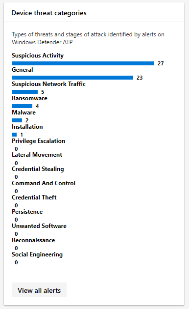

# <a name="device-monitoring-and-reporting-in-the-microsoft-365-security-center"></a><span data-ttu-id="2b6bf-104">Supervisión y generación de informes de dispositivos en el centro de seguridad 365 de Microsoft</span><span class="sxs-lookup"><span data-stu-id="2b6bf-104">Device monitoring and reporting in the Microsoft 365 security center</span></span>

<span data-ttu-id="2b6bf-105">Mantenga los dispositivos protegidos, actualizados y detecte posibles amenazas en el centro de seguridad de Microsoft 365.</span><span class="sxs-lookup"><span data-stu-id="2b6bf-105">Keep your devices secure, up-to-date, and spot potential threats in the Microsoft 365 security center.</span></span>

## <a name="view-device-alerts"></a><span data-ttu-id="2b6bf-106">Ver alertas de dispositivos</span><span class="sxs-lookup"><span data-stu-id="2b6bf-106">View device alerts</span></span>

<span data-ttu-id="2b6bf-107">Obtén las alertas actualizadas sobre la actividad de infracciones y otras amenazas en tus dispositivos de ATP de Microsoft defender (disponible con una licencia E5).</span><span class="sxs-lookup"><span data-stu-id="2b6bf-107">Get up-to-date alerts about breach activity and other threats on your devices from Microsoft Defender ATP (available with an E5 license).</span></span> <span data-ttu-id="2b6bf-108">El centro de seguridad 365 de Microsoft supervisa con eficacia estas alertas en un nivel alto usando el flujo de trabajo preferido.</span><span class="sxs-lookup"><span data-stu-id="2b6bf-108">Microsoft 365 security center effectively monitors these alerts at a high level using your preferred workflow.</span></span>

### <a name="monitor-high-impact-alerts"></a><span data-ttu-id="2b6bf-109">Supervisar alertas de alto impacto</span><span class="sxs-lookup"><span data-stu-id="2b6bf-109">Monitor high-impact alerts</span></span>

<span data-ttu-id="2b6bf-110">Cada alerta de ATP de Microsoft defender tiene una gravedad correspondiente (alta, media, baja o informativa) que indica su posible impacto en la red si se deja desatendida.</span><span class="sxs-lookup"><span data-stu-id="2b6bf-110">Each Microsoft Defender ATP alert has a corresponding severity (high, medium, low, or informational) that indicates its potential impact to your network if left unattended.</span></span>  

<span data-ttu-id="2b6bf-111">Use la tarjeta de **gravedad de alertas de dispositivos** para centrarse específicamente en las alertas más graves y que puedan requerir respuesta inmediata.</span><span class="sxs-lookup"><span data-stu-id="2b6bf-111">Use the **Device alert severity** card to focus specifically on alerts that are more severe and might require immediate response.</span></span> <span data-ttu-id="2b6bf-112">Desde esta tarjeta, puede ver más información en el portal del centro de seguridad de Microsoft defender.</span><span class="sxs-lookup"><span data-stu-id="2b6bf-112">From this card, you can view more information on the Microsoft Defender Security Center portal.</span></span>


### <a name="understand-sources-of-alerts"></a><span data-ttu-id="2b6bf-114">Comprender los orígenes de las alertas</span><span class="sxs-lookup"><span data-stu-id="2b6bf-114">Understand sources of alerts</span></span>

<span data-ttu-id="2b6bf-115">ATP de Microsoft defender aprovecha los datos de una amplia gama de sensores de seguridad y orígenes de inteligencia para generar alertas.</span><span class="sxs-lookup"><span data-stu-id="2b6bf-115">Microsoft Defender ATP leverages data from a broad range of security sensors and intelligence sources to generate alerts.</span></span> <span data-ttu-id="2b6bf-116">Por ejemplo, puede usar la información de detección de antivirus de Windows Defender y antimalware de terceros, así como de su propia inteligencia de amenazas personalizada que se proporciona a través de la API del servicio Web.</span><span class="sxs-lookup"><span data-stu-id="2b6bf-116">For example, it can use detection information from Windows Defender Antivirus and third-party antimalware, as well as your own custom threat intelligence provided through the web service API.</span></span>

<span data-ttu-id="2b6bf-117">La tarjeta orígenes de **detección de alertas de dispositivo** muestra la distribución de las alertas por origen.</span><span class="sxs-lookup"><span data-stu-id="2b6bf-117">The **Device alert detection** sources card shows the distribution of alerts by source.</span></span> <span data-ttu-id="2b6bf-118">Esta tarjeta puede ayudarle a realizar un seguimiento de las actividades relacionadas con determinados orígenes, especialmente con los orígenes personalizados.</span><span class="sxs-lookup"><span data-stu-id="2b6bf-118">This card can help you track activity related to certain sources, particularly your custom sources.</span></span> <span data-ttu-id="2b6bf-119">También puede usarlo para centrarse en las alertas procedentes de sensores que no están configurados para bloquear automáticamente la actividad o los componentes malintencionados.</span><span class="sxs-lookup"><span data-stu-id="2b6bf-119">You can also use this to focus on alerts coming from sensors that are not configured to automatically block malicious activity or components.</span></span>


<span data-ttu-id="2b6bf-121">Desde esta tarjeta, puede ver más información en el portal del centro de seguridad de Microsoft defender.</span><span class="sxs-lookup"><span data-stu-id="2b6bf-121">From this card, you can view more information on the Microsoft Defender Security Center portal.</span></span>

### <a name="understand-the-types-of-threats-that-trigger-alerts"></a><span data-ttu-id="2b6bf-122">Descripción de los tipos de amenazas que desencadenan alertas</span><span class="sxs-lookup"><span data-stu-id="2b6bf-122">Understand the types of threats that trigger alerts</span></span>

<span data-ttu-id="2b6bf-123">ATP de Microsoft defender ordena cada alerta en una categoría que representa una determinada fase de la cadena de ataques o un tipo de componente de amenaza.</span><span class="sxs-lookup"><span data-stu-id="2b6bf-123">Microsoft Defender ATP sorts each alert into a category representing a certain stage in the attack chain or a type of threat component.</span></span> <span data-ttu-id="2b6bf-124">Por ejemplo, una actividad de amenaza detectada se puede clasificar como "movimiento lateral" para indicar que se ha intentado llegar a otros dispositivos de la red.</span><span class="sxs-lookup"><span data-stu-id="2b6bf-124">For example, a detected threat activity might be categorized as "lateral movement" to indicate that there was an attempt to reach other devices on the network.</span></span> <span data-ttu-id="2b6bf-125">Es probable que la actividad también se produjera después de que los atacantes hayan obtenido un primer apoyo.</span><span class="sxs-lookup"><span data-stu-id="2b6bf-125">The activity has also likely occurred after attackers gained an initial foothold.</span></span> <span data-ttu-id="2b6bf-126">Cuando se detecta, un componente de amenaza puede clasificarse ampliamente como malware o más específicamente como ransomware, robo de credenciales u otros tipos de software malintencionado o no deseado.</span><span class="sxs-lookup"><span data-stu-id="2b6bf-126">When detected, a threat component might either be classified broadly as malware, or more specifically as ransomware, credential stealing, or other types of malicious or unwanted software.</span></span>

<span data-ttu-id="2b6bf-127">La tarjeta de **categorías de amenaza de dispositivo** muestra la distribución de las alertas a estas categorías.</span><span class="sxs-lookup"><span data-stu-id="2b6bf-127">The **Device threat categories** card shows the distribution of alerts into these categories.</span></span> <span data-ttu-id="2b6bf-128">Puede usar esta información para identificar la actividad de amenazas, como los intentos de robo de credenciales, que pueden tener un impacto mayor en comparación con los intentos de ingeniería social.</span><span class="sxs-lookup"><span data-stu-id="2b6bf-128">You can use this information to identify threat activity, such as credential theft attempts, that can have higher impact compared to social engineering attempts.</span></span> <span data-ttu-id="2b6bf-129">También puede usar esta información para supervisar amenazas potencialmente destructivas como ransomware.</span><span class="sxs-lookup"><span data-stu-id="2b6bf-129">You can also use this information to monitor for potentially destructive threats like ransomware.</span></span>



### <a name="monitor-active-alerts"></a><span data-ttu-id="2b6bf-131">Supervisar alertas activas</span><span class="sxs-lookup"><span data-stu-id="2b6bf-131">Monitor active alerts</span></span>

<span data-ttu-id="2b6bf-132">La tarjeta de **Estado de alerta de dispositivo** indica el número de alertas que no se han resuelto y que pueden requerir atención.</span><span class="sxs-lookup"><span data-stu-id="2b6bf-132">The **Device alert status** card indicates the number of alerts that have not been resolved and might require attention.</span></span> <span data-ttu-id="2b6bf-133">Desde esta tarjeta, puede ver más información en el portal del centro de seguridad de Microsoft defender.</span><span class="sxs-lookup"><span data-stu-id="2b6bf-133">From this card, you can view more information on the Microsoft Defender Security Center portal.</span></span>


### <a name="monitor-classification-of-resolved-alerts"></a><span data-ttu-id="2b6bf-135">Supervisión de la clasificación de las alertas resueltas</span><span class="sxs-lookup"><span data-stu-id="2b6bf-135">Monitor classification of resolved alerts</span></span>

<span data-ttu-id="2b6bf-136">Al resolver una alerta de ATP de Microsoft defender, el personal de seguridad puede especificar si se ha verificado una alerta como:</span><span class="sxs-lookup"><span data-stu-id="2b6bf-136">When resolving a Microsoft Defender ATP alert, your security staff can specify whether an alert has been verified as:</span></span>

* <span data-ttu-id="2b6bf-137">Una alerta verdadera que identifica la actividad de infracciones real o los componentes de amenazas</span><span class="sxs-lookup"><span data-stu-id="2b6bf-137">A true alert that identifies actual breach activity or threat components</span></span>
* <span data-ttu-id="2b6bf-138">Una alerta falsa que ha detectado incorrectamente actividad normal</span><span class="sxs-lookup"><span data-stu-id="2b6bf-138">A false alert that has incorrectly detected normal activity</span></span>

<span data-ttu-id="2b6bf-139">La tarjeta de **clasificación de alertas de dispositivo** muestra si las alertas resueltas se clasificaron como verdaderas o falsas alertas.</span><span class="sxs-lookup"><span data-stu-id="2b6bf-139">The **Device alert classification** card shows whether your resolved alerts have been classified as true or false alerts.</span></span> <span data-ttu-id="2b6bf-140">Desde esta tarjeta, puede ver más información en el portal del centro de seguridad de Microsoft defender.</span><span class="sxs-lookup"><span data-stu-id="2b6bf-140">From this card, you can view more information on the Microsoft Defender Security Center portal.</span></span>

<span data-ttu-id="2b6bf-141">Nota: en algunos casos, la información de clasificación no está disponible para determinadas alertas.</span><span class="sxs-lookup"><span data-stu-id="2b6bf-141">Note: In some cases, classification information is unavailable for certain alerts.</span></span>


### <a name="monitor-determination-of-resolved-alerts"></a><span data-ttu-id="2b6bf-143">Determinación de la determinación de alertas resueltas</span><span class="sxs-lookup"><span data-stu-id="2b6bf-143">Monitor determination of resolved alerts</span></span>

<span data-ttu-id="2b6bf-144">Además de clasificar si una alerta es verdadera o falsa durante la resolución, el personal de seguridad puede proporcionar una determinación, que indica el tipo de actividad normal o malintencionada que se encontró al validar la alerta.</span><span class="sxs-lookup"><span data-stu-id="2b6bf-144">In addition to classifying whether an alert is true or false during resolution, your security staff can provide a determination, indicating the type of normal or malicious activity that was found while validating the alert.</span></span>

<span data-ttu-id="2b6bf-145">La tarjeta de **determinación de alertas de dispositivo** muestra la determinación proporcionada para cada alerta.</span><span class="sxs-lookup"><span data-stu-id="2b6bf-145">The **Device alert determination** card shows the determination provided for each alert.</span></span>

* <span data-ttu-id="2b6bf-146">**Apt**: amenaza persistente avanzada, que indica que el componente de amenaza o actividad detectada forma parte de una infracción compleja diseñada para llegar a la red afectada</span><span class="sxs-lookup"><span data-stu-id="2b6bf-146">**APT**: advanced persistent threat, indicating that the detected activity or threat component is part of a sophisticated breach designed to gain a foothold in the affected network</span></span>  
* <span data-ttu-id="2b6bf-147">**Malware**: archivo malintencionado o código</span><span class="sxs-lookup"><span data-stu-id="2b6bf-147">**Malware**: malicious file or code</span></span>
* <span data-ttu-id="2b6bf-148">**Personal de seguridad**: actividad normal realizada por el personal de seguridad</span><span class="sxs-lookup"><span data-stu-id="2b6bf-148">**Security personnel**: normal activity performed by security staff</span></span>
* <span data-ttu-id="2b6bf-149">**Pruebas de seguridad**: actividad o componentes diseñados para simular amenazas reales y que se espera que desencadenen sensores de seguridad y generen alertas</span><span class="sxs-lookup"><span data-stu-id="2b6bf-149">**Security testing**: activity or components designed to simulate actual threats and expected to trigger security sensors and generate alerts</span></span>
* <span data-ttu-id="2b6bf-150">**Software no deseado**: aplicaciones y otro software que no se consideran malintencionados pero que infringen las directivas o los estándares de uso aceptables</span><span class="sxs-lookup"><span data-stu-id="2b6bf-150">**Unwanted software**: apps and other software that are not considered malicious, but otherwise violate policy or acceptable use standards</span></span>
* <span data-ttu-id="2b6bf-151">**Otros**: cualquier otra determinación que no se incluya en los tipos proporcionados</span><span class="sxs-lookup"><span data-stu-id="2b6bf-151">**Others**: any other determination that does not fall under the provided types</span></span>

<span data-ttu-id="2b6bf-152">Desde esta tarjeta, puede ver más información en el centro de seguridad de Microsoft defender.</span><span class="sxs-lookup"><span data-stu-id="2b6bf-152">From this card, you can view more information in Microsoft Defender Security Center.</span></span>


### <a name="understand-which-devices-are-at-risk"></a><span data-ttu-id="2b6bf-154">Comprender qué dispositivos están expuestos</span><span class="sxs-lookup"><span data-stu-id="2b6bf-154">Understand which devices are at risk</span></span>

<span data-ttu-id="2b6bf-155">La **protección de dispositivos** muestra el nivel de riesgo para los dispositivos.</span><span class="sxs-lookup"><span data-stu-id="2b6bf-155">**Device protection** shows the risk level for devices.</span></span> <span data-ttu-id="2b6bf-156">El nivel de riesgo se basa en factores como el tipo y la gravedad de las alertas en el dispositivo.</span><span class="sxs-lookup"><span data-stu-id="2b6bf-156">The risk level is based on factors such as the type and severity of alerts on the device.</span></span>


## <a name="monitor-and-report-status-of-intune-managed-devices"></a><span data-ttu-id="2b6bf-158">Supervisión e informes del estado de los dispositivos administrados por Intune</span><span class="sxs-lookup"><span data-stu-id="2b6bf-158">Monitor and report status of Intune-managed devices</span></span>

<span data-ttu-id="2b6bf-159">Los siguientes informes contienen datos de los dispositivos inscritos en Intune.</span><span class="sxs-lookup"><span data-stu-id="2b6bf-159">The following reports contain data from devices enrolled in Intune.</span></span> <span data-ttu-id="2b6bf-160">No se incluyen los datos de los dispositivos no inscritos.</span><span class="sxs-lookup"><span data-stu-id="2b6bf-160">Data from unenrolled devices is not included.</span></span> <span data-ttu-id="2b6bf-161">Solo los administradores globales pueden ver estas tarjetas.</span><span class="sxs-lookup"><span data-stu-id="2b6bf-161">Only Global Administrators can view these cards.</span></span>

<span data-ttu-id="2b6bf-162">Los datos de dispositivos inscritos de Intune incluyen:</span><span class="sxs-lookup"><span data-stu-id="2b6bf-162">Intune enrolled device data includes:</span></span>

* <span data-ttu-id="2b6bf-163">Cumplimiento de dispositivos</span><span class="sxs-lookup"><span data-stu-id="2b6bf-163">Device compliance</span></span>
* <span data-ttu-id="2b6bf-164">Dispositivos con malware activo</span><span class="sxs-lookup"><span data-stu-id="2b6bf-164">Devices with active malware</span></span>
* <span data-ttu-id="2b6bf-165">Tipos de malware en dispositivos</span><span class="sxs-lookup"><span data-stu-id="2b6bf-165">Types of malware on devices</span></span>
* <span data-ttu-id="2b6bf-166">Malware en dispositivos</span><span class="sxs-lookup"><span data-stu-id="2b6bf-166">Malware on devices</span></span>
* <span data-ttu-id="2b6bf-167">Dispositivos con detecciones de malware</span><span class="sxs-lookup"><span data-stu-id="2b6bf-167">Devices with malware detections</span></span>
* <span data-ttu-id="2b6bf-168">Usuarios con detecciones de malware</span><span class="sxs-lookup"><span data-stu-id="2b6bf-168">Users with malware detections</span></span>

### <a name="monitor-device-compliance"></a><span data-ttu-id="2b6bf-169">Supervisar el cumplimiento de dispositivos</span><span class="sxs-lookup"><span data-stu-id="2b6bf-169">Monitor device compliance</span></span>

<span data-ttu-id="2b6bf-170">El **cumplimiento de dispositivos** muestra el número de dispositivos inscritos en Intune compatibles con las directivas de configuración.</span><span class="sxs-lookup"><span data-stu-id="2b6bf-170">**Device compliance** shows how many devices that are enrolled in Intune comply with configuration policies.</span></span>


### <a name="discover-devices-with-malware-detections"></a><span data-ttu-id="2b6bf-172">Detectar dispositivos con detecciones de malware</span><span class="sxs-lookup"><span data-stu-id="2b6bf-172">Discover devices with malware detections</span></span>

<span data-ttu-id="2b6bf-173">Las **detecciones de malware de dispositivos** proporcionan el número de dispositivos inscritos de Intune con malware que no se han resuelto completamente.</span><span class="sxs-lookup"><span data-stu-id="2b6bf-173">**Device malware detections** provide the number of Intune enrolled devices with malware that have not been fully resolved.</span></span> <span data-ttu-id="2b6bf-174">Esto puede deberse a acciones pendientes, a un reinicio, a un examen completo, a acciones manuales del usuario o si la acción de corrección no se completó correctamente.</span><span class="sxs-lookup"><span data-stu-id="2b6bf-174">This can be due to pending actions, a restart, a full scan, manual user actions, or if the remediation action did not complete successfully.</span></span>


### <a name="understand-the-types-of-malware-detected"></a><span data-ttu-id="2b6bf-176">Descripción de los tipos de malware detectados</span><span class="sxs-lookup"><span data-stu-id="2b6bf-176">Understand the types of malware detected</span></span>

<span data-ttu-id="2b6bf-177">**Tipos de malware en dispositivos** muestra distintos tipos de malware que se han detectado en los dispositivos inscritos en Intune.</span><span class="sxs-lookup"><span data-stu-id="2b6bf-177">**Types of malware on devices** show different kinds of malware that have been detected on devices enrolled in Intune.</span></span> <span data-ttu-id="2b6bf-178">Puede investigar cada tipo del centro de seguridad 365 de Microsoft.</span><span class="sxs-lookup"><span data-stu-id="2b6bf-178">You can investigate each type in the Microsoft 365 security center.</span></span>


### <a name="understand-the-specific-malware-detected-on-your-devices"></a><span data-ttu-id="2b6bf-180">Comprender el malware específico detectado en los dispositivos</span><span class="sxs-lookup"><span data-stu-id="2b6bf-180">Understand the specific malware detected on your devices</span></span>

<span data-ttu-id="2b6bf-181">El **malware en dispositivos** proporciona una lista del malware específico detectado en los dispositivos.</span><span class="sxs-lookup"><span data-stu-id="2b6bf-181">**Malware on devices** provide a list of the specific malware detected on your devices.</span></span>


### <a name="understand-which-devices-have-the-most-malware"></a><span data-ttu-id="2b6bf-183">Conocer los dispositivos que tienen más malware</span><span class="sxs-lookup"><span data-stu-id="2b6bf-183">Understand which devices have the most malware</span></span>

<span data-ttu-id="2b6bf-184">Los **dispositivos con detecciones de malware** muestran los dispositivos que tienen más detecciones de malware.</span><span class="sxs-lookup"><span data-stu-id="2b6bf-184">**Devices with malware detections** show which devices have the most malware detections.</span></span> <span data-ttu-id="2b6bf-185">en el centro de seguridad de Microsoft 365, puede investigar si el malware está activo, quién usa el dispositivo y su estado de administración en Intune.</span><span class="sxs-lookup"><span data-stu-id="2b6bf-185">in the Microsoft 365 security center, you can investigate whether malware is active, who uses the device, and its management status in Intune.</span></span>


### <a name="understand-which-users-have-devices-with-the-most-malware"></a><span data-ttu-id="2b6bf-187">Comprender qué usuarios tienen dispositivos con más malware</span><span class="sxs-lookup"><span data-stu-id="2b6bf-187">Understand which users have devices with the most malware</span></span>

<span data-ttu-id="2b6bf-188">**Los usuarios con detecciones de malware** muestran a los usuarios con dispositivos que han detectado más malware.</span><span class="sxs-lookup"><span data-stu-id="2b6bf-188">**Users with malware detections** show users with devices that had the most malware detections.</span></span> <span data-ttu-id="2b6bf-189">En el centro de seguridad 365 de Microsoft, puede ver cuántos dispositivos se asignan a cada usuario y más información acerca de cada dispositivo y el tipo de malware.</span><span class="sxs-lookup"><span data-stu-id="2b6bf-189">In the Microsoft 365 security center, you can see how many devices are assigned to each user and more information about each device and the type of malware.</span></span>


## <a name="monitor-and-manage-asr-rule-deployment-and-detections"></a><span data-ttu-id="2b6bf-191">Supervisión y administración de la implementación y detección de reglas de ASR</span><span class="sxs-lookup"><span data-stu-id="2b6bf-191">Monitor and manage ASR rule deployment and detections</span></span>

<span data-ttu-id="2b6bf-192">[Las reglas de reducción de superficie de ataques (ASR)](https://docs.microsoft.com/windows/security/threat-protection/microsoft-defender-atp/attack-surface-reduction) ayudan a evitar acciones y aplicaciones que normalmente usan los ataques de malware para infectar dispositivos.</span><span class="sxs-lookup"><span data-stu-id="2b6bf-192">[Attack Surface Reduction (ASR) rules](https://docs.microsoft.com/windows/security/threat-protection/microsoft-defender-atp/attack-surface-reduction) help prevent actions and apps that are typically used by exploit-seeking malware to infect devices.</span></span> <span data-ttu-id="2b6bf-193">Estas reglas controlan cuándo y cómo se pueden ejecutar los archivos ejecutables.</span><span class="sxs-lookup"><span data-stu-id="2b6bf-193">These rules control when and how executables can run.</span></span> <span data-ttu-id="2b6bf-194">Por ejemplo, puede impedir que JavaScript o VBScript inicien un archivo ejecutable descargado, bloqueen llamadas API Win32 de macros de Office o bloqueen procesos que se ejecuten desde unidades USB.</span><span class="sxs-lookup"><span data-stu-id="2b6bf-194">For example, you can prevent JavaScript or VBScript from launching a downloaded executable, block Win32 API calls from Office macros, or block processes that run from USB drives.</span></span>


<span data-ttu-id="2b6bf-196">La tarjeta **Reglas de reducción de la superficie expuesta a ataques** ofrece información general sobre la implementación de reglas en los dispositivos.</span><span class="sxs-lookup"><span data-stu-id="2b6bf-196">The **Attack surface reduction rules** card provides an overview of the deployment of rules across your devices.</span></span>

<span data-ttu-id="2b6bf-197">La barra superior de la tarjeta muestra el número total de dispositivos que se encuentran en los siguientes modos de implementación:</span><span class="sxs-lookup"><span data-stu-id="2b6bf-197">The top bar on the card shows the total number of devices that are in the following deployment modes:</span></span>

* <span data-ttu-id="2b6bf-198">**Modo de bloqueo**: dispositivos con al menos una regla configurada para bloquear la actividad detectada</span><span class="sxs-lookup"><span data-stu-id="2b6bf-198">**Block mode**: devices with at least one rule configured to block detected activity</span></span>
* <span data-ttu-id="2b6bf-199">**Modo auditoría**: dispositivos sin reglas establecidas para bloquear la actividad detectada, pero tiene al menos una regla establecida para auditar la actividad detectada</span><span class="sxs-lookup"><span data-stu-id="2b6bf-199">**Audit mode**: devices with no rules set to block detected activity, but has at least one rule set to audit detected activity</span></span>  
* <span data-ttu-id="2b6bf-200">**Desactivado: dispositivos**con todas las reglas de ASR desactivadas</span><span class="sxs-lookup"><span data-stu-id="2b6bf-200">**Off**: devices with all ASR rules turned off</span></span>

<span data-ttu-id="2b6bf-201">La parte inferior de esta tarjeta muestra la configuración por regla en los dispositivos.</span><span class="sxs-lookup"><span data-stu-id="2b6bf-201">The lower part of this card shows settings by rule across your devices.</span></span> <span data-ttu-id="2b6bf-202">Cada barra indica el número de dispositivos que están configurados para bloquear o auditar la detección o que tienen la regla completamente desactivada.</span><span class="sxs-lookup"><span data-stu-id="2b6bf-202">Each bar indicates the number of devices that are set to block or audit detection or have the rule completely turned off.</span></span>

### <a name="view-asr-detections"></a><span data-ttu-id="2b6bf-203">Ver detecciones de ASR</span><span class="sxs-lookup"><span data-stu-id="2b6bf-203">View ASR detections</span></span>

<span data-ttu-id="2b6bf-204">Para ver información detallada sobre las detecciones de reglas de ASR en la red, seleccione **Ver detecciones** en la tarjeta de **reglas de reducción de superficie de ataques** .</span><span class="sxs-lookup"><span data-stu-id="2b6bf-204">To view detailed information about ASR rule detections in your network, select **View detections** on the **Attack surface reduction rules** card.</span></span> <span data-ttu-id="2b6bf-205">Se abrirá la pestaña **detecciones** de la página informe detallado.</span><span class="sxs-lookup"><span data-stu-id="2b6bf-205">The **Detections** tab in the detailed report page will open.</span></span>


<span data-ttu-id="2b6bf-207">El gráfico de la parte superior de la página muestra las detecciones con detecciones de agrupamiento de tiempo que se bloquearon o auditaron.</span><span class="sxs-lookup"><span data-stu-id="2b6bf-207">The chart at the top of the page shows detections over time stacking detections that were either blocked or audited.</span></span> <span data-ttu-id="2b6bf-208">En la tabla de la parte inferior se muestran las detecciones más recientes.</span><span class="sxs-lookup"><span data-stu-id="2b6bf-208">The table at the bottom lists the most recent detections.</span></span> <span data-ttu-id="2b6bf-209">Use la siguiente información de la tabla para comprender la naturaleza de las detecciones:</span><span class="sxs-lookup"><span data-stu-id="2b6bf-209">Use the following information on the table to understand the nature of the detections:</span></span>

* <span data-ttu-id="2b6bf-210">**Archivo detectado**: el archivo, normalmente un script o un documento, cuyo contenido activó la actividad de ataque sospechoso</span><span class="sxs-lookup"><span data-stu-id="2b6bf-210">**Detected file**: the file, typically a script or a document, whose contents triggered the suspected attack activity</span></span>
* <span data-ttu-id="2b6bf-211">**Regla**: nombre que describe las actividades de ataque para las que se ha diseñado la regla.</span><span class="sxs-lookup"><span data-stu-id="2b6bf-211">**Rule**: name describing the attack activities the rule is designed to catch.</span></span> <span data-ttu-id="2b6bf-212">Leer acerca de las reglas de ASR existentes</span><span class="sxs-lookup"><span data-stu-id="2b6bf-212">Read about existing ASR rules</span></span>
* <span data-ttu-id="2b6bf-213">**Aplicación de origen**: aplicación que ha cargado o ejecutado contenido que desencadena la actividad de ataque sospechoso.</span><span class="sxs-lookup"><span data-stu-id="2b6bf-213">**Source app**: the application that loaded or executed content triggering the suspected attack activity.</span></span> <span data-ttu-id="2b6bf-214">Puede ser una aplicación legítima, como un explorador Web, una aplicación de Office o una herramienta del sistema como PowerShell.</span><span class="sxs-lookup"><span data-stu-id="2b6bf-214">This could be a legitimate application, such as web browser, an Office application, or a system tool like PowerShell</span></span>
* <span data-ttu-id="2b6bf-215">**Publisher**: el proveedor que liberó la aplicación de origen</span><span class="sxs-lookup"><span data-stu-id="2b6bf-215">**Publisher**: the vendor that released the source app</span></span>

### <a name="review-device-asr-rule-settings"></a><span data-ttu-id="2b6bf-216">Revisar la configuración de la regla de ASR del dispositivo</span><span class="sxs-lookup"><span data-stu-id="2b6bf-216">Review device ASR rule settings</span></span>

<span data-ttu-id="2b6bf-217">En la página informe de **reglas de reducción de superficie de ataques** , vaya a la ficha de **configuración** para revisar la configuración de las reglas para dispositivos individuales.</span><span class="sxs-lookup"><span data-stu-id="2b6bf-217">In the **Attack surface reduction rules** report page, go to the **Configuration** tab to review rule settings for individual devices.</span></span> <span data-ttu-id="2b6bf-218">Seleccione un dispositivo para obtener información detallada acerca de si cada regla está en modo de bloqueo, modo de auditoría o apagado por completo.</span><span class="sxs-lookup"><span data-stu-id="2b6bf-218">Select a device to get detailed information about whether each rule is in block mode, audit mode, or turned off entirely.</span></span>


<span data-ttu-id="2b6bf-220">Microsoft Intune proporciona funciones de administración para las reglas de ASR.</span><span class="sxs-lookup"><span data-stu-id="2b6bf-220">Microsoft Intune provides management functionality for your ASR rules.</span></span> <span data-ttu-id="2b6bf-221">Si desea actualizar la configuración **, seleccione introducción** a **configurar dispositivos** en la ficha para abrir Administración de dispositivos en Intune.</span><span class="sxs-lookup"><span data-stu-id="2b6bf-221">If you want to update your settings, select **Get started** under **Configure devices** in the tab to open device management on Intune.</span></span>

### <a name="exclude-files-from-asr-rules"></a><span data-ttu-id="2b6bf-222">Excluir archivos de las reglas de ASR</span><span class="sxs-lookup"><span data-stu-id="2b6bf-222">Exclude files from ASR rules</span></span>

<span data-ttu-id="2b6bf-223">El centro de seguridad 365 de Microsoft recopila los nombres de los [archivos que puede que desee excluir](https://docs.microsoft.com/windows/security/threat-protection/microsoft-defender-atp/enable-attack-surface-reduction#exclude-files-and-folders-from-asr-rules) de las detecciones mediante las reglas de reducción de la superficie de ataques.</span><span class="sxs-lookup"><span data-stu-id="2b6bf-223">Microsoft 365 security center collects the names of the [files you might want to exclude](https://docs.microsoft.com/windows/security/threat-protection/microsoft-defender-atp/enable-attack-surface-reduction#exclude-files-and-folders-from-asr-rules) from detections by attack surface reduction rules.</span></span> <span data-ttu-id="2b6bf-224">Al excluir archivos, puede reducir las detecciones de falsos positivos y implementar con mayor confianza las reglas de reducción de superficie de ataques en el modo de bloqueo.</span><span class="sxs-lookup"><span data-stu-id="2b6bf-224">By excluding files, you can reduce false positive detections and more confidently deploy attack surface reduction rules in block mode.</span></span>

<span data-ttu-id="2b6bf-225">Las exclusiones se administran en Microsoft Intune, pero el centro de seguridad de Microsoft 365 proporciona una herramienta de análisis para ayudarle a comprender los archivos.</span><span class="sxs-lookup"><span data-stu-id="2b6bf-225">The exclusions are managed on Microsoft Intune, but Microsoft 365 security center provides an analysis tool to help you understand the files.</span></span> <span data-ttu-id="2b6bf-226">Para iniciar la recopilación de archivos para su exclusión, vaya a la pestaña **agregar exclusiones** en la página del informe **reglas de reducción de superficie de ataques** .</span><span class="sxs-lookup"><span data-stu-id="2b6bf-226">To start collecting files for exclusion, go to the **Add exclusions** tab in the **Attack surface reduction rules** report page.</span></span>

>[!NOTE]  
><span data-ttu-id="2b6bf-227">La herramienta analiza las detecciones por todas las reglas de reducción de la superficie de ataque, pero [solo algunas reglas admiten exclusiones](https://docs.microsoft.com/windows/security/threat-protection/microsoft-defender-atp/troubleshoot-asr).</span><span class="sxs-lookup"><span data-stu-id="2b6bf-227">The tool analyzes detections by all attack surface reduction rules, but [only some rules support exclusions](https://docs.microsoft.com/windows/security/threat-protection/microsoft-defender-atp/troubleshoot-asr).</span></span>


<span data-ttu-id="2b6bf-229">En la tabla se enumeran todos los nombres de archivo detectados por las reglas de reducción de la superficie de ataques.</span><span class="sxs-lookup"><span data-stu-id="2b6bf-229">The table lists all the file names detected by your attack surface reduction rules.</span></span> <span data-ttu-id="2b6bf-230">Puede seleccionar archivos para revisar el impacto de excluirlos:</span><span class="sxs-lookup"><span data-stu-id="2b6bf-230">You can select files to review the impact of excluding them:</span></span>

* <span data-ttu-id="2b6bf-231">El número de detecciones</span><span class="sxs-lookup"><span data-stu-id="2b6bf-231">How many fewer detections</span></span>
* <span data-ttu-id="2b6bf-232">El número de dispositivos que informan sobre las detecciones</span><span class="sxs-lookup"><span data-stu-id="2b6bf-232">How many fewer devices report the detections</span></span>

<span data-ttu-id="2b6bf-233">Para obtener una lista de los archivos seleccionados con todas las rutas de acceso para la exclusión, seleccione **obtener rutas de exclusión**.</span><span class="sxs-lookup"><span data-stu-id="2b6bf-233">To get a list of the selected files with their full paths for exclusion, select **Get exclusion paths**.</span></span>

<span data-ttu-id="2b6bf-234">Registros para la regla de **bloqueo de credenciales de ASR robo desde el subsistema de la autoridad de seguridad local de Windows (LSASS. exe)** Capture la aplicación de origen **LSASS. exe**, un archivo de sistema normal, como el archivo detectado.</span><span class="sxs-lookup"><span data-stu-id="2b6bf-234">Logs for the ASR rule **Block credential stealing from the Windows local security authority subsystem (lsass.exe)** capture the source app **lsass.exe**, a normal system file, as the detected file.</span></span> <span data-ttu-id="2b6bf-235">Como resultado, la lista generada de rutas de exclusión incluirá este archivo.</span><span class="sxs-lookup"><span data-stu-id="2b6bf-235">As a result, the generated list of exclusion paths will include this file.</span></span> <span data-ttu-id="2b6bf-236">Para excluir el archivo que desencadenó esta regla en lugar de **LSASS. exe**, use la ruta de acceso a la aplicación de origen en lugar del archivo detectado.</span><span class="sxs-lookup"><span data-stu-id="2b6bf-236">To exclude the file that triggered this rule instead of **lsass.exe**, use the path to the source app instead of the detected file.</span></span>

<span data-ttu-id="2b6bf-237">Para encontrar la aplicación de origen, ejecute la siguiente [consulta de búsqueda avanzada](https://docs.microsoft.com/windows/security/threat-protection/microsoft-defender-atp/advanced-hunting) para esta regla específica (identificada por el identificador de regla 9e6c4e1f-7d60-472f-ba1a-a39ef669e4b2):</span><span class="sxs-lookup"><span data-stu-id="2b6bf-237">To locate the source app, run the following [advanced hunting query](https://docs.microsoft.com/windows/security/threat-protection/microsoft-defender-atp/advanced-hunting) for this specific rule (identified by rule ID 9e6c4e1f-7d60-472f-ba1a-a39ef669e4b2):</span></span>

```kusto
DeviceEvents
| where Timestamp > ago(7d)
| where ActionType startswith "Asr"
| where AdditionalFields contains "9e6c4e1f-7d60-472f-ba1a-a39ef669e4b2"
| project InitiatingProcessFolderPath, InitiatingProcessFileName
```

#### <a name="check-files-for-exclusion"></a><span data-ttu-id="2b6bf-238">Comprobar archivos para su exclusión</span><span class="sxs-lookup"><span data-stu-id="2b6bf-238">Check files for exclusion</span></span>

<span data-ttu-id="2b6bf-239">Antes de excluir un archivo de ASR, le recomendamos que inspeccione el archivo para determinar si realmente no es malintencionado.</span><span class="sxs-lookup"><span data-stu-id="2b6bf-239">Before excluding a file from ASR, we recommend that you inspect the file to determine if it is indeed not malicious.</span></span>

<span data-ttu-id="2b6bf-240">Para revisar un archivo, use la [Página de información del archivo](https://docs.microsoft.com/windows/security/threat-protection/microsoft-defender-atp/investigate-files) en el centro de seguridad de Microsoft defender.</span><span class="sxs-lookup"><span data-stu-id="2b6bf-240">To review a file, use the [file information page](https://docs.microsoft.com/windows/security/threat-protection/microsoft-defender-atp/investigate-files) on Microsoft Defender Security Center.</span></span> <span data-ttu-id="2b6bf-241">La página proporciona información sobre la prevalencia y la relación de detección de virus VirusTotal.</span><span class="sxs-lookup"><span data-stu-id="2b6bf-241">The page provides prevalence information as well as the VirusTotal antivirus detection ratio.</span></span> <span data-ttu-id="2b6bf-242">También puede usar la página para enviar el archivo para un análisis detallado.</span><span class="sxs-lookup"><span data-stu-id="2b6bf-242">You can also use the page to submit the file for deep analysis.</span></span>

<span data-ttu-id="2b6bf-243">Para buscar un archivo detectado en el centro de seguridad de Microsoft defender, busque todas las detecciones de ASR mediante la siguiente consulta de búsqueda avanzada:</span><span class="sxs-lookup"><span data-stu-id="2b6bf-243">To locate a detected file in Microsoft Defender Security Center, search for all ASR detections using the following advanced hunting query:</span></span>

```kusto
MiscEvents
| where EventTime > ago(7d)
| where ActionType startswith "Asr"
| project FolderPath, FileName, SHA1, InitiatingProcessFolderPath, InitiatingProcessFileName, InitiatingProcessSHA1
```

<span data-ttu-id="2b6bf-244">Use **SHA1** o **InitiatingProcessSHA1** en los resultados para buscar el archivo mediante la barra de búsqueda universal en el centro de seguridad de Microsoft defender.</span><span class="sxs-lookup"><span data-stu-id="2b6bf-244">Use the **SHA1** or the **InitiatingProcessSHA1** in the results to search for the file using the universal search bar in Microsoft Defender Security Center.</span></span>
