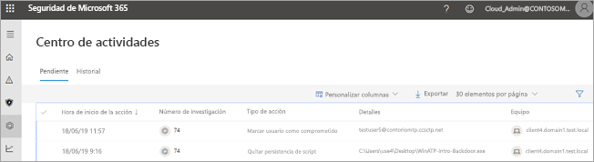
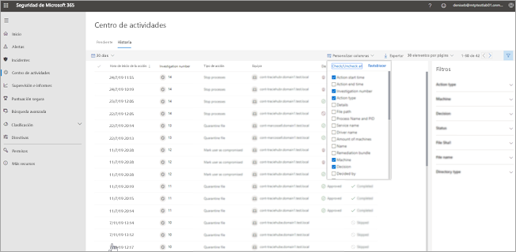
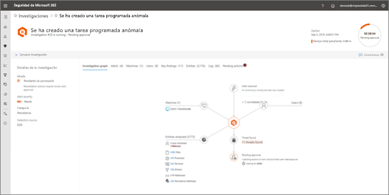

# Vaya a Centro de actividades para ver las acciones correctivas

**Se aplica a:**
- Protección contra amenazas de Microsoft

[!INCLUDE [Prerelease information](../includes/prerelease.md)]

## Una perspectiva centralizada

Use el centro de actividades para ver los resultados de las investigaciones actuales y pasadas en los buzones y dispositivos de su organización. En función del tipo de amenaza y el [veredicto resultante](mtp-autoir-results.md#remediation-actions-following-automated-investigation), las acciones de corrección se ejecutan automáticamente o una vez que el equipo de operaciones de seguridad de la organización las aprueban. Todas las acciones de corrección, tanto si están pendientes de aprobación como si ya se han aprobado, se consolidan en el Centro de actividades. 

El Centro de actividades proporciona una perspectiva centralizada de diferentes tareas, como, por ejemplo:
- Aprobación de las acciones de corrección pendientes;
- Visualización de un registro de auditoría de las acciones de corrección ya aprobadas; y
- Revisión de las acciones de corrección completadas.

El equipo de operaciones de seguridad puede trabajar con más eficacia y eficiencia, ya que el Centro de actividades ofrece una vista integral de la Protección contra amenazas de Microsoft en el trabajo.

## Acciones de corrección

En la tabla siguiente se enumeran las acciones de corrección que se admiten actualmente en el Centro de actividades: 

|Acciones de corrección de puntos de conexión  |Acciones de corrección de correo electrónico  |
|---------|---------|
|Poner archivo en cuarentena Eliminar clave del registro Terminar proceso  Detener el servicio  Eliminar clave del registro  Deshabilitar controlador  Eliminar tarea programada.      |Eliminar temporalmente mensajes de correo electrónico o clústeres Bloquear URL (tiempo de clic) Desactivar el reenvío de correo externo          |

## Vaya al Centro de actividades

1. Vaya a [https://security.microsoft.com](https://security.microsoft.com) e inicie sesión. 

2. En el panel de navegación, elija **Centro de actividades**. 

3. En el Centro de actividades, verá dos pestañas: **Pendientes** e **Historial**.

    - En la pestaña **Pendientes** se muestran las investigaciones que deben ser revisadas y aprobadas por un miembro del equipo de operaciones de seguridad para poder continuar. Asegúrese de revisar los elementos pendientes que vea aquí y tomar las medidas necesarias al respecto.

    - En la pestaña **Historial** se muestran las investigaciones pasadas y las acciones de corrección que se han ejecutado automáticamente. Puede ver los datos del día, la semana, el mes o los seis meses anteriores.

4. Para mostrar solo las columnas que quiera ver, seleccione **Personalizar columnas**. 

5. Seleccione un elemento de la lista para ver más detalles sobre una investigación. Se abrirá la vista de detalles de la investigación. 

    - Si la investigación afecta al contenido de correo electrónico (por ejemplo, la entidad es un buzón), los detalles de la investigación se abren en el Centro de seguridad y cumplimiento de Office 365 ([https://protection.office.com/threatinvestigation](https://protection.office.com/threatinvestigation)). 

    - Si la investigación está relacionada con un dispositivo, los detalles de la investigación se abren en el centro de seguridad ([https://security.microsoft.com](https://security.microsoft.com)). 

> [!TIP]
> Si cree que algo ha perdido o detectado erróneamente las características de respuesta e investigación automatizada en la protección contra amenazas de Microsoft, háganoslo saber. Consulte [Cómo informar de falsos positivos/negativos en capacidades de investigación y respuesta automatizadas (Air) en la protección contra amenazas de Microsoft](mtp-autoir-report-false-positives-negatives.md).

## Permisos necesarios para las tareas del Centro de actividades

Para aprobar o rechazar las acciones pendientes en el Centro de actividades, debe tener asignados los permisos que se indican en la tabla siguiente:

|Acción de corrección |Permisos y roles necesarios |
|--|----|
|Corrección de ATP de Microsoft Defender (dispositivos) |Rol de **administrador de seguridad** asignado en Azure Active Directory ([https://portal.azure.com](https://portal.azure.com)) o en el Centro de administración de Microsoft 365 ([https://admin.microsoft.com](https://admin.microsoft.com)) --- o --- Rol de **acciones de corrección activas** asignado en ATP de Microsoft Defender.     Para obtener más información, vea los siguientes recursos:  - [Permisos de roles de administrador en Azure Active Directory](https://docs.microsoft.com/azure/active-directory/users-groups-roles/directory-assign-admin-roles) - [Crear y administrar roles para el control de acceso basado en roles (ATP de Microsoft Defender)](https://docs.microsoft.com/windows/security/threat-protection/microsoft-defender-atp/user-roles)  |
|Corrección de ATP de Office 365 (contenido de Office y correo electrónico)  |Rol de **administrador de seguridad** asignado en Azure Active Directory ([https://portal.azure.com](https://portal.azure.com)) o en el Centro de administración de Microsoft 365 ([https://admin.microsoft.com](https://admin.microsoft.com)) --- y ---  Rol de **búsqueda y purga** asignado en el Centro de seguridad y cumplimiento de Office 365 ([https://protection.office.com](https://protection.office.com))   **IMPORTANTE**: Si tiene asignado el rol de administrador de seguridad solamente en el Centro de seguridad y cumplimiento de Office 365, no podrá obtener acceso al Centro de actividades ni a las capacidades de Protección contra amenazas de Microsoft. Debe tener el rol de administrador de seguridad asignado en Azure Active Directory o en el Centro de administración de Microsoft 365.   Para obtener más información, vea los siguientes recursos:  - [Permisos de roles de administrador en Azure Active Directory](https://docs.microsoft.com/azure/active-directory/users-groups-roles/directory-assign-admin-roles) - [Permisos en el Centro de seguridad y cumplimiento de Office 365](https://docs.microsoft.com/microsoft-365/security/office-365-security/permissions-in-the-security-and-compliance-center) |

> [!NOTE]
> Los usuarios que tienen el rol de **administrador global** asignado en Azure Active Directory pueden aprobar o denegar cualquier acción pendiente en el Centro de actividades. No obstante, el procedimiento recomendado es que la organización limite el número de usuarios que tienen asignado el rol de administrador global. Le recomendamos que use los roles de **administrador de seguridad**, **acciones de corrección activas** y **búsqueda y purga** enumerados anteriormente para los permisos del Centro de actividades.

## Siguientes pasos 

- [Obtenga más información sobre los incidentes en la Protección contra amenazas de Microsoft](incidents-overview.md)
- [Ver los resultados de una investigación automatizada](mtp-autoir-results.md)
- [Obtenga más información sobre la búsqueda avanzada en la Protección contra amenazas de Microsoft](advanced-hunting-overview.md)

