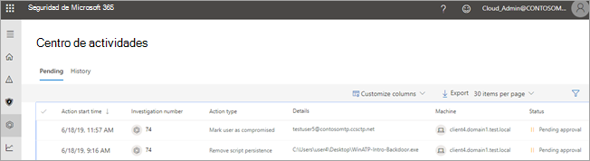
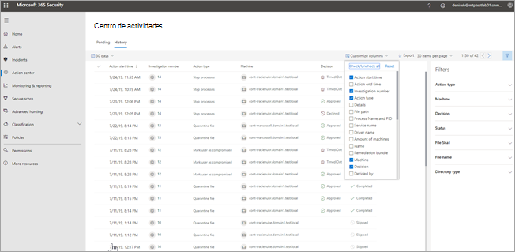

# El centro de actividadesThe Action center

[!INCLUDE [Microsoft 365 Defender rebranding](../includes/microsoft-defender.md)]

**Se aplica a:****Applies to:**
- Protección contra amenazas de MicrosoftMicrosoft Threat Protection

Use el centro de actividades para ver los resultados de las investigaciones actuales y pasadas en los buzones y dispositivos de su organización.Use the Action center to see the results of current and past investigations across your organization's devices and mailboxes. Según el tipo de amenaza y el veredicto resultante, [las acciones de corrección](https://docs.microsoft.com/microsoft-365/security/mtp/mtp-remediation-actions) se producen automáticamente o al aprobarlas por parte del equipo de operaciones de seguridad de la organización.Depending on the type of threat and resulting verdict, [remediation actions](https://docs.microsoft.com/microsoft-365/security/mtp/mtp-remediation-actions) occur automatically or upon approval by your organization's security operations team. Todas las acciones de corrección, tanto si están pendientes de aprobación como si ya se han aprobado, se consolidan en el Centro de actividades.All remediation actions, whether they are pending approval or were already approved, are consolidated in the Action center. 

## Una perspectiva centralizadaA "single pane of glass" experience

El Centro de actividades proporciona una perspectiva centralizada de diferentes tareas, como, por ejemplo:The Action center provides a "single pane of glass" experience for tasks, such as:
- Aprobación de las acciones de corrección pendientes;Approving pending remediation actions;
- Visualización de un registro de auditoría de las acciones de corrección ya aprobadas; yViewing an audit log of already approved remediation actions; and
- Revisión de las acciones de corrección completadas.Reviewing completed remediation actions.

El equipo de operaciones de seguridad puede trabajar con más eficacia y eficiencia, ya que el Centro de actividades ofrece una vista integral de la Protección contra amenazas de Microsoft en el trabajo.Your security operations team can operate more effectively and efficiently, because the Action center provides a comprehensive view of Microsoft Threat Protection at work.

## Vaya al Centro de actividadesGo to the Action center

1. Vaya a [https://security.microsoft.com](https://security.microsoft.com) e inicie sesión.Go to [https://security.microsoft.com](https://security.microsoft.com) and sign in. 

2. En el panel de navegación, elija **Centro de actividades**.In the navigation pane, choose **Action center**. 

3. En el centro de actividades, verá dos pestañas: **pendiente** e **historial**.In the Action center, you'll see two tabs: **Pending** and **History**.

    - En la pestaña **Pendientes** se muestran las investigaciones que deben ser revisadas y aprobadas por un miembro del equipo de operaciones de seguridad para poder continuar.The **Pending** tab lists investigations that require review and approval by someone in your security operations team to continue. Asegúrese de revisar los elementos pendientes que vea aquí y tomar las medidas necesarias al respecto.Make sure to review and take action on pending items you see here.

    - En la pestaña **Historial** se muestran las investigaciones pasadas y las acciones de corrección que se han ejecutado automáticamente.The **History** tab lists past investigations and remediation actions that were taken automatically. Puede ver los datos del día, la semana, el mes o los seis meses anteriores.You can view data for the past day, week, month, or six months.

4. Para mostrar solo las columnas que quiera ver, seleccione **Personalizar columnas**.To show only the columns you want to see, select **Customize columns**. 

5. Seleccione un elemento de la lista para ver más detalles sobre una investigación.Select an item in the list to view more details about an investigation. Se abrirá la vista de detalles de la investigación.The investigation details view opens. 

    - Si la investigación se aplica al contenido de correo electrónico (como, por ejemplo, la entidad es un buzón de correo), los detalles de investigación se abren en el centro de seguridad & cumplimiento ( [https://protection.office.com/threatinvestigation](https://protection.office.com/threatinvestigation) ).If the investigation pertains to email content (such as, the entity is a mailbox), investigation details open in the Security & Compliance Center ([https://protection.office.com/threatinvestigation](https://protection.office.com/threatinvestigation)). 

    - Si la investigación está relacionada con un dispositivo, los detalles de la investigación se abren en el centro de seguridad ([https://security.microsoft.com](https://security.microsoft.com)).If the investigation involves a device, investigation details open in the security center ([https://security.microsoft.com](https://security.microsoft.com)). 

> [!TIP]
> Si cree que algo ha perdido o detectado erróneamente las características de respuesta e investigación automatizada en la protección contra amenazas de Microsoft, háganoslo saber.If you think something was missed or wrongly detected by automated investigation and response features in Microsoft Threat Protection, let us know! Consulte [Cómo informar de falsos positivos/negativos en capacidades de investigación y respuesta automatizadas (Air) en la protección contra amenazas de Microsoft](mtp-autoir-report-false-positives-negatives.md).See [How to report false positives/negatives in automated investigation and response (AIR) capabilities in Microsoft Threat Protection](mtp-autoir-report-false-positives-negatives.md).

## Acciones disponiblesAvailable actions

A medida que se realizan acciones de corrección, aparecen en la pestaña historial del centro de actividades.As remediation actions are taken, they're listed on the History tab in the Action center. Estas acciones incluyen las siguientes:Such actions include the following:

- Recopilar paquete de investigaciónCollect investigation package 
- Aislar dispositivo (se puede deshacer esta acción)Isolate device (this action can be undone) 
- Máquina desincorporaOffboard machine 
- Liberar la ejecución de códigoRelease code execution 
- Liberar de cuarentenaRelease from quarantine 
- Ejemplo de solicitudRequest sample 
- Restringir la ejecución de código (esta acción se puede deshacer)Restrict code execution (this action can be undone) 
- Ejecutar detección de virusRun antivirus scan 
- Detener y poner en cuarentenaStop and quarantine 

## Permisos necesarios para las tareas del Centro de actividadesRequired permissions for Action center tasks

Para aprobar o rechazar las acciones pendientes en el Centro de actividades, debe tener asignados los permisos que se indican en la tabla siguiente:To approve or reject pending actions in the Action center, you must have permissions assigned as listed in the following table:

|Acción de correcciónRemediation action |Permisos y roles necesariosRequired roles and permissions |
|--|----|
|Corrección de ATP de Microsoft Defender (dispositivos)Microsoft Defender ATP remediation (devices) |Rol de administrador de seguridad asignado en Azure Active Directory ([https://portal.azure.com](https://portal.azure.com)) o en el Centro de administración de Microsoft 365 ([https://admin.microsoft.com](https://admin.microsoft.com))Security Administrator role assigned in either Azure Active Directory ([https://portal.azure.com](https://portal.azure.com)) or the Microsoft 365 admin center ([https://admin.microsoft.com](https://admin.microsoft.com)) --- o ------ or --- Rol de acciones de corrección activas asignado en ATP de Microsoft Defender.Active remediation actions role assigned in Microsoft Defender ATP     Para obtener más información, vea los siguientes recursos:To learn more, see the following resources:  - [Permisos de roles de administrador en Azure Active Directory](https://docs.microsoft.com/azure/active-directory/users-groups-roles/directory-assign-admin-roles)- [Administrator role permissions in Azure Active Directory](https://docs.microsoft.com/azure/active-directory/users-groups-roles/directory-assign-admin-roles) - [Crear y administrar roles para el control de acceso basado en roles (ATP de Microsoft Defender)](https://docs.microsoft.com/windows/security/threat-protection/microsoft-defender-atp/user-roles)- [Create and manage roles for role-based access control (Microsoft Defender ATP)](https://docs.microsoft.com/windows/security/threat-protection/microsoft-defender-atp/user-roles)  |
|Corrección de ATP de Office 365 (contenido de Office y correo electrónico)Office 365 ATP remediation (Office content and email)  |Rol de administrador de seguridad asignado en Azure Active Directory ([https://portal.azure.com](https://portal.azure.com)) o en el Centro de administración de Microsoft 365 ([https://admin.microsoft.com](https://admin.microsoft.com))Security Administrator role assigned in either Azure Active Directory ([https://portal.azure.com](https://portal.azure.com)) or the Microsoft 365 admin center ([https://admin.microsoft.com](https://admin.microsoft.com)) --- y ------ and ---  Rol de búsqueda y depuración asignado al centro de seguridad & cumplimiento ( [https://protection.office.com](https://protection.office.com) )Search and Purge role assigned the Security & Compliance Center ([https://protection.office.com](https://protection.office.com))   **Importante**: Si tiene asignado el rol de administrador de seguridad en el centro de seguridad & cumplimiento, no podrá acceder al centro de actividades ni a las capacidades de Microsoft Threat Protection.**IMPORTANT**: If you have the Security Administrator role assigned only in the Security & Compliance Center, you will not be able to access the Action center or Microsoft Threat Protection capabilities. Debe tener el rol de administrador de seguridad asignado en Azure Active Directory o en el Centro de administración de Microsoft 365.You must have the Security Administrator role assigned in Azure Active Directory or the Microsoft 365 admin center.   Para obtener más información, vea los siguientes recursos:To learn more, see the following resources:  - [Permisos de roles de administrador en Azure Active Directory](https://docs.microsoft.com/azure/active-directory/users-groups-roles/directory-assign-admin-roles)- [Administrator role permissions in Azure Active Directory](https://docs.microsoft.com/azure/active-directory/users-groups-roles/directory-assign-admin-roles) - [Permisos en el centro de seguridad & cumplimiento](https://docs.microsoft.com/microsoft-365/security/office-365-security/permissions-in-the-security-and-compliance-center)- [Permissions in the Security & Compliance Center](https://docs.microsoft.com/microsoft-365/security/office-365-security/permissions-in-the-security-and-compliance-center) |

> [!NOTE]
> Los usuarios que tienen el rol de administrador global asignado en Azure Active Directory pueden aprobar o denegar cualquier acción pendiente en el Centro de actividades.Users who have the Global Administrator role assigned in Azure Active Directory can approve or reject any pending action in the Action center. No obstante, el procedimiento recomendado es que la organización limite el número de usuarios que tienen asignado el rol de administrador global.However, as a best practice, your organization should limit the number of people who have the Global Administrator role assigned. Le recomendamos que use los roles de administrador de seguridad, acciones de corrección activas y búsqueda y purga enumerados anteriormente para los permisos del Centro de actividades.We recommend using the Security Administrator, Active remediation actions, and Search and Purge roles listed above for Action center permissions.

## Pasos siguientesNext steps 

- [Aprobar o rechazar acciones pendientes tras una investigación automatizadaApprove or reject pending actions following an automated investigation](mtp-autoir-actions.md)
- [Ver los resultados de una investigación automatizadaView the results of an automated investigation](mtp-autoir-results.md)

