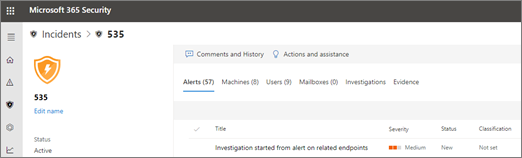

# Detalles y resultados de una investigación automatizadaDetails and results of an automated investigation

**Se aplica a:****Applies to:**
- Protección contra amenazas de MicrosoftMicrosoft Threat Protection

Cuando se produce una investigación automatizada en la Protección contra amenazas de Microsoft, los detalles sobre esa investigación están disponibles durante y después del proceso de investigación automatizada.When an automated investigation occurs in Microsoft Threat Protection, details about that investigation are available during and after the automated investigation process. Si tiene los [permisos necesarios](mtp-action-center.md#required-permissions-for-action-center-tasks), puede ver esos detalles en la vista de detalles de la investigación.If you have the [necessary permissions](mtp-action-center.md#required-permissions-for-action-center-tasks), you can view those details in an investigation details view. La vista de detalles de la investigación ofrece un estado actualizado y la capacidad de aprobar las acciones pendientes.The investigation details view provides you with up-to-date status and the ability to approve any pending actions. 

## Abrir la vista de detalles de la investigaciónOpen the investigation details view

Puede abrir un informe en la vista previa de impresión utilizando uno de los métodos siguientes:You can open the investigation details view by using one of the following methods:
- [Seleccionar un elemento en el centro de actividadesSelect an item in the Action center](#select-an-item-in-the-action-center)
- [Seleccionar una investigación en una página de detalles de un incidenteSelect an investigation from an incident details page](#open-an-investigation-from-an-incident-details-page)

### Seleccionar un elemento en el centro de actividadesSelect an item in the Action center

Use el centro de actividades para ver las acciones que estén pendientes de aprobación (en la pestaña **pendiente**) o que ya se hayan aprobado (en la pestaña **historial**).Use the Action center to view actions that are either pending approval (on the **Pending** tab) or were already approved (on the **History** tab). 

1. Vaya a [https://security.microsoft.com](https://security.microsoft.com) e inicie sesión.Go to [https://security.microsoft.com](https://security.microsoft.com) and sign in. 

2. En el panel de navegación, elija **Centro de actividades**.In the navigation pane, choose **Action center**. 

3. En la pestaña **pendiente** o **historial**, seleccione un elemento.On either the **Pending** or **History** tab, select an item. Si tiene los [permisos necesarios](mtp-action-center.md#required-permissions-for-action-center-tasks), puede aprobar (o rechazar) acciones pendientes.If you have the [necessary permissions](mtp-action-center.md#required-permissions-for-action-center-tasks), you can approve (or reject) pending actions.

### Abrir una investigación desde una página de detalles de un incidenteOpen an investigation from an incident details page

Use una página de detalles de un incidente para ver información detallada sobre un incidente, incluidas las alertas que contenían información acerca de cualquier dispositivo, cuenta de usuario o buzón que les afecten.Use an incident details page to view detailed information about an incident, including alerts that were triggered information about any affected devices, user accounts, or mailboxes.

1. Vaya a [https://security.microsoft.com](https://security.microsoft.com) e inicie sesión.Go to [https://security.microsoft.com](https://security.microsoft.com) and sign in. 

2. En el panel de navegación, elija **incidentes**.In the navigation pane, choose **Incidents**. 

3. Seleccione un elemento de la lista para abrir la vista detalles del incidente.Select an item in the list to open the incident details view. 

4. En la pestaña **investigaciones**, seleccione una investigación en la lista.On the **Investigations** tab, select an investigation in the list.

## Detalles de la investigaciónInvestigation details

Use la vista detalles de la investigación para ver la actividad pasada, actual y pendiente relacionada con una investigación.Use the investigation details view to see past, current, and pending activity pertaining to an investigation. La vista de detalles de la investigación es similar a la siguiente imagen:The investigation details view resembles the following image:

En la vista de detalles de la investigación, puede ver información en las pestañas **gráfico de investigación**, **alertas**, **dispositivos**, **identidades**, **resultados clave**, **entidades**, **registro**, y **acciones pendientes**, que se describen en la siguiente tabla.In the Investigation details view, you can see information on the **Investigation graph**, **Alerts**, **Devices**, **Identities**, **Key findings**, **Entities**, **Log**, and **Pending actions** tabs, described in the following table.

|PestañaTab    |DescripciónDescription |
|--------|--------|
|Gráfico de investigaciónInvestigation graph    |Proporciona una representación visual de la investigación.Provides a visual representation of the investigation. Se muestra una lista de las entidades y se muestran las amenazas, junto con las alertas y si hay acciones pendientes de aprobación.Depicts entities and lists threats found, along with alerts and whether any actions are awaiting approval. Puede hacer clic en un elemento del gráfico para ver más detalles.You can click an item on the graph to view more details. Por ejemplo, al hacer clic en el icono **amenazas detectadas** le llevará a la pestaña **resultados clave**.For example, clicking the **Threats found** icon takes you to the **Key findings** tab. |
|AlertasAlerts |Muestra las alertas relacionadas con la investigación.Lists alerts associated with the investigation. Las alertas pueden provenir de características de protección contra amenazas en el equipo de un usuario, en las aplicaciones de Office, Cloud App Security y otras características de Protección contra amenazas de Microsoft 365.Alerts can come from threat protection features on a user's machine, in Office apps, Cloud App Security, and other Microsoft 365 Threat Protection features.|
|DispositivosDevices|Muestra los equipos incluidos en la investigación junto con el nivel de corrección.Lists machines included in the investigation along with remediation level.|
|Resultados claveKey findings   |Muestra los resultados de la investigación junto con el estado y las acciones tomadas o pendientes.Lists results from the investigation along with status and actions taken or pending. Puede aprobar acciones pendientes para dispositivos e identidades en esta pestaña.You can approve pending actions for devices and identities in on this tab.|
|EntidadesEntities   |Muestra las actividades del usuario, archivos, procesos, servicios, controladores, direcciones IP y métodos de persistencia asociados con la investigación, junto con el estado y las acciones tomadas.Lists user activities, files, processes, services, drivers, IP addresses, and persistence methods associated with the investigation, along with status and actions taken.|
|RegistroLog    |Ofrece una vista detallada de todos los pasos realizados durante la investigación, junto con el estado.Provides a detailed view of all steps taken during the investigation, along with status.|
|Acciones pendientesPending actions    |Muestra los elementos que necesitan aprobación para continuar.Lists items that require approval to proceed.|

## Siguientes pasosNext steps

- [Obtener una visión general de los permisos del centro de actividadesGet an overview of Action center permissions](mtp-action-center.md#required-permissions-for-action-center-tasks)

- [Aprobar o rechazar acciones relacionadas con la investigación y la respuesta automatizadasApprove or reject actions related to automated investigation and response](mtp-autoir-actions.md)

