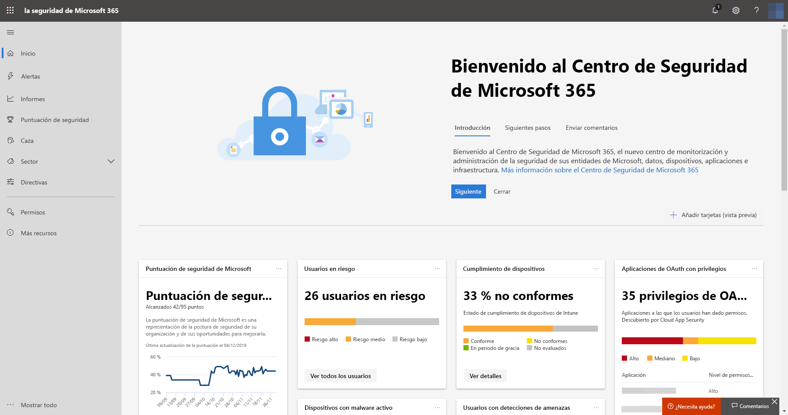
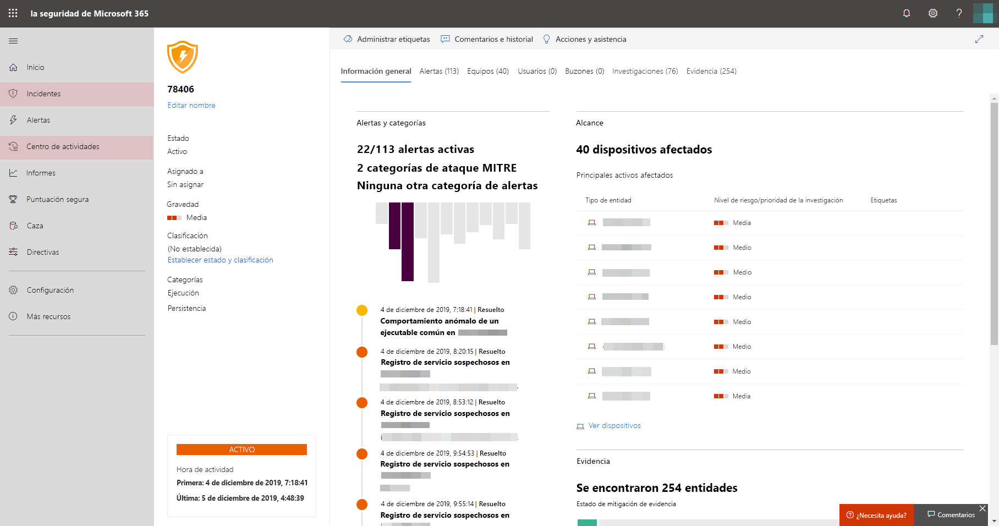

# Habilitar la Protección contra amenazas de Microsoft

**Se aplica a:**
- Protección contra amenazas de Microsoft

[!INCLUDE [Prerelease information](../includes/prerelease.md)]

La Protección contra amenazas de Microsoft unifica el proceso de respuesta a incidentes de seguridad mediante la integración de las capacidades clave en la Protección contra amenazas avanzada (ATP) de Microsoft Defender, Office 365 ATP, Microsoft Cloud App Security y Azure ATP. Esta experiencia unificada aporta potentes características a las que puede acceder desde el Centro de seguridad de Microsoft 365.

## Compruebe su elegibilidad
Los clientes con una licencia de Microsoft 365 E5 o equivalente pueden usar la Protección contra amenazas de Microsoft. Para obtener más información, [lea los requisitos de licencia](prerequisites.md#licensing-requirements).

## Empiece a usar el servicio
Activar el servicio de Protección contra amenazas de Microsoft agrega datos de diferentes servicios integrados. Los datos se procesan y almacenan de forma centralizada para identificar nuevas perspectivas y posibilitar la centralización de flujos de trabajo de respuesta.

Antes de activar el servicio, el Centro de seguridad de Microsoft 365 ([security.microsoft.com](https://security.microsoft.com)) no muestra en el menú los **Incidentes** ni las opciones del **Centro de actividades**.

*Centro de seguridad de Microsoft 365 con la Protección contra amenazas de Microsoft desactivada*

Para activar el servicio de Protección contra amenazas de Microsoft, vaya a **Configuración** > **** Protección contra amenazas de Microsoft > **Participar/No participar** en el Centro de seguridad de Microsoft 365. Para ello, debe ser administrador global o de seguridad de [Azure Active Directory](https://docs.microsoft.com/azure/active-directory/users-groups-roles/directory-assign-admin-roles#available-roles).

Si su organización dispone de ATP de Microsoft Defender, los datos se almacenarán y procesarán en la misma ubicación del centro de datos que seleccionara para [sus datos de ATP de Microsoft Defender](https://docs.microsoft.com/windows/security/threat-protection/microsoft-defender-atp/data-storage-privacy). Si no tiene ATP de Microsoft defender, se le pedirá que elija una nueva ubicación del centro de datos específicamente para la Protección contra amenazas de Microsoft. Tendrá que dar su consentimiento para que los datos se compartan entre los servicios y se agreguen.

### Confirme que el servicio está activado
Una vez que recibe el servicio, este agrega:

- [Administración de incidentes](incidents-overview.md)
- Un centro de actividades para administrar [una investigación y respuestas automáticas](mtp-autoir.md)
- [Características de búsqueda](advanced-hunting-overview.md) avanzadas en la página de **Búsqueda**

*Centro de seguridad de Microsoft 365 con gestión de incidentes y otras características de Protección contra amenazas de Microsoft*

### Obtener datos de Azure ATP
Para compartir datos de Azure ATP con la Protección contra amenazas de Microsoft, asegúrese de que esté activada la integración entre Microsoft Cloud App Security y Azure ATP. [Infórmese de esta integración](https://docs.microsoft.com/cloud-app-security/aatp-integration)

## Deshabilitar la Protección contra amenazas de Microsoft
Para dejar de usar la Protección contra amenazas de Microsoft, vaya a **Configuración** > **** Protección contra amenazas de Microsoft > **** Participar/No participar en el Centro de seguridad de Microsoft 365. Anule la selección de **Activar la Protección contra amenazas de Microsoft** y guarde los cambios.

Los datos se eliminarán de forma permanente y se quitarán las características correspondientes del Centro de seguridad de Microsoft 365.

## Cómo recibir asistencia

El personal de Microsoft puede ayudarle a recibir o anular el servicio y los recursos relacionados en su espacio empresarial. Para obtener ayuda, [póngase en contacto con el soporte técnico Premier](https://go.microsoft.com/fwlink/?LinkID=733758).

## Temas relacionados

- [Introducción a la Protección contra amenazas de Microsoft](microsoft-threat-protection.md)
- [Requisitos de licencia y otros requisitos previos](prerequisites.md)
- [Introducción al ATP de Microsoft Defender](https://docs.microsoft.com/windows/security/threat-protection/microsoft-defender-atp/microsoft-defender-advanced-threat-protection)
- [Introducción al ATP de Office 365](../office-365-security/office-365-atp.md)
- [Introducción a Microsoft Cloud App Security](https://docs.microsoft.com/cloud-app-security/what-is-cloud-app-security)
- [Introducción al ATP de Azure](https://docs.microsoft.com/azure-advanced-threat-protection/what-is-atp)
- [Almacenamiento de datos del ATP de Microsoft Defender](https://docs.microsoft.com/windows/security/threat-protection/microsoft-defender-atp/data-storage-privacy)
