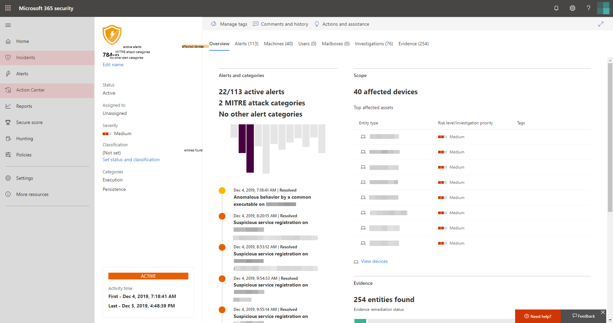

# Habilitar la Protección contra amenazas de MicrosoftTurn on Microsoft Threat Protection

**Se aplica a:****Applies to:**
- Protección contra amenazas de MicrosoftMicrosoft Threat Protection

La Protección contra amenazas de Microsoft unifica el proceso de respuesta a incidentes de seguridad mediante la integración de las capacidades clave en la Protección contra amenazas avanzada (ATP) de Microsoft Defender, Office 365 ATP, Microsoft Cloud App Security y Azure ATP.Microsoft Threat Protection unifies your incident response process by integrating key capabilities across Microsoft Defender Advanced Threat Protection (ATP), Office 365 ATP, Microsoft Cloud App Security, and Azure ATP. Esta experiencia unificada aporta potentes características a las que puede acceder desde el Centro de seguridad de Microsoft 365.This unified experience adds powerful features you can access in the Microsoft 365 security center.

## Comprobar la elegibilidad de la licencia y los permisos necesariosCheck license eligibility and required permissions
Los clientes con Microsoft 365 E5, la seguridad de Microsoft 365 E5 o una combinación equivalente de licencias pueden usar la protección contra amenazas de Microsoft.Customers with Microsoft 365 E5, Microsoft 365 E5 Security, or an equivalent combination of licenses can use Microsoft Threat Protection. Para obtener más información, [lea los requisitos de licencia](prerequisites.md#licensing-requirements).For more information, [read the licensing requirements](prerequisites.md#licensing-requirements).

Debe ser **administrador global** o **Administrador de seguridad** en [Azure Active Directory](https://docs.microsoft.com/azure/active-directory/users-groups-roles/directory-assign-admin-roles#available-roles) para activar la protección contra amenazas de Microsoft.You must be a **global administrator** or a **security administrator** in [Azure Active Directory](https://docs.microsoft.com/azure/active-directory/users-groups-roles/directory-assign-admin-roles#available-roles) to turn on Microsoft Threat Protection.

## Empiece a usar el servicioStart using the service
Microsoft Threat Protection agrega datos de los diversos servicios integrados.Microsoft Threat Protection aggregates data from the various integrated services. Procesará y almacenará datos de forma centralizada para identificar nuevos conocimientos y hacer que los flujos de trabajo de respuesta centralizados sean posibles.It will process and store data centrally to identify new insights and make centralized response workflows possible.

Antes de activar el servicio, el centro de seguridad 365 de Microsoft ([Security.Microsoft.com](https://security.microsoft.com)) no muestra los **incidentes** ni las opciones del **centro de actividades** en el panel de navegación.Before you turn on the service, the Microsoft 365 security center ([security.microsoft.com](https://security.microsoft.com)) doesn't show the **Incidents** and the **Action center** options in the navigation pane.

Microsoft Threats Features Microsoft*365 centro de seguridad con Microsoft Threat Protection* desactivado
*Microsoft 365 security center with Microsoft Threat Protection turned off*

Para activar la protección contra amenazas de Microsoft, seleccione **configuración** en el panel de navegación.To turn on Microsoft Threat Protection, select **Settings** in the navigation pane. En la **[página Configuración](https://security.microsoft.com/settings)**, vaya a la**opción de activación/exclusión**de **Microsoft Threat Protection** > .In the **[Settings page](https://security.microsoft.com/settings)**, go to **Microsoft Threat Protection** > **Opt-in / Opt-out**.

>[!NOTE]
>Si no ve la **configuración** en el panel de navegación o no pudo obtener acceso a la página, compruebe los permisos y las licencias.If you don't see **Settings** in the navigation pane or couldn't access the page, check your permissions and licenses.

### Seleccionar la ubicación del centro de datosSelect data center location
Si su organización dispone de ATP de Microsoft Defender, los datos se almacenarán y procesarán en la misma ubicación del centro de datos que seleccionara para [sus datos de ATP de Microsoft Defender](https://docs.microsoft.com/windows/security/threat-protection/microsoft-defender-atp/data-storage-privacy).If Microsoft Defender ATP has been provisioned for your organization, data will be stored and processed in the same data center location you have selected for [your Microsoft Defender ATP data](https://docs.microsoft.com/windows/security/threat-protection/microsoft-defender-atp/data-storage-privacy). Si no tiene ATP de Microsoft defender, se le pedirá que elija una nueva ubicación del centro de datos específicamente para la Protección contra amenazas de Microsoft.If you don't have Microsoft Defender ATP, you will be asked to choose a new data center location specifically for Microsoft Threat Protection. 

Debe proporcionar el consentimiento antes de que los datos se compartan entre los servicios y se agreguen.You need to provide consent before data is shared between services and aggregated.

### Confirme que el servicio está activadoConfirm that the service is on
Una vez que recibe el servicio, este agrega:Once the service is provisioned, it adds:

- [Administración de incidentesIncidents management](incidents-overview.md)
- Un centro de actividades para administrar [una investigación y respuestas automáticas](mtp-autoir.md)An action center for managing [automated investigation and response](mtp-autoir.md)
- [Características de búsqueda](advanced-hunting-overview.md) avanzadas en la página de **Búsqueda**[Advanced hunting](advanced-hunting-overview.md) capabilities to the existing **Hunting** page

Microsoft Threat Protection características de*Microsoft 365 Security Center con incidentes de administración de incidentes y otras capacidades de protección contra amenazas de Microsoft*
*Microsoft 365 security center with incidents management and other Microsoft Threat Protection capabilities*

### Obtener datos de Azure ATPGetting Azure ATP data
Para compartir datos de Azure ATP con la Protección contra amenazas de Microsoft, asegúrese de que esté activada la integración entre Microsoft Cloud App Security y Azure ATP.To share Azure ATP data with Microsoft Threat Protection, ensure that Microsoft Cloud App Security and Azure ATP integration is turned on. [Infórmese de esta integraciónLearn more about this integration](https://docs.microsoft.com/cloud-app-security/aatp-integration)

## Deshabilitar la Protección contra amenazas de MicrosoftTurn off Microsoft Threat Protection
Para dejar de usar la Protección contra amenazas de Microsoft, vaya a **Configuración** > \*\*\*\* Protección contra amenazas de Microsoft > \*\*\*\* Participar/No participar en el Centro de seguridad de Microsoft 365.To stop using Microsoft Threat Protection, go to **Settings** > **Microsoft Threat Protection** > **Opt-in / Opt-out** in the Microsoft 365 security center. Anule la selección de **Activar la Protección contra amenazas de Microsoft** y guarde los cambios.Unselect **Turn on Microsoft Threat Protection** and save the changes.

Los datos se eliminarán de forma permanente y se quitarán las características correspondientes del centro de seguridad de Microsoft 365.Data will be permanently deleted and corresponding features will be removed from the Microsoft 365 security center.

## Cómo recibir asistenciaGet assistance

El personal de soporte técnico de Microsoft puede ayudarle a aprovisionar o desaprovisionar el servicio y los recursos relacionados en su espacio empresarial.Microsoft support staff can help provision or deprovision the service and related resources on your tenant. Para obtener ayuda, seleccione **¿necesita ayuda?** en el centro de seguridad de Microsoft 365.For assistance, select **Need help?** in the Microsoft 365 security center. Al ponerse en contacto con el soporte técnico, mencione Microsoft Threat Protection.When contacting support, mention Microsoft Threat Protection.

## Temas relacionadosRelated topics

- [Introducción a la Protección contra amenazas de MicrosoftMicrosoft Threat Protection overview](microsoft-threat-protection.md)
- [Requisitos de licencia y otros requisitos previosLicensing requirements and other prerequisites](prerequisites.md)
- [Introducción al ATP de Microsoft DefenderMicrosoft Defender ATP overview](https://docs.microsoft.com/windows/security/threat-protection/microsoft-defender-atp/microsoft-defender-advanced-threat-protection)
- [Introducción al ATP de Office 365Office 365 ATP overview](../office-365-security/office-365-atp.md)
- [Introducción a Microsoft Cloud App SecurityMicrosoft Cloud App Security overview](https://docs.microsoft.com/cloud-app-security/what-is-cloud-app-security)
- [Introducción al ATP de AzureAzure ATP overview](https://docs.microsoft.com/azure-advanced-threat-protection/what-is-atp)
- [Almacenamiento de datos del ATP de Microsoft DefenderMicrosoft Defender ATP data storage](https://docs.microsoft.com/windows/security/threat-protection/microsoft-defender-atp/data-storage-privacy)
