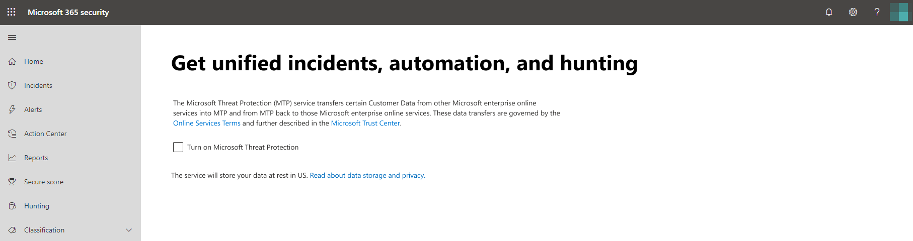

# Habilitar la Protección contra amenazas de MicrosoftTurn on Microsoft Threat Protection

**Se aplica a:****Applies to:**
- Protección contra amenazas de MicrosoftMicrosoft Threat Protection

[Microsoft Threat Protection](microsoft-threat-protection.md) unifica el proceso de respuesta ante incidentes mediante la integración de capacidades clave en la protección contra amenazas avanzada de Microsoft defender (ATP), Office 365 ATP, Microsoft Cloud App Security y Azure ATP.[Microsoft Threat Protection](microsoft-threat-protection.md) unifies your incident response process by integrating key capabilities across Microsoft Defender Advanced Threat Protection (ATP), Office 365 ATP, Microsoft Cloud App Security, and Azure ATP. Esta experiencia unificada aporta potentes características a las que puede acceder desde el Centro de seguridad de Microsoft 365.This unified experience adds powerful features you can access in the Microsoft 365 security center.

La protección contra amenazas de Microsoft se activa automáticamente cuando los clientes elegibles con los permisos necesarios visitan el centro de seguridad de Microsoft 365.Microsoft Threat Protection automatically turns on when eligible customers with the required permissions visit Microsoft 365 security center. Lea este artículo para conocer varios requisitos previos y cómo se aprovisiona la protección contra amenazas de Microsoft.Read this article to understand various prerequisites and how Microsoft Threat Protection is provisioned.

## Comprobar la elegibilidad de la licencia y los permisos necesariosCheck license eligibility and required permissions
Una licencia a un producto de seguridad 365 de Microsoft generalmente le da derecho a usar Microsoft Threat Protection en el centro de seguridad de Microsoft 365 sin costo adicional de licencias.A license to a Microsoft 365 security product generally entitles you to use Microsoft Threat Protection in Microsoft 365 security center without additional licensing cost. Le recomendamos que obtenga una licencia de seguridad de Microsoft 365 E5, E5 Security, A5 o a5 o una combinación válida de licencias que proporcione acceso a todos los servicios admitidos.We do recommend getting a Microsoft 365 E5, E5 Security, A5, or A5 Security license or a valid combination of licenses that provides access to all supported services.

Para obtener información detallada sobre la licencia, [Lea los requisitos de licencia](prerequisites.md#licensing-requirements).For detailed licensing information, [read the licensing requirements](prerequisites.md#licensing-requirements).

### Comprobar el rolCheck your role
Debe ser **administrador global** o **Administrador de seguridad** en Azure Active Directory para activar la protección contra amenazas de Microsoft.You must be a **global administrator** or a **security administrator** in Azure Active Directory to turn on Microsoft Threat Protection. [Ver sus roles en Azure ADView your roles in Azure AD](https://docs.microsoft.com//azure/active-directory/users-groups-roles/directory-manage-roles-portal)

## Servicios admitidosSupported services
Microsoft Threat Protection agrega datos de los diversos servicios compatibles que ya ha implementado.Microsoft Threat Protection aggregates data from the various supported services that you've already deployed. Procesará y almacenará datos de forma centralizada para identificar nuevos conocimientos y hacer que los flujos de trabajo de respuesta centralizados sean posibles.It will process and store data centrally to identify new insights and make centralized response workflows possible. Lo hace sin afectar a las implementaciones, la configuración o los datos existentes asociados con los servicios integrados.It does this without affecting existing deployments, settings, or data associated with the integrated services.

Para obtener la mejor protección y optimizar la protección contra amenazas de Microsoft, se recomienda implementar todos los servicios admitidos aplicables en la red.To get the best protection and optimize Microsoft Threat Protection, we recommend deploying all applicable supported services on your network. Para obtener más información, [Consulte acerca de la implementación de servicios compatibles](deploy-supported-services.md).For more information, [read about deploying supported services](deploy-supported-services.md).

## Antes de iniciar el servicioBefore starting the service
Antes de activar el servicio, el centro de seguridad 365 de Microsoft ([Security.Microsoft.com](https://security.microsoft.com)) muestra la página de configuración de Microsoft Threat Protection al seleccionar **incidentes**, **centro de actividades**o **caza** en el panel de navegación.Before you turn on the service, the Microsoft 365 security center ([security.microsoft.com](https://security.microsoft.com)) shows the Microsoft Threat Protection settings page when you select **Incidents**, **Action center**, or **Hunting** from the navigation pane. Estos elementos de navegación no se muestran si no es elegible para usar la protección contra amenazas de Microsoft.These navigation items are not shown if you are not eligible to use Microsoft Threat Protection.

 *configuración de protección contra amenazas de Microsoft en el centro de seguridad de Microsoft 365*
*Microsoft Threat Protection settings in Microsoft 365 security center*

## Inicio del servicioStarting the service
Para activar la protección contra amenazas de Microsoft, simplemente seleccione **activar la protección contra amenazas de Microsoft** y aplicar el cambio.To turn on Microsoft Threat Protection, simply select **Turn on Microsoft Threat Protection** and apply the change. También puede tener acceso a esta opción si selecciona **configuración** ([Security.Microsoft.com/Settings](https://security.microsoft.com/settings)) en el panel de navegación y, a continuación, selecciona protección contra **amenazas de Microsoft**.You can also access this option by selecting **Settings** ([security.microsoft.com/settings](https://security.microsoft.com/settings)) in the navigation pane and then selecting **Microsoft Threat Protection**.

>[!NOTE]
>Si no ve la **configuración** en el panel de navegación o no pudo obtener acceso a la página, compruebe los permisos y las licencias.If you don't see **Settings** in the navigation pane or couldn't access the page, check your permissions and licenses.

### Ubicación del centro de datosData center location
Microsoft Threat Protection almacenará y procesará los datos en la [misma ubicación usada por ATP de Microsoft defender](https://docs.microsoft.com/windows/security/threat-protection/microsoft-defender-atp/data-storage-privacy).Microsoft Threat Protection will store and process data in the [same location used by Microsoft Defender ATP](https://docs.microsoft.com/windows/security/threat-protection/microsoft-defender-atp/data-storage-privacy). Si no tiene Microsoft defender ATP, se selecciona automáticamente una nueva ubicación del centro de datos en función de la ubicación de los servicios de seguridad de Microsoft 365 activos.If you don't have Microsoft Defender ATP, a new data center location is automatically selected based on the location of active Microsoft 365 security services. La ubicación del centro de datos seleccionada se muestra en la pantalla.The selected data center location is shown in the screen.

>[!NOTE]
>Seleccione **¿necesita ayuda?** en el centro de seguridad de Microsoft 365, póngase en contacto con el soporte técnico de Microsoft sobre provisión de la protección contra amenazas de Microsoft en otra ubicación del centro de datos.Select **Need help?** in the Microsoft 365 security center to contact Microsoft support about provision Microsoft Threat Protection in a different data center location. 

### Confirme que el servicio está activadoConfirm that the service is on
Una vez que recibe el servicio, este agrega:Once the service is provisioned, it adds:

- [Administración de incidentesIncidents management](incidents-overview.md)
- Un centro de actividades para administrar [una investigación y respuestas automáticas](mtp-autoir.md)An action center for managing [automated investigation and response](mtp-autoir.md)
- Funcionalidades de [búsqueda avanzada](advanced-hunting-overview.md)[Advanced hunting](advanced-hunting-overview.md) capabilities

 *Microsoft 365 Security Center con incidentes de administración de incidentes y otras capacidades de protección contra amenazas de Microsoft*
*Microsoft 365 security center with incidents management and other Microsoft Threat Protection capabilities*

### Obtener datos de Azure ATPGetting Azure ATP data
Para compartir datos de Azure ATP con la Protección contra amenazas de Microsoft, asegúrese de que esté activada la integración entre Microsoft Cloud App Security y Azure ATP.To share Azure ATP data with Microsoft Threat Protection, ensure that Microsoft Cloud App Security and Azure ATP integration is turned on. [Infórmese de esta integraciónLearn more about this integration](https://docs.microsoft.com/cloud-app-security/aatp-integration)

## Deshabilitar la Protección contra amenazas de MicrosoftTurn off Microsoft Threat Protection
Para dejar de usar la Protección contra amenazas de Microsoft, vaya a **Configuración** > \*\*\*\* Protección contra amenazas de Microsoft > \*\*\*\* Participar/No participar en el Centro de seguridad de Microsoft 365.To stop using Microsoft Threat Protection, go to **Settings** > **Microsoft Threat Protection** > **Opt-in / Opt-out** in the Microsoft 365 security center. Anule la selección **de activar la protección contra amenazas de Microsoft** y aplicar los cambios.Unselect **Turn on Microsoft Threat Protection** and apply the changes.

Se quitarán las características correspondientes del centro de seguridad de Microsoft 365.Corresponding features will be removed from the Microsoft 365 security center.

## Cómo recibir asistenciaGet assistance

Para obtener respuestas a las preguntas más comunes sobre la activación de la protección contra amenazas de Microsoft, [Lea las preguntas más frecuentes](mtp-enable-faq.md).To get answers to the most commonly asked questions about turning on Microsoft Threat Protection, [read the FAQ](mtp-enable-faq.md).

El personal de soporte técnico de Microsoft puede ayudarle a aprovisionar o desaprovisionar el servicio y los recursos relacionados en su espacio empresarial.Microsoft support staff can help provision or deprovision the service and related resources on your tenant. Para obtener ayuda, seleccione **¿necesita ayuda?** en el centro de seguridad de Microsoft 365.For assistance, select **Need help?** in the Microsoft 365 security center. Al ponerse en contacto con el soporte técnico, mencione Microsoft Threat Protection.When contacting support, mention Microsoft Threat Protection.

## Temas relacionadosRelated topics

- [Preguntas más frecuentesFrequently asked questions](mtp-enable-faq.md)
- [Requisitos de licencia y otros requisitos previosLicensing requirements and other prerequisites](prerequisites.md)
- [Implementación de servicios compatiblesDeploy supported services](deploy-supported-services.md)
- [Introducción a la Protección contra amenazas de MicrosoftMicrosoft Threat Protection overview](microsoft-threat-protection.md)
- [Introducción al ATP de Microsoft DefenderMicrosoft Defender ATP overview](https://docs.microsoft.com/windows/security/threat-protection/microsoft-defender-atp/microsoft-defender-advanced-threat-protection)
- [Introducción al ATP de Office 365Office 365 ATP overview](../office-365-security/office-365-atp.md)
- [Introducción a Microsoft Cloud App SecurityMicrosoft Cloud App Security overview](https://docs.microsoft.com/cloud-app-security/what-is-cloud-app-security)
- [Introducción al ATP de AzureAzure ATP overview](https://docs.microsoft.com/azure-advanced-threat-protection/what-is-atp)
- [Almacenamiento de datos del ATP de Microsoft DefenderMicrosoft Defender ATP data storage](https://docs.microsoft.com/windows/security/threat-protection/microsoft-defender-atp/data-storage-privacy)