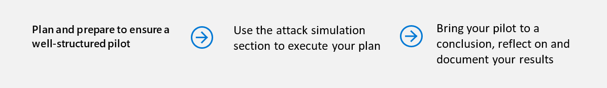

# Ejecutar el proyecto piloto de Microsoft Threat ProtectionRun your pilot Microsoft Threat Protection project 

[!INCLUDE [Microsoft 365 Defender rebranding](../includes/microsoft-defender.md)]

**Se aplica a:****Applies to:**
- Protección contra amenazas de MicrosoftMicrosoft Threat Protection

Para determinar con eficacia el beneficio y la adopción de la protección contra amenazas de Microsoft (MTP), puede ejecutar un proyecto piloto.To effectively determine the benefit and adoption of Microsoft Threat Protection (MTP), you can run a pilot project. Antes de habilitar la protección contra amenazas de Microsoft en su entorno de producción y comenzar con casos de uso definidos, es mejor pasar por un proceso de planeación para determinar las tareas que deben realizarse en este proyecto piloto y los criterios de éxito.Before enabling Microsoft Threat Protection in your production environment and starting with defined use cases, it is best to go through a planning process to determine the tasks that must be accomplished in this pilot project, and the success criteria. 

## Cómo usar esta guía del pilotoHow to use this pilot playbook

En esta guía se proporciona información general sobre la protección contra amenazas de Microsoft e instrucciones paso a paso sobre cómo configurar el proyecto piloto.This guide provides an overview of Microsoft Threat Protection and step-by-step instructions on how to set up your pilot project. 

La siguiente escala de tiempo de ejemplo varía en función de la necesidad de disponer de los recursos adecuados en el entorno.The following sample timeline varies depending on having the right resources in your environment. Es posible que algunas detecciones y flujos de trabajo necesiten más tiempo de aprendizaje que los otros.Some detections and workflows might need more learning time than the others.

>[!IMPORTANT]
>Para obtener resultados óptimos, siga las instrucciones piloto de la forma más parecida posible.For optimum results, follow the pilot instructions as closely as possible.

### Fases de la guía pilotoPilot playbook phases 

Hay cuatro fases para ejecutar un piloto de Microsoft Threat Protection:There are four phases in running a Microsoft Threat Protection pilot:

|FasePhase | DescripciónDescription | 
|:-------|:-----|
|  [PlanificaciónPlanning](mtp-pilot-plan.md)| Obtenga información sobre lo que debe tener en cuenta antes de ejecutar el proyecto piloto de Microsoft Threat Protection:Learn what you need to consider before running your Microsoft Threat Protection pilot project:   -Scope- Scope   Casos de uso de- Use cases  - Requisitos- Requirements  -Plan de pruebas- Test plan   -Criterios de éxito- Success criteria   -Cuadro de mandos- Scorecard 
|   [DeclaraciónPreparation](mtp-evaluation.md)|  Obtenga acceso al centro de seguridad de Microsoft 365 para configurar el entorno piloto de Microsoft Threat Protection.Access Microsoft 365 Security Center to setup your Microsoft Threat Protection pilot  environment. Se le guiará para:You will be guided to:  -Identificar las partes interesadas y buscar la firma para el proyecto piloto- Identify stakeholders and seek sign-off for your pilot   Consideraciones del entorno- Environment considerations  Acceso a- Access  -Instalación de Azure Active Directory- Azure Active Directory setup   -Orden de configuración- Configuration order   -Inscríbase en la versión de prueba de Microsoft 365 E5- Sign up for Microsoft 365 E5 Trial   -Configurar dominio- Configure domain  -Asignar licencias de Microsoft 365 E5- Assign Microsoft 365 E5 licenses   -Completar el Asistente de configuración en el portal- Complete the setup wizard in the portal|
|   [Simulación de ataquesAttack simulation](mtp-pilot-simulate.md) | Para simular un ataque, se le guiará a lo siguiente:To simulate an attack, you will be guided to:  -Comprobación de los requisitos del entorno de prueba- Verify the test environment requirements  -Ejecutar la simulación-  Run the simulation  -Investigar un incidente- Investigate an incident  -resolver el incidente- resolve the incident 
|   [Cierre y ResumenClosing and summary](mtp-pilot-close.md) | Cuando haya llegado al final del proceso, se le guiará a lo siguiente:When you've reached the end of the process, you will be guided to:  -Pase por el resultado final- Go through your final output -Presentar la salida a las partes interesadas- Present your output to your stakeholders  -Proporcionar comentarios- Provide feedback  -Realizar los siguientes pasos- Take next steps 

## Paso siguienteNext step
|  [Fase de planeaciónPlanning phase](mtp-pilot-plan.md) | Planeación de un proyecto piloto de Microsoft Threat ProtectionPlan your Microsoft Threat Protection pilot project 
|:-------|:-----|
