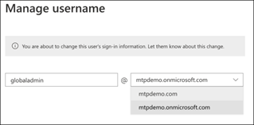

# Configurar el entorno de laboratorio de prueba de Microsoft Threat Protection 

**Se aplica a:**
- Protección contra amenazas de Microsoft 

La creación de un entorno de laboratorio de prueba de Microsoft Threat Protection y su implementación es un proceso de tres fases:

 
<table border="0" width="100%" align="center">
  <tr style="text-align:center;">
    <td align="center" style="width:25%; border:0;" >
      <a href= "https://docs.microsoft.com/microsoft-365/security/mtp/prepare-mtpeval?view=o365-worldwide"> 
        
       Fase 1: preparación</a> 
    </td>
     <td align="center"bgcolor="#d5f5e3">
      <a href="https://docs.microsoft.com/microsoft-365/security/mtp/setup-mtpeval?view=o365-worldwide">
        
       Fase 2: configuración</a> 
    </td>
    <td align="center">
      <a href="https://docs.microsoft.com/microsoft-365/security/mtp/config-mtpeval?view=o365-worldwide">
        
       Fase 3: configurar & incorporado</a> 
</td>

  </tr>
</table>

Actualmente se encuentra en la fase de configuración. Realice los pasos iniciales para acceder al centro de seguridad 365 de Microsoft y, a continuación, configure el entorno de laboratorio de prueba.

Regístrese para obtener una suscripción de Office 365 o Azure Active Directory para generar un inquilino *. onmicrosoft.com* que puede usar para registrarse en su licencia de Microsoft 365 E5. 

>[!NOTE]
>Si ya tiene una suscripción a Office 365 o Azure Active Directory existente, puede omitir los pasos de creación de inquilinos de prueba de Office 365 E5.

En esta fase, se le guiará a:
- Crear un inquilino de prueba de Office 365 E5
- Habilitar la suscripción de prueba de Microsoft 365

## Crear un inquilino de prueba de Office 365 E5
>[!NOTE]
>Si ya tiene una suscripción a Office 365 o Azure Active Directory existente, puede omitir los pasos de creación de inquilinos de prueba de Office 365 E5.

1. Vaya al [portal de producto de Office 365 E5](https://www.microsoft.com/microsoft-365/business/office-365-enterprise-e5-business-software?activetab=pivot%3aoverviewtab) y seleccione **prueba gratuita**.
  
  
2. Para completar el registro de prueba, escriba su dirección de correo electrónico (personal o Corporate). Haga clic en **configurar cuenta**.
   

3. Escriba su nombre, apellidos, número de teléfono del trabajo, nombre de la compañía, tamaño de la compañía y país o región.  
   
>[!NOTE]
>El país o la región que establezca aquí determina la región del centro de datos donde se hospedará Office 365.
  
4. Elija su preferencia de comprobación: mediante un mensaje de texto o una llamada. Haga clic en **Enviar código de verificación**. 
  

5. Establezca el nombre de dominio personalizado para el inquilino y, a continuación, haga clic en **siguiente**.
   
 
6. Configure la primera identidad que será un administrador global del espacio empresarial. Escriba un **nombre** y una **contraseña**. Haga clic en **Iniciar sesión**.
  

7. Haga clic en **ir al programa de instalación** para completar el aprovisionamiento de inquilino de prueba de Office 365 E5.
   

8. Conecte el dominio corporativo al inquilino de Office 365. Opcional Elija **conectar un dominio que ya posee** y escriba el nombre de dominio. Haga clic en **Siguiente**.
   
 
9. Tendrá que agregar un registro TXT o MX para validar la propiedad del dominio. Una vez que haya agregado el registro TXT o MX a su dominio, seleccione **comprobar**.
   
 
10. Opcional Cree más cuentas de usuario para el inquilino. Puede omitir este paso haciendo clic en **siguiente**.
  
 
11. Opcional Descargue las aplicaciones de Office. Haga clic en **siguiente** para omitir este paso. 
   

12. Opcional Migrar mensajes de correo electrónico. De nuevo, puede omitir este paso.
   
 
13. Elija servicios en línea. Seleccione **Exchange** y haga clic en **siguiente**. 
   

14. Agregue los registros MX, CNAME y TXT a su dominio. Una vez completada, seleccione **comprobar**.
   
 
15. Enhorabuena, ha completado el aprovisionamiento de su inquilino de Office 365.
   

## Habilitar la suscripción de prueba de Microsoft 365

>[!NOTE]
>Al registrarse para obtener una prueba, se le da 25 licencias de usuario para usarla durante un mes. Consulte [probar o comprar una suscripción a M365](https://docs.microsoft.com/microsoft-365/commerce/try-or-buy-microsoft-365?view=o365-worldwide#try-or-buy-a-microsoft-365-subscription-1) para obtener más información.

1. En [centro de administración de 365 de Microsoft](https://admin.microsoft.com/), haga clic en **facturación** y navegue a **servicios de compra**.

2. Seleccione **Microsoft 365 E5** y haga clic en **iniciar prueba gratuita**. 
  

3. Elija su preferencia de comprobación: mediante un mensaje de texto o una llamada. Una vez que haya decidido, escriba el número de teléfono, seleccione **texto me** o **llámeme** en función de la selección.
  
 
4. Escriba el código de verificación y haga clic en **iniciar la versión de prueba gratuita**. 
   

5. Haga clic en **probar ahora** para confirmar la prueba de Microsoft 365 E5.
   
 
6. Vaya a los usuarios activos del **centro de administración de Microsoft 365**  >  **Users**  >  **Active users**. Seleccione su cuenta de usuario, seleccione **administrar licencias de producto**y, a continuación, intercambie la licencia de Office 365 E5 a **Microsoft 365 E5**. Haga clic en **Guardar**.
  
 
7. Seleccione la cuenta de administrador global de nuevo y haga clic en **administrar nombre de usuario**.
   

8. Opcional Cambie el dominio de *onmicrosoft.com* a su propio dominio, en función de lo que elija en los pasos anteriores. Haga clic en **Guardar cambios**.
   

## Paso siguiente
||| |:-------|:-----| config-onboard. png)  [Fase 3: configuración & incorporada](config-mtpeval.md) | Configure cada pilar de protección contra amenazas de Microsoft para el entorno de prueba de la protección contra amenazas de Microsoft y incorpore los puntos de conexión.
