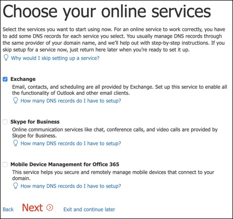

# Configurar el entorno de laboratorio de prueba de Microsoft Threat ProtectionSet up your Microsoft Threat Protection trial lab environment 

**Se aplica a:****Applies to:**
- Protección contra amenazas de MicrosoftMicrosoft Threat Protection 

La creación de un entorno de laboratorio de prueba de Microsoft Threat Protection y su implementación es un proceso de tres fases:Creating a Microsoft Threat Protection trial lab environment and deploying it is a three-phase process:

 
<table border="0" width="100%" align="center">
  <tr style="text-align:center;">
    <td align="center" style="width:25%; border:0;" >
      <a href= "https://docs.microsoft.com/microsoft-365/security/mtp/prepare-mtpeval?view=o365-worldwide"> 
        
       Fase 1: preparación</a>Phase 1: Prepare </a> 
    </td>
     <td align="center"bgcolor="#d5f5e3">
      <a href="https://docs.microsoft.com/microsoft-365/security/mtp/setup-mtpeval?view=o365-worldwide">
        
       Fase 2: configuración</a>Phase 2: Setup </a> 
    </td>
    <td align="center">
      <a href="https://docs.microsoft.com/microsoft-365/security/mtp/config-mtpeval?view=o365-worldwide">
        
       Fase 3: configurar & incorporado</a>Phase 3: Configure & Onboard </a> 
</td>

  </tr>
</table>

Actualmente se encuentra en la fase de configuración.You are currently in the set up phase. Realice los pasos iniciales para acceder al centro de seguridad 365 de Microsoft y, a continuación, configure el entorno de laboratorio de prueba.Take the initial steps to access Microsoft 365 Security Center then setup your trial lab environment.

Regístrese para obtener una suscripción de Office 365 o Azure Active Directory para generar un inquilino *. onmicrosoft.com* que puede usar para registrarse en su licencia de Microsoft 365 E5.Sign up for an Office 365 or Azure Active Directory subscription to generate a *.onmicrosoft.com* tenant that you can use to sign up for your Microsoft 365 E5 license. 

>[!NOTE]
>Si ya tiene una suscripción a Office 365 o Azure Active Directory existente, puede omitir los pasos de creación de inquilinos de prueba de Office 365 E5.If you already have an existing Office 365 or Azure Active Directory subscription, you can skip the Office 365 E5 trial tenant creation steps.

En esta fase, se le guiará a:In this phase, you'll be guided to:
- Crear un inquilino de prueba de Office 365 E5Create an Office 365 E5 trial tenant
- Habilitar la suscripción de prueba de Microsoft 365Enable Microsoft 365 trial subscription

## Crear un inquilino de prueba de Office 365 E5Create an Office 365 E5 trial tenant
>[!NOTE]
>Si ya tiene una suscripción a Office 365 o Azure Active Directory existente, puede omitir los pasos de creación de inquilinos de prueba de Office 365 E5.If you already have an existing Office 365 or Azure Active Directory subscription, you can skip the Office 365 E5 trial tenant creation steps.

1. Vaya al [portal de producto de Office 365 E5](https://www.microsoft.com/microsoft-365/business/office-365-enterprise-e5-business-software?activetab=pivot%3aoverviewtab) y seleccione **prueba gratuita**.Go to the [Office 365 E5 product portal](https://www.microsoft.com/microsoft-365/business/office-365-enterprise-e5-business-software?activetab=pivot%3aoverviewtab) and select **Free trial**.
  
  
2. Para completar el registro de prueba, escriba su dirección de correo electrónico (personal o Corporate).Complete the trial registration by entering your email address (personal or corporate). Haga clic en **configurar cuenta**.Click **Set up account**.
   

3. Escriba su nombre, apellidos, número de teléfono del trabajo, nombre de la compañía, tamaño de la compañía y país o región.Fill in your first name, last name, business phone number, company name, company size and country or region.  
   
>[!NOTE]
>El país o la región que establezca aquí determina la región del centro de datos donde se hospedará Office 365.The country or region you set here determines the data center region your Office 365 will be hosted.
  
4. Elija su preferencia de comprobación: mediante un mensaje de texto o una llamada.Choose your verification preference: through a text message or call. Haga clic en **Enviar código de verificación**.Click **Send Verification Code**. 
  

5. Establezca el nombre de dominio personalizado para el inquilino y, a continuación, haga clic en **siguiente**.Set the custom domain name for your tenant, then click **Next**.
   
 
6. Configure la primera identidad que será un administrador global del espacio empresarial.Set up the first identity which will be a Global Administrator for the tenant. Escriba un **nombre** y una **contraseña**.Fill in **Name** and **Password**. Haga clic en **Iniciar sesión**.Click **Sign up**.
  

7. Haga clic en **ir al programa de instalación** para completar el aprovisionamiento de inquilino de prueba de Office 365 E5.Click **Go to Setup** to complete the Office 365 E5 trial tenant provisioning.
   

8. Conecte el dominio corporativo al inquilino de Office 365.Connect your corporate domain to the Office 365 tenant. Opcional Elija **conectar un dominio que ya posee** y escriba el nombre de dominio.[Optional] Choose **Connect a domain you already own** and type in your domain name. Haga clic en **Siguiente**.Click **Next**.
   
 
9. Tendrá que agregar un registro TXT o MX para validar la propiedad del dominio.You will need to add a TXT or MX record to validate the domain ownership. Una vez que haya agregado el registro TXT o MX a su dominio, seleccione **comprobar**.Once you’ve added the TXT or MX record to your domain, select **Verify**.
   
 
10. Opcional Cree más cuentas de usuario para el inquilino.[Optional] Create more user accounts for your tenant. Puede omitir este paso haciendo clic en **siguiente**.You can skip this step by clicking **Next**.
  
 
11. Opcional Descargue las aplicaciones de Office.[Optional] Download Office apps. Haga clic en **siguiente** para omitir este paso.Click **Next** to skip this step. 
   

12. Opcional Migrar mensajes de correo electrónico.[Optional] Migrate email messages. De nuevo, puede omitir este paso.Again, you can skip this step.
   
 
13. Elija servicios en línea.Choose online services. Seleccione **Exchange** y haga clic en **siguiente**.Select **Exchange** and click **Next**. 
   

14. Agregue los registros MX, CNAME y TXT a su dominio.Add MX, CNAME and TXT records to your domain. Una vez completada, seleccione **comprobar**.When completed, select **Verify**.
   
 
15. Enhorabuena, ha completado el aprovisionamiento de su inquilino de Office 365.Congratulations, you have completed the provisioning of your Office 365 tenant.
   

## Habilitar la suscripción de prueba de Microsoft 365Enable Microsoft 365 trial subscription

>[!NOTE]
>Al registrarse para obtener una prueba, se le da 25 licencias de usuario para usarla durante un mes.Signing up for a trial gives you 25 user licenses to use for a month. Consulte [probar o comprar una suscripción a M365](https://docs.microsoft.com/microsoft-365/commerce/try-or-buy-microsoft-365?view=o365-worldwide#try-or-buy-a-microsoft-365-subscription-1) para obtener más información.See [Try or Buy an M365 subscription](https://docs.microsoft.com/microsoft-365/commerce/try-or-buy-microsoft-365?view=o365-worldwide#try-or-buy-a-microsoft-365-subscription-1) for details.

1. En [centro de administración de 365 de Microsoft](https://admin.microsoft.com/), haga clic en **facturación** y navegue a **servicios de compra**.From [Microsoft 365 Admin Center](https://admin.microsoft.com/), click **Billing** and then navigate to **Purchase services**.

2. Seleccione **Microsoft 365 E5** y haga clic en **iniciar prueba gratuita**.Select **Microsoft 365 E5** and click **Start free trial**. 
  

3. Elija su preferencia de comprobación: mediante un mensaje de texto o una llamada.Choose your verification preference: through a text message or call. Una vez que haya decidido, escriba el número de teléfono, seleccione **texto me** o **llámeme** en función de la selección.Once you have decided, enter the phone number, select **Text me** or **Call me** depending on your selection.
  
 
4. Escriba el código de verificación y haga clic en **iniciar la versión de prueba gratuita**.Enter the verification code and click **Start your free trial**. 
   

5. Haga clic en **probar ahora** para confirmar la prueba de Microsoft 365 E5.Click **Try now** to confirm your Microsoft 365 E5 trial.
   
 
6. Vaya a los usuarios activos del **centro de administración de Microsoft 365**  >  **Users**  >  **Active users**.Go to the **Microsoft 365 Admin Center** > **Users** > **Active users**. Seleccione su cuenta de usuario, seleccione **administrar licencias de producto**y, a continuación, intercambie la licencia de Office 365 E5 a **Microsoft 365 E5**.Select your user account, select **Manage product licenses**, then swap the license from Office 365 E5 to **Microsoft 365 E5**. Haga clic en \*\*Guardar \*\*.Click **Save**.
  
 
7. Seleccione la cuenta de administrador global de nuevo y haga clic en **administrar nombre de usuario**.Select the global administrator account again then click **Manage username**.
   

8. Opcional Cambie el dominio de *onmicrosoft.com* a su propio dominio, en función de lo que elija en los pasos anteriores.[Optional] Change the domain from *onmicrosoft.com* to your own domain—depending on what you chose on the previous steps. Haga clic en **Guardar cambios**.Click **Save changes**.
   

## Paso siguienteNext step
|||
|:-------|:-----|
|  [Fase 3: configurar & incorporadoPhase 3: Configure & Onboard](config-mtpeval.md) | Configure cada pilar de protección contra amenazas de Microsoft para su laboratorio de evaluación de Microsoft Threat Protection y incorpore los puntos de conexión.Configure each Microsoft Threat Protection pillar for your Microsoft Threat Protection evaluation lab and onboard your endpoints.
