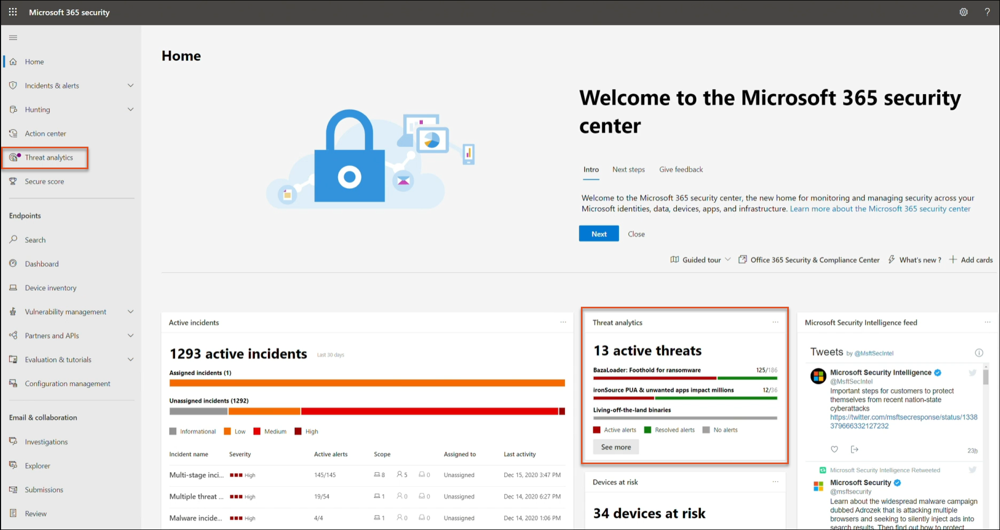
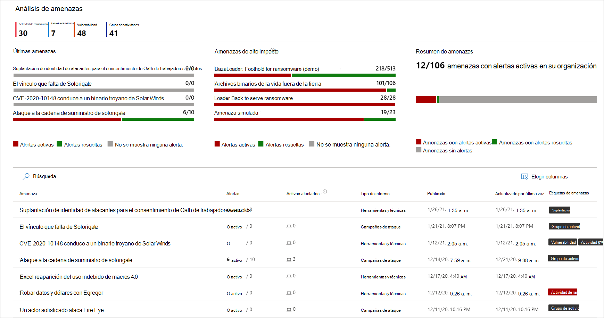
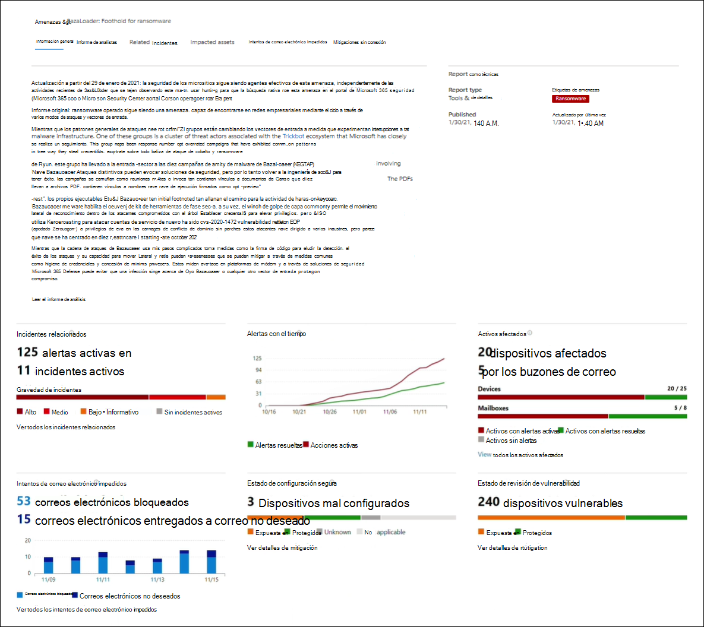
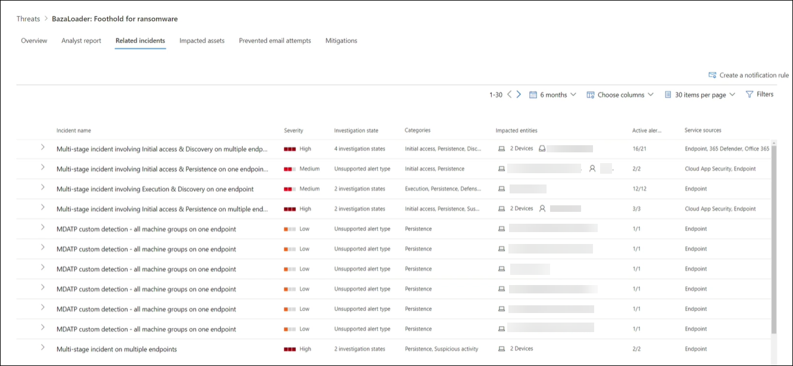
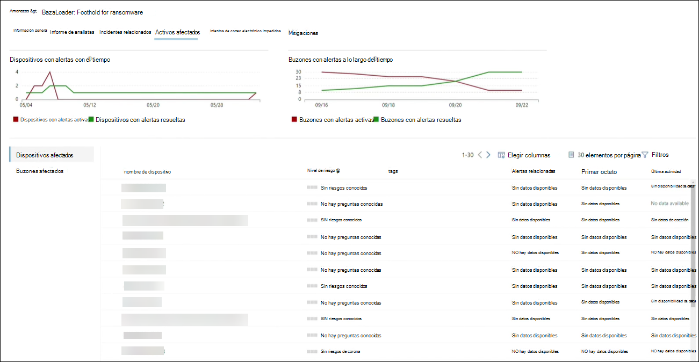
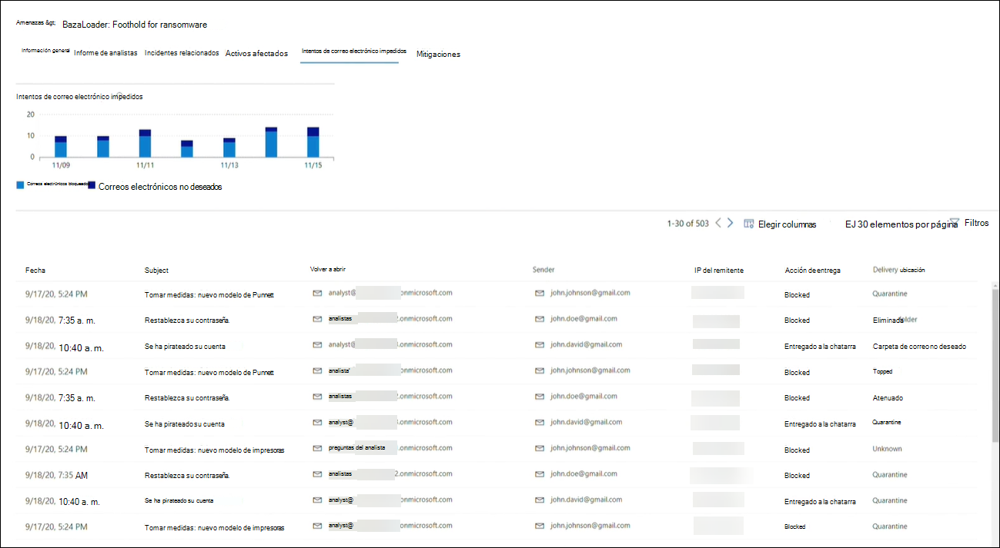
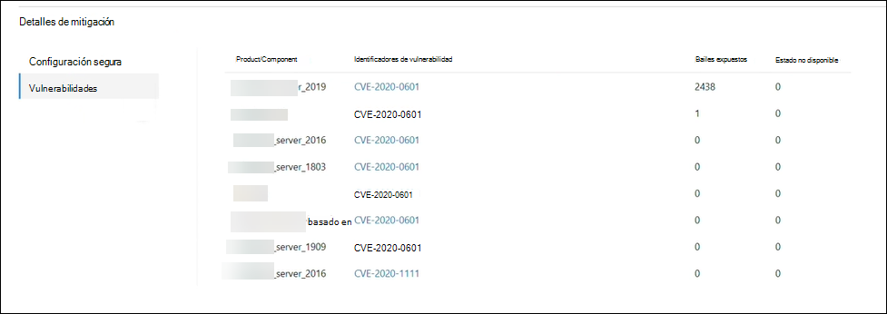

# Seguimiento y respuesta a amenazas emergentes con análisis de amenazas 

[!INCLUDE [Microsoft 365 Defender rebranding](../includes/microsoft-defender.md)]

**Se aplica a:**
- Microsoft 365 Defender

> ¿Desea experimentar Microsoft 365 Defender? Puede [evaluarlo en un entorno de laboratorio o](https://aka.ms/mtp-trial-lab) ejecutar el proyecto piloto en [producción.](https://aka.ms/m365d-pilotplaybook)
>

[!INCLUDE [Prerelease](../includes/prerelease.md)]

El análisis de amenazas es nuestra solución de inteligencia de amenazas en el producto de investigadores expertos en seguridad de Microsoft, diseñada para ayudar a los equipos de seguridad a ser lo más eficientes posibles mientras se enfrentan a amenazas emergentes, como:

- Actores de amenazas activas y sus campañas
- Técnicas de ataque populares y nuevas
- Vulnerabilidades críticas
- Superficies de ataque comunes
- Malware común

Vea este breve vídeo para obtener más información sobre cómo los análisis de amenazas pueden ayudarle a realizar un seguimiento de las amenazas más recientes y detenerlos.

>[!VIDEO https://www.microsoft.com/en-us/videoplayer/embed/RWwJfU]

Puede acceder al análisis de amenazas desde la parte superior izquierda de la barra de navegación del portal de seguridad de Microsoft 365 o desde una tarjeta de panel dedicada que muestra las principales amenazas de su organización. Obtener visibilidad de las campañas activas o en curso y saber qué hacer a través del análisis de amenazas puede ayudar a dotar a su equipo de operaciones de seguridad de decisiones fundamentadas. 

_Dónde acceder al análisis de amenazas_

Con los adversarios más sofisticados y las nuevas amenazas que surgen con frecuencia y con frecuencia, es fundamental poder hacer lo siguiente rápidamente:

- Identificar y reaccionar ante amenazas emergentes 
- Obtenga información sobre si está actualmente bajo ataque
- Evaluar el impacto de la amenaza en sus activos
- Revisar la resistencia frente a las amenazas o su exposición a las amenazas.
- Identificar las acciones de mitigación, recuperación o prevención que puede realizar para detener o contener las amenazas

Cada informe proporciona un análisis de una amenaza rastreada y una amplia guía sobre cómo defenderse de esa amenaza. También incorpora datos de la red, que indican si la amenaza está activa y si tiene protecciones aplicables.

## Ver el panel de análisis de amenazas

El panel de análisis de amenazas ([security.microsoft.com/threatanalytics3](https://security.microsoft.com/threatanalytics3)) resalta los informes que son más relevantes para su organización. Resume las amenazas en las secciones siguientes:

- **Últimas amenazas:** enumera los informes de amenazas publicados o actualizados más recientemente, junto con el número de alertas activas y resueltas.
- **Amenazas de alto** impacto: enumera las amenazas que tienen mayor impacto en su organización. En esta sección se enumeran primero las amenazas con el mayor número de alertas activas y resueltas.
- **Resumen de amenazas:** proporciona el impacto general de todas las amenazas rastreadas mostrando el número de amenazas con alertas activas y resueltas.

Seleccione una amenaza en el panel para ver el informe de esa amenaza.

_Panel de análisis de amenazas. También puedes hacer clic en el icono Buscar para claver una palabra clave relacionada con el informe de análisis de amenazas que quieras leer._ 

## Ver un informe de análisis de amenazas

Cada informe de análisis de amenazas proporciona información en varias secciones: 

- [**Información general**](#overview-quickly-understand-the-threat-assess-its-impact-and-review-defenses) 
- [**Informe de analistas**](#analyst-report-get-expert-insight-from-microsoft-security-researchers)
- [**Incidentes relacionados**](#related-incidents-view-and-manage-related-incidents)
- [**Activos afectados**](#impacted-assets-get-list-of-impacted-devices-and-mailboxes)
- [**Intentos de correo electrónico impedidos**](#prevented-email-attempts-view-blocked-or-junked-threat-emails)
- [**Mitigaciones**](#mitigations-review-list-of-mitigations-and-the-status-of-your-devices)

### Información general: comprender rápidamente la amenaza, evaluar su impacto y revisar las defensas

La **sección** Información general proporciona una vista previa del informe detallado del analista. También proporciona gráficos que resaltan el impacto de la amenaza para su organización y su exposición a través de dispositivos mal configurados y sin aparear.

_Sección información general de un informe de análisis de amenazas_

#### Evaluar el impacto en la organización
Cada informe incluye gráficos diseñados para proporcionar información sobre el impacto organizativo de una amenaza:
- **Incidentes relacionados:** proporciona información general sobre el impacto de la amenaza rastreada en su organización con los siguientes datos:
  - Número de alertas activas y el número de incidentes activos con los que están asociados
  - Gravedad de los incidentes activos
- **Alertas con el tiempo:** muestra el número de alertas **activas** **y** resueltas relacionadas con el tiempo. El número de alertas resueltas indica la rapidez con la que la organización responde a las alertas asociadas con una amenaza. Lo ideal es que el gráfico muestre las alertas resueltas en unos días.
- **Activos afectados:** muestra el número de dispositivos distintos y cuentas de correo electrónico (buzones) que actualmente tienen al menos una alerta activa asociada a la amenaza rastreada. Las alertas se desencadenan para los buzones que recibieron mensajes de correo electrónico de amenazas. Revise las directivas de nivel de organización y de usuario para obtener invalidaciones que causen la entrega de mensajes de correo electrónico de amenazas.
- **Intentos de correo** electrónico impedidos: muestra el número de correos electrónicos de los últimos siete días que se bloquearon antes de la entrega o se entregaron a la carpeta de correo no deseado.

#### Revisar la resistencia y la postura de seguridad
Cada informe incluye gráficos que proporcionan información general sobre la resistencia de la organización frente a una amenaza determinada:
- **Estado de configuración segura:** muestra el número de dispositivos con configuraciones de seguridad mal configuradas. Aplica la configuración de seguridad recomendada para ayudar a mitigar la amenaza. Los dispositivos se consideran **seguros** si han aplicado _toda_ la configuración de seguimiento.
- **Estado de revisión de vulnerabilidad:** muestra el número de dispositivos vulnerables. Aplicar actualizaciones de seguridad o revisiones para solucionar las vulnerabilidades aprovechadas por la amenaza.

### Informe de analistas: obtener información de expertos de los investigadores de seguridad de Microsoft
En la **sección Informe de** analistas, lea la escritura detallada del experto. La mayoría de los informes proporcionan descripciones detalladas de las cadenas de ataque, incluidas las tácticas y técnicas  asignadas al marco de CK de MITRE ATT&, listas exhaustivas de recomendaciones y instrucciones de búsqueda de amenazas eficaces.

[Más información sobre el informe de analistas](threat-analytics-analyst-reports.md)

### Incidentes relacionados: ver y administrar incidentes relacionados
La **pestaña Incidentes relacionados** proporciona la lista de todos los incidentes relacionados con la amenaza rastreada. Puede asignar incidentes o administrar alertas vinculadas a cada incidente. 

_Sección incidentes relacionados de un informe de análisis de amenazas_

### Activos afectados: obtener una lista de dispositivos y buzones afectados
Un activo se considera afectado si se ve afectado por una alerta activa y sin resolver. La **pestaña Activos afectados** enumera los siguientes tipos de activos afectados:
- **Dispositivos afectados:** puntos de conexión que tienen alertas de Microsoft Defender para puntos de conexión sin resolver. Estas alertas suelen dispararse en avistamientos de indicadores y actividades de amenazas conocidos.
- **Buzones afectados: buzones** que han recibido mensajes de correo electrónico que han desencadenado alertas de Microsoft Defender para Office 365. Aunque la mayoría de los mensajes que desencadenan alertas suelen estar bloqueados, las directivas de nivel de usuario o de organización pueden invalidar los filtros.

_Sección activos afectados de un informe de análisis de amenazas_

### Intentos de correo electrónico impedidos: ver mensajes de correo electrónico bloqueados o de amenazas no deseados
Microsoft Defender para Office 365 normalmente bloquea los correos electrónicos con indicadores de amenazas conocidos, incluidos vínculos malintencionados o datos adjuntos. En algunos casos, los mecanismos de filtrado proactivo que comprueban el contenido sospechoso enviarán correos electrónicos de amenazas a la carpeta de correo no deseado. En cualquier caso, se reducen las posibilidades de que la amenaza inicie código de malware en el dispositivo.

La **pestaña Intentos** de correo electrónico impedido enumera todos los correos electrónicos que Microsoft Defender para Office 365 ha bloqueado antes de la entrega o enviados a la carpeta de correo no deseado. 

_Sección Intentos de correo electrónico impedidos de un informe de análisis de amenazas_

### Mitigaciones: revisar la lista de mitigaciones y el estado de los dispositivos
En la **sección Mitigaciones,** revise la lista de recomendaciones específicas que se pueden usar y que pueden ayudarle a aumentar la resistencia de la organización frente a la amenaza. La lista de mitigaciones rastreadas incluye:

- **Actualizaciones de seguridad:** implementación de actualizaciones de seguridad de software compatibles para vulnerabilidades encontradas en dispositivos incorporados
- **Configuraciones de seguridad admitidas**
  - Protección entregada en la nube  
  - Protección de aplicaciones potencialmente no deseadas (PUA)
  - Protección en tiempo real
 
La información de mitigación de esta sección incorpora datos de la administración de amenazas y vulnerabilidades, que también proporciona información detallada de los distintos vínculos del informe.

 

_Sección Mitigaciones de un informe de análisis de amenazas_

## Detalles y limitaciones adicionales del informe
>[!NOTE]
>Como parte de la experiencia de seguridad unificada, el análisis de amenazas ahora está disponible no solo para Microsoft Defender para Endpoint, sino también para los poseedores de licencias de Microsoft Defender para Office E5.
>Si no usa el portal de seguridad de Microsoft 365 (Microsoft 365 Defender), también puede ver los detalles del informe (sin los datos de Microsoft Defender para Office) en el portal del Centro de seguridad de Microsoft Defender (Microsoft Defender para endpoint). 

Para obtener acceso al informe de análisis de amenazas, necesita ciertos roles y permisos. Consulta Roles personalizados en el control de acceso [basado en roles para Microsoft 365 Defender](custom-roles.md) para obtener más información.
  - Para ver alertas, incidentes o datos de activos afectados, debe tener permisos para Microsoft Defender para Office o Microsoft Defender para los datos de alertas de extremo, o ambos.
  - Para ver los intentos de correo electrónico impedidos, debe tener permisos para los datos de búsqueda de Microsoft Defender para Office. 
  - Para ver mitigaciones, debe tener permisos para los datos de administración de amenazas y vulnerabilidades en Microsoft Defender para endpoint.

Al ver los datos de análisis de amenazas, recuerde los siguientes factores:
- Los gráficos reflejan solo las mitigaciones a las que se realiza un seguimiento. Compruebe en el informe información general para ver mitigaciones adicionales que no se muestran en los gráficos.
- Las mitigaciones no garantizan una resistencia completa. Las mitigaciones proporcionadas reflejan las mejores acciones posibles necesarias para mejorar la resistencia.
- Los dispositivos se cuentan como "no disponibles" si no han transmitido datos al servicio.
- Las estadísticas relacionadas con antivirus se basan en la configuración de Antivirus de Microsoft Defender. Los dispositivos con soluciones antivirus de terceros pueden aparecer como "expuestos".

## Temas relacionados
- [Búsqueda proactiva de amenazas con búsqueda avanzada](advanced-hunting-overview.md) 
- [Comprender la sección de informe de analistas](threat-analytics-analyst-reports.md)
- [Evaluar y resolver debilidades y exposiciones de seguridad](https://docs.microsoft.com/windows/security/threat-protection/microsoft-defender-atp/next-gen-threat-and-vuln-mgt)
