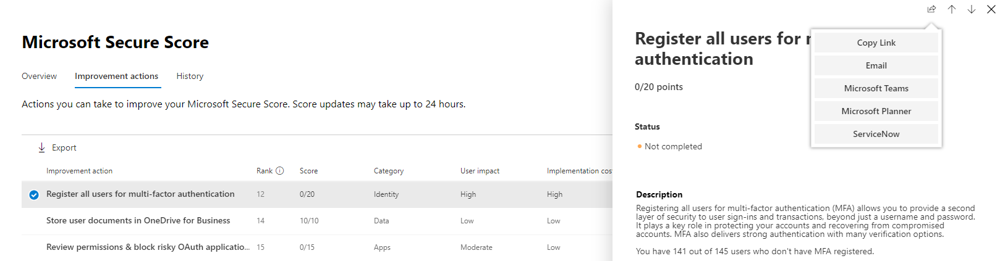
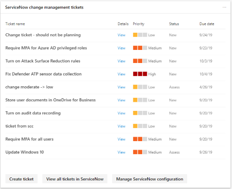

# Administrar vales a través de ServiceNow

El centro de seguridad 365 de Microsoft se está optimizando con la capacidad de crear y realizar un seguimiento de vales en ServiceNow de forma nativa. Esto permite a los administradores de seguridad enviar una acción de mejora de la [puntuación segura de Microsoft](microsoft-secure-score.md) directamente a ServiceNow y crear un vale. Se pueden crear tíquets de administración de incidentes y de administración de cambios.

## Requisitos previos

Tener acceso al centro de seguridad 365 de Microsoft y a una instancia de ServiceNow con:  

* Kingston o una versión superior
* Tener credenciales de admin HI
* Tener privilegios de administrador en la instancia del proveedor de destino

ServiceNow recomienda a los usuarios mantener la configuración de forma predeterminada (predeterminado) en su instancia de ServiceNow.  La realización de personalizaciones puede provocar errores al completar la lista de comprobación de instalación e integración con el centro de seguridad de Microsoft 365.

## Intercambio de datos

Cuando conecte el centro de seguridad de Microsoft 365 a ServiceNow, Microsoft recibirá los siguientes datos adicionales:

* Nombre de instancia de ServiceNow
* IDENTIFICADOR de cliente de ServiceNow
* Secreto de cliente de ServiceNow
* Tokens de actualización & acceso a ServiceNow

Cuando se crea un vale de ServiceNow desde el centro de seguridad de Microsoft 365, se envían los siguientes datos a ServiceNow:

* IDENTIFICADOR de usuario que inicia la creación de vales
* Nombre de tarea
* Descripción de la tarea
* Priority
* Fecha de vencimiento
* Origen de la recomendación (recomendación del usuario o recomendación de Microsoft)
* Categoría de recomendación (dispositivos, datos, aplicaciones, identidad, infraestructura)

## Conectar el centro de seguridad de Microsoft 365 a ServiceNow

Vaya a la página de inicio del centro de seguridad 365 de Microsoft, donde verá una tarjeta que pregunta si usa ServiceNow.

Desde allí, se enviará a la página configurar de ServiceNow, en la que seguirá las instrucciones para autorizar la aplicación conector de Microsoft 365.

Al autorizar la conexión entre el centro de seguridad de Microsoft 365 y ServiceNow, asegúrese de usar el inicio de sesión de usuario y la contraseña de integración que creó en los pasos de instalación y no en sus credenciales personales.

Después de seguir las indicaciones y autorizar la conexión, puede ver el estado de la conexión en la página de conexión del centro de seguridad 365 de Microsoft y en la experiencia de la aplicación conector de vales de Microsoft 365 de ServiceNow. Ahora ya está todo listo para empezar a crear tareas.

## Crear una tarea y compartirla en ServiceNow

Una vez configurada la integración, puede crear tareas de ServiceNow basadas en acciones específicas para la mejora de la calificación segura de Microsoft. Vaya a cualquier acción de mejora en puntuación segura en el portal del centro de seguridad 365 de Microsoft y seleccione el icono "compartir". Una de las opciones de lista desplegable es ServiceNow.

A continuación, se generará una tarea en la que puede establecer la prioridad y editar el nombre, la descripción o la fecha de vencimiento. Una vez que se hayan rellenado todos los campos obligatorios, puede enviar la tarea a ServiceNow.

La tarea será visible en ServiceNow como una solicitud de cambio de configuración y seguridad de Microsoft 365.

## Seguimiento de vales

Una vez creados la administración de cambios de ServiceNow y los vales de administración de incidentes, se mostrarán en las tarjetas de la Página principal del centro de seguridad de Microsoft 365. Desde estas tarjetas, puede crear un vale, ver todos los vales o administrar la configuración de ServiceNow.

  

Para volver a aprovisionar o administrar la integración de ServiceNow en el centro de seguridad de Microsoft 365, seleccione **administrar la configuración de servicenow** en una de las tarjetas. Desde allí, puede quitar la conexión de ServiceNow actual y personalizar los nombres de estado de los tíquets.

Con los vales de ServiceNow visibles en el centro de seguridad de Microsoft 365, las tareas se colocarán en un lugar en el que se puede realizar un seguimiento y actuar con ellos junto a otros elementos del panel de seguridad.

## Preguntas más frecuentes

### Estoy recibiendo un error en el primer paso de la lista de comprobación de la instalación (creación de OAuth)

**Mensaje de error**: se rechazó la operación de lectura contra ' oauth_entity ' del ámbito ' x_mioms_m365ticket ' debido a la Directiva de acceso entre ámbitos de la tabla

Nuestra aplicación asume que cualquier administrador de la instancia de ServiceNow puede crear y leer entidades de OAuth. Este error puede deberse a una personalización en la instancia de ServiceNow, que restringe quién puede crear o leer entidades de OAuth. ServiceNow recomienda a los usuarios mantener la funcionalidad de forma predeterminada (predeterminado).

Establezca la configuración de la tabla "registros de aplicación" en default:

* Label = registros de aplicación
* Name = oauth_entity
* Accesible desde = todos los ámbitos de aplicación
* Puede leer = casilla de verificación seleccionada

**ServiceNow recomienda a los usuarios mantener la funcionalidad de forma predeterminada (predeterminado).**

### ¿Cómo puedo validar la entidad de OAuth creada para el conector de cumplimiento de & de seguridad de Microsoft 365?

Vaya a la tabla registros de aplicaciones (menú > el registro de aplicaciones de OAuth > sistema) en ServiceNow y busque la entidad OAuth que ha creado el usuario (nombre que le ha asignado).

### ¿Cómo puedo validar el usuario de integración creado en el paso dos de la lista de comprobación de instalación de Microsoft 365 Security & Compliance Connector?

Vaya a la tabla de usuarios (menú > usuarios de > de administración de usuarios) en ServiceNow y busque el usuario de integración creado por usted (nombre que le ha asignado).

Al autorizar la conexión entre el centro de seguridad de Microsoft 365 y ServiceNow, asegúrese de usar el inicio de sesión de usuario y la contraseña de integración que creó en los pasos de instalación y no en sus credenciales personales.

### He completado la instalación y he configurado los pasos, pero no veo las tarjetas de ServiceNow en la Página principal y no puede ver el icono compartir en la puntuación segura de Microsoft

Comprueba el estado de la página de aprovisionamiento yendo a https://security.microsoft.com/ticketProvisioning. Seleccione **Guardar** y volver a la Página principal. Deben aparecer las tarjetas.
