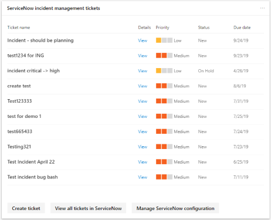

# Administrar tickets a través de ServiceNow

ServiceNow es una plataforma de informática en la nube popular que ayuda a las empresas a administrar flujos de trabajo digitales para operaciones empresariales. Su plataforma ahora tiene flujos de trabajo de ti, flujos de trabajo de empleados y flujos de trabajo de clientes. Microsoft se ha asociado con ServiceNow para facilitar a los administradores de ti la administración de sus billetes y tareas en ambas plataformas. [Obtenga más información sobre ServiceNow](https://www.servicenow.com/)

Microsoft 365 Security Center ahora se ha mejorado con la capacidad de crear y realizar un seguimiento de vales en ServiceNow de forma nativa. Los administradores de seguridad pueden enviar una acción de mejora de la [puntuación segura de Microsoft](microsoft-secure-score.md) directamente a ServiceNow y crear un vale. Se pueden crear tíquets de administración de incidentes y de administración de cambios. A continuación, se puede realizar un seguimiento en la Página principal del centro de seguridad de Microsoft y en ServiceNow.

## Requisitos previos

Tener acceso al centro de seguridad 365 de Microsoft y a una instancia de ServiceNow con:  

* Kingston o una versión superior
* Tener credenciales de admin HI
* Tener privilegios de administrador en la instancia del proveedor de destino

ServiceNow recomienda que los usuarios conserven la configuración predeterminada en su instancia de ServiceNow. La realización de personalizaciones puede provocar errores al completar la lista de comprobación de instalación e integración con el centro de seguridad de Microsoft 365.

## Intercambio de datos

Cuando conecta el centro de seguridad de Microsoft 365 a ServiceNow, Microsoft recibe los siguientes datos adicionales:

* Nombre de instancia de ServiceNow
* IDENTIFICADOR de cliente de ServiceNow
* Secreto de cliente de ServiceNow
* Tokens de actualización & acceso a ServiceNow

Cuando se crea un vale de ServiceNow a partir del centro de seguridad 365 de Microsoft, se envían los datos siguientes a ServiceNow:

* IDENTIFICADOR de usuario que inicia la creación de vales
* Nombre de tarea
* Descripción de la tarea
* Priority
* Fecha de vencimiento
* Origen de la recomendación (recomendación del usuario o recomendación de Microsoft)
* Categoría de recomendación (dispositivos, datos, aplicaciones, identidad, infraestructura)

## Conectar el centro de seguridad de Microsoft 365 a ServiceNow

Vaya a la página de inicio del centro de seguridad 365 de Microsoft para ver la tarjeta de conexión de ServiceNow.

Seleccione "conectarse a ServiceNow" para ir a la página de configuración de ServiceNow. Siga las instrucciones para autorizar la aplicación conector de 365 de Microsoft.

> [!NOTE]
> Antes de autorizar la conexión entre el centro de seguridad de Microsoft 365 y ServiceNow, asegúrese de usar el inicio de sesión de usuario y la contraseña de integración que creó en los pasos de instalación. No use sus credenciales personales.

Una vez que haya seguido las instrucciones y la autorización de la conexión, vea el estado de conexión en la página conexión del centro de seguridad 365 de Microsoft y en la experiencia de la aplicación conector de vales de Microsoft 365 de ServiceNow. Ahora ya está todo listo para empezar a crear tareas.

## Crear una tarea y compartirla en ServiceNow

Una vez que la integración esté configurada, cree tareas de ServiceNow basadas en acciones específicas para la mejora de la calificación segura de Microsoft. Vaya a cualquier acción de mejora en puntuación segura en el portal del centro de seguridad 365 de Microsoft y seleccione el icono "compartir". Una de las opciones de lista desplegable es ServiceNow.

Se genera una tarea en la que puede establecer la prioridad y editar el nombre, la descripción o la fecha de vencimiento. Una vez que se hayan rellenado todos los campos obligatorios, envíe la tarea a ServiceNow.

La tarea es visible en ServiceNow como una solicitud de cambio de configuración y seguridad de Microsoft 365.

## Seguimiento de vales

Una vez que se han creado los vales de administración de cambios y la administración de cambios de ServiceNow, se muestran en las tarjetas de la página de inicio del centro de seguridad de Microsoft 365. Desde estas tarjetas, puede crear un vale, ver todos los vales o administrar la configuración de ServiceNow.

  

Para volver a aprovisionar o administrar la integración de ServiceNow en el centro de seguridad de Microsoft 365, seleccione **administrar la configuración de servicenow** en una de las tarjetas. Desde allí, elimine la conexión de ServiceNow actual y personalice los nombres de los Estados de las incidencias.

Con los vales de ServiceNow visibles en el centro de seguridad de Microsoft 365, las tareas residen en un lugar en el que se puede realizar un seguimiento y actuar junto a otros elementos del panel de seguridad.

## Solución de problemas

### Recibe un error en el primer paso de la lista de comprobación de instalación (creación de OAuth)

**Mensaje de error**: se rechazó la operación de lectura contra ' oauth_entity ' del ámbito ' x_mioms_m365ticket ' debido a la Directiva de acceso entre ámbitos de la tabla

La aplicación supone que cualquier administrador de la instancia de ServiceNow puede crear y leer entidades de OAuth. Este error puede deberse a una personalización en la instancia de ServiceNow, que restringe quién puede crear o leer entidades de OAuth.

**ServiceNow recomienda a los usuarios mantener la funcionalidad predeterminada.**

Establezca la configuración de la tabla "registros de aplicación" en default:

* Label = registros de aplicación
* Name = oauth_entity
* Accesible desde = todos los ámbitos de aplicación
* Puede leer = casilla de verificación seleccionada

### Cómo validar la entidad de OAuth creada para el conector de cumplimiento de & de seguridad de Microsoft 365

Vaya a la tabla registros de aplicaciones (**menú > el registro de aplicaciones de oauth > sistema**) en ServiceNow y busque la entidad OAuth que ha creado, con el nombre que le ha asignado.

### Inicio de sesión como usuario de integración

Antes de autorizar la conexión entre el centro de seguridad de Microsoft 365 y ServiceNow, asegúrese de usar el inicio de sesión de usuario y la contraseña de integración que creó en los pasos de instalación. No use sus credenciales personales.

1. Vaya a la página de autorización en ServiceNow.
2. Si ha iniciado sesión con sus credenciales personales, seleccione el vínculo **que desee** en la esquina superior derecha.
3. Inicie sesión en ServiceNow como el usuario de integración que creó anteriormente a partir de la lista de comprobación de instalación.  
4. Seleccione **permitir** en la página de servicenow que pregunta si el conector Security + Compliance Connector puede conectarse a su cuenta de servicenow.
5. Continúe con los pasos de configuración.

### Cómo validar el usuario de integración creado con la lista de comprobación de instalación para el conector de seguridad & cumplimiento de Microsoft 365

Vaya a la tabla de usuarios **(menú > User Administration >** users) en ServiceNow y busque el usuario de integración creado por usted, con el nombre que le haya asignado.

### Su empresa tiene habilitado el inicio de sesión único, lo que le impide conectarse a ServiceNow a través del centro de seguridad de Microsoft 365

Si su compañía ha habilitado el inicio de sesión único y recibe un error o el inicio de sesión es incorrecto, siga una de las dos soluciones.

#### Inicie sesión en ServiceNow como usuario de integración

1. Vuelva a navegar a la página Authorization en ServiceNow.
2. Seleccione el vínculo **que desee** en la esquina superior derecha.
3. Inicie sesión en ServiceNow como el usuario de integración que creó anteriormente a partir de la lista de comprobación de instalación.  
4. Seleccione **permitir** en la página de servicenow que pregunta si el conector Security + Compliance Connector puede conectarse a su cuenta de servicenow.
5. Continúe con los pasos de configuración.

#### Crear un usuario administrador de seguridad

1. Cree un usuario con privilegios de administrador de seguridad en Azure Active Directory. El usuario debe tener el mismo nombre y dirección de correo electrónico que el usuario de integración que ha creado a partir de la lista de comprobación de instalación. Puede quitar el rol de administrador de seguridad una vez que se haya completado el inicio de sesión y la conexión.
2. Inicie sesión en el centro de seguridad 365 de Microsoft como este usuario y siga los pasos de configuración.

### Filtrado IP

Si ha habilitado el filtrado IP, es posible que necesite permitir de forma explícita direcciones IP. Consulte [IP address Access Control](https://docs.servicenow.com/bundle/orlando-platform-administration/page/administer/login/task/t_AccessControl.html) para obtener información sobre cómo permitir intervalos de IP en ServiceNow. Vea [intervalos IP de Azure y etiquetas de servicio: nube pública](https://www.microsoft.com/en-us/download/details.aspx?id=56519) para obtener una lista de las direcciones IP que se van a permitir.

### La instalación se ha completado, pero no ve los vales y no se puede compartir

Si se han completado los pasos de instalación y configuración, pero no ve las tarjetas de ServiceNow en la Página principal y no puede compartir con ServiceNow desde la puntuación segura de Microsoft, compruebe el estado de la página https://security.microsoft.com/ticketProvisioningde aprovisionamiento en. Seleccione **autorizar** y volver a la Página principal. Deben aparecer las tarjetas.

