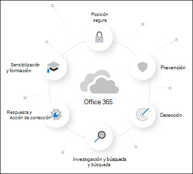

# Acerca de microsoft defender para Office 365 prueba

Microsoft Defender para Office 365 protege su organización contra las amenazas malintencionadas que suponen los mensajes de correo electrónico, los vínculos (URL) y las herramientas de colaboración. Microsoft Defender para Office 365 incluye:

- **Directivas de protección contra amenazas**: defina directivas de protección contra amenazas para establecer el nivel de protección adecuado para su organización.
- **Informes:** vea informes en tiempo real para supervisar el rendimiento Office 365 defender en su organización.
- **Investigación de amenazas y capacidades de respuesta**: use las herramientas más avanzadas para investigar, entender, simular y evitar las amenazas.
- **Investigación y respuestas automáticas**: ahorre tiempo y esfuerzo al investigar y mitigar amenazas.

Una prueba de Microsoft Defender para Office 365 es la forma más sencilla de probar las funcionalidades de Defender para Office 365 y configurarla solo requiere un par de clics. Una vez completada la configuración de prueba, todas las funcionalidades de Defender for Office 365 Plan 1 y Plan 2 estarán disponibles en la organización durante un máximo de 90 días.

> [!NOTE]
> La configuración automatizada que se describe en este artículo se encuentra actualmente en Public Preview y puede que no esté disponible en su ubicación.

## Términos y condiciones

La versión de Office 365 Defender for Office 365 está disponible durante 90 días y se puede iniciar para todos los usuarios. Para obtener más información, vea [Microsoft Defender for Office 365 Trial Terms & Conditions](defender-for-office-365-trial-terms-and-conditions.md).

## Configurar un defender para la Office 365 prueba

Una prueba permite a las organizaciones configurar y configurar fácilmente defender para Office 365 funcionalidades. Durante la instalación, las directivas que son exclusivas de Defender para Office 365 (específicamente, datos adjuntos de [Caja fuerte,](safe-attachments.md)vínculos [de Caja fuerte](safe-links.md)y protección de suplantación en directivas contra correo no [deseado)](set-up-anti-phishing-policies.md#impersonation-settings-in-anti-phishing-policies-in-microsoft-defender-for-office-365)se aplican con la plantilla Standard para las directivas de seguridad predefinidas. 

De forma predeterminada, estas directivas están en el ámbito de todos los usuarios de la organización, pero los administradores pueden personalizar las directivas durante o después de la instalación para que se apliquen solo a usuarios específicos.

Durante la instalación, la funcionalidad de respuesta de MDO (que se encuentra en MDO P2 o equivalente) también se configura para toda la organización. No se requiere ningún ámbito de directiva.

## Licencias

Como parte de la configuración de prueba, defender para Office 365 licencias se aplican automáticamente a la organización. Las licencias son gratuitas durante los primeros 90 días.

## Permisos

Para iniciar o finalizar la prueba, debe ser miembro  de los roles Administrador **global** o Administrador de seguridad en Azure Active Directory. Para obtener más información, vea [About admin roles](../../admin/add-users/about-admin-roles.md).

## Información adicional

Después de inscribirse en la versión de prueba, los cambios y actualizaciones pueden tardar hasta 2 horas en estar disponibles. Además, los administradores deben cerrar sesión y volver a iniciar sesión para ver los cambios.

Los administradores pueden deshabilitar la prueba en cualquier momento yendo a la <> tarjeta.

## Disponibilidad

La versión de prueba de Defender para Office 365 se está implementando gradualmente para clientes existentes que cumplen criterios específicos (incluida la geografía) y que no tienen defender existente para licencias de plan 1 o plan 2 de Office 365 (incluidas en su suscripción o como complemento).

## Obtenga más información sobre Defender para Office 365

Defender para Office 365 ayuda a las organizaciones a proteger su empresa ofreciendo una lista completa de capacidades.

También puede obtener más información sobre Defender para Office 365 en esta [guía interactiva](https://techcommunity.microsoft.com/t5/video-hub/protect-your-organization-with-microsoft-365-defender/m-p/1671189).

### Prevención

Una pila de filtrado sólida evita una amplia variedad de ataques basados en volumen y dirigidos, incluidos el compromiso del correo electrónico empresarial, la suplantación de identidad de credenciales, el ransomware y el malware avanzado.

- [Directivas contra la suplantación de identidad: configuración exclusiva en Defender para Office 365](set-up-anti-phishing-policies.md#exclusive-settings-in-anti-phishing-policies-in-microsoft-defender-for-office-365)
- [Archivos adjuntos seguros](safe-attachments.md)
- [Vínculos seguros](safe-links.md)

### Detección

La inteligencia artificial líder del sector detecta contenido malintencionado y sospechoso y correlaciona los patrones de ataque para identificar campañas diseñadas para eludir la protección.

- [Vistas de campaña en Microsoft Defender para Office 365](campaigns.md)

### Investigación y búsqueda

Las experiencias eficaces ayudan a identificar, priorizar e investigar amenazas, con capacidades avanzadas de búsqueda para realizar un seguimiento de los ataques en Office 365.

- [Explorador de amenazas y detecciones en tiempo real](threat-explorer.md)
- [Informes en tiempo real en Defender para Office 365](view-reports-for-mdo.md)
- [Rastreadores de amenazas: nuevos y destacables](threat-trackers.md)
- Integración con [Microsoft 365 Defender](../defender/microsoft-365-defender.md)

### Respuesta y corrección

Las amplias capacidades de automatización y respuesta a incidentes amplifican la eficacia y la eficacia del equipo de seguridad.

- [Investigación y respuesta automatizadas (AIR) en Microsoft Defender para Office 365](office-365-air.md)

### Sensibilización y entrenamiento

Las completas capacidades de simulación y aprendizaje junto con las experiencias integradas dentro de las aplicaciones cliente crean concienciación del usuario.

- [Introducción al uso de aprendizaje de simulación de ataques](attack-simulation-training-get-started.md)

### Postura segura

Las plantillas recomendadas y los conocimientos de configuración ayudan a los clientes a obtener y mantener la seguridad.

- [Directivas de seguridad predefinidas en EOP y Microsoft Defender para Office 365](preset-security-policies.md)
- [Analizador de configuración para directivas de protección en EOP y Microsoft Defender para Office 365](configuration-analyzer-for-security-policies.md).

## Enviar comentarios

Sus comentarios nos ayudan a mejorar la protección del entorno frente a ataques avanzados. Comparta su experiencia e impresiones de las capacidades del producto y los resultados de la prueba.
