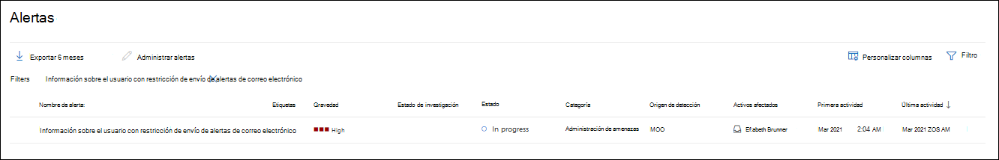

# Solucionar cuentas de usuario comprometidas con investigación y respuesta automatizadasAddress compromised user accounts with automated investigation and response

**Se aplica a****Applies to**
- [Exchange Online ProtectionExchange Online Protection](exchange-online-protection-overview.md)
- [Plan 1 y Plan 2 de Microsoft Defender para Office 365Microsoft Defender for Office 365 plan 1 and plan 2](defender-for-office-365.md)
- [Microsoft 365 DefenderMicrosoft 365 Defender](../defender/microsoft-365-defender.md)

[Microsoft Defender para Office 365 Plan 2](defender-for-office-365.md#microsoft-defender-for-office-365-plan-1-and-plan-2) incluye potentes capacidades de investigación y respuesta [automatizadas](office-365-air.md) (AIR).[Microsoft Defender for Office 365 Plan 2](defender-for-office-365.md#microsoft-defender-for-office-365-plan-1-and-plan-2) includes powerful [automated investigation and response](office-365-air.md) (AIR) capabilities. Estas capacidades pueden ahorrarle mucho tiempo y esfuerzo al equipo de operaciones de seguridad que se ocupa de las amenazas.Such capabilities can save your security operations team a lot of time and effort dealing with threats. Microsoft sigue mejorando las capacidades de seguridad.Microsoft continues to improve security capabilities. Recientemente, las capacidades de AIR se han mejorado para incluir un libro de juegos de seguridad de usuario en peligro (actualmente en versión preliminar).Recently, AIR capabilities were enhanced to include a compromised user security playbook (currently in preview). Lea este artículo para obtener más información sobre el libro de juegos de seguridad del usuario en peligro.Read this article to learn more about the compromised user security playbook. Y consulta la entrada de blog Acelerar el tiempo para detectar y responder a los compromisos del usuario y limitar el ámbito de infracción con [Microsoft Defender](https://techcommunity.microsoft.com/t5/Security-Privacy-and-Compliance/Speed-up-time-to-detect-and-respond-to-user-compromise-and-limit/ba-p/977053) para obtener Office 365 detalles adicionales.And see the blog post [Speed up time to detect and respond to user compromise and limit breach scope with Microsoft Defender for Office 365](https://techcommunity.microsoft.com/t5/Security-Privacy-and-Compliance/Speed-up-time-to-detect-and-respond-to-user-compromise-and-limit/ba-p/977053) for additional details.

El libro de juegos de seguridad de usuario comprometido permite al equipo de seguridad de la organización:The compromised user security playbook enables your organization's security team to:

- Acelerar la detección de cuentas de usuario comprometidas;Speed up detection of compromised user accounts;
- Limitar el ámbito de una infracción cuando una cuenta está en peligro; yLimit the scope of a breach when an account is compromised; and
- Responda a los usuarios en peligro de forma más eficaz y eficaz.Respond to compromised users more effectively and efficiently.

## Alertas de usuario comprometidasCompromised user alerts

Cuando una cuenta de usuario está en peligro, se producen comportamientos atípicos o anómalos.When a user account is compromised, atypical or anomalous behaviors occur. Por ejemplo, los mensajes de suplantación de identidad y correo no deseado pueden enviarse internamente desde una cuenta de usuario de confianza.For example, phishing and spam messages might be sent internally from a trusted user account. Defender for Office 365 puede detectar estas anomalías en los patrones de correo electrónico y la actividad de colaboración dentro de Office 365.Defender for Office 365 can detect such anomalies in email patterns and collaboration activity within Office 365. Cuando esto sucede, se desencadenan alertas y comienza el proceso de mitigación de amenazas.When this happens, alerts are triggered, and the threat mitigation process begins.

Por ejemplo, esta es una alerta que se desencadenó debido al envío de correo electrónico sospechoso:For example, here's an alert that was triggered because of suspicious email sending:

Y este es un ejemplo de una alerta que se desencadenó cuando se alcanzó un límite de envío para un usuario:And here's an example of an alert that was triggered when a sending limit was reached for a user:

## Investigar y responder a un usuario en peligroInvestigate and respond to a compromised user

Cuando una cuenta de usuario está en peligro, se desencadenan alertas.When a user account is compromised, alerts are triggered. Y en algunos casos, esa cuenta de usuario se bloquea e impide enviar más mensajes de correo electrónico hasta que el equipo de operaciones de seguridad de la organización resuelva el problema.And in some cases, that user account is blocked and prevented from sending any further email messages until the issue is resolved by your organization's security operations team. En otros casos, comienza una investigación automatizada que puede dar como resultado acciones recomendadas que el equipo de seguridad debe llevar a cabo.In other cases, an automated investigation begins which can result in recommended actions that your security team should take.

- [Ver e investigar usuarios restringidosView and investigate restricted users](#view-and-investigate-restricted-users)

- [Ver detalles sobre las investigaciones automatizadasView details about automated investigations](#view-details-about-automated-investigations)

> [!IMPORTANT]
> Debe tener los permisos adecuados para realizar las siguientes tareas.You must have appropriate permissions to perform the following tasks. Consulte [Permisos necesarios para usar las funcionalidades de AIR.](office-365-air.md#required-permissions-to-use-air-capabilities)See [Required permissions to use AIR capabilities](office-365-air.md#required-permissions-to-use-air-capabilities).

### Ver e investigar usuarios restringidosView and investigate restricted users

Tiene algunas opciones para navegar a una lista de usuarios restringidos.You have a few options for navigating to a list of restricted users. Por ejemplo, en el portal Microsoft 365 Defender, puede ir a Correo electrónico **&** \> **colaboración Revisar** \> **usuarios restringidos**.For example, in the Microsoft 365 Defender portal, you can go to **Email & collaboration** \> **Review** \> **Restricted Users**. En el siguiente procedimiento se describe la navegación mediante el panel **de** alertas, que es una buena manera de ver varios tipos de alertas que podrían haber sido desencadenadas.The following procedure describes navigation using the **Alerts** dashboard, which is a good way to see various kinds of alerts that might have been triggered.

1. Abra el portal de Microsoft 365 Defender ( <https://security.microsoft.com> ) y vaya a Incidentes &  \> **alertas**.Open the Microsoft 365 Defender portal (<https://security.microsoft.com>) and go to **Incidents & alerts** \> **Alerts**. O bien, para ir directamente a la **página Alertas,** use <https://security.microsoft.com/alerts> .Or, to go directly to the **Alerts** page, use <https://security.microsoft.com/alerts>.

2. En la **página Alertas,** filtre los resultados por período de tiempo y la directiva denominada Usuario restringido **para enviar correo electrónico**.On the **Alerts** page, filter the results by time period and the policy named **User restricted from sending email**.

   

3. Si selecciona la entrada haciendo clic  en el nombre, se abrirá una página de usuario con restricciones para enviar correo electrónico con detalles adicionales para que lo revise.If you select the entry by clicking on the name, a **User restricted from sending email** page opens with additional details for you to review. Junto al  botón Administrar alerta, puede hacer clic en El icono Más opciones Más opciones y, a continuación, seleccione Ver detalles de usuario restringido para ir a la página Usuarios restringidos, donde puede liberar el usuario   [restringido.](removing-user-from-restricted-users-portal-after-spam.md)  Next to the **Manage alert** button, you can click  **More options** and then select **View restricted user details** to go to the **Restricted users** page, where you can [release the restricted user](removing-user-from-restricted-users-portal-after-spam.md).

   

### Ver detalles sobre las investigaciones automatizadasView details about automated investigations

Cuando se inicia una investigación automatizada, puede ver sus detalles y resultados en el Centro de seguridad & cumplimiento.When an automated investigation has begun, you can see its details and results in the Security & Compliance Center. Vaya  a \> **Investigaciones de administración de** amenazas y, a continuación, seleccione una investigación para ver sus detalles.Go to **Threat management** \> **Investigations**, and then select an investigation to view its details.

Para obtener más información, [vea Ver detalles de una investigación](air-view-investigation-results.md).To learn more, see [View details of an investigation](air-view-investigation-results.md).

## Tenga en cuenta los siguientes puntosKeep the following points in mind

- **Mantenerse al tanto de las alertas**.**Stay on top of your alerts**. Como sabe, cuanto más tiempo no se detecte un compromiso, mayor será el potencial de impacto y costo generalizado para su organización, clientes y socios.As you know, the longer a compromise goes undetected, the larger the potential for widespread impact and cost to your organization, customers, and partners. La detección temprana y la respuesta oportuna son fundamentales para mitigar las amenazas, especialmente cuando la cuenta de un usuario está en peligro.Early detection and timely response are critical to mitigate threats, and especially when a user's account is compromised.

- **La automatización ayuda, pero no reemplaza, al equipo de operaciones de seguridad**.**Automation assists, but does not replace, your security operations team**. Las capacidades automatizadas de investigación y respuesta pueden detectar un usuario en peligro desde el principio, pero es probable que el equipo de operaciones de seguridad necesite participar y realizar alguna investigación y corrección.Automated investigation and response capabilities can detect a compromised user early on, but your security operations team will likely need to engage and do some investigation and remediation. ¿Necesita ayuda con esto?Need some help with this? Vea [Revisar y aprobar acciones](air-review-approve-pending-completed-actions.md).See [Review and approve actions](air-review-approve-pending-completed-actions.md).

- **No confíe en una alerta de inicio de sesión sospechosa como su único indicador**.**Don't rely on a suspicious login alert as your only indicator**. Cuando una cuenta de usuario está en peligro, es posible que desencadene o no una alerta de inicio de sesión sospechosa.When a user account is compromised, it might or might not trigger a suspicious login alert. A veces es la serie de actividades que se producen después de que se pone en peligro una cuenta que desencadena una alerta.Sometimes it's the series of activities that occur after an account is compromised that triggers an alert. ¿Desea obtener más información sobre las alertas?Want to know more about alerts? Vea [Directivas de alerta](../../compliance/alert-policies.md).See [Alert policies](../../compliance/alert-policies.md).

## Pasos siguientesNext steps

- [Revisar los permisos necesarios para usar las funcionalidades de AIRReview the required permissions to use AIR capabilities](office-365-air.md#required-permissions-to-use-air-capabilities)

- [Buscar e investigar correo electrónico malintencionado en Office 365Find and investigate malicious email in Office 365](investigate-malicious-email-that-was-delivered.md)

- [Obtenga información sobre AIR en Microsoft Defender para endpointLearn about AIR in Microsoft Defender for Endpoint](/windows/security/threat-protection/microsoft-defender-atp/automated-investigations)

- [Visite el Microsoft 365 guía de desarrollo para ver lo que se está implementando próximamenteVisit the Microsoft 365 Roadmap to see what's coming soon and rolling out](https://www.microsoft.com/microsoft-365/roadmap?filters=)