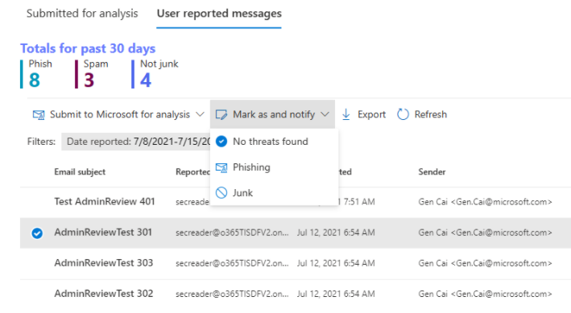
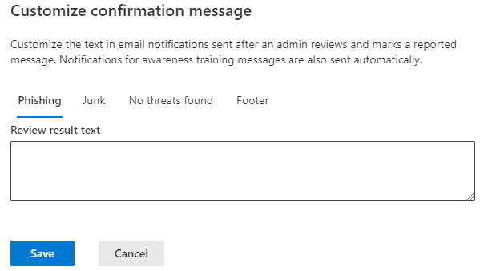

# Revisión del administrador para los mensajes de los que se informe

[!INCLUDE [Microsoft 365 Defender rebranding](../includes/microsoft-defender-for-office.md)]

> [!NOTE]
> La información de este artículo se refiere a un producto de vista previa que puede modificarse considerablemente antes de su lanzamiento comercial. Este documento se proporciona únicamente con fines de evaluación y exploración.

**Se aplica a**
- [Plan 1 y Plan 2 de Microsoft Defender para Office 365](defender-for-office-365.md)
- [Microsoft 365 Defender](../defender/microsoft-365-defender.md)

En Microsoft 365 con Exchange Online buzones de correo y Microsoft Defender para Office 365, los administradores ahora pueden enviar mensajes con plantilla de vuelta a los usuarios finales después de revisar los mensajes notificados. Las plantillas se pueden personalizar para su organización y también en función del veredicto del administrador.

La característica está diseñada para enviar comentarios a los usuarios, pero no cambia los veredictos de los mensajes en el sistema. Para ayudar a Microsoft a actualizar y mejorar sus filtros, debe enviar mensajes para su análisis mediante [el envío de administrador.](admin-submission.md)

Solo podrá marcar y notificar a los usuarios los resultados de la revisión si el mensaje se notificó como [falsos positivos o falsos negativos](report-false-positives-and-false-negatives.md).

## ¿Qué necesita saber antes de comenzar?

- Abra el portal de Microsoft 365 Defender en <https://security.microsoft.com/>. Para ir directamente a la **página Envíos,** use <https://security.microsoft.com/reportsubmission> .

- Para modificar la configuración de envíos de usuarios, debe ser miembro de uno de los siguientes grupos de roles:
  - Administración de la organización o Administrador de seguridad [en Microsoft 365 Defender portal](permissions-microsoft-365-security-center.md).
  - Administración de la [organización en Exchange Online](/Exchange/permissions-exo/permissions-exo#role-groups).

- También necesitarás acceso a Exchange Online PowerShell. Si la cuenta que está intentando usar no tiene acceso Exchange Online PowerShell, recibirá un error que indica Especificar una dirección de correo electrónico en *su dominio*. Para obtener más información acerca de cómo habilitar o deshabilitar el acceso a Exchange Online PowerShell, consulte los siguientes temas:
  - [Habilitar o deshabilitar el acceso al PowerShell de Exchange Online](/powershell/exchange/disable-access-to-exchange-online-powershell)
  - [Reglas de acceso de cliente en Exchange Online](/exchange/clients-and-mobile-in-exchange-online/client-access-rules/client-access-rules)

## Notificar a los usuarios desde el portal

1. En el Microsoft 365 Defender, vaya directamente a la **página Envíos:** [ https://security.microsoft.com/reportsubmission}(https://security.microsoft.com/reportsubmission) .

2. Haga **clic en Mensajes notificados por** el usuario y, a continuación, seleccione el mensaje que desea marcar y notificar.

3. Seleccione la **lista desplegable Marcar** como y notificar y, a continuación, seleccione **No** se encontraron amenazas, **Suplantación** de identidad o **Correo no deseado.**

   > [!div class="mx-imgBorder"]
   > 

El mensaje notificado se marcará como falso positivo o falso negativo, y se enviará automáticamente un correo electrónico desde el portal que notificará al usuario que ha notificado el mensaje.

## Personalizar los mensajes usados para notificar a los usuarios

1. En el portal de Microsoft 365 Defender, vaya a Correo electrónico **&** directivas de colaboración & reglas directivas de amenazas El usuario ha notificado la configuración del mensaje en la \>  \>  \>  **sección** Otros.

2. En la página **Envíos** de usuario, si desea especificar el nombre para mostrar del remitente **Office 365,** active la casilla Especificar una dirección de correo electrónico para usarla como remitente en la sección Notificaciones de correo electrónico para los **resultados** de la revisión de administrador y escriba el nombre que desea usar. La dirección de correo electrónico que estará visible en Outlook y todas las respuestas irán allí.

3. Si desea personalizar cualquiera de las plantillas, haga clic en Personalizar notificación **por correo electrónico** en la parte inferior de la página. En el menú desplegable que se abre, solo puede personalizar lo siguiente:

    - Suplantación de identidad (phishing)
    - Correo no deseado
    - No se encontraron amenazas
    - Pie de página

    > [!div class="mx-imgBorder"]
    > 

4. Cuando haya terminado, haga clic en **Guardar**. Para borrar estos valores, haga clic en **Descartar** en la página Envíos de usuario.
