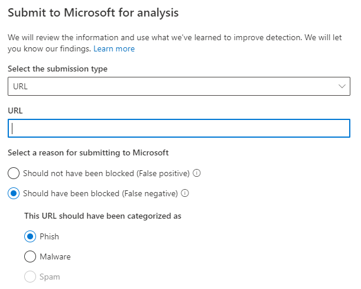
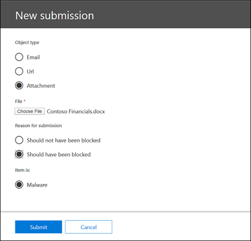
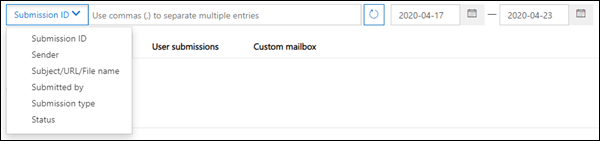

# Usar el Envío para administradores para enviar correo no deseado, de suplantación de identidad, direcciones URL y archivos sospechosos a Microsoft

[!INCLUDE [Microsoft 365 Defender rebranding](../includes/microsoft-defender-for-office.md)]

**Se aplica a**
- [Exchange Online Protection](https://go.microsoft.com/fwlink/?linkid=2148611)
- [Plan 1 y Plan 2 de Microsoft Defender para Office 365](https://go.microsoft.com/fwlink/?linkid=2148715)

En organizaciones de Microsoft 365 con buzones en Exchange Online, los administradores pueden usar el portal de envíos del Centro de seguridad & y cumplimiento para enviar mensajes de correo electrónico, direcciones URL y datos adjuntos a Microsoft para su análisis.

Cuando envíe un mensaje de correo electrónico, recibirá:

1. **Comprobación de autenticación de** correo electrónico: detalles sobre si la autenticación de correo electrónico se ha superado o no cuando se entregó.
2. **Aciertos de** directiva: información sobre las directivas que pueden haber permitido o bloqueado el correo electrónico entrante en su espacio empresarial, invalidando nuestros veredictos de filtro de servicio.
3. **Reputación/detonación de carga:** examen de las direcciones URL y los datos adjuntos del mensaje.
4. **Análisis de calificador:** revisión realizada por los calificadores para confirmar si los mensajes son malintencionados o no.

> [!IMPORTANT]
> La reputación/detonación de carga útil y el análisis de calificador no se realizan en todos los inquilinos. Se bloquea la información para que no salga de la organización cuando se supone que los datos no deben salir del límite del espacio empresarial por motivos de cumplimiento.

Para obtener otras formas de enviar mensajes de correo electrónico, direcciones URL y datos adjuntos a Microsoft, vea Notificar mensajes y [archivos a Microsoft.](report-junk-email-messages-to-microsoft.md)

## ¿Qué necesita saber antes de comenzar?

- Abra el Centro de seguridad y cumplimiento en <https://protection.office.com/>. Para ir directamente a la **página Envío,** use <https://protection.office.com/reportsubmission> .

- Para enviar mensajes y archivos a Microsoft, debe ser miembro de uno de los siguientes grupos de roles:

  - **Administración de la organización** o **Administrador de seguridad** en el [Centro de seguridad y cumplimiento](permissions-in-the-security-and-compliance-center.md).

  - **Administración de la** organización [en Exchange Online](https://docs.microsoft.com/Exchange/permissions-exo/permissions-exo#role-groups).

    Tenga en cuenta que es necesario pertenecer a este grupo de roles para ver los [envíos](#view-user-submissions-to-the-custom-mailbox) de usuarios al buzón personalizado, tal como se describe más adelante en este artículo.

- Para obtener más información acerca de cómo los usuarios pueden enviar mensajes y archivos a Microsoft, vea Notificar mensajes [y archivos a Microsoft.](report-junk-email-messages-to-microsoft.md)

## Notificar contenido sospechoso a Microsoft

1. En el Centro de & cumplimiento,  vaya a Envíos de administración de amenazas, compruebe que está en la pestaña Envíos de administración y, a continuación, haga clic en \>  **Nuevo envío.** 

2. Use **el menú desplegable Nuevo** envío que parece enviar el mensaje, la dirección URL o los datos adjuntos, tal como se describe en las secciones siguientes.

### Enviar un correo electrónico cuestionable a Microsoft

1. En la **sección Tipo de** objeto, seleccione Correo **electrónico.** En la **sección Formato de** envío, usa una de las siguientes opciones:

   - **Id.** de mensaje de red: es un valor GUID que está disponible en el encabezado **X-MS-Exchange-Organization-Network-Message-Id** del mensaje, o en el encabezado **X-MS-Office365-Filtering-Correlation-Id** en mensajes en cuarentena.

   - **Archivo:** haga clic **en Elegir archivo.** En el cuadro de diálogo que se abre, busque y seleccione el archivo .eml o .msg y, a continuación, haga clic en **Abrir**.

   > [!NOTE]
   > Los administradores con Defender para Office 365 Plan 1 o Plan 2 pueden enviar mensajes tan antiguos como 30 días. Otros administradores solo podrán volver 7 días atrás.

2. En la **sección** Destinatarios, especifique uno o más destinatarios con los que desea ejecutar una comprobación de directiva. La comprobación de directivas determinará si el correo electrónico omitió el examen debido a directivas de usuario u organización.

3. En la **sección Motivo del envío,** selecciona una de las siguientes opciones:

   - **No debería haber sido bloqueado**

   - **Debería haber sido bloqueado:** Seleccionar **correo no** deseado, **suplantación** de identidad o **malware.** Si no está seguro, use su mejor criterio.

4. Cuando haya terminado, haga clic en **el botón** Enviar.

   

### Enviar una dirección URL sospechosa a Microsoft

1. En la **sección Tipo de** objeto, seleccione Dirección **URL**. En el cuadro que aparece, escriba la dirección URL completa (por ejemplo, `https://www.fabrikam.com/marketing.html` ).

2. En la **sección Motivo del envío,** selecciona una de las siguientes opciones:

   - **No debería haber sido bloqueado**

   - **Debería haber sido bloqueado:** Seleccione **Suplantación de identidad** o **malware.**

3. Cuando haya terminado, haga clic en **el botón** Enviar.

   

### Enviar un archivo sospechoso a Microsoft

1. En la **sección Tipo de** objeto, seleccione Datos **adjuntos**.

2. Haga clic **en Elegir archivo.** En el cuadro de diálogo que se abre, busque y seleccione el archivo y, a continuación, haga clic en **Abrir**.

3. En la **sección Motivo del envío,** selecciona una de las siguientes opciones:

   - **No debería haber sido bloqueado**

   - **Debería haber sido bloqueado:** **el malware** es la única opción y se selecciona automáticamente.

4. Cuando haya terminado, haga clic en **el botón** Enviar.

   

## Ver envíos de administrador

En el Centro de & cumplimiento,  vaya a Envíos de administración de amenazas, compruebe que está en la pestaña Envíos de administración y, a continuación, haga clic en \>  **Nuevo envío.** 

Cerca de la parte superior de la página, puede escribir una fecha de inicio, una fecha de finalización y, de forma predeterminada, puede filtrar por identificador de envío **(un** valor GUID asignado a cada envío) especificando un valor en el cuadro y haciendo clic en el botón Actualizar  . Update

Para cambiar los criterios de filtro, haz clic en el botón **Id. de** envío y elige uno de los siguientes valores:

- **Sender**
- **Asunto/DIRECCIÓN URL/Nombre de archivo**
- **Enviado por**
- **Tipo de envío**
- **Estado**

Para exportar los resultados, haga clic **en Exportar** cerca de la parte superior de la página y seleccione Datos **del gráfico** o **Tabla**. En el cuadro de diálogo que aparece, guarde el archivo .csv.

Debajo del gráfico, hay tres pestañas: **Correo** electrónico (predeterminado), **Dirección URL** y **Datos adjuntos.**

### Ver envíos de correo electrónico de administrador

Haga clic en **la pestaña** Correo electrónico.

Puede hacer clic en el **botón Opciones de** columna situado cerca de la parte inferior de la página para agregar o quitar columnas de la vista:

- **Fecha**
- **Identificador de** envío: un valor GUID que se asigna a cada envío.
- **Enviado por**\*
- **Asunto**\*
- **Sender**
- **IP del remitente**\*
- **Tipo de envío**
- **Motivo de la entrega**
- **Estado**\*

  \* Si hace clic en este valor, se muestra información detallada en un menú desplegable.

#### Detalles del nuevo análisis del envío de administrador

Los mensajes que se envían en envíos de administrador se examinan de nuevo y los resultados se muestran en el menú desplegable de detalles:

- Si se ha produce un error en la autenticación de correo electrónico del remitente en el momento de la entrega.
- Información sobre los aciertos de directiva que podrían haber afectado o invalidado el veredicto de un mensaje.
- Resultados de detonación actuales para ver si las direcciones URL o los archivos contenidos en el mensaje eran malintencionados o no.
- Comentarios de los calificadores.

Si se encontró una invalidación, el nuevo análisis debe completarse en varios minutos. Si no hubo un problema en la autenticación o entrega de correo electrónico no se vio afectado por una invalidación, los comentarios de los calificadores podrían tardar hasta un día.

### Ver envíos de url de administrador

Haga clic en la **pestaña Dirección** URL.

Puede hacer clic en el **botón Opciones de** columna situado cerca de la parte inferior de la página para agregar o quitar columnas de la vista:

- **Fecha**
- **Id. de envío**
- **Enviado por**\*
- **URL**\*
- **Tipo de envío**
- **Estado**\*

  \* Si hace clic en este valor, se muestra información detallada en un menú desplegable.

### Ver envíos de datos adjuntos de administrador

Haga clic en **la pestaña Datos** adjuntos.

Puede hacer clic en el **botón Opciones de** columna situado cerca de la parte inferior de la página para agregar o quitar columnas de la vista:

- **Fecha**
- **Id. de envío**
- **Enviado por**\*
- **Nombre de archivo**\*
- **Tipo de envío**
- **Estado**\*

  \* Si hace clic en este valor, se muestra información detallada en un menú desplegable.

## Ver envíos de usuarios a Microsoft

Si ha implementado el complemento mensaje de  [informe,](enable-the-report-message-add-in.md)el complemento de suplantación de identidad de informes o los usuarios usan los informes integrados en Outlook en [la Web,](report-junk-email-and-phishing-scams-in-outlook-on-the-web-eop.md)puede ver qué usuarios están informando en la pestaña **Envíos** de usuarios.

1. En el Centro de & cumplimiento, vaya a **Envíos de** \> **administración de amenazas.**

2. Selecciona la **pestaña Envíos de** usuario y, a continuación, haz clic **en Nuevo envío.**

Puede hacer clic en el **botón Opciones de** columna situado cerca de la parte inferior de la página para agregar o quitar columnas de la vista:

- **Enviado en**
- **Enviado por**\*
- **Asunto**\*
- **Sender**
- **IP del remitente**\*
- **Tipo de envío**

\* Si hace clic en este valor, se muestra información detallada en un menú desplegable.

Cerca de la parte superior de la página, puede escribir una fecha de  inicio, una fecha de finalización y , de forma predeterminada, puede filtrar por remitente especificando un valor en el cuadro y haciendo clic en el botón  . Update

Para cambiar los criterios de filtro, haga clic en el **botón Remitente** y elija uno de los siguientes valores:

- **Dominio del remitente**
- **Asunto**
- **Enviado por**
- **Tipo de envío**
- **IP del remitente**

Para exportar los resultados, haga clic **en Exportar** cerca de la parte superior de la página y seleccione Datos **del gráfico** o **Tabla**. En el cuadro de diálogo que aparece, guarde el archivo .csv.

## Ver envíos de usuario al buzón personalizado

**Si** ha configurado un [buzón personalizado](user-submission.md) para recibir mensajes notificados por el usuario, puede ver y enviar también los mensajes que se entregaron al buzón de informes.

1. En el Centro de & cumplimiento, vaya a **Envíos de** \> **administración de amenazas.**

2. Seleccione la **pestaña Buzón personalizado.**

Puede hacer clic en el **botón Opciones de** columna situado cerca de la parte inferior de la página para agregar o quitar columnas de la vista:

- **Enviado en**
- **Enviado por**\*
- **Asunto**\*
- **Sender**
- **IP del remitente**\*
- **Tipo de envío**

Cerca de la parte superior de la página, puede escribir una fecha de inicio, una fecha de finalización y puede filtrar por **Enviado** especificando un valor en el cuadro y haciendo clic en el botón  . Update

Para exportar los resultados, haga clic **en Exportar** cerca de la parte superior de la página y seleccione Datos **del gráfico** o **Tabla**. En el cuadro de diálogo que aparece, guarde el archivo .csv.

## Deshacer envíos de usuarios

Una vez que un usuario envía un correo electrónico sospechoso al buzón personalizado, el usuario y el administrador no tienen la opción de deshacer el envío. Si el usuario desea recuperar el correo electrónico, estará disponible para su recuperación en las carpetas Elementos eliminados o Correo no deseado.

### Enviar mensajes a Microsoft desde el buzón personalizado

Si ha configurado el buzón personalizado para interceptar mensajes notificados por el usuario sin enviar los mensajes a Microsoft, puede buscar y enviar mensajes específicos a Microsoft para su análisis. Esto mueve de forma eficaz un envío de usuario a un envío de administrador.

En la **pestaña Buzón personalizado,** seleccione un  mensaje en la lista, haga clic en el botón Acción y realice una de las siguientes selecciones:

- **Informe limpio**
- **Informar sobre la suplantación de identidad**
- **Notificar malware**
- **Notificar correo no deseado**

