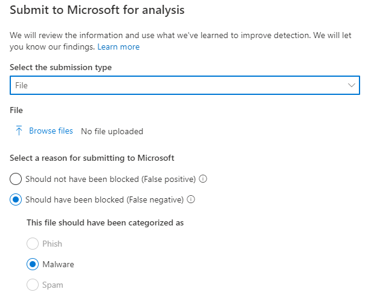
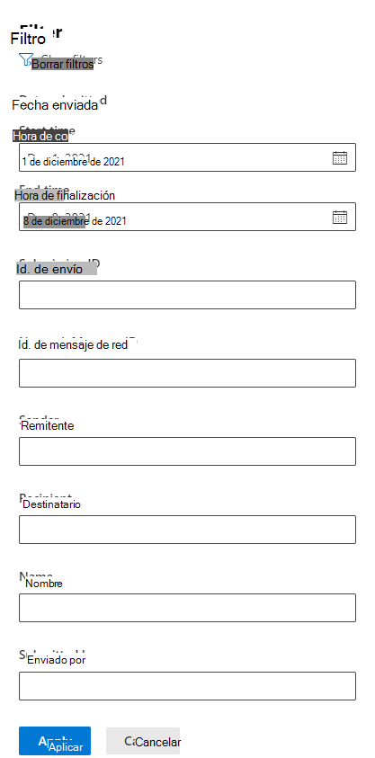

# Usar el Envío para administradores para enviar correo no deseado, de suplantación de identidad, direcciones URL y archivos sospechosos a Microsoft

[!INCLUDE [Microsoft 365 Defender rebranding](../includes/microsoft-defender-for-office.md)]

**Se aplica a**
- [Exchange Online Protection](exchange-online-protection-overview.md)
- [Plan 1 y Plan 2 de Microsoft Defender para Office 365](defender-for-office-365.md)

En Microsoft 365 organizaciones con buzones de correo Exchange Online, los administradores pueden usar el portal de envíos en el portal de Microsoft 365 Defender para enviar mensajes de correo electrónico, direcciones URL y datos adjuntos a Microsoft para examinarlos.

Cuando envíe un mensaje de correo electrónico, recibirá:

- **Comprobación de autenticación de** correo electrónico: detalles sobre si la autenticación de correo electrónico se ha pasado o no cuando se entregó.
- **Aciertos de** directiva: información sobre las directivas que pueden haber permitido o bloqueado el correo electrónico entrante en su inquilino, invalidando nuestros veredictos de filtro de servicio.
- **Reputación/detonación de carga:** examen de las direcciones URL y los datos adjuntos del mensaje.
- **Análisis del calificador:** revisión realizada por calificadores humanos para confirmar si los mensajes son malintencionados o no.

> [!IMPORTANT]
> El análisis de reputación/detonación y calificador de carga no se realiza en todos los inquilinos. La información se bloquea para que no salga de la organización cuando los datos no deben salir del límite del espacio empresarial con fines de cumplimiento.

Para obtener otras formas de enviar mensajes de correo electrónico, direcciones URL y datos adjuntos a Microsoft, vea [Report messages and files to Microsoft](report-junk-email-messages-to-microsoft.md).

## ¿Qué necesita saber antes de comenzar?

- Abra el portal de Microsoft 365 Defender en <https://security.microsoft.com/>. Para ir directamente a la **página Envíos,** use <https://security.microsoft.com/reportsubmission> .

- Para enviar mensajes y archivos a Microsoft, debe ser miembro de uno de los siguientes grupos de roles:
  - **Administración de** la organización **o Lector de** seguridad en Microsoft 365 Defender [portal](permissions-microsoft-365-security-center.md).
  - **Administración de** la [organización en Exchange Online](/Exchange/permissions-exo/permissions-exo#role-groups).

    Tenga en cuenta que la pertenencia a este grupo de roles es necesaria para ver los [envíos](#view-user-submissions-to-microsoft) de usuarios al buzón personalizado, tal como se describe más adelante en este artículo.

- Para obtener más información acerca de cómo los usuarios pueden enviar mensajes y archivos a Microsoft, vea [Report messages and files to Microsoft](report-junk-email-messages-to-microsoft.md).

## Informar de contenido sospechoso a Microsoft

1. En el portal Microsoft 365 Defender, vaya a **Correo electrónico &** \> **envíos de colaboración**.

2. En la **página Envíos,** compruebe que la pestaña **Enviado** para el análisis está seleccionada y, a continuación, haga clic en Icono de anuncio  **análisis.**

3. Use el menú desplegable Enviar a **Microsoft** para revisión que parece enviar el mensaje, la dirección URL o los datos adjuntos de correo electrónico, tal como se describe en las secciones siguientes.

### Enviar un correo electrónico cuestionable a Microsoft

1. En el **cuadro Seleccionar el tipo de envío,** compruebe que **el** correo electrónico está seleccionado en la lista desplegable.

2. En la **sección Agregar el identificador de mensaje de red o cargar** el archivo de correo electrónico, use una de las siguientes opciones:
   - Agregar el identificador de mensaje de red de correo **electrónico:** se trata de un valor GUID que está disponible en el encabezado **X-MS-Exchange-Organization-Network-Message-Id** en el mensaje o en el encabezado **X-MS-Office365-Filtering-Correlation-Id** en mensajes en cuarentena.
   - **Upload el archivo de correo electrónico (.msg o .eml):** haga clic **en Examinar archivos**. En el cuadro de diálogo que se abre, busque y seleccione el archivo .eml o .msg y, a continuación, haga clic **en Abrir**.

   > [!NOTE]
   > La capacidad de enviar mensajes tan antiguos como 30 días se ha suspendido temporalmente para Defender para Office 365 clientes. Los administradores solo podrán volver 7 días atrás.

3. En el **cuadro Elegir un destinatario con un** problema, especifique el destinatario con el que desea ejecutar una comprobación de directiva. La comprobación de directivas determinará si el correo electrónico omitió el examen debido a directivas de usuario u organización.

4. En la **sección Seleccionar un motivo para enviar a Microsoft,** seleccione una de las siguientes opciones:
   - **No se debería haber bloqueado (falso positivo)**
   - **Debería haber sido** bloqueado: en la sección El correo electrónico debería haber sido categorizado como sección que aparece, seleccione uno de los siguientes valores (si no está seguro, use su mejor criterio): 
     - **Suplantación de identidad**
     - **Correo no deseado**
     - **Malware**

5. Cuando haya terminado, haga clic en el **botón Enviar.**

> [!div class="mx-imgBorder"]
> 

### Enviar una dirección URL sospechosa a Microsoft

1. En el **cuadro Seleccionar el tipo de envío,** seleccione DIRECCIÓN **URL** en la lista desplegable.

2. En el **cuadro Dirección URL** que aparece, escriba la dirección URL completa (por ejemplo, `https://www.fabrikam.com/marketing.html` ).

3. En la **sección Seleccionar un motivo para enviar a Microsoft,** seleccione una de las siguientes opciones:
   - **No se debería haber bloqueado (falso positivo)**
   - **Debería haber sido bloqueado:** en esta **dirección URL debería haber sido** categorizada como sección que aparece, seleccione **Phish** o **Malware**.

4. Cuando haya terminado, haga clic en el **botón Enviar.**

> [!div class="mx-imgBorder"]
> 

### Enviar datos adjuntos de correo electrónico sospechosos a Microsoft

1. En el **cuadro Seleccionar el tipo de envío,** seleccione **Archivo** en la lista desplegable.

2. En la **sección Archivo** que aparece, haga clic en **Examinar archivos**. En el cuadro de diálogo que se abre, busque y seleccione el archivo y, a continuación, haga clic en **Abrir**.

3. En la **sección Seleccionar un motivo para enviar a Microsoft,** seleccione una de las siguientes opciones:
   - **No se debería haber bloqueado (falso positivo)**
   - **Debería haber sido bloqueado:** en esta **dirección URL** debería haber sido categorizada como sección que aparece, **Malware** es la única opción y se selecciona automáticamente.

4. Cuando haya terminado, haga clic en el **botón Enviar.**

> [!div class="mx-imgBorder"]
> 

## Ver envíos de administrador a Microsoft

1. En el portal Microsoft 365 Defender, vaya a **Correo electrónico &** \> **envíos de colaboración**.

2. En la **página Envíos,** compruebe que la pestaña **Enviado** para el análisis está seleccionada.

   - Puede ordenar las entradas haciendo clic en un encabezado de columna disponible. Haga **clic en** Personalizar columnas para mostrar un máximo de siete columnas. Los valores predeterminados están marcados con un asterisco (\*):
     - **Nombre del envío**\*
     - **Remitente**\*
     - **Fecha enviada**\*
     - **Tipo de envío**\*
     - **Motivo para enviar**\*
     - **Estado de reescaneo**\*
     - **Volver a examinar el resultado**\*
     - **Veredicto de filtro**
     - **Motivo de entrega/bloqueo**
     - **Identificador de envío**
     - **Id. de mensaje de red/id. de objeto**
     - **Dirección**
     - **IP del remitente**
     - **Nivel de cumplimiento masivo (BCL)**
     - **Destino**
     - **Acción de directiva**
     - **Enviado por**

     Cuando haya terminado, haga clic en **Aplicar**.

   - Para filtrar las entradas, haga clic **en Filtrar**. Los filtros disponibles son:
     - **Fecha enviada:** **Fecha de inicio** y Fecha de **finalización**.
     - **Tipo de envío:** **Correo** **electrónico, dirección URL** o **Archivo**.
     - **Identificador de envío:** valor GUID que se asigna a cada envío.
     - **Id. de mensaje de red**
     - **Sender**

     Cuando haya terminado, haga clic en **Aplicar**.

     > [!div class="mx-imgBorder"]
     > 

   - Para agrupar las entradas, haga clic **en Agrupar** y seleccione uno de los siguientes valores de la lista desplegable:
     - **Ninguna**
     - **Tipo**
     - **Motivo**
     - **Estado**
     - **Volver a examinar el resultado**

   - Para exportar las entradas, haga clic en **Exportar**. En el cuadro de diálogo que aparece, guarde el .csv archivo.

### Detalles de reescaneo de envío de administrador

Los mensajes que se envían en envíos de administrador se revisan y los resultados se muestran en el menú desplegable de detalles de envíos:

- Si hubo un error en la autenticación de correo electrónico del remitente en el momento de la entrega.
- Información sobre los aciertos de directiva que puedan haber afectado o invalidado el veredicto de un mensaje.
- Actualice los resultados de cancelación para ver si las direcciones URL o los archivos contenidos en el mensaje son malintencionados o no.
- Comentarios de los calificadores.

Si se encontró una invalidación, se volverá a ejecutar una detección que se completará en unos minutos. Si no hubo un problema en la autenticación o entrega de correo electrónico no se vio afectado por una invalidación, los comentarios de los calificadores podrían tardar hasta un día.

## Ver envíos de usuario a Microsoft

Si ha implementado el complemento Report  [Message](enable-the-report-message-add-in.md), el complemento Report [Phishing](enable-the-report-phish-add-in.md)o los usuarios usan los informes integrados en [Outlook en la Web,](report-junk-email-and-phishing-scams-in-outlook-on-the-web-eop.md)puede ver qué usuarios están informando en la pestaña Mensaje notificado por el usuario.

1. En el portal Microsoft 365 Defender, vaya a **Correo electrónico &** \> **envíos de colaboración**.

2. En la **página Envíos,** seleccione la **pestaña Mensajes notificados por el** usuario.

   - Puede ordenar las entradas haciendo clic en un encabezado de columna disponible. Haga **clic en** Personalizar columnas para mostrar un máximo de siete columnas. Los valores predeterminados están marcados con un asterisco (\*):

     - **Asunto del correo electrónico**\*
     - **Notificado por**\*
     - **Fecha notificada**\*
     - **Remitente**\*
     - **Motivo notificado**\*
     - **Volver a examinar el resultado**\*
     - **Id. de mensaje notificado**
     - **Id. de mensaje de red**
     - **IP del remitente**
     - **Simulación de phishing**

     Cuando haya terminado, haga clic en **Aplicar**.

   - Para filtrar las entradas, haga clic **en Filtrar**. Los filtros disponibles son:
     - **Fecha notificada**: **Fecha de inicio** y Fecha de **finalización**.
     - **Informe realizado por**
     - **Asunto del correo electrónico**
     - **Id. de mensaje notificado**
     - **Id. de mensaje de red**
     - **Sender**
     - **Motivo notificado:** **No es correo no** deseado, **phish** o correo **no deseado.**
     - **Simulación de phish:** **Sí** o **No**

     Cuando haya terminado, haga clic en **Aplicar**.

     > [!div class="mx-imgBorder"]
     > 

   - Para agrupar las entradas, haga clic **en Agrupar** y seleccione uno de los siguientes valores de la lista desplegable:
     - **Ninguna**
     - **Motivo**
     - **Sender**
     - **Informe realizado por**
     - **Volver a examinar el resultado**
     - **Simulación de phishing**

   - Para exportar las entradas, haga clic en **Exportar**. En el cuadro de diálogo que aparece, guarde el .csv archivo.

> [!NOTE]
> Si las organizaciones están configuradas para enviar mensajes notificados por el usuario solo  al buzón personalizado, los mensajes notificados no se enviarán para volver a examinarse y los resultados de los mensajes notificados por el usuario siempre estarán vacíos.

### Deshacer envíos de usuarios

Una vez que un usuario envía un correo electrónico sospechoso al buzón personalizado, el usuario y el administrador no tienen ninguna opción para deshacer el envío. Si el usuario desea recuperar el correo electrónico, estará disponible para su recuperación en las carpetas Elementos eliminados o Correo no deseado.

### Enviar mensajes a Microsoft desde el buzón personalizado

Si ha configurado el buzón personalizado para interceptar mensajes notificados por el usuario sin enviar los mensajes a Microsoft, puede buscar y enviar mensajes específicos a Microsoft para su análisis. Esto mueve de forma eficaz un envío de usuario a un envío de administrador.

En la **pestaña Mensajes** notificados por el usuario, seleccione un mensaje en la lista, haga clic en Enviar a **Microsoft** para su análisis y, a continuación, seleccione uno de los siguientes valores de la lista desplegable:

- **Informe limpio**
- **Report phishing**
- **Informar de malware**
- **Notificar correo no deseado**
- **Investigación de desencadenadores**

> [!div class="mx-imgBorder"]
> 
