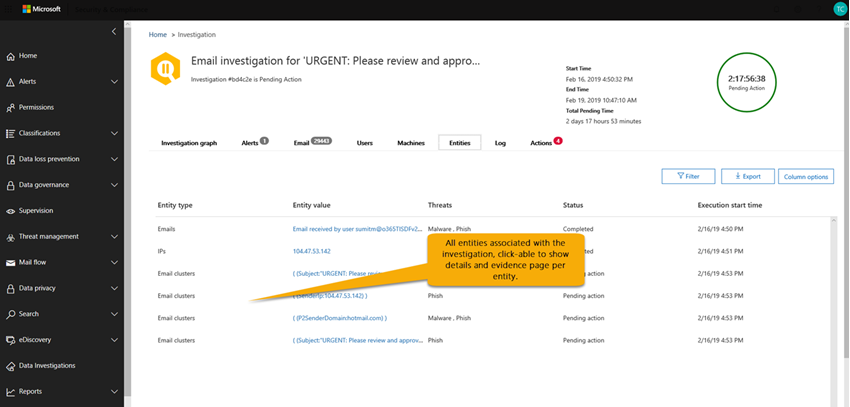

# Detalles y resultados de una investigación automatizada en Microsoft 365Details and results of an automated investigation in Microsoft 365

[!INCLUDE [Microsoft 365 Defender rebranding](../includes/microsoft-defender-for-office.md)]

Cuando se produce una [investigación automatizada](office-365-air.md) en [Microsoft Defender para Office 365](office-365-atp.md), los detalles sobre la investigación están disponibles durante y después del proceso de investigación automatizada.When an [automated investigation](office-365-air.md) occurs in [Microsoft Defender for Office 365](office-365-atp.md), details about that investigation are available during and after the automated investigation process. Si tiene los permisos necesarios, puede ver estos detalles en el centro de seguridad de Microsoft 365.If you have the necessary permissions, you can view those details in the Microsoft 365 security center. Los detalles de la investigación le proporcionan el estado actualizado y la capacidad de aprobar cualquier acción pendiente.Investigation details provide you with up-to-date status, and the ability to approve any pending actions.

## Estado de la investigaciónInvestigation status

El estado de la investigación indica el progreso del análisis y las acciones.The investigation status indicates the progress of the analysis and actions. A medida que se ejecuta la investigación, el estado cambia para indicar si se han encontrado amenazas y si se han aprobado las acciones.As the investigation runs, status changes to indicate whether threats were found, and whether actions have been approved.

|EstadoStatus|DescripciónDescription|
|---|---|
|**Iniciando****Starting**|La investigación se ha desencadenado y está en espera de comenzar a ejecutarse.The investigation has been triggered and waiting to start running.|
|**En funcionamiento****Running**|El proceso de investigación se ha iniciado y está en curso.The investigation process has started and is underway. Este estado también se produce cuando se aprueban [las acciones pendientes](air-review-approve-pending-completed-actions.md#approve-or-reject-pending-actions) .This state also occurs when [pending actions](air-review-approve-pending-completed-actions.md#approve-or-reject-pending-actions) are approved.|
|**No se encontraron amenazas****No Threats Found**|La investigación ha finalizado y no se han identificado amenazas (cuenta de usuario, mensaje de correo electrónico, URL o archivo).The investigation has finished and no threats (user account, email message, URL, or file) were identified. 
 **Sugerencia**: Si sospecha que se ha perdido algo (como un falso negativo), puede emprender acciones con el [Explorador de amenazas](threat-explorer.md).**TIP**: If you suspect something was missed (such as a false negative), you can take action using [Threat Explorer](threat-explorer.md).|
|**Amenazas encontradas****Threats Found**|La investigación automatizada encontró problemas, pero no hay acciones de corrección específicas para resolver estos problemas.The automated investigation found issues, but there are no specific remediation actions to resolve those issues. 
 El estado de **amenazas encontradas** puede producirse cuando se identificó algún tipo de actividad de usuario, pero no hay ninguna acción de limpieza disponible.The **Threats Found** status can occur when some type of user activity was identified but no cleanup actions are available. Algunos ejemplos son las siguientes actividades de usuario:Examples include any of the following user activities: <ul><li>Un evento de [prevención de pérdida de datos](https://docs.microsoft.com/Microsoft-365/compliance/data-loss-prevention-policies) (DLP)A [data loss prevention](https://docs.microsoft.com/Microsoft-365/compliance/data-loss-prevention-policies) (DLP) event</li><li>Una anomalía de envío de correo electrónicoAn email sending anomaly</li><li>Malware enviadoSent malware</li><li>Phish enviadoSent phish</li></ul> 
 La investigación no encontró direcciones URL malintencionadas, archivos ni mensajes de correo electrónico que corregir, y no se ha corregido ninguna actividad de buzón, como desactivar las reglas de reenvío o la delegación.The investigation found no malicious URLs, files, or email messages to remediate, and no mailbox activity to fix, such as turning off forwarding rules or delegation. 
 **Sugerencia**: Si sospecha que se ha perdido algo (como un falso negativo), puede investigar y realizar acciones con el [Explorador de amenazas](threat-explorer.md).**TIP**: If you suspect something was missed (such as a false negative), you can investigate and take action using [Threat Explorer](threat-explorer.md).|
|**Finalizado por el sistema****Terminated By System**|Se detuvo la investigación.The investigation stopped. Una investigación puede detenerse por varias razones:An investigation can stop for several reasons: <ul><li>Las acciones pendientes de la investigación expiraron.The investigation's pending actions expired. Se agota el tiempo de espera de las acciones pendientes después de esperar la aprobación durante una semana.Pending actions time out after awaiting approval for one week.</li><li>Hay demasiadas acciones.There are too many actions. Por ejemplo, si hay demasiados usuarios haciendo clic en direcciones URL malintencionadas, puede superar la capacidad de la investigación para ejecutar todos los analizadores, de modo que la investigación se detenga.For example, if there are too many users clicking on malicious URLs, it can exceed the investigation's ability to run all the analyzers, so the investigation halts.</li></ul> 
 **Sugerencia**: Si una investigación se detiene antes de que se tomaron las acciones, pruebe a usar el [Explorador de amenazas](threat-explorer.md) para encontrar y solucionar amenazas.**TIP**: If an investigation halts before actions were taken, try using [Threat Explorer](threat-explorer.md) to find and address threats.|
|**Acción pendiente****Pending Action**|La investigación ha encontrado una amenaza, como un correo electrónico malintencionado, una dirección URL malintencionada o una configuración de buzón de correo arriesgado, y una acción para corregir dicha amenaza está en [espera de aprobación](air-review-approve-pending-completed-actions.md).The investigation has found a threat, such as a malicious email, a malicious URL, or a risky mailbox setting, and an action to remediate that threat is [awaiting approval](air-review-approve-pending-completed-actions.md). 
 El estado de **acción pendiente** se desencadena cuando se encuentra cualquier amenaza con una acción correspondiente.The **Pending Action** state is triggered when any threat with a corresponding action is found. Sin embargo, la lista de acciones pendientes puede aumentar a medida que se ejecute una investigación.However, the list of pending actions can increase as an investigation runs. Compruebe el [registro de investigación](#playbook-log) para ver si hay otros elementos aún pendientes de finalización.Check the [investigation log](#playbook-log) to see if other items are still pending completion.|
|**Corregido****Remediated**|Ha finalizado la investigación y se han aprobado todas las acciones de corrección (se indica como corregida completamente).The investigation finished and all remediation actions were approved (this is noted as fully remediated). 
 **Nota**: las acciones de corrección aprobadas pueden tener errores que impiden que se tomen las acciones.**NOTE**: Approved remediation actions can have errors that prevent the actions from being taken. Independientemente de si las acciones de corrección se completan correctamente, el estado de la investigación no cambia.Regardless of whether remediation actions are successfully completed, the investigation status does not change. Consulte el [registro de investigación](#playbook-log) para obtener resultados detallados.Check the [investigation log](#playbook-log) for detailed results.|
|**Parcialmente remediado****Partially Remediated**|La investigación dio como resultado acciones correctivas y algunas fueron aprobadas y completadas.The investigation resulted in remediation actions, and some were approved and completed. Aún hay otras acciones [pendientes](air-review-approve-pending-completed-actions.md).Other actions are still [pending](air-review-approve-pending-completed-actions.md).|
|**Failed****Failed**|Al menos un analizador de investigación tuvo un problema en el que no se pudo completar correctamente.At least one investigation analyzer ran into a problem where it could not complete properly. 
 **Nota**: si se produce un error en una investigación tras la aprobación de acciones de corrección, es posible que las acciones de corrección sigan teniendo éxito.**NOTE**: If an investigation fails after remediation actions were approved, the remediation actions might still have succeeded. Consulte el [registro de investigación](#playbook-log) para obtener resultados detallados.Check the [investigation log](#playbook-log) for detailed results.|
|**En cola por limitación****Queued By Throttling**|Una investigación se mantiene en una cola.An investigation is being held in a queue. Cuando se completan otras investigaciones, comienzan las investigaciones en cola.When other investigations complete, queued investigations begin. La limitación ayuda a evitar un rendimiento deficiente del servicio.Throttling helps avoid poor service performance.  
 **Sugerencia**: las acciones pendientes pueden limitar el número de investigaciones nuevas que se pueden ejecutar.**TIP**: Pending actions can limit how many new investigations can run. Asegúrese de [aprobar (o rechazar) acciones pendientes](air-review-approve-pending-completed-actions.md#approve-or-reject-pending-actions).Make sure to [approve (or reject) pending actions](air-review-approve-pending-completed-actions.md#approve-or-reject-pending-actions).|
|**Terminado con la limitación****Terminated By Throttling**|Si una investigación se mantiene en la cola demasiado tiempo, se detiene.If an investigation is held in the queue too long, it stops. 
 **Sugerencia**: puede [iniciar una investigación desde el explorador de amenazas](automated-investigation-response-office.md#example-a-security-administrator-triggers-an-investigation-from-threat-explorer).**TIP**: You can [start an investigation from Threat Explorer](automated-investigation-response-office.md#example-a-security-administrator-triggers-an-investigation-from-threat-explorer).|
|

## Ver los detalles de una investigaciónView details of an investigation

1. Vaya al centro de seguridad & cumplimiento ( [https://protection.office.com](https://protection.office.com) ) e inicie sesión.Go to the Security & Compliance Center ([https://protection.office.com](https://protection.office.com)) and sign in.

2. Realice una de las siguientes acciones:Do one of the following actions:

    - Vaya al panel de **Administración de amenazas** \> **Dashboard**.Go to **Threat management** \> **Dashboard**. Esto le llevará al [Panel de seguridad](security-dashboard.md).This takes you to the [Security Dashboard](security-dashboard.md). Los widgets de AIR aparecen en la parte superior del [Panel de seguridad](security-dashboard.md).Your AIR widgets appear across the top of the [Security Dashboard](security-dashboard.md). Seleccione un widget, como un **Resumen de investigaciones**.Select a widget, such as **Investigations summary**.

    - Vaya a investigaciones de **Administración de amenazas** \> **Investigations**.Go to **Threat management** \> **Investigations**.

    Cualquiera de estos métodos le lleva a una lista de investigaciones.Either method takes you to a list of investigations.

    

3. En la lista de investigaciones, seleccione un elemento en la columna **ID** .In the list of investigations, select an item in the **ID** column. Se abrirá la página Detalles de la investigación, empezando por el gráfico de investigación en la vista.This opens investigation details page, starting with the investigation graph in view.

    

   Use las distintas pestañas para obtener más información sobre la investigación.Use the various tabs to learn more about the investigation.

## Ver los detalles de una alerta relacionada con una investigaciónView details about an alert related to an investigation

Ciertos tipos de alertas desencadenan la investigación automatizada en Microsoft 365.Certain kinds of alerts trigger automated investigation in Microsoft 365. Para obtener más información, consulte [directivas de alerta que desencadenan investigaciones automáticas](office-365-air.md#which-alert-policies-trigger-automated-investigations).To learn more, see [alert policies that trigger automated investigations](office-365-air.md#which-alert-policies-trigger-automated-investigations).

Use el siguiente procedimiento para ver los detalles de una alerta asociada a una investigación automatizada.Use the following procedure to view details about an alert that is associated with an automated investigation.

1. Vaya al centro de seguridad & cumplimiento ( [https://protection.office.com](https://protection.office.com) ) e inicie sesión.Go to the Security & Compliance Center ([https://protection.office.com](https://protection.office.com)) and sign in.

2. Vaya a investigaciones de **Administración de amenazas** \> **Investigations**.Go to **Threat management** \> **Investigations**.

3. En la lista de investigaciones, seleccione un elemento en la columna **ID** .In the list of investigations, select an item in the **ID** column.

4. Con los detalles de una investigación abierta, seleccione la pestaña **alertas** . Aquí se enumeran las alertas que desencadenaron la investigación.With details of an investigation open, select the **Alerts** tab. Any alerts that triggered the investigation are listed here.

5. Seleccione un elemento de la lista.Select an item in the list. Se abre un control flotante, con detalles sobre la alerta y vínculos a acciones e información adicionales.A flyout opens, with details about the alert and links to additional information and actions.

6. Revise la información en el control flotante y, en función de la alerta en particular, realice una acción, como **resolver**, **suprimir** o **notificar a los usuarios**.Review the information on the flyout, and, depending on the particular alert, take an action, such as **Resolve**, **Suppress**, or **Notify users**.

    - **Resolve** equivale a cerrar una alerta**Resolve** is equivalent to closing an alert

    - **Suprimir** hace que una directiva no desencadene alertas durante un período de tiempo especificado**Suppress** causes a policy to not trigger alerts for a specified period of time

    - **Notify users** inicia un correo electrónico con las direcciones de correo electrónico de los usuarios que ya se han especificado y permite que el equipo de operaciones de seguridad escriba un mensaje para esos usuarios.**Notify users** starts an email with users' email addresses already entered, and enables your security operations team to type a message to those users. (Es similar a enviar un mensaje a los destinatarios mediante el [Explorador de amenazas](threat-explorer.md)).(This is similar to sending a message to recipients using [Threat Explorer](threat-explorer.md).)

## Uso de las distintas pestañasHow to use the various tabs

Las siguientes secciones le guiarán por las distintas pestañas de la página investigaciones automatizadas y cómo puede usar la información.The following sections walk you through the various tabs on the automated investigations page and how you can use the information.

### Página investigaciones automatizadasAutomated investigations page

La página investigaciones automatizadas muestra las investigaciones de su organización y sus Estados actuales.The automated investigations page shows your organization's investigations and their current states.

Puede:You can:

- Vaya directamente a una investigación (seleccione un **identificador de investigación**).Navigate directly to an investigation (select an **Investigation ID**).

- Aplicar filtros.Apply filters. Elija entre el **tipo de investigación**, **el intervalo de tiempo**, el **Estado** o una combinación de estos.Choose from **Investigation Type**, **Time range**, **Status**, or a combination of these.

- Exporte los datos a un archivo. csv.Export the data to a .csv file.

### Gráfico de investigaciónInvestigation graph

Al abrir una investigación específica, verá la página gráfico de investigación.When you open a specific investigation, you see the investigation graph page. En esta página se muestran todas las entidades distintas: mensajes de correo electrónico, usuarios (y sus actividades) y dispositivos que se investigaron automáticamente como parte de la alerta que se activó.This page shows all the different entities: email messages, users (and their activities), and devices that were automatically investigated as part of the alert that was triggered.

Puede:You can:

- Obtenga información general visual de la investigación actual.Get a visual overview of the current investigation.
- Ver un resumen de la duración de la investigación.View a summary of the investigation duration.
- Seleccione un nodo de la visualización para ver los detalles de ese nodo.Select a node in the visualization to view details for that node.
- Seleccione una pestaña en la parte superior para ver los detalles de esa pestaña.Select a tab across the top to view details for that tab.

### Investigación de alertasAlert investigation

En la pestaña **alertas** de una investigación, puede ver las alertas relevantes para la investigación.On the **Alerts** tab for an investigation, you can see alerts relevant to the investigation. Los detalles incluyen la alerta que desencadenó la investigación y otras alertas correlacionadas, como el inicio de sesión peligroso, las infracciones de [directivas de DLP](https://docs.microsoft.com/Microsoft-365/compliance/data-loss-prevention-policies) , etc., que están relacionadas con la investigación.Details include the alert that triggered the investigation and other correlated alerts, such as risky sign-in, [DLP policy](https://docs.microsoft.com/Microsoft-365/compliance/data-loss-prevention-policies) violations, etc., that are correlated to the investigation. En esta página, un analista de seguridad también puede ver detalles adicionales de alertas individuales.From this page, a security analyst can also view additional details on individual alerts.

Puede:You can:

- Obtenga información general visual de la alerta desencadenadora actual y de cualquier alerta asociada.Get a visual overview of the current triggering alert and any associated alerts.
- Seleccione una alerta de la lista para abrir una página emergente que muestre los detalles de la alerta completa.Select an alert in the list to open a fly-out page that shows full alert details.

### Investigación de correo electrónicoEmail investigation

En la pestaña **correo electrónico** de una investigación, puede ver los correos electrónicos originales y los clústeres de correo electrónico similar identificados como parte de la investigación.On the **Email** tab for an investigation, you can see the original emails and the clusters of similar email identified as part of the investigation. La pestaña **correo** electrónico también muestra los elementos de correo electrónico relacionados con la investigación, como los detalles de correo electrónico notificados por el usuario, el correo electrónico original que se ha notificado, los mensajes de correo electrónico que se han zapped debido a malware/phish, etc.The **Email** tab also shows email items related to the investigation, such as the user-reported email details, the original email reported, the email message(s) zapped due to malware/phish, etc.

Con la investigación de correo electrónico, puede:With email investigation, you can:

- Obtenga información general visual de los resultados y amenazas de clúster actuales encontrados.Get a visual overview of the current clustering results and threats found.
- Haga clic en una entidad de clúster o en una lista de amenazas para abrir una página emergente que muestre los detalles de alerta completos.Click a cluster entity or a threat list to open a fly-out page that shows the full alert details.
- Para investigar más detalladamente el clúster de correo electrónico, haga clic en el vínculo **abrir en el explorador** en la parte superior de la pestaña **detalles del clúster de correo electrónico**Further investigate the email cluster by clicking the **Open in Explorer** link at the top of the **Email cluster details** tab

Dado el volumen total de correo electrónico que los usuarios de una organización envían y reciben, además de la naturaleza multiusuario de las comunicaciones y los ataques de correo electrónico, el proceso siguiente puede tardar un tiempo considerable:Given the sheer volume of email that users in an organization send and receive, plus the multi-user nature of email communications and attacks, the following process can take a significant amount of time:

1. Agrupar mensajes de correo electrónico en función de atributos similares de un encabezado, cuerpo, dirección URL y datos adjuntos de un mensaje.Clustering email messages based on similar attributes from a message header, body, URL, and attachments.
2. Separar el correo electrónico malintencionado del buen correo electrónico.Separating malicious email from the good email.
3. Realizar acciones en mensajes de correo electrónico malintencionados.Taking action on malicious email messages.

AIR automatiza este proceso, lo que ahorra tiempo y esfuerzo del equipo de seguridad de su organización.AIR automates this process, saving your organization's security team time and effort.

#### Tipos de clústeres de correo electrónicoTypes of email clusters

Se pueden identificar tres tipos diferentes de clústeres de correo electrónico durante el paso de análisis de correo electrónico: clústeres de similitud (todas las investigaciones), clústeres de indicadores (todas las investigaciones) y clústeres de buzones de correo y usuarios.Three different types of email clusters can be identified during the email analysis step: similarity clusters (all investigations), indicator clusters (all investigations), and mailbox/user clusters. En la tabla siguiente se describen estos tipos de clústeres de correo electrónico.The following table describes these types of email clusters.

|Clúster de correo electrónicoEmail cluster|DescripciónDescription|
|---|---|
|Clústeres de similitudSimilarity clusters|Mensajes de correo electrónico que se identifican mediante la búsqueda de correos electrónicos con atributos de remitente y contenido similares.Email messages identified by hunting for emails with similar sender and content attributes. Estos clústeres se evalúan para contenido malintencionado en función de las comprobaciones de detección originales.These clusters are evaluated for malicious content based on the original detection findings. Los clústeres de correo electrónico que contienen suficientes detecciones de correo malintencionado se consideran malintencionados.Email clusters that contain enough malicious email detections are considered malicious.|
|Clústeres de indicadoresIndicator clusters|Mensajes de correo electrónico que se identifican mediante la búsqueda de la misma entidad del indicador (hash de archivo o dirección URL) del correo electrónico original.Email messages that are identified by hunting for the same indicator entity (file hash or URL) from the original email. Cuando la entidad de archivo/URL original se identifica como malintencionada, AIR aplica el veredicto del indicador a todo el clúster de mensajes de correo electrónico que contengan esa entidad.When the original file/URL entity is identified as malicious, AIR applies the indicator verdict to the entire cluster of email messages containing that entity. Un archivo identificado como malware significa que el clúster de mensajes de correo electrónico que contiene ese archivo se trata como mensajes de correo electrónico de malware.A file identified as malware means that the cluster of email messages containing that file are treated as malware email messages.|
|Buzones de correo y usuariosMailbox/user clusters|Mensajes de correo electrónico relacionados con el usuario implicado en una investigación de compromiso del usuario.Email messages related to the user involved in a user compromise investigation. Estos clústeres de correo electrónico son para el mayor análisis que realiza el equipo de operaciones de seguridad y no generarán acciones de corrección de correo electrónico.These email clusters are for further analysis by the security operations team and will not generate email remediation actions. 
 La guía de seguridad de usuario comprometida revisa los correos electrónicos que envía el usuario que se está analizando para conocer el impacto potencial de los correos electrónicos que se envían desde el buzón.The compromised user security playbook  reviews the emails being sent by the user being analyzed in order to understand the potential impact of the emails being sent from the mailbox.|

> [!NOTE]
> El objetivo de la agrupación en clústeres es buscar y encontrar otros mensajes de correo electrónico relacionados que envía el mismo remitente como parte de un ataque o una campaña.The goal of clustering is to hunt and find other related email messages that are sent by the same sender as part of an attack or a campaign.  En algunos casos, el correo electrónico legítimo puede desencadenar una investigación (por ejemplo, un usuario informa de un correo electrónico de marketing).In some cases, legitimate email might trigger an investigation (for example, a user reports a marketing email).  En estos escenarios, el clúster de correo electrónico debe identificar que los clústeres de correo electrónico no son malintencionados; cuando lo hace correctamente, **no** indicará ninguna amenaza, ni recomendará la eliminación del correo electrónico.In these scenarios, the email clustering should identify that email clusters are not malicious – when it appropriately does so, it will **not** indicate a threat, nor will it recommend email removal.

#### Clasificaciones de correo electrónicoEmail classifications

A medida que se analizan los mensajes de correo electrónico, se clasifican como *malintencionados*, *sospechosos* o *limpios* (como en, *no se identifica como una amenaza*):As email messages are analyzed, they are classified as *malicious*, *suspicious*, or *clean* (as in, *not identified as a threat*):

- Los *correos electrónicos malintencionados* que se envían desde el buzón o el usuario indican la posible intromisión del buzón de correo o la cuenta.*Malicious emails* sent from the mailbox/user  indicate potential compromise of the mailbox/account. Se muestran otros usuarios o buzones de correo que pueden verse afectados por correo electrónico malintencionado como parte de un riesgo.Other users/mailboxes that are potentially impacted by malicious email as part of a compromise are shown.

- Los *mensajes sospechosos* enviados por el buzón o el usuario indican la posibilidad de una cuenta comprometida o una actividad de correo no deseado.*Suspicious emails* sent by the mailbox/user indicate the potential for a compromised account or unwanted email activity. Estos mensajes incluyen todos los correos electrónicos no deseados o masivos enviados desde el buzón.These messages include any spam/bulk email sent from the mailbox.

- Los *correos electrónicos limpios* (correos electrónicos que se consideran una amenaza) enviados por el buzón de correo o el usuario pueden proporcionar al equipo de operaciones de seguridad una vista de los correos electrónicos de usuario legítimos enviados.*Clean emails* (emails that are considered not a threat) sent by the mailbox/user can provide your security operations team with a view of legitimate user emails sent. Sin embargo, estos correos electrónicos también pueden incluir la exfiltración de datos si la cuenta de correo electrónico está en peligro.However, these emails can also include data exfiltration if the email account is compromised.

#### Más información sobre los recuentos de correoMore about email counts

El recuento de correo electrónico identificado en la ficha correo electrónico representa actualmente la suma total de todos los mensajes de correo electrónico que se muestran en la ficha **correo electrónico** . Como los mensajes de correo electrónico están presentes en varios clústeres, el número total real de mensajes de correo electrónico identificados (y afectados por acciones de corrección) es el número de mensajes de correo electrónico únicos que aparecen en todos los mensajes de correo electrónico de los destinatarios y los clústeres originales.The email count identified on the email tab currently represents the sum total of all email messages that shown on the **Email** tab. Because email messages are present in multiple clusters, the actual total count of email messages identified (and affected by remediation actions) is the count of unique email messages present across all of the clusters and original recipients' email messages.

Tanto [Explorer](threat-explorer.md) como Air cuentan los mensajes de correo electrónico por destinatario, ya que los veredictos, las acciones y las ubicaciones de entrega de seguridad varían en función de cada destinatario.Both [Explorer](threat-explorer.md) and AIR count email messages on a per-recipient basis, because the security verdicts, actions, and delivery locations vary on a per-recipient basis. Por lo tanto, un mensaje de correo electrónico original enviado a tres usuarios cuenta como un total de tres mensajes de correo electrónico en lugar de un mensaje de correo electrónico.Thus, an original email sent to three users counts as a total of three email messages instead of one email.

Puede haber casos en los que un correo electrónico se cuente dos o más veces, como cuando un correo electrónico tiene varias acciones en él, o cuando hay varias copias del correo electrónico cuando se producen todas las acciones.There might be cases where an email gets counted two or more times, such as when an email has multiple actions on it, or when there are multiple copies of the email when all the actions occur.

Por ejemplo, un correo electrónico de malware que se detecta al entregar puede dar como resultado un correo electrónico bloqueado (en cuarentena) y un correo electrónico reemplazado (el archivo de amenaza se reemplaza con un archivo de advertencia y, a continuación, se entrega en el buzón del usuario).For example, a malware email that is detected at delivery can result in both a blocked (quarantined) email and a replaced email (threat file replaced with a warning file, then delivered to user's mailbox). Dado que hay literalmente dos copias del correo electrónico en el sistema, es posible que ambas se cuenten en el recuento de clústeres.Because there are literally two copies of the email in the system, both might be counted in cluster counts.

> [!IMPORTANT]
> Estos son algunos puntos que debe tener en cuenta:Here are a few points to keep in mind:
>
> - Los recuentos de correo electrónico se calculan en el momento de la investigación y se recalculan algunos recuentos cuando abre controles flotantes de investigación (según una consulta base).Email counts are calculated at the time of the investigation, and some counts are recalculated when you open investigation flyouts (based on an underlying query).
>
> - Los recuentos de correo electrónico que se muestran para los clústeres de correo electrónico en la pestaña **correo** electrónico y el valor de cantidad de correo electrónico que se muestra en el control flotante de clúster se calculan en el momento de la investigación y no cambian.The email counts shown for the email clusters on the **Email** tab and the email quantity value shown on cluster flyout are calculated at the time of investigation, and do not change.
>
> - El recuento de correo electrónico que se muestra en la parte inferior de la ficha **correo** electrónico del control flotante del clúster de correo electrónico y el número de mensajes de correo electrónico que se muestran en el explorador reflejan los mensajes de correo electrónico recibidos después del análisis inicial de la investigación.The email count shown at the bottom of the **Email** tab of the email cluster flyout and the count of email messages shown in Explorer reflect email messages received after the investigation's initial analysis.

Por lo tanto, un clúster de correo electrónico que muestra una cantidad original de 10 mensajes de correo electrónico mostraría un total de 15 en la lista de correo electrónico a menos de cinco mensajes de correo electrónico entre la fase de análisis de investigación y el administrador revisa la investigación.Thus, an email cluster that shows an original quantity of 10 email messages would show an email list total of 15 when five more email messages arrive between the investigation analysis phase and when the admin reviews the investigation. Del mismo modo, las investigaciones antiguas podrían empezar a mostrar recuentos superiores a las consultas del explorador, ya que los datos de Microsoft defender para Office 365 plan 2 expiran después de 7 días para las pruebas y después de 30 días para las licencias de pago.Likewise, old investigations might start showing higher counts than Explorer queries show, because data in Microsoft Defender for Office 365 Plan 2 expires after 7 days for trials and after 30 days for paid licenses.

Mostrar recuentos históricos y actuales en vistas diferentes se realiza para indicar el impacto del correo electrónico en el momento de la investigación y el impacto actual hasta el momento en que se ejecuta la corrección.Showing both count historical and current counts in different views is done to indicate the email impact at the time of investigation and the current impact up until the time that remediation is run.

> [!NOTE]
> En el contexto del correo electrónico, es posible que vea una superficie de amenaza con anomalías de volumen como parte de la investigación.In the context of email, you might see a volume anomaly threat surface as part of the investigation. Una anomalía de volumen indica un pico en mensajes de correo electrónico similares en torno a la hora del evento de investigación en comparación con los plazos anteriores.A volume anomaly indicates a spike in similar email messages around the investigation event time compared to earlier timeframes. Este pico en el tráfico de correo electrónico con características similares (por ejemplo, el asunto y el dominio del remitente, la similitud de cuerpo y la IP del remitente) es el principio del inicio de las campañas de correo electrónico o de los ataques.This spike in email traffic with similar characteristics (e.g. subject and sender domain, body similarity and sender IP) is typical of the start of email campaigns or attacks.
> Sin embargo, las campañas de correo electrónico masivos, de correo no deseado y legítimas suelen compartir estas características.However, bulk, spam, and legitimate email campaigns commonly share these characteristics.
>
> Las anomalías de volumen representan una amenaza potencial y, en consecuencia, podrían ser menos graves en comparación con amenazas de malware o phish identificadas mediante motores antivirus, detonación o reputación malintencionada.Volume anomalies represent a potential threat, and accordingly could be less severe compared to malware or phish threats that are identified using anti-virus engines, detonation or malicious reputation.

### Investigación del usuarioUser investigation

En la pestaña **usuarios** , puede ver todos los usuarios identificados como parte de la investigación.On the **Users** tab, you can see all the users identified as part of the investigation. Las cuentas de usuario aparecen en la investigación cuando hay un evento o una indicación de que esas cuentas de usuario podrían verse afectadas o en peligro.User accounts appear in the investigation when there is an event or indication that those user accounts might be affected or compromised.

Por ejemplo, en la siguiente imagen, AIR ha identificado indicadores de peligro y anomalías en función de una nueva regla de bandeja de entrada creada.For example, in the following image, AIR has identified indicators of compromise and anomalies based on a new inbox rule that was created. Hay disponibles detalles adicionales (evidencia) de la investigación en las vistas detalladas de esta pestaña. Los indicadores de exposición y anomalías también pueden incluir detecciones de anomalías de [Microsoft Cloud App Security](https://docs.microsoft.com/cloud-app-security).Additional details (evidence) of the investigation are available through detailed views within this tab. Indicators of compromise and anomalies might also include anomaly detections from [Microsoft Cloud App Security](https://docs.microsoft.com/cloud-app-security).

Puede:You can:

- Obtenga una introducción visual de los resultados de usuario identificados y los riesgos encontrados.Get a visual overview of identified user results and risks found.

- Seleccione un usuario para abrir una página emergente que muestre todos los detalles de la alerta.Select a user to open a fly-out page that shows the full alert details.

### Investigación de máquinaMachine investigation

En la pestaña **máquinas** , puede ver todos los equipos identificados como parte de la investigación.On the **Machines** tab, you can see all the machines identified as part of the investigation.

Como parte de las guías, AIR correlaciona las amenazas de correo electrónico con los dispositivos (por ejemplo, malware zapped).As part of some playbooks, AIR correlates email threats to devices (for example, Zapped malware). Por ejemplo, una investigación pasa un hash de archivo malintencionado a [Microsoft defender para](https://docs.microsoft.com/windows/security/threat-protection/microsoft-defender-atp/microsoft-defender-advanced-threat-protection
) que el extremo lo investigue.For example, an investigation passes a malicious file hash across to [Microsoft Defender for Endpoint](https://docs.microsoft.com/windows/security/threat-protection/microsoft-defender-atp/microsoft-defender-advanced-threat-protection
) to investigate. Esto permite la investigación automatizada de las máquinas pertinentes para los usuarios, para ayudar a garantizar que las amenazas se dirijan en la nube y en los extremos.This allows for automated investigation of relevant machines for your users, to help ensure that threats are addressed both in the cloud and across your endpoints.

Puede:You can:

- Obtenga información general visual de las amenazas y los equipos actuales encontrados.Get a visual overview of the current machines and threats found.

- Seleccione un equipo para abrir una vista en las investigaciones relacionadas [de Microsoft defender para extremo](https://docs.microsoft.com/windows/security/threat-protection/microsoft-defender-atp/automated-investigations) en el centro de seguridad de Microsoft defender.Select a machine to open a view that into the related [Microsoft Defender for Endpoint investigations](https://docs.microsoft.com/windows/security/threat-protection/microsoft-defender-atp/automated-investigations) in the Microsoft Defender Security Center.

### Investigación de entidadesEntity investigation

En la pestaña **entidades** , puede ver las entidades identificadas y analizadas como parte de la investigación.On the **Entities** tab, you can see the entities identified and analyzed as part of the investigation.

Aquí, puede ver las entidades investigadas y los detalles de los tipos de entidades, como los mensajes de correo electrónico, los clústeres, las direcciones IP, los usuarios, etc.Here, you can see the investigated entities and details of the types of entities, such as email messages, clusters, IP addresses, users, and more. También puede ver cuántas entidades se han analizado y las amenazas que se han asociado a cada una de ellas.You can also see how many entities were analyzed, and the threats that were associated with each.

Puede:You can:

- Obtenga información general visual de las entidades de investigación y las amenazas encontradas.Get a visual overview of the investigation entities and threats found.

- Seleccione una entidad para abrir una página emergente que muestre los detalles de la entidad relacionada.Select an entity to open a fly-out page that shows the related entity details.

### Registro de la guíaPlaybook log

En la pestaña **registro** , puede ver todos los pasos de la guía que se han producido durante la investigación.On the **Log** tab, you can see all the playbook steps that have occurred during the investigation. El registro captura un inventario completo de todos los analizadores y las acciones completadas por las capacidades de investigación automática de Office 365 como parte del aire.The log captures a complete inventory of all analyzers and actions completed by Office 365 auto-investigation capabilities as part of AIR. Proporciona una vista clara de todos los pasos realizados, incluida la propia acción, una descripción y la duración de la real desde el principio hasta el final.It provides a clear view of all the steps taken, including the action itself, a description, and the duration of the actual from start to finish.

Puede:You can:

- Vea una descripción general visual de los pasos de la guía realizados.Get see a visual overview of the playbook steps taken.
- Exporte los resultados a un archivo CSV.Export the results to a CSV file.
- Filtrar la vista.Filter the view.

### Acciones recomendadasRecommended actions

En la ficha **acciones** , puede ver todas las acciones de la guía que se recomiendan para la corrección después de que la investigación haya finalizado.On the **Actions** tab, you can see all the playbook actions that are recommended for remediation after the investigation has completed. Acciones Capture los pasos que Microsoft recomienda realizar al final de una investigación.Actions capture the steps Microsoft recommends you take at the end of an investigation. Puede realizar acciones de corrección aquí si selecciona una o varias acciones.You can take remediation actions here by selecting one or more actions.

Al seleccionar **APPROVE** permite que se inicie la corrección.Selecting **Approve** allows remediation to begin. (Es necesario disponer de los permisos adecuados: el rol de **búsqueda y purga** es necesario para ejecutar acciones desde el explorador y el aire).(Appropriate permissions are needed - the **Search And Purge** role is required to run actions from Explorer and AIR).

Por ejemplo, un lector de seguridad puede ver las acciones, pero no aprobarlas.For example, a Security Reader can view actions, but not approve them.

> [!IMPORTANT]
> No es necesario aprobar todas las acciones.You do not have to approve every action. Si no está de acuerdo con la acción recomendada o su organización no elige determinados tipos de acciones, puede optar por **rechazar** las acciones o simplemente omitirlas y no realizar ninguna acción.If you do not agree with the recommended action or your organization does not choose certain types of actions, then you can choose to **Reject** the actions or simply ignore them and take no action.
> La aprobación o el rechazo de todas las acciones permite que la investigación se cierre completamente (el estado pasa a ser corregido), mientras que dejar algunas acciones incompletas da como resultado un cambio en el estado de la investigación a un estado parcialmente corregido.Approving and/or rejecting all actions lets the investigation fully close (status becomes remediated), while leaving some actions incomplete results in the investigation status changing to a partially remediated state.

Puede:You can:

- Obtenga información general visual de las acciones recomendadas de la guía.Get a visual overview of the playbook-recommended actions.
- Seleccione una sola acción o varias acciones.Select a single action or multiple actions.
- Aprobar o rechazar acciones recomendadas con comentarios.Approve or reject recommended actions with comments.
- Exporte los resultados a un archivo CSV.Export the results to a CSV file.
- Filtrar la vista.Filter the view.

## Siguientes pasosNext steps

- [Revisar y aprobar acciones pendientesReview and approve pending actions](air-review-approve-pending-completed-actions.md#approve-or-reject-pending-actions)
