# <a name="anti-spoofing-protection-in-office-365"></a><span data-ttu-id="0f1fb-105">Protección contra la suplantación de identidad en Office 365</span><span class="sxs-lookup"><span data-stu-id="0f1fb-105">Anti-spoofing protection in Office 365</span></span>

<span data-ttu-id="0f1fb-106">Este artículo describe cómo Office 365 reduce los ataques de phishing que usan dominios de remitentes falsificados, es decir, dominios suplantados.</span><span class="sxs-lookup"><span data-stu-id="0f1fb-106">This article describes how Office 365 mitigates against phishing attacks that use forged sender domains, that is, domains that are spoofed.</span></span> <span data-ttu-id="0f1fb-107">Para ello, analiza los mensajes y bloquea los que no pueden autenticarse mediante métodos de autenticación de correo electrónico estándar ni otras técnicas de reputación del remitente.</span><span class="sxs-lookup"><span data-stu-id="0f1fb-107">It accomplishes this by analyzing the messages and blocking the ones that cannot be authenticated using standard email authentication methods, nor other sender reputation techniques.</span></span> <span data-ttu-id="0f1fb-108">Este cambio se implementó para reducir el número de ataques de phishing a los que se exponen las organizaciones de Office 365.</span><span class="sxs-lookup"><span data-stu-id="0f1fb-108">This change was implemented to reduce the number of phishing attacks to which organizations in Office 365 are exposed.</span></span>

<span data-ttu-id="0f1fb-109">Este artículo también describe por qué se ha realizado este cambio, cómo pueden prepararse los clientes, cómo ver los mensajes que se verán afectados, cómo enviar informes sobre mensajes, cómo reducir los falsos positivos y cómo deben prepararse los remitentes de Microsoft para el cambio.</span><span class="sxs-lookup"><span data-stu-id="0f1fb-109">This article also describes why this change is being made, how customers can prepare for this change, how to view messages that will be affected, how to report on messages, how to mitigate false positives, as well as how senders to Microsoft should prepare for this change.</span></span>

<span data-ttu-id="0f1fb-110">La tecnología contra la suplantación de Microsoft se implementó inicialmente para las organizaciones que tenían una suscripción a Office 365 Enterprise E5 o que habían comprado el complemento de Protección contra amenazas avanzada de Office 365 (ATP) para su suscripción.</span><span class="sxs-lookup"><span data-stu-id="0f1fb-110">Microsoft's anti-spoofing technology was initially deployed to its organizations that had an Office 365 Enterprise E5 subscription or had purchased the Office 365 Advanced Threat Protection (ATP) add-on for their subscription.</span></span> <span data-ttu-id="0f1fb-111">A partir de octubre de 2018, la protección se ha ampliado también para las organizaciones con Exchange Online Protection (EOP).</span><span class="sxs-lookup"><span data-stu-id="0f1fb-111">As of October, 2018 we extended the protection to organizations that have Exchange Online Protection (EOP) as well.</span></span> <span data-ttu-id="0f1fb-112">Además, debido a la forma en que todos nuestros filtros aprenden unos de los otros, los usuarios de Outlook.com pueden verse afectados.</span><span class="sxs-lookup"><span data-stu-id="0f1fb-112">Additionally, because of the way all of our filters learn from each other, Outlook.com users may also be affected.</span></span>

## <a name="how-spoofing-is-used-in-phishing-attacks"></a><span data-ttu-id="0f1fb-113">Usar la suplantación de identidad (spoofing) en ataques de phishing</span><span class="sxs-lookup"><span data-stu-id="0f1fb-113">How spoofing is used in phishing attacks</span></span>

<span data-ttu-id="0f1fb-114">Cuando se trata de proteger a sus usuarios, Microsoft se toma muy en serio las amenazas de suplantación de identidad.</span><span class="sxs-lookup"><span data-stu-id="0f1fb-114">When it comes to protecting its users, Microsoft takes the threat of phishing seriously.</span></span> <span data-ttu-id="0f1fb-115">Una de las técnicas que suelen utilizar los spammer y suplantadores es el "spoofing", que ocurre cuando se falsifica el remitente y un mensaje parece proceder de una persona u origen que no es el real.</span><span class="sxs-lookup"><span data-stu-id="0f1fb-115">One of the techniques that spammers and phishers commonly use is spoofing, which is when the sender is forged, and a message appears to originate from someone or somewhere other than the actual source.</span></span> <span data-ttu-id="0f1fb-116">Esta técnica se usa a menudo en campañas de "phishing", diseñadas para obtener credenciales de usuarios.</span><span class="sxs-lookup"><span data-stu-id="0f1fb-116">This technique is often used in phishing campaigns designed to obtain user credentials.</span></span> <span data-ttu-id="0f1fb-117">La tecnología contra la suplantación de identidad de Microsoft examina específicamente la falsificación del "encabezado De:", que es el que se muestra en un cliente de correo electrónico, como Outlook.</span><span class="sxs-lookup"><span data-stu-id="0f1fb-117">Microsoft's Anti-spoof technology specifically examines forgery of the 'From: header' which is the one that shows up in an email client like Outlook.</span></span> <span data-ttu-id="0f1fb-118">Cuando Microsoft tiene alta confianza que el encabezado De: está falsificado, identifica el mensaje como una suplantación de identidad.</span><span class="sxs-lookup"><span data-stu-id="0f1fb-118">When Microsoft has high confidence that the From: header is spoofed, it identifies the message as a spoof.</span></span>

<span data-ttu-id="0f1fb-119">Los mensajes de suplantación de identidad tienen dos implicaciones negativas para los usuarios en la vida real:</span><span class="sxs-lookup"><span data-stu-id="0f1fb-119">Spoofing messages have two negative implications for real life users:</span></span>

### <a name="1-spoofed-messages-deceive-users"></a><span data-ttu-id="0f1fb-120">1. Los mensajes falsificados engañan a los usuarios</span><span class="sxs-lookup"><span data-stu-id="0f1fb-120">1. Spoofed messages deceive users</span></span>

<span data-ttu-id="0f1fb-121">En primer lugar, un mensaje falsificado puede engañar a un usuario para que haga clic en un vínculo y proporcione sus credenciales, descargue malware o responda a un mensaje con contenido confidencial (esto último se conoce como Business Email Compromise: compromiso de correo electrónico empresarial).</span><span class="sxs-lookup"><span data-stu-id="0f1fb-121">First, a spoofed message may trick a user into clicking a link and giving up their credentials, downloading malware, or replying to a message with sensitive content (the latter of which is known as Business Email Compromise).</span></span> <span data-ttu-id="0f1fb-122">Por ejemplo, el siguiente es un mensaje de suplantación de identidad con un remitente falsificado de msoutlook94@service.outlook.com:</span><span class="sxs-lookup"><span data-stu-id="0f1fb-122">For example, the following is a phishing message with a spoofed sender of msoutlook94@service.outlook.com:</span></span>

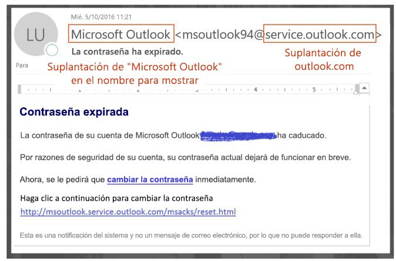

<span data-ttu-id="0f1fb-124">El mensaje anterior no proviene realmente de service.outlook.com, pero el atacante lo ha falsificado para que así parezca.</span><span class="sxs-lookup"><span data-stu-id="0f1fb-124">The above did not actually come from service.outlook.com, but instead was spoofed by the phisher to make it look like it did.</span></span> <span data-ttu-id="0f1fb-125">Intenta engañar a un usuario para que haga clic en el vínculo del mensaje.</span><span class="sxs-lookup"><span data-stu-id="0f1fb-125">It is attempting to trick a user into clicking the link within the message.</span></span>

<span data-ttu-id="0f1fb-126">En el ejemplo siguiente se está suplantando contoso.com:</span><span class="sxs-lookup"><span data-stu-id="0f1fb-126">The next example is spoofing contoso.com:</span></span>

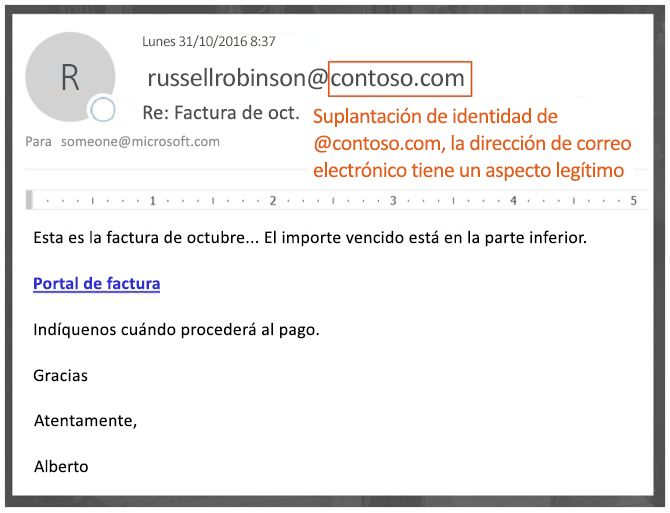

<span data-ttu-id="0f1fb-128">El mensaje parece legítimo, pero en realidad es una suplantación de identidad.</span><span class="sxs-lookup"><span data-stu-id="0f1fb-128">The message looks legitimate, but in fact is a spoof.</span></span> <span data-ttu-id="0f1fb-129">Este mensaje de suplantación de identidad es un tipo de compromiso de correo electrónico empresarial, que es una subcategoría de suplantación de identidad.</span><span class="sxs-lookup"><span data-stu-id="0f1fb-129">This phishing message is a type of Business Email Compromise which is a subcategory of phishing.</span></span>

### <a name="2-users-confuse-real-messages-for-fake-ones"></a><span data-ttu-id="0f1fb-130">2. Los usuarios confunden mensajes reales con mensajes falsificados</span><span class="sxs-lookup"><span data-stu-id="0f1fb-130">2. Users confuse real messages for fake ones</span></span>

<span data-ttu-id="0f1fb-131">En segundo lugar, los mensajes falsificados crean incertidumbre para los usuarios que conocen los mensajes de suplantación de identidad, pero no pueden diferenciar un mensaje verdadero de uno falso.</span><span class="sxs-lookup"><span data-stu-id="0f1fb-131">Second, spoofed messages create uncertainty for users who know about phishing messages but cannot tell the difference between a real message and spoofed one.</span></span> <span data-ttu-id="0f1fb-132">Por ejemplo, el siguiente es un ejemplo de un restablecimiento de contraseña real desde la dirección de correo electrónico de la cuenta de Microsoft Security:</span><span class="sxs-lookup"><span data-stu-id="0f1fb-132">For example, the following is an example of an actual password reset from the Microsoft Security account email address:</span></span>

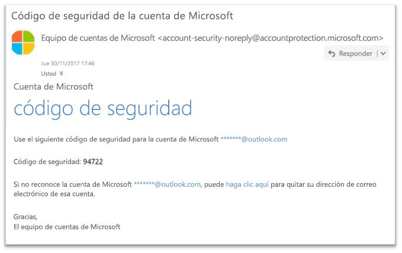

<span data-ttu-id="0f1fb-134">El mensaje anterior proviene de Microsoft, pero al mismo tiempo, los usuarios están acostumbrados a recibir mensajes de suplantación de identidad que pueden engañar a un usuario para que haga clic en un vínculo y proporcione sus credenciales, descargue malware o responda a un mensaje con contenido confidencial.</span><span class="sxs-lookup"><span data-stu-id="0f1fb-134">The above message did come from Microsoft, but at the same time, users are used to getting phishing messages that may trick a user into clicking a link and giving up their credentials, downloading malware, or replying to a message with sensitive content.</span></span> <span data-ttu-id="0f1fb-135">Como es difícil notar la diferencia entre un restablecimiento de contraseña verdadero y uno falso, muchos usuarios ignoran estos mensajes, los marcan como correo no deseado o informan innecesariamente sobre ellos a Microsoft como intentos de suplantaciones de identidad.</span><span class="sxs-lookup"><span data-stu-id="0f1fb-135">Because it is difficult to tell the difference between a real password reset and a fake one, many users ignore these messages, report them as spam, or unnecessarily report the messages back to Microsoft as missed phishing scams.</span></span>

<span data-ttu-id="0f1fb-136">Para detener la suplantación de identidad, el sector de filtrado de correo electrónico ha desarrollado protocolos de autenticación como [SPF](https://docs.microsoft.com/office365/SecurityCompliance/set-up-spf-in-office-365-to-help-prevent-spoofing), [DKIM](https://docs.microsoft.com/office365/SecurityCompliance/use-dkim-to-validate-outbound-email) y [DMARC](https://docs.microsoft.com/office365/SecurityCompliance/use-dmarc-to-validate-email).</span><span class="sxs-lookup"><span data-stu-id="0f1fb-136">To stop spoofing, the email filtering industry has developed email authentication protocols such as [SPF](https://docs.microsoft.com/office365/SecurityCompliance/set-up-spf-in-office-365-to-help-prevent-spoofing), [DKIM](https://docs.microsoft.com/office365/SecurityCompliance/use-dkim-to-validate-outbound-email), and [DMARC](https://docs.microsoft.com/office365/SecurityCompliance/use-dmarc-to-validate-email).</span></span> <span data-ttu-id="0f1fb-137">DMARC impide que la suplantación de identidad examine el remitente de un mensaje.</span><span class="sxs-lookup"><span data-stu-id="0f1fb-137">DMARC prevents spoofing from examining a message's sender.</span></span> <span data-ttu-id="0f1fb-138">Es decir, el remitente que los usuarios ven en su cliente de correo electrónico (en los ejemplos anteriores es service.outlook.com, outlook.com y accountprotection.microsoft.com).</span><span class="sxs-lookup"><span data-stu-id="0f1fb-138">That is, the sender that users see in their email client (in the examples above it is service.outlook.com, outlook.com, and accountprotection.microsoft.com).</span></span> <span data-ttu-id="0f1fb-139">Además, los usuarios también pueden ver que el dominio ha pasado SPF o DKIM, lo que significa que el dominio se ha autenticado y, por lo tanto, no está falsificado.</span><span class="sxs-lookup"><span data-stu-id="0f1fb-139">Furthermore, users can also see that the domain has passed SPF or DKIM, which means that the domain has been authenticated and is therefore not spoofed.</span></span> <span data-ttu-id="0f1fb-140">Para obtener una explicación más completa, vea la sección "*Comprender por qué la autenticación de correo electrónico no siempre es suficiente para detener la suplantación de identidad"* más adelante en este artículo.</span><span class="sxs-lookup"><span data-stu-id="0f1fb-140">For a more complete discussion, see the section "*Understanding why email authentication is not always enough to stop spoofing"*  later on in this article.</span></span>

<span data-ttu-id="0f1fb-141">Pero, el problema es que los registros de autenticación de correo electrónico son opcionales, no necesarios.</span><span class="sxs-lookup"><span data-stu-id="0f1fb-141">However, the problem is that email authentication records are optional, not required.</span></span> <span data-ttu-id="0f1fb-142">Por lo tanto, aunque los dominios con directivas de autenticación seguras como microsoft.com y skype.com están protegidos frente a la suplantación de identidad, los que utilizan directivas de autenticación más débiles o no usan ninguna directiva son objetivos para la suplantación. En marzo de 2018, sólo un 9% de los dominios de empresas en la Fortune 500 publicaron directivas de autenticación de correo electrónico seguras.</span><span class="sxs-lookup"><span data-stu-id="0f1fb-142">Therefore, while domains with strong authentication policies like microsoft.com and skype.com are protected from spoofing, domains that publish weaker authentication policies, or no policy at all, are targets for being spoofed.As of March 2018, only 9% of domains of companies in the Fortune 500 publish strong email authentication policies.</span></span> <span data-ttu-id="0f1fb-143">El 91% restante podía ser falsificado por un atacante y, a menos que el filtro de correo electrónico lo detectara con otra directiva, podía llegar a un usuario final y engañarlo:</span><span class="sxs-lookup"><span data-stu-id="0f1fb-143">The remaining 91% may be spoofed by a phisher, and unless the email filter detects it using another policy, may be delivered to an end user and deceive them:</span></span>

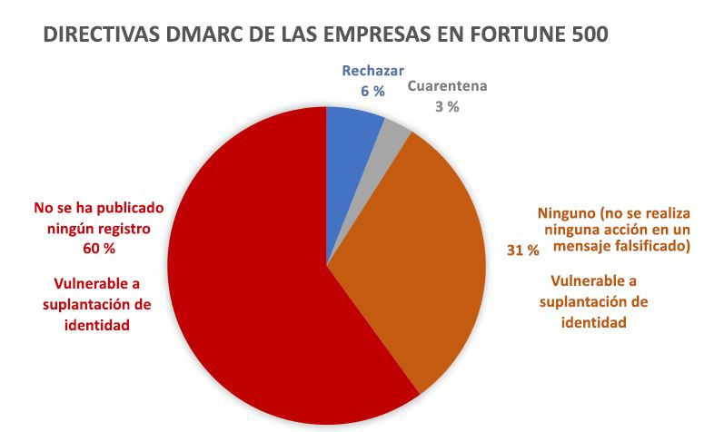

<span data-ttu-id="0f1fb-145">La proporción de pequeñas y medianas empresas que no están en la lista Fortune 500 y que publican directivas de autenticación de correo electrónico seguras es menor y es incluso más pequeña para los dominios que están fuera de Norteamérica y Europa occidental.</span><span class="sxs-lookup"><span data-stu-id="0f1fb-145">The proportion of small-to-medium sized companies that are not in the Fortune 500 that publish strong email authentication policies is smaller, and smaller still for domains that are outside of North America and western Europe.</span></span>

<span data-ttu-id="0f1fb-146">Esto es un gran problema ya que, aunque las empresas pueden no ser conscientes de cómo funciona la autenticación de correo electrónico, los suplantadores sí que la comprenden y se aprovechan de la ausencia de la misma.</span><span class="sxs-lookup"><span data-stu-id="0f1fb-146">This is a big problem because while enterprises may not be aware of how email authentication works, phishers do understand and take advantage of the lack of it.</span></span>

<span data-ttu-id="0f1fb-147">Para obtener información sobre cómo configurar SPF, DKIM y DMARC, vea la sección "*Clientes de Office 365"* más adelante en este documento.</span><span class="sxs-lookup"><span data-stu-id="0f1fb-147">For information on setting up SPF, DKIM, and DMARC, see the section "*Customers of Office 365"*  later on in this document.</span></span>

## <a name="stopping-spoofing-with-implicit-email-authentication"></a><span data-ttu-id="0f1fb-148">Detener la suplantación de identidad con la autenticación de correo electrónico implícita</span><span class="sxs-lookup"><span data-stu-id="0f1fb-148">Stopping spoofing with implicit email authentication</span></span>

<span data-ttu-id="0f1fb-149">Puesto que el phishing y el "spear phishing" (ataques de suplantación dirigidos a un objetivo específico) son un problema tan importante y debido a una adopción de directivas de autenticación de correo electrónico seguras tan limitada, Microsoft continúa invirtiendo en funciones para proteger a sus clientes.</span><span class="sxs-lookup"><span data-stu-id="0f1fb-149">Because phishing and spear phishing is such a problem, and because of the limited adoption of strong email authentication policies, Microsoft continues to invest in capabilities to protect its customers.</span></span> <span data-ttu-id="0f1fb-150">Por lo tanto, Microsoft va a seguir adelante con la *autenticación de correo electrónico implícita*: si un dominio no se autentica, Microsoft lo trata como si hubiese publicado registros de autenticación de correo electrónico y lo trata en consecuencia si produce un error de autenticación.</span><span class="sxs-lookup"><span data-stu-id="0f1fb-150">Therefore, Microsoft is moving ahead with  *implicit email authentication* - if a domain doesn't authenticate, Microsoft will treat it as if it had published email authentication records and treat it accordingly if it doesn't pass.</span></span>

<span data-ttu-id="0f1fb-151">Para ello, Microsoft ha creado muchas extensiones para la autenticación de correo electrónico normal, como la reputación del remitente, el historial de remitentes y destinatarios, el análisis de comportamiento y otras técnicas avanzadas.</span><span class="sxs-lookup"><span data-stu-id="0f1fb-151">To accomplish this, Microsoft has built numerous extensions to regular email authentication including sender reputation, sender/recipient history, behavioral analysis, and other advanced techniques.</span></span> <span data-ttu-id="0f1fb-152">Un mensaje enviado desde un dominio que no publica la autenticación de correo electrónico se marcará como suplantación de identidad a menos que contenga otras señales que indiquen que es legítimo.</span><span class="sxs-lookup"><span data-stu-id="0f1fb-152">A message sent from a domain that doesn't publish email authentication will be marked as spoof unless it contains other signals to indicate that it is legitimate.</span></span>

<span data-ttu-id="0f1fb-153">Al hacer esto, los usuarios finales pueden confiar en que los correos que les han enviado no se han falsificado, los remitentes pueden estar seguros de que nadie está suplantando su dominio y los clientes de Office 365 pueden ofrecer una protección aún mejor, como la protección de suplantación.</span><span class="sxs-lookup"><span data-stu-id="0f1fb-153">By doing this, end users can have confidence that an email sent to them has not been spoofed, senders can be confident that nobody is impersonating their domain, and customers of Office 365 can offer even better protection such as Impersonation protection.</span></span>

<span data-ttu-id="0f1fb-154">Para ver el anuncio general de Microsoft, vea [Un mar de phishing, parte 2: Protección contra la suplantación de identidad mejorada en Office 365](https://techcommunity.microsoft.com/t5/Security-Privacy-and-Compliance/Schooling-A-Sea-of-Phish-Part-2-Enhanced-Anti-spoofing/ba-p/176209).</span><span class="sxs-lookup"><span data-stu-id="0f1fb-154">To see Microsoft's general announcement, see [A Sea of Phish Part 2 - Enhanced Anti-spoofing in Office 365](https://techcommunity.microsoft.com/t5/Security-Privacy-and-Compliance/Schooling-A-Sea-of-Phish-Part-2-Enhanced-Anti-spoofing/ba-p/176209).</span></span>

## <a name="identifying-that-a-message-is-classified-as-spoofed"></a><span data-ttu-id="0f1fb-155">Identificar que un mensaje se clasifica como falsificado</span><span class="sxs-lookup"><span data-stu-id="0f1fb-155">Identifying that a message is classified as spoofed</span></span>

### <a name="composite-authentication"></a><span data-ttu-id="0f1fb-156">Autenticación compuesta</span><span class="sxs-lookup"><span data-stu-id="0f1fb-156">Composite authentication</span></span>

<span data-ttu-id="0f1fb-157">Aunque SPF, DKIM y DMARC son útiles por sí mismos, no comunican de forma suficiente el estado de autenticación en caso de que un mensaje no contenga ningún registro de autenticación explícito.</span><span class="sxs-lookup"><span data-stu-id="0f1fb-157">While SPF, DKIM, and DMARC are all useful by themselves, they don't communicate enough authentication status in the event a message has no explicit authentication records.</span></span> <span data-ttu-id="0f1fb-158">Por lo tanto, Microsoft ha desarrollado un algoritmo que combina varias señales en un único valor denominado autenticación compuesta ("compauth" para abreviar).</span><span class="sxs-lookup"><span data-stu-id="0f1fb-158">Therefore, Microsoft has developed an algorithm that combines multiple signals into a single value called Composite Authentication, or compauth for short.</span></span> <span data-ttu-id="0f1fb-159">Los clientes de Office 365 tienen valores de autenticación compuesta marcados en el encabezado *Authentication-Results* en los encabezados de mensaje.</span><span class="sxs-lookup"><span data-stu-id="0f1fb-159">Customers in Office 365 have compauth values stamped into the *Authentication-Results* header in the message headers.</span></span>

```
Authentication-Results:
  compauth=<fail|pass|softpass|none> reason=<yyy>

```

|<span data-ttu-id="0f1fb-160">**Resultado CompAuth**</span><span class="sxs-lookup"><span data-stu-id="0f1fb-160">**CompAuth result**</span></span>|<span data-ttu-id="0f1fb-161">**Descripción**</span><span class="sxs-lookup"><span data-stu-id="0f1fb-161">**Description**</span></span>|
|:-----|:-----|
|<span data-ttu-id="0f1fb-162">fail</span><span class="sxs-lookup"><span data-stu-id="0f1fb-162">fail</span></span>|<span data-ttu-id="0f1fb-163">El mensaje ha producido un error de autenticación explícita (el dominio remitente publica los registros explícitamente en el DNS) o autenticación implícita (el dominio remitente no publica los registros en el DNS, por lo que Office 365 interpola el resultado como si hubiera publicado los registros).</span><span class="sxs-lookup"><span data-stu-id="0f1fb-163">Message failed explicit authentication (sending domain published records explicitly in DNS) or implicit authentication (sending domain did not publish records in DNS, so Office 365 interpolated the result as if it had published records).</span></span>|
|<span data-ttu-id="0f1fb-164">pass</span><span class="sxs-lookup"><span data-stu-id="0f1fb-164">pass</span></span>|<span data-ttu-id="0f1fb-165">El mensaje no ha producido un error de autenticación explícita (el mensaje no ha producido un error de DMARC, o [Best Guess Passed DMARC](https://blogs.msdn.microsoft.com/tzink/2015/05/06/what-is-dmarc-bestguesspass-in-office-365)) o autenticación implícita de alta confianza (el dominio remitente no publica los registros de autenticación de correo electrónico, pero Office 365 tiene seguros señales back-end para indicar que el mensaje es probablemente legítimo).</span><span class="sxs-lookup"><span data-stu-id="0f1fb-165">Message passed explicit authentication (message passed DMARC, or [Best Guess Passed DMARC](https://blogs.msdn.microsoft.com/tzink/2015/05/06/what-is-dmarc-bestguesspass-in-office-365)) or implicit authentication with high confidence (sending domain does not publish email authentication records, but Office 365 has strong backend signals to indicate the message is likely legitimate).</span></span>|
|<span data-ttu-id="0f1fb-166">softpass</span><span class="sxs-lookup"><span data-stu-id="0f1fb-166">softpass</span></span>|<span data-ttu-id="0f1fb-167">El mensaje no ha producido un error de autenticación implícita de confianza baja o mediana (el dominio remitente no publica la autenticación de correo electrónico, pero Office 365 tiene señales back-end para indicar el mensaje es legítimo aunque la potencia de la señal es más débil).</span><span class="sxs-lookup"><span data-stu-id="0f1fb-167">Message passed implicit authentication with low-to-medium confidence (sending domain does not publish email authentication, but Office 365 has backend signals to indicate the message is legitimate but the strength of the signal is weaker).</span></span>|
|<span data-ttu-id="0f1fb-168">none</span><span class="sxs-lookup"><span data-stu-id="0f1fb-168">none</span></span>|<span data-ttu-id="0f1fb-169">El mensaje no se ha autenticado (o se ha autenticado pero no se ha alineado), pero no se aplica la autenticación compuesta debido a la reputación del remitente u otros factores.</span><span class="sxs-lookup"><span data-stu-id="0f1fb-169">Message did not authenticate (or it did authenticate but did not align), but composite authentication not applied due to sender reputation or other factors.</span></span>|

|||
|:-----|:-----|
|<span data-ttu-id="0f1fb-170">**Motivo**</span><span class="sxs-lookup"><span data-stu-id="0f1fb-170">**Reason**</span></span>|<span data-ttu-id="0f1fb-171">**Descripción**</span><span class="sxs-lookup"><span data-stu-id="0f1fb-171">**Description**</span></span>|
|<span data-ttu-id="0f1fb-172">0xx</span><span class="sxs-lookup"><span data-stu-id="0f1fb-172">0xx</span></span> |<span data-ttu-id="0f1fb-173">El mensaje ha producido un error de autenticación compuesta.</span><span class="sxs-lookup"><span data-stu-id="0f1fb-173">Message failed composite authentication.</span></span><br/><span data-ttu-id="0f1fb-174">**000** significa que el mensaje ha producido un error de DMARC con una acción de rechazo o cuarentena.</span><span class="sxs-lookup"><span data-stu-id="0f1fb-174">**000** means the message failed DMARC with an action of reject or quarantine.</span></span>  <br/><span data-ttu-id="0f1fb-175">**001** significa que el mensaje ha producido un error de autenticación de correo electrónico implícita.</span><span class="sxs-lookup"><span data-stu-id="0f1fb-175">**001** means the message failed implicit email authentication.</span></span> <span data-ttu-id="0f1fb-176">Esto significa que el dominio remitente no ha publicado registros de autenticación de correo electrónico o, si los ha publicado, tenían una directiva de error más débil (errores recuperables de SPF o neutrales, directiva DMARC p=none).</span><span class="sxs-lookup"><span data-stu-id="0f1fb-176">This means that the sending domain did not have email authentication records published, or if they did, they had a weaker failure policy (SPF soft fail or neutral, DMARC policy of p=none).</span></span>  <br/><span data-ttu-id="0f1fb-177">**002** significa que la organización tiene una directiva para el par de remitente y dominio que prohíbe explícitamente el envío de correos electrónicos falsificados. Esta configuración la establece manualmente un administrador.</span><span class="sxs-lookup"><span data-stu-id="0f1fb-177">**002** means the organization has a policy for the sender/domain pair that is explicitly prohibited from sending spoofed email, this setting is manually set by an administrator.</span></span>  <br/><span data-ttu-id="0f1fb-178">**010** significa que el mensaje ha producido un error de DMARC con una acción de rechazo o cuarentena y el dominio es uno de los dominios aceptados de su organización (esto es parte de la suplantación de identidad interna o dentro de la organización).</span><span class="sxs-lookup"><span data-stu-id="0f1fb-178">**010** means the message failed DMARC with an action of reject or quarantine, and the sending domain is one of your organization's accepted-domains (this is part of self-to-self, or intra-org, spoofing).</span></span>|
|<span data-ttu-id="0f1fb-179">1xx, 2xx, 3xx, 4xx y 5xx</span><span class="sxs-lookup"><span data-stu-id="0f1fb-179">1xx, 2xx, 3xx, 4xx, and 5xx</span></span>|<span data-ttu-id="0f1fb-180">Corresponde a varios códigos internos de por qué un mensaje no ha producido un error de autenticación implícita o no tenía ninguna autenticación, pero no se ha aplicado ninguna acción.</span><span class="sxs-lookup"><span data-stu-id="0f1fb-180">Correspond to various internal codes for why a message passed implicit authentication, or had no authentication but no action was applied.</span></span>|
|<span data-ttu-id="0f1fb-181">6xx</span><span class="sxs-lookup"><span data-stu-id="0f1fb-181">6xx</span></span>|<span data-ttu-id="0f1fb-182">Significa que el mensaje ha producido un error de autenticación de correo electrónico implícita y el dominio es uno de los dominios aceptados de su organización (esto es parte de la suplantación de identidad interna o dentro de la organización).</span><span class="sxs-lookup"><span data-stu-id="0f1fb-182">Means the message failed implicit email authentication, and the sending domain is one of your organization's accepted domains (this is part of self-to-self, or intra-org, spoofing).</span></span>|

<span data-ttu-id="0f1fb-183">Consultando los encabezados de un mensaje, un administrador o incluso un usuario final puede determinar cómo Office 365 llega a la conclusión de que el remitente puede estar falsificado.</span><span class="sxs-lookup"><span data-stu-id="0f1fb-183">By looking at the headers of a message, an administrator or even an end user can determine how Office 365 arrives at the conclusion that the sender may be spoofed.</span></span>

### <a name="differentiating-between-different-types-of-spoofing"></a><span data-ttu-id="0f1fb-184">Diferenciar entre los distintos tipos de suplantación de identidad</span><span class="sxs-lookup"><span data-stu-id="0f1fb-184">Differentiating between different types of spoofing</span></span>

<span data-ttu-id="0f1fb-185">Microsoft distingue entre dos tipos de mensajes de suplantación de identidad:</span><span class="sxs-lookup"><span data-stu-id="0f1fb-185">Microsoft differentiates between two different types of spoofing messages:</span></span>

 <span data-ttu-id="0f1fb-186">**Suplantación de identidad dentro de la organización**</span><span class="sxs-lookup"><span data-stu-id="0f1fb-186">**Intra-org spoofing**</span></span>

<span data-ttu-id="0f1fb-187">También conocido como suplantación de identidad automática, esto sucede cuando el dominio de la dirección de: es el mismo o se alinea con el dominio del destinatario (cuando el dominio del destinatario es uno de los [dominios aceptados de su organización](https://docs.microsoft.com/exchange/mail-flow-best-practices/manage-accepted-domains/manage-accepted-domains)); o bien, cuando el dominio de la dirección de: forma parte de la misma organización.</span><span class="sxs-lookup"><span data-stu-id="0f1fb-187">Also known as self-to-self spoofing, this occurs when the domain in the From: address is the same as, or aligns with, the recipient domain (when recipient domain is one of your organization's [accepted domains](https://docs.microsoft.com/exchange/mail-flow-best-practices/manage-accepted-domains/manage-accepted-domains)); or, when the domain in the From: address is part of the same organization.</span></span>

<span data-ttu-id="0f1fb-188">Por ejemplo, los siguientes tienen remitente y destinatario desde el mismo dominio (contoso.com).</span><span class="sxs-lookup"><span data-stu-id="0f1fb-188">For example, the following has sender and recipient from the same domain (contoso.com).</span></span> <span data-ttu-id="0f1fb-189">Se insertan espacios en la dirección de correo electrónico para evitar la recopilación de los spambot en esta página):</span><span class="sxs-lookup"><span data-stu-id="0f1fb-189">Spaces are inserted into the email address to prevent spambot harvesting on this page):</span></span>

<span data-ttu-id="0f1fb-190">De: remitente @ contoso.com</span><span class="sxs-lookup"><span data-stu-id="0f1fb-190">From: sender @ contoso.com</span></span>

<span data-ttu-id="0f1fb-191">Para: destinatario @ contoso.com</span><span class="sxs-lookup"><span data-stu-id="0f1fb-191">To: recipient @ contoso.com</span></span>

<span data-ttu-id="0f1fb-192">Los siguientes tienen los dominios de remitente y destinatario que se alinean con el dominio de la organización (fabrikam.com):</span><span class="sxs-lookup"><span data-stu-id="0f1fb-192">The following has the sender and recipient domains aligning with the organizational domain (fabrikam.com):</span></span>

<span data-ttu-id="0f1fb-193">De: remitente @ foo.fabrikam.com</span><span class="sxs-lookup"><span data-stu-id="0f1fb-193">From: sender @ foo.fabrikam.com</span></span>

<span data-ttu-id="0f1fb-194">Para: destinatario @ bar.fabrikam.com</span><span class="sxs-lookup"><span data-stu-id="0f1fb-194">To: recipient @ bar.fabrikam.com</span></span>

<span data-ttu-id="0f1fb-195">Los dominios de remitente y destinatario siguientes son diferentes (microsoft.com y bing.com), pero pertenecen a la misma organización (es decir, ambos son parte de los dominios aceptados de la organización):</span><span class="sxs-lookup"><span data-stu-id="0f1fb-195">The following sender and recipient domains are different (microsoft.com and bing.com), but they belong to the same organization (that is, both are part of the organization's Accepted Domains):</span></span>

<span data-ttu-id="0f1fb-196">De: remitente @ microsoft.com</span><span class="sxs-lookup"><span data-stu-id="0f1fb-196">From: sender @ microsoft.com</span></span>

<span data-ttu-id="0f1fb-197">Para: destinatario @ bing.com</span><span class="sxs-lookup"><span data-stu-id="0f1fb-197">To: recipient @ bing.com</span></span>

<span data-ttu-id="0f1fb-198">Los mensajes que producen un error de suplantación de identidad dentro de la organización contienen los siguientes valores en los encabezados:</span><span class="sxs-lookup"><span data-stu-id="0f1fb-198">Messages that fail intra-org spoofing contain the following values in the headers:</span></span>

<span data-ttu-id="0f1fb-199">X-Forefront-Antispam-Report: ...CAT:SPM/HSPM/PHSH;...SFTY:9.11</span><span class="sxs-lookup"><span data-stu-id="0f1fb-199">X-Forefront-Antispam-Report: ...CAT:SPM/HSPM/PHSH;...SFTY:9.11</span></span>

<span data-ttu-id="0f1fb-200">CAT es la categoría del mensaje y normalmente se marca como SPM (spam), pero en ocasiones pueden ser HSPM (spam de alta confianza) o PHISH (phishing), dependiendo de qué otros tipos de patrones aparecen en el mensaje.</span><span class="sxs-lookup"><span data-stu-id="0f1fb-200">The CAT is the category of the message, and it is normally stamped as SPM (spam), but occasionally may be HSPM (high confidence spam) or PHISH (phishing) depending upon what other types of patterns occur in the message.</span></span>

<span data-ttu-id="0f1fb-201">El SFTY es el nivel de seguridad del mensaje, el primer dígito (9) del mensaje significa que el mensaje es phishing y el segundo conjunto de dígitos después del punto (11) significa que es una suplantación de identidad dentro de la organización.</span><span class="sxs-lookup"><span data-stu-id="0f1fb-201">The SFTY is the safety level of the message, the first digit (9) means the message is phishing, and second set of digits after the dot (11) means it is intra-org spoofing.</span></span>

<span data-ttu-id="0f1fb-202">No hay ningún código de motivo de autenticación compuesta para la suplantación dentro de la organización que se marcará más adelante en 2018 (escala de tiempo aún por definir).</span><span class="sxs-lookup"><span data-stu-id="0f1fb-202">There is no specific reason code for Composite Authentication for intra-org spoofing, that will be stamped later in 2018 (timeline not yet defined).</span></span>

 <span data-ttu-id="0f1fb-203">**Suplantación de identidad entre dominios**</span><span class="sxs-lookup"><span data-stu-id="0f1fb-203">**Cross-domain spoofing**</span></span>

<span data-ttu-id="0f1fb-204">Esto ocurre cuando el dominio remitente de la dirección en De: es un dominio externo a la organización receptora.</span><span class="sxs-lookup"><span data-stu-id="0f1fb-204">This occurs when the sending domain in the From: address is an external domain to the receiving organization.</span></span> <span data-ttu-id="0f1fb-205">Los mensajes que producen un error de autenticación compuesta debido a la suplantación de identidad entre dominios contienen los valores siguientes en los encabezados:</span><span class="sxs-lookup"><span data-stu-id="0f1fb-205">Messages that fail Composite Authentication due to cross-domain spoofing contain the following values in the headers:</span></span>

<span data-ttu-id="0f1fb-206">Authentication-Results: ...</span><span class="sxs-lookup"><span data-stu-id="0f1fb-206">Authentication-Results: …</span></span> <span data-ttu-id="0f1fb-207">compauth=fail reason=000/001</span><span class="sxs-lookup"><span data-stu-id="0f1fb-207">compauth=fail reason=000/001</span></span>

<span data-ttu-id="0f1fb-208">X-Forefront-Antispam-Report: ...CAT:SPOOF;...SFTY:9.22</span><span class="sxs-lookup"><span data-stu-id="0f1fb-208">X-Forefront-Antispam-Report: ...CAT:SPOOF;...SFTY:9.22</span></span>

<span data-ttu-id="0f1fb-209">En ambos casos, se marca la siguiente sugerencia de seguridad roja en el mensaje o un equivalente personalizado para el idioma del buzón del destinatario:</span><span class="sxs-lookup"><span data-stu-id="0f1fb-209">In both cases, the following red safety tip is stamped in the message, or an equivalent that is customized to the recipient mailbox's language:</span></span>

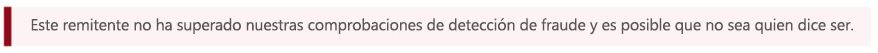

<span data-ttu-id="0f1fb-211">Puede diferenciar entre suplantación de identidad dentro de la organización y entre dominios solo consultando la dirección en De: y sabiendo cuál es el correo electrónico del destinatario o examinando los encabezados de correo electrónico.</span><span class="sxs-lookup"><span data-stu-id="0f1fb-211">It's only by looking at the From: address and knowing what your recipient email is, or by inspecting the email headers, that you can differentiate between intra-org and cross-domain spoofing.</span></span>

## <a name="how-customers-of-office-365-can-prepare-themselves-for-the-new-anti-spoofing-protection"></a><span data-ttu-id="0f1fb-212">Cómo los clientes de Office 365 pueden prepararse para la nueva protección contra la suplantación </span><span class="sxs-lookup"><span data-stu-id="0f1fb-212">How customers of Office 365 can prepare themselves for the new anti-spoofing protection</span></span>

### <a name="information-for-administrators"></a><span data-ttu-id="0f1fb-213">Información para administradores</span><span class="sxs-lookup"><span data-stu-id="0f1fb-213">Information for administrators</span></span>

<span data-ttu-id="0f1fb-214">Como administrador de una organización en Office 365, hay varios detalles clave que debería considerar.</span><span class="sxs-lookup"><span data-stu-id="0f1fb-214">As an administrator of an organization in Office 365, there are several key pieces of information you should be aware of.</span></span>

### <a name="understanding-why-email-authentication-is-not-always-enough-to-stop-spoofing"></a><span data-ttu-id="0f1fb-215">Comprender por qué la autenticación de correo electrónico no siempre es suficiente para detener la suplantación de identidad</span><span class="sxs-lookup"><span data-stu-id="0f1fb-215">Understanding why email authentication is not always enough to stop spoofing</span></span>

<span data-ttu-id="0f1fb-216">La nueva protección contra la suplantación se basa en la autenticación de correo electrónico (SPF, DKIM y DMARC) para que un mensaje no se marque como la suplantación de identidad.</span><span class="sxs-lookup"><span data-stu-id="0f1fb-216">The new anti-spoofing protection relies on email authentication (SPF, DKIM, and DMARC) to not mark a message as spoofing.</span></span> <span data-ttu-id="0f1fb-217">Un ejemplo común es cuando un dominio remitente nunca ha publicado registros SPF.</span><span class="sxs-lookup"><span data-stu-id="0f1fb-217">A common example is when a sending domain has never published SPF records.</span></span> <span data-ttu-id="0f1fb-218">Si no hay ningún registro SPF o no están configurados correctamente, se marcará un mensaje enviado como falsificado a menos que Microsoft tiene inteligencia back-end que indique que el mensaje es legítimo.</span><span class="sxs-lookup"><span data-stu-id="0f1fb-218">If there are no SPF records or they are incorrectly set up, a sent message will be marked as spoofed unless Microsoft has back-end intelligence that says the message is legitimate.</span></span>

<span data-ttu-id="0f1fb-219">Por ejemplo, antes de la implementación de la protección contra la suplantación, un mensaje podía aparecer sin registros SPF, DKIM y DMARC como el siguiente:</span><span class="sxs-lookup"><span data-stu-id="0f1fb-219">For example, prior to anti-spoofing being deployed, a message may have looked like the following with no SPF record, no DKIM record, and no DMARC record:</span></span>

```
Authentication-Results: spf=none (sender IP is 1.2.3.4)
  smtp.mailfrom=example.com; contoso.com; dkim=none
  (message not signed) header.d=none; contoso.com; dmarc=none
  action=none header.from=example.com;
From: sender @ example.com
To: receiver @ contoso.com
```
<span data-ttu-id="0f1fb-220">Después de la implementación, si tiene Office 365 Enterprise E5, EOP o ATP, se marca el valor compauth:</span><span class="sxs-lookup"><span data-stu-id="0f1fb-220">After anti-spoofing, if you have Office 365 Enterprise E5, EOP, or ATP, the compauth value is stamped:</span></span>

```
Authentication-Results: spf=none (sender IP is 1.2.3.4)
  smtp.mailfrom=example.com; contoso.com; dkim=none
  (message not signed) header.d=none; contoso.com; dmarc=none
  action=none header.from=example.com; compauth=fail reason=001
From: sender @ example.com
To: receiver @ contoso.com

```

<span data-ttu-id="0f1fb-221">Si ejemplo.com lo corrigió al configurar un registro SPF, pero no un registro DKIM, esto no produciría un error de autenticación compuesta porque el dominio de la dirección en De: se alinea con el dominio que no ha producido un error de SPF:</span><span class="sxs-lookup"><span data-stu-id="0f1fb-221">If example.com fixed this by setting up an SPF record but not a DKIM record, this would pass composite authentication because the domain that passed SPF aligned with the domain in the From: address:</span></span>

```
Authentication-Results: spf=pass (sender IP is 1.2.3.4)
  smtp.mailfrom=example.com; contoso.com; dkim=none
  (message not signed) header.d=none; contoso.com; dmarc=bestguesspass
  action=none header.from=example.com; compauth=pass reason=109
From: sender @ example.com
To: receiver @ contoso.com
```

<span data-ttu-id="0f1fb-222">O bien, si se configuró un registro DKIM, pero no un registro SPF, esto tampoco produciría un error de autenticación compuesta porque el dominio de la dirección en De: se alinea con el dominio de la firma de DKIM que no ha producido el error:</span><span class="sxs-lookup"><span data-stu-id="0f1fb-222">Or, if they set up a DKIM record but not an SPF record, this would also pass composite authentication because the domain in the DKIM-Signature that passed aligned with the domain in the From: address:</span></span>

```
Authentication-Results: spf=none (sender IP is 1.2.3.4)
  smtp.mailfrom=example.com; contoso.com; dkim=pass
  (signature was verified) header.d=outbound.example.com;
  contoso.com; dmarc=bestguesspass action=none
  header.from=example.com; compauth=pass reason=109
From: sender @ example.com
To: receiver @ contoso.com
```

<span data-ttu-id="0f1fb-223">Pero, un atacante también puede configurar SPF o DKIM y firmar el mensaje con su propio dominio y especificar un dominio de la dirección en De: diferente.</span><span class="sxs-lookup"><span data-stu-id="0f1fb-223">However, a phisher may also set up SPF and DKIM and sign the message with their own domain, but specify a different domain in the From: address.</span></span> <span data-ttu-id="0f1fb-224">SPF y DKIM no requieren que el dominio se alinee con el dominio de la dirección De:, por ello, a menos que ejemplo.com haya publicado registros DMARC, este no se marcará como una suplantación de identidad mediante DMARC:</span><span class="sxs-lookup"><span data-stu-id="0f1fb-224">Neither SPF nor DKIM requires the domain to align with the domain in the From: address, so unless example.com published DMARC records, this would not be marked as a spoof using DMARC:</span></span>

```
Authentication-Results: spf=pass (sender IP is 5.6.7.8)
  smtp.mailfrom=maliciousDomain.com; contoso.com; dkim=pass
  (signature was verified) header.d=maliciousDomain.com;
  contoso.com; dmarc=none action=none header.from=example.com;
From: sender @ example.com
To: receiver @ contoso.com
```

<span data-ttu-id="0f1fb-225">En el cliente de correo electrónico (Outlook, Outlook en la Web o cualquier otro cliente de correo electrónico), se muestra solo el dominio en De:, sin el dominio en SPF o DKIM. Esto puede confundir al usuario y hacerle pensar que el mensaje proviene de ejemplo.com, pero realmente procede de dominioMalintencionado.com.</span><span class="sxs-lookup"><span data-stu-id="0f1fb-225">In the email client (Outlook, Outlook on the web, or any other email client), only the From: domain is displayed, not the domain in the SPF or DKIM, and that can mislead the user into thinking the message came from example.com, but actually came from maliciousDomain.com.</span></span>

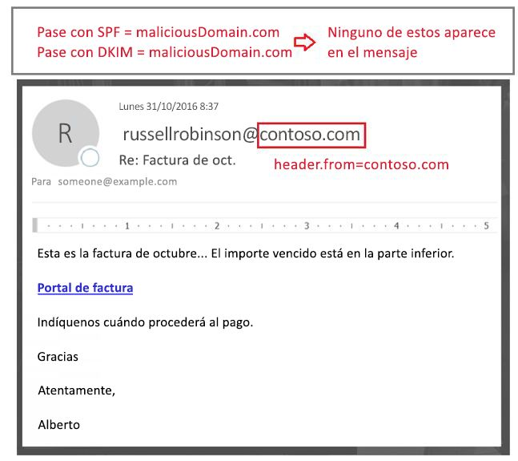

<span data-ttu-id="0f1fb-227">Por ello, Office 365 requiere que el dominio de la dirección en De: se alinee con el dominio en la firma SPF o DKIM y si no, que contenga otras señales internas que indican que el mensaje es legítimo.</span><span class="sxs-lookup"><span data-stu-id="0f1fb-227">For that reason, Office 365 requires that the domain in the From: address aligns with the domain in the SPF or DKIM signature, and if it doesn't, contains some other internal signals that indicates that the message is legitimate.</span></span> <span data-ttu-id="0f1fb-228">En caso contrario, el mensaje es un error compauth.</span><span class="sxs-lookup"><span data-stu-id="0f1fb-228">Otherwise, the message would be a compauth fail.</span></span>

```
Authentication-Results: spf=none (sender IP is 5.6.7.8)
  smtp.mailfrom=maliciousDomain.com; contoso.com; dkim=pass
  (signature was verified) header.d=maliciousDomain.com;
  contoso.com; dmarc=none action=none header.from=contoso.com;
  compauth=fail reason=001
From: sender@contoso.com
To: someone@example.com
```

<span data-ttu-id="0f1fb-229">Por ello, la directiva contra la suplantación de Office 365 protege de los dominios sin autenticación y de los que configuran la autenticación, pero que no coinciden con el dominio de la dirección en De:, ya que este es el que el usuario ve y cree que es el remitente del mensaje.</span><span class="sxs-lookup"><span data-stu-id="0f1fb-229">Thus, Office 365 anti-spoofing protects against domains with no authentication, and against domains who set up authentication but mismatch against the domain in the From: address as that is the one that the user sees and believes is the sender of the message.</span></span> <span data-ttu-id="0f1fb-230">Esto es cierto tanto para los dominios externos a su organización, como para los dominios dentro de su organización.</span><span class="sxs-lookup"><span data-stu-id="0f1fb-230">This is true both of domains external to your organization, as well as domains within your organization.</span></span>

<span data-ttu-id="0f1fb-231">Por ello, si recibe un mensaje que produjo un error de autenticación compuesta y se marcó como falsificado, aunque el mensaje nunca ha producido un error SPF y DKIM, es porque el dominio de la dirección en De: no se alinea con el dominio que no ha producido el error SPF y DKIM.</span><span class="sxs-lookup"><span data-stu-id="0f1fb-231">Therefore, if you ever receive a message that failed composite authentication and is marked as spoofed, even though the message passed SPF and DKIM, it's because the domain that passed SPF and DKIM are not aligned with the domain in the From: address.</span></span>

### <a name="understanding-changes-in-how-spoofed-emails-are-treated"></a><span data-ttu-id="0f1fb-232">Comprender los cambios de cómo se tratan los correos electrónicos falsificados</span><span class="sxs-lookup"><span data-stu-id="0f1fb-232">Understanding changes in how spoofed emails are treated</span></span>

<span data-ttu-id="0f1fb-233">Actualmente, en todas las organizaciones de Office 365, se marcan como correo no deseado los mensajes ATP y sin ATP que producen un error DMARC con una directiva de rechazo o cuarentena y se suelen tomar medidas de correo no deseado de alta confianza y, a veces, medidas de correo no deseado normal (dependiendo de si otra regla de correo no deseado primero lo identifica como tal).</span><span class="sxs-lookup"><span data-stu-id="0f1fb-233">Currently, for all organizations in Office 365 - ATP and non-ATP - messages that fail DMARC with a policy of reject or quarantine are marked as spam and usually take the high confidence spam action, or sometimes the regular spam action (depending on whether other spam rules first identify it as spam).</span></span> <span data-ttu-id="0f1fb-234">Las detecciones de suplantación de identidad dentro de la organización toman medidas de spam normal.</span><span class="sxs-lookup"><span data-stu-id="0f1fb-234">Intra-org spoof detections take the regular spam action.</span></span> <span data-ttu-id="0f1fb-235">No debe habilitarse este comportamiento y tampoco puede deshabilitarse.</span><span class="sxs-lookup"><span data-stu-id="0f1fb-235">This behavior does not need to be enabled, nor can it be disabled.</span></span>

<span data-ttu-id="0f1fb-236">Pero, para los mensajes de suplantación entre dominios, antes de este cambio pasaban por comprobaciones normales de spam, phishing y malware y, si otras partes del filtro los identificaban como sospechosos, se marcaban como spam, phishing o malware respectivamente.</span><span class="sxs-lookup"><span data-stu-id="0f1fb-236">However, for cross-domain spoofing messages, before this change they would go through regular spam, phish, and malware checks and if other parts of the filter identified them as suspicious, would mark them as spam, phish, or malware respectively.</span></span> <span data-ttu-id="0f1fb-237">Con la nueva protección contra la suplantación entre dominios, para los mensajes que no se pueden autenticar, de forma predeterminada, se tomarán las medidas definidas en Protección contra suplantación de identidad \> Directiva contra la suplantación.</span><span class="sxs-lookup"><span data-stu-id="0f1fb-237">With the new cross-domain spoofing protection, any message that can't be authenticated will, by default, take the action defined in the Anti-phishing \> Anti-spoofing policy.</span></span> <span data-ttu-id="0f1fb-238">Si uno no se define, se moverá a una carpeta de correo no deseado de los usuarios.</span><span class="sxs-lookup"><span data-stu-id="0f1fb-238">If one is not defined, it will be moved to a users Junk Email folder.</span></span> <span data-ttu-id="0f1fb-239">En algunos casos, a los mensajes sospechosos también se les agregará la sugerencia de seguridad roja.</span><span class="sxs-lookup"><span data-stu-id="0f1fb-239">In some cases, more suspicious messages will also have the red safety tip added to the message.</span></span>

<span data-ttu-id="0f1fb-240">Por ello, algunos mensajes marcados previamente como spam siguen marcados, pero ahora también tendrá una sugerencia de seguridad roja; en otros casos, los mensajes marcados previamente como correo deseado se marcarán como spam (CAT:SPOOF) y se les agregará una sugerencia de seguridad roja.</span><span class="sxs-lookup"><span data-stu-id="0f1fb-240">This may result in some messages that were previously marked as spam still getting marked as spam but will now also have a red safety tip; in other cases, messages that were previously marked as non-spam will start getting marked as spam (CAT:SPOOF) with a red safety tip added.</span></span> <span data-ttu-id="0f1fb-241">En otros casos, los clientes que solían mover todos los spam y phishing a la cuarentena, ahora los encontrará en la carpeta de correo no deseado (para cambiar este comportamiento, vea [Cambiar la configuración contra la suplantación](#changing-your-anti-spoofing-settings)).</span><span class="sxs-lookup"><span data-stu-id="0f1fb-241">In still other cases, customers that were moving all spam and phish to the quarantine would now see them going to the Junk Mail Folder (this behavior can be changed, see [Changing your anti-spoofing settings](#changing-your-anti-spoofing-settings)).</span></span>

<span data-ttu-id="0f1fb-242">Hay varias maneras para suplantar un mensaje (vea [Diferenciar entre los distintos tipos de suplantación de identidad](#differentiating-between-different-types-of-spoofing) anteriormente en este artículo), pero hasta marzo de 2018, la forma en que Office 365 los trata aún no se ha unificado.</span><span class="sxs-lookup"><span data-stu-id="0f1fb-242">There are multiple different ways a message can be spoofed (see  [Differentiating between different types of spoofing](#differentiating-between-different-types-of-spoofing) earlier in this article) but as of March 2018 the way Office 365 treats these messages is not yet unified.</span></span> <span data-ttu-id="0f1fb-243">En la tabla siguiente hay un resumen rápido en el que la protección de suplantación entre dominios muestra el comportamiento nuevo:</span><span class="sxs-lookup"><span data-stu-id="0f1fb-243">The following table is a quick summary, with Cross-domain spoofing protection being new behavior:</span></span>

|<span data-ttu-id="0f1fb-244">**Tipo de suplantación de identidad**</span><span class="sxs-lookup"><span data-stu-id="0f1fb-244">**Type of spoof**</span></span>|<span data-ttu-id="0f1fb-245">**Categoría**</span><span class="sxs-lookup"><span data-stu-id="0f1fb-245">**Category**</span></span>|<span data-ttu-id="0f1fb-246">**¿Se ha agregado la sugerencia de seguridad?**</span><span class="sxs-lookup"><span data-stu-id="0f1fb-246">**Safety tip added?**</span></span>|<span data-ttu-id="0f1fb-247">**Se aplica a**</span><span class="sxs-lookup"><span data-stu-id="0f1fb-247">**Applies to**</span></span>|
|:-----|:-----|:-----|:-----|
|<span data-ttu-id="0f1fb-248">Error DMARC (cuarentena o rechazo)</span><span class="sxs-lookup"><span data-stu-id="0f1fb-248">DMARC fail (quarantine or reject)</span></span>|<span data-ttu-id="0f1fb-249">HSPM (predeterminado), también puede ser SPM o PHSH</span><span class="sxs-lookup"><span data-stu-id="0f1fb-249">HSPM (default), may also be SPM or PHSH</span></span>|<span data-ttu-id="0f1fb-250">No (todavía no)</span><span class="sxs-lookup"><span data-stu-id="0f1fb-250">No (not yet)</span></span>|<span data-ttu-id="0f1fb-251">Todos los clientes de Office 365, Outlook.com</span><span class="sxs-lookup"><span data-stu-id="0f1fb-251">All Office 365 customers, Outlook.com</span></span>|
|<span data-ttu-id="0f1fb-252">Interno</span><span class="sxs-lookup"><span data-stu-id="0f1fb-252">Self-to-self</span></span>|<span data-ttu-id="0f1fb-253">SPM</span><span class="sxs-lookup"><span data-stu-id="0f1fb-253">SPM</span></span>|<span data-ttu-id="0f1fb-254">Sí</span><span class="sxs-lookup"><span data-stu-id="0f1fb-254">Yes</span></span>|<span data-ttu-id="0f1fb-255">Todas las organizaciones de Office 365, Outlook.com</span><span class="sxs-lookup"><span data-stu-id="0f1fb-255">All Office 365 organizations, Outlook.com</span></span>|
|<span data-ttu-id="0f1fb-256">Entre dominios</span><span class="sxs-lookup"><span data-stu-id="0f1fb-256">Cross-domain</span></span>|<span data-ttu-id="0f1fb-257">SPOOF</span><span class="sxs-lookup"><span data-stu-id="0f1fb-257">SPOOF</span></span>|<span data-ttu-id="0f1fb-258">Sí</span><span class="sxs-lookup"><span data-stu-id="0f1fb-258">Yes</span></span>|<span data-ttu-id="0f1fb-259">Clientes de la Protección contra amenazas avanzada de Office 365 y E5 de</span><span class="sxs-lookup"><span data-stu-id="0f1fb-259">Office 365 Advanced Threat Protection and E5 customers</span></span>|

### <a name="changing-your-anti-spoofing-settings"></a><span data-ttu-id="0f1fb-260">Cambiar la configuración contra la suplantación</span><span class="sxs-lookup"><span data-stu-id="0f1fb-260">Changing your anti-spoofing settings</span></span>

<span data-ttu-id="0f1fb-261">Para crear o actualizar la configuración de directiva de suplantación (entre dominios), vaya a Protección contra suplantación de identidad \> Configuración contra la suplantación en la pestaña Administración de amenazas \> Directiva en el Centro de seguridad &amp; cumplimiento.</span><span class="sxs-lookup"><span data-stu-id="0f1fb-261">To create or update your (cross-domain) anti-spoofing settings, navigate to the Anti-phishing \> Anti-spoofing settings under the Threat Management \> Policy tab in the Security &amp; Compliance Center.</span></span> <span data-ttu-id="0f1fb-262">Si no ha creado ninguna configuración contra suplantación de identidad, debe crearla:</span><span class="sxs-lookup"><span data-stu-id="0f1fb-262">If you have never created any anti-phishing settings, you will need to create one:</span></span>

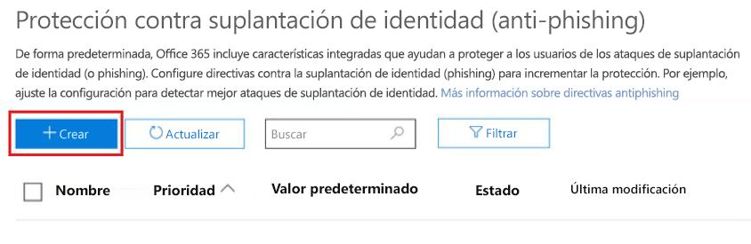

<span data-ttu-id="0f1fb-264">Si ya la ha creado, puede seleccionarla para modificarla:</span><span class="sxs-lookup"><span data-stu-id="0f1fb-264">If you've already created one, you can select it to modify it:</span></span>

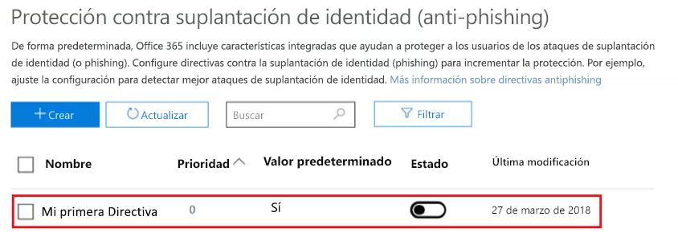

<span data-ttu-id="0f1fb-266">Seleccione la directiva que acaba de crear y siga los pasos, como se describe en [Obtener más información sobre la inteligencia de suplantación de identidad](learn-about-spoof-intelligence.md).</span><span class="sxs-lookup"><span data-stu-id="0f1fb-266">Select the policy you just created and proceed through the steps as described in [Learn more about spoof intelligence](learn-about-spoof-intelligence.md).</span></span>

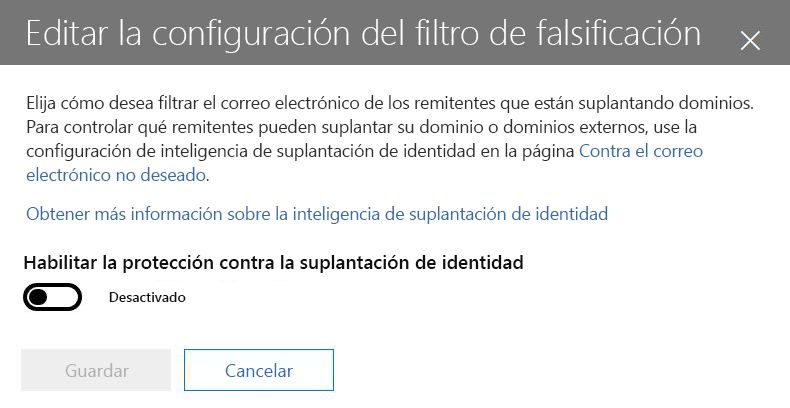

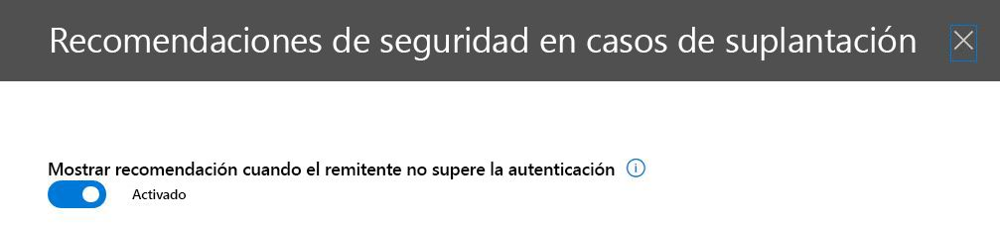

<span data-ttu-id="0f1fb-269">Para crear una nueva directiva con PowerShell:</span><span class="sxs-lookup"><span data-stu-id="0f1fb-269">To create a new policy by using PowerShell:</span></span>

```powershell
$org = Get-OrganizationConfig
$name = "My first anti-phishing policy for " + $org.Name
# Note: The name should not exclude 64 characters, including spaces.
# If it does, you will need to pick a smaller name.
# Next, create a new anti-phishing policy with the default values
New-AntiphishPolicy -Name $Name
# Select the domains to scope it to
# Multiple domains are specified in a comma-separated list
$domains = "domain1.com, domain2.com, domain3.com"
# Next, create the anti-phishing rule, scope it to the anti-phishing rule
New-AntiphishRule -Name $name -AntiphishPolicy $name -RecipientDomainIs $domains
```

<span data-ttu-id="0f1fb-270">Puede modificar los parámetros de la directiva contra suplantación de identidad con PowerShell, según la documentación en [Set-AntiphishPolicy](https://docs.microsoft.com/powershell/module/exchange/advanced-threat-protection/Set-AntiPhishPolicy).</span><span class="sxs-lookup"><span data-stu-id="0f1fb-270">You may then modify the anti-phishing policy parameters using PowerShell, following the documentation at [Set-AntiphishPolicy](https://docs.microsoft.com/powershell/module/exchange/advanced-threat-protection/Set-AntiPhishPolicy).</span></span> <span data-ttu-id="0f1fb-271">Puede especificar el $name como parámetro:</span><span class="sxs-lookup"><span data-stu-id="0f1fb-271">You may specify the $name as a parameter:</span></span>

```powershell
Set-AntiphishPolicy -Identity $name <fill in rest of parameters>
```

<span data-ttu-id="0f1fb-272">Más adelante en 2018, en lugar de tener que crear una directiva de forma predeterminada, se creará una que tenga como ámbito todos los destinatarios de la organización para que no tenga que especificarlos manualmente (las capturas de pantalla siguientes están sujetas a cambios antes de la implementación final).</span><span class="sxs-lookup"><span data-stu-id="0f1fb-272">Later in 2018, rather than you having to create a default policy, one will be created for you that is scoped to all the recipients in your organization so you don't have to specify it manually (the screenshots below are subject to change before the final implementation).</span></span>

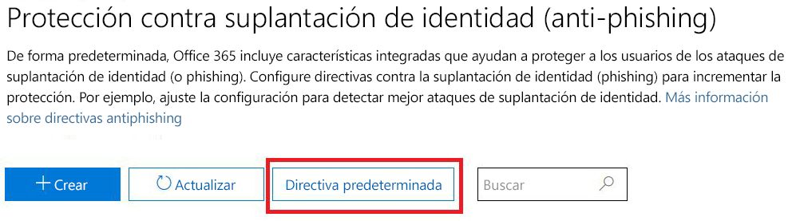

<span data-ttu-id="0f1fb-274">A diferencia de una directiva que cree, no puede eliminar la directiva predeterminada, modificar su prioridad o elegir el ámbito de usuarios, dominios o grupos con los que usarla.</span><span class="sxs-lookup"><span data-stu-id="0f1fb-274">Unlike a policy that you create, you cannot delete the default policy, modify its priority, or choose which users, domains, or groups to scope it to.</span></span>


<span data-ttu-id="0f1fb-276">Configurar la protección predeterminada mediante PowerShell:</span><span class="sxs-lookup"><span data-stu-id="0f1fb-276">To set up your default protection by using PowerShell:</span></span>

```powershell
$defaultAntiphishPolicy = Get-AntiphishPolicy | ? {$_.IsDefault -eq $true}
Set-AntiphishPolicy -Identity $defaultAntiphishPolicy.Name -EnableAntispoofEnforcement <$true|$false>
```

<span data-ttu-id="0f1fb-277">Sólo debe deshabilitar la protección contra la suplantación si tiene otro servidor o servidores de correo frente a Office 365 (vea Escenarios legítimos para deshabilitar la protección contra la suplantación de identidad para obtener más información).</span><span class="sxs-lookup"><span data-stu-id="0f1fb-277">You should only disable anti-spoofing protection if you have another mail server or servers in front of Office 365 (see Legitimate scenarios to disable anti-spoofing for more details).</span></span>

```powershell
$defaultAntiphishPolicy = Get-AntiphishiPolicy | ? {$_.IsDefault $true}
Set-AntiphishPolicy -Identity $defaultAntiphishPolicy.Name -EnableAntispoofEnforcement $false
```

> [!IMPORTANT]
> <span data-ttu-id="0f1fb-278">Si el primer paso en la ruta de acceso al correo electrónico es Office 365 y obtiene demasiados mensajes de correo electrónico legítimos marcados como suplantación de identidad, primero debe configurar la lista de remitentes permitidos para enviar correo electrónico falsificado a su dominio (vea la sección *"Administrar a remitentes legítimos que envían correo electrónico sin autenticar"* ).</span><span class="sxs-lookup"><span data-stu-id="0f1fb-278">If the first hop in your email path is Office 365, and you are getting too many legitimate emails marked as spoof, you should first set up your senders that are allowed to send spoofed email to your domain (see the section  *"Managing legitimate senders who are sending unauthenticated email"*  ).</span></span> <span data-ttu-id="0f1fb-279">Si todavía recibe demasiados falsos positivos (es decir, mensajes legítimos marcados como falsificados), NO se recomienda deshabilitar la protección contra la suplantación por completo.</span><span class="sxs-lookup"><span data-stu-id="0f1fb-279">If you are still getting too many false positives (that is, legitimate messages marked as spoof), we do NOT recommend disabling anti-spoofing protection altogether.</span></span> <span data-ttu-id="0f1fb-280">Se recomienda elegir una protección básica en lugar de alta.</span><span class="sxs-lookup"><span data-stu-id="0f1fb-280">Instead, we recommend choosing Basic instead of High protection.</span></span> <span data-ttu-id="0f1fb-281">Es mejor trabajar con los falsos positivos que exponer su organización a correos electrónicos falsificados que podrían llevar a costes significativamente superiores a largo plazo.</span><span class="sxs-lookup"><span data-stu-id="0f1fb-281">It is better to work through false positives than to expose your organization to spoofed email which could end up imposing significantly higher costs in the long term.</span></span>

### <a name="managing-legitimate-senders-who-are-sending-unauthenticated-email"></a><span data-ttu-id="0f1fb-282">Administrar a remitentes legítimos que envían correo electrónico sin autenticar</span><span class="sxs-lookup"><span data-stu-id="0f1fb-282">Managing legitimate senders who are sending unauthenticated email</span></span>

<span data-ttu-id="0f1fb-283">Office 365 realiza un seguimiento de quién está enviando correo sin autenticar en su organización.</span><span class="sxs-lookup"><span data-stu-id="0f1fb-283">Office 365 keeps track of who is sending unauthenticated email to your organization.</span></span> <span data-ttu-id="0f1fb-284">Si el servicio considera que el remitente no es legítimo, lo marcará como un error *compauth*.</span><span class="sxs-lookup"><span data-stu-id="0f1fb-284">If the service thinks the sender is not legitimate, it will mark it as a *compauth* failure.</span></span> <span data-ttu-id="0f1fb-285">Esto se clasifica como SPOOF aunque depende de la directiva contra la suplantación que se aplicó al mensaje.</span><span class="sxs-lookup"><span data-stu-id="0f1fb-285">This will be classified as SPOOF although it depends on your anti-spoofing policy that was applied to the message.</span></span>

<span data-ttu-id="0f1fb-286">Pero, como administrador, puede especificar qué remitentes tienen permiso para enviar correo electrónico falsificado, invalidando la decisión de Office 365.</span><span class="sxs-lookup"><span data-stu-id="0f1fb-286">However, as an administrator, you can specify which senders are permitted to send spoofed email, overriding Office 365's decision.</span></span>

#### <a name="method-1---if-your-organization-owns-the-domain-set-up-email-authentication"></a><span data-ttu-id="0f1fb-287">Método 1: si su organización es propietaria del dominio, configure la autenticación de correo electrónico</span><span class="sxs-lookup"><span data-stu-id="0f1fb-287">Method 1 - If your organization owns the domain, set up email authentication</span></span>

<span data-ttu-id="0f1fb-288">Este método puede usarse para resolver la suplantación de identidad dentro de la organización y entre dominios en caso de que es propietario o interactúa con varios espacios empresariales.</span><span class="sxs-lookup"><span data-stu-id="0f1fb-288">This method can be used to resolve intra-org spoofing, and cross-domain spoofing in cases where you own or interact with multiple tenants.</span></span> <span data-ttu-id="0f1fb-289">También le ayuda a resolver la suplantación entre dominios donde envía a otros clientes de Office 365 y servicios de terceros hospedados en otros proveedores.</span><span class="sxs-lookup"><span data-stu-id="0f1fb-289">It also helps resolve cross-domain spoofing where you send to other customers within Office 365, and also third parties that are hosted in other providers.</span></span>

<span data-ttu-id="0f1fb-290">Para obtener más información, vea [Clientes de Office 365](#customers-of-office-365).</span><span class="sxs-lookup"><span data-stu-id="0f1fb-290">For more details, see [Customers of Office 365](#customers-of-office-365).</span></span>

#### <a name="method-2---use-spoof-intelligence-to-configure-permitted-senders-of-unauthenticated-email"></a><span data-ttu-id="0f1fb-291">Método 2: use la inteligencia de suplantación de identidad para configurar los remitentes permitidos de correo electrónico sin autenticar</span><span class="sxs-lookup"><span data-stu-id="0f1fb-291">Method 2 - Use Spoof intelligence to configure permitted senders of unauthenticated email</span></span>

<span data-ttu-id="0f1fb-292">También puede usar la [inteligencia de suplantación de identidad](learn-about-spoof-intelligence.md) para que los remitentes puedan enviar correos electrónicos sin autenticar a su organización.</span><span class="sxs-lookup"><span data-stu-id="0f1fb-292">You can also use [Spoof Intelligence](learn-about-spoof-intelligence.md) to permit senders to transmit unauthenticated messages to your organization.</span></span>

<span data-ttu-id="0f1fb-293">Para dominios externos, el usuario falsificado es el dominio de la dirección en De, mientras la infraestructura remitente es la dirección IP remitente (dividida en intervalos de CIDR /24) o el dominio de la organización del registro PTR (en la siguiente captura de pantalla, la dirección IP remitente puede ser 131.107.18.4, cuyo registro PTR es outbound.mail.protection.outlook.com y que debería mostrarse como outlook.com para la infraestructura remitente).</span><span class="sxs-lookup"><span data-stu-id="0f1fb-293">For external domains, the spoofed user is the domain in the From address, while the sending infrastructure is either the sending IP address (divided up into /24 CIDR ranges), or the organizational domain of the PTR record (in the screenshot below, the sending IP might be 131.107.18.4 whose PTR record is outbound.mail.protection.outlook.com, and this would show up as outlook.com for the sending infrastructure).</span></span>

<span data-ttu-id="0f1fb-294">Para permitir que este remitente envíe correos electrónicos sin autenticar, cambie de **No** a **Sí**.</span><span class="sxs-lookup"><span data-stu-id="0f1fb-294">To permit this sender to send unauthenticated email, change the **No** to a **Yes**.</span></span>

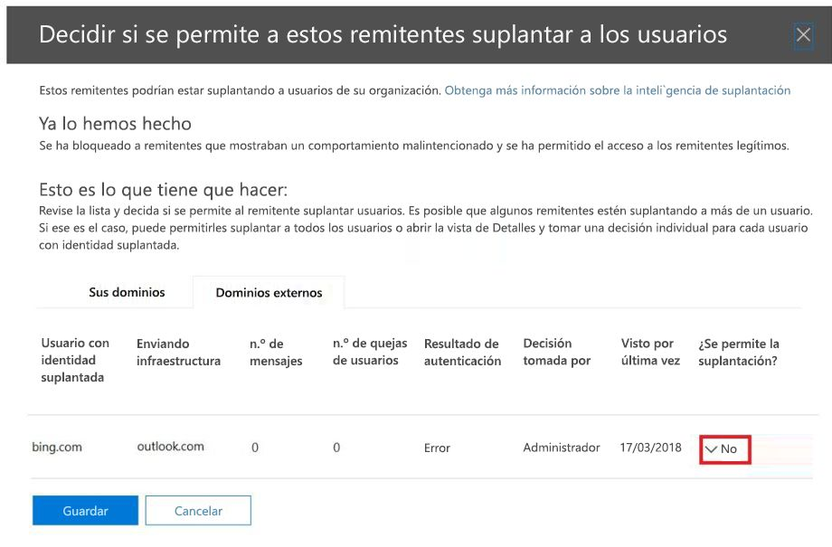

<span data-ttu-id="0f1fb-296">También puede usar PowerShell para permitir que un remitente específico suplante su dominio:</span><span class="sxs-lookup"><span data-stu-id="0f1fb-296">You can also use PowerShell to allow specific sender to spoof your domain:</span></span>

```powershell
$file = "C:\My Documents\Summary Spoofed Internal Domains and Senders.csv"
```

```powershell
Get-PhishFilterPolicy -Detailed -SpoofAllowBlockList -SpoofType External | Export-CSV $file
```


<span data-ttu-id="0f1fb-298">En la imagen anterior, se han agregado saltos de línea adicionales para ajustar esta captura de pantalla.</span><span class="sxs-lookup"><span data-stu-id="0f1fb-298">In the previous image, additional line breaks have been added to make this screenshot fit.</span></span> <span data-ttu-id="0f1fb-299">Normalmente, todos los valores aparecerían en una sola línea.</span><span class="sxs-lookup"><span data-stu-id="0f1fb-299">Normally, all the values would appear on a single line.</span></span>

<span data-ttu-id="0f1fb-300">Edite el archivo y busque la línea que corresponde a outlook.com y bing.com, cambie la entrada AllowedToSpoof de No a Sí:</span><span class="sxs-lookup"><span data-stu-id="0f1fb-300">Edit the file and look for the line that corresponds to outlook.com and bing.com, and change the AllowedToSpoof entry from No to Yes:</span></span>


<span data-ttu-id="0f1fb-302">Guarde el archivo y, después, ciérrelo:</span><span class="sxs-lookup"><span data-stu-id="0f1fb-302">Save the file, and then run:</span></span>

```powershell
$UpdateSpoofedSenders = Get-Content -Raw "C:\My Documents\Spoofed Senders.csv"
Set-PhishFilterPolicy -Identity Default -SpoofAllowBlockList $UpdateSpoofedSenders
```

<span data-ttu-id="0f1fb-303">Ahora, esto le permitirá a bing.com enviar correos sin autenticar desde \*.outlook.com.</span><span class="sxs-lookup"><span data-stu-id="0f1fb-303">This will now allow bing.com to send unauthenticated email from \*.outlook.com.</span></span>

#### <a name="method-3---create-an-allow-entry-for-the-senderrecipient-pair"></a><span data-ttu-id="0f1fb-304">Método 3: cree una entrada de permiso para el par de remitente y destinatario</span><span class="sxs-lookup"><span data-stu-id="0f1fb-304">Method 3 - Create an allow entry for the sender/recipient pair</span></span>

<span data-ttu-id="0f1fb-305">También puede evitar todos los filtros de spam para un remitente específico.</span><span class="sxs-lookup"><span data-stu-id="0f1fb-305">You can also choose to bypass all spam filtering for a particular sender.</span></span> <span data-ttu-id="0f1fb-306">Para obtener más información, vea [Cómo agregar de forma segura un remitente a una lista de permiso en Office 365](https://blogs.msdn.microsoft.com/tzink/2017/11/29/how-to-securely-add-a-sender-to-an-allow-list-in-office-365/).</span><span class="sxs-lookup"><span data-stu-id="0f1fb-306">For more details, see [How to securely add a sender to an allow list in Office 365](https://blogs.msdn.microsoft.com/tzink/2017/11/29/how-to-securely-add-a-sender-to-an-allow-list-in-office-365/).</span></span>

<span data-ttu-id="0f1fb-307">Si usa este método, omitirá el filtrado de spam y algunos phishing, pero no omitirá el filtrado de malware.</span><span class="sxs-lookup"><span data-stu-id="0f1fb-307">If you use this method, it will skip spam and some of the phish filtering, but not malware filtering.</span></span>

#### <a name="method-4---contact-the-sender-and-ask-them-to-set-up-email-authentication"></a><span data-ttu-id="0f1fb-308">Método 4: póngase en contacto con el remitente y pídale que configure la autenticación de correo electrónico</span><span class="sxs-lookup"><span data-stu-id="0f1fb-308">Method 4 - Contact the sender and ask them to set up email authentication</span></span>

<span data-ttu-id="0f1fb-309">Por el problema del correo no deseado y la suplantación de identidad, Microsoft recomienda configurar la autenticación de correo electrónico a todos los remitentes.</span><span class="sxs-lookup"><span data-stu-id="0f1fb-309">Because of the problem of spam and phishing, Microsoft recommends all senders set up email authentication.</span></span> <span data-ttu-id="0f1fb-310">Si conoce a un administrador del dominio remitente, póngase en contacto con él y pídale que configure los registros de autenticación de correo electrónico para que no tenga que agregar invalidaciones.</span><span class="sxs-lookup"><span data-stu-id="0f1fb-310">If you know an administrator of the sending domain, contact them and request that they set up email authentication records so you do not have to add any overrides.</span></span> <span data-ttu-id="0f1fb-311">Para obtener más información, vea [Administradores de dominios que no son clientes de Office 365](#administrators-of-domains-that-are-not-office-365-customers) más adelante en este artículo.</span><span class="sxs-lookup"><span data-stu-id="0f1fb-311">For more information, see [Administrators of domains that are not Office 365 customers](#administrators-of-domains-that-are-not-office-365-customers)" later in this article.</span></span>

<span data-ttu-id="0f1fb-312">Aunque puede ser difícil empezar a enviar dominios para la autenticación, con el tiempo, como más filtros de correo electrónico comienzan a eliminar o incluso rechazan su correo electrónico, deberán configurar los registros adecuados para garantizar una mejor entrega.</span><span class="sxs-lookup"><span data-stu-id="0f1fb-312">While it may be difficult at first to get sending domains to authenticate, over time, as more and more email filters start junking or even rejecting their email, it will cause them to set up the proper records to ensure better delivery.</span></span>

### <a name="viewing-reports-of-how-many-messages-were-marked-as-spoofed"></a><span data-ttu-id="0f1fb-313">Ver los informes de cuántos mensajes se marcan como falsificados</span><span class="sxs-lookup"><span data-stu-id="0f1fb-313">Viewing reports of how many messages were marked as spoofed</span></span>

<span data-ttu-id="0f1fb-314">Cuando está habilitada la directiva contra la suplantación, puede usar las funciones de investigación y respuesta de amenazas para hacerse una idea de cuántos mensajes se marcan como phishing.</span><span class="sxs-lookup"><span data-stu-id="0f1fb-314">Once your anti-spoofing policy is enabled, you can use threat investigation and response capabilities to get numbers around how many messages are marked as phish.</span></span> <span data-ttu-id="0f1fb-315">Para ello, vaya al Centro de seguridad &amp; cumplimiento (SCC) en Administración de amenazas \> Explorador, establezca la vista phishing y ordene por dominio remitente o estado de protección:</span><span class="sxs-lookup"><span data-stu-id="0f1fb-315">To do this, go into the Security &amp; Compliance Center (SCC) under Threat Management \> Explorer, set the View to Phish, and group by Sender Domain or Protection Status:</span></span>

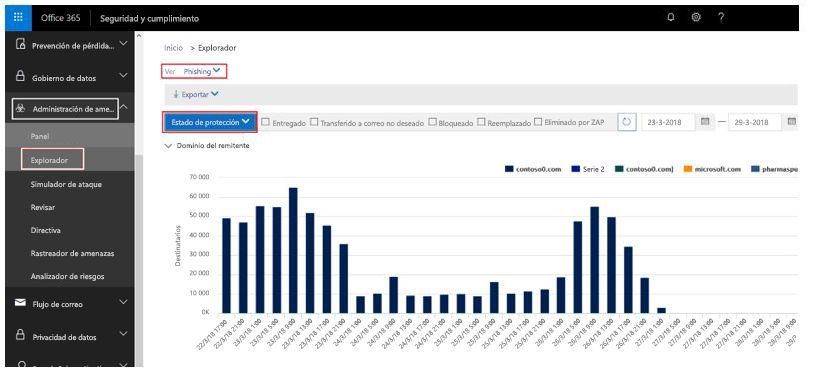

<span data-ttu-id="0f1fb-317">Puede interactuar con los diversos informes para ver cuántos se han marcado como phishing, incluidos los mensajes marcados como SPOOF.</span><span class="sxs-lookup"><span data-stu-id="0f1fb-317">You can interact with the various reports to see how many were marked as phishing, including messages marked as SPOOF.</span></span> <span data-ttu-id="0f1fb-318">Para obtener más información, vea [Introducción a la investigación de amenazas y respuestas de Office 365](office-365-ti.md).</span><span class="sxs-lookup"><span data-stu-id="0f1fb-318">To learn more, see [Get started with Office 365 Threat investigation and response](office-365-ti.md).</span></span>

<span data-ttu-id="0f1fb-319">Todavía no puede dividir los mensajes que se marcaron debido a la suplantación de identidad y otros tipos de phishing (como phishing general, suplantación de dominio o de usuario).</span><span class="sxs-lookup"><span data-stu-id="0f1fb-319">You can't yet split out which messages were marked due to spoofing as opposed to other types of phishing (general phishing, domain or user impersonation, and so on).</span></span> <span data-ttu-id="0f1fb-320">Pero, más adelante, podrá hacerlo a través del Centro de seguridad &amp; cumplimiento.</span><span class="sxs-lookup"><span data-stu-id="0f1fb-320">However, later, you will be able to do this through the Security &amp; Compliance Center.</span></span> <span data-ttu-id="0f1fb-321">Una vez hecho, puede usar este informe como punto de partida para identificar los dominios remitentes que pueden ser legítimos y que se han marcado como suplantación de identidad debido a errores de autenticación.</span><span class="sxs-lookup"><span data-stu-id="0f1fb-321">Once you do, you can use this report as a starting place to identify sending domains that may be legitimate that are being marked as spoof due to failing authentication.</span></span>

<span data-ttu-id="0f1fb-322">La captura de pantalla siguiente es un ejemplo de cómo se mostrarán estos datos, pero puede que cambie a la hora de la publicación:</span><span class="sxs-lookup"><span data-stu-id="0f1fb-322">The following screenshot is a proposal for how this data will look, but may change when released:</span></span>

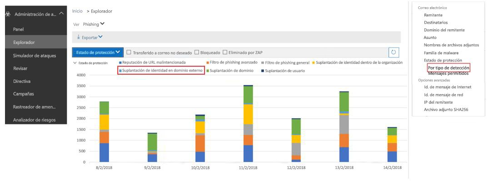

<span data-ttu-id="0f1fb-324">Para los clientes de ATP y E5, estos informes estarán disponibles más adelante en los informes de estado de protección contra amenazas (TPS), pero se retrasarán al menos 24 horas.</span><span class="sxs-lookup"><span data-stu-id="0f1fb-324">For non-ATP and E5 customers, these reports will be available later under the Threat Protection Status (TPS) reports, but will be delayed by at least 24 hours.</span></span> <span data-ttu-id="0f1fb-325">Esta página se actualizará cuando se integren en el Centro de seguridad &amp; cumplimiento.</span><span class="sxs-lookup"><span data-stu-id="0f1fb-325">This page will be updated as they are integrated into the Security &amp; Compliance Center.</span></span>

### <a name="predicting-how-many-messages-will-be-marked-as-spoof"></a><span data-ttu-id="0f1fb-326">Predecir cuántos mensajes se marcarán como suplantación de identidad</span><span class="sxs-lookup"><span data-stu-id="0f1fb-326">Predicting how many messages will be marked as spoof</span></span>

<span data-ttu-id="0f1fb-327">Una vez que Office 365 actualiza su configuración para que pueda desactivar el cumplimiento de la protección contra la suplantación o pueda activarla a nivel de cumplimiento básico o alto, podrá ver que la disposición de mensajes cambiará según las distintas opciones de configuración.</span><span class="sxs-lookup"><span data-stu-id="0f1fb-327">Once Office 365 updates its settings to let you turn the anti-spoofing enforcement Off, or on with Basic or High enforcement, you will be given the ability to see how message disposition will change at the various settings.</span></span> <span data-ttu-id="0f1fb-328">Es decir, si la protección contra la suplantación está desactivada, podrá ver cuántos mensajes se detectarán como suplantación de identidad si el cumplimiento se establece como básico; o bien, si ya es básico, podrá ver cuántos mensajes se detectarán como suplantación de identidad si se establece como alto.</span><span class="sxs-lookup"><span data-stu-id="0f1fb-328">That is, if anti-spoofing is Off, you will be able to see how many messages will be detected as Spoof if you turn to Basic; or, if it's Basic, you will be able to see how many more messages will be detected as Spoof if you turn it to High.</span></span>

<span data-ttu-id="0f1fb-329">Esta característica está actualmente en desarrollo.</span><span class="sxs-lookup"><span data-stu-id="0f1fb-329">This feature is currently under development.</span></span> <span data-ttu-id="0f1fb-330">A medida de que se vayan definiendo más detalles, esta página se actualizará con capturas de pantalla del Centro de seguridad y cumplimiento y con ejemplos de PowerShell.</span><span class="sxs-lookup"><span data-stu-id="0f1fb-330">As more details are defined, this page will be updated both with screenshots of the Security and Compliance Center, and with PowerShell examples.</span></span>

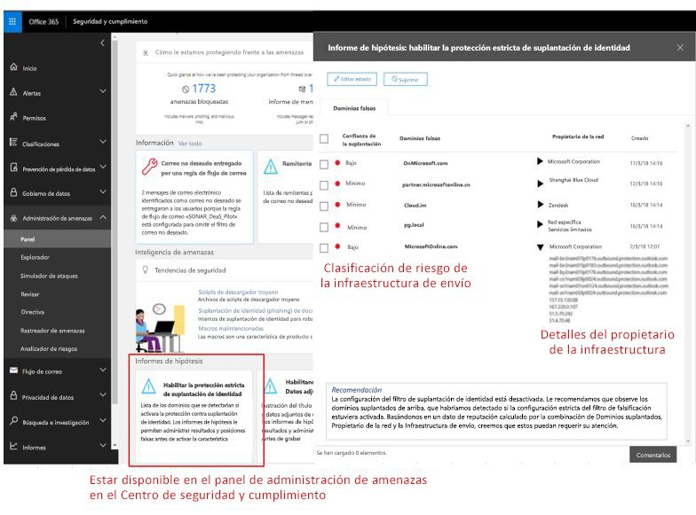

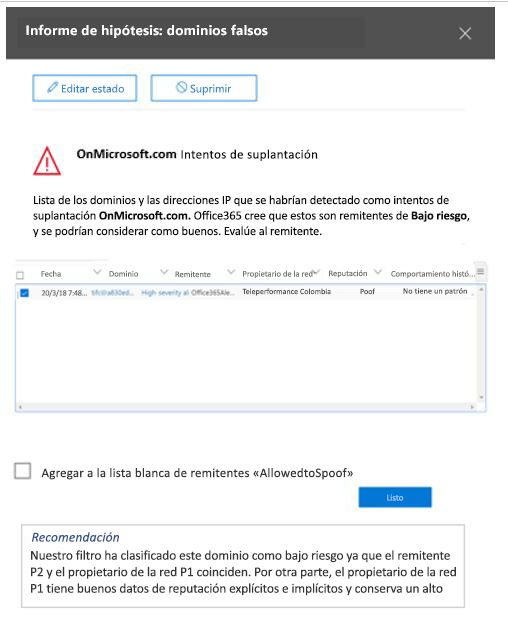

### <a name="legitimate-scenarios-to-disable-anti-spoofing"></a><span data-ttu-id="0f1fb-333">Escenarios legítimos para deshabilitar la protección contra la suplantación</span><span class="sxs-lookup"><span data-stu-id="0f1fb-333">Legitimate scenarios to disable anti-spoofing</span></span>

<span data-ttu-id="0f1fb-334">La protección contra la suplantación protege mejor a los clientes de los ataques de phishing y, por tanto, no se recomienda deshabilitarla.</span><span class="sxs-lookup"><span data-stu-id="0f1fb-334">Anti-spoofing better protects customers from phishing attacks, and therefore disabling anti-spoofing protection is strongly discouraged.</span></span> <span data-ttu-id="0f1fb-335">Si la deshabilita, puede resolver algunos falsos positivos a corto plazo, pero a largo plazo estará expuesto a más riesgos.</span><span class="sxs-lookup"><span data-stu-id="0f1fb-335">By disabling it, you may resolve some short-term false positives, but long term you will be exposed to more risk.</span></span> <span data-ttu-id="0f1fb-336">Configurar la autenticación del lado del remitente o hacer ajustes en las políticas de phishing, generalmente son eventos únicos o requieren un mantenimiento mínimo y periódico.</span><span class="sxs-lookup"><span data-stu-id="0f1fb-336">The cost for setting up authentication on the sender side, or making adjustments in the phishing policies, are usually one-time events or require only minimal, periodic maintenance.</span></span> <span data-ttu-id="0f1fb-337">Pero, recuperarse de ataques de phishing en los que se han expuesto datos o se han puesto en riesgo los activos es mucho más peligroso.</span><span class="sxs-lookup"><span data-stu-id="0f1fb-337">However, the cost to recover from a phishing attack where data has been exposed, or assets have been compromised is much higher.</span></span>

<span data-ttu-id="0f1fb-338">Por ello, es mejor trabajar con los falsos positivos de la protección contra la suplantación de identidad que deshabilitarla.</span><span class="sxs-lookup"><span data-stu-id="0f1fb-338">For this reason, it is better to work through anti-spoofing false positives than to disable anti-spoof protection.</span></span>

<span data-ttu-id="0f1fb-339">Pero, hay un escenario legítimo donde debe deshabilitarse, es decir cuando hay productos de filtrado de correo electrónico adicionales en el enrutamiento de mensajes y Office 365 no es el primer paso en la ruta de acceso al correo electrónico:</span><span class="sxs-lookup"><span data-stu-id="0f1fb-339">However, there is a legitimate scenario where anti-spoofing should be disabled, and that is when there are additional mail-filtering products in the message routing, and Office 365 is not the first hop in the email path:</span></span>

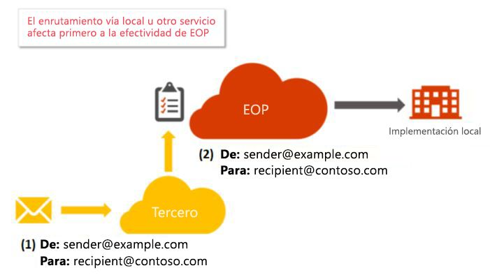

<span data-ttu-id="0f1fb-341">El otro servidor puede ser el servidor de correo de Exchange local, un dispositivo de filtrado de correo electrónico, como Ironport, u otro servicio hospedado en la nube. </span><span class="sxs-lookup"><span data-stu-id="0f1fb-341">The other server may be an Exchange on-premises mail server, a mail filtering device such as Ironport, or another cloud hosted service.</span></span>

<span data-ttu-id="0f1fb-342">Si el registro MX del dominio del destinatario no apunta a Office 365, no es necesario deshabilitar la protección contra la suplantación porque Office 365 busca el registro MX de su dominio receptor y suprime la protección contra la suplantación si apunta a otro servicio.</span><span class="sxs-lookup"><span data-stu-id="0f1fb-342">If the MX record of the recipient domain does not point to Office 365, then there is no need to disable anti-spoofing because Office 365 looks up your receiving domain's MX record and suppresses anti-spoofing if it points to another service.</span></span> <span data-ttu-id="0f1fb-343">Si no sabe si su dominio tiene delante otro servidor, puede usar un sitio web como MX Toolbox para buscar el registro MX.</span><span class="sxs-lookup"><span data-stu-id="0f1fb-343">If you don't know if your domain has another server in front, you can use a website like MX Toolbox to look up the MX record.</span></span> <span data-ttu-id="0f1fb-344">Puede aparecer como se muestra a continuación:</span><span class="sxs-lookup"><span data-stu-id="0f1fb-344">It might say something like the following:</span></span>

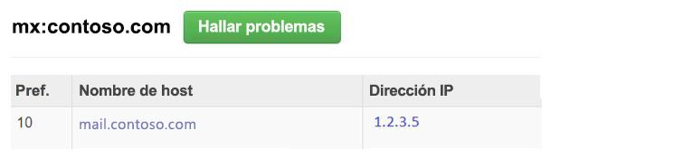

<span data-ttu-id="0f1fb-346">Este dominio tiene un registro MX que no apunta a Office 365, por lo que Office 365 no aplica el cumplimiento de la protección contra la suplantación.</span><span class="sxs-lookup"><span data-stu-id="0f1fb-346">This domain has an MX record that does not point to Office 365, so Office 365 would not apply anti-spoofing enforcement.</span></span>

<span data-ttu-id="0f1fb-347">Pero, si el registro MX del dominio del destinatario *sí* apunta a Office 365, aunque hay otro servicio frente a Office 365, debe deshabilitar la protección contra la suplantación.</span><span class="sxs-lookup"><span data-stu-id="0f1fb-347">However, if the MX record of the recipient domain  *does*  point to Office 365, even though there is another service in front of Office 365, then you should disable anti-spoofing.</span></span> <span data-ttu-id="0f1fb-348">El ejemplo más común es mediante la reescritura del destinatario:</span><span class="sxs-lookup"><span data-stu-id="0f1fb-348">The most common example is through the use of a recipient rewrite:</span></span>


<span data-ttu-id="0f1fb-350">El registro MX del dominio contoso.com apunta al servidor local, mientras que el registro MX del dominio @office365.contoso.net apunta a Office 365, porque contiene \*.protection.outlook.com o \*.eo.outlook.com en el registro MX:</span><span class="sxs-lookup"><span data-stu-id="0f1fb-350">The domain contoso.com's MX record points to the on-premises server, while the domain @office365.contoso.net's MX record points to Office 365 because it contains \*.protection.outlook.com, or \*.eo.outlook.com in the MX record:</span></span>

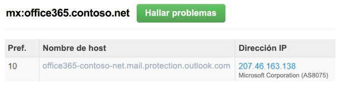

<span data-ttu-id="0f1fb-352">No olvide diferenciar cuando el registro MX del dominio del destinatario no apunta a Office 365 y cuando se ha realizado una reescritura del destinatario.</span><span class="sxs-lookup"><span data-stu-id="0f1fb-352">Be sure to differentiate when a recipient domain's MX record does not point to Office 365, and when it has undergone a recipient rewrite.</span></span> <span data-ttu-id="0f1fb-353">Es importante saber la diferencia entre estos dos casos.</span><span class="sxs-lookup"><span data-stu-id="0f1fb-353">It is important to tell the difference between these two cases.</span></span>

<span data-ttu-id="0f1fb-354">Si no está seguro de si se ha realizado una reescritura de destinatario para su dominio receptor, a veces se ve en los encabezados del mensaje.</span><span class="sxs-lookup"><span data-stu-id="0f1fb-354">If you are unsure whether or not your receiving domain has undergone a recipient-rewrite, sometimes you can tell by looking at the message headers.</span></span>

<span data-ttu-id="0f1fb-355">a) en primer lugar, observe los encabezados del mensaje para el dominio del destinatario en el encabezado de Authentication-Results:</span><span class="sxs-lookup"><span data-stu-id="0f1fb-355">a) First, look at the headers in the message for the recipient domain in the Authentication-Results header:</span></span>

```
Authentication-Results: spf=fail (sender IP is 1.2.3.4)
  smtp.mailfrom=example.com; office365.contoso.net; dkim=fail
  (body hash did not verify) header.d=simple.example.com;
  office365.contoso.net; dmarc=none action=none
  header.from=example.com; compauth=fail reason=001
```

<span data-ttu-id="0f1fb-356">El dominio del destinatario se encuentra en el texto rojo en negrita de la parte superior, en este caso office365.contoso.net.</span><span class="sxs-lookup"><span data-stu-id="0f1fb-356">The recipient domain is found in the bold red text above, in this case office365.contoso.net.</span></span> <span data-ttu-id="0f1fb-357">El destinatario en el encabezado Para: puede ser diferente:</span><span class="sxs-lookup"><span data-stu-id="0f1fb-357">This may be different that the recipient in the To: header:</span></span>

<span data-ttu-id="0f1fb-358">Para: Destinatario de ejemplo \<destinatario @ contoso.com\></span><span class="sxs-lookup"><span data-stu-id="0f1fb-358">To: Example Recipient \<recipient @ contoso.com\></span></span>

<span data-ttu-id="0f1fb-359">Realice una búsqueda en el registro MX del dominio del destinatario real.</span><span class="sxs-lookup"><span data-stu-id="0f1fb-359">Perform an MX-record lookup of the actual recipient domain.</span></span> <span data-ttu-id="0f1fb-360">Si contiene \*.protection.outlook.com, mail.messaging.microsoft.com, \*.eo.outlook.com o mail.global.frontbridge.com significa que MX apunta a Office 365.</span><span class="sxs-lookup"><span data-stu-id="0f1fb-360">If it contains \*.protection.outlook.com, mail.messaging.microsoft.com, \*.eo.outlook.com, or mail.global.frontbridge.com, that means that the MX points to Office 365.</span></span>

<span data-ttu-id="0f1fb-361">Si no contiene dichos valores significa que MX no apunta a Office 365.</span><span class="sxs-lookup"><span data-stu-id="0f1fb-361">If it does not contain those values, then it means that the MX does not point to Office 365.</span></span> <span data-ttu-id="0f1fb-362">Una herramienta que puede usar para comprobarlo es MX Toolbox.</span><span class="sxs-lookup"><span data-stu-id="0f1fb-362">One tool you can use to verify this is MX Toolbox.</span></span>

<span data-ttu-id="0f1fb-363">Para este ejemplo concreto, la captura de pantalla siguiente indica que para contoso.com, el dominio que parece el destinatario ya que era el encabezado Para:, el registro MX apunta a un servidor local:</span><span class="sxs-lookup"><span data-stu-id="0f1fb-363">For this particular example, the following says that contoso.com, the domain that looks like the recipient since it was the To: header, has MX record points to an on-prem server:</span></span>

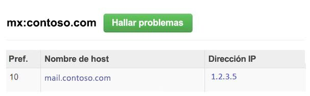

<span data-ttu-id="0f1fb-365">Pero, el destinatario real es office365.contoso.net, cuyo registro MX apunta a Office 365:</span><span class="sxs-lookup"><span data-stu-id="0f1fb-365">However, the actual recipient is office365.contoso.net whose MX record does point to Office 365:</span></span>


<span data-ttu-id="0f1fb-367">Por lo tanto, para este mensaje probablemente se ha realizado una reescritura del destinatario.</span><span class="sxs-lookup"><span data-stu-id="0f1fb-367">Therefore, this message has likely undergone a recipient-rewrite.</span></span>

<span data-ttu-id="0f1fb-368">b) en segundo lugar, asegúrese de distinguir entre los casos de uso común de reescritura del destinatario.</span><span class="sxs-lookup"><span data-stu-id="0f1fb-368">b) Second, be sure to distinguish between common use cases of recipient rewrites.</span></span> <span data-ttu-id="0f1fb-369">Si vuelve a escribir el dominio del destinatario para \*.onmicrosoft.com, vuelva a escribirlo como \*. mail.onmicrosoft.com.</span><span class="sxs-lookup"><span data-stu-id="0f1fb-369">If you are going to rewrite the recipient domain to \*.onmicrosoft.com, instead rewrite it to \*.mail.onmicrosoft.com.</span></span>

<span data-ttu-id="0f1fb-370">Una vez que haya identificado el dominio del destinatario final que se enruta detrás de otro servidor y el registro MX del dominio del destinatario apunta a Office 365 (como se publica en sus registros DNS), puede deshabilitar la protección contra la suplantación.</span><span class="sxs-lookup"><span data-stu-id="0f1fb-370">Once you have identified the final recipient domain that is routed behind another server and the recipient domain's MX record actually points to Office 365 (as published in its DNS records), you may proceed to disable anti-spoofing.</span></span>

<span data-ttu-id="0f1fb-371">Recuerde que no se recomienda deshabilitar la protección contra la suplantación si el primer paso en la ruta de enrutamiento del dominio es Office 365. Se recomienda solo cuando está detrás de uno o más servicios.</span><span class="sxs-lookup"><span data-stu-id="0f1fb-371">Remember, you don't want to disable anti-spoofing if the domain's first hop in the routing path is Office 365, only when it's behind one or more services.</span></span>

### <a name="how-to-disable-anti-spoofing"></a><span data-ttu-id="0f1fb-372">Deshabilitar la protección contra la suplantación</span><span class="sxs-lookup"><span data-stu-id="0f1fb-372">How to disable anti-spoofing</span></span>

<span data-ttu-id="0f1fb-373">Si ya creó una directiva contra la suplantación de identidad, establezca el parámetro EnableAntispoofEnforcement como $false:</span><span class="sxs-lookup"><span data-stu-id="0f1fb-373">If you already have an Anti-phishing policy created, set the EnableAntispoofEnforcement parameter to $false:</span></span>

```
$name = "<name of policy>"
Set-AntiphishPolicy -Identity $name -EnableAntiSpoofEnforcement $false

```

<span data-ttu-id="0f1fb-374">Si no conoce el nombre de la directiva (o directivas) para deshabilitar, puede mostrarlas:</span><span class="sxs-lookup"><span data-stu-id="0f1fb-374">If you don't know the name of the policy (or policies) to disable, you can display them:</span></span>

```
Get-AntiphishPolicy | fl Name
```

<span data-ttu-id="0f1fb-375">Si no tiene ninguna directiva contra la suplantación de identidad existente, puede crearla y deshabilitarla (incluso si no tiene una directiva, se sigue aplicando la protección contra la suplantación; más adelante en 2018, se creará una directiva predeterminada que, después, puede deshabilitar en lugar de crear una nueva).</span><span class="sxs-lookup"><span data-stu-id="0f1fb-375">If you don't have any existing anti-phishing policies, you can create one and then disable it (even if you don't have a policy, anti-spoofing is still applied; later on in 2018, a default policy will be created for you and you can then disable that instead of creating one).</span></span> <span data-ttu-id="0f1fb-376">Deberá seguir varios pasos:</span><span class="sxs-lookup"><span data-stu-id="0f1fb-376">You will have to do this in multiple steps:</span></span>

```
$org = Get-OrganizationConfig
$name = "My first anti-phishing policy for " + $org.Name
# Note: If the name is more than 64 characters, you will need to choose a smaller one
```

```
# Next, create a new anti-phishing policy with the default values
New-AntiphishPolicy -Name $Name
# Select the domains to scope it to
# Multiple domains are specified in a comma-separated list
$domains = "domain1.com, domain2.com, domain3.com"
# Next, create the anti-phishing rule, scope it to the anti-phishing rule
New-AntiphishRule -Name $name -AntiphishPolicy -RecipientDomainIs $domains
# Finally, scope the anti-phishing policy to the domains
Set-AntiphishPolicy -Identity $name -EnableAntispoofEnforcement $false

```

<span data-ttu-id="0f1fb-377">Se puede deshabilitar la protección contra la suplantación solo mediante el cmdlet (más adelante estará disponible en el centro de seguridad &amp; cumplimiento).</span><span class="sxs-lookup"><span data-stu-id="0f1fb-377">Disabling anti-spoofing is only available via cmdlet (later it will be available in the Security &amp; Compliance Center).</span></span> <span data-ttu-id="0f1fb-378">Si no tiene acceso a PowerShell, cree un vale de soporte.</span><span class="sxs-lookup"><span data-stu-id="0f1fb-378">If you do not have access to PowerShell, create a support ticket.</span></span>

<span data-ttu-id="0f1fb-379">Recuerde que debe aplicarse a los dominios que se someten a un enrutamiento indirecto cuando se envían a Office 365.</span><span class="sxs-lookup"><span data-stu-id="0f1fb-379">Remember, this should only be applied to domains that undergo indirect routing when sent to Office 365.</span></span> <span data-ttu-id="0f1fb-380">Resista la tentación de deshabilitar la protección contra la suplantación debido a algunos falsos positivos, será mejor trabajar con ellos a largo plazo.</span><span class="sxs-lookup"><span data-stu-id="0f1fb-380">Resist the temptation to disable anti-spoofing because of some false positives, it will be better in the long run to work through them.</span></span>

### <a name="information-for-individual-users"></a><span data-ttu-id="0f1fb-381">Información para usuarios individuales</span><span class="sxs-lookup"><span data-stu-id="0f1fb-381">Information for individual users</span></span>

<span data-ttu-id="0f1fb-382">Los usuarios individuales tienen una interacción limitada con la sugerencia de seguridad contra la suplantación.</span><span class="sxs-lookup"><span data-stu-id="0f1fb-382">Individual users are limited in how they can interact with the anti-spoofing safety tip.</span></span> <span data-ttu-id="0f1fb-383">Pero, hay varias cosas que puede realizar para solucionar escenarios comunes.</span><span class="sxs-lookup"><span data-stu-id="0f1fb-383">However, there are several things you can do to resolve common scenarios.</span></span>

### <a name="common-scenario-1---discussion-lists"></a><span data-ttu-id="0f1fb-384">Escenario común n.º 1: listas de discusión</span><span class="sxs-lookup"><span data-stu-id="0f1fb-384">Common scenario #1 - Discussion lists</span></span>

<span data-ttu-id="0f1fb-385">Se sabe que las listas de discusión tienen problemas con la protección contra la suplantación debido a la forma en que reenvían el mensaje y modifican su contenido, pero conservan la dirección De: original.</span><span class="sxs-lookup"><span data-stu-id="0f1fb-385">Discussion lists are known to have problems with anti-spoofing due to the way they forward the message and modify its contents yet retain the original From: address.</span></span>

<span data-ttu-id="0f1fb-386">Por ejemplo, supongamos que su dirección de correo electrónico es usuario @ contoso.com, le interesa la observación de aves y se une a la lista de discusión de observadoresdeaves @ ejemplo.com.</span><span class="sxs-lookup"><span data-stu-id="0f1fb-386">For example, suppose your email address is user @ contoso.com, and you are interested in Bird Watching and join the discussion list birdwatchers @ example.com.</span></span> <span data-ttu-id="0f1fb-387">Cuando envía un mensaje a la lista de discusión, puede enviarlo así:</span><span class="sxs-lookup"><span data-stu-id="0f1fb-387">When you send a message to the discussion list, you might send it this way:</span></span>

<span data-ttu-id="0f1fb-388">**De:** Jorge Montoya \<usuario @ contoso.com\></span><span class="sxs-lookup"><span data-stu-id="0f1fb-388">**From:** John Doe \<user @ contoso.com\></span></span>

<span data-ttu-id="0f1fb-389">**Para:** lista de discusión de observadores de aves \<observadoresdeaves @ ejemplo.com\></span><span class="sxs-lookup"><span data-stu-id="0f1fb-389">**To:** Birdwatcher's Discussion List \<birdwatchers @ example.com\></span></span>

<span data-ttu-id="0f1fb-390">**Asunto:** Excelente vista de arrendajos azules en la cima del Monte</span><span class="sxs-lookup"><span data-stu-id="0f1fb-390">**Subject:** Great viewing of blue jays at the top of Mt.</span></span> <span data-ttu-id="0f1fb-391">Rainier esta semana</span><span class="sxs-lookup"><span data-stu-id="0f1fb-391">Rainier this week</span></span>

<span data-ttu-id="0f1fb-392">¿Alguien quiere echar un vistazo a la vista de esta semana desde el Monte</span><span class="sxs-lookup"><span data-stu-id="0f1fb-392">Anyone want to check out the viewing this week from Mt.</span></span> <span data-ttu-id="0f1fb-393">Rainier?</span><span class="sxs-lookup"><span data-stu-id="0f1fb-393">Rainier?</span></span>

<span data-ttu-id="0f1fb-394">Cuando la lista de correo electrónico recibe el mensaje, le da formato, modifica su contenido y lo reproduce para el resto de los miembros de la lista de discusión, que consta de los participantes de muchos destinatarios de correos electrónicos diferentes.</span><span class="sxs-lookup"><span data-stu-id="0f1fb-394">When the email list receives the message, they format the message, modify its contents, and replay it to the rest of the members on the discussion list which is made up of participants from many different email receivers.</span></span>

<span data-ttu-id="0f1fb-395">**De:** Jorge Montoya \<usuario @ contoso.com\></span><span class="sxs-lookup"><span data-stu-id="0f1fb-395">**From:** John Doe \<user @ contoso.com\></span></span>

<span data-ttu-id="0f1fb-396">**Para:** lista de discusión de observadores de aves \<observadoresdeaves @ ejemplo.com\></span><span class="sxs-lookup"><span data-stu-id="0f1fb-396">**To:** Birdwatcher's Discussion List \<birdwatchers @ example.com\></span></span>

<span data-ttu-id="0f1fb-397">**Asunto:** [OBSERVADORESDEAVES] Excelente vista de arrendajos azules en la cima del Monte</span><span class="sxs-lookup"><span data-stu-id="0f1fb-397">**Subject:** [BIRDWATCHERS] Great viewing of blue jays at the top of Mt.</span></span> <span data-ttu-id="0f1fb-398">Rainier esta semana</span><span class="sxs-lookup"><span data-stu-id="0f1fb-398">Rainier this week</span></span>

<span data-ttu-id="0f1fb-399">¿Alguien quiere echar un vistazo a la vista de esta semana desde el Monte</span><span class="sxs-lookup"><span data-stu-id="0f1fb-399">Anyone want to check out the viewing this week from Mt.</span></span> <span data-ttu-id="0f1fb-400">Rainier?</span><span class="sxs-lookup"><span data-stu-id="0f1fb-400">Rainier?</span></span>

---

<span data-ttu-id="0f1fb-401">Este mensaje se envió a la lista de discusión de observadores de aves.</span><span class="sxs-lookup"><span data-stu-id="0f1fb-401">This message was sent to the Birdwatchers Discussion List.</span></span> <span data-ttu-id="0f1fb-402">Puede cancelar la suscripción en cualquier momento.</span><span class="sxs-lookup"><span data-stu-id="0f1fb-402">You can unsubscribe at any time.</span></span>

<span data-ttu-id="0f1fb-403">En el ejemplo anterior, el mensaje reproducido tiene la misma dirección De: (usuario @ contoso.com), pero el mensaje original se ha modificado y se han agregado una etiqueta en la línea de asunto y un pie de página en la parte inferior del mensaje.</span><span class="sxs-lookup"><span data-stu-id="0f1fb-403">In the above, the replayed message has the same From: address (user @ contoso.com) but the original message has been modified by adding a tag to the Subject line, and a footer to the bottom of the message.</span></span> <span data-ttu-id="0f1fb-404">Este tipo de modificación del mensaje es común en las listas de distribución de correo y puede producir falsos positivos.</span><span class="sxs-lookup"><span data-stu-id="0f1fb-404">This type of message modification is common in mailing lists, and may result in false positives.</span></span>

<span data-ttu-id="0f1fb-405">Si usted o alguien de su organización es un administrador de la lista de distribución de correo, puede configurarlo para pasar las comprobaciones de protección contra la suplantación.</span><span class="sxs-lookup"><span data-stu-id="0f1fb-405">If you or someone in your organization is an administrator of the mailing list, you may be able to configure it to pass anti-spoofing checks.</span></span>

- <span data-ttu-id="0f1fb-406">Consulte las preguntas más frecuentes en DMARC.org: [Manejo una lista de distribución de correo y quiero interactúan con DMARC, ¿qué debo hacer?](https://dmarc.org/wiki/FAQ#I_operate_a_mailing_list_and_I_want_to_interoperate_with_DMARC.2C_what_should_I_do.3F)</span><span class="sxs-lookup"><span data-stu-id="0f1fb-406">Check the FAQ at DMARC.org: [I operate a mailing list and I want to interoperate with DMARC, what should I do?](https://dmarc.org/wiki/FAQ#I_operate_a_mailing_list_and_I_want_to_interoperate_with_DMARC.2C_what_should_I_do.3F)</span></span>

- <span data-ttu-id="0f1fb-407">Lea las instrucciones en esta entrada de blog: [Una sugerencia para los operadores de la lista de distribución de correo para interactuar con DMARC sin errores](https://blogs.msdn.microsoft.com/tzink/2017/03/22/a-tip-for-mailing-list-operators-to-interoperate-with-dmarc-to-avoid-failures/)</span><span class="sxs-lookup"><span data-stu-id="0f1fb-407">Read the instructions at this blog post: [A tip for mailing list operators to interoperate with DMARC to avoid failures](https://blogs.msdn.microsoft.com/tzink/2017/03/22/a-tip-for-mailing-list-operators-to-interoperate-with-dmarc-to-avoid-failures/)</span></span>

- <span data-ttu-id="0f1fb-408">Considere instalar las actualizaciones en el servidor de la lista de distribución de correo para admitir ARC, vea [https://arc-spec.org](https://arc-spec.org/)</span><span class="sxs-lookup"><span data-stu-id="0f1fb-408">Consider installing updates on your mailing list server to support ARC, see [https://arc-spec.org](https://arc-spec.org/)</span></span>

<span data-ttu-id="0f1fb-409">Si no tiene la propiedad de la lista de distribución de correo:</span><span class="sxs-lookup"><span data-stu-id="0f1fb-409">If you do not have ownership of the mailing list:</span></span>

- <span data-ttu-id="0f1fb-410">Puede solicitar al encargado de la lista de distribución de correo que implemente una de las opciones anteriores (también deben tener configurada la autenticación de correo electrónico para el dominio desde el que se retransmite la lista de distribución de correo)</span><span class="sxs-lookup"><span data-stu-id="0f1fb-410">You can request the maintainer of the mailing list to implement one of the options above (they should also have email authentication set up for the domain the mailing list is relaying from)</span></span>

- <span data-ttu-id="0f1fb-411">Puede crear reglas de buzón en el cliente de correo para mover mensajes a la Bandeja de entrada.</span><span class="sxs-lookup"><span data-stu-id="0f1fb-411">You can create mailbox rules in your email client to move messages to the Inbox.</span></span> <span data-ttu-id="0f1fb-412">Además, puede solicitar los administradores de su organización que configuren reglas de permiso o invalidaciones, como se describe en la sección Administrar a remitentes legítimos que envían correo electrónico sin autenticar</span><span class="sxs-lookup"><span data-stu-id="0f1fb-412">You can also request your organization's administrators to set up allow rules, or overrides as discussed in the section Managing legitimate senders who are sending unauthenticated email</span></span>

- <span data-ttu-id="0f1fb-413">Puede crear un vale de soporte con Office 365 para crear una invalidación de la lista de distribución de correo y usarla como legítima</span><span class="sxs-lookup"><span data-stu-id="0f1fb-413">You can create a support ticket with Office 365 to create an override for the mailing list to treat it as legitimate</span></span>

### <a name="other-scenarios"></a><span data-ttu-id="0f1fb-414">Otros escenarios</span><span class="sxs-lookup"><span data-stu-id="0f1fb-414">Other scenarios</span></span>

1. <span data-ttu-id="0f1fb-415">Si ninguno de los escenarios comunes anteriores se aplica a su situación, informe del mensaje como un falso positivo a Microsoft.</span><span class="sxs-lookup"><span data-stu-id="0f1fb-415">If neither of the above common scenarios applies to your situation, report the message as a false positive back to Microsoft.</span></span> <span data-ttu-id="0f1fb-416">Para obtener más información, vea la sección [¿Cómo señalar mensajes de correo no deseado o correo deseado a Microsoft?](#how-can-i-report-spam-or-non-spam-messages-back-to-microsoft) más adelante en este artículo.</span><span class="sxs-lookup"><span data-stu-id="0f1fb-416">For more information, see the section [How can I report spam or non-spam messages back to Microsoft?](#how-can-i-report-spam-or-non-spam-messages-back-to-microsoft) later in this article.</span></span>

2. <span data-ttu-id="0f1fb-417">También puede contactarse con el administrador de correo electrónico que puede crear una incidencia de soporte técnico para Microsoft.</span><span class="sxs-lookup"><span data-stu-id="0f1fb-417">You may also contact your email administrator who can raise it as a support ticket with Microsoft.</span></span> <span data-ttu-id="0f1fb-418">El equipo de ingeniería de Microsoft investigará por qué el mensaje se marcó como una suplantación de identidad.</span><span class="sxs-lookup"><span data-stu-id="0f1fb-418">The Microsoft engineering team will investigate why the message was marked as a spoof.</span></span>

3. <span data-ttu-id="0f1fb-419">Además, si sabe quién es el remitente y está seguro de que no es una suplantación malintencionada, puede responder al remitente indicándole que está enviando mensajes desde un servidor de correo que no se autentica.</span><span class="sxs-lookup"><span data-stu-id="0f1fb-419">Additionally, if you know who the sender is and are confident they are not being maliciously spoofed, you may reply back to the sender indicating that they are sending messages from a mail server that does not authenticate.</span></span> <span data-ttu-id="0f1fb-420">A veces, el resultado es que el remitente original se pone en contacto con su administrador de TI, que configurará los registros de autenticación de correo electrónico necesarios.</span><span class="sxs-lookup"><span data-stu-id="0f1fb-420">This sometimes results in the original sender contacting their IT administrator who will set up the required email authentication records.</span></span>

<span data-ttu-id="0f1fb-421">Cuando hay suficientes remitentes que responden a los propietarios de dominios pidiéndoles que configuren los registros de autenticación de correo electrónico, es más probable que tomen medidas.</span><span class="sxs-lookup"><span data-stu-id="0f1fb-421">When enough senders reply back to domain owners that they should set up email authentication records, it spurs them into taking action.</span></span> <span data-ttu-id="0f1fb-422">Aunque Microsoft también trabaja con los propietarios de dominios para publicar los registros necesarios, es aún más efectivo cuando los usuarios individuales lo solicitan.</span><span class="sxs-lookup"><span data-stu-id="0f1fb-422">While Microsoft also works with domain owners to publish the required records, it helps even more when individual users request it.</span></span>

4. <span data-ttu-id="0f1fb-423">Opcionalmente, puede agregar el remitente a la lista de remitentes seguros.</span><span class="sxs-lookup"><span data-stu-id="0f1fb-423">Optionally, add the sender to your Safe Senders list.</span></span> <span data-ttu-id="0f1fb-424">Pero, tenga en cuenta que si un atacante suplanta esa cuenta, el mensaje se entregará a su buzón.</span><span class="sxs-lookup"><span data-stu-id="0f1fb-424">However, be aware that if a phisher spoofs that account, it will be delivered to your mailbox.</span></span> <span data-ttu-id="0f1fb-425">Por lo tanto, esta opción debería usarse con moderación.</span><span class="sxs-lookup"><span data-stu-id="0f1fb-425">Therefore, this option should be used sparingly.</span></span>

## <a name="how-senders-to-microsoft-should-prepare-for-anti-spoofing-protection"></a><span data-ttu-id="0f1fb-426">Cómo los remitentes a Microsoft deberían prepararse para la protección contra la suplantación de identidad.</span><span class="sxs-lookup"><span data-stu-id="0f1fb-426">How senders to Microsoft should prepare for anti-spoofing protection</span></span>

<span data-ttu-id="0f1fb-427">Si es un administrador que actualmente envía mensajes a Microsoft, Office 365 u Outlook.com, deberá asegurarse de que el correo electrónico se autentica correctamente. En caso contrario, es posible que se marque como spam o phishing.</span><span class="sxs-lookup"><span data-stu-id="0f1fb-427">If you are an administrator who currently sends messages to Microsoft, either Office 365 or Outlook.com, you should ensure that your email is properly authenticated otherwise it may be marked as spam or phish.</span></span>

### <a name="customers-of-office-365"></a><span data-ttu-id="0f1fb-428">Clientes de Office 365</span><span class="sxs-lookup"><span data-stu-id="0f1fb-428">Customers of Office 365</span></span>

<span data-ttu-id="0f1fb-429">Si es cliente de Office 365 y usa Office 365 para enviar correo electrónico saliente:</span><span class="sxs-lookup"><span data-stu-id="0f1fb-429">If you are an Office 365 customer and you use Office 365 to send outbound email:</span></span>

- <span data-ttu-id="0f1fb-430">Para sus dominios, vea [Configurar SPF en Office 365 para evitar la suplantación de identidad](set-up-spf-in-office-365-to-help-prevent-spoofing.md)</span><span class="sxs-lookup"><span data-stu-id="0f1fb-430">For your domains, [Set up SPF in Office 365 to help prevent spoofing](set-up-spf-in-office-365-to-help-prevent-spoofing.md)</span></span>

- <span data-ttu-id="0f1fb-431">Para sus dominios principales, vea [Usar DKIM para validar el correo electrónico saliente enviado desde su dominio personalizado en Office 365](use-dkim-to-validate-outbound-email.md)</span><span class="sxs-lookup"><span data-stu-id="0f1fb-431">For your primary domains, [Use DKIM to validate outbound email sent from your custom domain in Office 365](use-dkim-to-validate-outbound-email.md)</span></span>

- <span data-ttu-id="0f1fb-432">Puede [configurar los registros DMARC](use-dmarc-to-validate-email.md) para su dominio para determinar la lista de remitentes legítimos</span><span class="sxs-lookup"><span data-stu-id="0f1fb-432">[Consider setting up DMARC records](use-dmarc-to-validate-email.md) for your domain to determine who are your legitimate senders</span></span>

<span data-ttu-id="0f1fb-433">Microsoft no proporciona instrucciones detalladas de implementación para cada SPF, DKIM y DMARC.</span><span class="sxs-lookup"><span data-stu-id="0f1fb-433">Microsoft does not provide detailed implementation guidelines for each of SPF, DKIM, and DMARC.</span></span> <span data-ttu-id="0f1fb-434">Pero, hay una gran cantidad de información publicada en línea.</span><span class="sxs-lookup"><span data-stu-id="0f1fb-434">However, there is a lot of information published online.</span></span> <span data-ttu-id="0f1fb-435">También hay compañías de terceros dedicadas a ayudar a su organización a configurar los registros de autenticación de correo electrónico.</span><span class="sxs-lookup"><span data-stu-id="0f1fb-435">There are also 3rd party companies dedicated to helping your organization set up email authentication records.</span></span>

### <a name="administrators-of-domains-that-are-not-office-365-customers"></a><span data-ttu-id="0f1fb-436">Administradores de dominios que no son clientes de Office 365</span><span class="sxs-lookup"><span data-stu-id="0f1fb-436">Administrators of domains that are not Office 365 customers</span></span>

<span data-ttu-id="0f1fb-437">Si es un administrador de dominio, pero no es un cliente de Office 365:</span><span class="sxs-lookup"><span data-stu-id="0f1fb-437">If you are a domain administrator but are not an Office 365 customer:</span></span>

- <span data-ttu-id="0f1fb-438">Debe configurar SPF para publicar direcciones IP de envío de su dominio y configurar DKIM (si disponible) para firmar digitalmente los mensajes.</span><span class="sxs-lookup"><span data-stu-id="0f1fb-438">You should set up SPF to publish your domain's sending IP addresses, and also set up DKIM (if available) to digitally sign messages.</span></span> <span data-ttu-id="0f1fb-439">También puede configurar los registros DMARC.</span><span class="sxs-lookup"><span data-stu-id="0f1fb-439">You may also consider setting up DMARC records.</span></span>

- <span data-ttu-id="0f1fb-440">Si tiene remitentes de forma masiva que transmiten correos electrónicos en su nombre, debe trabajar con ellos para enviar correos electrónicos de forma que del dominio remitente en la dirección De: (si le pertenece) se alinea con el dominio que no produce error SPF o DMARC.</span><span class="sxs-lookup"><span data-stu-id="0f1fb-440">If you have bulk senders who are transmitting email on your behalf, you should work with them to send email in a way such that the sending domain in the From: address (if it belongs to you) aligns with the domain that passes SPF or DMARC.</span></span>

- <span data-ttu-id="0f1fb-441">Si tiene servidores de correo locales o envía correos desde un proveedor de Software como servicio o desde un servicio de hospedaje de nube como Microsoft Azure, GoDaddy, Rackspace, Amazon Web Services o similares, debería asegurarse de que se agregan al registro SPF. </span><span class="sxs-lookup"><span data-stu-id="0f1fb-441">If you have on-premises mail servers, or send from a Software-as-a-service provider, or from a cloud-hosting service like Microsoft Azure, GoDaddy, Rackspace, Amazon Web Services, or similar, you should ensure that they are added to your SPF record.</span></span>

- <span data-ttu-id="0f1fb-442">Si es un dominio pequeño hospedado por un ISP, debe configurar el registro SPF según las instrucciones que le proporcionó su ISP.</span><span class="sxs-lookup"><span data-stu-id="0f1fb-442">If you are a small domain that is hosted by an ISP, you should set up your SPF record according to the instructions that is provided to you by your ISP.</span></span> <span data-ttu-id="0f1fb-443">La mayoría de ISP proporcionan estos tipos de instrucciones y pueden encontrarse en las páginas de soporte técnico de la compañía.</span><span class="sxs-lookup"><span data-stu-id="0f1fb-443">Most ISPs provide these types of instructions and can be found on the company's support pages.</span></span>

- <span data-ttu-id="0f1fb-444">Incluso si no ha tenido que publicar registros de autenticación de correo electrónico antes y le ha funcionado bien, debe publicar registros de autenticación de correo electrónico para enviarlos a Microsoft.</span><span class="sxs-lookup"><span data-stu-id="0f1fb-444">Even if you have not had to publish email authentication records before, and it worked fine, you must still publish email authentication records to send to Microsoft.</span></span> <span data-ttu-id="0f1fb-445">Al hacerlo, estará ayudando en la lucha contra la suplantación de identidad y reduciendo la posibilidad de que usted o las organizaciones a las que envíe mensajes sean suplantados.</span><span class="sxs-lookup"><span data-stu-id="0f1fb-445">By doing so, you are helping in the fight against phishing, and reducing the possibility that either you, or organizations you send to, will get phished.</span></span>

### <a name="what-if-you-dont-know-who-sends-email-as-your-domain"></a><span data-ttu-id="0f1fb-446">¿Qué pasa si no sabe quién envía correos electrónicos con su dominio?</span><span class="sxs-lookup"><span data-stu-id="0f1fb-446">What if you don't know who sends email as your domain?</span></span>

<span data-ttu-id="0f1fb-447">Muchos dominios no publican registros SPF ya que no conocen todos los remitentes.</span><span class="sxs-lookup"><span data-stu-id="0f1fb-447">Many domains do not publish SPF records because they do not know who all their senders are.</span></span> <span data-ttu-id="0f1fb-448">No pasa nada, no es necesario que los conozca todos.</span><span class="sxs-lookup"><span data-stu-id="0f1fb-448">That's okay, you do not need to know who all of them are.</span></span> <span data-ttu-id="0f1fb-449">En su lugar, debe empezar publicando un registro SPF para los que conoce, especialmente donde se encuentra el tráfico corporativo y publicar una política de SPF neutra, ?all:</span><span class="sxs-lookup"><span data-stu-id="0f1fb-449">Instead, you should get started by publishing an SPF record for the ones you do know of, especially where your corporate traffic is located, and publish a neutral SPF policy, ?all:</span></span>

<span data-ttu-id="0f1fb-450">ejemplo.com IN TXT "v = spf1 include:spf.ejemplo.com ?all"</span><span class="sxs-lookup"><span data-stu-id="0f1fb-450">example.com IN TXT "v=spf1 include:spf.example.com ?all"</span></span>

<span data-ttu-id="0f1fb-451">La directiva de SPF neutra significa que todos los correos electrónicos que se incluyen en su infraestructura corporativa no producirán un error de autenticación en todos los otros destinatarios de correo electrónico.</span><span class="sxs-lookup"><span data-stu-id="0f1fb-451">The neutral SPF policy means that any email that comes out of your corporate infrastructure will pass email authentication at all other email receivers.</span></span> <span data-ttu-id="0f1fb-452">Los correos electrónicos de los remitentes que no conozca volverán a pasar a neutral, que es prácticamente lo mismo que no publicar ningún registro SPF.</span><span class="sxs-lookup"><span data-stu-id="0f1fb-452">Email that comes from senders you don't know about will fall back to neutral, which is almost the same as publishing no SPF record at all.</span></span>

<span data-ttu-id="0f1fb-453">Al enviar a Office 365, los correos electrónicos de su tráfico corporativo se marcarán como autenticados, pero es posible que los correos electrónicos de orígenes que no conozca aún se marquen como suplantación de identidad (dependiendo de si Office 365 puede autenticarlo implícitamente o no).</span><span class="sxs-lookup"><span data-stu-id="0f1fb-453">When sending to Office 365, email that comes from your corporate traffic will be marked as authenticated, but the email that comes from sources you don't know about may still be marked as spoof (depending upon whether or not Office 365 can implicitly authenticate it).</span></span> <span data-ttu-id="0f1fb-454">Pero, sigue siendo una mejora a que Office 365 marque todo el correo electrónico como suplantación de identidad.</span><span class="sxs-lookup"><span data-stu-id="0f1fb-454">However, this is still an improvement from all email being marked as spoof by Office 365.</span></span>

<span data-ttu-id="0f1fb-455">Una vez que haya iniciado un registro SPF con una directiva de reserva de ?all, puede incluir gradualmente más infraestructura de envío y publicar después una directiva más estricta.</span><span class="sxs-lookup"><span data-stu-id="0f1fb-455">Once you've gotten started with an SPF record with a fallback policy of ?all, you can gradually include more and more sending infrastructure and then publish a stricter policy.</span></span>

### <a name="what-if-you-are-the-owner-of-a-mailing-list"></a><span data-ttu-id="0f1fb-456">¿Qué ocurre si es el propietario de una lista de distribución de correo?</span><span class="sxs-lookup"><span data-stu-id="0f1fb-456">What if you are the owner of a mailing list?</span></span>

<span data-ttu-id="0f1fb-457">Vea la sección [Escenario común n.º 1: listas de discusión](#common-scenario-1---discussion-lists).</span><span class="sxs-lookup"><span data-stu-id="0f1fb-457">See the section [Common scenario #1 - Discussion lists](#common-scenario-1---discussion-lists).</span></span>

### <a name="what-if-you-are-an-infrastructure-provider-such-as-an-internet-service-provider-isp-email-service-provider-esp-or-cloud-hosting-service"></a><span data-ttu-id="0f1fb-458">¿Qué ocurre si es un proveedor de infraestructura como un proveedor de servicios de Internet (ISP), un proveedor de servicio de correo electrónico (ESP) o servicio de hospedaje en la nube?</span><span class="sxs-lookup"><span data-stu-id="0f1fb-458">What if you are an infrastructure provider such as an Internet Service Provider (ISP), Email Service Provider (ESP), or cloud hosting service?</span></span>

<span data-ttu-id="0f1fb-459">Si hospeda un correo electrónico de un dominio y este dominio envía correos electrónicos o si proporciona una infraestructura de hospedaje que puede enviar correo electrónico, haga lo siguiente:</span><span class="sxs-lookup"><span data-stu-id="0f1fb-459">If you host a domain's email, and it sends email, or provide hosting infrastructure that can send email, you should do the following:</span></span>

- <span data-ttu-id="0f1fb-460">Asegúrese de que los clientes disponen de documentación en la que se detalla lo que se publicará en sus registros SPF</span><span class="sxs-lookup"><span data-stu-id="0f1fb-460">Ensure your customers have documentation detailing what to publish in their SPF records</span></span>

- <span data-ttu-id="0f1fb-461">Considere añadir firmas DKIM en el correo electrónico saliente, incluso si el cliente no lo configura explícitamente (firma con un dominio predeterminado).</span><span class="sxs-lookup"><span data-stu-id="0f1fb-461">Consider signing DKIM-signatures on outbound email even if the customer doesn't explicitly set it up (sign with a default domain).</span></span> <span data-ttu-id="0f1fb-462">Puede incluso añadir dos firmas DKIM en el correo electrónico (una con el dominio del cliente, si lo ha configurado, y otra con la firma DKIM de su empresa)</span><span class="sxs-lookup"><span data-stu-id="0f1fb-462">You can even double-sign the email with DKIM signatures (once with the customer's domain if they have set it up, and a second time with your company's DKIM signature)</span></span>

<span data-ttu-id="0f1fb-463">No se garantiza la capacidad de entrega a Microsoft aunque se autentique el correo electrónico que proviene de su plataforma, pero al menos se garantiza que Microsoft no marque el correo electrónico como no deseado por no estar autenticado.</span><span class="sxs-lookup"><span data-stu-id="0f1fb-463">Deliverability to Microsoft is not guaranteed even if you authenticate email originating from your platform, but at least it ensures that Microsoft does not junk your email because it is not authenticated.</span></span> <span data-ttu-id="0f1fb-464">Para obtener más información sobre cómo Outlook.com filtra el correo electrónico, vea la [página del Administrador de correo de Outlook.com](https://postmaster.live.com/pm/postmaster.aspx).</span><span class="sxs-lookup"><span data-stu-id="0f1fb-464">For more details around how Outlook.com filters email, see the [Outlook.com Postmaster page](https://postmaster.live.com/pm/postmaster.aspx).</span></span>

<span data-ttu-id="0f1fb-465">Para obtener más información sobre procedimientos recomendados de proveedores de servicio, vea [Procedimientos recomendados de mensajería móvil de M3AAWG para proveedores de servicios](https://www.m3aawg.org/sites/default/files/M3AAWG-Mobile-Messaging-Best-Practices-Service-Providers-2015-08.pdf).</span><span class="sxs-lookup"><span data-stu-id="0f1fb-465">For more details on service providers best practices, see [M3AAWG Mobile Messaging Best Practices for Service Providers](https://www.m3aawg.org/sites/default/files/M3AAWG-Mobile-Messaging-Best-Practices-Service-Providers-2015-08.pdf).</span></span>

## <a name="frequently-asked-questions"></a><span data-ttu-id="0f1fb-466">Preguntas más frecuentes</span><span class="sxs-lookup"><span data-stu-id="0f1fb-466">Frequently Asked Questions</span></span>

### <a name="why-is-microsoft-making-this-change"></a><span data-ttu-id="0f1fb-467">¿Por qué Microsoft realiza este cambio?</span><span class="sxs-lookup"><span data-stu-id="0f1fb-467">Why is Microsoft making this change?</span></span>

<span data-ttu-id="0f1fb-468">Debido al impacto de los ataques de phishing y como la autenticación de correo electrónico existe desde hace más de 15 años, Microsoft cree que el riesgo de seguir permitiendo correos electrónicos sin autenticar es mayor que el riesgo de perder correos electrónicos legítimos.</span><span class="sxs-lookup"><span data-stu-id="0f1fb-468">Because of the impact of phishing attacks, and because email authentication has been around for over 15 years, Microsoft believes that the risk of continue to allow unauthenticated email is higher than the risk of losing legitimate email.</span></span>

### <a name="will-this-change-cause-legitimate-email-to-be-marked-as-spam"></a><span data-ttu-id="0f1fb-469">¿Debido a este cambio un correo electrónico legítimo puede que se marque como spam?</span><span class="sxs-lookup"><span data-stu-id="0f1fb-469">Will this change cause legitimate email to be marked as spam?</span></span>

<span data-ttu-id="0f1fb-470">Al principio, habrá algunos mensajes marcados como spam.</span><span class="sxs-lookup"><span data-stu-id="0f1fb-470">At first, there will be some messages that are marked as spam.</span></span> <span data-ttu-id="0f1fb-471">Sin embargo, con el tiempo, se ajustarán los remitentes y la cantidad de mensajes etiquetados como falsificados será mínima para la mayoría de las rutas de correo electrónico.</span><span class="sxs-lookup"><span data-stu-id="0f1fb-471">However, over time, senders will adjust and then the amount of messages mislabeled as spoofed will be negligible for most email paths.</span></span>

<span data-ttu-id="0f1fb-472">Inicialmente, Microsoft adoptó esta característica varias semanas antes de implementarla para el resto de sus clientes.</span><span class="sxs-lookup"><span data-stu-id="0f1fb-472">Microsoft itself first adopted this feature several weeks before deploying it to the rest of its customers.</span></span> <span data-ttu-id="0f1fb-473">Aunque hubo complicaciones al principio, se fueron reduciendo gradualmente.</span><span class="sxs-lookup"><span data-stu-id="0f1fb-473">While there was disruption at first, it gradually declined.</span></span>

### <a name="will-microsoft-bring-this-feature-to-outlookcom-and-non-advanced-threat-protection-customers-of-office-365"></a><span data-ttu-id="0f1fb-474">¿Microsoft proporcionará esta característica para clientes de Outlook.com y clientes sin Protección contra amenazas avanzada de Office 365?</span><span class="sxs-lookup"><span data-stu-id="0f1fb-474">Will Microsoft bring this feature to Outlook.com and non-Advanced Threat Protection customers of Office 365?</span></span>

<span data-ttu-id="0f1fb-475">La tecnología contra la suplantación de Microsoft se implementó inicialmente para las organizaciones que tenían una suscripción a Office 365 Enterprise E5 o que habían comprado el complemento de Protección contra amenazas avanzada de Office 365 (ATP) para su suscripción.</span><span class="sxs-lookup"><span data-stu-id="0f1fb-475">Microsoft's anti-spoofing technology was initially deployed to its organizations that had an Office 365 Enterprise E5 subscription or had purchased the Office 365 Advanced Threat Protection (ATP) add-on for their subscription.</span></span> <span data-ttu-id="0f1fb-476">A partir de octubre de 2018, la protección se ha ampliado también para las organizaciones con Exchange Online Protection (EOP).</span><span class="sxs-lookup"><span data-stu-id="0f1fb-476">As of October, 2018 we've extended the protection to organizations that have Exchange Online Protection (EOP) as well.</span></span> <span data-ttu-id="0f1fb-477">En el futuro, es posible que se publique para Outlook.com.</span><span class="sxs-lookup"><span data-stu-id="0f1fb-477">In the future, we may release it for Outlook.com.</span></span> <span data-ttu-id="0f1fb-478">Pero, si esto ocurre, puede que no se apliquen algunas funciones, como invalidaciones personalizadas e informes.</span><span class="sxs-lookup"><span data-stu-id="0f1fb-478">However, if we do, there may be some capabilities that are not applied such as reporting and custom overrides.</span></span>

### <a name="how-can-i-report-spam-or-non-spam-messages-back-to-microsoft"></a><span data-ttu-id="0f1fb-479">¿Cómo señalar mensajes de correo no deseado o correo deseado a Microsoft?</span><span class="sxs-lookup"><span data-stu-id="0f1fb-479">How can I report spam or non-spam messages back to Microsoft?</span></span>

<span data-ttu-id="0f1fb-480">Puede usar el [complemento de mensaje de informe para Outlook](https://support.office.com/article/b5caa9f1-cdf3-4443-af8c-ff724ea719d2) o, si no está instalado, vea [Enviar mensajes de análisis de spam, correo deseado y phishing a Microsoft](submit-spam-non-spam-and-phishing-scam-messages-to-microsoft-for-analysis.md).</span><span class="sxs-lookup"><span data-stu-id="0f1fb-480">You can either use the [Report Message Add-in for Outlook](https://support.office.com/article/b5caa9f1-cdf3-4443-af8c-ff724ea719d2), or if it isn't installed, [Submit spam, non-spam, and phishing scam messages to Microsoft for analysis](submit-spam-non-spam-and-phishing-scam-messages-to-microsoft-for-analysis.md).</span></span>

### <a name="im-a-domain-administrator-who-doesnt-know-who-all-my-senders-are"></a><span data-ttu-id="0f1fb-481">Soy un administrador de dominios y no sé quiénes son mis remitentes.</span><span class="sxs-lookup"><span data-stu-id="0f1fb-481">I'm a domain administrator who doesn't know who all my senders are!</span></span>

<span data-ttu-id="0f1fb-482">Vea [Administradores de dominios que no son clientes de Office 365](#administrators-of-domains-that-are-not-office-365-customers).</span><span class="sxs-lookup"><span data-stu-id="0f1fb-482">Please see [Administrators of domains that are not Office 365 customers](#administrators-of-domains-that-are-not-office-365-customers).</span></span>

### <a name="what-happens-if-i-disable-anti-spoofing-protection-for-my-organization-even-though-office-365-is-my-primary-filter"></a><span data-ttu-id="0f1fb-483">¿Qué ocurre si deshabilito la protección contra la suplantación de mi organización, aunque Office 365 es el filtro principal?</span><span class="sxs-lookup"><span data-stu-id="0f1fb-483">What happens if I disable anti-spoofing protection for my organization, even though Office 365 is my primary filter?</span></span>

<span data-ttu-id="0f1fb-484">Esto no se recomienda porque estará expuesto a más intentos de mensajes de phishing y spam.</span><span class="sxs-lookup"><span data-stu-id="0f1fb-484">We do not recommend this because you will be exposed to more missed phishing and spam messages.</span></span> <span data-ttu-id="0f1fb-485">No todos los casos de phishing son spoofing y no todos los spoofing pasarán sin detectarse.</span><span class="sxs-lookup"><span data-stu-id="0f1fb-485">Not all phishing is spoofing, and not all spoofs will be missed.</span></span> <span data-ttu-id="0f1fb-486">Pero, el riesgo será mayor que para un cliente que habilita la protección contra la suplantación.</span><span class="sxs-lookup"><span data-stu-id="0f1fb-486">However, your risk will be higher than a customer who enables anti-spoofing.</span></span>

### <a name="does-enabling-anti-spoofing-protection-mean-i-will-be-protected-from-all-phishing"></a><span data-ttu-id="0f1fb-487">¿Habilitar la protección contra la suplantación significa estar protegido de todo tipo de suplantación?</span><span class="sxs-lookup"><span data-stu-id="0f1fb-487">Does enabling anti-spoofing protection mean I will be protected from all phishing?</span></span>

<span data-ttu-id="0f1fb-488">Desafortunadamente no, porque los suplantadores se adaptarán para usar otras técnicas como cuentas comprometidas y configuración de cuentas de servicios gratuitos.</span><span class="sxs-lookup"><span data-stu-id="0f1fb-488">Unfortunately, no, because phishers will adapt to use other techniques such as compromised accounts, or setting up accounts of free services.</span></span> <span data-ttu-id="0f1fb-489">Pero, la protección contra suplantación de identidad funciona mejor para detectar estos otros tipos de métodos de phishing porque las capas de protección de Office 365 están diseñadas para trabajar juntas y se crean una encima de otra.</span><span class="sxs-lookup"><span data-stu-id="0f1fb-489">However, anti-phishing protection works much better to detect these other types of phishing methods because Office 365's protection layers are designed work together and build on top of each other.</span></span>

### <a name="do-other-large-email-receivers-block-unauthenticated-email"></a><span data-ttu-id="0f1fb-490">¿Otros grandes receptores de correo bloquean correos electrónicos sin autenticar? </span><span class="sxs-lookup"><span data-stu-id="0f1fb-490">Do other large email receivers block unauthenticated email?</span></span>

<span data-ttu-id="0f1fb-491">Casi todos los grandes receptores de correo implementan SPF, DKIM y DMARC tradicional.</span><span class="sxs-lookup"><span data-stu-id="0f1fb-491">Nearly all large email receivers implement traditional SPF, DKIM, and DMARC.</span></span> <span data-ttu-id="0f1fb-492">Algunos receptores tienen otras comprobaciones más estrictas además de estos estándares, pero pocos van tan lejos como Office 365 para bloquear el correo electrónico no autenticado y tratarlo como suplantación de identidad.</span><span class="sxs-lookup"><span data-stu-id="0f1fb-492">Some receivers have other checks that are more strict than just those standards, but few go as far as Office 365 to block unauthenticated email and treat them as a spoof.</span></span> <span data-ttu-id="0f1fb-493">Pero, la mayor parte del sector está pasando a ser más estricta respecto a este tipo concreto de correo electrónico, especialmente debido al problema de phishing.</span><span class="sxs-lookup"><span data-stu-id="0f1fb-493">However, most of the industry is becoming more and more strict about this particular type of email, particularly because of the problem of phishing.</span></span>

### <a name="do-i-still-need-the-advanced-spam-filtering-option-enabled-for-spf-hard-fail-if-i-enable-anti-spoofing"></a><span data-ttu-id="0f1fb-494">¿Necesito todavía una opción avanzada de filtrado de correo no deseado habilitada para "SPF hard fail" (errores no recuperables) si habilito la protección contra la suplantación?</span><span class="sxs-lookup"><span data-stu-id="0f1fb-494">Do I still need the Advanced Spam Filtering option enabled for "SPF Hard Fail" if I enable anti-spoofing?</span></span>

<span data-ttu-id="0f1fb-495">No, esta opción ya no es necesaria porque la función contra la suplantación considera un conjunto de criterios mucho más amplio, además de los errores no recuperables de SPF.</span><span class="sxs-lookup"><span data-stu-id="0f1fb-495">No, this option is no longer required because the anti-spoofing feature not only considers SPF hard fails, but a much wider set of criteria.</span></span> <span data-ttu-id="0f1fb-496">Si habilita la protección contra la suplantación y la opción de errores no recuperables de SPF, es posible que reciba más falsos positivos.</span><span class="sxs-lookup"><span data-stu-id="0f1fb-496">If you have anti-spoofing enabled and the SPF Hard Fail option enabled, you will probably get more false positives.</span></span> <span data-ttu-id="0f1fb-497">Se recomienda deshabilitar esta característica porque que no proporcionan casi ninguna mejora adicional para spam o phishing y genera principalmente falsos positivos.</span><span class="sxs-lookup"><span data-stu-id="0f1fb-497">We recommend disabling this feature as it would provide almost no additional catch for spam or phish, and instead generate mostly false positives.</span></span>

### <a name="does-sender-rewriting-scheme-srs-help-fix-forwarded-email"></a><span data-ttu-id="0f1fb-498">¿El Sender Rewriting Scheme (SRS) ayuda a solucionar el correo electrónico reenviado?</span><span class="sxs-lookup"><span data-stu-id="0f1fb-498">Does Sender Rewriting Scheme (SRS) help fix forwarded email?</span></span>

<span data-ttu-id="0f1fb-499">SRS solo soluciona parcialmente el problema del correo electrónico reenviado.</span><span class="sxs-lookup"><span data-stu-id="0f1fb-499">SRS only partially fixes the problem of forwarded email.</span></span> <span data-ttu-id="0f1fb-500">Al volver a escribir el SMTP MAIL FROM, SRS puede asegurarse de que un mensaje reenviado no produce un error de SPF en el destino siguiente.</span><span class="sxs-lookup"><span data-stu-id="0f1fb-500">By rewriting the SMTP MAIL FROM, SRS can ensure that the forwarded message passes SPF at the next destination.</span></span> <span data-ttu-id="0f1fb-501">Pero, como la protección contra la suplantación se basa en la combinación entre la dirección De: y los dominios con firma MAIL FROM o DKIM (u otras señales), no es suficiente evitar que el correo reenviado se marque como falsificado. </span><span class="sxs-lookup"><span data-stu-id="0f1fb-501">However, because anti-spoofing is based upon the From: address in combination with either the MAIL FROM or DKIM-signing domain (or other signals), it is not enough to prevent forwarded email from being marked as spoofed.</span></span>
