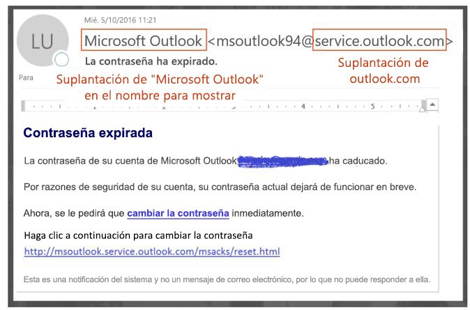
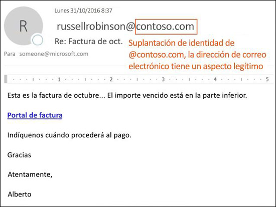
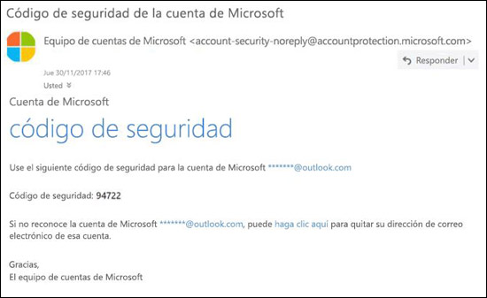

# Protección contra la suplantación de identidad en EOP

[!INCLUDE [Microsoft 365 Defender rebranding](../includes/microsoft-defender-for-office.md)]

En las organizaciones de Microsoft 365 con buzones de correo de Exchange Online o las organizaciones independientes de Exchange Online Protection (EOP) que no tienen buzones de Exchange Online, EOP incluye características para ayudarle a proteger su organización frente a remitentes falsificados.

Cuando se trata de proteger a sus usuarios, Microsoft se toma muy en serio las amenazas de suplantación de identidad. La suplantación es una técnica común usada por atacantes. **Los mensajes falsificados parecen provenir de una persona o un lugar distinto a la fuente real**. Esta técnica se usa a menudo en campañas de suplantación de identidad (phishing), diseñadas para obtener credenciales de usuarios. La tecnología contra la suplantación de identidad en EOP examina específicamente la posible falsificación del encabezado De en el cuerpo del mensaje (que se usa para mostrar el remitente del mensaje en los clientes de correo electrónico). Cuando EOP confía mucho en que el encabezado De es falso, el mensaje se identifica como falso.

Las siguientes tecnologías contra la suplantación de identidad están disponibles en EOP:

- **Inteligencia contra la suplantación de identidad**: revisa mensajes falsificados de remitentes en dominios internos y externos y permite o bloquea el acceso de los remitentes. Para obtener más información, consulte [Configuración de inteligencia contra la suplantación de identidad en Microsoft 365 ](learn-about-spoof-intelligence.md).

- **Directivas contra la suplantación de identidad**: en EOP, las directivas contra la suplantación de identidad le permiten activar o desactivar la inteligencia contra la suplantación de identidad, activar o desactivar la identificación de remitente no autenticado en Outlook, y especificar la acción para remitentes falsos bloqueados (mover a la carpeta de correo no deseado o a cuarentena). Las directivas avanzadas contra el phishing disponibles en Microsoft Defender para Office 365 también contienen la configuración de protección contra la suplantación (remitentes y dominios protegidos), la configuración de inteligencia de buzón y umbrales de suplantación de identidad avanzados ajustables. Para obtener más información, consulte [Directivas contra la suplantación de identidad en Microsoft 365 ](set-up-anti-phishing-policies.md).

- **Autenticación de correo electrónico**: una parte integral de cualquier esfuerzo contra la suplantación de identidad es el uso de la autenticación de correo electrónico (también conocida como validación de correo electrónico) por registros de DMARC, DKIM y DMARC en DNS. Puede configurar estos registros para sus dominios, de modo que los sistemas de correo electrónico de destino puedan comprobar la validez de los mensajes que requieran que se envíen a los remitentes de su dominio. Para los mensajes entrantes, Microsoft 365 requiere la autenticación de correo electrónico para los dominios de remitente. Para obtener más información, consulte [Autenticación de correo electrónico de Microsoft 365](email-validation-and-authentication.md).

A partir de octubre del 2018, la protección contra la suplantación de identidad está disponible en EOP.

EOP analiza y bloquea los mensajes que no se pueden autenticar con la combinación de métodos de autenticación de correo electrónico estándar y técnicas de reputación del remitente.

## Uso de la suplantación de identidad (spoofing) en ataques de phishing

Los mensajes de suplantación de identidad tienen estas implicaciones negativas para los usuarios:

- **Los mensajes falsificados engañan a los usuarios**: un mensaje falsificado puede engañar al destinatario para que haga clic en un vínculo y proporcione sus credenciales, descargue malware o responda a un mensaje con contenido confidencial (conocido como Business Email Compromise: compromiso de correo electrónico empresarial o BEC).

  Por ejemplo, el siguiente es un ejemplo de suplantación de identidad que usa el remitente falsificado msoutlook94@service.outlook.com:

  

  Este mensaje no proviene de service.outlook.com, pero el atacante ha falsificado el campo de encabezado **De** para que parezca que es así. Este era un intento de engañar al destinatario para que hiciese clic en el vínculo **cambiar la contraseña** y proporcionase sus credenciales.

  El siguiente mensaje es un ejemplo de BEC que usa el dominio de correo electrónico falsificado contoso.com:

  

  El mensaje parece legítimo, pero el remitente es falso.

- **Los usuarios confunden mensajes reales con falsos**: incluso los usuarios que sepan acerca de la suplantación de identidad podrían tener dificultades para ver las diferencias entre los mensajes reales y los mensajes falsificados.

  El siguiente mensaje es un ejemplo de un mensaje de restablecimiento de contraseña real desde la cuenta de Microsoft Security:

  

  El mensaje procede de Microsoft, pero los usuarios se han acostumbrado a sospechar. Como es difícil notar la diferencia entre un mensaje de restablecimiento de contraseña verdadero y uno falso, los usuarios pueden ignorar estos mensajes, marcarlos como correo no deseado o informar innecesariamente sobre ellos a Microsoft como intentos de suplantaciones de identidad.

## Distintos tipos de suplantación

Microsoft distingue entre dos tipos de mensajes falsificados:

- **Suplantación de identidad en la organización**: también conocida como _suplantación de identidad propia_. Por ejemplo:

  - El remitente y el destinatario están en el mismo dominio:
    > De: jose@contoso.com   Para: carla@contoso.com

  - El remitente y el destinatario están en subdominios del mismo dominio:
    > De: laura@marketing.fabrikam.com   Para: julia@engineering.fabrikam.com

  - El remitente y el destinatario están en dominios diferentes que pertenecen a la misma organización (es decir, los dos dominios están configurados como [dominios aceptados](https://docs.microsoft.com/exchange/mail-flow-best-practices/manage-accepted-domains/manage-accepted-domains) en la misma organización):
    > De: remitente @ microsoft.com   Para: destinatario @ bing.com

    Los espacios se usan en las direcciones de correo electrónico para evitar la recolección de bots de correo no deseado.

  Los mensajes que producen un error de [autenticación compuesta](email-validation-and-authentication.md#composite-authentication) debido a la suplantación de identidad dentro de la organización contienen los siguientes valores en los encabezados:

  `Authentication-Results: ... compauth=fail reason=6xx`

  `X-Forefront-Antispam-Report: ...CAT:SPOOF;...SFTY:9.11`

  - `reason=6xx` indica suplantación de identidad dentro de la organización.

  - SFTY es el nivel de seguridad del mensaje. 9 indica suplantación de identidad (phishing), .11 indica suplantación dentro de la organización.

- **Suplantación entre dominios**: los dominios del remitente y el destinatario son distintos, y no tienen ninguna relación entre sí (también conocidos como dominios externos). Por ejemplo:
    > De: jose@contoso.com   Para: carla@tailspintoys.com

  Los mensajes que producen un error de [autenticación compuesta](email-validation-and-authentication.md#composite-authentication) debido a la suplantación de identidad entre dominios contienen los siguientes valores en los encabezados:

  `Authentication-Results: ... compauth=fail reason=000/001`

  `X-Forefront-Antispam-Report: ...CAT:SPOOF;...SFTY:9.22`

  - `reason=000` indica que el mensaje falló en la autentificación explícita del correo electrónico. `reason=001` indica que el mensaje ha producido un error de autenticación de correo electrónico implícita.

  - SFTY es el nivel de seguridad del mensaje. 9 indica suplantación de identidad (phishing), .22 indica suplantación entre dominios.

Para obtener más información acerca de los valores de la categoría y de la autenticación compuesta (compauth) relacionados con la suplantación de identidad, consulte [Encabezados de mensajes contra correo no deseado en Microsoft 365](anti-spam-message-headers.md).

Para obtener más información acerca de la configuración de DMARC, consulte [Usar DMARC para comprobar el correo electrónico en Microsoft 365](use-dmarc-to-validate-email.md).

## Informes acerca de cuántos mensajes se marcan como falsificados

Las organizaciones de EOP pueden usar el informe de **Detecciones de suplantación** en el panel de Informes del Centro de seguridad y cumplimiento. Para obtener más información, consulte [Informe de detecciones de suplantación](view-email-security-reports.md#spoof-detections-report).

La organización de Microsoft Defender para Office 365 puede usar el explorador de amenazas en el Centro de seguridad y cumplimiento para ver información acerca de los intentos de phishing. Para obtener más información, consulte [Investigación y respuesta frente a amenazas de Microsoft 365](office-365-ti.md).

## Problemas con la protección contra la suplantación de identidad

Se sabe que las listas de correo (también conocidas como listas de discusión) tienen problemas con la protección contra la suplantación debido a la forma en que reenvían y modifican mensajes.

Por ejemplo, Gabriela Laureano (glaureano@contoso.com) está interesada en la observación de aves, se une a la lista de correo observadoresdeaves@fabrikam.com y envía el siguiente mensaje a la lista:.

> **De:** "Gabriela Laureano" \<glaureano@contoso.com\>   **Para:** Lista de discusión de observadores de aves \<birdwatchers@fabrikam.com\>   **Asunto:** Excelente vista de arrendajos azules en la cima del Monte Rainier esta semana 
 ¿Alguien quiere echar un vistazo a la vista de esta semana desde el Monte Rainier?

El servidor de la lista de distribución de correo recibe el mensaje, modifica su contenido y lo reproduce para los miembros de la lista. El mensaje reproducido tiene la misma dirección De: (glaureano@contoso.com), pero se han agregado una etiqueta en la línea de asunto y un pie de página en la parte inferior del mensaje. Este tipo de modificación es común en las listas de distribución de correo y puede producir falsos positivos de suplantación de identidad.

> **De:** "Gabriela Laureano" \<glaureano@contoso.com\>   **Para:** Lista de discusión de observadores de aves \<birdwatchers@fabrikam.com\>   **Asunto:** [OBSERVADORESDEAVES] Excelente vista de arrendajos azules en la cima del Monte Rainier esta semana 
 ¿Alguien quiere echar un vistazo a la vista de esta semana desde el Monte Rainier? 
 Este mensaje se envió a la lista de discusión de observadores de aves. Puede cancelar la suscripción en cualquier momento.

Para ayudar a que los mensajes de la lista de distribución de correo pasen las comprobaciones contra la suplantación, siga los pasos siguientes en función de si controla la lista de distribución de correo:

- La organización es propietaria de la lista de distribución de correo:

  - Consulte las preguntas más frecuentes en DMARC.org: [Manejo una lista de distribución de correo y quiero interactúan con DMARC, ¿qué debo hacer?](https://dmarc.org/wiki/FAQ#I_operate_a_mailing_list_and_I_want_to_interoperate_with_DMARC.2C_what_should_I_do.3F)

  - Lea las instrucciones en esta entrada de blog: [Una sugerencia para los operadores de la lista de distribución de correo para interactuar con DMARC sin errores](https://blogs.msdn.microsoft.com/tzink/2017/03/22/a-tip-for-mailing-list-operators-to-interoperate-with-dmarc-to-avoid-failures/).

  - Considere instalar las actualizaciones en el servidor de la lista de distribución de correo para admitir ARC, vea <http://arc-spec.org>.

- La organización no es propietaria de la lista de distribución de correo:

  - Pida al encargado de la lista de distribución de correo que configure la autenticación de correo electrónico para el dominio desde el que se reenvía la lista de distribución de correo.

    Cuando hay suficientes remitentes que responden a los propietarios de dominios pidiéndoles que configuren los registros de autenticación de correo electrónico, es más probable que tomen medidas. Aunque Microsoft también trabaja con los propietarios de dominios para publicar los registros necesarios, es aún más efectivo cuando los usuarios individuales lo solicitan.

  - Cree reglas de buzón en el cliente de correo para mover mensajes a la Bandeja de entrada. También puede pedir a los administradores que configuren las sustituciones, tal como se describe en [Uso de la inteligencia contra la suplantación de identidad para configurar remitentes permitidos de correo electrónico no autenticado](email-validation-and-authentication.md#use-spoof-intelligence-to-configure-permitted-senders-of-unauthenticated-email).

  - Cree un vale de soporte con Microsoft 365 para crear una invalidación de la lista de distribución de correo y usarla como legítima. Para obtener más información, consulte [Ponerse en contacto con el soporte técnico para productos empresariales: ayuda para administradores](../../admin/contact-support-for-business-products.md).

Si todos los demás falla, puede notificar el mensaje como falso positivo a Microsoft. Para obtener más información, consulte [Notificar mensajes y archivos a Microsoft](report-junk-email-messages-to-microsoft.md).

También puede contactar con el administrador que puede crear una incidencia de soporte técnico para Microsoft. El equipo de ingeniería de Microsoft investigará por qué el mensaje se marcó como una suplantación de identidad.

## Consideraciones para la protección contra la suplantación de identidad

Si es un administrador que actualmente envía mensajes a Microsoft 365, debe asegurarse de que el correo electrónico se haya autenticado correctamente. En caso contrario, es posible que se marque como correo no deseado o phishing. Para obtener más información, consulte [Soluciones para remitentes legítimos que envían correo electrónico sin autenticar](email-validation-and-authentication.md#solutions-for-legitimate-senders-who-are-sending-unauthenticated-email).

Los remitentes en la lista de remitentes seguros de un usuario individual (o administrador) omitirán partes de la pila de filtrado, incluida la protección contra la suplantación electrónica. Para más información, consulte [Remitentes seguros de Outlook](create-safe-sender-lists-in-office-365.md#use-outlook-safe-senders).

Los administradores deben evitar (siempre que sea posible) el uso de listas de remitentes permitidos o de dominios permitidos. Estos remitentes omiten toda la protección contra correo no deseado, suplantación electrónica, protección contra phishing y autenticación de remitente (SPF, DKIM, DMARC). Para más información, consulte [Usar listas de remitentes permitidos o listas de dominios permitidos](create-safe-sender-lists-in-office-365.md#use-allowed-sender-lists-or-allowed-domain-lists).
