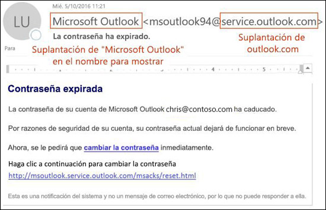

# Protección contra la suplantación de identidad en EOPAnti-spoofing protection in EOP

En las organizaciones de Microsoft 365 con buzones de correo de Exchange Online o las organizaciones independientes de Exchange Online Protection (EOP) que no tienen buzones de Exchange Online, EOP incluye características para ayudarle a proteger su organización frente a remitentes falsificados.In Microsoft 365 organizations with mailboxes in Exchange Online or standalone Exchange Online Protection (EOP) organizations without Exchange Online mailboxes, EOP includes features to help protect your organization from spoofed (forged) senders.

Cuando se trata de proteger a sus usuarios, Microsoft se toma muy en serio las amenazas de suplantación de identidad.When it comes to protecting its users, Microsoft takes the threat of phishing seriously. La suplantación es una técnica común usada por atacantes.Spoofing is a common technique that's used by attackers. **Los mensajes falsificados parecen provenir de una persona o un lugar distinto a la fuente real**.**Spoofed messages appear to originate from someone or somewhere other than the actual source**. Esta técnica se usa a menudo en campañas de suplantación de identidad (phishing), diseñadas para obtener credenciales de usuarios.This technique is often used in phishing campaigns that are designed to obtain user credentials. La tecnología contra la suplantación de identidad en EOP examina específicamente la posible falsificación del encabezado De en el cuerpo del mensaje (que se usa para mostrar el remitente del mensaje en los clientes de correo electrónico).The anti-spoofing technology in EOP specifically examines forgery of the From header in the message body (used to display the message sender in email clients). Cuando EOP confía mucho en que el encabezado De es falso, el mensaje se identifica como falso.When EOP has high confidence that the From header is forged, the message is identified as spoofed.

Las siguientes tecnologías contra la suplantación de identidad están disponibles en EOP:The following anti-spoofing technologies are available in EOP:

- **Inteligencia contra la suplantación de identidad**: revisa mensajes falsificados de remitentes en dominios internos y externos y permite o bloquea el acceso de los remitentes.**Spoof intelligence**: Review spoofed messages from senders in internal and external domains, and allow or block those senders. Para obtener más información, consulte [Configuración de inteligencia contra la suplantación de identidad en Microsoft 365 ](learn-about-spoof-intelligence.md).For more information, see [Configure spoof intelligence in Microsoft 365](learn-about-spoof-intelligence.md).

- **Directivas contra la suplantación de identidad**: en EOP, las directivas contra la suplantación de identidad le permiten activar o desactivar la inteligencia contra la suplantación de identidad, activar o desactivar la identificación de remitente no autenticado en Outlook, y especificar la acción para remitentes falsos bloqueados (mover a la carpeta de correo no deseado o a cuarentena).**Anti-phishing policies**: In EOP, anti-phishing policies allow you to turn spoof intelligence on or off, turn unauthenticated sender identification in Outlook on or off, and specify the action for blocked spoofed senders (move to the Junk Email folder or quarantine). Las directivas avanzadas contra la suplantación de identidad disponibles en la protección contra amenazas avanzada de Office 365 (Office 365 ATP) también contienen la configuración de protección contra la suplantación (remitentes y dominios protegidos), la configuración de inteligencia de buzón y umbrales de suplantación de identidad avanzados ajustables.Advanced anti-phishing policies that are available in Office 365 Advanced Threat Protection (Office 365 ATP) also contain anti-impersonation settings (protected senders and domains), mailbox intelligence settings, and adjustable advanced phishing thresholds. Para obtener más información, consulte [Directivas contra la suplantación de identidad en Microsoft 365 ](set-up-anti-phishing-policies.md).For more information, see [Anti-phishing policies in Microsoft 365](set-up-anti-phishing-policies.md).

- **Autenticación de correo electrónico**: una parte integral de cualquier esfuerzo contra la suplantación de identidad es el uso de la autenticación de correo electrónico (también conocida como validación de correo electrónico) por registros de DMARC, DKIM y DMARC en DNS.**Email authentication**: An integral part of any anti-spoofing effort is the use of email authentication (also known as email validation) by SPF, DKIM, and DMARC records in DNS. Puede configurar estos registros para sus dominios, de modo que los sistemas de correo electrónico de destino puedan comprobar la validez de los mensajes que requieran que se envíen a los remitentes de su dominio.You can configure these records for your domains so destination email systems can check the validity of messages that claim to be from senders in your domains. Para los mensajes entrantes, Microsoft 365 requiere la autenticación de correo electrónico para los dominios de remitente.For inbound messages, Microsoft 365 requires email authentication for sender domains. Para obtener más información, consulte [Autenticación de correo electrónico de Microsoft 365](email-validation-and-authentication.md).For more information, see [Email authentication in Microsoft 365](email-validation-and-authentication.md).

A partir de octubre del 2018, la protección contra la suplantación de identidad está disponible en EOP.As of October 2018, anti-spoofing protection is available in EOP. Antes, la protección contra la suplantación de identidad solo estaba disponible en organizaciones con ATP de Office 365.Before then, anti-spoofing protection was only available in organizations with Office 365 ATP.

EOP analiza y bloquea los mensajes que no se pueden autenticar con la combinación de métodos de autenticación de correo electrónico estándar y técnicas de reputación del remitente.EOP analyzes and blocks messages that can't be authenticated by the combination of standard email authentication methods and sender reputation techniques.

## Uso de la suplantación de identidad (spoofing) en ataques de phishingHow spoofing is used in phishing attacks

Los mensajes de suplantación de identidad tienen estas implicaciones negativas para los usuarios:Spoofing messages have the following negative implications for users:

- **Los mensajes falsificados engañan a los usuarios**: un mensaje falsificado puede engañar al destinatario para que haga clic en un vínculo y proporcione sus credenciales, descargue malware o responda a un mensaje con contenido confidencial (conocido como Business Email Compromise: compromiso de correo electrónico empresarial o BEC).**Spoofed messages deceive users**: A spoofed message might trick the recipient into clicking a link and giving up their credentials, downloading malware, or replying to a message with sensitive content (known as a business email compromise or BEC).

  Por ejemplo, el siguiente es un ejemplo de suplantación de identidad que usa el remitente falsificado msoutlook94@service.outlook.com:The following message is an example of phishing that uses the spoofed sender msoutlook94@service.outlook.com:

  

  Este mensaje no proviene de service.outlook.com, pero el atacante ha falsificado el campo de encabezado **De** para que parezca que es así.This message didn't come from service.outlook.com, but the attacker spoofed the **From** header field to make it look like it did. Este era un intento de engañar al destinatario para que hiciese clic en el vínculo **cambiar la contraseña** y proporcionase sus credenciales.This was an attempt to trick the recipient into clicking the **change your password** link and giving up their credentials.

  El siguiente mensaje es un ejemplo de BEC que usa el dominio de correo electrónico falsificado contoso.com:The following message is an example of BEC that uses the spoofed email domain contoso.com:

  

  El mensaje parece legítimo, pero el remitente es falso.The message looks legitimate, but the sender is spoofed.

- **Los usuarios confunden mensajes reales con falsos**: incluso los usuarios que sepan acerca de la suplantación de identidad podrían tener dificultades para ver las diferencias entre los mensajes reales y los mensajes falsificados.**Users confuse real messages for fake ones**: Even users who know about phishing might have difficulty seeing the differences between real messages and spoofed messages.

  El siguiente mensaje es un ejemplo de un mensaje de restablecimiento de contraseña real desde la cuenta de Microsoft Security:The following message is an example of a real password reset message from the Microsoft Security account:

  

  El mensaje procede de Microsoft, pero los usuarios se han acostumbrado a sospechar.The message really did come from Microsoft, but users have been conditioned to be suspicious. Como es difícil notar la diferencia entre un mensaje de restablecimiento de contraseña verdadero y uno falso, los usuarios pueden ignorar estos mensajes, marcarlos como correo no deseado o informar innecesariamente sobre ellos a Microsoft como intentos de suplantaciones de identidad.Because it's difficult to the difference between a real password reset message and a fake one, users might ignore the message, report it as spam, or unnecessarily report the message to Microsoft as phishing.

## Distintos tipos de suplantaciónDifferent types of spoofing

Microsoft distingue entre dos tipos de mensajes falsificados:Microsoft differentiates between two different types of spoofed messages:

- **Suplantación de identidad en la organización**: también conocida como _suplantación de identidad propia_.**Intra-org spoofing**: Also known as _self-to-self_ spoofing. Por ejemplo:For example:

  - El remitente y el destinatario están en el mismo dominio:The sender and recipient are in the same domain:
    > De: jose@contoso.comFrom: chris@contoso.com   Para: carla@contoso.comTo: michelle@contoso.com

  - El remitente y el destinatario están en subdominios del mismo dominio:The sender and the recipient are in subdomains of the same domain:
    > De: laura@marketing.fabrikam.comFrom: laura@marketing.fabrikam.com   Para: julia@engineering.fabrikam.comTo: julia@engineering.fabrikam.com

  - El remitente y el destinatario están en dominios diferentes que pertenecen a la misma organización (es decir, los dos dominios están configurados como [dominios aceptados](https://docs.microsoft.com/exchange/mail-flow-best-practices/manage-accepted-domains/manage-accepted-domains) en la misma organización):The sender and recipient are in different domains that belong to the same organization (that is, both domains are configured as [accepted domains](https://docs.microsoft.com/exchange/mail-flow-best-practices/manage-accepted-domains/manage-accepted-domains) in the same organization):
    > De: remitente @ microsoft.comFrom: sender @ microsoft.com   Para: destinatario @ bing.comTo: recipient @ bing.com

    Los espacios se usan en las direcciones de correo electrónico para evitar la recolección de bots de correo no deseado.Spaces are used in the email addresses to prevent spambot harvesting.

  Los mensajes que producen un error de [autenticación compuesta](email-validation-and-authentication.md#composite-authentication) debido a la suplantación de identidad dentro de la organización contienen los siguientes valores en los encabezados:Messages that fail [composite authentication](email-validation-and-authentication.md#composite-authentication) due to intra-org spoofing contain the following header values:

  `Authentication-Results: ... compauth=fail reason=6xx`

  `X-Forefront-Antispam-Report: ...CAT:SPOOF;...SFTY:9.11`

  - `reason=6xx` indica suplantación de identidad dentro de la organización.`reason=6xx` indicates intra-org spoofing.

  - SFTY es el nivel de seguridad del mensaje.SFTY is the safety level of the message. 9 indica suplantación de identidad (phishing), .11 indica suplantación dentro de la organización.9 indicates phishing, .11 indicates intra-org spoofing.

- **Suplantación entre dominios**: los dominios del remitente y el destinatario son distintos, y no tienen ninguna relación entre sí (también conocidos como dominios externos).**Cross-domain spoofing**: The sender and recipient domains are different, and have no relationship to each other (also known as external domains). Por ejemplo:For example:
    > De: jose@contoso.comFrom: chris@contoso.com   Para: carla@tailspintoys.comTo: michelle@tailspintoys.com

  Los mensajes que producen un error de [autenticación compuesta](email-validation-and-authentication.md#composite-authentication) debido a la suplantación de identidad entre dominios contienen los siguientes valores en los encabezados:Messages that fail [composite authentication](email-validation-and-authentication.md#composite-authentication) due to cross-domain spoofing contain the following headers values:

  `Authentication-Results: ... compauth=fail reason=000/001`

  `X-Forefront-Antispam-Report: ...CAT:SPOOF;...SFTY:9.22`

  - `reason=000` indica que el mensaje falló en la autentificación explícita del correo electrónico.`reason=000` indicates the message failed explicit email authentication. `reason=001` indica que el mensaje ha producido un error de autenticación de correo electrónico implícita.`reason=001` indicates the message failed implicit email authentication.

  - SFTY es el nivel de seguridad del mensaje.SFTY is the safety level of the message. 9 indica suplantación de identidad (phishing), .22 indica suplantación entre dominios.9 indicates phishing, .22 indicates cross-domain spoofing.

Para obtener más información acerca de los valores de la categoría y de la autenticación compuesta (compauth) relacionados con la suplantación de identidad, consulte [Encabezados de mensajes contra correo no deseado en Microsoft 365](anti-spam-message-headers.md).For more information about the Category and composite authentication (compauth) values that are related to spoofing, see [Anti-spam message headers in Microsoft 365](anti-spam-message-headers.md).

Para obtener más información acerca de la configuración de DMARC, consulte [Usar DMARC para comprobar el correo electrónico en Microsoft 365](use-dmarc-to-validate-email.md).For more information about DMARC, see [Use DMARC to validate email in Microsoft 365](use-dmarc-to-validate-email.md).

## Informes acerca de cuántos mensajes se marcan como falsificadosReports of how many messages were marked as spoofed

Las organizaciones de EOP pueden usar el informe de **Detecciones de suplantación** en el panel de Informes del Centro de seguridad y cumplimiento.EOP organizations can use the **Spoof detections** report in the Reports dashboard in the Security & Compliance Center. Para obtener más información, consulte [Informe de detecciones de suplantación](view-email-security-reports.md#spoof-detections-report).For more information, see [Spoof Detections report](view-email-security-reports.md#spoof-detections-report).

La organización de ATP de Office 365 puede usar el explorador de amenazas en el Centro de seguridad y cumplimiento para ver información acerca de los intentos de suplantación de identidad.Office 365 ATP organization can use Threat Explorer in the Security & Compliance Center to view information about phishing attempts. Para obtener más información, consulte [Investigación y respuesta frente a amenazas de Microsoft 365](office-365-ti.md).For more information, see [Microsoft 365 threat investigation and response](office-365-ti.md).

## Problemas con la protección contra la suplantación de identidadProblems with anti-spoofing protection

Se sabe que las listas de correo (también conocidas como listas de discusión) tienen problemas con la protección contra la suplantación debido a la forma en que reenvían y modifican mensajes.Mailing lists (also known as discussion lists) are known to have problems with anti-spoofing due to the way they forward and modify messages.

Por ejemplo, Gabriela Laureano (glaureano@contoso.com) está interesada en la observación de aves, se une a la lista de correo observadoresdeaves@fabrikam.com y envía el siguiente mensaje a la lista:.For example, Gabriela Laureano (glaureano@contoso.com) is interested in bird watching, joins the mailing list birdwatchers@fabrikam.com, and sends the following message to the list:

> **De:** "Gabriela Laureano" \<glaureano@contoso.com\>**From:** "Gabriela Laureano" \<glaureano@contoso.com\>   **Para:** Lista de discusión de observadores de aves \<birdwatchers@fabrikam.com\>**To:** Birdwatcher's Discussion List \<birdwatchers@fabrikam.com\>   **Asunto:** Excelente vista de arrendajos azules en la cima del Monte**Subject:** Great viewing of blue jays at the top of Mt. Rainier esta semanaRainier this week   ¿Alguien quiere echar un vistazo a la vista de esta semana desde el MonteAnyone want to check out the viewing this week from Mt. Rainier?Rainier?

El servidor de la lista de distribución de correo recibe el mensaje, modifica su contenido y lo reproduce para los miembros de la lista.The mailing list server receives the message, modifies its content, and replays it to the members of list. El mensaje reproducido tiene la misma dirección De: (glaureano@contoso.com), pero se han agregado una etiqueta en la línea de asunto y un pie de página en la parte inferior del mensaje.The replayed message has the same From address (glaureano@contoso.com), but a tag is added to the subject line, and a footer is added to the bottom of the message. Este tipo de modificación es común en las listas de distribución de correo y puede producir falsos positivos de suplantación de identidad.This type of modification is common in mailing lists, and may result in false positives for spoofing.

> **De:** "Gabriela Laureano" \<glaureano@contoso.com\>**From:** "Gabriela Laureano" \<glaureano@contoso.com\>   **Para:** Lista de discusión de observadores de aves \<birdwatchers@fabrikam.com\>**To:** Birdwatcher's Discussion List \<birdwatchers@fabrikam.com\>   **Asunto:** [OBSERVADORESDEAVES] Excelente vista de arrendajos azules en la cima del Monte**Subject:** [BIRDWATCHERS] Great viewing of blue jays at the top of Mt. Rainier esta semanaRainier this week    ¿Alguien quiere echar un vistazo a la vista de esta semana desde el MonteAnyone want to check out the viewing this week from Mt. Rainier?Rainier?    Este mensaje se envió a la lista de discusión de observadores de aves.This message was sent to the Birdwatchers Discussion List. Puede cancelar la suscripción en cualquier momento.You can unsubscribe at any time.

Para ayudar a que los mensajes de la lista de distribución de correo pasen las comprobaciones contra la suplantación, siga los pasos siguientes en función de si controla la lista de distribución de correo:To help mailing list messages pass anti-spoofing checks, do following steps based on whether you control the mailing list:

- La organización es propietaria de la lista de distribución de correo:Your organization owns the mailing list:

  - Consulte las preguntas más frecuentes en DMARC.org: [Manejo una lista de distribución de correo y quiero interactúan con DMARC, ¿qué debo hacer?](https://dmarc.org/wiki/FAQ#I_operate_a_mailing_list_and_I_want_to_interoperate_with_DMARC.2C_what_should_I_do.3F)Check the FAQ at DMARC.org: [I operate a mailing list and I want to interoperate with DMARC, what should I do?](https://dmarc.org/wiki/FAQ#I_operate_a_mailing_list_and_I_want_to_interoperate_with_DMARC.2C_what_should_I_do.3F).

  - Lea las instrucciones en esta entrada de blog: [Una sugerencia para los operadores de la lista de distribución de correo para interactuar con DMARC sin errores](https://blogs.msdn.microsoft.com/tzink/2017/03/22/a-tip-for-mailing-list-operators-to-interoperate-with-dmarc-to-avoid-failures/).Read the instructions at this blog post: [A tip for mailing list operators to interoperate with DMARC to avoid failures](https://blogs.msdn.microsoft.com/tzink/2017/03/22/a-tip-for-mailing-list-operators-to-interoperate-with-dmarc-to-avoid-failures/).

  - Considere instalar las actualizaciones en el servidor de la lista de distribución de correo para admitir ARC, vea [https://arc-spec.org](https://arc-spec.org/)Consider installing updates on your mailing list server to support ARC, see [https://arc-spec.org](https://arc-spec.org/)

- La organización no es propietaria de la lista de distribución de correo:Your organization doesn't own the mailing list:

  - Pida al encargado de la lista de distribución de correo que configure la autenticación de correo electrónico para el dominio desde el que se reenvía la lista de distribución de correo.Ask the maintainer of the mailing list to configure email authentication for the domain that the mailing list is relaying from.

    Cuando hay suficientes remitentes que responden a los propietarios de dominios pidiéndoles que configuren los registros de autenticación de correo electrónico, es más probable que tomen medidas.When enough senders reply back to domain owners that they should set up email authentication records, it spurs them into taking action. Aunque Microsoft también trabaja con los propietarios de dominios para publicar los registros necesarios, es aún más efectivo cuando los usuarios individuales lo solicitan.While Microsoft also works with domain owners to publish the required records, it helps even more when individual users request it.

  - Cree reglas de buzón en el cliente de correo para mover mensajes a la Bandeja de entrada.Create inbox rules in your email client to move messages to the Inbox. También puede pedir a los administradores que configuren las sustituciones, tal como se describe en [Uso de la inteligencia contra la suplantación de identidad para configurar remitentes permitidos de correo electrónico no autenticado](email-validation-and-authentication.md#use-spoof-intelligence-to-configure-permitted-senders-of-unauthenticated-email).You can also ask your admins to configure overrides as discussed in the [Use spoof intelligence to configure permitted senders of unauthenticated email](email-validation-and-authentication.md#use-spoof-intelligence-to-configure-permitted-senders-of-unauthenticated-email).

  - Cree un vale de soporte con Microsoft 365 para crear una invalidación de la lista de distribución de correo y usarla como legítima.Create a support ticket with Microsoft 365 to create an override for the mailing list to treat it as legitimate. Para obtener más información, consulte [Ponerse en contacto con el soporte técnico para productos empresariales: ayuda para administradores](../../admin/contact-support-for-business-products.md).For more information, see [Contact support for business products - Admin Help](../../admin/contact-support-for-business-products.md).

Si todos los demás falla, puede notificar el mensaje como falso positivo a Microsoft.If all else fails, you can report the message as a false positive to Microsoft. Para obtener más información, consulte [Notificar mensajes y archivos a Microsoft](report-junk-email-messages-to-microsoft.md).For more information, see [Report messages and files to Microsoft](report-junk-email-messages-to-microsoft.md).

También puede contactar con el administrador que puede crear una incidencia de soporte técnico para Microsoft.You may also contact your admin who can raise it as a support ticket with Microsoft. El equipo de ingeniería de Microsoft investigará por qué el mensaje se marcó como una suplantación de identidad.The Microsoft engineering team will investigate why the message was marked as a spoof.

## Consideraciones para la protección contra la suplantación de identidadConsiderations for anti-spoofing protection

Si es un administrador que actualmente envía mensajes a Microsoft 365, debe asegurarse de que el correo electrónico se haya autenticado correctamente.If you're an admin who currently sends messages to Microsoft 365, you need to ensure that your email is properly authenticated. En caso contrario, es posible que se marque como correo no deseado o suplantación de identidad.Otherwise, it might be marked as spam or phish. Para obtener más información, consulte [Soluciones para remitentes legítimos que envían correo electrónico sin autenticar](email-validation-and-authentication.md#solutions-for-legitimate-senders-who-are-sending-unauthenticated-email).For more information, see [Solutions for legitimate senders who are sending unauthenticated email](email-validation-and-authentication.md#solutions-for-legitimate-senders-who-are-sending-unauthenticated-email).

Los remitentes en la lista de remitentes seguros de un usuario individual (o administrador) omitirán partes de la pila de filtrado, incluida la protección contra la suplantación electrónica.Senders in an individual user's (or admin's) Safe Senders list will bypass parts of the filtering stack, including spoof protection. Para más información, consulte [Remitentes seguros de Outlook](create-safe-sender-lists-in-office-365.md#use-outlook-safe-senders).For more information, see [Outlook Safe Senders](create-safe-sender-lists-in-office-365.md#use-outlook-safe-senders).

Los administradores deben evitar (siempre que sea posible) el uso de listas de remitentes permitidos o de dominios permitidos.Admins should avoid (when possible) using allowed sender lists or allowed domain lists. Estos remitentes omiten toda la protección contra correo no deseado, suplantación electrónica, protección contra phishing y autenticación de remitente (SPF, DKIM, DMARC).These senders bypass all spam, spoofing, and phishing protection, and also sender authentication (SPF, DKIM, DMARC). Para más información, consulte [Usar listas de remitentes permitidos o listas de dominios permitidos](create-safe-sender-lists-in-office-365.md#use-allowed-sender-lists-or-allowed-domain-lists).For more information, see [Use allowed sender lists or allowed domain lists](create-safe-sender-lists-in-office-365.md#use-allowed-sender-lists-or-allowed-domain-lists).
