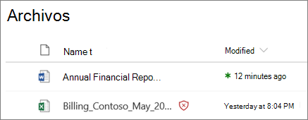
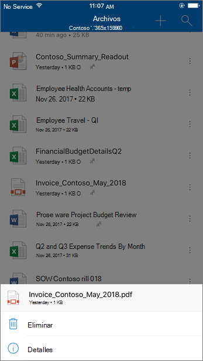
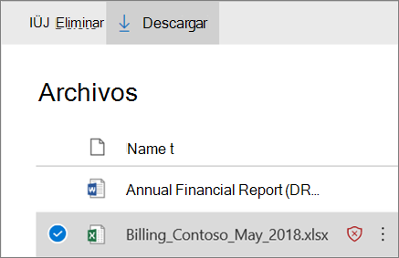

# ATP para SharePoint, OneDrive y Microsoft TeamsATP for SharePoint, OneDrive, and Microsoft Teams

[!INCLUDE [Microsoft 365 Defender rebranding](../includes/microsoft-defender-for-office.md)]

ATP para SharePoint, OneDrive y Microsoft Teams en [Office 365 Advanced Threat Protection (ATP)](office-365-atp.md) proporciona una capa adicional de protección para los archivos que el [motor de detección de virus Common](virus-detection-in-spo.md)ha examinado en el momento de la carga en Microsoft 365.ATP for SharePoint, OneDrive, and Microsoft Teams in [Office 365 Advanced Threat Protection (ATP)](office-365-atp.md) provides an additional layer of protection for files that have already been scanned at upload time by the [common virus detection engine in Microsoft 365](virus-detection-in-spo.md). ATP para SharePoint, OneDrive y Microsoft Teams ayuda a detectar y bloquear los archivos existentes identificados como malintencionados en los sitios de grupo y las bibliotecas de documentos.ATP for SharePoint, OneDrive, and Microsoft Teams helps detect and block existing files that are identified as malicious in team sites and document libraries.

ATP para SharePoint, OneDrive y Microsoft Teams no está habilitada de forma predeterminada.ATP for SharePoint, OneDrive, and Microsoft Teams is not enabled by default. Para activarla, consulte [Activar ATP para SharePoint, OneDrive y Microsoft Teams](turn-on-atp-for-spo-odb-and-teams.md).To turn it on, see [Turn on ATP for SharePoint, OneDrive, and Microsoft Teams](turn-on-atp-for-spo-odb-and-teams.md).

## Cómo funciona ATP para SharePoint, OneDrive y Microsoft TeamsHow ATP for SharePoint, OneDrive, and Microsoft Teams works

Cuando ATP para SharePoint, OneDrive y Microsoft Teams está habilitado e identifica un archivo como malintencionado, el archivo se bloquea mediante la integración directa con los almacenes de archivos.When ATP for SharePoint, OneDrive, and Microsoft Teams is enabled and identifies a file as malicious, the file is locked using direct integration with the file stores. La imagen siguiente muestra un ejemplo de un archivo malintencionado detectado en una biblioteca.The following image shows an example of a malicious file detected in a library.

Aunque el archivo bloqueado todavía aparece en la biblioteca de documentos y en las aplicaciones Web, móviles o de escritorio, los usuarios no pueden abrir, copiar, mover ni compartir el archivo.Although the blocked file is still listed in the document library and in web, mobile, or desktop applications, people can't open, copy, move, or share the file. Pero pueden eliminar el archivo bloqueado.But they can delete the blocked file.

Este es un ejemplo de la apariencia de un archivo bloqueado en un dispositivo móvil:Here's an example of what a blocked file looks like on a mobile device:

De forma predeterminada, los usuarios pueden descargar un archivo bloqueado.By default, people can download a blocked file. Esto es lo que parece descargar un archivo bloqueado en un dispositivo móvil:Here's what downloading a blocked file looks like on a mobile device:

Los administradores de SharePoint Online pueden impedir que los usuarios descarguen archivos malintencionados.SharePoint Online admins can prevent people from downloading malicious files. Para obtener instrucciones, vea [usar SharePoint Online PowerShell para evitar que los usuarios descarguen archivos malintencionados](turn-on-atp-for-spo-odb-and-teams.md#step-2-recommended-use-sharepoint-online-powershell-to-prevent-users-from-downloading-malicious-files).For instructions, see [Use SharePoint Online PowerShell to prevent users from downloading malicious files](turn-on-atp-for-spo-odb-and-teams.md#step-2-recommended-use-sharepoint-online-powershell-to-prevent-users-from-downloading-malicious-files).

Para obtener más información acerca de la experiencia del usuario cuando un archivo se ha detectado como malintencionado, consulte [Qué hacer cuando se encuentra un archivo malintencionado en SharePoint Online, en OneDrive o en Microsoft Teams](https://support.microsoft.com/office/01e902ad-a903-4e0f-b093-1e1ac0c37ad2).To learn more about the user experience when a file has been detected as malicious, see [What to do when a malicious file is found in SharePoint Online, OneDrive, or Microsoft Teams](https://support.microsoft.com/office/01e902ad-a903-4e0f-b093-1e1ac0c37ad2).

## Ver información sobre los archivos malintencionados detectados por ATP para SharePoint, OneDrive y Microsoft TeamsView information about malicious files detected by ATP for SharePoint, OneDrive, and Microsoft Teams

Los archivos identificados como malintencionados por ATP se mostrarán en los [informes de la protección contra amenazas avanzada de Office 365](view-reports-for-atp.md) y en [el explorador (y las detecciones en tiempo real)](threat-explorer.md).Files that are identified as malicious by ATP will show up in [reports for Office 365 Advanced Threat Protection](view-reports-for-atp.md) and in [Explorer (and real-time detections)](threat-explorer.md).

A partir del 2018 de mayo, cuando ATP identifica un archivo como malintencionado, el archivo también está disponible en cuarentena.As of May 2018, when a file is identified as malicious by ATP, the file is also available in quarantine. Para obtener más información, consulte [use the Security & Compliance Center para administrar los archivos en cuarentena](manage-quarantined-messages-and-files.md#atp-only-use-the-security--compliance-center-to-manage-quarantined-files).For more information, see [Use the Security & Compliance Center to manage quarantined files](manage-quarantined-messages-and-files.md#atp-only-use-the-security--compliance-center-to-manage-quarantined-files).

## Tenga en cuenta estos puntosKeep these points in mind

- ATP no examinará cada archivo único en SharePoint Online, OneDrive para la empresa o Microsoft Teams.ATP will not scan every single file in SharePoint Online, OneDrive for Business, or Microsoft Teams. Esto es así por motivos de diseño.This is by design. Los archivos se examinan de forma asincrónica.Files are scanned asynchronously. El proceso usa eventos de actividad de uso compartido e invitado junto con heurísticas inteligentes y señales de amenazas para identificar archivos malintencionados.The process uses sharing and guest activity events along with smart heuristics and threat signals to identify malicious files.

- Asegúrese de que los sitios de SharePoint están configurados para usar la [experiencia moderna](https://docs.microsoft.com/sharepoint/guide-to-sharepoint-modern-experience).Make sure your SharePoint sites are configured to use the [Modern experience](https://docs.microsoft.com/sharepoint/guide-to-sharepoint-modern-experience). La protección ATP se aplica si se usa la experiencia moderna o la vista clásica; sin embargo, los indicadores visuales que un archivo está bloqueado solo están disponibles en la experiencia moderna.ATP protection applies whether the Modern experience or the Classic view is used; however, visual indicators that a file is blocked are available only in the Modern experience.

- ATP para SharePoint, OneDrive y Microsoft Teams forma parte de la estrategia de protección contra amenazas global de su organización, que incluye protección contra correo electrónico no deseado y antimalware en Exchange Online Protection (EOP), así como vínculos seguros y datos adjuntos seguros en Office 365 ATP.ATP for SharePoint, OneDrive, and Microsoft Teams is part of your organization's overall threat protection strategy, which includes anti-spam and anti-malware protection in Exchange Online Protection (EOP), as well as Safe Links and Safe Attachments in Office 365 ATP. Para obtener más información, consulte [proteger contra amenazas en Office 365](protect-against-threats.md).To learn more, see [Protect against threats in Office 365](protect-against-threats.md).
